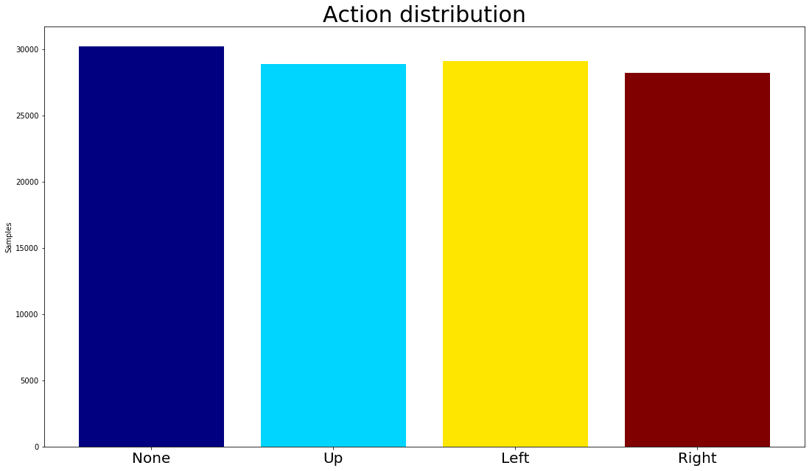
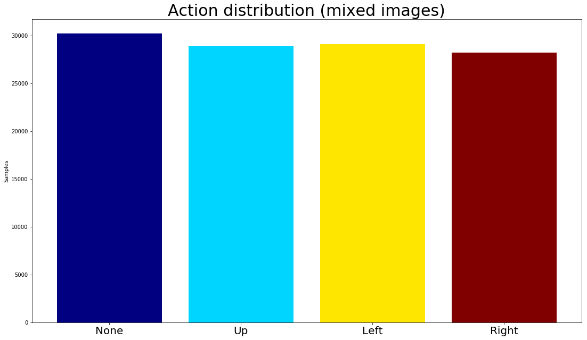

# The idea of this project is to compare the implementation of a CNN architecture and a Reinforcement Learning architecture for a classification problem, more precisely, we are trying to learn how to play the Lunar Landing videogame (Atari 1979). Moreover, we implement two strategies for the CNN architecture, the first one uses a single frame as input and the second one uses five, with the intention of bringing variables to the equation such as speed, acceleration and so on. Enjoy the lift :)


```python
import numpy as np
import pandas as pd
import keras
import cv2
import os
import glob
import re
import sys
import io
from imgaug import augmenters as iaa
import imgaug as ia
import skimage
from matplotlib import pyplot as plt
import tqdm
import random

from sklearn import metrics
from sklearn.model_selection import GridSearchCV
from sklearn.model_selection import cross_val_score
from sklearn.model_selection import train_test_split
from sklearn import preprocessing 
from sklearn.utils import shuffle

from keras.utils.np_utils import to_categorical
from keras.layers import Dense, Activation, Dropout, Conv2D, MaxPooling2D, Flatten
from keras.callbacks import ModelCheckpoint

import gym
from keras.models import Sequential
from keras.optimizers import Adam
from rl.agents.dqn import DQNAgent
from rl.policy import BoltzmannQPolicy
from rl.memory import SequentialMemory

import lunar_lander_ml_images_player as ll
```

    Using TensorFlow backend.
    

## First off we need to define a function for the preprocessing of our pictures, in our case, we will be only resizing the pictures, converting to grayscale and maybe mixed them in groups of 5 frames, then saving them on disk


```python
# sort files in correct order
def sorted_aphanumeric(data):
    convert = lambda text: int(text) if text.isdigit() else text.lower()
    alphanum_key = lambda key: [ convert(c) for c in re.split('([0-9]+)', key) ] 
    return sorted(data, key=alphanum_key)

def prepare_images(path_read, path_write, mix=False):
    """1) Convert to grayscale, 2) Shrink, 3) Prepare groups of 5 frames??
    path_read: string, path to images to prepare
    path_write: string, path to write new transformed images
    mix: boolean, mixes a sequence of 5 images if true
    """
    HEIGHT = 84
    WIDTH = 84
    
    filenames = sorted_aphanumeric(os.listdir(path_read))
    
    for i, filename in enumerate(tqdm.tqdm(filenames)):
        # image in color
        if not mix:
            # parameter in imread: #1 = color, #0 = gray, #-1 = unchanged (alpha)
            image = cv2.imread(os.path.join(path_read,filename), 1) 
            resized_image = cv2.resize(image, (WIDTH, HEIGTH))
            cv2.imwrite(os.path.join(path_write, filename), resized_image)
        else:
            mixed_image = np.zeros(shape=(WIDTH,HEIGHT), dtype=np.uint8)
            try:
                slice_ = filenames[i:i+5]
            except:
                slice_ = filenames[i]*5
            for j, slicedfile in enumerate(slice_):
                # read image in gray scale
                image = cv2.imread(os.path.join(path_read,slicedfile), 0) 
                # resize it
                resized_image = cv2.resize(image, (WIDTH, HEIGHT))
                # add it to create sequence effect
                mixed_image += resized_image
            cv2.imwrite(os.path.join(path_write, filename), mixed_image)          
```


```python
prepare_images('LunarLanderFramesPart1/', 'transformed-frames')
```

    100%|████████████████████████████████████████████████████████████████████████████| 63671/63671 [14:40<00:00, 89.13it/s]
    

## Transformation is complete, now, we will get the action related to each picture:


```python
def get_actions(path_read, path_write):
    """Extract actions from file names (last digit before the extension)
        0 = None
        1 = Up
        2 = Left
        3 = Right
    """
    filenames = os.listdir(path_read)
    # extract action
    actions = [filename[-6] for filename in filenames]
    pd.DataFrame(actions, columns=['actions']).to_csv(path_write, index=False)
    return actions
```


```python
if not os.path.isfile('csv/actions.csv'):
    get_actions('LunarLanderFramesPart1/', 'csv/actions.csv')
```

## Once we extract our actions, we proceed to check the distribution of the classes


```python
actions = pd.read_csv('csv/actions.csv')
count = actions.groupby('actions')['actions'].count()

n = len(count)
colors = plt.cm.jet(np.linspace(0, 1, n))

fig = plt.figure()
fig.set_size_inches(18.5, 10.5)
plt.ylabel('Samples')
plt.bar(['None', "Up", "Left", "Right"], count, color=colors)
plt.xticks(fontsize =20)
plt.title("Action distribution", fontsize=30)
plt.show()
```


## Our classes are highly imbalanced, to fix this we will create new samples, these new samples will not be an exact copy of current frames (as implemented by the upsampling techniques), but instead will be an augmented version of them. First we calculate the imbalance ratio (i.e. if majority class has 10 samples, ratio= (10/samples from other classes)-1; then we use this ratio to define how many copies will be created from minority classes. 


```python
def calculate_imbalance(path_read):
    """ Calculate samples of class with max samples, then compute the ratio
    between this value and the difference of the rest of the classes. Returns a dictionary {'class': ratio difference}
    """
    imbalance = {}
    filenames = os.listdir(path_read)
    # extract action
    actions = [filename[-6] for filename in filenames]
    # get number of samples of majority class
    count = pd.DataFrame(actions, columns=['actions']).groupby('actions')['actions'].count()
    max_ = count.max()
    #for each action
    for index in count.index:
        # how many times to reach max_ samples?
        imbalance[index] =  (max_  // count[index]) - 1
    print(imbalance)
    return imbalance

def fix_class_imbalance(path_read, path_write):
    """Classes are very unbalanced, fix them by augmenting the under represented classes
    path_read: string, path to images
    unbalanced: list, numeric value corresponding to unbalanced classes [0 = None, 1 = Up, 2 = Left, 3 = Right]
    """
    images = os.listdir(path_read)
    # read an image to extract image dimensions
    im = cv2.imread(os.path.join(path_read,images[0]), 1)# parameter in imread: #1 = color, #0 = gray, #-1 = unchanged (alpha)
    width, height, channels = im.shape
    
    # which classes are imbalanced?
    print("Calculating imbalances ratio...")
    imbalance = calculate_imbalance(path_read)
    imbalanced_filenames = []
    for i, image in enumerate(images):
        # select those files from imbalanced classes (all classes expect majority class)
        if imbalance[image[-6]] != 0:
            imbalanced_filenames.append(image)
    
    # multiply list by deficit ratio (imbalance)
    filtered_by_ratio = []
    print("Multiplying filenames by ratio imbalance...")
    for key in imbalance:
        # select files from same class
        filtered = [file for file in imbalanced_filenames if key +'.jpeg' in file]
        # append files times deficit value
        filtered_by_ratio.append(filtered*imbalance[key])
    # list of lists to a single list
    filtered_and_sorted = [item for sublist in filtered_by_ratio for item in sublist]
    
    # define numpy array place holder
    np_images = np.zeros(shape=(len(filtered_and_sorted),width,height, channels), dtype=np.uint8)
    print(np_images.shape)

    # read imbalanced files and save then in np array placeholder
    print("Reading images to transform...")
    for i, image in enumerate(filtered_and_sorted):
        np_images[i] = cv2.imread(os.path.join(path_read, image), 1) # parameter in imread: #1 = color, #0 = gray, #-1 = unchanged (alpha)
        
    ia.seed(1)
    # define transformations
    seq = iaa.Sequential(
        [
            iaa.Sometimes(0.2,iaa.Sharpen(alpha=(0, 1.0), lightness=(0.75, 1.5))),
            iaa.AdditiveGaussianNoise(loc=0, scale=(0.0, 0.05*255), per_channel=0.5),
        ], random_order=True) # apply augmenters in random order
    
    print("Starting transformation...")
    images_aug = seq.augment_images(np_images)

    # save augmented images
    counter = 0
    print("Saving transformed files ...")
    for i, filename in enumerate(tqdm.tqdm(filtered_and_sorted)):
        if i > 0:
            # next file belongs to different class?
            if filtered_and_sorted[i-1][-6] != filename[-6]:
                counter = 0
        cv2.imwrite(path_write + str(counter).zfill(5) + '_' + filename[-6] + '.jpeg', images_aug[i])
        counter += 1
```


```python
if not os.path.isfile('csv/actions_balanced.csv'):
    fix_class_imbalance('transformed-frames/', 'transformed-frames/')
    
if not os.path.isfile('csv/actions_balanced.csv'):
        get_actions('transformed-frames/', 'csv/actions_balanced.csv')
        actions = pd.read_csv('csv/actions_balanced.csv')
        count = actions.groupby('actions')['actions'].count()

        n = len(count)
        colors = plt.cm.jet(np.linspace(0, 1, n))

        fig = plt.figure()
        fig.set_size_inches(18.5, 10.5)
        plt.bar(['None', "Up", "Left", "Right"], count, color=colors)
        plt.ylabel('Samples')
        plt.xticks(fontsize =20)
        plt.title("Action distribution", fontsize=30)
        plt.show()
```





## We now have a more even distribution. Images have been saved on disk. Now, it's time to split and prepare our data for training.


```python
def train_val_test(path_read_x, path_read_y):
    filenames = os.listdir(path_read_x)
    target = pd.read_csv(path_read_y)
    
    # here the X splits are filenames, y splits are actual class numbers
    X_train_val, X_test, y_train_val, y_test = train_test_split(filenames, target, random_state=0, test_size = 0.30, train_size = 0.7)
    X_train, X_val, y_train, y_val = train_test_split(X_train_val, y_train_val, random_state=0, test_size = 0.20, train_size = 0.8)
    
    # first image for placeholder
    image = cv2.imread(os.path.join(path_read_x,filenames[0]), 1)
    width, height, channel = image.shape
    
    # define placeholders
    X_train_np = np.zeros(shape = (len(X_train), width, height, channel ), dtype=np.uint8)
    X_val_np = np.zeros(shape = (len(X_val), width, height, channel ), dtype=np.uint8)
    X_test_np = np.zeros(shape = (len(X_test), width, height, channel), dtype=np.uint8)

    # fill up the placeholders
    for i, image in enumerate(tqdm.tqdm(X_train)):
        X_train_np[i] = cv2.imread(os.path.join(path_read_x,image), 1)
    
    for i, image in enumerate(tqdm.tqdm(X_val)):
        X_val_np[i] = cv2.imread(os.path.join(path_read_x,image), 1)
    
    for i, image in enumerate(tqdm.tqdm(X_test)):
        X_test_np[i] = cv2.imread(os.path.join(path_read_x,image), 1)


    # Convert class vectors to binary class matrices.
    num_classes = 4
    
    y_train_wide = keras.utils.to_categorical(y_train, num_classes)
    y_val_wide = keras.utils.to_categorical(y_val, num_classes)
    y_test_wide = keras.utils.to_categorical(y_test, num_classes)
    
    classes_num_label = dict()

    for idx, lbl in enumerate([0, 1, 2, 3]):
        classes_num_label[idx] = lbl
    
    return X_train_np, X_val_np, X_test_np, y_train_wide, y_val_wide, y_test_wide, y_train, y_val, y_test
```


```python
X_train, X_val, X_test, y_train_w, y_val_w, y_test_w, y_train, y_val, y_test = train_val_test('transformed-frames/', 'csv/actions_balanced.csv')
```

    100%|███████████████████████████████████████████████████████████████████████████████████████████████████████████████████████████████████████████████████████████████████████| 65149/65149 [13:35<00:00, 79.88it/s]
    100%|███████████████████████████████████████████████████████████████████████████████████████████████████████████████████████████████████████████████████████████████████████| 16288/16288 [03:23<00:00, 80.03it/s]
    100%|██████████████████████████████████████████████████████████████████████████████████████████████████████████████████████████████████████████████████████████████████████| 34902/34902 [03:00<00:00, 193.83it/s]
    

## Split and preprocessing is finished, now let's preview some images from our training set


```python
def preview_images():
    fig = plt.figure()
    fig.set_size_inches(18.5, 10.5)
    fig.suptitle("Preview images", fontsize=20)
    
    nrow = 3
    ncol = 3
    action = ["none","up","left","right"]
    for i in range(1, 10):
        index = np.argwhere(y_train_w[i]==1)[0][0]
        ax = plt.subplot("33"+str(i))
        ax.set_title(action[index], fontsize=15)
        ax.imshow(X_train[i])
```


```python
preview_images()
```


## Now, the cool part of the process, loading and building the VGG16 network. As we want to keep what the network has already learnt, we will freeze the weights up until the 17th layer, from there on we will train a dense layer with the features produced by feeding of our images through the frozen weights of VGG16.


```python
def build_VGG16(neurons_lastlayer=[100,50], activation='relu', dropout=0.2):
    """Loads the VGG16 network and modifies it so that a new dense layer on top is trainable
    """
    NUM_OF_CLASSES = 4
    
    width, height, channel = X_train[0].shape
    shape = (width, height, channel)
    # build the VGG16 network
    # network requires input shape to be a tuple of three numbers, channel numbers have to be three as well.
    vgg16_model = keras.applications.VGG16(weights='imagenet', include_top=False, input_shape = shape)
    display(vgg16_model.summary())
    vgg16_last_layer = vgg16_model.output

    # build a classifier model to put on top of the VGG16 model
    x1 = Flatten()(vgg16_last_layer)
    x2 = Dense(neurons_lastlayer[0], activation=activation)(x1)
    x3 = Dropout(dropout)(x2)
    x4 = Dense(neurons_lastlayer[1], activation=activation)(x3)
    x5 = Dropout(dropout)(x4)
    final_layer = Dense(NUM_OF_CLASSES, activation = 'softmax')(x5)

    # Assemble the full model out of both parts
    full_model = keras.Model(vgg16_model.input, final_layer)

    # set the first 17 layers (up to the last conv block) to non-trainable (weights will not be updated)
    for layer in full_model.layers[:17]:
        layer.trainable = False

    # compile the model with a SGD/momentum optimizer
    # and a very slow learning rate.
    full_model.compile(loss='binary_crossentropy',
                  optimizer=keras.optimizers.SGD(lr=1e-4, momentum=0.9),
                  metrics=['accuracy'])

    full_model.summary()
    return full_model
    
```


```python
full_model = build_VGG16()
```

    _________________________________________________________________
    Layer (type)                 Output Shape              Param #   
    =================================================================
    input_2 (InputLayer)         (None, 84, 84, 3)         0         
    _________________________________________________________________
    block1_conv1 (Conv2D)        (None, 84, 84, 64)        1792      
    _________________________________________________________________
    block1_conv2 (Conv2D)        (None, 84, 84, 64)        36928     
    _________________________________________________________________
    block1_pool (MaxPooling2D)   (None, 42, 42, 64)        0         
    _________________________________________________________________
    block2_conv1 (Conv2D)        (None, 42, 42, 128)       73856     
    _________________________________________________________________
    block2_conv2 (Conv2D)        (None, 42, 42, 128)       147584    
    _________________________________________________________________
    block2_pool (MaxPooling2D)   (None, 21, 21, 128)       0         
    _________________________________________________________________
    block3_conv1 (Conv2D)        (None, 21, 21, 256)       295168    
    _________________________________________________________________
    block3_conv2 (Conv2D)        (None, 21, 21, 256)       590080    
    _________________________________________________________________
    block3_conv3 (Conv2D)        (None, 21, 21, 256)       590080    
    _________________________________________________________________
    block3_pool (MaxPooling2D)   (None, 10, 10, 256)       0         
    _________________________________________________________________
    block4_conv1 (Conv2D)        (None, 10, 10, 512)       1180160   
    _________________________________________________________________
    block4_conv2 (Conv2D)        (None, 10, 10, 512)       2359808   
    _________________________________________________________________
    block4_conv3 (Conv2D)        (None, 10, 10, 512)       2359808   
    _________________________________________________________________
    block4_pool (MaxPooling2D)   (None, 5, 5, 512)         0         
    _________________________________________________________________
    block5_conv1 (Conv2D)        (None, 5, 5, 512)         2359808   
    _________________________________________________________________
    block5_conv2 (Conv2D)        (None, 5, 5, 512)         2359808   
    _________________________________________________________________
    block5_conv3 (Conv2D)        (None, 5, 5, 512)         2359808   
    _________________________________________________________________
    block5_pool (MaxPooling2D)   (None, 2, 2, 512)         0         
    =================================================================
    Total params: 14,714,688
    Trainable params: 14,714,688
    Non-trainable params: 0
    _________________________________________________________________
    


    None


    _________________________________________________________________
    Layer (type)                 Output Shape              Param #   
    =================================================================
    input_2 (InputLayer)         (None, 84, 84, 3)         0         
    _________________________________________________________________
    block1_conv1 (Conv2D)        (None, 84, 84, 64)        1792      
    _________________________________________________________________
    block1_conv2 (Conv2D)        (None, 84, 84, 64)        36928     
    _________________________________________________________________
    block1_pool (MaxPooling2D)   (None, 42, 42, 64)        0         
    _________________________________________________________________
    block2_conv1 (Conv2D)        (None, 42, 42, 128)       73856     
    _________________________________________________________________
    block2_conv2 (Conv2D)        (None, 42, 42, 128)       147584    
    _________________________________________________________________
    block2_pool (MaxPooling2D)   (None, 21, 21, 128)       0         
    _________________________________________________________________
    block3_conv1 (Conv2D)        (None, 21, 21, 256)       295168    
    _________________________________________________________________
    block3_conv2 (Conv2D)        (None, 21, 21, 256)       590080    
    _________________________________________________________________
    block3_conv3 (Conv2D)        (None, 21, 21, 256)       590080    
    _________________________________________________________________
    block3_pool (MaxPooling2D)   (None, 10, 10, 256)       0         
    _________________________________________________________________
    block4_conv1 (Conv2D)        (None, 10, 10, 512)       1180160   
    _________________________________________________________________
    block4_conv2 (Conv2D)        (None, 10, 10, 512)       2359808   
    _________________________________________________________________
    block4_conv3 (Conv2D)        (None, 10, 10, 512)       2359808   
    _________________________________________________________________
    block4_pool (MaxPooling2D)   (None, 5, 5, 512)         0         
    _________________________________________________________________
    block5_conv1 (Conv2D)        (None, 5, 5, 512)         2359808   
    _________________________________________________________________
    block5_conv2 (Conv2D)        (None, 5, 5, 512)         2359808   
    _________________________________________________________________
    block5_conv3 (Conv2D)        (None, 5, 5, 512)         2359808   
    _________________________________________________________________
    block5_pool (MaxPooling2D)   (None, 2, 2, 512)         0         
    _________________________________________________________________
    flatten_2 (Flatten)          (None, 2048)              0         
    _________________________________________________________________
    dense_4 (Dense)              (None, 100)               204900    
    _________________________________________________________________
    dropout_3 (Dropout)          (None, 100)               0         
    _________________________________________________________________
    dense_5 (Dense)              (None, 50)                5050      
    _________________________________________________________________
    dropout_4 (Dropout)          (None, 50)                0         
    _________________________________________________________________
    dense_6 (Dense)              (None, 4)                 204       
    =================================================================
    Total params: 14,924,842
    Trainable params: 2,569,962
    Non-trainable params: 12,354,880
    _________________________________________________________________
    

## The model is loaded and ready to be trained. Now, we setup fitting scheme, we will use checkpoints to callback to the best set of parameters once training is done.


```python
batch_size = 128
epochs = 25

# Set up the callback to save the best model based on validaion data - notebook 2.2 needs to be run first.
best_weights_filepath = 'weights/best_weights.hdf5'
mcp = ModelCheckpoint(best_weights_filepath, monitor="val_loss", save_best_only=True, save_weights_only=False)

history = full_model.fit(X_train, y_train_w, batch_size=batch_size, epochs=epochs, 
                         verbose = 2, validation_data=(X_val, y_val_w), shuffle=True, callbacks=[mcp])

#reload best weights
full_model.load_weights(best_weights_filepath)
```

    Train on 65149 samples, validate on 16288 samples
    Epoch 1/25
     - 92s - loss: 0.5332 - acc: 0.7845 - val_loss: 0.3364 - val_acc: 0.8438
    Epoch 2/25
     - 91s - loss: 0.3708 - acc: 0.8284 - val_loss: 0.3041 - val_acc: 0.8615
    Epoch 3/25
     - 91s - loss: 0.3381 - acc: 0.8443 - val_loss: 0.2896 - val_acc: 0.8707
    Epoch 4/25
     - 91s - loss: 0.3174 - acc: 0.8551 - val_loss: 0.2693 - val_acc: 0.8795
    Epoch 5/25
     - 91s - loss: 0.3017 - acc: 0.8631 - val_loss: 0.2561 - val_acc: 0.8865
    Epoch 6/25
     - 91s - loss: 0.2895 - acc: 0.8690 - val_loss: 0.2507 - val_acc: 0.8882
    Epoch 7/25
     - 91s - loss: 0.2798 - acc: 0.8736 - val_loss: 0.2395 - val_acc: 0.8948
    Epoch 8/25
     - 91s - loss: 0.2723 - acc: 0.8775 - val_loss: 0.2343 - val_acc: 0.8985
    Epoch 9/25
     - 91s - loss: 0.2635 - acc: 0.8817 - val_loss: 0.2317 - val_acc: 0.8979
    Epoch 10/25
     - 91s - loss: 0.2572 - acc: 0.8853 - val_loss: 0.2227 - val_acc: 0.9029
    Epoch 11/25
     - 91s - loss: 0.2503 - acc: 0.8882 - val_loss: 0.2199 - val_acc: 0.9040
    Epoch 12/25
     - 91s - loss: 0.2449 - acc: 0.8919 - val_loss: 0.2148 - val_acc: 0.9059
    Epoch 13/25
     - 91s - loss: 0.2400 - acc: 0.8934 - val_loss: 0.2134 - val_acc: 0.9066
    Epoch 14/25
     - 91s - loss: 0.2342 - acc: 0.8959 - val_loss: 0.2122 - val_acc: 0.9088
    Epoch 15/25
     - 91s - loss: 0.2318 - acc: 0.8978 - val_loss: 0.2059 - val_acc: 0.9097
    Epoch 16/25
     - 91s - loss: 0.2277 - acc: 0.8991 - val_loss: 0.2044 - val_acc: 0.9121
    Epoch 17/25
     - 91s - loss: 0.2240 - acc: 0.9007 - val_loss: 0.2004 - val_acc: 0.9114
    Epoch 18/25
     - 91s - loss: 0.2214 - acc: 0.9017 - val_loss: 0.1979 - val_acc: 0.9131
    Epoch 19/25
     - 91s - loss: 0.2182 - acc: 0.9028 - val_loss: 0.1995 - val_acc: 0.9145
    Epoch 20/25
     - 91s - loss: 0.2157 - acc: 0.9041 - val_loss: 0.1950 - val_acc: 0.9138
    Epoch 21/25
     - 91s - loss: 0.2127 - acc: 0.9054 - val_loss: 0.1941 - val_acc: 0.9156
    Epoch 22/25
     - 91s - loss: 0.2108 - acc: 0.9067 - val_loss: 0.1936 - val_acc: 0.9134
    Epoch 23/25
     - 91s - loss: 0.2067 - acc: 0.9084 - val_loss: 0.1902 - val_acc: 0.9154
    Epoch 24/25
     - 91s - loss: 0.2048 - acc: 0.9091 - val_loss: 0.1902 - val_acc: 0.9159
    Epoch 25/25
     - 91s - loss: 0.2048 - acc: 0.9094 - val_loss: 0.1886 - val_acc: 0.9169
    

## Training is finished, let's look at the loss graphs for the training and validation sets.


```python
loss = history.history['loss']
val_loss = history.history['val_loss']

fig = plt.figure()
fig.set_size_inches(18.5, 10.5)
plt.xlabel('Epochs')
plt.ylabel('Loss')
plt.plot(loss, 'blue', label='Training Loss')
plt.plot(val_loss, 'green', label='Validation Loss')
plt.xticks(range(0,epochs)[0::2])
plt.legend()
plt.show()
```


## But, how well did our model do? Not so great, class 2 is too low on precision, we can see the miss classification in our confussion matrix, it could not learn to differentiate well between class 0 and class 2.


```python
# Make a set of predictions for the validation data
pred = np.argmax(full_model.predict(X_val),axis=1)

# Print performance details
print(metrics.classification_report(y_val, pred))

print("Confusion matrix")
print(metrics.confusion_matrix(y_val, pred))
```

                  precision    recall  f1-score   support
    
               0       0.87      0.64      0.74      4139
               1       0.95      0.89      0.92      4041
               2       0.67      0.93      0.78      4130
               3       0.95      0.89      0.92      3978
    
       micro avg       0.84      0.84      0.84     16288
       macro avg       0.86      0.84      0.84     16288
    weighted avg       0.86      0.84      0.84     16288
    
    Confusion matrix
    [[2659   18 1443   19]
     [  74 3585  219  163]
     [ 272   16 3835    7]
     [  58  144  249 3527]]
    

## Now, let's see how we do in our test set


```python
# Make a set of predictions for the validation data
pred = np.argmax(full_model.predict(X_test),axis=1)

# Print performance details
print(metrics.classification_report(y_test, pred))

print("Confusion matrix")
print(metrics.confusion_matrix(y_test, pred))
```

                  precision    recall  f1-score   support
    
               0       0.87      0.64      0.74      9065
               1       0.95      0.89      0.92      8626
               2       0.67      0.93      0.78      8788
               3       0.95      0.89      0.92      8423
    
       micro avg       0.84      0.84      0.84     34902
       macro avg       0.86      0.84      0.84     34902
    weighted avg       0.86      0.84      0.84     34902
    
    Confusion matrix
    [[5824   46 3156   39]
     [ 177 7695  444  310]
     [ 533   40 8200   15]
     [ 152  286  524 7461]]
    

## Some examples of good and bad predictions:


```python
def preview_results(mode='correct'):
    fig = plt.figure()
    fig.set_size_inches(18.5, 10.5)
    nrow = 3
    ncol = 3
    action = ["none","up","left","right"]
    
    if mode == 'correct':
    
        correct_prediction = []
        index_correct = []
        i = 0
    
        while (len(correct_prediction)<10):
            if pred[i] == y_test.values[i][0]:
                # class
                correct_prediction.append(y_test.values[i][0])
                # index of class stored
                index_correct.append(i)
            i += 1
    
    if mode == 'incorrect':
    
        correct_prediction = []
        index_correct = []
        i = 0
    
        while (len(correct_prediction)<10):
            if pred[i] != y_test.values[i][0]:
                # class
                correct_prediction.append(y_test.values[i][0])
                # index of class stored
                index_correct.append(i)
            i += 1
        
    for i in range(1,10):
        index = correct_prediction[i]
        ax = plt.subplot("33"+str(i))
        ax.set_title(action[index], fontsize=15)
        ax.imshow(X_test[index_correct[i]])

    fig.suptitle("Preview "+ mode +" predictions", fontsize=20)
```


```python
preview_results('correct')
```


```python
preview_results('incorrect')
```


# WHAT IF...?


# What if instead of using a single frame we use a sequence of frames? Maybe the model can capture variables such as speed or acceleration. Let's try this strategy.


```python
# read images in gray scale and resize them
# mix five frames together (add the matrix values)
    # each mixed sequence will have a class name equals to that of the main one.
# once mixing is finished, solve the class imbalance issue.
```

## First, we prepare our images: transform them to grayscale, resize them to 84x84 and mixed a sequence of 5 frames together


```python
prepare_images('LunarLanderFramesPart1/', 'mixed/', True)
```

    100%|████████████████████████████████████████████████████████████████████████████| 63671/63671 [26:05<00:00, 40.68it/s]
    

## We repeat the process as in the previous strategy:
### Fix the class imbalance, split the data set into train, eval and test sets and train the model.


```python
if not os.path.isfile('csv/actions_mixed_balanced.csv'):
    fix_class_imbalance('mixed/', 'mixed/')
    
if not os.path.isfile('csv/actions_mixed_balanced.csv'):
    get_actions('mixed/', 'csv/actions_mixed_balanced.csv')
    actions = pd.read_csv('csv/actions_mixed_balanced.csv')
    count = actions.groupby('actions')['actions'].count()

    n = len(count)
    colors = plt.cm.jet(np.linspace(0, 1, n))

    fig = plt.figure()
    fig.set_size_inches(18.5, 10.5)
    plt.bar(['None', "Up", "Left", "Right"], count, color=colors)
    plt.ylabel('Samples')
    plt.xticks(fontsize =20)
    plt.title("Action distribution (mixed images)", fontsize=30)
    plt.show()
```





```python
X_train, X_val, X_test, y_train_w, y_val_w, y_test_w, y_train, y_val, y_test = train_val_test('mixed/', 'csv/actions_mixed_balanced.csv')
```

    100%|███████████████████████████████████████████████████████████████████████████████████████████████████████████████████████████████████████████████████████████████████████| 65149/65149 [15:36<00:00, 69.59it/s]
    100%|███████████████████████████████████████████████████████████████████████████████████████████████████████████████████████████████████████████████████████████████████████| 16288/16288 [03:52<00:00, 69.95it/s]
    100%|███████████████████████████████████████████████████████████████████████████████████████████████████████████████████████████████████████████████████████████████████████| 34902/34902 [08:19<00:00, 69.89it/s]
    

## Now, let's take a look to the resulting images from our training set


```python
preview_images()
```


## Build a new model and set it up for training.


```python
full_model_mixed = build_VGG16()

batch_size = 128
epochs = 25

# Set up the callback to save the best model based on validaion data - notebook 2.2 needs to be run first.
best_weights_filepath = 'weights/best_weights_mixed.hdf5'
mcp = ModelCheckpoint(best_weights_filepath, monitor="val_loss", save_best_only=True, save_weights_only=False)

history = full_model_mixed.fit(X_train, y_train_w, batch_size=batch_size, epochs=epochs, 
                         verbose = 2, validation_data=(X_val, y_val_w), shuffle=True, callbacks=[mcp])

#reload best weights
full_model_mixed.load_weights(best_weights_filepath)
```

    _________________________________________________________________
    Layer (type)                 Output Shape              Param #   
    =================================================================
    input_4 (InputLayer)         (None, 84, 84, 3)         0         
    _________________________________________________________________
    block1_conv1 (Conv2D)        (None, 84, 84, 64)        1792      
    _________________________________________________________________
    block1_conv2 (Conv2D)        (None, 84, 84, 64)        36928     
    _________________________________________________________________
    block1_pool (MaxPooling2D)   (None, 42, 42, 64)        0         
    _________________________________________________________________
    block2_conv1 (Conv2D)        (None, 42, 42, 128)       73856     
    _________________________________________________________________
    block2_conv2 (Conv2D)        (None, 42, 42, 128)       147584    
    _________________________________________________________________
    block2_pool (MaxPooling2D)   (None, 21, 21, 128)       0         
    _________________________________________________________________
    block3_conv1 (Conv2D)        (None, 21, 21, 256)       295168    
    _________________________________________________________________
    block3_conv2 (Conv2D)        (None, 21, 21, 256)       590080    
    _________________________________________________________________
    block3_conv3 (Conv2D)        (None, 21, 21, 256)       590080    
    _________________________________________________________________
    block3_pool (MaxPooling2D)   (None, 10, 10, 256)       0         
    _________________________________________________________________
    block4_conv1 (Conv2D)        (None, 10, 10, 512)       1180160   
    _________________________________________________________________
    block4_conv2 (Conv2D)        (None, 10, 10, 512)       2359808   
    _________________________________________________________________
    block4_conv3 (Conv2D)        (None, 10, 10, 512)       2359808   
    _________________________________________________________________
    block4_pool (MaxPooling2D)   (None, 5, 5, 512)         0         
    _________________________________________________________________
    block5_conv1 (Conv2D)        (None, 5, 5, 512)         2359808   
    _________________________________________________________________
    block5_conv2 (Conv2D)        (None, 5, 5, 512)         2359808   
    _________________________________________________________________
    block5_conv3 (Conv2D)        (None, 5, 5, 512)         2359808   
    _________________________________________________________________
    block5_pool (MaxPooling2D)   (None, 2, 2, 512)         0         
    =================================================================
    Total params: 14,714,688
    Trainable params: 14,714,688
    Non-trainable params: 0
    _________________________________________________________________
    


    None


    _________________________________________________________________
    Layer (type)                 Output Shape              Param #   
    =================================================================
    input_4 (InputLayer)         (None, 84, 84, 3)         0         
    _________________________________________________________________
    block1_conv1 (Conv2D)        (None, 84, 84, 64)        1792      
    _________________________________________________________________
    block1_conv2 (Conv2D)        (None, 84, 84, 64)        36928     
    _________________________________________________________________
    block1_pool (MaxPooling2D)   (None, 42, 42, 64)        0         
    _________________________________________________________________
    block2_conv1 (Conv2D)        (None, 42, 42, 128)       73856     
    _________________________________________________________________
    block2_conv2 (Conv2D)        (None, 42, 42, 128)       147584    
    _________________________________________________________________
    block2_pool (MaxPooling2D)   (None, 21, 21, 128)       0         
    _________________________________________________________________
    block3_conv1 (Conv2D)        (None, 21, 21, 256)       295168    
    _________________________________________________________________
    block3_conv2 (Conv2D)        (None, 21, 21, 256)       590080    
    _________________________________________________________________
    block3_conv3 (Conv2D)        (None, 21, 21, 256)       590080    
    _________________________________________________________________
    block3_pool (MaxPooling2D)   (None, 10, 10, 256)       0         
    _________________________________________________________________
    block4_conv1 (Conv2D)        (None, 10, 10, 512)       1180160   
    _________________________________________________________________
    block4_conv2 (Conv2D)        (None, 10, 10, 512)       2359808   
    _________________________________________________________________
    block4_conv3 (Conv2D)        (None, 10, 10, 512)       2359808   
    _________________________________________________________________
    block4_pool (MaxPooling2D)   (None, 5, 5, 512)         0         
    _________________________________________________________________
    block5_conv1 (Conv2D)        (None, 5, 5, 512)         2359808   
    _________________________________________________________________
    block5_conv2 (Conv2D)        (None, 5, 5, 512)         2359808   
    _________________________________________________________________
    block5_conv3 (Conv2D)        (None, 5, 5, 512)         2359808   
    _________________________________________________________________
    block5_pool (MaxPooling2D)   (None, 2, 2, 512)         0         
    _________________________________________________________________
    flatten_4 (Flatten)          (None, 2048)              0         
    _________________________________________________________________
    dense_10 (Dense)             (None, 100)               204900    
    _________________________________________________________________
    dropout_7 (Dropout)          (None, 100)               0         
    _________________________________________________________________
    dense_11 (Dense)             (None, 50)                5050      
    _________________________________________________________________
    dropout_8 (Dropout)          (None, 50)                0         
    _________________________________________________________________
    dense_12 (Dense)             (None, 4)                 204       
    =================================================================
    Total params: 14,924,842
    Trainable params: 2,569,962
    Non-trainable params: 12,354,880
    _________________________________________________________________
    Train on 65149 samples, validate on 16288 samples
    Epoch 1/25
     - 91s - loss: 0.5547 - acc: 0.7659 - val_loss: 0.3584 - val_acc: 0.8283
    Epoch 2/25
     - 91s - loss: 0.3907 - acc: 0.8131 - val_loss: 0.3235 - val_acc: 0.8498
    Epoch 3/25
     - 91s - loss: 0.3613 - acc: 0.8279 - val_loss: 0.3114 - val_acc: 0.8566
    Epoch 4/25
     - 91s - loss: 0.3425 - acc: 0.8382 - val_loss: 0.2921 - val_acc: 0.8692
    Epoch 5/25
     - 91s - loss: 0.3254 - acc: 0.8472 - val_loss: 0.2823 - val_acc: 0.8735
    Epoch 6/25
     - 91s - loss: 0.3127 - acc: 0.8543 - val_loss: 0.2727 - val_acc: 0.8756
    Epoch 7/25
     - 91s - loss: 0.3036 - acc: 0.8601 - val_loss: 0.2652 - val_acc: 0.8809
    Epoch 8/25
     - 91s - loss: 0.2934 - acc: 0.8658 - val_loss: 0.2560 - val_acc: 0.8865
    Epoch 9/25
     - 91s - loss: 0.2861 - acc: 0.8697 - val_loss: 0.2495 - val_acc: 0.8919
    Epoch 10/25
     - 91s - loss: 0.2785 - acc: 0.8733 - val_loss: 0.2468 - val_acc: 0.8902
    Epoch 11/25
     - 91s - loss: 0.2704 - acc: 0.8780 - val_loss: 0.2394 - val_acc: 0.8957
    Epoch 12/25
     - 91s - loss: 0.2648 - acc: 0.8804 - val_loss: 0.2359 - val_acc: 0.8977
    Epoch 13/25
     - 91s - loss: 0.2586 - acc: 0.8838 - val_loss: 0.2340 - val_acc: 0.8982
    Epoch 14/25
     - 91s - loss: 0.2543 - acc: 0.8855 - val_loss: 0.2311 - val_acc: 0.8964
    Epoch 15/25
     - 91s - loss: 0.2490 - acc: 0.8885 - val_loss: 0.2267 - val_acc: 0.8983
    Epoch 16/25
     - 91s - loss: 0.2445 - acc: 0.8901 - val_loss: 0.2215 - val_acc: 0.9018
    Epoch 17/25
     - 91s - loss: 0.2418 - acc: 0.8913 - val_loss: 0.2192 - val_acc: 0.9033
    Epoch 18/25
     - 91s - loss: 0.2371 - acc: 0.8941 - val_loss: 0.2160 - val_acc: 0.9066
    Epoch 19/25
     - 91s - loss: 0.2339 - acc: 0.8954 - val_loss: 0.2121 - val_acc: 0.9064
    Epoch 20/25
     - 91s - loss: 0.2306 - acc: 0.8970 - val_loss: 0.2133 - val_acc: 0.9081
    Epoch 21/25
     - 91s - loss: 0.2273 - acc: 0.8987 - val_loss: 0.2086 - val_acc: 0.9093
    Epoch 22/25
     - 91s - loss: 0.2241 - acc: 0.8998 - val_loss: 0.2106 - val_acc: 0.9091
    Epoch 23/25
     - 91s - loss: 0.2211 - acc: 0.9011 - val_loss: 0.2078 - val_acc: 0.9094
    Epoch 24/25
     - 91s - loss: 0.2181 - acc: 0.9026 - val_loss: 0.2041 - val_acc: 0.9106
    Epoch 25/25
     - 91s - loss: 0.2167 - acc: 0.9031 - val_loss: 0.2060 - val_acc: 0.9103
    

## Training is finished, let's take a look at the evolution of the losses


```python
loss = history.history['loss']
val_loss = history.history['val_loss']

fig = plt.figure()
fig.set_size_inches(18.5, 10.5)
plt.xlabel('Epochs')
plt.ylabel('Loss')
plt.plot(loss, 'blue', label='Training Loss')
plt.plot(val_loss, 'green', label='Validation Loss')
plt.xticks(range(0,epochs)[0::2])
plt.legend()
plt.show()
```


```python
# Make a set of predictions for the validation data
pred = np.argmax(full_model_mixed.predict(X_val),axis=1)

# Print performance details
print(metrics.classification_report(y_val, pred))

print("Confusion matrix")
print(metrics.confusion_matrix(y_val, pred))
```

                  precision    recall  f1-score   support
    
               0       0.83      0.64      0.73      4139
               1       0.93      0.88      0.91      4041
               2       0.66      0.91      0.77      4130
               3       0.95      0.87      0.90      3978
    
       micro avg       0.82      0.82      0.82     16288
       macro avg       0.84      0.82      0.83     16288
    weighted avg       0.84      0.82      0.82     16288
    
    Confusion matrix
    [[2666   36 1397   40]
     [  93 3560  247  141]
     [ 351   18 3745   16]
     [  83  200  254 3441]]
    


```python
# Make a set of predictions for the test data
pred = np.argmax(full_model_mixed.predict(X_test),axis=1)

# Print performance details
print(metrics.classification_report(y_test, pred))

print("Confusion matrix")
print(metrics.confusion_matrix(y_test, pred))
```

                  precision    recall  f1-score   support
    
               0       0.83      0.65      0.73      9065
               1       0.93      0.88      0.91      8626
               2       0.66      0.91      0.76      8788
               3       0.95      0.85      0.90      8423
    
       micro avg       0.82      0.82      0.82     34902
       macro avg       0.84      0.82      0.82     34902
    weighted avg       0.84      0.82      0.82     34902
    
    Confusion matrix
    [[5870   52 3072   71]
     [ 200 7625  518  283]
     [ 760   19 7989   20]
     [ 242  484  546 7151]]
    

# Comparing these results vs the results from the single frame strategy we can see that this strategy did worst than the previous one in terms of classification, however, the results are not shockingly surprising, as we are making predictions out of a single image, when in fact we learnt to predict from a sequence of images. However, this problem might be minimized as we will feed on a sequence of images, instead of a single frame to our current classifier when testing the actual performance.


```python
preview_results('correct')
```


```python
preview_results('incorrect')
```


# Reinforcement Learning Section

## Instantiate the Lunar Lander environment, build the network and train it. At the end, test the agent with the learnt parameters.


```python
def load_rl_architecture():
    
    ENV_NAME = 'LunarLander-v2'
    
    # Get the environment and extract the number of actions.
    env = gym.make(ENV_NAME)
    np.random.seed(123)
    env.seed(123)
    nb_actions = env.action_space.n

    # Next, we build a very simple model.
    model = Sequential()
    model.add(Flatten(input_shape=(1,) + env.observation_space.shape))
    model.add(Dense(50))
    model.add(Activation('relu'))
    model.add(Dense(30))
    model.add(Activation('relu'))
    model.add(Dense(16))
    model.add(Activation('relu'))
    model.add(Dense(nb_actions))
    model.add(Activation('linear'))
    print(model.summary())

    # Finally, we configure and compile our agent. You can use every built-in Keras optimizer and
    # even the metrics!
    memory = SequentialMemory(limit=50000, window_length=1)
    policy = BoltzmannQPolicy()
    dqn = DQNAgent(model=model, nb_actions=nb_actions, memory=memory, nb_steps_warmup=10,
                   target_model_update=1e-2, policy=policy)
    dqn.compile(Adam(lr=1e-3), metrics=['mae'])
    return dqn, env
```


```python
dqn, env = load_rl_architecture()
ENV_NAME = 'LunarLander-v2'
# Okay, now it's time to learn something! We visualize the training here for show, but this
# slows down training quite a lot. You can always safely abort the training prematurely using
# Ctrl + C.
dqn.fit(env, nb_steps=100000, visualize=True, verbose=2)

# After training is done, we save the final weights.
dqn.save_weights('weights/dqn_{}_weights.h5f'.format(ENV_NAME), overwrite=True)

# Finally, evaluate our algorithm for 50 episodes.
dqn.test(env, nb_episodes=50, visualize=True)

```

    _________________________________________________________________
    Layer (type)                 Output Shape              Param #   
    =================================================================
    flatten_1 (Flatten)          (None, 8)                 0         
    _________________________________________________________________
    dense_1 (Dense)              (None, 50)                450       
    _________________________________________________________________
    activation_1 (Activation)    (None, 50)                0         
    _________________________________________________________________
    dense_2 (Dense)              (None, 30)                1530      
    _________________________________________________________________
    activation_2 (Activation)    (None, 30)                0         
    _________________________________________________________________
    dense_3 (Dense)              (None, 16)                496       
    _________________________________________________________________
    activation_3 (Activation)    (None, 16)                0         
    _________________________________________________________________
    dense_4 (Dense)              (None, 4)                 68        
    _________________________________________________________________
    activation_4 (Activation)    (None, 4)                 0         
    =================================================================
    Total params: 2,544
    Trainable params: 2,544
    Non-trainable params: 0
    _________________________________________________________________
    None
    Training for 100000 steps ...
    

    c:\users\ruben\docume~1\ucd\18-19_~2\comp47~1\ml_env\lib\site-packages\rl\memory.py:39: UserWarning: Not enough entries to sample without replacement. Consider increasing your warm-up phase to avoid oversampling!
      warnings.warn('Not enough entries to sample without replacement. Consider increasing your warm-up phase to avoid oversampling!')
    

        78/100000: episode: 1, duration: 5.240s, episode steps: 78, steps per second: 15, episode reward: -94.585, mean reward: -1.213 [-100.000, 14.080], mean action: 1.705 [0.000, 3.000], mean observation: 0.080 [-1.480, 1.399], loss: 1.655223, mean_absolute_error: 0.478007, mean_q: 0.266833
       160/100000: episode: 2, duration: 1.364s, episode steps: 82, steps per second: 60, episode reward: -367.474, mean reward: -4.481 [-100.000, 0.708], mean action: 1.585 [0.000, 3.000], mean observation: 0.292 [-1.282, 1.806], loss: 43.903004, mean_absolute_error: 1.030369, mean_q: 0.926637
       235/100000: episode: 3, duration: 1.248s, episode steps: 75, steps per second: 60, episode reward: -346.710, mean reward: -4.623 [-100.000, 3.947], mean action: 1.653 [0.000, 3.000], mean observation: 0.022 [-4.779, 1.622], loss: 63.828690, mean_absolute_error: 2.333868, mean_q: -0.083194
       468/100000: episode: 4, duration: 3.881s, episode steps: 233, steps per second: 60, episode reward: -202.234, mean reward: -0.868 [-100.000, 9.574], mean action: 1.567 [0.000, 3.000], mean observation: 0.119 [-1.465, 1.403], loss: 37.815796, mean_absolute_error: 3.887509, mean_q: -0.626614
       581/100000: episode: 5, duration: 1.882s, episode steps: 113, steps per second: 60, episode reward: -144.868, mean reward: -1.282 [-100.000, 7.434], mean action: 1.770 [0.000, 3.000], mean observation: 0.024 [-0.974, 3.535], loss: 29.739073, mean_absolute_error: 4.147604, mean_q: -0.315538
       740/100000: episode: 6, duration: 2.646s, episode steps: 159, steps per second: 60, episode reward: -66.546, mean reward: -0.419 [-100.000, 9.073], mean action: 1.635 [0.000, 3.000], mean observation: 0.117 [-3.377, 1.392], loss: 17.821541, mean_absolute_error: 4.954693, mean_q: -0.140628
       847/100000: episode: 7, duration: 1.782s, episode steps: 107, steps per second: 60, episode reward: -262.623, mean reward: -2.454 [-100.000, 10.621], mean action: 1.748 [0.000, 3.000], mean observation: 0.235 [-1.575, 4.119], loss: 15.407992, mean_absolute_error: 5.219170, mean_q: 0.965483
       962/100000: episode: 8, duration: 1.913s, episode steps: 115, steps per second: 60, episode reward: -120.595, mean reward: -1.049 [-100.000, 10.373], mean action: 1.643 [0.000, 3.000], mean observation: 0.047 [-1.229, 2.853], loss: 21.413191, mean_absolute_error: 6.290402, mean_q: 1.231818
      1110/100000: episode: 9, duration: 2.467s, episode steps: 148, steps per second: 60, episode reward: 15.194, mean reward: 0.103 [-100.000, 14.500], mean action: 1.791 [0.000, 3.000], mean observation: 0.033 [-0.637, 1.385], loss: 14.907573, mean_absolute_error: 6.840449, mean_q: 1.956968
      1231/100000: episode: 10, duration: 2.014s, episode steps: 121, steps per second: 60, episode reward: -107.905, mean reward: -0.892 [-100.000, 4.625], mean action: 1.843 [0.000, 3.000], mean observation: -0.008 [-1.009, 3.348], loss: 19.023720, mean_absolute_error: 7.815130, mean_q: 2.300075
      1400/100000: episode: 11, duration: 2.815s, episode steps: 169, steps per second: 60, episode reward: -42.486, mean reward: -0.251 [-100.000, 5.942], mean action: 1.669 [0.000, 3.000], mean observation: 0.118 [-0.757, 2.727], loss: 16.129007, mean_absolute_error: 8.556323, mean_q: 2.825870
      1561/100000: episode: 12, duration: 2.680s, episode steps: 161, steps per second: 60, episode reward: -66.786, mean reward: -0.415 [-100.000, 15.371], mean action: 1.540 [0.000, 3.000], mean observation: -0.032 [-0.742, 1.458], loss: 12.910284, mean_absolute_error: 9.244790, mean_q: 2.891016
      1724/100000: episode: 13, duration: 2.715s, episode steps: 163, steps per second: 60, episode reward: -13.116, mean reward: -0.080 [-100.000, 14.773], mean action: 1.620 [0.000, 3.000], mean observation: 0.166 [-0.823, 2.421], loss: 14.885831, mean_absolute_error: 10.354947, mean_q: 3.034768
      1886/100000: episode: 14, duration: 2.699s, episode steps: 162, steps per second: 60, episode reward: -55.430, mean reward: -0.342 [-100.000, 8.251], mean action: 1.648 [0.000, 3.000], mean observation: 0.005 [-1.002, 1.871], loss: 17.590023, mean_absolute_error: 11.271637, mean_q: 2.882983
      2025/100000: episode: 15, duration: 2.315s, episode steps: 139, steps per second: 60, episode reward: -6.665, mean reward: -0.048 [-100.000, 19.863], mean action: 1.547 [0.000, 3.000], mean observation: -0.029 [-0.862, 1.809], loss: 21.548168, mean_absolute_error: 12.474604, mean_q: 2.454247
      2243/100000: episode: 16, duration: 3.630s, episode steps: 218, steps per second: 60, episode reward: -29.048, mean reward: -0.133 [-100.000, 19.714], mean action: 1.716 [0.000, 3.000], mean observation: 0.096 [-2.713, 1.525], loss: 11.142531, mean_absolute_error: 13.448415, mean_q: 1.908160
      2441/100000: episode: 17, duration: 3.298s, episode steps: 198, steps per second: 60, episode reward: 43.362, mean reward: 0.219 [-100.000, 15.196], mean action: 1.768 [0.000, 3.000], mean observation: 0.037 [-0.682, 1.450], loss: 14.184050, mean_absolute_error: 13.702408, mean_q: 2.916291
      2588/100000: episode: 18, duration: 2.448s, episode steps: 147, steps per second: 60, episode reward: -22.132, mean reward: -0.151 [-100.000, 19.631], mean action: 1.531 [0.000, 3.000], mean observation: 0.096 [-1.687, 1.393], loss: 17.580347, mean_absolute_error: 14.147529, mean_q: 3.092083
      2907/100000: episode: 19, duration: 5.314s, episode steps: 319, steps per second: 60, episode reward: 12.455, mean reward: 0.039 [-100.000, 13.885], mean action: 1.558 [0.000, 3.000], mean observation: 0.116 [-0.591, 1.525], loss: 11.600239, mean_absolute_error: 14.706293, mean_q: 4.050381
      3082/100000: episode: 20, duration: 2.914s, episode steps: 175, steps per second: 60, episode reward: -30.835, mean reward: -0.176 [-100.000, 18.900], mean action: 1.726 [0.000, 3.000], mean observation: 0.078 [-1.669, 1.398], loss: 11.635803, mean_absolute_error: 15.566802, mean_q: 4.094034
      4082/100000: episode: 21, duration: 16.661s, episode steps: 1000, steps per second: 60, episode reward: -71.544, mean reward: -0.072 [-5.870, 5.255], mean action: 1.775 [0.000, 3.000], mean observation: 0.023 [-0.570, 1.409], loss: 8.153481, mean_absolute_error: 16.617338, mean_q: 4.631436
      4312/100000: episode: 22, duration: 3.829s, episode steps: 230, steps per second: 60, episode reward: -10.728, mean reward: -0.047 [-100.000, 7.889], mean action: 1.713 [0.000, 3.000], mean observation: -0.025 [-0.859, 1.478], loss: 5.606262, mean_absolute_error: 17.402254, mean_q: 5.143651
      4443/100000: episode: 23, duration: 2.180s, episode steps: 131, steps per second: 60, episode reward: 37.217, mean reward: 0.284 [-100.000, 11.140], mean action: 1.695 [0.000, 3.000], mean observation: 0.100 [-0.743, 1.412], loss: 4.814556, mean_absolute_error: 18.136492, mean_q: 6.517039
      4690/100000: episode: 24, duration: 4.114s, episode steps: 247, steps per second: 60, episode reward: 25.596, mean reward: 0.104 [-100.000, 19.407], mean action: 1.696 [0.000, 3.000], mean observation: 0.035 [-0.849, 1.403], loss: 5.177142, mean_absolute_error: 18.868172, mean_q: 7.183980
      5030/100000: episode: 25, duration: 5.663s, episode steps: 340, steps per second: 60, episode reward: 0.283, mean reward: 0.001 [-100.000, 12.116], mean action: 1.712 [0.000, 3.000], mean observation: 0.047 [-0.765, 1.423], loss: 6.125842, mean_absolute_error: 19.420563, mean_q: 8.430383
      5496/100000: episode: 26, duration: 7.763s, episode steps: 466, steps per second: 60, episode reward: -101.245, mean reward: -0.217 [-100.000, 12.127], mean action: 1.779 [0.000, 3.000], mean observation: -0.007 [-0.542, 1.397], loss: 4.355960, mean_absolute_error: 20.152134, mean_q: 9.595497
      5953/100000: episode: 27, duration: 7.612s, episode steps: 457, steps per second: 60, episode reward: 204.264, mean reward: 0.447 [-9.074, 100.000], mean action: 1.446 [0.000, 3.000], mean observation: 0.010 [-0.660, 1.523], loss: 5.605393, mean_absolute_error: 21.367771, mean_q: 9.560315
      6245/100000: episode: 28, duration: 4.865s, episode steps: 292, steps per second: 60, episode reward: -82.223, mean reward: -0.282 [-100.000, 16.297], mean action: 1.788 [0.000, 3.000], mean observation: -0.063 [-1.047, 1.396], loss: 7.196392, mean_absolute_error: 22.377464, mean_q: 10.951176
      6697/100000: episode: 29, duration: 7.545s, episode steps: 452, steps per second: 60, episode reward: -100.535, mean reward: -0.222 [-100.000, 14.114], mean action: 1.657 [0.000, 3.000], mean observation: -0.018 [-1.068, 1.398], loss: 8.043255, mean_absolute_error: 22.859884, mean_q: 11.503370
      6981/100000: episode: 30, duration: 4.731s, episode steps: 284, steps per second: 60, episode reward: 12.316, mean reward: 0.043 [-100.000, 10.416], mean action: 1.736 [0.000, 3.000], mean observation: 0.063 [-0.605, 1.427], loss: 4.366754, mean_absolute_error: 23.126850, mean_q: 12.500676
      7549/100000: episode: 31, duration: 9.463s, episode steps: 568, steps per second: 60, episode reward: -125.338, mean reward: -0.221 [-100.000, 19.498], mean action: 1.824 [0.000, 3.000], mean observation: -0.009 [-1.049, 1.480], loss: 7.294110, mean_absolute_error: 23.794258, mean_q: 13.732470
      8549/100000: episode: 32, duration: 16.695s, episode steps: 1000, steps per second: 60, episode reward: -5.873, mean reward: -0.006 [-21.165, 22.613], mean action: 1.800 [0.000, 3.000], mean observation: 0.056 [-0.662, 1.405], loss: 6.568153, mean_absolute_error: 24.452061, mean_q: 14.314157
      9549/100000: episode: 33, duration: 16.674s, episode steps: 1000, steps per second: 60, episode reward: -16.301, mean reward: -0.016 [-22.048, 18.365], mean action: 1.832 [0.000, 3.000], mean observation: 0.039 [-0.686, 1.435], loss: 8.801104, mean_absolute_error: 24.506351, mean_q: 16.931526
     10549/100000: episode: 34, duration: 16.659s, episode steps: 1000, steps per second: 60, episode reward: -48.875, mean reward: -0.049 [-13.993, 14.516], mean action: 1.825 [0.000, 3.000], mean observation: 0.049 [-0.708, 1.411], loss: 6.005484, mean_absolute_error: 24.328192, mean_q: 20.959282
     11549/100000: episode: 35, duration: 16.660s, episode steps: 1000, steps per second: 60, episode reward: -41.992, mean reward: -0.042 [-11.950, 15.511], mean action: 1.734 [0.000, 3.000], mean observation: 0.025 [-0.590, 1.397], loss: 7.588581, mean_absolute_error: 24.220280, mean_q: 23.302238
     12549/100000: episode: 36, duration: 16.660s, episode steps: 1000, steps per second: 60, episode reward: -50.533, mean reward: -0.051 [-4.786, 4.720], mean action: 1.777 [0.000, 3.000], mean observation: 0.099 [-0.729, 1.410], loss: 8.251533, mean_absolute_error: 24.951536, mean_q: 27.246500
     13549/100000: episode: 37, duration: 16.659s, episode steps: 1000, steps per second: 60, episode reward: -32.829, mean reward: -0.033 [-5.069, 4.784], mean action: 1.810 [0.000, 3.000], mean observation: 0.132 [-0.927, 1.507], loss: 7.680722, mean_absolute_error: 25.577450, mean_q: 29.976246
     14549/100000: episode: 38, duration: 16.662s, episode steps: 1000, steps per second: 60, episode reward: -63.827, mean reward: -0.064 [-4.894, 4.362], mean action: 1.790 [0.000, 3.000], mean observation: 0.086 [-0.507, 1.397], loss: 6.248765, mean_absolute_error: 26.014080, mean_q: 31.832664
     15549/100000: episode: 39, duration: 16.657s, episode steps: 1000, steps per second: 60, episode reward: 60.065, mean reward: 0.060 [-23.747, 23.787], mean action: 1.658 [0.000, 3.000], mean observation: 0.027 [-0.676, 1.512], loss: 7.428494, mean_absolute_error: 26.663801, mean_q: 33.170563
     15788/100000: episode: 40, duration: 3.979s, episode steps: 239, steps per second: 60, episode reward: -94.028, mean reward: -0.393 [-100.000, 5.690], mean action: 1.636 [0.000, 3.000], mean observation: 0.209 [-0.607, 1.408], loss: 5.258610, mean_absolute_error: 26.612446, mean_q: 33.507809
     16788/100000: episode: 41, duration: 16.677s, episode steps: 1000, steps per second: 60, episode reward: -70.610, mean reward: -0.071 [-5.056, 4.715], mean action: 1.852 [0.000, 3.000], mean observation: 0.131 [-0.649, 1.520], loss: 7.747142, mean_absolute_error: 26.962641, mean_q: 34.167595
     17788/100000: episode: 42, duration: 16.662s, episode steps: 1000, steps per second: 60, episode reward: -1.714, mean reward: -0.002 [-19.022, 14.646], mean action: 1.699 [0.000, 3.000], mean observation: 0.020 [-0.578, 1.404], loss: 5.787479, mean_absolute_error: 26.781807, mean_q: 34.276783
     18757/100000: episode: 43, duration: 16.141s, episode steps: 969, steps per second: 60, episode reward: -263.766, mean reward: -0.272 [-100.000, 27.359], mean action: 1.543 [0.000, 3.000], mean observation: 0.061 [-1.647, 1.399], loss: 5.514292, mean_absolute_error: 26.203638, mean_q: 33.460854
     19757/100000: episode: 44, duration: 16.661s, episode steps: 1000, steps per second: 60, episode reward: 0.005, mean reward: 0.000 [-23.618, 26.269], mean action: 1.665 [0.000, 3.000], mean observation: 0.036 [-0.664, 1.391], loss: 6.510881, mean_absolute_error: 26.158669, mean_q: 33.048492
     19899/100000: episode: 45, duration: 2.363s, episode steps: 142, steps per second: 60, episode reward: 11.899, mean reward: 0.084 [-100.000, 14.580], mean action: 1.585 [0.000, 3.000], mean observation: 0.029 [-1.470, 1.453], loss: 6.350694, mean_absolute_error: 25.339836, mean_q: 31.783207
     20899/100000: episode: 46, duration: 16.660s, episode steps: 1000, steps per second: 60, episode reward: 28.333, mean reward: 0.028 [-22.856, 22.736], mean action: 1.684 [0.000, 3.000], mean observation: 0.031 [-0.690, 1.398], loss: 6.059417, mean_absolute_error: 25.627676, mean_q: 32.345432
     21899/100000: episode: 47, duration: 16.675s, episode steps: 1000, steps per second: 60, episode reward: 20.886, mean reward: 0.021 [-23.291, 22.699], mean action: 1.613 [0.000, 3.000], mean observation: 0.031 [-0.716, 1.505], loss: 5.255508, mean_absolute_error: 25.677301, mean_q: 32.139118
     22899/100000: episode: 48, duration: 16.660s, episode steps: 1000, steps per second: 60, episode reward: -101.806, mean reward: -0.102 [-21.787, 13.959], mean action: 1.653 [0.000, 3.000], mean observation: 0.078 [-0.774, 1.399], loss: 5.498784, mean_absolute_error: 25.739601, mean_q: 32.236904
     23899/100000: episode: 49, duration: 16.659s, episode steps: 1000, steps per second: 60, episode reward: -58.309, mean reward: -0.058 [-22.005, 22.423], mean action: 1.719 [0.000, 3.000], mean observation: 0.053 [-0.704, 1.407], loss: 5.275645, mean_absolute_error: 25.380211, mean_q: 31.815540
     24899/100000: episode: 50, duration: 16.661s, episode steps: 1000, steps per second: 60, episode reward: 26.813, mean reward: 0.027 [-21.168, 22.912], mean action: 1.717 [0.000, 3.000], mean observation: 0.044 [-1.451, 1.395], loss: 5.933324, mean_absolute_error: 24.932688, mean_q: 31.209023
     25899/100000: episode: 51, duration: 16.659s, episode steps: 1000, steps per second: 60, episode reward: -18.223, mean reward: -0.018 [-24.082, 22.797], mean action: 1.711 [0.000, 3.000], mean observation: 0.075 [-0.529, 1.419], loss: 5.769436, mean_absolute_error: 25.725969, mean_q: 32.686790
     26899/100000: episode: 52, duration: 16.660s, episode steps: 1000, steps per second: 60, episode reward: -32.193, mean reward: -0.032 [-22.934, 23.687], mean action: 1.758 [0.000, 3.000], mean observation: 0.079 [-0.584, 1.419], loss: 4.804567, mean_absolute_error: 25.828096, mean_q: 33.020855
     27899/100000: episode: 53, duration: 16.661s, episode steps: 1000, steps per second: 60, episode reward: -5.903, mean reward: -0.006 [-21.362, 22.276], mean action: 1.643 [0.000, 3.000], mean observation: 0.036 [-0.735, 1.389], loss: 5.643730, mean_absolute_error: 25.839596, mean_q: 33.159771
     28899/100000: episode: 54, duration: 16.659s, episode steps: 1000, steps per second: 60, episode reward: -97.977, mean reward: -0.098 [-21.905, 20.914], mean action: 1.681 [0.000, 3.000], mean observation: 0.089 [-0.428, 1.411], loss: 5.554397, mean_absolute_error: 25.886129, mean_q: 33.207840
     29899/100000: episode: 55, duration: 16.659s, episode steps: 1000, steps per second: 60, episode reward: 64.770, mean reward: 0.065 [-24.557, 23.468], mean action: 1.573 [0.000, 3.000], mean observation: 0.076 [-0.820, 1.398], loss: 4.763743, mean_absolute_error: 25.699661, mean_q: 32.925022
     30899/100000: episode: 56, duration: 16.660s, episode steps: 1000, steps per second: 60, episode reward: 46.098, mean reward: 0.046 [-24.222, 23.515], mean action: 1.676 [0.000, 3.000], mean observation: 0.100 [-0.850, 1.501], loss: 5.559831, mean_absolute_error: 25.943083, mean_q: 33.429527
     31394/100000: episode: 57, duration: 8.245s, episode steps: 495, steps per second: 60, episode reward: -295.099, mean reward: -0.596 [-100.000, 26.963], mean action: 1.717 [0.000, 3.000], mean observation: 0.112 [-0.578, 2.047], loss: 5.847774, mean_absolute_error: 25.885002, mean_q: 33.297169
     32394/100000: episode: 58, duration: 16.661s, episode steps: 1000, steps per second: 60, episode reward: 8.668, mean reward: 0.009 [-23.783, 23.933], mean action: 1.523 [0.000, 3.000], mean observation: 0.105 [-0.914, 1.404], loss: 4.892217, mean_absolute_error: 26.149612, mean_q: 33.990734
     33105/100000: episode: 59, duration: 11.844s, episode steps: 711, steps per second: 60, episode reward: -376.669, mean reward: -0.530 [-100.000, 24.825], mean action: 1.678 [0.000, 3.000], mean observation: 0.089 [-0.834, 2.268], loss: 5.600690, mean_absolute_error: 25.941223, mean_q: 33.725380
     34105/100000: episode: 60, duration: 16.661s, episode steps: 1000, steps per second: 60, episode reward: -2.080, mean reward: -0.002 [-22.445, 26.402], mean action: 1.576 [0.000, 3.000], mean observation: 0.099 [-0.850, 1.394], loss: 6.406185, mean_absolute_error: 26.175575, mean_q: 33.600700
     34217/100000: episode: 61, duration: 1.863s, episode steps: 112, steps per second: 60, episode reward: -54.512, mean reward: -0.487 [-100.000, 11.542], mean action: 1.652 [0.000, 3.000], mean observation: 0.140 [-3.105, 1.511], loss: 4.938280, mean_absolute_error: 26.180136, mean_q: 33.286892
     34284/100000: episode: 62, duration: 1.116s, episode steps: 67, steps per second: 60, episode reward: -55.049, mean reward: -0.822 [-100.000, 14.056], mean action: 1.582 [0.000, 3.000], mean observation: 0.076 [-3.406, 1.391], loss: 4.845339, mean_absolute_error: 25.840225, mean_q: 32.846687
     34359/100000: episode: 63, duration: 1.247s, episode steps: 75, steps per second: 60, episode reward: -46.344, mean reward: -0.618 [-100.000, 13.330], mean action: 1.320 [0.000, 3.000], mean observation: 0.023 [-3.450, 1.388], loss: 5.489666, mean_absolute_error: 25.645338, mean_q: 32.770229
     35359/100000: episode: 64, duration: 16.662s, episode steps: 1000, steps per second: 60, episode reward: -51.710, mean reward: -0.052 [-24.306, 42.255], mean action: 2.023 [0.000, 3.000], mean observation: 0.020 [-0.892, 1.406], loss: 6.586056, mean_absolute_error: 26.250708, mean_q: 33.616550
     36359/100000: episode: 65, duration: 16.658s, episode steps: 1000, steps per second: 60, episode reward: 94.115, mean reward: 0.094 [-21.950, 23.088], mean action: 1.462 [0.000, 3.000], mean observation: 0.089 [-0.636, 1.396], loss: 5.425662, mean_absolute_error: 26.324171, mean_q: 33.844593
     37359/100000: episode: 66, duration: 16.662s, episode steps: 1000, steps per second: 60, episode reward: -4.999, mean reward: -0.005 [-21.268, 21.558], mean action: 1.571 [0.000, 3.000], mean observation: 0.066 [-0.758, 1.395], loss: 5.536623, mean_absolute_error: 26.543245, mean_q: 33.950203
     38359/100000: episode: 67, duration: 16.658s, episode steps: 1000, steps per second: 60, episode reward: 43.854, mean reward: 0.044 [-22.019, 21.937], mean action: 1.681 [0.000, 3.000], mean observation: 0.070 [-0.876, 1.453], loss: 5.638529, mean_absolute_error: 26.968773, mean_q: 34.631462
     39359/100000: episode: 68, duration: 16.659s, episode steps: 1000, steps per second: 60, episode reward: 86.125, mean reward: 0.086 [-23.992, 23.039], mean action: 1.537 [0.000, 3.000], mean observation: 0.111 [-0.783, 1.390], loss: 4.654829, mean_absolute_error: 26.855883, mean_q: 34.528896
     40359/100000: episode: 69, duration: 16.660s, episode steps: 1000, steps per second: 60, episode reward: 7.571, mean reward: 0.008 [-19.911, 22.984], mean action: 1.607 [0.000, 3.000], mean observation: 0.085 [-0.812, 1.397], loss: 5.182097, mean_absolute_error: 26.975548, mean_q: 34.970703
     41359/100000: episode: 70, duration: 16.659s, episode steps: 1000, steps per second: 60, episode reward: 138.902, mean reward: 0.139 [-18.978, 13.006], mean action: 0.952 [0.000, 3.000], mean observation: 0.153 [-0.816, 1.386], loss: 4.911070, mean_absolute_error: 27.334597, mean_q: 35.465370
     42359/100000: episode: 71, duration: 16.659s, episode steps: 1000, steps per second: 60, episode reward: 127.771, mean reward: 0.128 [-20.143, 23.617], mean action: 1.507 [0.000, 3.000], mean observation: 0.105 [-0.805, 1.432], loss: 4.977643, mean_absolute_error: 27.585964, mean_q: 36.186493
     43359/100000: episode: 72, duration: 16.659s, episode steps: 1000, steps per second: 60, episode reward: 121.975, mean reward: 0.122 [-18.964, 23.555], mean action: 1.365 [0.000, 3.000], mean observation: 0.146 [-0.844, 1.412], loss: 5.296569, mean_absolute_error: 27.461039, mean_q: 36.102757
     44359/100000: episode: 73, duration: 16.660s, episode steps: 1000, steps per second: 60, episode reward: 124.048, mean reward: 0.124 [-17.653, 19.184], mean action: 0.938 [0.000, 3.000], mean observation: 0.144 [-0.813, 1.426], loss: 5.325131, mean_absolute_error: 27.628500, mean_q: 36.485062
     45359/100000: episode: 74, duration: 16.660s, episode steps: 1000, steps per second: 60, episode reward: 37.927, mean reward: 0.038 [-19.311, 19.908], mean action: 2.128 [0.000, 3.000], mean observation: 0.164 [-0.625, 1.403], loss: 4.289262, mean_absolute_error: 27.687418, mean_q: 36.780697
     46359/100000: episode: 75, duration: 16.659s, episode steps: 1000, steps per second: 60, episode reward: 148.754, mean reward: 0.149 [-24.237, 22.421], mean action: 1.271 [0.000, 3.000], mean observation: 0.173 [-0.693, 1.412], loss: 4.214311, mean_absolute_error: 28.329359, mean_q: 37.607319
     47359/100000: episode: 76, duration: 16.660s, episode steps: 1000, steps per second: 60, episode reward: 105.364, mean reward: 0.105 [-20.606, 22.809], mean action: 1.333 [0.000, 3.000], mean observation: 0.170 [-0.543, 1.418], loss: 5.317041, mean_absolute_error: 28.540159, mean_q: 37.908363
     47604/100000: episode: 77, duration: 4.079s, episode steps: 245, steps per second: 60, episode reward: -48.526, mean reward: -0.198 [-100.000, 16.631], mean action: 1.735 [0.000, 3.000], mean observation: -0.044 [-0.866, 1.409], loss: 5.524661, mean_absolute_error: 28.900446, mean_q: 38.371307
     48604/100000: episode: 78, duration: 16.661s, episode steps: 1000, steps per second: 60, episode reward: 99.924, mean reward: 0.100 [-21.228, 20.595], mean action: 1.256 [0.000, 3.000], mean observation: 0.124 [-0.783, 1.394], loss: 4.266428, mean_absolute_error: 28.876997, mean_q: 38.338993
     49604/100000: episode: 79, duration: 16.660s, episode steps: 1000, steps per second: 60, episode reward: -25.810, mean reward: -0.026 [-24.065, 21.647], mean action: 1.358 [0.000, 3.000], mean observation: 0.129 [-0.937, 1.401], loss: 5.769055, mean_absolute_error: 29.004690, mean_q: 38.522072
     50604/100000: episode: 80, duration: 16.659s, episode steps: 1000, steps per second: 60, episode reward: 109.647, mean reward: 0.110 [-19.283, 23.062], mean action: 1.365 [0.000, 3.000], mean observation: 0.176 [-0.551, 1.411], loss: 4.445239, mean_absolute_error: 29.141756, mean_q: 38.919651
     51604/100000: episode: 81, duration: 16.659s, episode steps: 1000, steps per second: 60, episode reward: 122.734, mean reward: 0.123 [-18.981, 21.784], mean action: 1.412 [0.000, 3.000], mean observation: 0.149 [-0.722, 1.399], loss: 4.839210, mean_absolute_error: 28.518379, mean_q: 38.022011
     52604/100000: episode: 82, duration: 16.661s, episode steps: 1000, steps per second: 60, episode reward: 134.527, mean reward: 0.135 [-20.403, 22.367], mean action: 1.444 [0.000, 3.000], mean observation: 0.152 [-0.795, 1.405], loss: 4.181297, mean_absolute_error: 27.726768, mean_q: 37.090393
     53604/100000: episode: 83, duration: 16.659s, episode steps: 1000, steps per second: 60, episode reward: 131.825, mean reward: 0.132 [-18.724, 23.505], mean action: 1.291 [0.000, 3.000], mean observation: 0.146 [-1.328, 1.473], loss: 3.741710, mean_absolute_error: 27.135237, mean_q: 36.378647
     54604/100000: episode: 84, duration: 16.659s, episode steps: 1000, steps per second: 60, episode reward: 119.498, mean reward: 0.119 [-22.806, 22.966], mean action: 1.373 [0.000, 3.000], mean observation: 0.177 [-0.473, 1.412], loss: 4.169320, mean_absolute_error: 26.747206, mean_q: 35.857540
     55604/100000: episode: 85, duration: 16.662s, episode steps: 1000, steps per second: 60, episode reward: 122.206, mean reward: 0.122 [-23.264, 27.206], mean action: 1.331 [0.000, 3.000], mean observation: 0.150 [-0.734, 1.393], loss: 3.774363, mean_absolute_error: 26.332726, mean_q: 35.473080
     56604/100000: episode: 86, duration: 16.658s, episode steps: 1000, steps per second: 60, episode reward: 103.332, mean reward: 0.103 [-18.703, 22.348], mean action: 1.261 [0.000, 3.000], mean observation: 0.150 [-0.788, 1.424], loss: 2.963668, mean_absolute_error: 26.109110, mean_q: 35.212311
     56822/100000: episode: 87, duration: 3.629s, episode steps: 218, steps per second: 60, episode reward: -12.945, mean reward: -0.059 [-100.000, 12.595], mean action: 1.780 [0.000, 3.000], mean observation: -0.025 [-0.672, 1.458], loss: 2.143945, mean_absolute_error: 26.161505, mean_q: 35.248051
     57822/100000: episode: 88, duration: 16.662s, episode steps: 1000, steps per second: 60, episode reward: 127.660, mean reward: 0.128 [-19.222, 23.132], mean action: 1.372 [0.000, 3.000], mean observation: 0.206 [-0.722, 1.408], loss: 3.273872, mean_absolute_error: 25.920786, mean_q: 34.889374
     58822/100000: episode: 89, duration: 16.660s, episode steps: 1000, steps per second: 60, episode reward: 122.445, mean reward: 0.122 [-20.882, 22.534], mean action: 1.312 [0.000, 3.000], mean observation: 0.207 [-0.874, 1.481], loss: 2.864832, mean_absolute_error: 25.644400, mean_q: 34.379292
     59822/100000: episode: 90, duration: 16.659s, episode steps: 1000, steps per second: 60, episode reward: 119.359, mean reward: 0.119 [-19.879, 22.972], mean action: 1.319 [0.000, 3.000], mean observation: 0.186 [-0.890, 1.401], loss: 2.854200, mean_absolute_error: 25.678169, mean_q: 34.505730
     60822/100000: episode: 91, duration: 16.660s, episode steps: 1000, steps per second: 60, episode reward: 128.827, mean reward: 0.129 [-23.005, 23.236], mean action: 1.344 [0.000, 3.000], mean observation: 0.201 [-0.844, 1.449], loss: 3.064246, mean_absolute_error: 25.693203, mean_q: 34.494892
     61822/100000: episode: 92, duration: 16.660s, episode steps: 1000, steps per second: 60, episode reward: 147.146, mean reward: 0.147 [-20.219, 22.629], mean action: 1.457 [0.000, 3.000], mean observation: 0.183 [-0.672, 1.524], loss: 2.264396, mean_absolute_error: 25.705605, mean_q: 34.650852
     61955/100000: episode: 93, duration: 2.213s, episode steps: 133, steps per second: 60, episode reward: -28.010, mean reward: -0.211 [-100.000, 18.684], mean action: 1.669 [0.000, 3.000], mean observation: -0.016 [-1.206, 1.440], loss: 1.731511, mean_absolute_error: 25.845264, mean_q: 34.878193
     62955/100000: episode: 94, duration: 16.661s, episode steps: 1000, steps per second: 60, episode reward: 93.651, mean reward: 0.094 [-20.310, 21.181], mean action: 1.256 [0.000, 3.000], mean observation: 0.210 [-0.785, 1.407], loss: 3.000490, mean_absolute_error: 26.275085, mean_q: 35.455402
     63955/100000: episode: 95, duration: 16.660s, episode steps: 1000, steps per second: 60, episode reward: 140.306, mean reward: 0.140 [-23.925, 25.628], mean action: 1.316 [0.000, 3.000], mean observation: 0.218 [-0.873, 1.398], loss: 2.913350, mean_absolute_error: 25.896917, mean_q: 34.811859
     64087/100000: episode: 96, duration: 2.196s, episode steps: 132, steps per second: 60, episode reward: -21.398, mean reward: -0.162 [-100.000, 100.809], mean action: 1.477 [0.000, 3.000], mean observation: 0.137 [-2.331, 1.802], loss: 3.847539, mean_absolute_error: 25.393742, mean_q: 34.080898
     64222/100000: episode: 97, duration: 2.248s, episode steps: 135, steps per second: 60, episode reward: 7.750, mean reward: 0.057 [-100.000, 12.290], mean action: 1.852 [0.000, 3.000], mean observation: -0.016 [-0.768, 1.398], loss: 2.838344, mean_absolute_error: 26.124977, mean_q: 35.159504
     64326/100000: episode: 98, duration: 1.732s, episode steps: 104, steps per second: 60, episode reward: 25.584, mean reward: 0.246 [-100.000, 14.690], mean action: 1.904 [0.000, 3.000], mean observation: 0.015 [-0.838, 1.391], loss: 1.858448, mean_absolute_error: 25.922527, mean_q: 34.613304
     65326/100000: episode: 99, duration: 16.661s, episode steps: 1000, steps per second: 60, episode reward: 132.016, mean reward: 0.132 [-21.153, 23.180], mean action: 1.283 [0.000, 3.000], mean observation: 0.210 [-0.632, 1.395], loss: 3.510986, mean_absolute_error: 26.181780, mean_q: 35.218563
     66326/100000: episode: 100, duration: 16.660s, episode steps: 1000, steps per second: 60, episode reward: 92.611, mean reward: 0.093 [-20.701, 24.031], mean action: 1.360 [0.000, 3.000], mean observation: 0.186 [-0.794, 1.405], loss: 2.962285, mean_absolute_error: 26.089989, mean_q: 35.024734
     66470/100000: episode: 101, duration: 2.396s, episode steps: 144, steps per second: 60, episode reward: 20.819, mean reward: 0.145 [-100.000, 18.351], mean action: 1.674 [0.000, 3.000], mean observation: -0.012 [-0.987, 1.447], loss: 4.207757, mean_absolute_error: 26.037758, mean_q: 34.694290
     66795/100000: episode: 102, duration: 5.414s, episode steps: 325, steps per second: 60, episode reward: -0.362, mean reward: -0.001 [-100.000, 13.552], mean action: 1.677 [0.000, 3.000], mean observation: 0.116 [-0.765, 1.388], loss: 3.773540, mean_absolute_error: 26.040503, mean_q: 34.828671
     67795/100000: episode: 103, duration: 16.660s, episode steps: 1000, steps per second: 60, episode reward: -14.169, mean reward: -0.014 [-19.483, 24.166], mean action: 1.388 [0.000, 3.000], mean observation: 0.142 [-0.693, 1.402], loss: 4.846238, mean_absolute_error: 25.989016, mean_q: 34.928818
     67917/100000: episode: 104, duration: 2.029s, episode steps: 122, steps per second: 60, episode reward: -130.454, mean reward: -1.069 [-100.000, 6.376], mean action: 1.115 [0.000, 3.000], mean observation: 0.169 [-1.504, 6.219], loss: 9.845884, mean_absolute_error: 26.474388, mean_q: 35.806076
     68211/100000: episode: 105, duration: 4.897s, episode steps: 294, steps per second: 60, episode reward: -140.615, mean reward: -0.478 [-100.000, 6.185], mean action: 1.456 [0.000, 3.000], mean observation: 0.157 [-0.985, 3.316], loss: 5.578608, mean_absolute_error: 26.549202, mean_q: 35.813759
     69211/100000: episode: 106, duration: 16.662s, episode steps: 1000, steps per second: 60, episode reward: 48.536, mean reward: 0.049 [-19.411, 22.312], mean action: 1.509 [0.000, 3.000], mean observation: 0.182 [-0.828, 1.428], loss: 4.510567, mean_absolute_error: 26.770435, mean_q: 35.854477
     70211/100000: episode: 107, duration: 16.676s, episode steps: 1000, steps per second: 60, episode reward: 109.239, mean reward: 0.109 [-21.053, 23.661], mean action: 1.353 [0.000, 3.000], mean observation: 0.198 [-0.922, 1.408], loss: 4.799852, mean_absolute_error: 26.880308, mean_q: 36.087574
     70314/100000: episode: 108, duration: 1.712s, episode steps: 103, steps per second: 60, episode reward: -52.637, mean reward: -0.511 [-100.000, 10.529], mean action: 1.155 [0.000, 3.000], mean observation: -0.080 [-0.919, 2.805], loss: 3.259638, mean_absolute_error: 27.764938, mean_q: 37.428635
     71314/100000: episode: 109, duration: 16.713s, episode steps: 1000, steps per second: 60, episode reward: 158.124, mean reward: 0.158 [-21.639, 23.178], mean action: 1.273 [0.000, 3.000], mean observation: 0.202 [-0.636, 1.408], loss: 3.565037, mean_absolute_error: 27.279211, mean_q: 36.611172
     72314/100000: episode: 110, duration: 16.660s, episode steps: 1000, steps per second: 60, episode reward: 162.600, mean reward: 0.163 [-22.590, 22.570], mean action: 1.388 [0.000, 3.000], mean observation: 0.227 [-0.610, 1.389], loss: 4.038869, mean_absolute_error: 27.308586, mean_q: 36.595741
     73314/100000: episode: 111, duration: 16.725s, episode steps: 1000, steps per second: 60, episode reward: 149.119, mean reward: 0.149 [-19.207, 23.167], mean action: 1.360 [0.000, 3.000], mean observation: 0.171 [-0.847, 1.392], loss: 3.333226, mean_absolute_error: 27.510780, mean_q: 36.949051
     74314/100000: episode: 112, duration: 16.660s, episode steps: 1000, steps per second: 60, episode reward: -20.903, mean reward: -0.021 [-18.261, 22.860], mean action: 1.387 [0.000, 3.000], mean observation: 0.131 [-0.821, 1.408], loss: 4.813325, mean_absolute_error: 27.668802, mean_q: 37.122822
     74614/100000: episode: 113, duration: 4.994s, episode steps: 300, steps per second: 60, episode reward: -183.817, mean reward: -0.613 [-100.000, 17.497], mean action: 1.837 [0.000, 3.000], mean observation: -0.026 [-1.004, 1.388], loss: 5.179921, mean_absolute_error: 27.505299, mean_q: 36.810917
     75614/100000: episode: 114, duration: 16.661s, episode steps: 1000, steps per second: 60, episode reward: 166.139, mean reward: 0.166 [-20.338, 23.298], mean action: 1.314 [0.000, 3.000], mean observation: 0.202 [-0.650, 1.389], loss: 4.260017, mean_absolute_error: 27.394901, mean_q: 36.740589
     76614/100000: episode: 115, duration: 16.660s, episode steps: 1000, steps per second: 60, episode reward: 92.361, mean reward: 0.092 [-19.770, 24.406], mean action: 1.449 [0.000, 3.000], mean observation: 0.111 [-0.672, 1.409], loss: 3.293415, mean_absolute_error: 27.301422, mean_q: 36.612587
     77614/100000: episode: 116, duration: 16.660s, episode steps: 1000, steps per second: 60, episode reward: 74.997, mean reward: 0.075 [-20.172, 15.378], mean action: 1.450 [0.000, 3.000], mean observation: 0.103 [-0.773, 1.388], loss: 4.288029, mean_absolute_error: 26.824114, mean_q: 35.942822
     78614/100000: episode: 117, duration: 16.659s, episode steps: 1000, steps per second: 60, episode reward: 123.542, mean reward: 0.124 [-19.811, 22.666], mean action: 1.338 [0.000, 3.000], mean observation: 0.219 [-0.752, 1.404], loss: 3.666007, mean_absolute_error: 26.832844, mean_q: 35.929680
     79614/100000: episode: 118, duration: 16.661s, episode steps: 1000, steps per second: 60, episode reward: 70.519, mean reward: 0.071 [-24.961, 24.030], mean action: 1.691 [0.000, 3.000], mean observation: 0.116 [-0.813, 1.407], loss: 4.323346, mean_absolute_error: 26.920977, mean_q: 36.089993
     80614/100000: episode: 119, duration: 16.659s, episode steps: 1000, steps per second: 60, episode reward: 18.221, mean reward: 0.018 [-22.675, 23.200], mean action: 1.587 [0.000, 3.000], mean observation: 0.158 [-0.819, 1.406], loss: 2.652262, mean_absolute_error: 26.738546, mean_q: 35.761826
     80811/100000: episode: 120, duration: 3.280s, episode steps: 197, steps per second: 60, episode reward: -57.225, mean reward: -0.290 [-100.000, 24.676], mean action: 1.797 [0.000, 3.000], mean observation: -0.094 [-0.947, 1.417], loss: 6.106071, mean_absolute_error: 26.979883, mean_q: 36.006111
     81811/100000: episode: 121, duration: 16.662s, episode steps: 1000, steps per second: 60, episode reward: 140.394, mean reward: 0.140 [-19.881, 23.324], mean action: 1.272 [0.000, 3.000], mean observation: 0.204 [-0.829, 1.394], loss: 2.625253, mean_absolute_error: 26.692602, mean_q: 35.642124
     82811/100000: episode: 122, duration: 16.658s, episode steps: 1000, steps per second: 60, episode reward: 87.780, mean reward: 0.088 [-21.153, 22.800], mean action: 1.342 [0.000, 3.000], mean observation: 0.217 [-0.868, 1.402], loss: 4.055915, mean_absolute_error: 26.670671, mean_q: 35.785904
     83811/100000: episode: 123, duration: 16.660s, episode steps: 1000, steps per second: 60, episode reward: 127.960, mean reward: 0.128 [-23.171, 23.224], mean action: 1.309 [0.000, 3.000], mean observation: 0.170 [-0.796, 1.413], loss: 3.494608, mean_absolute_error: 26.255259, mean_q: 35.259674
     84811/100000: episode: 124, duration: 16.660s, episode steps: 1000, steps per second: 60, episode reward: 116.075, mean reward: 0.116 [-19.884, 22.546], mean action: 1.624 [0.000, 3.000], mean observation: 0.180 [-0.882, 1.413], loss: 3.474026, mean_absolute_error: 26.554499, mean_q: 35.821644
     85811/100000: episode: 125, duration: 16.659s, episode steps: 1000, steps per second: 60, episode reward: 117.868, mean reward: 0.118 [-23.702, 23.892], mean action: 1.294 [0.000, 3.000], mean observation: 0.178 [-0.801, 1.413], loss: 3.070939, mean_absolute_error: 26.324848, mean_q: 35.592049
     86811/100000: episode: 126, duration: 16.659s, episode steps: 1000, steps per second: 60, episode reward: 154.583, mean reward: 0.155 [-19.932, 23.301], mean action: 1.344 [0.000, 3.000], mean observation: 0.200 [-0.940, 1.386], loss: 3.530678, mean_absolute_error: 26.133657, mean_q: 35.266998
     87811/100000: episode: 127, duration: 16.661s, episode steps: 1000, steps per second: 60, episode reward: 104.810, mean reward: 0.105 [-20.654, 22.963], mean action: 1.253 [0.000, 3.000], mean observation: 0.215 [-0.860, 1.409], loss: 2.890764, mean_absolute_error: 26.072487, mean_q: 35.305332
     88811/100000: episode: 128, duration: 16.659s, episode steps: 1000, steps per second: 60, episode reward: 144.467, mean reward: 0.144 [-22.042, 22.823], mean action: 1.343 [0.000, 3.000], mean observation: 0.171 [-0.776, 1.395], loss: 3.317441, mean_absolute_error: 26.294716, mean_q: 35.538486
     89811/100000: episode: 129, duration: 16.661s, episode steps: 1000, steps per second: 60, episode reward: 134.625, mean reward: 0.135 [-20.910, 22.966], mean action: 1.333 [0.000, 3.000], mean observation: 0.211 [-0.824, 1.396], loss: 3.250425, mean_absolute_error: 25.882013, mean_q: 35.004242
     90811/100000: episode: 130, duration: 16.655s, episode steps: 1000, steps per second: 60, episode reward: 147.125, mean reward: 0.147 [-24.186, 26.339], mean action: 1.310 [0.000, 3.000], mean observation: 0.196 [-0.834, 1.389], loss: 3.814436, mean_absolute_error: 25.690329, mean_q: 34.724953
     90958/100000: episode: 131, duration: 2.447s, episode steps: 147, steps per second: 60, episode reward: -3.548, mean reward: -0.024 [-100.000, 13.998], mean action: 1.660 [0.000, 3.000], mean observation: -0.048 [-0.893, 2.203], loss: 3.090667, mean_absolute_error: 25.529785, mean_q: 34.591171
     91958/100000: episode: 132, duration: 16.661s, episode steps: 1000, steps per second: 60, episode reward: 2.125, mean reward: 0.002 [-21.217, 20.872], mean action: 1.754 [0.000, 3.000], mean observation: 0.040 [-0.783, 1.411], loss: 3.370347, mean_absolute_error: 25.717419, mean_q: 34.797367
     92958/100000: episode: 133, duration: 16.659s, episode steps: 1000, steps per second: 60, episode reward: 162.347, mean reward: 0.162 [-20.321, 23.042], mean action: 1.323 [0.000, 3.000], mean observation: 0.171 [-1.006, 1.419], loss: 2.659036, mean_absolute_error: 25.483864, mean_q: 34.463032
     93079/100000: episode: 134, duration: 2.014s, episode steps: 121, steps per second: 60, episode reward: 8.948, mean reward: 0.074 [-100.000, 19.954], mean action: 1.521 [0.000, 3.000], mean observation: -0.031 [-1.146, 1.848], loss: 6.992815, mean_absolute_error: 25.507553, mean_q: 34.559616
     94079/100000: episode: 135, duration: 16.661s, episode steps: 1000, steps per second: 60, episode reward: 68.834, mean reward: 0.069 [-21.557, 21.548], mean action: 1.603 [0.000, 3.000], mean observation: 0.150 [-0.684, 1.470], loss: 3.243470, mean_absolute_error: 25.174566, mean_q: 34.099037
     95079/100000: episode: 136, duration: 16.660s, episode steps: 1000, steps per second: 60, episode reward: 145.230, mean reward: 0.145 [-22.038, 24.887], mean action: 1.513 [0.000, 3.000], mean observation: 0.248 [-0.832, 1.399], loss: 3.077813, mean_absolute_error: 25.480192, mean_q: 34.571125
     96079/100000: episode: 137, duration: 16.659s, episode steps: 1000, steps per second: 60, episode reward: 175.697, mean reward: 0.176 [-20.899, 23.113], mean action: 1.432 [0.000, 3.000], mean observation: 0.221 [-0.810, 1.386], loss: 2.914372, mean_absolute_error: 25.530859, mean_q: 34.514633
     97079/100000: episode: 138, duration: 16.659s, episode steps: 1000, steps per second: 60, episode reward: 142.519, mean reward: 0.143 [-21.448, 23.079], mean action: 1.278 [0.000, 3.000], mean observation: 0.208 [-0.738, 1.396], loss: 3.298617, mean_absolute_error: 25.254799, mean_q: 34.097908
     98079/100000: episode: 139, duration: 16.660s, episode steps: 1000, steps per second: 60, episode reward: 67.716, mean reward: 0.068 [-22.324, 15.815], mean action: 1.158 [0.000, 3.000], mean observation: 0.245 [-0.818, 1.408], loss: 2.818408, mean_absolute_error: 24.926094, mean_q: 33.756969
     99079/100000: episode: 140, duration: 16.660s, episode steps: 1000, steps per second: 60, episode reward: 134.850, mean reward: 0.135 [-19.337, 12.793], mean action: 1.313 [0.000, 3.000], mean observation: 0.210 [-0.826, 1.400], loss: 2.627020, mean_absolute_error: 25.019989, mean_q: 33.823093
    done, took 1670.427 seconds
    Testing for 50 episodes ...
    Episode 1: reward: -35.510, steps: 1000
    Episode 2: reward: -49.878, steps: 1000
    Episode 3: reward: -66.549, steps: 1000
    Episode 4: reward: -31.878, steps: 1000
    Episode 5: reward: -178.368, steps: 179
    Episode 6: reward: -119.470, steps: 503
    Episode 7: reward: 267.405, steps: 283
    Episode 8: reward: 272.480, steps: 199
    Episode 9: reward: 253.779, steps: 196
    Episode 10: reward: 264.270, steps: 208
    Episode 11: reward: 285.816, steps: 203
    Episode 12: reward: -73.686, steps: 1000
    Episode 13: reward: 222.774, steps: 339
    Episode 14: reward: 131.677, steps: 1000
    Episode 15: reward: 22.814, steps: 232
    Episode 16: reward: -57.814, steps: 1000
    Episode 17: reward: 277.594, steps: 225
    Episode 18: reward: -53.267, steps: 1000
    Episode 19: reward: 279.050, steps: 374
    Episode 20: reward: 265.183, steps: 225
    Episode 21: reward: -4.332, steps: 1000
    Episode 22: reward: -82.632, steps: 1000
    Episode 23: reward: -34.764, steps: 1000
    Episode 24: reward: 89.821, steps: 867
    Episode 25: reward: -67.185, steps: 1000
    Episode 26: reward: 148.518, steps: 377
    Episode 27: reward: 237.942, steps: 210
    Episode 28: reward: -36.892, steps: 1000
    Episode 29: reward: 204.006, steps: 257
    Episode 30: reward: -20.217, steps: 1000
    Episode 31: reward: -68.975, steps: 1000
    Episode 32: reward: 0.849, steps: 1000
    Episode 33: reward: 253.289, steps: 201
    Episode 34: reward: 179.975, steps: 283
    Episode 35: reward: 97.418, steps: 1000
    Episode 36: reward: 261.379, steps: 209
    Episode 37: reward: -46.472, steps: 1000
    Episode 38: reward: 173.219, steps: 1000
    Episode 39: reward: 74.134, steps: 1000
    Episode 40: reward: 219.900, steps: 555
    Episode 41: reward: -19.666, steps: 1000
    Episode 42: reward: -63.893, steps: 1000
    Episode 43: reward: 215.647, steps: 227
    Episode 44: reward: 256.585, steps: 206
    Episode 45: reward: 200.626, steps: 231
    Episode 46: reward: 242.783, steps: 212
    Episode 47: reward: -63.519, steps: 1000
    Episode 48: reward: 280.491, steps: 382
    Episode 49: reward: 163.054, steps: 1000
    Episode 50: reward: 300.206, steps: 321
    


    <keras.callbacks.History at 0x16fa9600f28>


## It is seems to be doing ok, rewards are mostly postive. 

# ------Comparison section------
## Now, let's compare the performance of each model, that is:

## a) the CNN model trained with a single frame, 
## b) the CNN model trained with a sequence of frames and 
## c) the RL model, 
## and see which one performs better


```python
def test_cnn_model(path_read, path_write, single_frame = True, frames=3):
    """Test CNN model
    path_read: string, path to model
    path_write: string, path to save results in csv format
    single_frame: boolean, defines whether model trained with a single frame or not
    frames: int, defines number of frames to be combined to then feed a model (only implemented when single_frame = False)
    
    NOTE: some modifications on the code below have been implemented, as my CNN training required color 
    images because I implemented a transfer learning strategy (the VGG16 network requires an image 
    shape of (widh, height, channels =3))
    """
    path = path_read
    
    # Load the Lunar Lander environment
    env = ll.LunarLander()

    # Load and initialise the contrll model
    ROWS = 84
    COLS = 84
    CHANNELS = 3
    model = keras.models.load_model(path)

    total_rewards = []

    for i in range(0, 200):
        s = env.reset()

        # Run the game loop
        total_reward = 0
        steps = 0
        while True:
            if not single_frame:
                # set a placeholder to same combined images
                combined_frames = np.zeros(shape=(ROWS, COLS), dtype=np.uint8)
                # read a sequence of frames, combine them and then feed the model with the resulting object
                for j in range(frames):
                    # Access the rendered image
                    raw_image = env.render(mode='rgb_array')
                    # Prepare the image for presentation to the network
                    processed_image = cv2.resize(raw_image, (ROWS, COLS), interpolation=cv2.INTER_CUBIC)
                    # grayscale
                    processed_image = cv2.cvtColor(processed_image, cv2.COLOR_BGR2GRAY)
                    # combine images to pass on a "sequence"
                    combined_frames += processed_image
                # back to three channels
                processed_image = cv2.cvtColor(combined_frames, cv2.COLOR_GRAY2RGB)
                # reshape the matrix
                processed_image = processed_image.reshape((1, ROWS, COLS, 3))
            
            # model trained with a single frame
            else:
                raw_image = env.render(mode='rgb_array')
                # Prepare the image for presentation to the network
                processed_image = cv2.resize(raw_image, (ROWS, COLS), interpolation=cv2.INTER_CUBIC)
                # this now reads color images:
                processed_image = cv2.cvtColor(processed_image, 1)
                # changed the order of reshaping:
                processed_image = processed_image.reshape((1, ROWS, COLS, CHANNELS))
                
            processed_image = np.array(processed_image, dtype=np.float)
            #processed_image = processed_image/255
            
            # Get the model to make a prediction
            # NOTE: my model did not have predict_classes method, I am using predict and extracting the action manually 
            a = model.predict(processed_image)
            a = np.argmax(a)

            # Step on the game
            s, r, done, info = env.step(a)
            env.render()
            total_reward += r
            if steps % 20 == 0 or done:
                print(["{:+0.2f}".format(x) for x in s])
                print("step {} total_reward {:+0.2f}".format(steps, total_reward))
                steps += 1
                if done: 
                    total_rewards.append(total_reward)
                    break

    print("total rewards", total_rewards)
    print("average total reward", np.mean(total_rewards))    

    # Write total rewards to file
    pd.DataFrame(total_rewards, columns=['total_rewards']).to_csv(path_write, index=False)
```

## Test model trained with a single image


```python
test_cnn_model('weights/best_weights.hdf5', 'csv/total_rewards_cnn_single.csv', True)
```

    ['-0.00', '+0.92', '-0.13', '-0.54', '+0.00', '-0.01', '+0.00', '+0.00']
    step 0 total_reward -1.38
    ['+1.02', '+0.18', '+2.50', '-0.41', '-0.76', '-0.07', '+0.00', '+0.00']
    step 1 total_reward -432.61
    ['-0.01', '+0.93', '-0.54', '-0.43', '+0.01', '+0.08', '+0.00', '+0.00']
    step 0 total_reward -0.30
    ['-1.02', '+0.21', '-1.66', '-0.09', '+0.48', '+0.13', '+0.00', '+0.00']
    step 1 total_reward -276.32
    ['+0.02', '+0.93', '+0.79', '-0.50', '-0.02', '-0.18', '+0.00', '+0.00']
    step 0 total_reward -1.40
    ['+0.77', '-0.03', '+1.46', '-0.37', '-0.52', '+2.84', '+0.00', '+0.00']
    step 1 total_reward -228.61
    ['+0.01', '+0.94', '+0.44', '+0.06', '-0.01', '-0.13', '+0.00', '+0.00']
    step 0 total_reward -1.23
    ['+1.03', '+0.22', '+2.93', '-0.95', '-1.53', '-0.48', '+0.00', '+0.00']
    step 1 total_reward -534.73
    ['-0.01', '+0.95', '-0.55', '+0.33', '+0.01', '+0.08', '+0.00', '+0.00']
    step 0 total_reward +1.50
    ['+0.75', '+0.03', '+1.18', '+0.82', '-1.64', '-4.78', '+1.00', '+0.00']
    step 1 total_reward -454.69
    ['-0.01', '+0.94', '-0.59', '+0.13', '+0.01', '+0.09', '+0.00', '+0.00']
    step 0 total_reward +1.05
    ['+0.52', '+0.01', '+1.48', '+0.41', '-1.77', '+0.76', '+1.00', '+0.00']
    step 1 total_reward -515.60
    ['-0.01', '+0.95', '-0.72', '+0.22', '+0.01', '+0.13', '+0.00', '+0.00']
    step 0 total_reward +0.76
    ['+0.19', '+0.01', '+1.64', '+0.02', '-2.39', '-1.98', '+1.00', '+0.00']
    step 1 total_reward -448.49
    ['+0.01', '+0.92', '+0.64', '-0.58', '-0.02', '-0.17', '+0.00', '+0.00']
    step 0 total_reward -2.24
    ['+0.98', '+0.01', '+1.98', '-0.56', '-3.06', '-4.77', '+0.00', '+0.00']
    step 1 total_reward -522.79
    ['+0.00', '+0.95', '+0.22', '+0.40', '-0.01', '-0.09', '+0.00', '+0.00']
    step 0 total_reward +0.83
    ['+0.46', '-0.03', '-0.18', '-0.06', '-2.72', '-0.00', '+0.00', '+0.00']
    step 1 total_reward -560.98
    ['-0.01', '+0.94', '-0.62', '+0.11', '+0.01', '+0.11', '+0.00', '+0.00']
    step 0 total_reward +0.60
    ['+0.62', '+0.03', '+1.94', '+0.68', '-1.82', '-2.80', '+0.00', '+0.00']
    step 1 total_reward -467.70
    ['-0.01', '+0.95', '-0.45', '+0.41', '+0.01', '+0.07', '+0.00', '+0.00']
    step 0 total_reward +1.38
    ['+0.01', '+0.01', '+0.99', '-0.01', '-2.49', '-2.97', '+1.00', '+0.00']
    step 1 total_reward -425.84
    ['-0.01', '+0.92', '-0.48', '-0.55', '+0.01', '+0.08', '+0.00', '+0.00']
    step 0 total_reward -0.90
    ['-1.01', '+0.37', '-1.86', '+0.09', '+0.70', '+0.22', '+0.00', '+0.00']
    step 1 total_reward -319.24
    ['-0.01', '+0.95', '-0.58', '+0.39', '+0.01', '+0.10', '+0.00', '+0.00']
    step 0 total_reward +1.21
    ['-1.00', '+0.47', '-1.68', '+0.18', '+0.30', '-0.00', '+0.00', '+0.00']
    step 1 total_reward -260.16
    ['+0.01', '+0.94', '+0.34', '-0.01', '-0.01', '-0.12', '+0.00', '+0.00']
    step 0 total_reward -1.68
    ['+0.72', '-0.07', '+1.79', '-0.18', '-2.44', '-2.78', '+0.00', '+0.00']
    step 1 total_reward -461.90
    ['-0.01', '+0.95', '-0.63', '+0.36', '+0.01', '+0.10', '+0.00', '+0.00']
    step 0 total_reward +1.14
    ['-1.01', '+0.62', '-1.44', '+0.24', '+0.40', '+0.11', '+0.00', '+0.00']
    step 1 total_reward -253.57
    ['-0.01', '+0.95', '-0.36', '+0.38', '+0.01', '+0.05', '+0.00', '+0.00']
    step 0 total_reward +1.54
    ['-0.01', '+0.01', '+0.43', '-0.04', '-4.05', '-1.56', '+0.00', '+0.00']
    step 1 total_reward -628.64
    ['+0.01', '+0.95', '+0.68', '+0.25', '-0.02', '-0.15', '+0.00', '+0.00']
    step 0 total_reward -0.14
    ['+1.01', '+0.24', '+2.45', '-0.95', '-1.14', '-0.26', '+0.00', '+0.00']
    step 1 total_reward -417.72
    ['-0.01', '+0.95', '-0.68', '+0.20', '+0.01', '+0.12', '+0.00', '+0.00']
    step 0 total_reward +0.88
    ['+0.13', '+0.01', '+1.42', '-0.05', '-2.14', '+1.25', '+1.00', '+0.00']
    step 1 total_reward -413.52
    ['+0.01', '+0.95', '+0.53', '+0.35', '-0.01', '-0.15', '+0.00', '+0.00']
    step 0 total_reward -0.47
    ['+0.73', '+0.06', '+0.49', '+0.27', '-1.76', '-1.91', '+0.00', '+0.00']
    step 1 total_reward -331.87
    ['+0.01', '+0.92', '+0.29', '-0.59', '-0.01', '-0.10', '+0.00', '+0.00']
    step 0 total_reward -2.36
    ['+0.29', '+0.01', '+0.59', '-0.25', '-0.16', '+3.22', '+1.00', '+0.00']
    step 1 total_reward -88.17
    ['+0.01', '+0.94', '+0.41', '-0.17', '-0.01', '-0.13', '+0.00', '+0.00']
    step 0 total_reward -2.11
    ['+0.63', '-0.03', '+0.51', '+0.25', '-1.63', '-1.25', '+1.00', '+0.00']
    step 1 total_reward -319.75
    ['-0.02', '+0.95', '-0.77', '+0.41', '+0.02', '+0.13', '+0.00', '+0.00']
    step 0 total_reward +1.09
    ['-0.25', '-0.01', '+0.48', '+0.25', '-1.74', '-1.81', '+1.00', '+0.00']
    step 1 total_reward -206.13
    ['-0.00', '+0.95', '-0.06', '+0.18', '-0.00', '-0.03', '+0.00', '+0.00']
    step 0 total_reward +2.45
    ['+0.34', '-0.02', '+2.05', '-0.26', '-2.41', '-0.07', '+1.00', '+0.00']
    step 1 total_reward -537.26
    ['+0.00', '+0.95', '+0.01', '+0.34', '-0.00', '-0.04', '+0.00', '+0.00']
    step 0 total_reward +1.80
    ['+0.52', '+0.12', '+0.27', '+0.20', '-1.52', '-1.20', '+1.00', '+0.00']
    step 1 total_reward -269.39
    ['+0.01', '+0.95', '+0.34', '+0.31', '-0.01', '-0.11', '+0.00', '+0.00']
    step 0 total_reward +0.02
    ['+0.38', '-0.00', '+0.93', '+0.13', '-2.19', '-2.29', '+1.00', '+0.00']
    step 1 total_reward -329.50
    ['+0.01', '+0.95', '+0.38', '+0.38', '-0.01', '-0.11', '+0.00', '+0.00']
    step 0 total_reward +0.19
    ['+0.78', '-0.07', '+2.88', '-0.49', '-2.43', '+0.53', '+1.00', '+0.00']
    step 1 total_reward -614.49
    ['+0.00', '+0.94', '+0.23', '-0.01', '-0.01', '-0.09', '+0.00', '+0.00']
    step 0 total_reward -1.30
    ['+0.24', '-0.01', '+0.51', '-0.44', '-0.38', '+5.60', '+1.00', '+0.00']
    step 1 total_reward -211.25
    ['-0.00', '+0.95', '-0.14', '+0.21', '+0.00', '-0.01', '+0.00', '+0.00']
    step 0 total_reward +2.51
    ['+0.38', '-0.04', '+2.04', '-0.46', '-2.04', '+4.37', '+1.00', '+0.00']
    step 1 total_reward -504.86
    ['+0.01', '+0.95', '+0.68', '+0.23', '-0.02', '-0.19', '+0.00', '+0.00']
    step 0 total_reward -1.22
    ['+0.82', '-0.02', '+1.45', '+0.43', '-1.77', '-1.91', '+1.00', '+0.00']
    step 1 total_reward -410.50
    ['+0.01', '+0.92', '+0.57', '-0.57', '-0.01', '-0.13', '+0.00', '+0.00']
    step 0 total_reward -1.53
    ['+0.41', '+0.05', '+1.21', '-0.37', '-0.31', '+1.73', '+1.00', '+0.00']
    step 1 total_reward -164.02
    ['-0.01', '+0.95', '-0.26', '+0.18', '+0.00', '+0.03', '+0.00', '+0.00']
    step 0 total_reward +1.83
    ['+0.25', '+0.01', '+1.43', '+0.16', '-1.90', '-0.67', '+1.00', '+0.00']
    step 1 total_reward -423.80
    ['+0.01', '+0.94', '+0.63', '+0.08', '-0.01', '-0.14', '+0.00', '+0.00']
    step 0 total_reward -0.38
    ['+1.02', '-0.06', '+2.12', '-0.71', '-0.30', '-1.47', '+0.00', '+1.00']
    step 1 total_reward -291.52
    ['+0.01', '+0.94', '+0.68', '-0.08', '-0.02', '-0.20', '+0.00', '+0.00']
    step 0 total_reward -2.25
    ['+1.01', '-0.02', '+2.05', '-0.68', '-1.62', '-3.96', '+1.00', '+0.00']
    step 1 total_reward -393.54
    ['-0.01', '+0.94', '-0.38', '+0.03', '+0.01', '+0.05', '+0.00', '+0.00']
    step 0 total_reward +0.90
    ['+0.19', '+0.00', '+1.64', '-0.06', '-1.99', '-0.80', '+1.00', '+0.00']
    step 1 total_reward -355.27
    ['+0.01', '+0.95', '+0.50', '+0.18', '-0.01', '-0.14', '+0.00', '+0.00']
    step 0 total_reward -0.81
    ['+0.94', '-0.00', '+1.73', '+0.15', '-1.79', '+3.02', '+1.00', '+0.00']
    step 1 total_reward -569.32
    ['-0.00', '+0.95', '-0.08', '+0.16', '+0.00', '-0.01', '+0.00', '+0.00']
    step 0 total_reward +2.50
    ['+0.21', '+0.00', '+0.87', '+0.08', '-1.83', '-0.09', '+1.00', '+0.00']
    step 1 total_reward -390.66
    ['+0.01', '+0.94', '+0.42', '-0.14', '-0.01', '-0.12', '+0.00', '+0.00']
    step 0 total_reward -1.88
    ['+0.76', '+0.17', '+0.40', '+0.19', '-0.34', '-1.35', '+0.00', '+0.00']
    step 1 total_reward -225.19
    ['-0.00', '+0.95', '-0.21', '+0.35', '+0.00', '+0.01', '+0.00', '+0.00']
    step 0 total_reward +2.04
    ['+0.92', '-0.13', '+0.43', '+0.15', '-1.40', '+1.93', '+0.00', '+0.00']
    step 1 total_reward -498.23
    ['-0.01', '+0.93', '-0.41', '-0.43', '+0.01', '+0.09', '+0.00', '+0.00']
    step 0 total_reward -1.60
    ['-0.31', '+0.04', '-0.01', '-0.23', '+0.08', '-2.91', '+0.00', '+0.00']
    step 1 total_reward -124.53
    ['-0.01', '+0.93', '-0.68', '-0.25', '+0.02', '+0.15', '+0.00', '+0.00']
    step 0 total_reward -1.15
    ['-1.00', '+0.39', '-1.91', '-0.31', '+0.60', '+0.15', '+0.00', '+0.00']
    step 1 total_reward -307.22
    ['-0.00', '+0.95', '-0.07', '+0.15', '-0.00', '-0.02', '+0.00', '+0.00']
    step 0 total_reward +2.61
    ['+0.20', '+0.00', '+0.95', '+0.22', '-1.94', '-2.16', '+1.00', '+0.00']
    step 1 total_reward -331.18
    ['+0.00', '+0.93', '+0.22', '-0.50', '-0.01', '-0.08', '+0.00', '+0.00']
    step 0 total_reward -2.35
    ['+1.02', '+0.23', '+2.46', '-0.53', '-1.07', '-0.31', '+0.00', '+0.00']
    step 1 total_reward -426.24
    ['+0.01', '+0.94', '+0.75', '-0.05', '-0.02', '-0.21', '+0.00', '+0.00']
    step 0 total_reward -2.16
    ['+1.01', '+0.37', '+2.37', '-0.84', '-1.36', '-0.83', '+0.00', '+0.00']
    step 1 total_reward -428.86
    ['-0.01', '+0.93', '-0.72', '-0.37', '+0.01', '+0.11', '+0.00', '+0.00']
    step 0 total_reward +0.02
    ['-1.02', '+0.51', '-1.59', '+0.37', '+0.00', '-0.09', '+0.00', '+0.00']
    step 1 total_reward -217.62
    ['+0.00', '+0.95', '+0.18', '+0.14', '-0.01', '-0.08', '+0.00', '+0.00']
    step 0 total_reward +0.26
    ['+0.36', '-0.08', '+1.83', '-0.54', '-2.35', '-0.93', '+1.00', '+0.00']
    step 1 total_reward -420.05
    ['+0.01', '+0.93', '+0.41', '-0.46', '-0.01', '-0.14', '+0.00', '+0.00']
    step 0 total_reward -2.59
    ['+0.33', '-0.07', '+1.00', '-0.24', '-0.34', '+0.00', '+0.00', '+1.00']
    step 1 total_reward -167.86
    ['+0.02', '+0.95', '+0.82', '+0.44', '-0.02', '-0.23', '+0.00', '+0.00']
    step 0 total_reward -1.50
    ['+1.00', '+0.37', '+2.48', '-1.09', '-1.40', '-0.51', '+0.00', '+0.00']
    step 1 total_reward -431.35
    ['+0.01', '+0.93', '+0.29', '-0.37', '-0.01', '-0.10', '+0.00', '+0.00']
    step 0 total_reward -2.49
    ['+0.32', '+0.05', '-0.19', '-0.14', '-0.32', '+2.09', '+1.00', '+0.00']
    step 1 total_reward -116.99
    ['-0.00', '+0.92', '-0.22', '-0.56', '+0.00', '+0.01', '+0.00', '+0.00']
    step 0 total_reward -1.22
    ['-0.20', '-0.03', '-0.39', '-0.02', '+0.10', '+0.03', '+1.00', '+1.00']
    step 1 total_reward -32.09
    ['+0.01', '+0.95', '+0.73', '+0.34', '-0.02', '-0.20', '+0.00', '+0.00']
    step 0 total_reward -1.30
    ['+1.00', '+0.28', '+2.31', '-0.95', '-1.10', '-0.45', '+0.00', '+0.00']
    step 1 total_reward -393.59
    ['+0.00', '+0.94', '+0.08', '+0.06', '-0.00', '-0.06', '+0.00', '+0.00']
    step 0 total_reward +0.60
    ['+0.68', '-0.16', '+1.39', '+0.45', '-1.58', '-0.64', '+0.00', '+0.00']
    step 1 total_reward -427.96
    ['+0.01', '+0.93', '+0.34', '-0.46', '-0.01', '-0.12', '+0.00', '+0.00']
    step 0 total_reward -2.69
    ['+1.01', '+0.27', '+2.24', '+0.05', '-0.67', '-0.35', '+0.00', '+0.00']
    step 1 total_reward -365.04
    ['-0.01', '+0.94', '-0.42', '-0.12', '+0.01', '+0.06', '+0.00', '+0.00']
    step 0 total_reward -0.01
    ['-0.31', '-0.02', '-0.10', '+0.01', '-0.11', '-0.00', '+1.00', '+0.00']
    step 1 total_reward -73.94
    ['+0.01', '+0.95', '+0.74', '+0.38', '-0.02', '-0.21', '+0.00', '+0.00']
    step 0 total_reward -1.42
    ['+1.00', '+0.72', '+1.98', '-0.47', '-0.81', '-0.19', '+0.00', '+0.00']
    step 1 total_reward -335.65
    ['+0.01', '+0.94', '+0.72', '-0.10', '-0.02', '-0.19', '+0.00', '+0.00']
    step 0 total_reward -1.84
    ['+1.02', '+0.05', '+2.92', '-1.64', '-1.97', '-0.69', '+0.00', '+0.00']
    step 1 total_reward -560.94
    ['-0.01', '+0.93', '-0.61', '-0.27', '+0.01', '+0.14', '+0.00', '+0.00']
    step 0 total_reward -1.21
    ['-0.90', '+0.06', '-1.33', '+0.41', '+1.48', '+0.75', '+0.00', '+1.00']
    step 1 total_reward -337.54
    ['+0.01', '+0.93', '+0.44', '-0.37', '-0.01', '-0.10', '+0.00', '+0.00']
    step 0 total_reward -1.52
    ['+0.33', '-0.08', '+1.12', '-0.28', '-0.36', '+0.00', '+0.00', '+1.00']
    step 1 total_reward -163.82
    ['+0.01', '+0.95', '+0.53', '+0.38', '-0.01', '-0.17', '+0.00', '+0.00']
    step 0 total_reward -0.81
    ['+1.00', '+0.26', '+2.97', '-1.07', '-1.54', '-0.49', '+0.00', '+0.00']
    step 1 total_reward -513.73
    ['-0.01', '+0.94', '-0.57', '-0.13', '+0.01', '+0.10', '+0.00', '+0.00']
    step 0 total_reward -0.03
    ['-1.00', '+0.56', '-0.32', '-1.15', '-0.37', '-0.48', '+0.00', '+0.00']
    step 1 total_reward -245.96
    ['+0.01', '+0.94', '+0.64', '-0.13', '-0.02', '-0.18', '+0.00', '+0.00']
    step 0 total_reward -2.22
    ['+1.01', '+0.33', '+2.85', '-0.63', '-1.26', '-0.38', '+0.00', '+0.00']
    step 1 total_reward -475.23
    ['-0.00', '+0.93', '-0.05', '-0.41', '-0.00', '-0.03', '+0.00', '+0.00']
    step 0 total_reward -1.88
    ['+0.20', '-0.01', '+0.75', '-0.24', '-0.12', '+2.62', '+1.00', '+1.00']
    step 1 total_reward -150.86
    ['-0.01', '+0.93', '-0.58', '-0.39', '+0.01', '+0.10', '+0.00', '+0.00']
    step 0 total_reward -0.55
    ['-0.60', '+0.05', '-1.07', '-0.77', '+0.33', '-3.21', '+0.00', '+1.00']
    step 1 total_reward -175.89
    ['-0.01', '+0.93', '-0.33', '-0.26', '+0.01', '+0.04', '+0.00', '+0.00']
    step 0 total_reward -0.64
    ['-0.21', '-0.01', '+0.22', '-0.68', '-0.06', '-4.69', '+1.00', '+1.00']
    step 1 total_reward -123.21
    ['+0.00', '+0.95', '+0.15', '+0.23', '-0.00', '-0.06', '+0.00', '+0.00']
    step 0 total_reward +1.12
    ['+0.96', '-0.00', '+2.69', '-0.62', '-2.91', '-6.21', '+0.00', '+0.00']
    step 1 total_reward -619.91
    ['-0.01', '+0.95', '-0.58', '+0.25', '+0.01', '+0.08', '+0.00', '+0.00']
    step 0 total_reward +1.40
    ['+0.16', '+0.01', '+1.94', '-0.27', '-2.75', '-5.96', '+0.00', '+0.00']
    step 1 total_reward -507.85
    ['+0.01', '+0.94', '+0.31', '-0.07', '-0.01', '-0.10', '+0.00', '+0.00']
    step 0 total_reward -1.78
    ['+0.25', '-0.04', '+0.81', '-1.01', '-0.48', '+4.48', '+1.00', '+0.00']
    step 1 total_reward -217.95
    ['+0.01', '+0.95', '+0.54', '+0.31', '-0.01', '-0.16', '+0.00', '+0.00']
    step 0 total_reward -0.78
    ['+1.02', '+0.05', '+2.38', '-1.37', '-1.61', '-0.68', '+0.00', '+0.00']
    step 1 total_reward -482.90
    ['+0.00', '+0.93', '+0.05', '-0.49', '-0.00', '-0.04', '+0.00', '+0.00']
    step 0 total_reward -2.19
    ['+0.22', '-0.01', '+0.21', '-0.29', '+0.14', '+1.96', '+1.00', '+1.00']
    step 1 total_reward -42.15
    ['-0.00', '+0.93', '-0.08', '-0.50', '+0.00', '+0.02', '+0.00', '+0.00']
    step 0 total_reward -1.87
    ['-0.06', '-0.03', '-0.00', '+0.00', '+0.00', '+0.00', '+1.00', '+1.00']
    step 1 total_reward -70.61
    ['-0.00', '+0.94', '-0.21', '+0.08', '+0.00', '+0.02', '+0.00', '+0.00']
    step 0 total_reward +1.58
    ['+0.14', '-0.00', '+1.32', '+0.11', '-1.82', '-0.98', '+1.00', '+0.00']
    step 1 total_reward -303.38
    ['-0.00', '+0.95', '-0.17', '+0.45', '+0.00', '+0.00', '+0.00', '+0.00']
    step 0 total_reward +2.01
    ['+0.20', '+0.00', '+1.22', '-0.07', '-1.18', '-3.42', '+1.00', '+0.00']
    step 1 total_reward -211.94
    ['+0.01', '+0.94', '+0.62', '-0.01', '-0.02', '-0.17', '+0.00', '+0.00']
    step 0 total_reward -1.71
    ['+1.00', '+0.23', '+2.42', '-0.84', '-1.27', '-0.66', '+0.00', '+0.00']
    step 1 total_reward -428.49
    ['+0.00', '+0.93', '+0.04', '-0.26', '-0.00', '-0.04', '+0.00', '+0.00']
    step 0 total_reward -2.46
    ['+0.83', '-0.18', '+0.63', '-0.04', '+0.22', '+2.92', '+1.00', '+1.00']
    step 1 total_reward -166.53
    ['-0.01', '+0.95', '-0.56', '+0.23', '+0.01', '+0.10', '+0.00', '+0.00']
    step 0 total_reward +0.96
    ['+0.11', '-0.00', '+0.88', '-0.37', '-1.86', '+4.19', '+1.00', '+0.00']
    step 1 total_reward -344.19
    ['-0.02', '+0.94', '-0.78', '+0.08', '+0.02', '+0.13', '+0.00', '+0.00']
    step 0 total_reward +0.76
    ['-0.02', '+0.01', '+0.95', '+0.22', '-2.12', '-3.01', '+1.00', '+0.00']
    step 1 total_reward -281.30
    ['+0.01', '+0.93', '+0.61', '-0.53', '-0.01', '-0.14', '+0.00', '+0.00']
    step 0 total_reward -1.49
    ['+0.80', '-0.07', '+1.05', '+0.12', '-0.05', '+1.96', '+1.00', '+1.00']
    step 1 total_reward -136.32
    ['-0.00', '+0.94', '-0.21', '+0.05', '+0.00', '+0.02', '+0.00', '+0.00']
    step 0 total_reward +1.27
    ['+1.00', '+0.34', '+0.41', '+0.61', '+0.26', '-0.04', '+0.00', '+0.00']
    step 1 total_reward -215.58
    ['+0.01', '+0.95', '+0.34', '+0.26', '-0.01', '-0.12', '+0.00', '+0.00']
    step 0 total_reward -0.20
    ['+0.49', '-0.00', '+1.07', '-0.46', '-0.73', '+3.19', '+1.00', '+0.00']
    step 1 total_reward -235.42
    ['-0.00', '+0.95', '-0.18', '+0.31', '+0.00', '+0.01', '+0.00', '+0.00']
    step 0 total_reward +2.09
    ['+0.16', '+0.00', '+0.08', '+0.02', '-1.95', '-0.26', '+1.00', '+0.00']
    step 1 total_reward -389.13
    ['-0.01', '+0.95', '-0.63', '+0.33', '+0.01', '+0.10', '+0.00', '+0.00']
    step 0 total_reward +1.17
    ['+1.01', '+0.74', '+1.90', '-0.48', '-0.78', '-0.10', '+0.00', '+0.00']
    step 1 total_reward -357.32
    ['+0.01', '+0.93', '+0.56', '-0.35', '-0.01', '-0.12', '+0.00', '+0.00']
    step 0 total_reward -1.37
    ['+0.61', '+0.12', '+1.11', '-0.76', '-0.44', '+2.63', '+1.00', '+0.00']
    step 1 total_reward -193.10
    ['-0.01', '+0.95', '-0.39', '+0.17', '+0.01', '+0.05', '+0.00', '+0.00']
    step 0 total_reward +1.42
    ['+0.31', '+0.03', '+1.49', '+0.16', '-2.19', '-1.18', '+1.00', '+0.00']
    step 1 total_reward -500.75
    ['-0.01', '+0.96', '-0.49', '+0.48', '+0.01', '+0.08', '+0.00', '+0.00']
    step 0 total_reward +1.34
    ['+1.00', '+0.24', '+1.02', '-1.74', '-0.56', '-0.88', '+0.00', '+0.00']
    step 1 total_reward -346.19
    ['-0.01', '+0.94', '-0.46', '-0.16', '+0.01', '+0.10', '+0.00', '+0.00']
    step 0 total_reward -0.99
    ['-0.50', '-0.05', '-0.11', '-0.12', '-0.45', '+0.74', '+1.00', '+0.00']
    step 1 total_reward -89.59
    ['+0.00', '+0.95', '+0.05', '+0.19', '-0.00', '-0.05', '+0.00', '+0.00']
    step 0 total_reward +1.72
    ['+0.27', '-0.02', '+1.46', '-0.63', '-1.94', '+4.06', '+1.00', '+0.00']
    step 1 total_reward -435.44
    ['+0.01', '+0.93', '+0.30', '-0.43', '-0.01', '-0.11', '+0.00', '+0.00']
    step 0 total_reward -2.60
    ['+0.45', '-0.14', '+1.19', '-0.47', '-0.40', '+1.55', '+1.00', '+1.00']
    step 1 total_reward -170.58
    ['-0.01', '+0.93', '-0.71', '-0.33', '+0.02', '+0.16', '+0.00', '+0.00']
    step 0 total_reward -1.26
    ['-0.87', '+0.10', '-0.23', '+0.23', '+1.41', '+1.23', '+0.00', '+0.00']
    step 1 total_reward -290.40
    ['+0.00', '+0.93', '+0.04', '-0.42', '-0.00', '-0.01', '+0.00', '+0.00']
    step 0 total_reward -1.97
    ['+0.03', '-0.03', '+0.00', '-0.00', '-0.00', '-0.00', '+1.00', '+1.00']
    step 1 total_reward -56.34
    ['-0.00', '+0.94', '-0.23', '-0.09', '+0.01', '+0.05', '+0.00', '+0.00']
    step 0 total_reward -0.90
    ['-0.31', '-0.05', '-0.68', '-0.10', '+0.21', '+0.00', '+0.00', '+1.00']
    step 1 total_reward -111.30
    ['-0.01', '+0.93', '-0.39', '-0.52', '+0.01', '+0.05', '+0.00', '+0.00']
    step 0 total_reward -0.92
    ['-0.31', '+0.01', '-0.17', '-0.68', '-0.02', '-4.92', '+0.00', '+1.00']
    step 1 total_reward -114.02
    ['-0.01', '+0.93', '-0.36', '-0.49', '+0.01', '+0.08', '+0.00', '+0.00']
    step 0 total_reward -1.69
    ['-0.37', '-0.06', '-0.75', '-0.08', '+0.18', '-0.11', '+1.00', '+1.00']
    step 1 total_reward -130.09
    ['-0.01', '+0.93', '-0.42', '-0.43', '+0.01', '+0.06', '+0.00', '+0.00']
    step 0 total_reward -0.79
    ['-0.36', '-0.07', '-0.89', '-0.14', '+0.24', '-0.07', '+1.00', '+1.00']
    step 1 total_reward -113.81
    ['-0.01', '+0.94', '-0.73', '-0.09', '+0.02', '+0.14', '+0.00', '+0.00']
    step 0 total_reward -0.01
    ['-0.38', '+0.01', '+1.29', '+0.11', '-2.01', '-1.74', '+1.00', '+0.00']
    step 1 total_reward -329.79
    ['+0.01', '+0.95', '+0.57', '+0.19', '-0.01', '-0.16', '+0.00', '+0.00']
    step 0 total_reward -0.84
    ['+0.70', '-0.11', '+2.03', '-0.26', '-2.07', '-0.67', '+0.00', '+0.00']
    step 1 total_reward -414.15
    ['-0.01', '+0.95', '-0.60', '+0.35', '+0.01', '+0.09', '+0.00', '+0.00']
    step 0 total_reward +1.34
    ['+0.06', '-0.00', '+1.46', '+0.01', '-3.15', '-0.07', '+0.00', '+0.00']
    step 1 total_reward -512.90
    ['+0.00', '+0.95', '+0.06', '+0.44', '-0.00', '-0.05', '+0.00', '+0.00']
    step 0 total_reward +1.55
    ['+0.57', '+0.16', '+0.64', '+0.06', '-2.20', '-2.44', '+0.00', '+0.00']
    step 1 total_reward -316.93
    ['-0.01', '+0.95', '-0.63', '+0.29', '+0.01', '+0.11', '+0.00', '+0.00']
    step 0 total_reward +0.94
    ['+1.00', '+0.50', '+2.43', '-0.21', '-0.57', '+0.00', '+0.00', '+0.00']
    step 1 total_reward -374.14
    ['+0.00', '+0.93', '+0.06', '-0.52', '-0.00', '-0.04', '+0.00', '+0.00']
    step 0 total_reward -2.10
    ['+0.40', '-0.03', '+0.67', '-0.20', '+0.05', '-1.05', '+1.00', '+1.00']
    step 1 total_reward -91.57
    ['-0.01', '+0.94', '-0.58', '+0.07', '+0.01', '+0.10', '+0.00', '+0.00']
    step 0 total_reward +0.56
    ['+0.22', '+0.03', '+0.41', '+0.25', '-1.61', '-1.42', '+1.00', '+0.00']
    step 1 total_reward -340.68
    ['-0.01', '+0.94', '-0.32', '-0.11', '+0.01', '+0.07', '+0.00', '+0.00']
    step 0 total_reward -0.89
    ['-0.31', '+0.01', '-0.39', '-0.41', '+0.16', '-3.53', '+0.00', '+1.00']
    step 1 total_reward -132.46
    ['-0.00', '+0.95', '-0.10', '+0.38', '+0.00', '-0.02', '+0.00', '+0.00']
    step 0 total_reward +2.28
    ['+0.43', '+0.05', '+0.77', '-0.18', '-3.17', '-3.12', '+0.00', '+0.00']
    step 1 total_reward -403.40
    ['+0.01', '+0.93', '+0.66', '-0.46', '-0.02', '-0.15', '+0.00', '+0.00']
    step 0 total_reward -1.42
    ['+0.69', '-0.05', '+1.63', '-0.50', '-0.31', '-0.57', '+1.00', '+1.00']
    step 1 total_reward -184.99
    ['-0.01', '+0.95', '-0.62', '+0.45', '+0.01', '+0.10', '+0.00', '+0.00']
    step 0 total_reward +1.29
    ['-0.25', '+0.03', '+0.79', '-0.20', '-4.42', '-2.55', '+0.00', '+1.00']
    step 1 total_reward -636.34
    ['+0.01', '+0.93', '+0.29', '-0.42', '-0.01', '-0.11', '+0.00', '+0.00']
    step 0 total_reward -2.63
    ['+0.89', '+0.05', '+1.41', '-0.63', '-0.36', '-1.23', '+1.00', '+1.00']
    step 1 total_reward -249.46
    ['+0.01', '+0.95', '+0.34', '+0.35', '-0.01', '-0.11', '+0.00', '+0.00']
    step 0 total_reward +0.17
    ['+0.46', '+0.11', '+0.39', '+0.24', '-1.65', '-1.61', '+1.00', '+0.00']
    step 1 total_reward -283.23
    ['+0.00', '+0.93', '+0.15', '-0.35', '-0.00', '-0.03', '+0.00', '+0.00']
    step 0 total_reward -1.97
    ['+0.11', '-0.03', '+0.18', '-0.78', '-0.05', '+4.41', '+1.00', '+1.00']
    step 1 total_reward -121.92
    ['-0.00', '+0.93', '-0.20', '-0.24', '+0.00', '+0.02', '+0.00', '+0.00']
    step 0 total_reward -1.08
    ['+0.38', '-0.05', '+1.17', '-0.03', '-3.47', '+0.02', '+0.00', '+0.00']
    step 1 total_reward -494.77
    ['-0.01', '+0.93', '-0.54', '-0.35', '+0.01', '+0.12', '+0.00', '+0.00']
    step 0 total_reward -1.38
    ['-1.00', '+0.20', '-1.81', '-0.45', '+0.60', '+0.21', '+0.00', '+0.00']
    step 1 total_reward -306.16
    ['-0.02', '+0.93', '-0.77', '-0.30', '+0.02', '+0.14', '+0.00', '+0.00']
    step 0 total_reward -0.34
    ['-1.02', '+0.08', '-2.26', '-0.73', '+0.98', '+0.22', '+0.00', '+0.00']
    step 1 total_reward -364.74
    ['-0.01', '+0.96', '-0.35', '+0.48', '+0.01', '+0.04', '+0.00', '+0.00']
    step 0 total_reward +1.77
    ['-1.02', '-0.10', '-2.11', '-1.42', '+0.99', '+0.17', '+0.00', '+1.00']
    step 1 total_reward -427.58
    ['+0.01', '+0.93', '+0.54', '-0.42', '-0.01', '-0.12', '+0.00', '+0.00']
    step 0 total_reward -1.46
    ['+0.44', '+0.01', '-0.07', '-0.02', '-0.50', '+0.21', '+1.00', '+0.00']
    step 1 total_reward -184.48
    ['-0.01', '+0.94', '-0.31', '-0.02', '+0.01', '+0.03', '+0.00', '+0.00']
    step 0 total_reward +0.74
    ['-0.22', '-0.01', '+0.18', '-0.83', '-0.37', '-4.26', '+1.00', '+1.00']
    step 1 total_reward -135.13
    ['+0.00', '+0.95', '+0.02', '+0.15', '-0.00', '-0.05', '+0.00', '+0.00']
    step 0 total_reward +1.91
    ['+0.16', '+0.01', '+0.97', '+0.23', '-2.07', '-2.92', '+1.00', '+0.00']
    step 1 total_reward -342.01
    ['-0.01', '+0.94', '-0.51', '-0.03', '+0.01', '+0.09', '+0.00', '+0.00']
    step 0 total_reward +0.31
    ['+1.03', '+0.47', '+3.19', '-0.47', '-1.65', '-0.70', '+0.00', '+0.00']
    step 1 total_reward -573.21
    ['-0.01', '+0.94', '-0.43', '+0.04', '+0.01', '+0.10', '+0.00', '+0.00']
    step 0 total_reward -0.17
    ['-0.59', '+0.04', '-0.39', '-0.04', '-0.08', '-1.50', '+0.00', '+1.00']
    step 1 total_reward -117.11
    ['+0.00', '+0.95', '+0.20', '+0.37', '-0.00', '-0.00', '+0.00', '+0.00']
    step 0 total_reward +2.20
    ['-0.23', '+0.01', '-1.06', '-0.26', '+1.73', '-4.79', '+0.00', '+1.00']
    step 1 total_reward -418.11
    ['-0.00', '+0.94', '-0.02', '-0.09', '-0.00', '-0.04', '+0.00', '+0.00']
    step 0 total_reward -2.20
    ['+0.51', '+0.06', '+1.85', '+0.08', '-2.50', '-3.83', '+0.00', '+0.00']
    step 1 total_reward -507.43
    ['-0.00', '+0.94', '-0.14', '+0.09', '+0.00', '-0.01', '+0.00', '+0.00']
    step 0 total_reward +2.35
    ['+0.36', '-0.06', '+2.39', '-0.56', '-2.47', '-2.51', '+1.00', '+0.00']
    step 1 total_reward -482.98
    ['+0.01', '+0.93', '+0.31', '-0.21', '-0.01', '-0.07', '+0.00', '+0.00']
    step 0 total_reward -1.38
    ['+0.46', '+0.05', '+0.66', '-0.40', '-0.07', '+3.06', '+1.00', '+0.00']
    step 1 total_reward -135.75
    ['-0.01', '+0.94', '-0.58', '-0.13', '+0.01', '+0.09', '+0.00', '+0.00']
    step 0 total_reward +0.49
    ['-1.01', '+0.73', '-1.42', '+0.48', '+0.21', '-0.28', '+0.00', '+0.00']
    step 1 total_reward -265.51
    ['-0.01', '+0.94', '-0.66', '+0.03', '+0.01', '+0.10', '+0.00', '+0.00']
    step 0 total_reward +0.88
    ['+0.59', '+0.18', '+1.72', '+0.46', '-1.70', '-1.46', '+1.00', '+0.00']
    step 1 total_reward -396.64
    ['-0.01', '+0.94', '-0.74', '-0.13', '+0.02', '+0.17', '+0.00', '+0.00']
    step 0 total_reward -0.94
    ['-1.02', '+0.31', '-2.06', '-0.39', '+0.73', '+0.19', '+0.00', '+0.00']
    step 1 total_reward -329.87
    ['-0.01', '+0.94', '-0.41', '-0.11', '+0.01', '+0.05', '+0.00', '+0.00']
    step 0 total_reward +0.38
    ['-0.25', '+0.00', '+0.15', '-0.93', '-0.41', '-4.89', '+1.00', '+1.00']
    step 1 total_reward -156.12
    ['+0.01', '+0.95', '+0.37', '+0.40', '-0.01', '-0.12', '+0.00', '+0.00']
    step 0 total_reward +0.11
    ['+1.01', '+1.24', '+2.13', '+0.49', '-0.41', '+0.01', '+0.00', '+0.00']
    step 1 total_reward -381.14
    ['+0.00', '+0.94', '+0.12', '+0.05', '-0.00', '-0.07', '+0.00', '+0.00']
    step 0 total_reward -0.26
    ['+0.62', '+0.02', '+2.18', '-0.18', '-1.92', '-4.47', '+1.00', '+0.00']
    step 1 total_reward -500.56
    ['+0.00', '+0.92', '+0.07', '-0.56', '-0.00', '-0.06', '+0.00', '+0.00']
    step 0 total_reward -2.22
    ['+1.01', '+0.06', '+2.04', '-0.26', '-1.82', '-0.88', '+0.00', '+0.00']
    step 1 total_reward -459.23
    ['+0.01', '+0.94', '+0.52', '+0.09', '-0.01', '-0.16', '+0.00', '+0.00']
    step 0 total_reward -1.43
    ['+0.72', '+0.07', '+1.62', '-0.08', '-1.79', '+3.30', '+1.00', '+0.00']
    step 1 total_reward -502.44
    ['-0.01', '+0.94', '-0.59', '-0.05', '+0.01', '+0.10', '+0.00', '+0.00']
    step 0 total_reward +0.26
    ['-0.77', '-0.00', '-0.29', '-0.43', '-0.15', '-4.05', '+0.00', '+1.00']
    step 1 total_reward -129.74
    ['+0.00', '+0.93', '+0.16', '-0.22', '-0.01', '-0.08', '+0.00', '+0.00']
    step 0 total_reward -2.78
    ['+0.21', '-0.02', '+0.49', '-0.33', '-0.01', '+2.20', '+1.00', '+1.00']
    step 1 total_reward -80.21
    ['-0.01', '+0.94', '-0.54', '+0.03', '+0.01', '+0.08', '+0.00', '+0.00']
    step 0 total_reward +0.85
    ['+1.02', '+0.41', '+2.79', '-0.51', '-0.95', '-0.16', '+0.00', '+0.00']
    step 1 total_reward -454.20
    ['+0.00', '+0.95', '+0.17', '+0.38', '-0.01', '-0.08', '+0.00', '+0.00']
    step 0 total_reward +1.01
    ['+0.35', '+0.05', '+0.85', '-0.01', '-1.30', '-5.13', '+1.00', '+0.00']
    step 1 total_reward -282.98
    ['-0.01', '+0.95', '-0.32', '+0.23', '+0.01', '+0.03', '+0.00', '+0.00']
    step 0 total_reward +2.02
    ['+0.34', '+0.07', '+0.88', '+0.18', '-1.80', '+1.02', '+1.00', '+0.00']
    step 1 total_reward -440.49
    ['+0.00', '+0.93', '+0.17', '-0.53', '-0.00', '-0.04', '+0.00', '+0.00']
    step 0 total_reward -1.83
    ['+0.10', '-0.03', '+0.16', '-0.76', '+0.02', '+4.67', '+1.00', '+1.00']
    step 1 total_reward -103.71
    ['-0.01', '+0.94', '-0.37', '+0.04', '+0.01', '+0.04', '+0.00', '+0.00']
    step 0 total_reward +1.10
    ['+1.00', '+0.28', '+2.66', '-0.10', '-0.74', '-0.46', '+0.00', '+0.00']
    step 1 total_reward -425.18
    ['+0.00', '+0.94', '+0.23', '+0.03', '-0.01', '-0.09', '+0.00', '+0.00']
    step 0 total_reward -1.13
    ['+0.85', '-0.09', '+1.39', '+0.03', '+0.16', '+3.18', '+0.00', '+0.00']
    step 1 total_reward -226.58
    ['-0.01', '+0.94', '-0.33', '+0.03', '+0.01', '+0.04', '+0.00', '+0.00']
    step 0 total_reward +1.13
    ['+0.23', '+0.01', '+1.68', '+0.05', '-2.33', '-2.91', '+0.00', '+0.00']
    step 1 total_reward -404.55
    ['+0.00', '+0.93', '+0.21', '-0.30', '-0.01', '-0.08', '+0.00', '+0.00']
    step 0 total_reward -2.61
    ['+0.26', '+0.01', '+0.19', '-0.07', '-0.41', '+1.73', '+1.00', '+0.00']
    step 1 total_reward -132.04
    ['+0.00', '+0.94', '+0.12', '-0.08', '-0.00', '-0.07', '+0.00', '+0.00']
    step 0 total_reward -2.46
    ['+0.54', '+0.19', '+0.96', '+0.32', '-1.85', '-0.87', '+0.00', '+0.00']
    step 1 total_reward -380.15
    ['-0.01', '+0.93', '-0.39', '-0.24', '+0.01', '+0.09', '+0.00', '+0.00']
    step 0 total_reward -1.32
    ['-1.01', '+0.51', '-2.58', '+0.33', '+0.80', '+0.13', '+0.00', '+0.00']
    step 1 total_reward -430.92
    ['+0.02', '+0.95', '+0.82', '+0.34', '-0.02', '-0.22', '+0.00', '+0.00']
    step 0 total_reward -1.47
    ['+1.01', '+0.21', '+1.79', '-1.19', '-1.23', '-0.83', '+0.00', '+0.00']
    step 1 total_reward -357.91
    ['+0.00', '+0.93', '+0.25', '-0.30', '-0.01', '-0.05', '+0.00', '+0.00']
    step 0 total_reward -1.75
    ['+0.15', '-0.02', '+0.15', '-1.02', '-0.12', '+6.20', '+1.00', '+1.00']
    step 1 total_reward -178.71
    ['+0.01', '+0.94', '+0.69', '-0.17', '-0.02', '-0.19', '+0.00', '+0.00']
    step 0 total_reward -1.94
    ['+1.02', '+0.17', '+2.86', '-1.10', '-1.47', '-0.45', '+0.00', '+0.00']
    step 1 total_reward -498.36
    ['-0.00', '+0.93', '-0.11', '-0.31', '+0.00', '-0.02', '+0.00', '+0.00']
    step 0 total_reward -1.44
    ['-0.52', '+0.03', '+2.46', '-1.13', '-2.21', '+3.18', '+1.00', '+0.00']
    step 1 total_reward -638.90
    ['-0.01', '+0.95', '-0.59', '+0.39', '+0.01', '+0.09', '+0.00', '+0.00']
    step 0 total_reward +1.37
    ['-0.20', '-0.03', '+0.43', '+0.02', '+0.10', '+0.44', '+0.00', '+1.00']
    step 1 total_reward -28.58
    ['-0.01', '+0.94', '-0.48', '+0.03', '+0.01', '+0.07', '+0.00', '+0.00']
    step 0 total_reward +0.68
    ['-1.01', '+1.07', '-0.73', '+0.46', '-0.18', '-0.08', '+0.00', '+0.00']
    step 1 total_reward -236.05
    ['-0.01', '+0.93', '-0.64', '-0.49', '+0.01', '+0.14', '+0.00', '+0.00']
    step 0 total_reward -1.46
    ['-1.01', '+0.00', '-1.74', '-0.42', '+0.49', '+0.49', '+0.00', '+0.00']
    step 1 total_reward -268.40
    ['+0.01', '+0.95', '+0.64', '+0.28', '-0.02', '-0.18', '+0.00', '+0.00']
    step 0 total_reward -1.17
    ['+1.02', '+0.36', '+2.98', '-0.61', '-1.15', '-0.29', '+0.00', '+0.00']
    step 1 total_reward -463.79
    ['-0.01', '+0.95', '-0.46', '+0.39', '+0.01', '+0.08', '+0.00', '+0.00']
    step 0 total_reward +1.32
    ['+0.02', '-0.00', '+1.53', '+0.09', '-1.81', '-0.75', '+1.00', '+0.00']
    step 1 total_reward -288.48
    ['+0.01', '+0.93', '+0.69', '-0.30', '-0.02', '-0.20', '+0.00', '+0.00']
    step 0 total_reward -2.53
    ['+0.97', '+0.15', '+1.81', '+0.15', '-1.79', '-1.79', '+0.00', '+0.00']
    step 1 total_reward -392.24
    ['-0.01', '+0.95', '-0.55', '+0.16', '+0.01', '+0.09', '+0.00', '+0.00']
    step 0 total_reward +0.93
    ['-0.01', '+0.01', '+1.57', '+0.21', '-2.05', '-2.78', '+1.00', '+0.00']
    step 1 total_reward -321.81
    ['-0.00', '+0.94', '-0.21', '-0.17', '+0.00', '+0.05', '+0.00', '+0.00']
    step 0 total_reward -1.48
    ['-0.26', '+0.01', '-0.05', '-0.48', '+0.16', '-4.15', '+0.00', '+1.00']
    step 1 total_reward -147.00
    ['+0.00', '+0.95', '+0.16', '+0.41', '-0.01', '-0.07', '+0.00', '+0.00']
    step 0 total_reward +1.16
    ['+0.35', '+0.02', '+0.46', '-0.06', '-4.09', '-2.62', '+0.00', '+1.00']
    step 1 total_reward -667.87
    ['-0.01', '+0.94', '-0.39', '-0.04', '+0.01', '+0.05', '+0.00', '+0.00']
    step 0 total_reward +0.57
    ['+1.01', '+0.30', '+2.46', '-0.21', '-0.79', '-0.14', '+0.00', '+0.00']
    step 1 total_reward -419.94
    ['+0.01', '+0.92', '+0.74', '-0.54', '-0.02', '-0.17', '+0.00', '+0.00']
    step 0 total_reward -1.43
    ['+0.63', '+0.02', '+1.64', '-0.45', '-0.28', '+2.67', '+0.00', '+0.00']
    step 1 total_reward -204.17
    ['+0.00', '+0.94', '+0.22', '-0.11', '-0.01', '-0.08', '+0.00', '+0.00']
    step 0 total_reward -2.03
    ['+1.01', '+0.68', '+1.57', '+0.05', '-0.51', '-0.52', '+0.00', '+0.00']
    step 1 total_reward -332.73
    ['-0.01', '+0.94', '-0.75', '+0.06', '+0.02', '+0.13', '+0.00', '+0.00']
    step 0 total_reward +0.65
    ['+1.00', '+0.59', '+2.16', '-0.75', '-1.60', '-0.30', '+0.00', '+0.00']
    step 1 total_reward -452.46
    ['-0.01', '+0.94', '-0.63', '+0.11', '+0.01', '+0.10', '+0.00', '+0.00']
    step 0 total_reward +0.91
    ['+1.02', '+0.17', '+2.90', '-0.87', '-1.48', '-0.26', '+0.00', '+0.00']
    step 1 total_reward -513.08
    ['-0.02', '+0.94', '-0.76', '+0.06', '+0.02', '+0.13', '+0.00', '+0.00']
    step 0 total_reward +0.57
    ['+0.32', '-0.01', '+2.17', '-0.14', '-2.04', '-0.50', '+1.00', '+0.00']
    step 1 total_reward -401.30
    ['-0.01', '+0.95', '-0.59', '+0.45', '+0.01', '+0.10', '+0.00', '+0.00']
    step 0 total_reward +1.22
    ['+0.71', '+0.19', '+1.30', '+0.54', '-1.47', '-0.67', '+1.00', '+0.00']
    step 1 total_reward -405.62
    ['-0.00', '+0.92', '-0.16', '-0.54', '+0.00', '+0.04', '+0.00', '+0.00']
    step 0 total_reward -1.82
    ['-0.12', '-0.03', '-0.28', '-0.55', '+0.02', '-3.03', '+1.00', '+1.00']
    step 1 total_reward -51.06
    ['+0.01', '+0.94', '+0.44', '-0.20', '-0.01', '-0.13', '+0.00', '+0.00']
    step 0 total_reward -2.18
    ['+0.35', '-0.04', '+0.83', '-0.69', '-0.54', '+4.70', '+1.00', '+0.00']
    step 1 total_reward -208.86
    ['-0.00', '+0.95', '-0.01', '+0.36', '-0.00', '-0.03', '+0.00', '+0.00']
    step 0 total_reward +1.91
    ['+0.06', '+0.00', '+0.49', '+0.01', '-0.93', '-1.36', '+1.00', '+0.00']
    step 1 total_reward -218.82
    ['+0.01', '+0.95', '+0.43', '+0.24', '-0.01', '-0.13', '+0.00', '+0.00']
    step 0 total_reward -0.35
    ['+0.73', '-0.03', '+2.62', '-0.42', '-2.65', '-2.25', '+1.00', '+0.00']
    step 1 total_reward -606.43
    ['+0.01', '+0.94', '+0.51', '-0.02', '-0.01', '-0.16', '+0.00', '+0.00']
    step 0 total_reward -2.01
    ['+0.82', '-0.06', '+0.44', '+0.45', '-1.29', '-1.69', '+1.00', '+0.00']
    step 1 total_reward -344.27
    ['+0.01', '+0.95', '+0.53', '+0.44', '-0.01', '-0.16', '+0.00', '+0.00']
    step 0 total_reward -0.58
    ['+1.00', '+0.10', '+2.18', '-0.88', '-1.59', '-4.37', '+1.00', '+0.00']
    step 1 total_reward -433.36
    ['-0.00', '+0.93', '-0.17', '-0.33', '+0.00', '+0.01', '+0.00', '+0.00']
    step 0 total_reward -1.41
    ['-1.00', '+0.95', '-1.06', '-0.64', '+0.85', '+0.14', '+0.00', '+0.00']
    step 1 total_reward -345.54
    ['+0.01', '+0.95', '+0.32', '+0.36', '-0.01', '-0.11', '+0.00', '+0.00']
    step 0 total_reward +0.14
    ['+0.53', '+0.02', '+0.51', '+0.08', '-0.70', '-1.46', '+1.00', '+0.00']
    step 1 total_reward -237.29
    ['-0.01', '+0.93', '-0.40', '-0.46', '+0.01', '+0.05', '+0.00', '+0.00']
    step 0 total_reward -0.69
    ['-0.95', '-0.05', '-0.15', '+0.06', '+1.87', '+0.51', '+0.00', '+1.00']
    step 1 total_reward -304.34
    ['+0.00', '+0.94', '+0.06', '+0.12', '-0.00', '-0.04', '+0.00', '+0.00']
    step 0 total_reward +1.65
    ['+0.36', '+0.04', '+0.47', '+0.16', '-1.88', '-1.58', '+0.00', '+0.00']
    step 1 total_reward -306.13
    ['+0.00', '+0.95', '+0.19', '+0.26', '-0.01', '-0.08', '+0.00', '+0.00']
    step 0 total_reward +0.83
    ['+0.32', '+0.05', '+0.26', '+0.14', '-1.67', '-0.89', '+1.00', '+0.00']
    step 1 total_reward -311.33
    ['-0.01', '+0.96', '-0.47', '+0.48', '+0.01', '+0.08', '+0.00', '+0.00']
    step 0 total_reward +1.26
    ['-1.00', '+1.07', '-1.00', '+0.31', '-0.03', '-0.26', '+0.00', '+0.00']
    step 1 total_reward -214.93
    ['+0.01', '+0.93', '+0.26', '-0.21', '-0.01', '-0.09', '+0.00', '+0.00']
    step 0 total_reward -2.39
    ['+1.02', '+0.30', '+2.49', '+0.02', '-0.66', '-0.09', '+0.00', '+0.00']
    step 1 total_reward -413.08
    ['+0.01', '+0.93', '+0.31', '-0.38', '-0.01', '-0.10', '+0.00', '+0.00']
    step 0 total_reward -2.43
    ['+1.01', '+0.28', '+1.76', '+0.03', '-0.28', '-0.23', '+0.00', '+0.00']
    step 1 total_reward -290.29
    ['+0.02', '+0.93', '+0.80', '-0.31', '-0.02', '-0.18', '+0.00', '+0.00']
    step 0 total_reward -1.23
    ['+0.63', '+0.09', '+1.40', '-0.55', '-0.45', '+3.39', '+1.00', '+0.00']
    step 1 total_reward -204.38
    ['+0.00', '+0.93', '+0.21', '-0.35', '-0.01', '-0.08', '+0.00', '+0.00']
    step 0 total_reward -2.50
    ['+0.13', '-0.03', '+0.19', '-0.88', '-0.05', '+5.56', '+1.00', '+1.00']
    step 1 total_reward -161.24
    ['-0.01', '+0.93', '-0.54', '-0.40', '+0.01', '+0.08', '+0.00', '+0.00']
    step 0 total_reward -0.30
    ['-1.02', '+0.34', '-2.00', '+0.02', '+0.53', '+0.08', '+0.00', '+0.00']
    step 1 total_reward -319.25
    ['+0.01', '+0.95', '+0.39', '+0.29', '-0.01', '-0.12', '+0.00', '+0.00']
    step 0 total_reward -0.11
    ['+0.72', '+0.02', '+1.81', '+0.08', '-2.24', '-2.81', '+0.00', '+0.00']
    step 1 total_reward -452.97
    ['+0.00', '+0.95', '+0.10', '+0.40', '-0.00', '-0.06', '+0.00', '+0.00']
    step 0 total_reward +1.41
    ['+1.00', '-0.10', '+2.30', '-0.29', '-0.04', '-0.61', '+0.00', '+1.00']
    step 1 total_reward -306.97
    ['-0.01', '+0.95', '-0.39', '+0.13', '+0.01', '+0.05', '+0.00', '+0.00']
    step 0 total_reward +1.28
    ['+0.01', '+0.00', '+1.14', '+0.10', '-2.00', '-1.34', '+1.00', '+0.00']
    step 1 total_reward -313.96
    ['-0.01', '+0.93', '-0.70', '-0.31', '+0.01', '+0.12', '+0.00', '+0.00']
    step 0 total_reward -0.15
    ['-1.00', '+0.46', '-2.15', '+0.28', '+0.56', '+0.17', '+0.00', '+0.00']
    step 1 total_reward -323.86
    ['+0.01', '+0.94', '+0.73', '-0.12', '-0.02', '-0.21', '+0.00', '+0.00']
    step 0 total_reward -2.33
    ['+0.56', '+0.14', '+0.25', '+0.11', '-2.85', '-0.86', '+0.00', '+0.00']
    step 1 total_reward -343.56
    ['+0.00', '+0.95', '+0.17', '+0.15', '-0.00', '-0.04', '+0.00', '+0.00']
    step 0 total_reward +1.36
    ['+0.42', '+0.10', '+1.21', '+0.08', '-2.44', '-3.67', '+0.00', '+0.00']
    step 1 total_reward -411.51
    ['-0.01', '+0.93', '-0.42', '-0.31', '+0.01', '+0.07', '+0.00', '+0.00']
    step 0 total_reward -0.68
    ['-1.00', '+0.70', '-0.57', '-1.16', '+0.05', '-0.22', '+0.00', '+0.00']
    step 1 total_reward -235.77
    ['-0.00', '+0.93', '-0.11', '-0.23', '+0.00', '-0.01', '+0.00', '+0.00']
    step 0 total_reward -1.50
    ['-0.09', '-0.03', '-0.11', '+0.00', '+0.00', '-0.00', '+0.00', '+1.00']
    step 1 total_reward -76.56
    ['-0.01', '+0.93', '-0.66', '-0.26', '+0.01', '+0.12', '+0.00', '+0.00']
    step 0 total_reward -0.35
    ['-1.00', '+0.07', '-1.84', '-0.41', '+0.47', '-0.67', '+0.00', '+0.00']
    step 1 total_reward -288.15
    ['+0.01', '+0.93', '+0.44', '-0.22', '-0.01', '-0.10', '+0.00', '+0.00']
    step 0 total_reward -1.22
    ['+0.46', '+0.01', '+0.98', '-0.67', '-0.44', '-3.42', '+1.00', '+1.00']
    step 1 total_reward -166.03
    ['+0.00', '+0.94', '+0.18', '-0.12', '-0.01', '-0.08', '+0.00', '+0.00']
    step 0 total_reward -2.59
    ['+0.80', '-0.01', '+0.61', '-0.08', '-2.37', '-2.62', '+0.00', '+0.00']
    step 1 total_reward -379.95
    ['-0.01', '+0.94', '-0.75', '+0.07', '+0.02', '+0.14', '+0.00', '+0.00']
    step 0 total_reward +0.32
    ['+1.01', '+0.83', '+2.53', '-0.14', '-1.11', '-0.22', '+0.00', '+0.00']
    step 1 total_reward -450.67
    ['-0.01', '+0.93', '-0.57', '-0.51', '+0.01', '+0.09', '+0.00', '+0.00']
    step 0 total_reward -0.52
    ['-0.33', '-0.04', '-0.14', '-0.33', '-0.16', '+2.66', '+1.00', '+0.00']
    step 1 total_reward -41.96
    ['-0.00', '+0.93', '-0.08', '-0.49', '-0.00', '-0.02', '+0.00', '+0.00']
    step 0 total_reward -1.55
    ['+0.50', '+0.04', '+0.59', '+0.04', '-1.34', '+1.03', '+1.00', '+0.00']
    step 1 total_reward -404.84
    ['+0.02', '+0.94', '+0.79', '-0.05', '-0.02', '-0.18', '+0.00', '+0.00']
    step 0 total_reward -0.83
    ['+1.00', '+0.38', '+2.31', '-0.40', '-0.80', '-0.18', '+0.00', '+0.00']
    step 1 total_reward -357.14
    ['-0.00', '+0.94', '-0.05', '-0.05', '-0.00', '-0.02', '+0.00', '+0.00']
    step 0 total_reward -0.80
    ['+0.32', '-0.01', '+1.05', '-0.15', '-0.59', '+1.98', '+1.00', '+0.00']
    step 1 total_reward -255.64
    ['-0.00', '+0.92', '-0.01', '-0.56', '-0.00', '-0.03', '+0.00', '+0.00']
    step 0 total_reward -1.85
    ['+1.01', '+1.07', '+0.97', '+0.11', '+0.10', '+0.05', '+0.00', '+0.00']
    step 1 total_reward -242.37
    ['+0.01', '+0.95', '+0.74', '+0.42', '-0.02', '-0.20', '+0.00', '+0.00']
    step 0 total_reward -1.07
    ['+0.94', '-0.09', '+1.55', '-0.02', '-2.52', '-5.62', '+0.00', '+0.00']
    step 1 total_reward -573.81
    ['+0.01', '+0.93', '+0.29', '-0.37', '-0.01', '-0.11', '+0.00', '+0.00']
    step 0 total_reward -2.67
    ['+0.22', '-0.00', '-0.26', '-0.18', '+0.23', '+0.59', '+1.00', '+1.00']
    step 1 total_reward -28.57
    ['-0.01', '+0.92', '-0.44', '-0.58', '+0.01', '+0.10', '+0.00', '+0.00']
    step 0 total_reward -1.62
    ['-0.27', '+0.04', '+0.17', '-0.43', '+0.03', '-4.56', '+0.00', '+1.00']
    step 1 total_reward -98.05
    ['+0.01', '+0.93', '+0.55', '-0.23', '-0.01', '-0.17', '+0.00', '+0.00']
    step 0 total_reward -2.57
    ['+0.97', '-0.10', '+1.99', '-0.08', '-1.91', '-1.27', '+1.00', '+0.00']
    step 1 total_reward -437.10
    ['-0.00', '+0.93', '-0.09', '-0.45', '+0.00', '-0.02', '+0.00', '+0.00']
    step 0 total_reward -1.55
    ['+0.48', '-0.08', '+1.29', '-0.41', '-0.44', '-0.00', '+1.00', '+1.00']
    step 1 total_reward -188.13
    ['+0.00', '+0.93', '+0.05', '-0.28', '-0.00', '-0.05', '+0.00', '+0.00']
    step 0 total_reward -2.51
    ['+0.09', '-0.03', '+0.35', '-0.43', '+0.00', '+2.56', '+1.00', '+1.00']
    step 1 total_reward -75.75
    ['+0.00', '+0.95', '+0.17', '+0.30', '-0.01', '-0.08', '+0.00', '+0.00']
    step 0 total_reward +0.89
    ['+0.67', '-0.05', '+0.75', '+0.11', '-1.72', '+1.95', '+1.00', '+0.00']
    step 1 total_reward -500.46
    total rewards [-432.6090971207826, -276.31979341029194, -228.60556016350472, -534.7273672770891, -454.687340245852, -515.6048729300101, -448.48564868086936, -522.7850992306625, -560.9841472655161, -467.70312364964906, -425.84465680678494, -319.239062560099, -260.16188211667526, -461.89562464539017, -253.57448428926364, -628.6395742731584, -417.7215210968503, -413.5150672915387, -331.8664014494749, -88.17405376174585, -319.753046670632, -206.13371735439335, -537.2590020308487, -269.3922766464411, -329.4983070464757, -614.4947874293366, -211.2502697653885, -504.86425384006515, -410.5003978637076, -164.0227903871439, -423.804722062256, -291.5191385047214, -393.53651860134136, -355.27305426340445, -569.3166769108566, -390.6619388310436, -225.18589060104378, -498.22718834555354, -124.53150634666616, -307.2244686571354, -331.1843225931955, -426.23572243955937, -428.85936694464385, -217.6220894203786, -420.05332278549633, -167.85505511265026, -431.3480714597547, -116.98914520401503, -32.093313647411705, -393.5885418011614, -427.95969197013443, -365.0436720300262, -73.93758965394647, -335.6464767249506, -560.936375603065, -337.5379950478367, -163.8248487088174, -513.7341982718469, -245.9569071816554, -475.2329653403455, -150.860014283262, -175.88539744738029, -123.21167526678025, -619.9120755980323, -507.8514413778461, -217.9459179550177, -482.8978497148629, -42.150877804778396, -70.60843617729579, -303.3776734155147, -211.9393240003021, -428.4856561535657, -166.53092023533165, -344.19345301252963, -281.30299930241813, -136.3209685073699, -215.57898389165794, -235.4172959199728, -389.1270050049185, -357.31819128409467, -193.10192803246235, -500.74675420162345, -346.1932957160531, -89.59266692809952, -435.43537960917683, -170.57816540452797, -290.4020680344287, -56.33564726318943, -111.29503446126111, -114.0164690921163, -130.08692320343593, -113.8098723914303, -329.79480578974835, -414.1472295773319, -512.8971279398284, -316.9254867792285, -374.1367820768205, -91.5740688912091, -340.6756446639406, -132.46198101926583, -403.3965474185298, -184.98711051417462, -636.3366059580002, -249.4596611316091, -283.2307971121925, -121.92288936524544, -494.76550476766596, -306.1565692464095, -364.7352709876155, -427.5761281688583, -184.48182114434343, -135.13033698739963, -342.014188443718, -573.209028033854, -117.11198993253973, -418.11274599075585, -507.4271189534813, -482.98007389682886, -135.74730996542803, -265.5091111733666, -396.6444158823268, -329.8713364764919, -156.12125637753795, -381.14351439624585, -500.55989062429865, -459.2274221088924, -502.4355627641799, -129.7375879767825, -80.21112757303234, -454.20023038481696, -282.9750247543717, -440.49426910579524, -103.70917876857456, -425.1763385458294, -226.57913817709624, -404.5503410765095, -132.04432811589453, -380.1484164520429, -430.9156040941767, -357.91184240618566, -178.71422515479236, -498.3632923904251, -638.9024953999126, -28.575456090582165, -236.0478408689775, -268.40462007311726, -463.7900571881453, -288.47958759540165, -392.2387040039112, -321.8143416066706, -147.00052372515216, -667.8713976033283, -419.93572790457614, -204.1741610279904, -332.72856743885933, -452.4590729521794, -513.0799925259149, -401.3033597204611, -405.6185462927823, -51.057043959979126, -208.86094504735797, -218.82184316337484, -606.4310739383496, -344.26543286151957, -433.36070355726264, -345.5436142539036, -237.29373201506462, -304.3431005584295, -306.1297375888864, -311.32776560195566, -214.92534250383156, -413.0834707993016, -290.29141979343467, -204.38491044438592, -161.2412377822168, -319.249399905996, -452.9732921452134, -306.97056742589336, -313.9577987410007, -323.8583239078347, -343.5592105695386, -411.5068659839383, -235.7706654524809, -76.55630631006375, -288.1500082284441, -166.02650525931216, -379.9481308123438, -450.6700400718905, -41.96496392671365, -404.8432596593446, -357.135617804379, -255.6375264679877, -242.36946257353756, -573.8080205605988, -28.571036868809117, -98.05191565308583, -437.0963844306137, -188.12864862514834, -75.75088004349655, -500.45587917100136]
    average total reward -320.8658958953843
    

## Test model trained with 5 frames, feeding it 2 frames to infer


```python
test_cnn_model('weights/best_weights_mixed.hdf5', 'csv/total_rewards_cnn_multi2.csv', False, 2)
```

    ['+0.01', '+0.94', '+0.34', '+0.06', '-0.01', '-0.08', '+0.00', '+0.00']
    step 0 total_reward +0.11
    ['+0.44', '-0.02', '+0.30', '-0.37', '-0.19', '+3.85', '+1.00', '+0.00']
    step 1 total_reward -162.08
    ['-0.01', '+0.94', '-0.68', '+0.04', '+0.02', '+0.15', '+0.00', '+0.00']
    step 0 total_reward -0.55
    ['-0.69', '-0.02', '-0.69', '+0.17', '+1.84', '+1.16', '+0.00', '+1.00']
    step 1 total_reward -347.02
    ['+0.01', '+0.94', '+0.72', '+0.05', '-0.02', '-0.16', '+0.00', '+0.00']
    step 0 total_reward -0.56
    ['+0.41', '-0.02', '-0.14', '+0.03', '-3.94', '-0.46', '+0.00', '+1.00']
    step 1 total_reward -425.93
    ['+0.01', '+0.95', '+0.40', '+0.21', '-0.01', '-0.09', '+0.00', '+0.00']
    step 0 total_reward +0.54
    ['+0.90', '-0.19', '+1.32', '-0.63', '-0.70', '+3.52', '+1.00', '+0.00']
    step 1 total_reward -300.72
    ['+0.01', '+0.94', '+0.53', '-0.02', '-0.01', '-0.12', '+0.00', '+0.00']
    step 0 total_reward -0.52
    ['+0.46', '+0.02', '-0.17', '-0.33', '-0.19', '+3.91', '+1.00', '+0.00']
    step 1 total_reward -127.77
    ['-0.01', '+0.95', '-0.50', '+0.18', '+0.01', '+0.11', '+0.00', '+0.00']
    step 0 total_reward +0.17
    ['-0.81', '+0.06', '-0.95', '+0.00', '+1.85', '-1.21', '+0.00', '+1.00']
    step 1 total_reward -399.38
    ['+0.01', '+0.95', '+0.34', '+0.14', '-0.01', '-0.08', '+0.00', '+0.00']
    step 0 total_reward +0.51
    ['+0.33', '-0.06', '+0.80', '-0.13', '-0.24', '-0.00', '+1.00', '+1.00']
    step 1 total_reward -173.74
    ['-0.02', '+0.95', '-0.78', '+0.27', '+0.02', '+0.17', '+0.00', '+0.00']
    step 0 total_reward -0.30
    ['-0.84', '+0.04', '-1.95', '-0.21', '+2.26', '+1.74', '+0.00', '+1.00']
    step 1 total_reward -426.29
    ['-0.01', '+0.95', '-0.74', '+0.36', '+0.01', '+0.12', '+0.00', '+0.00']
    step 0 total_reward +1.05
    ['-0.69', '+0.04', '+0.09', '-0.34', '+0.05', '-3.85', '+0.00', '+1.00']
    step 1 total_reward -148.88
    ['-0.02', '+0.93', '-0.78', '-0.32', '+0.02', '+0.18', '+0.00', '+0.00']
    step 0 total_reward -1.24
    ['-0.65', '+0.02', '-1.40', '+0.10', '+2.06', '+2.00', '+0.00', '+0.00']
    step 1 total_reward -344.68
    ['-0.01', '+0.92', '-0.36', '-0.57', '+0.01', '+0.08', '+0.00', '+0.00']
    step 0 total_reward -1.67
    ['-0.54', '-0.01', '-0.22', '+0.05', '-0.18', '-0.11', '+1.00', '+1.00']
    step 1 total_reward -100.90
    ['-0.02', '+0.93', '-0.75', '-0.20', '+0.01', '+0.12', '+0.00', '+0.00']
    step 0 total_reward +0.29
    ['-1.00', '+0.64', '-1.47', '+0.10', '+1.18', '+0.94', '+0.00', '+0.00']
    step 1 total_reward -329.98
    ['-0.01', '+0.94', '-0.55', '-0.07', '+0.01', '+0.12', '+0.00', '+0.00']
    step 0 total_reward -0.70
    ['-1.00', '+0.19', '-2.17', '-0.48', '+0.93', '+0.45', '+0.00', '+0.00']
    step 1 total_reward -380.12
    ['+0.01', '+0.95', '+0.28', '+0.32', '-0.01', '-0.06', '+0.00', '+0.00']
    step 0 total_reward +1.21
    ['+1.00', '+0.34', '+1.48', '-0.45', '-0.58', '-0.10', '+0.00', '+0.00']
    step 1 total_reward -294.71
    ['-0.01', '+0.95', '-0.34', '+0.35', '+0.01', '+0.05', '+0.00', '+0.00']
    step 0 total_reward +1.64
    ['+0.37', '-0.03', '+0.50', '+0.05', '-3.27', '-0.03', '+0.00', '+0.00']
    step 1 total_reward -414.13
    ['+0.00', '+0.95', '+0.13', '+0.31', '-0.00', '-0.03', '+0.00', '+0.00']
    step 0 total_reward +1.80
    ['+0.17', '-0.02', '-0.23', '-0.39', '+0.09', '+2.95', '+1.00', '+1.00']
    step 1 total_reward -75.04
    ['+0.00', '+0.92', '+0.02', '-0.58', '-0.00', '-0.00', '+0.00', '+0.00']
    step 0 total_reward -1.71
    ['-0.00', '-0.03', '-0.00', '-0.00', '+0.00', '+0.00', '+1.00', '+1.00']
    step 1 total_reward -81.53
    ['+0.01', '+0.95', '+0.46', '+0.42', '-0.01', '-0.10', '+0.00', '+0.00']
    step 0 total_reward +0.65
    ['+0.40', '-0.02', '-0.59', '-0.42', '-0.20', '+5.14', '+1.00', '+0.00']
    step 1 total_reward -150.87
    ['+0.00', '+0.94', '+0.14', '+0.12', '-0.00', '-0.03', '+0.00', '+0.00']
    step 0 total_reward +1.41
    ['+1.00', '+0.16', '+0.73', '-1.28', '+0.21', '+0.07', '+0.00', '+0.00']
    step 1 total_reward -276.85
    ['+0.01', '+0.92', '+0.40', '-0.58', '-0.01', '-0.09', '+0.00', '+0.00']
    step 0 total_reward -1.64
    ['+0.28', '+0.04', '-0.26', '-0.58', '+0.22', '+4.80', '+1.00', '+0.00']
    step 1 total_reward -54.47
    ['+0.00', '+0.94', '+0.09', '-0.05', '-0.00', '-0.02', '+0.00', '+0.00']
    step 0 total_reward -1.09
    ['-1.02', '+0.74', '-2.13', '+0.57', '+0.28', '-0.09', '+0.00', '+0.00']
    step 1 total_reward -398.82
    ['-0.01', '+0.94', '-0.43', '-0.02', '+0.01', '+0.10', '+0.00', '+0.00']
    step 0 total_reward -0.45
    ['-0.90', '-0.01', '-1.79', '-0.02', '+2.39', '+2.24', '+0.00', '+0.00']
    step 1 total_reward -488.11
    ['-0.01', '+0.92', '-0.70', '-0.58', '+0.02', '+0.16', '+0.00', '+0.00']
    step 0 total_reward -1.46
    ['-1.01', '+0.26', '-2.05', '-0.36', '+0.62', '+0.37', '+0.00', '+0.00']
    step 1 total_reward -300.69
    ['+0.00', '+0.94', '+0.20', '-0.06', '-0.00', '-0.04', '+0.00', '+0.00']
    step 0 total_reward -0.74
    ['+0.29', '+0.01', '+0.24', '-0.53', '+0.14', '+3.70', '+1.00', '+1.00']
    step 1 total_reward -115.97
    ['-0.00', '+0.94', '-0.10', '+0.10', '+0.00', '+0.02', '+0.00', '+0.00']
    step 0 total_reward +1.65
    ['-1.01', '+1.02', '-1.04', '-0.50', '+0.93', '+0.18', '+0.00', '+0.00']
    step 1 total_reward -367.27
    ['+0.00', '+0.95', '+0.22', '+0.20', '-0.01', '-0.05', '+0.00', '+0.00']
    step 0 total_reward +1.24
    ['+0.40', '-0.04', '+0.47', '-0.51', '-0.01', '+3.53', '+1.00', '+1.00']
    step 1 total_reward -125.87
    ['-0.01', '+0.94', '-0.51', '-0.09', '+0.01', '+0.07', '+0.00', '+0.00']
    step 0 total_reward +0.44
    ['+1.01', '+0.48', '+2.14', '-0.32', '-1.07', '-0.72', '+0.00', '+0.00']
    step 1 total_reward -407.97
    ['-0.00', '+0.95', '-0.13', '+0.33', '+0.00', '+0.03', '+0.00', '+0.00']
    step 0 total_reward +1.76
    ['-0.16', '-0.02', '+0.34', '-0.46', '+0.03', '-3.56', '+1.00', '+1.00']
    step 1 total_reward -102.54
    ['+0.01', '+0.93', '+0.69', '-0.40', '-0.02', '-0.16', '+0.00', '+0.00']
    step 0 total_reward -1.35
    ['+1.01', '-0.06', '+1.59', '-1.32', '-1.55', '-0.59', '+0.00', '+0.00']
    step 1 total_reward -393.12
    ['+0.01', '+0.95', '+0.30', '+0.18', '-0.01', '-0.07', '+0.00', '+0.00']
    step 0 total_reward +0.81
    ['+1.01', '+0.11', '+1.37', '-0.89', '-0.50', '-0.06', '+0.00', '+0.00']
    step 1 total_reward -297.18
    ['+0.01', '+0.94', '+0.25', '+0.13', '-0.01', '-0.06', '+0.00', '+0.00']
    step 0 total_reward +0.80
    ['+0.65', '+0.03', '+0.78', '-0.25', '-0.30', '+2.68', '+1.00', '+0.00']
    step 1 total_reward -195.29
    ['-0.01', '+0.95', '-0.31', '+0.30', '+0.01', '+0.07', '+0.00', '+0.00']
    step 0 total_reward +1.05
    ['-1.01', '+0.70', '-1.87', '+0.53', '+0.47', '+0.21', '+0.00', '+0.00']
    step 1 total_reward -344.67
    ['-0.01', '+0.95', '-0.66', '+0.19', '+0.01', '+0.15', '+0.00', '+0.00']
    step 0 total_reward -0.19
    ['-1.00', '+0.37', '-2.22', '-0.31', '+0.69', '+0.19', '+0.00', '+0.00']
    step 1 total_reward -342.37
    ['+0.01', '+0.94', '+0.55', '+0.10', '-0.01', '-0.12', '+0.00', '+0.00']
    step 0 total_reward -0.18
    ['+0.44', '-0.03', '+0.11', '+0.05', '-1.77', '-0.39', '+1.00', '+0.00']
    step 1 total_reward -295.28
    ['+0.01', '+0.94', '+0.66', '-0.14', '-0.01', '-0.15', '+0.00', '+0.00']
    step 0 total_reward -0.94
    ['+0.36', '+0.08', '-0.40', '-0.32', '-0.02', '+1.78', '+1.00', '+0.00']
    step 1 total_reward -26.95
    ['+0.00', '+0.94', '+0.19', '+0.02', '-0.00', '-0.04', '+0.00', '+0.00']
    step 0 total_reward +0.19
    ['+0.30', '+0.06', '+0.05', '+0.06', '-1.30', '-0.31', '+1.00', '+0.00']
    step 1 total_reward -196.20
    ['-0.01', '+0.93', '-0.68', '-0.24', '+0.02', '+0.15', '+0.00', '+0.00']
    step 0 total_reward -1.14
    ['-1.01', '+0.29', '-2.21', '-0.26', '+0.79', '+0.40', '+0.00', '+0.00']
    step 1 total_reward -351.16
    ['+0.01', '+0.93', '+0.26', '-0.48', '-0.01', '-0.06', '+0.00', '+0.00']
    step 0 total_reward -1.80
    ['+0.20', '+0.00', '-0.38', '-0.43', '-0.16', '+3.58', '+1.00', '+0.00']
    step 1 total_reward -115.63
    ['-0.02', '+0.95', '-0.78', '+0.22', '+0.02', '+0.18', '+0.00', '+0.00']
    step 0 total_reward -0.38
    ['-1.01', '+0.21', '-1.89', '-0.51', '+1.25', '+3.87', '+0.00', '+1.00']
    step 1 total_reward -346.35
    ['-0.00', '+0.95', '-0.17', '+0.19', '+0.00', '+0.04', '+0.00', '+0.00']
    step 0 total_reward +1.53
    ['-1.01', '+0.97', '-1.29', '+0.33', '+0.21', '-0.01', '+0.00', '+0.00']
    step 1 total_reward -300.12
    ['-0.01', '+0.93', '-0.57', '-0.28', '+0.01', '+0.13', '+0.00', '+0.00']
    step 0 total_reward -1.25
    ['-0.52', '+0.05', '-0.17', '+0.09', '+1.72', '+0.63', '+0.00', '+1.00']
    step 1 total_reward -310.66
    ['-0.01', '+0.94', '-0.57', '+0.03', '+0.01', '+0.13', '+0.00', '+0.00']
    step 0 total_reward -0.42
    ['-1.01', '+0.27', '-2.11', '-0.59', '+1.12', '+0.69', '+0.00', '+0.00']
    step 1 total_reward -392.50
    ['-0.01', '+0.95', '-0.41', '+0.31', '+0.01', '+0.05', '+0.00', '+0.00']
    step 0 total_reward +1.64
    ['+1.01', '+0.33', '+2.25', '-0.44', '-0.77', '-0.14', '+0.00', '+0.00']
    step 1 total_reward -384.89
    ['+0.00', '+0.92', '+0.05', '-0.57', '-0.00', '-0.01', '+0.00', '+0.00']
    step 0 total_reward -1.75
    ['+0.10', '-0.03', '+0.07', '-0.00', '+0.00', '-0.00', '+1.00', '+1.00']
    step 1 total_reward -44.17
    ['+0.01', '+0.95', '+0.74', '+0.19', '-0.02', '-0.17', '+0.00', '+0.00']
    step 0 total_reward -0.36
    ['+0.51', '+0.09', '-0.37', '-0.16', '-2.81', '+0.20', '+0.00', '+0.00']
    step 1 total_reward -310.60
    ['-0.01', '+0.93', '-0.66', '-0.52', '+0.01', '+0.11', '+0.00', '+0.00']
    step 0 total_reward -0.41
    ['-1.01', '+0.13', '-1.94', '-0.24', '+0.81', '-0.39', '+0.00', '+0.00']
    step 1 total_reward -307.43
    ['+0.01', '+0.93', '+0.35', '-0.42', '-0.01', '-0.08', '+0.00', '+0.00']
    step 0 total_reward -1.67
    ['+0.47', '+0.01', '+0.40', '-0.36', '-0.08', '+3.45', '+1.00', '+0.00']
    step 1 total_reward -119.68
    ['-0.01', '+0.95', '-0.44', '+0.29', '+0.01', '+0.06', '+0.00', '+0.00']
    step 0 total_reward +1.54
    ['+0.47', '+0.01', '+1.10', '+0.42', '-1.45', '-0.97', '+1.00', '+0.00']
    step 1 total_reward -306.17
    ['-0.00', '+0.95', '-0.18', '+0.31', '+0.00', '+0.04', '+0.00', '+0.00']
    step 0 total_reward +1.59
    ['+0.47', '-0.02', '+0.61', '+0.16', '-1.99', '-1.95', '+0.00', '+0.00']
    step 1 total_reward -303.11
    ['+0.00', '+0.93', '+0.00', '-0.45', '-0.00', '-0.00', '+0.00', '+0.00']
    step 0 total_reward -1.90
    ['-0.00', '-0.03', '-0.09', '-0.00', '-0.00', '+0.42', '+1.00', '+1.00']
    step 1 total_reward -37.68
    ['-0.01', '+0.94', '-0.28', '-0.03', '+0.01', '+0.06', '+0.00', '+0.00']
    step 0 total_reward -0.36
    ['-0.45', '-0.03', '-0.31', '-0.31', '+0.05', '-2.49', '+1.00', '+0.00']
    step 1 total_reward -87.58
    ['+0.01', '+0.95', '+0.50', '+0.44', '-0.01', '-0.11', '+0.00', '+0.00']
    step 0 total_reward +0.54
    ['+0.74', '+0.05', '+0.15', '-0.02', '-3.08', '+0.35', '+0.00', '+0.00']
    step 1 total_reward -374.88
    ['+0.01', '+0.93', '+0.37', '-0.24', '-0.01', '-0.08', '+0.00', '+0.00']
    step 0 total_reward -1.34
    ['+0.67', '-0.17', '+1.05', '-0.88', '-0.51', '+3.63', '+1.00', '+1.00']
    step 1 total_reward -240.22
    ['-0.01', '+0.95', '-0.74', '+0.45', '+0.02', '+0.14', '+0.00', '+0.00']
    step 0 total_reward +0.74
    ['-0.89', '-0.07', '-0.03', '+0.02', '+1.50', '+0.13', '+0.00', '+1.00']
    step 1 total_reward -258.44
    ['-0.00', '+0.93', '-0.16', '-0.35', '+0.00', '+0.04', '+0.00', '+0.00']
    step 0 total_reward -1.96
    ['-0.21', '-0.01', '-0.03', '-0.42', '+0.00', '-3.25', '+1.00', '+1.00']
    step 1 total_reward -80.52
    ['-0.01', '+0.94', '-0.55', '-0.09', '+0.01', '+0.12', '+0.00', '+0.00']
    step 0 total_reward -0.75
    ['-0.66', '+0.04', '-0.62', '+0.22', '+1.40', '-0.08', '+0.00', '+1.00']
    step 1 total_reward -357.69
    ['+0.01', '+0.95', '+0.62', '+0.39', '-0.01', '-0.14', '+0.00', '+0.00']
    step 0 total_reward +0.18
    ['+0.92', '+0.13', '+0.74', '+0.31', '-1.74', '-2.15', '+1.00', '+0.00']
    step 1 total_reward -317.26
    ['+0.00', '+0.95', '+0.10', '+0.32', '-0.00', '-0.02', '+0.00', '+0.00']
    step 0 total_reward +1.86
    ['+0.10', '-0.03', '+0.07', '-0.89', '-0.02', '+4.99', '+1.00', '+1.00']
    step 1 total_reward -130.37
    ['+0.00', '+0.95', '+0.21', '+0.37', '-0.00', '-0.05', '+0.00', '+0.00']
    step 0 total_reward +1.49
    ['+0.23', '+0.02', '-0.47', '-0.54', '+0.03', '+4.79', '+1.00', '+0.00']
    step 1 total_reward -118.19
    ['-0.01', '+0.92', '-0.66', '-0.58', '+0.02', '+0.15', '+0.00', '+0.00']
    step 0 total_reward -1.48
    ['-0.72', '+0.04', '-1.27', '-0.77', '+0.31', '-2.87', '+1.00', '+1.00']
    step 1 total_reward -185.22
    ['+0.02', '+0.94', '+0.76', '+0.01', '-0.02', '-0.17', '+0.00', '+0.00']
    step 0 total_reward -0.69
    ['+1.00', '-0.21', '+1.42', '-1.60', '-0.70', '-0.12', '+0.00', '+0.00']
    step 1 total_reward -315.97
    ['+0.01', '+0.94', '+0.58', '+0.07', '-0.01', '-0.13', '+0.00', '+0.00']
    step 0 total_reward -0.33
    ['+0.86', '-0.02', '+0.35', '+0.04', '-2.83', '+0.33', '+0.00', '+0.00']
    step 1 total_reward -394.60
    ['-0.01', '+0.95', '-0.42', '+0.21', '+0.01', '+0.09', '+0.00', '+0.00']
    step 0 total_reward +0.48
    ['-0.70', '+0.13', '-1.04', '-0.29', '+0.53', '-2.88', '+0.00', '+1.00']
    step 1 total_reward -216.84
    ['-0.00', '+0.95', '-0.18', '+0.32', '+0.00', '+0.04', '+0.00', '+0.00']
    step 0 total_reward +1.59
    ['+0.11', '-0.02', '+0.56', '-0.48', '-0.21', '+3.46', '+1.00', '+0.00']
    step 1 total_reward -114.70
    ['-0.01', '+0.92', '-0.64', '-0.58', '+0.01', '+0.14', '+0.00', '+0.00']
    step 0 total_reward -1.49
    ['-0.31', '+0.07', '+0.53', '-0.21', '+0.29', '-1.72', '+0.00', '+1.00']
    step 1 total_reward -169.90
    ['+0.01', '+0.93', '+0.44', '-0.35', '-0.01', '-0.10', '+0.00', '+0.00']
    step 0 total_reward -1.48
    ['+0.54', '+0.17', '+0.24', '-0.04', '-0.22', '+1.62', '+1.00', '+0.00']
    step 1 total_reward -126.70
    ['+0.00', '+0.92', '+0.21', '-0.57', '-0.00', '-0.05', '+0.00', '+0.00']
    step 0 total_reward -1.76
    ['+0.27', '-0.03', '+0.37', '-0.50', '-0.01', '+3.02', '+1.00', '+1.00']
    step 1 total_reward -71.58
    ['-0.01', '+0.96', '-0.31', '+0.48', '+0.01', '+0.10', '+0.00', '+0.00']
    step 0 total_reward +0.50
    ['-1.01', '+0.15', '-1.18', '-0.30', '+0.92', '+0.22', '+0.00', '+0.00']
    step 1 total_reward -281.74
    ['-0.01', '+0.93', '-0.59', '-0.42', '+0.01', '+0.10', '+0.00', '+0.00']
    step 0 total_reward -0.57
    ['-0.92', '-0.05', '-1.54', '-0.60', '+0.35', '+0.50', '+0.00', '+1.00']
    step 1 total_reward -214.72
    ['-0.01', '+0.95', '-0.60', '+0.32', '+0.01', '+0.09', '+0.00', '+0.00']
    step 0 total_reward +1.38
    ['-1.01', '+0.38', '-0.73', '-1.53', '+1.90', '+1.27', '+0.00', '+0.00']
    step 1 total_reward -439.70
    ['+0.01', '+0.95', '+0.56', '+0.18', '-0.01', '-0.12', '+0.00', '+0.00']
    step 0 total_reward +0.02
    ['+0.97', '+0.02', '+1.49', '-0.05', '-1.70', '+1.74', '+1.00', '+0.00']
    step 1 total_reward -441.86
    ['+0.01', '+0.95', '+0.43', '+0.41', '-0.01', '-0.13', '+0.00', '+0.00']
    step 0 total_reward -0.10
    ['+0.71', '+0.00', '+0.48', '+0.13', '-1.48', '+0.12', '+1.00', '+0.00']
    step 1 total_reward -341.83
    ['-0.01', '+0.93', '-0.31', '-0.28', '+0.01', '+0.07', '+0.00', '+0.00']
    step 0 total_reward -1.56
    ['-1.02', '+0.41', '-1.84', '+0.14', '+0.49', '+0.31', '+0.00', '+0.00']
    step 1 total_reward -330.21
    ['+0.01', '+0.93', '+0.39', '-0.34', '-0.01', '-0.09', '+0.00', '+0.00']
    step 0 total_reward -1.53
    ['+0.32', '+0.05', '-0.16', '-0.55', '+0.08', '+4.36', '+1.00', '+0.00']
    step 1 total_reward -122.47
    ['+0.01', '+0.95', '+0.47', '+0.23', '-0.01', '-0.10', '+0.00', '+0.00']
    step 0 total_reward +0.37
    ['+0.51', '+0.01', '+0.76', '-0.03', '-0.75', '+0.62', '+1.00', '+0.00']
    step 1 total_reward -241.18
    ['+0.01', '+0.95', '+0.31', '+0.31', '-0.01', '-0.11', '+0.00', '+0.00']
    step 0 total_reward +0.12
    ['+0.68', '+0.04', '+0.41', '+0.21', '-1.68', '-1.33', '+1.00', '+0.00']
    step 1 total_reward -320.37
    ['-0.01', '+0.95', '-0.51', '+0.27', '+0.01', '+0.11', '+0.00', '+0.00']
    step 0 total_reward +0.31
    ['-1.01', '+0.72', '-1.21', '+0.44', '+0.22', '+0.16', '+0.00', '+0.00']
    step 1 total_reward -247.90
    ['-0.00', '+0.95', '-0.00', '+0.39', '+0.00', '+0.00', '+0.00', '+0.00']
    step 0 total_reward +1.99
    ['+0.09', '-0.03', '-0.17', '-0.00', '+0.00', '+0.00', '+1.00', '+1.00']
    step 1 total_reward -99.86
    ['-0.01', '+0.95', '-0.57', '+0.38', '+0.01', '+0.13', '+0.00', '+0.00']
    step 0 total_reward +0.32
    ['-1.01', '+0.30', '-2.36', '-0.32', '+0.84', '+0.23', '+0.00', '+0.00']
    step 1 total_reward -369.87
    ['-0.00', '+0.96', '-0.09', '+0.48', '+0.00', '-0.01', '+0.00', '+0.00']
    step 0 total_reward +2.03
    ['+1.01', '+0.12', '+1.38', '-0.74', '-0.49', '-0.11', '+0.00', '+0.00']
    step 1 total_reward -281.68
    ['+0.01', '+0.93', '+0.60', '-0.40', '-0.01', '-0.14', '+0.00', '+0.00']
    step 0 total_reward -1.40
    ['+0.40', '+0.07', '+0.83', '-0.03', '-1.04', '-3.90', '+1.00', '+0.00']
    step 1 total_reward -227.74
    ['-0.01', '+0.93', '-0.36', '-0.48', '+0.01', '+0.05', '+0.00', '+0.00']
    step 0 total_reward -1.09
    ['-1.02', '+0.34', '-1.70', '-0.67', '+0.59', '+0.01', '+0.00', '+0.00']
    step 1 total_reward -330.95
    ['+0.00', '+0.93', '+0.01', '-0.41', '-0.00', '-0.00', '+0.00', '+0.00']
    step 0 total_reward -1.95
    ['+0.40', '-0.03', '+0.36', '-0.76', '-0.05', '+4.29', '+1.00', '+1.00']
    step 1 total_reward -181.11
    ['-0.01', '+0.95', '-0.54', '+0.22', '+0.01', '+0.12', '+0.00', '+0.00']
    step 0 total_reward +0.15
    ['-1.00', '+0.20', '-1.76', '-0.43', '+0.90', '+0.47', '+0.00', '+0.00']
    step 1 total_reward -331.04
    ['+0.00', '+0.95', '+0.08', '+0.40', '-0.00', '-0.02', '+0.00', '+0.00']
    step 0 total_reward +1.84
    ['+0.09', '-0.03', '-0.00', '-0.00', '+0.00', '+0.00', '+1.00', '+1.00']
    step 1 total_reward -97.46
    ['+0.01', '+0.95', '+0.47', '+0.46', '-0.01', '-0.11', '+0.00', '+0.00']
    step 0 total_reward +0.64
    ['+0.67', '-0.05', '+1.25', '-0.91', '-0.39', '+3.22', '+1.00', '+1.00']
    step 1 total_reward -217.38
    ['-0.01', '+0.93', '-0.72', '-0.37', '+0.02', '+0.16', '+0.00', '+0.00']
    step 0 total_reward -1.31
    ['-1.01', '+0.25', '-2.30', '-0.59', '+1.08', '+0.35', '+0.00', '+0.00']
    step 1 total_reward -385.99
    ['+0.00', '+0.94', '+0.13', '+0.02', '-0.00', '-0.03', '+0.00', '+0.00']
    step 0 total_reward +0.57
    ['-1.01', '+0.45', '-1.07', '-0.08', '+0.01', '+0.37', '+0.00', '+0.00']
    step 1 total_reward -258.01
    ['-0.01', '+0.93', '-0.27', '-0.44', '+0.01', '+0.06', '+0.00', '+0.00']
    step 0 total_reward -1.79
    ['-0.25', '-0.04', '-0.54', '-0.72', '+0.23', '-3.30', '+1.00', '+1.00']
    step 1 total_reward -115.83
    ['+0.01', '+0.94', '+0.62', '-0.20', '-0.01', '-0.14', '+0.00', '+0.00']
    step 0 total_reward -1.05
    ['+0.45', '+0.10', '+0.22', '+0.00', '-0.43', '+0.87', '+1.00', '+0.00']
    step 1 total_reward -121.08
    ['+0.01', '+0.93', '+0.28', '-0.31', '-0.00', '-0.03', '+0.00', '+0.00']
    step 0 total_reward -0.95
    ['+0.80', '-0.03', '+0.15', '+0.08', '-1.67', '-0.60', '+1.00', '+0.00']
    step 1 total_reward -356.37
    ['+0.01', '+0.92', '+0.46', '-0.53', '-0.01', '-0.10', '+0.00', '+0.00']
    step 0 total_reward -1.60
    ['+0.74', '+0.01', '+0.30', '-0.08', '+0.18', '-0.63', '+1.00', '+1.00']
    step 1 total_reward -67.65
    ['+0.01', '+0.94', '+0.42', '+0.10', '-0.01', '-0.10', '+0.00', '+0.00']
    step 0 total_reward +0.09
    ['+0.34', '+0.05', '-0.36', '-0.26', '-0.32', '+3.07', '+1.00', '+0.00']
    step 1 total_reward -184.53
    ['-0.01', '+0.95', '-0.27', '+0.39', '+0.01', '+0.06', '+0.00', '+0.00']
    step 0 total_reward +1.28
    ['-0.92', '-0.12', '-1.39', '-0.56', '+0.31', '-2.80', '+1.00', '+1.00']
    step 1 total_reward -251.98
    ['-0.01', '+0.94', '-0.53', '-0.07', '+0.01', '+0.12', '+0.00', '+0.00']
    step 0 total_reward -0.71
    ['-1.00', '+0.18', '-1.64', '-0.66', '+0.50', '+0.03', '+0.00', '+0.00']
    step 1 total_reward -291.77
    ['-0.00', '+0.92', '-0.06', '-0.56', '+0.00', '+0.01', '+0.00', '+0.00']
    step 0 total_reward -1.77
    ['-1.00', '+0.58', '-0.69', '-1.38', '-0.14', '-0.06', '+0.00', '+0.00']
    step 1 total_reward -272.31
    ['+0.02', '+0.93', '+0.77', '-0.35', '-0.02', '-0.17', '+0.00', '+0.00']
    step 0 total_reward -1.29
    ['+0.47', '-0.08', '+1.37', '-0.33', '-0.35', '-0.00', '+1.00', '+1.00']
    step 1 total_reward -205.49
    ['-0.02', '+0.95', '-0.80', '+0.34', '+0.02', '+0.18', '+0.00', '+0.00']
    step 0 total_reward -0.28
    ['-0.87', '+0.05', '-0.05', '+0.30', '+1.27', '+1.92', '+0.00', '+1.00']
    step 1 total_reward -245.71
    ['-0.00', '+0.95', '-0.14', '+0.35', '+0.00', '+0.03', '+0.00', '+0.00']
    step 0 total_reward +1.74
    ['-0.09', '-0.01', '-0.25', '-0.18', '+0.50', '-1.93', '+0.00', '+1.00']
    step 1 total_reward -93.91
    ['-0.01', '+0.95', '-0.53', '+0.39', '+0.01', '+0.12', '+0.00', '+0.00']
    step 0 total_reward +0.42
    ['-0.90', '-0.10', '-1.52', '-0.15', '+0.90', '-0.41', '+0.00', '+1.00']
    step 1 total_reward -301.05
    ['+0.01', '+0.93', '+0.59', '-0.25', '-0.01', '-0.13', '+0.00', '+0.00']
    step 0 total_reward -1.18
    ['+0.88', '-0.04', '+0.97', '-0.09', '-0.55', '+2.77', '+1.00', '+0.00']
    step 1 total_reward -224.55
    ['-0.02', '+0.95', '-0.79', '+0.31', '+0.02', '+0.14', '+0.00', '+0.00']
    step 0 total_reward +0.86
    ['-0.69', '+0.10', '-0.09', '+0.08', '+1.43', '+0.45', '+0.00', '+1.00']
    step 1 total_reward -194.74
    ['+0.00', '+0.94', '+0.12', '+0.00', '-0.00', '-0.03', '+0.00', '+0.00']
    step 0 total_reward +0.18
    ['+1.01', '+0.49', '+1.70', '-0.20', '-0.60', '-0.11', '+0.00', '+0.00']
    step 1 total_reward -359.46
    ['+0.00', '+0.94', '+0.11', '-0.10', '-0.00', '-0.03', '+0.00', '+0.00']
    step 0 total_reward -1.52
    ['+1.00', '-0.13', '+0.88', '-1.50', '-2.20', '-0.58', '+1.00', '+0.00']
    step 1 total_reward -507.97
    ['+0.01', '+0.95', '+0.39', '+0.21', '-0.01', '-0.09', '+0.00', '+0.00']
    step 0 total_reward +0.54
    ['+0.52', '-0.17', '+0.95', '-1.13', '-0.47', '+3.85', '+1.00', '+1.00']
    step 1 total_reward -215.65
    ['-0.01', '+0.94', '-0.35', '-0.12', '+0.01', '+0.08', '+0.00', '+0.00']
    step 0 total_reward -0.93
    ['-0.31', '-0.05', '-0.51', '-0.64', '+0.20', '+3.00', '+1.00', '+1.00']
    step 1 total_reward -106.92
    ['+0.00', '+0.92', '+0.08', '-0.54', '-0.00', '-0.02', '+0.00', '+0.00']
    step 0 total_reward -1.81
    ['-0.72', '+0.20', '-0.96', '+0.35', '+1.36', '+0.63', '+0.00', '+1.00']
    step 1 total_reward -351.69
    ['+0.01', '+0.95', '+0.69', '+0.35', '-0.02', '-0.16', '+0.00', '+0.00']
    step 0 total_reward -0.04
    ['+0.61', '-0.00', '+1.06', '-1.14', '-0.47', '+5.04', '+1.00', '+0.00']
    step 1 total_reward -228.19
    ['+0.01', '+0.93', '+0.40', '-0.29', '-0.01', '-0.09', '+0.00', '+0.00']
    step 0 total_reward -1.44
    ['+0.38', '-0.01', '+0.77', '-0.61', '-0.12', '+3.98', '+1.00', '+0.00']
    step 1 total_reward -156.28
    ['+0.00', '+0.93', '+0.06', '-0.32', '-0.00', '-0.05', '+0.00', '+0.00']
    step 0 total_reward -2.47
    ['+0.79', '-0.22', '+1.69', '-0.75', '-3.12', '-3.77', '+0.00', '+0.00']
    step 1 total_reward -562.59
    ['+0.01', '+0.95', '+0.72', '+0.23', '-0.02', '-0.16', '+0.00', '+0.00']
    step 0 total_reward -0.24
    ['+1.01', '-0.05', '+1.98', '-1.02', '-0.79', '-0.17', '+0.00', '+0.00']
    step 1 total_reward -338.21
    ['-0.01', '+0.92', '-0.31', '-0.59', '+0.01', '+0.07', '+0.00', '+0.00']
    step 0 total_reward -1.70
    ['-1.01', '+0.14', '-1.56', '-0.23', '+2.08', '+2.10', '+0.00', '+0.00']
    step 1 total_reward -419.07
    ['-0.01', '+0.95', '-0.54', '+0.35', '+0.01', '+0.08', '+0.00', '+0.00']
    step 0 total_reward +1.44
    ['-1.00', '-0.12', '-1.11', '-1.41', '+2.16', '+0.75', '+0.00', '+0.00']
    step 1 total_reward -444.18
    ['+0.00', '+0.94', '+0.24', '-0.09', '-0.01', '-0.05', '+0.00', '+0.00']
    step 0 total_reward -0.93
    ['+0.20', '-0.03', '+0.41', '-0.11', '-0.09', '+1.97', '+1.00', '+1.00']
    step 1 total_reward -151.40
    ['+0.01', '+0.94', '+0.42', '-0.20', '-0.01', '-0.09', '+0.00', '+0.00']
    step 0 total_reward -1.16
    ['+0.43', '-0.05', '+0.63', '-0.52', '-0.46', '+4.21', '+1.00', '+0.00']
    step 1 total_reward -194.88
    ['+0.00', '+0.94', '+0.06', '-0.06', '-0.00', '-0.01', '+0.00', '+0.00']
    step 0 total_reward -1.57
    ['+0.07', '-0.03', '-0.00', '-0.00', '+0.00', '+0.00', '+1.00', '+1.00']
    step 1 total_reward -100.03
    ['-0.02', '+0.94', '-0.80', '-0.15', '+0.02', '+0.18', '+0.00', '+0.00']
    step 0 total_reward -1.01
    ['-0.56', '+0.12', '-0.42', '+0.16', '+1.86', '+1.45', '+0.00', '+0.00']
    step 1 total_reward -284.46
    ['+0.01', '+0.93', '+0.65', '-0.44', '-0.02', '-0.18', '+0.00', '+0.00']
    step 0 total_reward -2.30
    ['+1.02', '+0.27', '+2.06', '-0.48', '-0.67', '-0.11', '+0.00', '+0.00']
    step 1 total_reward -326.14
    ['+0.01', '+0.93', '+0.53', '-0.25', '-0.01', '-0.12', '+0.00', '+0.00']
    step 0 total_reward -1.21
    ['+1.00', '+0.21', '+1.67', '-0.77', '-1.25', '-0.45', '+0.00', '+0.00']
    step 1 total_reward -369.61
    ['+0.00', '+0.95', '+0.05', '+0.21', '-0.00', '-0.01', '+0.00', '+0.00']
    step 0 total_reward +2.13
    ['+0.07', '-0.03', '+0.03', '+0.00', '+0.00', '-0.00', '+1.00', '+1.00']
    step 1 total_reward -65.30
    ['-0.01', '+0.92', '-0.56', '-0.58', '+0.01', '+0.08', '+0.00', '+0.00']
    step 0 total_reward -0.53
    ['-0.44', '+0.01', '-0.45', '-0.46', '-0.25', '-3.06', '+1.00', '+1.00']
    step 1 total_reward -64.81
    ['+0.01', '+0.95', '+0.67', '+0.18', '-0.02', '-0.15', '+0.00', '+0.00']
    step 0 total_reward -0.23
    ['+0.47', '+0.12', '-0.50', '-0.36', '-0.24', '+3.18', '+1.00', '+0.00']
    step 1 total_reward -179.86
    ['+0.00', '+0.93', '+0.24', '-0.45', '-0.01', '-0.05', '+0.00', '+0.00']
    step 0 total_reward -1.83
    ['+0.28', '-0.04', '+0.52', '-0.66', '-0.12', '+3.38', '+1.00', '+1.00']
    step 1 total_reward -104.21
    ['+0.01', '+0.94', '+0.72', '-0.16', '-0.02', '-0.16', '+0.00', '+0.00']
    step 0 total_reward -0.98
    ['+0.89', '-0.01', '-0.11', '-0.12', '-1.31', '+0.65', '+1.00', '+0.00']
    step 1 total_reward -326.88
    ['+0.01', '+0.93', '+0.34', '-0.28', '-0.01', '-0.08', '+0.00', '+0.00']
    step 0 total_reward -1.51
    ['+1.00', '+0.36', '+1.18', '-0.54', '-0.17', '-0.01', '+0.00', '+0.00']
    step 1 total_reward -235.58
    ['+0.02', '+0.94', '+0.80', '-0.16', '-0.02', '-0.18', '+0.00', '+0.00']
    step 0 total_reward -1.02
    ['+0.60', '-0.12', '+0.10', '+0.02', '-0.61', '-0.30', '+1.00', '+0.00']
    step 1 total_reward -236.94
    ['+0.01', '+0.92', '+0.59', '-0.58', '-0.02', '-0.17', '+0.00', '+0.00']
    step 0 total_reward -2.47
    ['+1.01', '+0.11', '+1.60', '-1.16', '-2.02', '-1.35', '+0.00', '+0.00']
    step 1 total_reward -432.06
    ['+0.01', '+0.94', '+0.75', '+0.03', '-0.02', '-0.17', '+0.00', '+0.00']
    step 0 total_reward -0.65
    ['+0.98', '+0.27', '+0.97', '+0.25', '-1.65', '-3.92', '+1.00', '+0.00']
    step 1 total_reward -293.37
    ['+0.00', '+0.93', '+0.04', '-0.33', '-0.00', '-0.01', '+0.00', '+0.00']
    step 0 total_reward -2.09
    ['+0.03', '-0.03', '+0.02', '+0.00', '-0.00', '+0.00', '+1.00', '+1.00']
    step 1 total_reward -30.74
    ['+0.01', '+0.95', '+0.44', '+0.36', '-0.01', '-0.10', '+0.00', '+0.00']
    step 0 total_reward +0.68
    ['+0.85', '-0.07', '+0.26', '-0.20', '+0.16', '+1.62', '+0.00', '+1.00']
    step 1 total_reward -84.08
    ['+0.01', '+0.94', '+0.38', '+0.01', '-0.01', '-0.08', '+0.00', '+0.00']
    step 0 total_reward -0.23
    ['+1.01', '+0.05', '+1.37', '-0.67', '-0.14', '+0.06', '+0.00', '+0.00']
    step 1 total_reward -250.68
    ['-0.00', '+0.95', '-0.16', '+0.26', '+0.00', '+0.04', '+0.00', '+0.00']
    step 0 total_reward +1.67
    ['-1.01', '+0.79', '-1.40', '+0.70', '+0.24', '+0.16', '+0.00', '+0.00']
    step 1 total_reward -311.82
    ['-0.01', '+0.95', '-0.25', '+0.34', '+0.00', '+0.02', '+0.00', '+0.00']
    step 0 total_reward +2.00
    ['+1.01', '+0.26', '+1.74', '-0.46', '-0.17', '+0.07', '+0.00', '+0.00']
    step 1 total_reward -283.38
    ['-0.01', '+0.94', '-0.53', '-0.15', '+0.01', '+0.12', '+0.00', '+0.00']
    step 0 total_reward -0.95
    ['-0.95', '+0.06', '-0.36', '+0.18', '+1.47', '+1.40', '+0.00', '+1.00']
    step 1 total_reward -253.66
    ['+0.00', '+0.93', '+0.24', '-0.29', '-0.01', '-0.05', '+0.00', '+0.00']
    step 0 total_reward -1.76
    ['+0.56', '+0.06', '+0.50', '+0.03', '-0.06', '+0.42', '+0.00', '+1.00']
    step 1 total_reward -134.36
    ['-0.01', '+0.92', '-0.55', '-0.54', '+0.01', '+0.08', '+0.00', '+0.00']
    step 0 total_reward -0.47
    ['+0.39', '+0.11', '+0.04', '+0.03', '-1.59', '-0.18', '+1.00', '+0.00']
    step 1 total_reward -269.94
    ['+0.00', '+0.95', '+0.23', '+0.18', '-0.01', '-0.05', '+0.00', '+0.00']
    step 0 total_reward +1.16
    ['+1.00', '+0.34', '+1.11', '-0.79', '-0.06', '+0.05', '+0.00', '+0.00']
    step 1 total_reward -240.97
    ['-0.01', '+0.94', '-0.66', '-0.05', '+0.01', '+0.15', '+0.00', '+0.00']
    step 0 total_reward -0.72
    ['-1.01', '+0.10', '-1.89', '-0.61', '+0.50', '+0.19', '+0.00', '+0.00']
    step 1 total_reward -300.21
    ['+0.00', '+0.94', '+0.13', '-0.06', '-0.00', '-0.03', '+0.00', '+0.00']
    step 0 total_reward -0.89
    ['+0.13', '-0.03', '+0.14', '-0.48', '+0.02', '-2.95', '+1.00', '+1.00']
    step 1 total_reward -94.78
    ['-0.01', '+0.94', '-0.43', '-0.00', '+0.01', '+0.10', '+0.00', '+0.00']
    step 0 total_reward -0.36
    ['-1.01', '+0.30', '-2.27', '-0.06', '+1.17', '+0.59', '+0.00', '+0.00']
    step 1 total_reward -426.20
    ['+0.00', '+0.93', '+0.14', '-0.40', '-0.00', '-0.03', '+0.00', '+0.00']
    step 0 total_reward -1.96
    ['+0.12', '-0.03', '+0.17', '-0.58', '-0.04', '+3.43', '+0.00', '+1.00']
    step 1 total_reward -105.71
    ['+0.01', '+0.95', '+0.62', '+0.21', '-0.01', '-0.14', '+0.00', '+0.00']
    step 0 total_reward -0.07
    ['+0.46', '+0.09', '+0.23', '-0.31', '-0.30', '+4.10', '+0.00', '+0.00']
    step 1 total_reward -190.85
    ['-0.00', '+0.93', '-0.01', '-0.37', '+0.00', '+0.00', '+0.00', '+0.00']
    step 0 total_reward -2.02
    ['-1.01', '+0.91', '-1.36', '-0.49', '+1.58', '+0.45', '+0.00', '+0.00']
    step 1 total_reward -433.90
    ['+0.01', '+0.95', '+0.51', '+0.37', '-0.01', '-0.11', '+0.00', '+0.00']
    step 0 total_reward +0.46
    ['+0.29', '+0.05', '-0.78', '-0.47', '-2.56', '-2.58', '+0.00', '+0.00']
    step 1 total_reward -311.08
    ['-0.01', '+0.93', '-0.44', '-0.20', '+0.01', '+0.10', '+0.00', '+0.00']
    step 0 total_reward -1.14
    ['-1.00', '+0.39', '-2.07', '+0.14', '+0.89', '+0.35', '+0.00', '+0.00']
    step 1 total_reward -382.65
    ['-0.01', '+0.93', '-0.35', '-0.42', '+0.01', '+0.08', '+0.00', '+0.00']
    step 0 total_reward -1.68
    ['-1.01', '+0.14', '-1.33', '-0.36', '+0.62', '+0.53', '+0.00', '+0.00']
    step 1 total_reward -276.05
    ['+0.00', '+0.94', '+0.14', '-0.20', '-0.00', '-0.03', '+0.00', '+0.00']
    step 0 total_reward -1.87
    ['+0.43', '+0.07', '+0.32', '-0.03', '-1.85', '+0.26', '+0.00', '+0.00']
    step 1 total_reward -355.88
    ['+0.01', '+0.95', '+0.31', '+0.22', '-0.01', '-0.07', '+0.00', '+0.00']
    step 0 total_reward +0.89
    ['+0.65', '-0.13', '+0.38', '-0.04', '-1.78', '+2.23', '+0.00', '+0.00']
    step 1 total_reward -421.54
    ['+0.01', '+0.93', '+0.28', '-0.38', '-0.01', '-0.06', '+0.00', '+0.00']
    step 0 total_reward -1.77
    ['+0.27', '-0.00', '+0.13', '-0.45', '-0.14', '+4.16', '+1.00', '+0.00']
    step 1 total_reward -139.52
    ['+0.00', '+0.93', '+0.20', '-0.37', '-0.00', '-0.05', '+0.00', '+0.00']
    step 0 total_reward -1.89
    ['+0.98', '-0.05', '+0.55', '-0.03', '+0.11', '+1.48', '+0.00', '+1.00']
    step 1 total_reward -226.65
    ['+0.00', '+0.92', '+0.14', '-0.56', '-0.00', '-0.03', '+0.00', '+0.00']
    step 0 total_reward -1.79
    ['+0.18', '-0.02', '-0.15', '-0.04', '+0.19', '-0.24', '+1.00', '+1.00']
    step 1 total_reward -27.12
    ['+0.00', '+0.95', '+0.24', '+0.25', '-0.01', '-0.05', '+0.00', '+0.00']
    step 0 total_reward +1.28
    ['+0.77', '-0.06', '+0.17', '+0.04', '+0.17', '+0.22', '+1.00', '+1.00']
    step 1 total_reward -146.47
    ['-0.01', '+0.95', '-0.32', '+0.43', '+0.01', '+0.03', '+0.00', '+0.00']
    step 0 total_reward +1.94
    ['+0.48', '+0.11', '+0.27', '-0.84', '+0.36', '-5.56', '+1.00', '+1.00']
    step 1 total_reward -223.78
    ['-0.01', '+0.93', '-0.35', '-0.35', '+0.01', '+0.08', '+0.00', '+0.00']
    step 0 total_reward -1.62
    ['-0.69', '-0.03', '-1.09', '-0.13', '+0.17', '-0.00', '+1.00', '+1.00']
    step 1 total_reward -167.28
    ['-0.00', '+0.93', '-0.01', '-0.22', '+0.00', '+0.00', '+0.00', '+0.00']
    step 0 total_reward -2.24
    ['-1.00', '+0.09', '-2.55', '-1.22', '+1.30', '+0.29', '+0.00', '+0.00']
    step 1 total_reward -534.64
    ['+0.01', '+0.93', '+0.65', '-0.52', '-0.01', '-0.15', '+0.00', '+0.00']
    step 0 total_reward -1.46
    ['+0.91', '+0.04', '+0.53', '+0.30', '-1.53', '-1.48', '+1.00', '+0.00']
    step 1 total_reward -272.76
    ['-0.02', '+0.93', '-0.76', '-0.24', '+0.02', '+0.17', '+0.00', '+0.00']
    step 0 total_reward -1.14
    ['-1.02', '+0.37', '-2.36', '-0.27', '+0.89', '+0.34', '+0.00', '+0.00']
    step 1 total_reward -372.41
    ['-0.01', '+0.93', '-0.36', '-0.53', '+0.01', '+0.05', '+0.00', '+0.00']
    step 0 total_reward -1.01
    ['-0.29', '-0.06', '-0.39', '-0.62', '+0.32', '+2.91', '+1.00', '+0.00']
    step 1 total_reward -77.09
    ['+0.00', '+0.93', '+0.09', '-0.45', '-0.00', '-0.02', '+0.00', '+0.00']
    step 0 total_reward -1.94
    ['+0.10', '-0.03', '+0.12', '-0.00', '+0.00', '+0.00', '+1.00', '+1.00']
    step 1 total_reward -43.56
    ['-0.00', '+0.94', '-0.19', '+0.10', '+0.00', '+0.04', '+0.00', '+0.00']
    step 0 total_reward +0.99
    ['+0.32', '-0.07', '+1.31', '-0.84', '-0.47', '+2.50', '+1.00', '+1.00']
    step 1 total_reward -228.69
    ['-0.01', '+0.95', '-0.66', '+0.38', '+0.01', '+0.15', '+0.00', '+0.00']
    step 0 total_reward +0.08
    ['-1.02', '+0.18', '-1.85', '-0.52', '+0.58', '+0.22', '+0.00', '+0.00']
    step 1 total_reward -290.14
    ['+0.01', '+0.94', '+0.26', '-0.04', '-0.01', '-0.06', '+0.00', '+0.00']
    step 0 total_reward -0.43
    ['+0.86', '-0.01', '+1.09', '-0.63', '-0.33', '+3.18', '+1.00', '+1.00']
    step 1 total_reward -258.30
    ['+0.00', '+0.94', '+0.24', '-0.12', '-0.01', '-0.05', '+0.00', '+0.00']
    step 0 total_reward -1.13
    ['+0.70', '-0.11', '+1.15', '-0.65', '-0.51', '+3.33', '+1.00', '+0.00']
    step 1 total_reward -271.01
    ['+0.00', '+0.93', '+0.01', '-0.21', '-0.00', '-0.04', '+0.00', '+0.00']
    step 0 total_reward -2.51
    ['+1.00', '+0.89', '+1.34', '-0.04', '-0.26', '+0.00', '+0.00', '+0.00']
    step 1 total_reward -311.20
    ['-0.01', '+0.93', '-0.53', '-0.27', '+0.01', '+0.12', '+0.00', '+0.00']
    step 0 total_reward -1.25
    ['-0.72', '+0.05', '-0.78', '-0.16', '-0.09', '-1.64', '+1.00', '+0.00']
    step 1 total_reward -117.96
    ['+0.00', '+0.93', '+0.02', '-0.35', '-0.00', '-0.01', '+0.00', '+0.00']
    step 0 total_reward -2.06
    ['-1.02', '+0.18', '-2.31', '-0.46', '+2.65', '+3.06', '+0.00', '+0.00']
    step 1 total_reward -661.95
    ['+0.01', '+0.95', '+0.41', '+0.47', '-0.01', '-0.05', '+0.00', '+0.00']
    step 0 total_reward +1.60
    ['+0.56', '-0.09', '+0.30', '+0.02', '+0.10', '+0.00', '+1.00', '+1.00']
    step 1 total_reward -120.43
    ['+0.01', '+0.94', '+0.37', '-0.08', '-0.01', '-0.08', '+0.00', '+0.00']
    step 0 total_reward -0.72
    ['+1.02', '+0.40', '+1.91', '-0.01', '-0.52', '-0.06', '+0.00', '+0.00']
    step 1 total_reward -339.67
    ['+0.00', '+0.93', '+0.16', '-0.46', '-0.00', '-0.04', '+0.00', '+0.00']
    step 0 total_reward -1.89
    ['+1.01', '+0.10', '+1.18', '-0.67', '-3.25', '-2.55', '+0.00', '+0.00']
    step 1 total_reward -527.92
    ['+0.00', '+0.95', '+0.16', '+0.18', '-0.00', '-0.04', '+0.00', '+0.00']
    step 0 total_reward +1.53
    ['+0.56', '+0.05', '+1.07', '-0.36', '-0.85', '+2.14', '+1.00', '+0.00']
    step 1 total_reward -255.69
    ['+0.01', '+0.93', '+0.37', '-0.36', '-0.01', '-0.08', '+0.00', '+0.00']
    step 0 total_reward -1.60
    ['+1.01', '+0.12', '+1.28', '-0.92', '-0.72', '-0.17', '+0.00', '+0.00']
    step 1 total_reward -300.54
    ['+0.01', '+0.95', '+0.47', '+0.31', '-0.01', '-0.10', '+0.00', '+0.00']
    step 0 total_reward +0.51
    ['+0.10', '-0.02', '-0.54', '-0.53', '+0.21', '-3.57', '+0.00', '+1.00']
    step 1 total_reward -97.33
    ['+0.01', '+0.95', '+0.46', '+0.35', '-0.01', '-0.10', '+0.00', '+0.00']
    step 0 total_reward +0.60
    ['+0.40', '-0.05', '+0.94', '+0.16', '-0.10', '+1.18', '+0.00', '+1.00']
    step 1 total_reward -206.72
    ['-0.01', '+0.93', '-0.66', '-0.53', '+0.01', '+0.15', '+0.00', '+0.00']
    step 0 total_reward -1.46
    ['-1.02', '+0.08', '-2.34', '-0.39', '+0.87', '+0.35', '+0.00', '+0.00']
    step 1 total_reward -360.64
    ['+0.00', '+0.93', '+0.00', '-0.38', '-0.00', '-0.00', '+0.00', '+0.00']
    step 0 total_reward -2.00
    ['+0.76', '+0.10', '+1.19', '-0.61', '-0.60', '+3.09', '+0.00', '+0.00']
    step 1 total_reward -300.81
    ['-0.01', '+0.94', '-0.64', '-0.05', '+0.01', '+0.14', '+0.00', '+0.00']
    step 0 total_reward -0.70
    ['-1.01', '+0.39', '-0.65', '-1.31', '+0.44', '+0.25', '+0.00', '+0.00']
    step 1 total_reward -293.68
    ['+0.01', '+0.95', '+0.39', '+0.47', '-0.01', '-0.12', '+0.00', '+0.00']
    step 0 total_reward +0.25
    ['+1.01', '+0.08', '+1.50', '-1.05', '-0.71', '-0.08', '+0.00', '+0.00']
    step 1 total_reward -306.75
    ['-0.02', '+0.95', '-0.79', '+0.16', '+0.02', '+0.18', '+0.00', '+0.00']
    step 0 total_reward -0.49
    ['-0.60', '+0.08', '-1.21', '-0.75', '+0.75', '-3.98', '+0.00', '+1.00']
    step 1 total_reward -238.19
    ['+0.01', '+0.93', '+0.30', '-0.39', '-0.01', '-0.03', '+0.00', '+0.00']
    step 0 total_reward -1.10
    ['+0.92', '+0.07', '+0.13', '-0.65', '-2.69', '+4.39', '+0.00', '+0.00']
    step 1 total_reward -494.23
    ['+0.01', '+0.94', '+0.59', '-0.14', '-0.01', '-0.13', '+0.00', '+0.00']
    step 0 total_reward -0.92
    ['+0.81', '+0.12', '+0.97', '-0.15', '-0.54', '+2.59', '+1.00', '+0.00']
    step 1 total_reward -226.97
    ['+0.01', '+0.94', '+0.33', '-0.12', '-0.01', '-0.07', '+0.00', '+0.00']
    step 0 total_reward -0.97
    ['+0.28', '-0.05', '+0.74', '-0.12', '-0.23', '-0.00', '+1.00', '+1.00']
    step 1 total_reward -166.22
    ['+0.01', '+0.95', '+0.65', '+0.18', '-0.01', '-0.15', '+0.00', '+0.00']
    step 0 total_reward -0.19
    ['+0.85', '-0.03', '+0.11', '+0.09', '-1.46', '-0.54', '+1.00', '+0.00']
    step 1 total_reward -276.33
    ['+0.01', '+0.93', '+0.59', '-0.42', '-0.01', '-0.13', '+0.00', '+0.00']
    step 0 total_reward -1.42
    ['+0.97', '-0.03', '+0.56', '+0.14', '-1.99', '-1.19', '+1.00', '+0.00']
    step 1 total_reward -305.69
    ['-0.00', '+0.95', '-0.22', '+0.29', '+0.00', '+0.05', '+0.00', '+0.00']
    step 0 total_reward +1.43
    ['+0.69', '-0.09', '+1.66', '+0.13', '-2.09', '-2.06', '+1.00', '+0.00']
    step 1 total_reward -426.95
    ['-0.00', '+0.93', '-0.05', '-0.32', '+0.00', '+0.01', '+0.00', '+0.00']
    step 0 total_reward -2.11
    ['+1.00', '+0.55', '+0.85', '-0.96', '+0.10', '-0.02', '+0.00', '+0.00']
    step 1 total_reward -287.54
    ['+0.02', '+0.94', '+0.79', '-0.16', '-0.02', '-0.18', '+0.00', '+0.00']
    step 0 total_reward -1.02
    ['+1.00', '+0.14', '+1.46', '-1.20', '-1.24', '-0.74', '+0.00', '+0.00']
    step 1 total_reward -343.22
    ['-0.02', '+0.95', '-0.77', '+0.36', '+0.02', '+0.17', '+0.00', '+0.00']
    step 0 total_reward -0.20
    ['-1.01', '+0.23', '-2.07', '-1.08', '+1.33', '+0.80', '+0.00', '+0.00']
    step 1 total_reward -390.62
    ['+0.00', '+0.94', '+0.08', '+0.13', '-0.00', '-0.02', '+0.00', '+0.00']
    step 0 total_reward +1.92
    ['+0.15', '-0.03', '+0.24', '-0.50', '-0.01', '+2.84', '+1.00', '+1.00']
    step 1 total_reward -86.82
    ['+0.01', '+0.96', '+0.65', '+0.48', '-0.02', '-0.18', '+0.00', '+0.00']
    step 0 total_reward -0.67
    ['+1.00', '+0.24', '+2.54', '-1.24', '-1.51', '-0.64', '+0.00', '+0.00']
    step 1 total_reward -457.40
    ['-0.02', '+0.94', '-0.80', '-0.13', '+0.02', '+0.18', '+0.00', '+0.00']
    step 0 total_reward -0.97
    ['-1.01', '+0.28', '-2.07', '-0.66', '+1.13', '+0.68', '+0.00', '+0.00']
    step 1 total_reward -367.08
    ['-0.01', '+0.95', '-0.46', '+0.27', '+0.01', '+0.10', '+0.00', '+0.00']
    step 0 total_reward +0.48
    ['-0.04', '+0.01', '+0.82', '-0.11', '-2.54', '-2.95', '+0.00', '+0.00']
    step 1 total_reward -289.23
    ['+0.01', '+0.94', '+0.44', '+0.11', '-0.01', '-0.10', '+0.00', '+0.00']
    step 0 total_reward +0.07
    ['+1.01', '-0.08', '+1.30', '-1.29', '-0.63', '-0.09', '+0.00', '+0.00']
    step 1 total_reward -314.49
    ['+0.00', '+0.93', '+0.09', '-0.34', '-0.00', '-0.02', '+0.00', '+0.00']
    step 0 total_reward -2.07
    ['+0.71', '+0.06', '-0.18', '+0.02', '-0.18', '+0.00', '+1.00', '+1.00']
    step 1 total_reward -97.27
    ['-0.01', '+0.93', '-0.36', '-0.45', '+0.01', '+0.08', '+0.00', '+0.00']
    step 0 total_reward -1.68
    ['-0.29', '+0.03', '+0.15', '-0.28', '-0.06', '-1.74', '+0.00', '+1.00']
    step 1 total_reward -15.69
    ['+0.01', '+0.93', '+0.55', '-0.39', '-0.01', '-0.12', '+0.00', '+0.00']
    step 0 total_reward -1.43
    ['+0.65', '+0.00', '+1.43', '-0.63', '-0.67', '+3.19', '+1.00', '+0.00']
    step 1 total_reward -243.33
    ['+0.01', '+0.94', '+0.52', '+0.01', '-0.01', '-0.12', '+0.00', '+0.00']
    step 0 total_reward -0.43
    ['+0.67', '+0.09', '+0.60', '+0.18', '-2.02', '-1.98', '+0.00', '+0.00']
    step 1 total_reward -310.14
    ['-0.01', '+0.94', '-0.59', '+0.09', '+0.01', '+0.13', '+0.00', '+0.00']
    step 0 total_reward -0.28
    ['-1.01', '+0.44', '-2.03', '+0.11', '+0.52', '+0.25', '+0.00', '+0.00']
    step 1 total_reward -319.03
    ['+0.00', '+0.95', '+0.10', '+0.24', '-0.00', '-0.02', '+0.00', '+0.00']
    step 0 total_reward +1.91
    ['+0.12', '-0.03', '-0.00', '+0.00', '+0.00', '+0.00', '+1.00', '+1.00']
    step 1 total_reward -125.23
    ['-0.00', '+0.94', '-0.12', '+0.08', '+0.00', '+0.03', '+0.00', '+0.00']
    step 0 total_reward +1.25
    ['+0.70', '+0.07', '+0.66', '+0.16', '-0.58', '-1.96', '+1.00', '+0.00']
    step 1 total_reward -320.23
    ['+0.01', '+0.95', '+0.51', '+0.16', '-0.01', '-0.11', '+0.00', '+0.00']
    step 0 total_reward +0.08
    ['+0.93', '+0.09', '+0.45', '-0.23', '-0.05', '+1.57', '+0.00', '+1.00']
    step 1 total_reward -131.89
    total rewards [-162.08104994094793, -347.0167430639781, -425.93484109844997, -300.7208146776069, -127.76996265408833, -399.3803252158449, -173.735575517852, -426.2918444162261, -148.87899975938183, -344.68165477493926, -100.90153118931985, -329.97646494519904, -380.12466595570385, -294.70960534888553, -414.1323589963635, -75.04394710836553, -81.52638715055241, -150.86647584431162, -276.84740645483356, -54.468851978497064, -398.8181031924262, -488.11295882938214, -300.6869559996152, -115.9717615141854, -367.2676139364083, -125.87281245024901, -407.9695697661266, -102.53612201688298, -393.11887134554354, -297.17970725149326, -195.2905837728709, -344.66971850775593, -342.36773207931833, -295.2752787308636, -26.94536624666918, -196.20484786130277, -351.15982139761843, -115.63079682658784, -346.3540260487596, -300.12267933662326, -310.6647961420588, -392.4995989935012, -384.89429150200306, -44.17057534532469, -310.6019865605659, -307.4250693351206, -119.67635023548823, -306.16554833142607, -303.1105018266138, -37.676143959673574, -87.57686152677253, -374.8814296752637, -240.2208325828702, -258.44323532321926, -80.52129619305944, -357.69291438875774, -317.25972421215124, -130.365769460488, -118.18581696155712, -185.21641930073548, -315.96572360453143, -394.60052060292344, -216.8405055241447, -114.6961388549621, -169.9023185593419, -126.69913708637922, -71.58171745442031, -281.735285541816, -214.72441646625322, -439.6995460568129, -441.85605237524476, -341.8316323043879, -330.21447905882917, -122.46984252657103, -241.1805009051206, -320.3672278025844, -247.89806350960424, -99.86003354937829, -369.86559483127775, -281.6788434000725, -227.73961419784848, -330.94541975597724, -181.11231300637968, -331.0375293690381, -97.46313820538383, -217.37527707312304, -385.9857970258704, -258.01405382230905, -115.83275747000324, -121.07754488220735, -356.373051140642, -67.64557689495567, -184.5287655446649, -251.97865965621565, -291.77093996070573, -272.30749434343477, -205.48635791095893, -245.71153655453975, -93.91126428988126, -301.05059125586985, -224.54954652928632, -194.7352642370384, -359.46462719635804, -507.96892246237167, -215.64553920918667, -106.92033475900708, -351.6925855763701, -228.19281464035384, -156.28458689533133, -562.5934850499307, -338.2109490141295, -419.07464706245725, -444.18387607521913, -151.40161737114397, -194.87733243347049, -100.0327583680626, -284.459174157784, -326.1376674853308, -369.60848168364953, -65.30280771229712, -64.80863262021298, -179.8559457057326, -104.20728821609563, -326.8811799929804, -235.5760343370053, -236.9418424165376, -432.06076037945263, -293.37101355167977, -30.736930222028946, -84.08235027703896, -250.67916062273665, -311.82356567579484, -283.3755817655118, -253.66141615959089, -134.35786987879567, -269.93555137890104, -240.97114786107858, -300.20582149704376, -94.77664751930733, -426.1983874498287, -105.7084894397569, -190.84855280956964, -433.90080370873426, -311.08443512276017, -382.6531129726634, -276.0515658206094, -355.8789030298903, -421.53904833937554, -139.51947054340303, -226.6522971793987, -27.124419603507405, -146.47411409471943, -223.7819360504308, -167.28197558131086, -534.6430121181943, -272.76429858297865, -372.4142852140995, -77.08666325460237, -43.562643409149416, -228.68510400413774, -290.14185602698353, -258.29988381215765, -271.0101364934578, -311.19892821288244, -117.96401912466074, -661.9549280526708, -120.43213712922652, -339.6710710304424, -527.9181700682271, -255.68887860700795, -300.53565436162455, -97.32798754306909, -206.71855184187407, -360.6387384122589, -300.81167515766333, -293.67726323317504, -306.751381495867, -238.19084545143724, -494.23370558522566, -226.97013894277984, -166.22225007752786, -276.32602793105895, -305.6929746092103, -426.95161401133635, -287.5388511234378, -343.2224501126882, -390.61522308986247, -86.82334177246487, -457.3954196401042, -367.08264041637796, -289.22934738582444, -314.4893312860553, -97.27198979291782, -15.688509855175894, -243.32774771858868, -310.1392758870587, -319.0295276202232, -125.2337485830899, -320.2326687428157, -131.88553944490334]
    average total reward -256.11471481721094
    

## Test model trained with 5 frames, feeding it 3 frames to infer


```python
test_cnn_model('weights/best_weights_mixed.hdf5', 'csv/total_rewards_cnn_multi3.csv', False, 3)
```

    ['-0.01', '+0.93', '-0.55', '-0.37', '+0.01', '+0.12', '+0.00', '+0.00']
    step 0 total_reward -1.40
    ['-1.01', '+0.20', '-1.48', '+0.05', '+0.22', '-0.01', '+0.00', '+0.00']
    step 1 total_reward -236.26
    ['+0.00', '+0.94', '+0.20', '+0.02', '-0.00', '-0.05', '+0.00', '+0.00']
    step 0 total_reward +0.22
    ['+0.21', '-0.03', '+0.48', '-0.06', '-0.18', '+0.06', '+1.00', '+1.00']
    step 1 total_reward -150.64
    ['+0.01', '+0.95', '+0.39', '+0.28', '-0.01', '-0.09', '+0.00', '+0.00']
    step 0 total_reward +0.72
    ['+0.45', '+0.04', '+0.80', '-0.69', '-0.45', '-4.45', '+1.00', '+1.00']
    step 1 total_reward -179.29
    ['+0.00', '+0.95', '+0.05', '+0.15', '-0.00', '-0.04', '+0.00', '+0.00']
    step 0 total_reward +1.78
    ['+1.01', '+0.72', '+1.42', '-0.30', '-0.82', '-0.17', '+0.00', '+0.00']
    step 1 total_reward -361.47
    ['+0.00', '+0.93', '+0.15', '-0.39', '-0.00', '-0.00', '+0.00', '+0.00']
    step 0 total_reward -1.57
    ['+0.30', '+0.02', '-0.07', '-0.29', '+0.16', '+1.79', '+1.00', '+1.00']
    step 1 total_reward -86.64
    ['+0.01', '+0.95', '+0.62', '+0.17', '-0.01', '-0.14', '+0.00', '+0.00']
    step 0 total_reward -0.16
    ['-1.00', '+0.97', '-2.32', '+0.58', '+0.49', '+0.16', '+0.00', '+0.00']
    step 1 total_reward -418.70
    ['+0.00', '+0.95', '+0.07', '+0.44', '-0.00', '-0.02', '+0.00', '+0.00']
    step 0 total_reward +1.79
    ['+0.11', '-0.03', '-0.00', '+0.00', '+0.00', '+0.00', '+0.00', '+1.00']
    step 1 total_reward -101.96
    ['-0.00', '+0.96', '-0.05', '+0.48', '+0.00', '+0.05', '+0.00', '+0.00']
    step 0 total_reward +1.38
    ['-0.23', '-0.04', '-0.80', '-0.34', '+0.33', '+2.56', '+1.00', '+1.00']
    step 1 total_reward -124.73
    ['-0.01', '+0.94', '-0.41', '-0.12', '+0.01', '+0.09', '+0.00', '+0.00']
    step 0 total_reward -0.86
    ['-1.01', '+0.60', '-1.54', '+0.13', '+0.61', '+0.27', '+0.00', '+0.00']
    step 1 total_reward -317.52
    ['-0.01', '+0.94', '-0.67', '-0.08', '+0.02', '+0.15', '+0.00', '+0.00']
    step 0 total_reward -0.80
    ['-0.55', '+0.03', '-0.46', '-0.38', '-0.20', '-2.91', '+0.00', '+1.00']
    step 1 total_reward -92.94
    ['-0.00', '+0.94', '-0.00', '+0.10', '-0.00', '-0.04', '+0.00', '+0.00']
    step 0 total_reward +2.33
    ['-1.00', '+0.64', '-0.45', '+0.10', '-0.12', '-0.08', '+0.00', '+0.00']
    step 1 total_reward -213.53
    ['+0.01', '+0.94', '+0.58', '+0.11', '-0.01', '-0.13', '+0.00', '+0.00']
    step 0 total_reward -0.23
    ['+1.01', '+0.01', '+0.80', '-0.20', '-0.50', '+0.58', '+0.00', '+0.00']
    step 1 total_reward -188.28
    ['-0.01', '+0.93', '-0.68', '-0.46', '+0.02', '+0.15', '+0.00', '+0.00']
    step 0 total_reward -1.41
    ['-1.00', '+0.27', '-1.69', '-0.01', '+0.38', '+0.08', '+0.00', '+0.00']
    step 1 total_reward -256.17
    ['+0.00', '+0.95', '+0.04', '+0.28', '-0.00', '-0.01', '+0.00', '+0.00']
    step 0 total_reward +2.08
    ['-1.00', '+0.06', '-1.83', '-0.49', '+2.47', '+2.40', '+0.00', '+0.00']
    step 1 total_reward -517.84
    ['+0.00', '+0.95', '+0.14', '+0.16', '-0.00', '-0.03', '+0.00', '+0.00']
    step 0 total_reward +1.59
    ['+0.16', '-0.03', '+0.15', '+0.00', '+0.00', '+0.00', '+1.00', '+1.00']
    step 1 total_reward -133.78
    ['+0.00', '+0.95', '+0.15', '+0.34', '-0.00', '-0.03', '+0.00', '+0.00']
    step 0 total_reward +1.68
    ['+0.66', '+0.04', '+0.29', '+0.14', '-1.78', '-1.07', '+0.00', '+0.00']
    step 1 total_reward -283.73
    ['-0.00', '+0.95', '-0.03', '+0.42', '+0.00', '+0.05', '+0.00', '+0.00']
    step 0 total_reward +1.59
    ['-1.01', '+0.29', '-2.03', '+0.25', '+0.41', '+0.06', '+0.00', '+0.00']
    step 1 total_reward -335.06
    ['+0.01', '+0.93', '+0.32', '-0.38', '-0.01', '-0.03', '+0.00', '+0.00']
    step 0 total_reward -0.73
    ['-1.00', '+0.52', '-2.91', '+0.19', '+0.82', '+0.15', '+0.00', '+0.00']
    step 1 total_reward -470.09
    ['+0.01', '+0.94', '+0.67', '-0.05', '-0.02', '-0.15', '+0.00', '+0.00']
    step 0 total_reward -0.74
    ['+0.58', '+0.05', '+0.94', '-0.52', '-0.38', '+4.34', '+1.00', '+0.00']
    step 1 total_reward -205.34
    ['+0.00', '+0.94', '+0.10', '+0.08', '-0.00', '+0.01', '+0.00', '+0.00']
    step 0 total_reward +2.37
    ['-0.48', '+0.03', '-0.99', '+0.36', '+1.85', '+1.93', '+0.00', '+0.00']
    step 1 total_reward -371.09
    ['+0.01', '+0.94', '+0.51', '+0.04', '-0.01', '-0.11', '+0.00', '+0.00']
    step 0 total_reward -0.30
    ['+0.57', '+0.01', '+0.41', '-0.23', '+0.05', '+2.36', '+1.00', '+0.00']
    step 1 total_reward -98.69
    ['+0.01', '+0.94', '+0.54', '-0.10', '-0.01', '-0.12', '+0.00', '+0.00']
    step 0 total_reward -0.79
    ['+0.44', '+0.11', '-0.07', '-0.40', '+0.31', '+2.36', '+0.00', '+1.00']
    step 1 total_reward -60.93
    ['+0.00', '+0.94', '+0.04', '+0.10', '+0.00', '+0.03', '+0.00', '+0.00']
    step 0 total_reward +2.56
    ['-1.01', '+0.21', '-2.26', '-0.18', '+0.93', '+0.25', '+0.00', '+0.00']
    step 1 total_reward -434.85
    ['-0.01', '+0.93', '-0.54', '-0.42', '+0.01', '+0.12', '+0.00', '+0.00']
    step 0 total_reward -1.47
    ['-0.84', '-0.04', '-1.05', '-0.25', '-0.06', '-2.07', '+1.00', '+1.00']
    step 1 total_reward -132.09
    ['-0.01', '+0.94', '-0.39', '-0.02', '+0.01', '+0.06', '+0.00', '+0.00']
    step 0 total_reward +0.52
    ['+1.03', '+0.34', '+3.39', '-0.60', '-1.48', '-0.41', '+0.00', '+0.00']
    step 1 total_reward -577.31
    ['+0.01', '+0.95', '+0.33', '+0.25', '-0.01', '-0.07', '+0.00', '+0.00']
    step 0 total_reward +0.89
    ['+0.75', '-0.08', '+0.09', '+0.01', '-1.57', '+2.89', '+1.00', '+0.00']
    step 1 total_reward -404.32
    ['-0.01', '+0.93', '-0.66', '-0.41', '+0.02', '+0.19', '+0.00', '+0.00']
    step 0 total_reward -2.60
    ['-0.69', '+0.16', '-2.46', '-0.41', '+2.09', '-2.17', '+0.00', '+1.00']
    step 1 total_reward -495.29
    ['+0.01', '+0.94', '+0.51', '+0.12', '-0.01', '-0.11', '+0.00', '+0.00']
    step 0 total_reward -0.03
    ['+0.44', '+0.08', '-0.34', '-0.43', '-0.09', '+4.07', '+1.00', '+0.00']
    step 1 total_reward -121.25
    ['-0.01', '+0.93', '-0.70', '-0.46', '+0.02', '+0.19', '+0.00', '+0.00']
    step 0 total_reward -2.18
    ['-1.01', '+0.19', '-2.98', '-0.90', '+1.43', '+0.54', '+0.00', '+0.00']
    step 1 total_reward -489.40
    ['+0.01', '+0.93', '+0.54', '-0.37', '-0.01', '-0.08', '+0.00', '+0.00']
    step 0 total_reward -0.38
    ['+0.64', '+0.10', '+1.02', '-0.62', '-0.23', '+3.06', '+1.00', '+0.00']
    step 1 total_reward -172.87
    ['+0.01', '+0.94', '+0.55', '-0.10', '-0.01', '-0.16', '+0.00', '+0.00']
    step 0 total_reward -1.97
    ['+0.76', '+0.02', '+1.74', '-0.40', '-1.67', '+4.44', '+1.00', '+0.00']
    step 1 total_reward -450.41
    ['-0.01', '+0.93', '-0.67', '-0.40', '+0.02', '+0.15', '+0.00', '+0.00']
    step 0 total_reward -1.37
    ['-1.01', '+0.10', '-1.45', '-0.46', '+0.49', '+0.13', '+0.00', '+0.00']
    step 1 total_reward -246.63
    ['-0.00', '+0.94', '-0.20', '-0.20', '+0.00', '+0.01', '+0.00', '+0.00']
    step 0 total_reward -0.74
    ['+1.01', '+0.68', '+2.70', '+0.43', '-0.68', '-0.02', '+0.00', '+0.00']
    step 1 total_reward -470.56
    ['-0.01', '+0.92', '-0.74', '-0.56', '+0.02', '+0.17', '+0.00', '+0.00']
    step 0 total_reward -1.44
    ['-0.67', '-0.01', '-0.93', '-0.27', '+0.19', '-3.26', '+0.00', '+1.00']
    step 1 total_reward -139.73
    ['-0.01', '+0.94', '-0.51', '-0.14', '+0.01', '+0.11', '+0.00', '+0.00']
    step 0 total_reward -0.93
    ['-1.01', '+0.35', '-2.38', '+0.05', '+0.83', '+0.30', '+0.00', '+0.00']
    step 1 total_reward -396.94
    ['+0.01', '+0.94', '+0.55', '+0.06', '-0.01', '-0.12', '+0.00', '+0.00']
    step 0 total_reward -0.30
    ['+0.22', '-0.01', '-0.05', '-0.07', '+0.25', '+0.34', '+1.00', '+1.00']
    step 1 total_reward -2.44
    ['-0.01', '+0.93', '-0.66', '-0.22', '+0.02', '+0.18', '+0.00', '+0.00']
    step 0 total_reward -2.16
    ['-1.01', '+0.15', '-1.65', '-0.68', '+0.62', '+0.12', '+0.00', '+0.00']
    step 1 total_reward -291.57
    ['+0.01', '+0.95', '+0.59', '+0.17', '-0.01', '-0.13', '+0.00', '+0.00']
    step 0 total_reward -0.09
    ['+1.01', '-0.10', '+1.63', '-0.21', '-1.43', '-2.65', '+1.00', '+0.00']
    step 1 total_reward -335.67
    ['-0.00', '+0.95', '-0.09', '+0.33', '+0.00', '+0.07', '+0.00', '+0.00']
    step 0 total_reward +1.36
    ['-1.01', '+0.34', '-3.01', '-0.20', '+0.91', '+0.08', '+0.00', '+0.00']
    step 1 total_reward -484.99
    ['-0.00', '+0.95', '-0.06', '+0.37', '+0.00', '+0.01', '+0.00', '+0.00']
    step 0 total_reward +1.91
    ['+1.01', '+0.12', '+0.89', '-0.55', '-1.42', '+0.10', '+1.00', '+0.00']
    step 1 total_reward -340.98
    ['-0.01', '+0.94', '-0.48', '-0.10', '+0.01', '+0.11', '+0.00', '+0.00']
    step 0 total_reward -0.79
    ['-1.00', '+0.45', '-2.14', '-0.03', '+0.63', '+0.13', '+0.00', '+0.00']
    step 1 total_reward -359.34
    ['+0.00', '+0.93', '+0.25', '-0.27', '-0.00', '-0.02', '+0.00', '+0.00']
    step 0 total_reward -0.96
    ['-0.47', '-0.02', '-1.39', '+0.18', '+1.73', '+0.77', '+0.00', '+0.00']
    step 1 total_reward -345.13
    ['-0.00', '+0.95', '-0.10', '+0.25', '+0.00', '+0.06', '+0.00', '+0.00']
    step 0 total_reward +1.36
    ['-0.77', '+0.11', '-0.27', '+0.05', '+2.04', '+2.55', '+0.00', '+0.00']
    step 1 total_reward -333.62
    ['+0.00', '+0.95', '+0.04', '+0.24', '+0.00', '+0.03', '+0.00', '+0.00']
    step 0 total_reward +2.31
    ['-0.10', '-0.03', '-0.15', '+0.00', '+0.00', '+0.00', '+0.00', '+1.00']
    step 1 total_reward -71.13
    ['+0.01', '+0.92', '+0.42', '-0.56', '-0.01', '-0.09', '+0.00', '+0.00']
    step 0 total_reward -1.63
    ['+0.28', '+0.01', '+0.15', '-0.55', '+0.04', '+3.86', '+1.00', '+0.00']
    step 1 total_reward -74.35
    ['+0.01', '+0.94', '+0.56', '-0.13', '-0.01', '-0.13', '+0.00', '+0.00']
    step 0 total_reward -0.88
    ['+1.00', '+0.11', '+1.56', '-0.95', '-0.54', '-0.07', '+0.00', '+0.00']
    step 1 total_reward -295.55
    ['+0.01', '+0.93', '+0.48', '-0.37', '-0.01', '-0.11', '+0.00', '+0.00']
    step 0 total_reward -1.47
    ['+0.54', '+0.05', '+0.74', '-0.07', '-0.14', '-0.00', '+1.00', '+1.00']
    step 1 total_reward -115.18
    ['-0.01', '+0.95', '-0.42', '+0.17', '+0.01', '+0.09', '+0.00', '+0.00']
    step 0 total_reward +0.35
    ['-1.01', '+0.30', '-1.93', '-0.42', '+0.78', '+0.29', '+0.00', '+0.00']
    step 1 total_reward -351.99
    ['+0.01', '+0.95', '+0.67', '+0.22', '-0.02', '-0.15', '+0.00', '+0.00']
    step 0 total_reward -0.16
    ['+0.91', '-0.08', '+0.84', '+0.02', '-0.66', '+0.71', '+1.00', '+0.00']
    step 1 total_reward -271.97
    ['+0.01', '+0.94', '+0.26', '-0.11', '-0.01', '-0.06', '+0.00', '+0.00']
    step 0 total_reward -1.01
    ['-1.02', '+0.19', '-3.84', '-0.79', '+1.58', '+0.35', '+0.00', '+0.00']
    step 1 total_reward -643.49
    ['-0.00', '+0.94', '-0.10', '-0.12', '+0.00', '-0.02', '+0.00', '+0.00']
    step 0 total_reward -0.67
    ['+0.76', '-0.00', '+0.72', '+0.17', '-1.70', '-1.36', '+1.00', '+0.00']
    step 1 total_reward -398.13
    ['+0.00', '+0.94', '+0.18', '-0.03', '-0.00', '-0.04', '+0.00', '+0.00']
    step 0 total_reward -0.33
    ['+0.10', '-0.02', '+0.03', '-0.58', '+0.09', '-3.51', '+1.00', '+1.00']
    step 1 total_reward -104.39
    ['-0.00', '+0.93', '-0.16', '-0.37', '+0.00', '+0.04', '+0.00', '+0.00']
    step 0 total_reward -1.96
    ['+0.62', '+0.03', '+0.87', '-0.13', '-2.47', '-1.58', '+0.00', '+0.00']
    step 1 total_reward -399.79
    ['+0.00', '+0.94', '+0.01', '+0.04', '+0.00', '+0.03', '+0.00', '+0.00']
    step 0 total_reward +2.49
    ['-1.00', '+0.08', '-2.68', '-0.92', '+1.47', '+0.41', '+0.00', '+0.00']
    step 1 total_reward -542.53
    ['+0.01', '+0.93', '+0.68', '-0.22', '-0.01', '-0.11', '+0.00', '+0.00']
    step 0 total_reward +0.16
    ['+1.00', '-0.06', '+1.32', '-1.32', '-0.34', '-0.02', '+0.00', '+0.00']
    step 1 total_reward -260.12
    ['+0.01', '+0.92', '+0.63', '-0.59', '-0.01', '-0.14', '+0.00', '+0.00']
    step 0 total_reward -1.49
    ['+1.01', '+0.11', '+1.72', '-0.78', '-0.72', '-0.16', '+0.00', '+0.00']
    step 1 total_reward -295.03
    ['+0.01', '+0.94', '+0.67', '+0.10', '-0.02', '-0.15', '+0.00', '+0.00']
    step 0 total_reward -0.40
    ['+0.88', '-0.04', '+1.46', '-1.08', '-0.49', '+2.89', '+1.00', '+1.00']
    step 1 total_reward -262.80
    ['+0.00', '+0.94', '+0.20', '-0.18', '-0.00', '-0.04', '+0.00', '+0.00']
    step 0 total_reward -1.59
    ['-0.40', '+0.05', '-1.94', '-0.07', '+0.89', '+2.05', '+0.00', '+1.00']
    step 1 total_reward -349.19
    ['+0.01', '+0.95', '+0.52', '+0.27', '-0.01', '-0.12', '+0.00', '+0.00']
    step 0 total_reward +0.30
    ['+0.54', '+0.00', '-0.11', '-0.06', '-0.44', '+0.92', '+1.00', '+0.00']
    step 1 total_reward -156.09
    ['+0.01', '+0.93', '+0.51', '-0.49', '-0.01', '-0.12', '+0.00', '+0.00']
    step 0 total_reward -1.54
    ['+0.33', '-0.05', '+0.81', '-0.69', '+0.02', '-4.02', '+0.00', '+1.00']
    step 1 total_reward -108.82
    ['-0.00', '+0.94', '-0.16', '+0.05', '+0.00', '-0.01', '+0.00', '+0.00']
    step 0 total_reward +1.90
    ['+0.73', '-0.00', '+1.24', '+0.27', '-2.18', '-3.90', '+0.00', '+0.00']
    step 1 total_reward -570.03
    ['+0.01', '+0.95', '+0.66', '+0.30', '-0.01', '-0.12', '+0.00', '+0.00']
    step 0 total_reward +0.79
    ['+1.01', '+0.30', '+1.86', '-1.10', '-1.74', '-1.22', '+0.00', '+0.00']
    step 1 total_reward -422.82
    ['-0.00', '+0.95', '-0.11', '+0.35', '+0.00', '+0.02', '+0.00', '+0.00']
    step 0 total_reward +1.83
    ['-0.16', '-0.03', '-0.27', '-0.45', '+0.06', '-3.45', '+1.00', '+1.00']
    step 1 total_reward -96.84
    ['-0.00', '+0.95', '-0.20', '+0.32', '+0.00', '+0.05', '+0.00', '+0.00']
    step 0 total_reward +1.50
    ['-1.00', '+0.89', '-1.70', '+0.38', '+0.70', '+0.14', '+0.00', '+0.00']
    step 1 total_reward -373.20
    ['+0.01', '+0.94', '+0.52', '-0.14', '-0.01', '-0.12', '+0.00', '+0.00']
    step 0 total_reward -0.92
    ['+1.00', '+0.60', '+1.85', '-0.05', '-0.84', '-0.24', '+0.00', '+0.00']
    step 1 total_reward -353.93
    ['-0.00', '+0.92', '-0.23', '-0.54', '+0.01', '+0.08', '+0.00', '+0.00']
    step 0 total_reward -2.21
    ['-1.01', '+0.29', '-2.24', '+0.01', '+0.88', '+0.39', '+0.00', '+0.00']
    step 1 total_reward -386.53
    ['+0.00', '+0.94', '+0.05', '+0.11', '+0.00', '+0.02', '+0.00', '+0.00']
    step 0 total_reward +2.50
    ['-1.00', '+0.87', '-1.85', '+0.35', '+0.63', '+0.09', '+0.00', '+0.00']
    step 1 total_reward -403.60
    ['+0.01', '+0.95', '+0.35', '+0.45', '-0.01', '-0.08', '+0.00', '+0.00']
    step 0 total_reward +1.02
    ['+0.54', '-0.00', '+0.58', '-0.70', '-0.16', '-3.34', '+1.00', '+1.00']
    step 1 total_reward -120.23
    ['+0.00', '+0.95', '+0.21', '+0.28', '-0.00', '-0.05', '+0.00', '+0.00']
    step 0 total_reward +1.43
    ['+0.31', '-0.07', '+0.54', '-0.76', '-0.32', '-3.25', '+1.00', '+0.00']
    step 1 total_reward -135.61
    ['-0.01', '+0.95', '-0.25', '+0.31', '+0.00', '+0.02', '+0.00', '+0.00']
    step 0 total_reward +2.10
    ['+0.44', '-0.03', '+1.19', '+0.15', '-1.86', '+0.13', '+1.00', '+0.00']
    step 1 total_reward -405.88
    ['+0.01', '+0.93', '+0.30', '-0.23', '-0.01', '-0.03', '+0.00', '+0.00']
    step 0 total_reward -0.61
    ['-1.01', '+0.92', '-2.77', '+0.45', '+0.96', '+0.21', '+0.00', '+0.00']
    step 1 total_reward -509.17
    ['-0.01', '+0.93', '-0.59', '-0.40', '+0.02', '+0.18', '+0.00', '+0.00']
    step 0 total_reward -2.66
    ['-1.01', '+0.44', '-1.91', '-0.05', '+0.64', '+0.19', '+0.00', '+0.00']
    step 1 total_reward -318.99
    ['+0.02', '+0.93', '+0.77', '-0.29', '-0.02', '-0.13', '+0.00', '+0.00']
    step 0 total_reward -0.05
    ['+0.67', '-0.21', '+0.69', '-0.05', '-1.90', '+0.31', '+1.00', '+0.00']
    step 1 total_reward -302.16
    ['+0.01', '+0.95', '+0.39', '+0.15', '-0.01', '-0.09', '+0.00', '+0.00']
    step 0 total_reward +0.37
    ['+1.00', '+0.76', '+1.35', '+0.05', '-0.28', '-0.03', '+0.00', '+0.00']
    step 1 total_reward -272.53
    ['-0.01', '+0.95', '-0.69', '+0.34', '+0.02', '+0.15', '+0.00', '+0.00']
    step 0 total_reward -0.03
    ['-1.00', '+0.24', '-1.96', '-0.90', '+1.04', '+0.38', '+0.00', '+0.00']
    step 1 total_reward -355.81
    ['+0.01', '+0.93', '+0.54', '-0.52', '-0.01', '-0.12', '+0.00', '+0.00']
    step 0 total_reward -1.53
    ['+1.00', '+0.06', '+1.49', '-0.98', '-1.06', '-0.29', '+0.00', '+0.00']
    step 1 total_reward -327.52
    ['-0.01', '+0.93', '-0.70', '-0.35', '+0.02', '+0.20', '+0.00', '+0.00']
    step 0 total_reward -2.56
    ['+1.00', '+0.64', '+1.50', '-1.20', '-1.19', '-0.13', '+0.00', '+0.00']
    step 1 total_reward -386.86
    ['+0.01', '+0.93', '+0.51', '-0.35', '-0.01', '-0.08', '+0.00', '+0.00']
    step 0 total_reward -0.58
    ['+1.02', '+0.40', '+2.12', '-0.41', '-1.18', '-0.91', '+0.00', '+0.00']
    step 1 total_reward -397.01
    ['-0.01', '+0.93', '-0.26', '-0.45', '+0.01', '+0.06', '+0.00', '+0.00']
    step 0 total_reward -1.80
    ['-1.01', '+0.79', '-1.79', '+0.70', '+0.53', '+0.16', '+0.00', '+0.00']
    step 1 total_reward -356.51
    ['+0.01', '+0.93', '+0.54', '-0.51', '-0.01', '-0.12', '+0.00', '+0.00']
    step 0 total_reward -1.53
    ['+0.56', '+0.01', '+0.99', '-0.88', '-0.38', '-3.20', '+1.00', '+1.00']
    step 1 total_reward -146.85
    ['-0.01', '+0.95', '-0.29', '+0.42', '+0.01', '+0.03', '+0.00', '+0.00']
    step 0 total_reward +1.77
    ['+1.01', '+0.48', '+2.79', '-0.03', '-1.00', '-0.35', '+0.00', '+0.00']
    step 1 total_reward -463.92
    ['-0.00', '+0.94', '-0.18', '+0.04', '+0.00', '+0.04', '+0.00', '+0.00']
    step 0 total_reward +0.48
    ['-1.01', '+0.11', '-1.51', '-0.61', '+0.39', '+0.02', '+0.00', '+0.00']
    step 1 total_reward -307.00
    ['+0.01', '+0.94', '+0.53', '-0.04', '-0.01', '-0.12', '+0.00', '+0.00']
    step 0 total_reward -0.60
    ['+1.01', '+0.14', '+1.66', '-0.81', '-0.74', '-0.16', '+0.00', '+0.00']
    step 1 total_reward -323.81
    ['+0.00', '+0.93', '+0.11', '-0.37', '-0.00', '+0.02', '+0.00', '+0.00']
    step 0 total_reward -1.41
    ['-0.01', '-0.02', '-0.31', '-0.43', '+0.20', '-3.12', '+0.00', '+1.00']
    step 1 total_reward -87.37
    ['-0.00', '+0.92', '-0.22', '-0.56', '+0.00', '+0.05', '+0.00', '+0.00']
    step 0 total_reward -1.78
    ['-0.42', '+0.07', '-0.31', '+0.03', '-0.12', '+0.00', '+1.00', '+1.00']
    step 1 total_reward -88.86
    ['+0.02', '+0.94', '+0.79', '-0.16', '-0.02', '-0.14', '+0.00', '+0.00']
    step 0 total_reward +0.05
    ['-0.89', '+0.10', '-2.61', '+0.39', '+1.77', '+0.41', '+0.00', '+0.00']
    step 1 total_reward -532.42
    ['-0.01', '+0.94', '-0.32', '-0.00', '+0.01', '+0.07', '+0.00', '+0.00']
    step 0 total_reward -0.24
    ['+1.02', '+0.24', '+3.81', '-0.60', '-1.37', '-0.24', '+0.00', '+0.00']
    step 1 total_reward -607.98
    ['-0.01', '+0.94', '-0.46', '-0.19', '+0.01', '+0.10', '+0.00', '+0.00']
    step 0 total_reward -1.09
    ['+1.01', '+1.19', '+1.11', '-0.39', '+0.19', '+0.07', '+0.00', '+0.00']
    step 1 total_reward -284.74
    ['-0.01', '+0.94', '-0.68', '-0.14', '+0.02', '+0.15', '+0.00', '+0.00']
    step 0 total_reward -0.93
    ['-1.00', '+0.59', '-1.64', '+0.30', '+0.41', '+0.24', '+0.00', '+0.00']
    step 1 total_reward -278.83
    ['+0.00', '+0.93', '+0.01', '-0.32', '+0.00', '+0.03', '+0.00', '+0.00']
    step 0 total_reward -2.18
    ['-1.01', '+0.24', '-2.55', '+0.05', '+0.63', '+0.03', '+0.00', '+0.00']
    step 1 total_reward -424.21
    ['-0.01', '+0.93', '-0.75', '-0.23', '+0.02', '+0.20', '+0.00', '+0.00']
    step 0 total_reward -2.26
    ['-1.00', '+0.45', '-2.46', '-0.16', '+0.61', '+0.12', '+0.00', '+0.00']
    step 1 total_reward -356.95
    ['-0.00', '+0.95', '-0.12', '+0.27', '+0.00', '+0.07', '+0.00', '+0.00']
    step 0 total_reward +1.27
    ['-1.01', '+0.52', '-1.79', '+0.27', '+0.42', '+0.39', '+0.00', '+0.00']
    step 1 total_reward -333.07
    ['+0.01', '+0.93', '+0.62', '-0.30', '-0.01', '-0.11', '+0.00', '+0.00']
    step 0 total_reward -0.44
    ['+1.00', '-0.22', '+1.36', '-1.28', '-0.54', '-3.40', '+0.00', '+1.00']
    step 1 total_reward -275.24
    ['-0.01', '+0.94', '-0.37', '-0.12', '+0.01', '+0.08', '+0.00', '+0.00']
    step 0 total_reward -0.90
    ['-1.01', '+0.43', '-1.44', '+0.43', '+0.33', '+0.06', '+0.00', '+0.00']
    step 1 total_reward -288.56
    ['-0.01', '+0.95', '-0.74', '+0.45', '+0.02', '+0.17', '+0.00', '+0.00']
    step 0 total_reward -0.06
    ['-1.01', '+0.31', '-2.02', '-0.71', '+0.79', '+0.16', '+0.00', '+0.00']
    step 1 total_reward -322.45
    ['-0.01', '+0.94', '-0.27', '+0.07', '+0.00', '+0.02', '+0.00', '+0.00']
    step 0 total_reward +1.55
    ['+0.36', '+0.03', '+1.41', '+0.20', '-1.86', '-0.66', '+1.00', '+0.00']
    step 1 total_reward -410.23
    ['-0.01', '+0.94', '-0.62', '-0.18', '+0.02', '+0.18', '+0.00', '+0.00']
    step 0 total_reward -2.42
    ['-1.01', '+0.39', '-2.70', '-0.35', '+0.89', '+0.20', '+0.00', '+0.00']
    step 1 total_reward -422.83
    ['-0.01', '+0.93', '-0.65', '-0.39', '+0.01', '+0.15', '+0.00', '+0.00']
    step 0 total_reward -1.36
    ['-0.76', '-0.04', '-0.56', '+0.32', '+1.69', '+2.23', '+0.00', '+1.00']
    step 1 total_reward -294.91
    ['+0.00', '+0.95', '+0.20', '+0.27', '-0.00', '-0.05', '+0.00', '+0.00']
    step 0 total_reward +1.47
    ['+1.01', '+0.37', '+1.28', '-0.57', '-0.67', '-0.20', '+0.00', '+0.00']
    step 1 total_reward -302.76
    ['-0.00', '+0.95', '-0.05', '+0.34', '-0.00', '-0.02', '+0.00', '+0.00']
    step 0 total_reward +2.18
    ['+1.01', '+0.06', '+2.51', '-0.89', '-1.34', '-0.29', '+0.00', '+0.00']
    step 1 total_reward -482.75
    ['-0.01', '+0.93', '-0.53', '-0.27', '+0.01', '+0.16', '+0.00', '+0.00']
    step 0 total_reward -2.39
    ['-1.00', '+0.42', '-2.02', '-0.00', '+0.66', '+0.18', '+0.00', '+0.00']
    step 1 total_reward -340.12
    ['+0.01', '+0.95', '+0.62', '+0.24', '-0.02', '-0.17', '+0.00', '+0.00']
    step 0 total_reward -1.10
    ['+0.83', '-0.11', '+1.24', '-0.17', '-1.08', '-5.03', '+1.00', '+0.00']
    step 1 total_reward -302.95
    ['+0.01', '+0.93', '+0.48', '-0.40', '-0.01', '-0.14', '+0.00', '+0.00']
    step 0 total_reward -2.34
    ['+0.82', '+0.02', '+1.57', '+0.16', '-1.85', '-1.57', '+1.00', '+0.00']
    step 1 total_reward -368.03
    ['+0.01', '+0.95', '+0.49', '+0.27', '-0.01', '-0.11', '+0.00', '+0.00']
    step 0 total_reward +0.38
    ['+0.67', '+0.01', '+0.67', '-0.40', '-0.07', '+4.41', '+0.00', '+0.00']
    step 1 total_reward -195.57
    ['-0.01', '+0.93', '-0.31', '-0.26', '+0.01', '+0.10', '+0.00', '+0.00']
    step 0 total_reward -2.36
    ['+0.71', '+0.14', '+1.72', '+0.24', '-2.01', '-1.86', '+0.00', '+0.00']
    step 1 total_reward -450.89
    ['-0.01', '+0.95', '-0.67', '+0.40', '+0.02', '+0.15', '+0.00', '+0.00']
    step 0 total_reward +0.06
    ['-1.01', '+0.39', '-1.78', '-0.19', '+0.56', '+0.15', '+0.00', '+0.00']
    step 1 total_reward -279.00
    ['+0.01', '+0.93', '+0.37', '-0.37', '-0.01', '-0.05', '+0.00', '+0.00']
    step 0 total_reward -0.90
    ['-0.04', '-0.01', '-0.43', '-0.32', '+0.41', '-3.17', '+0.00', '+1.00']
    step 1 total_reward -110.29
    ['+0.01', '+0.93', '+0.25', '-0.31', '-0.00', '-0.03', '+0.00', '+0.00']
    step 0 total_reward -1.10
    ['-0.90', '-0.02', '-1.07', '+0.49', '+1.39', '-0.05', '+0.00', '+1.00']
    step 1 total_reward -456.73
    ['-0.00', '+0.93', '+0.00', '-0.25', '-0.00', '-0.04', '+0.00', '+0.00']
    step 0 total_reward -2.44
    ['-0.39', '+0.10', '-0.59', '+0.09', '+1.98', '+1.11', '+0.00', '+0.00']
    step 1 total_reward -290.54
    ['-0.01', '+0.95', '-0.67', '+0.25', '+0.02', '+0.18', '+0.00', '+0.00']
    step 0 total_reward -1.06
    ['-1.01', '+0.58', '-1.64', '+0.45', '+0.36', '+0.11', '+0.00', '+0.00']
    step 1 total_reward -273.19
    ['+0.01', '+0.93', '+0.60', '-0.31', '-0.01', '-0.13', '+0.00', '+0.00']
    step 0 total_reward -1.28
    ['+0.82', '+0.07', '-0.06', '-0.11', '-2.78', '+0.60', '+0.00', '+0.00']
    step 1 total_reward -354.89
    ['-0.01', '+0.93', '-0.34', '-0.32', '+0.01', '+0.08', '+0.00', '+0.00']
    step 0 total_reward -1.58
    ['+1.00', '+0.44', '+1.71', '-0.61', '-0.90', '-0.14', '+0.00', '+0.00']
    step 1 total_reward -364.63
    ['-0.01', '+0.93', '-0.61', '-0.37', '+0.01', '+0.14', '+0.00', '+0.00']
    step 0 total_reward -1.36
    ['-1.01', '+0.50', '-2.28', '+0.23', '+0.59', '+0.15', '+0.00', '+0.00']
    step 1 total_reward -352.42
    ['+0.01', '+0.95', '+0.64', '+0.40', '-0.01', '-0.14', '+0.00', '+0.00']
    step 0 total_reward +0.15
    ['+0.59', '-0.13', '+1.00', '-1.31', '-0.41', '+5.54', '+1.00', '+0.00']
    step 1 total_reward -238.68
    ['+0.00', '+0.95', '+0.21', '+0.42', '-0.00', '-0.05', '+0.00', '+0.00']
    step 0 total_reward +1.47
    ['+1.00', '+0.16', '+1.75', '-0.75', '-0.83', '-0.16', '+0.00', '+0.00']
    step 1 total_reward -343.85
    ['-0.01', '+0.94', '-0.72', '-0.13', '+0.02', '+0.16', '+0.00', '+0.00']
    step 0 total_reward -0.94
    ['-0.66', '+0.13', '-0.23', '+0.03', '-0.17', '-0.00', '+1.00', '+1.00']
    step 1 total_reward -75.66
    ['-0.02', '+0.94', '-0.79', '+0.10', '+0.02', '+0.18', '+0.00', '+0.00']
    step 0 total_reward -0.57
    ['-1.01', '+0.02', '-1.48', '-0.99', '+0.41', '+0.05', '+0.00', '+0.00']
    step 1 total_reward -251.64
    ['-0.01', '+0.95', '-0.52', '+0.22', '+0.01', '+0.12', '+0.00', '+0.00']
    step 0 total_reward +0.18
    ['-1.00', '+0.41', '-2.41', '-0.22', '+0.87', '+0.23', '+0.00', '+0.00']
    step 1 total_reward -397.16
    ['+0.01', '+0.93', '+0.53', '-0.45', '-0.01', '-0.12', '+0.00', '+0.00']
    step 0 total_reward -1.50
    ['+1.02', '+0.11', '+1.60', '-0.92', '-0.83', '-0.21', '+0.00', '+0.00']
    step 1 total_reward -317.63
    ['-0.01', '+0.93', '-0.48', '-0.24', '+0.01', '+0.11', '+0.00', '+0.00']
    step 0 total_reward -1.21
    ['-0.73', '-0.25', '-1.42', '-1.08', '+0.60', '-3.53', '+1.00', '+1.00']
    step 1 total_reward -286.12
    ['-0.01', '+0.93', '-0.64', '-0.28', '+0.01', '+0.14', '+0.00', '+0.00']
    step 0 total_reward -1.20
    ['-1.01', '+0.44', '-1.58', '+0.09', '+0.35', '+0.08', '+0.00', '+0.00']
    step 1 total_reward -259.64
    ['-0.00', '+0.94', '-0.07', '+0.02', '+0.00', '-0.02', '+0.00', '+0.00']
    step 0 total_reward +1.86
    ['+1.01', '+0.31', '+2.80', '-0.45', '-1.03', '-0.16', '+0.00', '+0.00']
    step 1 total_reward -504.38
    ['+0.00', '+0.95', '+0.23', '+0.38', '-0.01', '-0.05', '+0.00', '+0.00']
    step 0 total_reward +1.39
    ['+0.38', '-0.10', '+0.72', '-0.92', '-0.32', '-4.04', '+1.00', '+1.00']
    step 1 total_reward -153.98
    ['-0.01', '+0.95', '-0.32', '+0.20', '+0.01', '+0.07', '+0.00', '+0.00']
    step 0 total_reward +0.81
    ['-1.01', '+0.47', '-1.56', '-0.10', '+0.64', '+0.16', '+0.00', '+0.00']
    step 1 total_reward -317.00
    ['+0.01', '+0.95', '+0.32', '+0.37', '-0.01', '-0.07', '+0.00', '+0.00']
    step 0 total_reward +1.10
    ['+0.94', '-0.01', '+1.25', '-0.75', '-0.38', '+2.78', '+1.00', '+1.00']
    step 1 total_reward -248.08
    ['+0.01', '+0.94', '+0.55', '-0.03', '-0.01', '-0.12', '+0.00', '+0.00']
    step 0 total_reward -0.58
    ['+1.00', '+0.46', '+0.82', '-0.52', '-0.19', '-0.06', '+0.00', '+0.00']
    step 1 total_reward -195.85
    ['+0.01', '+0.93', '+0.46', '-0.48', '-0.01', '-0.10', '+0.00', '+0.00']
    step 0 total_reward -1.58
    ['+1.01', '+0.71', '+1.17', '-0.39', '-1.77', '-1.43', '+0.00', '+0.00']
    step 1 total_reward -382.56
    ['-0.01', '+0.95', '-0.73', '+0.40', '+0.02', '+0.16', '+0.00', '+0.00']
    step 0 total_reward -0.06
    ['-1.01', '+0.29', '-1.88', '-0.65', '+0.67', '+0.14', '+0.00', '+0.00']
    step 1 total_reward -299.05
    ['-0.00', '+0.95', '-0.12', '+0.18', '+0.00', '+0.03', '+0.00', '+0.00']
    step 0 total_reward +1.80
    ['-1.01', '+0.95', '-0.98', '-0.46', '+0.40', '+0.04', '+0.00', '+0.00']
    step 1 total_reward -299.55
    ['-0.01', '+0.95', '-0.66', '+0.44', '+0.02', '+0.15', '+0.00', '+0.00']
    step 0 total_reward +0.11
    ['-1.01', '+0.24', '-1.45', '-0.52', '+0.42', '+0.08', '+0.00', '+0.00']
    step 1 total_reward -235.49
    ['+0.01', '+0.93', '+0.70', '-0.21', '-0.01', '-0.12', '+0.00', '+0.00']
    step 0 total_reward +0.12
    ['+1.01', '+0.07', '+1.18', '-1.13', '-0.47', '-0.11', '+0.00', '+0.00']
    step 1 total_reward -253.59
    ['+0.02', '+0.95', '+0.80', '+0.25', '-0.02', '-0.18', '+0.00', '+0.00']
    step 0 total_reward -0.38
    ['+1.01', '+0.03', '+1.40', '-1.42', '-0.56', '-0.08', '+0.00', '+0.00']
    step 1 total_reward -277.84
    ['-0.01', '+0.93', '-0.51', '-0.50', '+0.01', '+0.08', '+0.00', '+0.00']
    step 0 total_reward -0.64
    ['-1.00', '+0.71', '-0.43', '-0.77', '-0.46', '-0.28', '+0.00', '+0.00']
    step 1 total_reward -217.99
    ['-0.01', '+0.95', '-0.44', '+0.44', '+0.01', '+0.10', '+0.00', '+0.00']
    step 0 total_reward +0.73
    ['-1.00', '+0.96', '-0.53', '-0.34', '+0.33', '+0.15', '+0.00', '+0.00']
    step 1 total_reward -202.86
    ['-0.01', '+0.94', '-0.57', '-0.07', '+0.01', '+0.13', '+0.00', '+0.00']
    step 0 total_reward -0.73
    ['-0.23', '-0.01', '+0.13', '-0.44', '-0.33', '+3.48', '+1.00', '+1.00']
    step 1 total_reward -112.17
    ['-0.00', '+0.95', '-0.18', '+0.31', '+0.00', '+0.04', '+0.00', '+0.00']
    step 0 total_reward +1.58
    ['+0.67', '+0.07', '+1.18', '-0.84', '-0.43', '+3.06', '+1.00', '+0.00']
    step 1 total_reward -270.67
    ['-0.01', '+0.94', '-0.65', '-0.11', '+0.01', '+0.11', '+0.00', '+0.00']
    step 0 total_reward +0.36
    ['+1.00', '+0.59', '+2.06', '-0.55', '-1.13', '-0.87', '+0.00', '+0.00']
    step 1 total_reward -411.59
    ['-0.01', '+0.94', '-0.31', '-0.09', '+0.01', '+0.07', '+0.00', '+0.00']
    step 0 total_reward -0.80
    ['-1.00', '+0.89', '-0.59', '-0.53', '+0.30', '+0.08', '+0.00', '+0.00']
    step 1 total_reward -247.00
    ['-0.00', '+0.93', '-0.16', '-0.31', '+0.00', '-0.00', '+0.00', '+0.00']
    step 0 total_reward -1.26
    ['+0.01', '-0.01', '+0.24', '-0.37', '-0.37', '+3.40', '+1.00', '+0.00']
    step 1 total_reward -115.14
    ['+0.01', '+0.95', '+0.65', '+0.24', '-0.01', '-0.15', '+0.00', '+0.00']
    step 0 total_reward -0.09
    ['+0.68', '+0.08', '+0.65', '-0.47', '-0.24', '+4.58', '+1.00', '+0.00']
    step 1 total_reward -187.93
    ['+0.01', '+0.93', '+0.38', '-0.41', '-0.01', '-0.06', '+0.00', '+0.00']
    step 0 total_reward -0.94
    ['-0.26', '+0.02', '-0.82', '+0.08', '+2.23', '+2.50', '+0.00', '+0.00']
    step 1 total_reward -307.12
    ['+0.00', '+0.95', '+0.24', '+0.20', '-0.00', '-0.02', '+0.00', '+0.00']
    step 0 total_reward +1.99
    ['-0.13', '-0.03', '-0.25', '-0.15', '-0.01', '+0.84', '+1.00', '+0.00']
    step 1 total_reward -40.77
    ['-0.01', '+0.95', '-0.75', '+0.28', '+0.02', '+0.17', '+0.00', '+0.00']
    step 0 total_reward -0.24
    ['-1.00', '+0.16', '-2.07', '-0.75', '+0.73', '+0.16', '+0.00', '+0.00']
    step 1 total_reward -324.69
    ['-0.01', '+0.93', '-0.40', '-0.44', '+0.01', '+0.09', '+0.00', '+0.00']
    step 0 total_reward -1.62
    ['-1.00', '+0.28', '-1.24', '-0.04', '+2.00', '+2.28', '+0.00', '+0.00']
    step 1 total_reward -382.46
    ['+0.01', '+0.93', '+0.53', '-0.33', '-0.01', '-0.12', '+0.00', '+0.00']
    step 0 total_reward -1.36
    ['+0.65', '-0.05', '+1.10', '-0.65', '-0.42', '+3.75', '+1.00', '+0.00']
    step 1 total_reward -218.07
    ['-0.00', '+0.94', '-0.17', '+0.05', '+0.00', '+0.00', '+0.00', '+0.00']
    step 0 total_reward +1.70
    ['+1.00', '+0.25', '+2.15', '-0.39', '-0.62', '-0.03', '+0.00', '+0.00']
    step 1 total_reward -387.53
    ['-0.00', '+0.93', '-0.20', '-0.37', '+0.00', '+0.04', '+0.00', '+0.00']
    step 0 total_reward -1.90
    ['-1.00', '+0.39', '-1.99', '+0.06', '+0.86', '+0.19', '+0.00', '+0.00']
    step 1 total_reward -384.37
    ['+0.01', '+0.93', '+0.42', '-0.42', '-0.01', '-0.09', '+0.00', '+0.00']
    step 0 total_reward -1.59
    ['+1.00', '+0.08', '+1.02', '-0.92', '+0.20', '+0.15', '+0.00', '+0.00']
    step 1 total_reward -223.66
    ['-0.01', '+0.93', '-0.26', '-0.37', '+0.01', '+0.06', '+0.00', '+0.00']
    step 0 total_reward -1.80
    ['-1.00', '+0.66', '-1.56', '+0.54', '+0.29', '-0.00', '+0.00', '+0.00']
    step 1 total_reward -306.34
    ['-0.01', '+0.95', '-0.35', '+0.30', '+0.01', '+0.08', '+0.00', '+0.00']
    step 0 total_reward +0.92
    ['-1.00', '+0.52', '-0.61', '-1.40', '+1.28', '+0.20', '+0.00', '+0.00']
    step 1 total_reward -379.28
    ['-0.02', '+0.93', '-0.80', '-0.44', '+0.02', '+0.18', '+0.00', '+0.00']
    step 0 total_reward -1.36
    ['-1.01', '+0.30', '-1.84', '-0.48', '+0.79', '+0.25', '+0.00', '+0.00']
    step 1 total_reward -301.03
    ['+0.00', '+0.95', '+0.11', '+0.14', '-0.00', '-0.06', '+0.00', '+0.00']
    step 0 total_reward +1.03
    ['+1.01', '+0.17', '+1.61', '-0.82', '-0.53', '-0.05', '+0.00', '+0.00']
    step 1 total_reward -333.79
    ['-0.00', '+0.94', '-0.08', '+0.04', '+0.00', '-0.01', '+0.00', '+0.00']
    step 0 total_reward +1.95
    ['+0.81', '-0.17', '+1.23', '-0.58', '-2.40', '-7.72', '+0.00', '+0.00']
    step 1 total_reward -580.48
    ['-0.00', '+0.95', '-0.17', '+0.35', '+0.00', '+0.04', '+0.00', '+0.00']
    step 0 total_reward +1.63
    ['-1.00', '+0.96', '-0.70', '-0.05', '-0.09', '-0.05', '+0.00', '+0.00']
    step 1 total_reward -242.94
    ['-0.01', '+0.94', '-0.57', '-0.05', '+0.01', '+0.13', '+0.00', '+0.00']
    step 0 total_reward -0.66
    ['-1.02', '+0.56', '-2.48', '-0.01', '+0.75', '+0.25', '+0.00', '+0.00']
    step 1 total_reward -400.44
    ['-0.00', '+0.93', '-0.24', '-0.48', '+0.00', '+0.01', '+0.00', '+0.00']
    step 0 total_reward -1.07
    ['-1.00', '+0.40', '-2.28', '+0.43', '+0.78', '+0.19', '+0.00', '+0.00']
    step 1 total_reward -400.65
    ['-0.00', '+0.93', '-0.05', '-0.47', '+0.00', '+0.01', '+0.00', '+0.00']
    step 0 total_reward -1.90
    ['-1.00', '+0.09', '-2.00', '-1.00', '+0.79', '+0.11', '+0.00', '+0.00']
    step 1 total_reward -407.91
    ['-0.00', '+0.93', '-0.10', '-0.21', '+0.00', '-0.01', '+0.00', '+0.00']
    step 0 total_reward -1.46
    ['+0.85', '-0.05', '+0.11', '+0.01', '+0.13', '-0.00', '+1.00', '+1.00']
    step 1 total_reward -244.21
    ['-0.00', '+0.93', '-0.18', '-0.23', '+0.00', '+0.04', '+0.00', '+0.00']
    step 0 total_reward -1.82
    ['-1.00', '+0.49', '-2.01', '+0.42', '+0.40', '+0.04', '+0.00', '+0.00']
    step 1 total_reward -355.44
    ['+0.00', '+0.94', '+0.13', '-0.18', '-0.00', '-0.07', '+0.00', '+0.00']
    step 0 total_reward -2.87
    ['+0.96', '+0.01', '+1.28', '+0.13', '-2.21', '-1.83', '+0.00', '+0.00']
    step 1 total_reward -452.56
    ['-0.00', '+0.93', '-0.23', '-0.50', '+0.01', '+0.05', '+0.00', '+0.00']
    step 0 total_reward -1.81
    ['-0.34', '+0.06', '-0.32', '-0.16', '-0.07', '-1.92', '+0.00', '+0.00']
    step 1 total_reward -69.12
    ['-0.00', '+0.93', '-0.02', '-0.41', '+0.00', '+0.00', '+0.00', '+0.00']
    step 0 total_reward -1.97
    ['+0.68', '-0.09', '+1.05', '-0.17', '-1.22', '-2.79', '+1.00', '+0.00']
    step 1 total_reward -355.97
    ['-0.00', '+0.93', '-0.10', '-0.36', '+0.00', '+0.06', '+0.00', '+0.00']
    step 0 total_reward -2.52
    ['-1.02', '+0.24', '-2.64', '-0.53', '+1.21', '+0.31', '+0.00', '+0.00']
    step 1 total_reward -481.86
    ['-0.00', '+0.93', '-0.09', '-0.22', '+0.00', '+0.05', '+0.00', '+0.00']
    step 0 total_reward -2.69
    ['-1.00', '+0.50', '-0.61', '-1.30', '-0.00', '+0.00', '+0.00', '+0.00']
    step 1 total_reward -268.53
    ['-0.01', '+0.95', '-0.63', '+0.32', '+0.01', '+0.14', '+0.00', '+0.00']
    step 0 total_reward +0.08
    ['-1.00', '+0.13', '-1.82', '-0.99', '+1.09', '+0.36', '+0.00', '+0.00']
    step 1 total_reward -355.28
    ['-0.00', '+0.94', '-0.10', '+0.02', '+0.00', '+0.06', '+0.00', '+0.00']
    step 0 total_reward -0.58
    ['-0.01', '-0.03', '+0.10', '-0.47', '-0.03', '+2.59', '+1.00', '+1.00']
    step 1 total_reward -71.41
    ['-0.00', '+0.95', '-0.17', '+0.28', '+0.00', '-0.01', '+0.00', '+0.00']
    step 0 total_reward +2.40
    ['+0.51', '+0.04', '+1.01', '+0.31', '-1.78', '-0.76', '+0.00', '+0.00']
    step 1 total_reward -345.67
    ['+0.01', '+0.95', '+0.59', '+0.32', '-0.01', '-0.13', '+0.00', '+0.00']
    step 0 total_reward +0.20
    ['+1.00', '+0.10', '+1.74', '-1.20', '-1.07', '-0.25', '+0.00', '+0.00']
    step 1 total_reward -358.95
    ['-0.01', '+0.93', '-0.62', '-0.21', '+0.02', '+0.18', '+0.00', '+0.00']
    step 0 total_reward -2.21
    ['-1.01', '+0.26', '-2.44', '-0.50', '+0.76', '+0.09', '+0.00', '+0.00']
    step 1 total_reward -382.83
    ['+0.00', '+0.93', '+0.01', '-0.35', '+0.00', '+0.03', '+0.00', '+0.00']
    step 0 total_reward -2.13
    ['-1.01', '+0.46', '-2.14', '+0.34', '+0.52', '+0.10', '+0.00', '+0.00']
    step 1 total_reward -380.61
    ['-0.01', '+0.95', '-0.56', '+0.28', '+0.01', '+0.13', '+0.00', '+0.00']
    step 0 total_reward +0.21
    ['-1.01', '+0.86', '-0.92', '+0.70', '+0.09', '+0.03', '+0.00', '+0.00']
    step 1 total_reward -228.60
    ['-0.01', '+0.94', '-0.74', '+0.04', '+0.02', '+0.17', '+0.00', '+0.00']
    step 0 total_reward -0.60
    ['-1.00', '+0.34', '-1.98', '-0.47', '+0.60', '+0.12', '+0.00', '+0.00']
    step 1 total_reward -310.10
    ['-0.00', '+0.94', '-0.16', '+0.02', '+0.00', '-0.01', '+0.00', '+0.00']
    step 0 total_reward +1.69
    ['+0.42', '-0.07', '+1.70', '-0.82', '-0.33', '+2.37', '+1.00', '+1.00']
    step 1 total_reward -297.01
    ['-0.01', '+0.93', '-0.45', '-0.26', '+0.01', '+0.10', '+0.00', '+0.00']
    step 0 total_reward -1.30
    ['-0.74', '-0.09', '-1.10', '-0.13', '+0.17', '-0.00', '+1.00', '+1.00']
    step 1 total_reward -187.12
    ['+0.00', '+0.95', '+0.17', '+0.39', '-0.00', '-0.04', '+0.00', '+0.00']
    step 0 total_reward +1.62
    ['+0.34', '+0.00', '+0.31', '-0.36', '-0.06', '+3.20', '+0.00', '+0.00']
    step 1 total_reward -122.61
    ['-0.00', '+0.95', '-0.09', '+0.29', '+0.00', '+0.02', '+0.00', '+0.00']
    step 0 total_reward +1.93
    ['-0.18', '-0.02', '+0.07', '-0.43', '-0.05', '-3.30', '+1.00', '+1.00']
    step 1 total_reward -72.73
    ['+0.01', '+0.93', '+0.31', '-0.38', '-0.01', '-0.07', '+0.00', '+0.00']
    step 0 total_reward -1.72
    ['+0.27', '+0.00', '+0.01', '-0.51', '-0.02', '+4.57', '+1.00', '+0.00']
    step 1 total_reward -140.58
    ['-0.01', '+0.93', '-0.39', '-0.50', '+0.01', '+0.09', '+0.00', '+0.00']
    step 0 total_reward -1.65
    ['-1.00', '+0.21', '-2.26', '-0.65', '+1.27', '+0.39', '+0.00', '+0.00']
    step 1 total_reward -421.88
    ['+0.01', '+0.95', '+0.41', '+0.43', '-0.01', '-0.09', '+0.00', '+0.00']
    step 0 total_reward +0.82
    ['+0.73', '-0.04', '+0.90', '-0.73', '-0.17', '-3.45', '+1.00', '+1.00']
    step 1 total_reward -150.16
    ['+0.00', '+0.94', '+0.12', '-0.17', '-0.00', '-0.07', '+0.00', '+0.00']
    step 0 total_reward -2.85
    ['+1.01', '+0.74', '+1.07', '-0.84', '-0.45', '-0.03', '+0.00', '+0.00']
    step 1 total_reward -325.19
    ['-0.01', '+0.95', '-0.54', '+0.43', '+0.01', '+0.12', '+0.00', '+0.00']
    step 0 total_reward +0.42
    ['-1.01', '+0.21', '-2.13', '-0.52', '+0.74', '+0.15', '+0.00', '+0.00']
    step 1 total_reward -341.36
    ['+0.01', '+0.95', '+0.27', '+0.33', '-0.01', '-0.09', '+0.00', '+0.00']
    step 0 total_reward +0.47
    ['+0.94', '+0.01', '+1.32', '-0.19', '-1.57', '+4.50', '+1.00', '+0.00']
    step 1 total_reward -465.73
    ['-0.01', '+0.93', '-0.31', '-0.23', '+0.01', '+0.11', '+0.00', '+0.00']
    step 0 total_reward -2.56
    ['-1.01', '+0.32', '-1.78', '+0.09', '+0.69', '+0.19', '+0.00', '+0.00']
    step 1 total_reward -345.35
    ['+0.02', '+0.95', '+0.76', '+0.18', '-0.02', '-0.12', '+0.00', '+0.00']
    step 0 total_reward +0.99
    ['-1.03', '+0.81', '-3.16', '+0.09', '+1.10', '+0.19', '+0.00', '+0.00']
    step 1 total_reward -513.14
    ['-0.00', '+0.95', '-0.07', '+0.35', '+0.00', '+0.02', '+0.00', '+0.00']
    step 0 total_reward +1.92
    ['-0.10', '-0.03', '+0.00', '-0.00', '+0.00', '-0.00', '+1.00', '+1.00']
    step 1 total_reward -93.25
    ['+0.01', '+0.94', '+0.72', '+0.03', '-0.02', '-0.13', '+0.00', '+0.00']
    step 0 total_reward +0.23
    ['-1.00', '+0.82', '-3.19', '+0.35', '+0.77', '+0.03', '+0.00', '+0.00']
    step 1 total_reward -492.72
    ['-0.00', '+0.92', '-0.02', '-0.54', '+0.00', '+0.00', '+0.00', '+0.00']
    step 0 total_reward -1.78
    ['-0.43', '-0.10', '-0.46', '-0.19', '-0.08', '-1.50', '+1.00', '+1.00']
    step 1 total_reward -83.32
    ['+0.01', '+0.94', '+0.35', '-0.11', '-0.01', '-0.08', '+0.00', '+0.00']
    step 0 total_reward -0.88
    ['+1.00', '+0.78', '+1.18', '+0.13', '-0.35', '-0.08', '+0.00', '+0.00']
    step 1 total_reward -276.01
    ['-0.02', '+0.93', '-0.79', '-0.31', '+0.02', '+0.22', '+0.00', '+0.00']
    step 0 total_reward -2.62
    ['-1.01', '+0.21', '-1.96', '-0.46', '+0.58', '+0.12', '+0.00', '+0.00']
    step 1 total_reward -297.17
    ['-0.01', '+0.95', '-0.55', '+0.45', '+0.01', '+0.12', '+0.00', '+0.00']
    step 0 total_reward +0.41
    ['-1.01', '+0.17', '-1.97', '-0.73', '+0.90', '+0.24', '+0.00', '+0.00']
    step 1 total_reward -342.79
    ['+0.00', '+0.94', '+0.00', '-0.17', '+0.00', '-0.00', '+0.00', '+0.00']
    step 0 total_reward -2.31
    ['-1.01', '+0.84', '-1.84', '+0.47', '+0.53', '+0.07', '+0.00', '+0.00']
    step 1 total_reward -396.67
    ['+0.01', '+0.94', '+0.47', '+0.11', '-0.01', '-0.07', '+0.00', '+0.00']
    step 0 total_reward +1.14
    ['-0.39', '+0.09', '-1.96', '+0.34', '+1.55', '-2.62', '+0.00', '+1.00']
    step 1 total_reward -462.81
    ['+0.01', '+0.93', '+0.70', '-0.35', '-0.01', '-0.11', '+0.00', '+0.00']
    step 0 total_reward -0.09
    ['-1.00', '+0.82', '-1.55', '-0.82', '+1.17', '+0.19', '+0.00', '+0.00']
    step 1 total_reward -379.49
    ['+0.00', '+0.95', '+0.11', '+0.45', '-0.00', '-0.05', '+0.00', '+0.00']
    step 0 total_reward +1.40
    ['+1.01', '-0.11', '+1.47', '-0.10', '-1.63', '-6.07', '+1.00', '+0.00']
    step 1 total_reward -374.04
    ['-0.01', '+0.93', '-0.33', '-0.22', '+0.01', '+0.07', '+0.00', '+0.00']
    step 0 total_reward -1.37
    ['-1.00', '+0.88', '-1.58', '+0.77', '+0.30', '-0.03', '+0.00', '+0.00']
    step 1 total_reward -338.97
    ['-0.01', '+0.93', '-0.65', '-0.26', '+0.02', '+0.19', '+0.00', '+0.00']
    step 0 total_reward -2.61
    ['-1.01', '+0.36', '-1.65', '-0.17', '+0.42', '+0.38', '+0.00', '+0.00']
    step 1 total_reward -266.39
    ['-0.01', '+0.94', '-0.55', '+0.06', '+0.01', '+0.12', '+0.00', '+0.00']
    step 0 total_reward -0.30
    ['-1.02', '+0.31', '-1.93', '-0.25', '+0.56', '+0.07', '+0.00', '+0.00']
    step 1 total_reward -321.53
    ['-0.00', '+0.94', '-0.23', '+0.02', '+0.01', '+0.05', '+0.00', '+0.00']
    step 0 total_reward +0.08
    ['-1.00', '+0.96', '-1.32', '+0.05', '+0.32', '+0.01', '+0.00', '+0.00']
    step 1 total_reward -311.31
    ['+0.00', '+0.96', '+0.08', '+0.48', '+0.00', '+0.02', '+0.00', '+0.00']
    step 0 total_reward +2.07
    ['-1.01', '+0.57', '-1.36', '-0.67', '+0.50', '+0.04', '+0.00', '+0.00']
    step 1 total_reward -304.60
    ['+0.01', '+0.94', '+0.45', '+0.01', '-0.01', '-0.10', '+0.00', '+0.00']
    step 0 total_reward -0.35
    ['+0.43', '+0.07', '+0.77', '-0.81', '-0.36', '+4.23', '+1.00', '+0.00']
    step 1 total_reward -181.28
    total rewards [-236.25774090906194, -150.63847308225567, -179.2893543550918, -361.472014600461, -86.64469153344197, -418.70024181274516, -101.96404964368065, -124.73216378638156, -317.51590513743145, -92.94372031861366, -213.53073923878355, -188.27931076587896, -256.1711223247798, -517.8387012034516, -133.7839372779674, -283.73101302324, -335.0605047037911, -470.09120400859587, -205.33843543812446, -371.0924002110839, -98.69134044805682, -60.92851817231451, -434.8465020383911, -132.08504263429722, -577.3084358733734, -404.3154231065686, -495.2934808420189, -121.25468846243272, -489.3952252264382, -172.8651457292313, -450.406554982822, -246.6339416296874, -470.56141858825765, -139.7320967040848, -396.939217751614, -2.4433459412023524, -291.57366120504287, -335.6717102799015, -484.99289503442685, -340.97884635979784, -359.3433306654789, -345.12528149637046, -333.62263540299244, -71.12686843006533, -74.35411884537395, -295.5511144362151, -115.18295595648671, -351.99357948387, -271.9675601216969, -643.4919322650458, -398.12545930790117, -104.38525018745756, -399.79366796400075, -542.5257111315834, -260.1227560391111, -295.0307726402239, -262.7979789372732, -349.1872382108654, -156.088041975526, -108.82389243685014, -570.027621476301, -422.8174846493167, -96.84098433713226, -373.2011878471819, -353.9260823896566, -386.5315574408144, -403.60096144331465, -120.231775564038, -135.6089121218826, -405.878670502449, -509.16507565341726, -318.99474488896215, -302.15520233146697, -272.534173383468, -355.8079217171072, -327.5231012883588, -386.86374841714894, -397.0072244364995, -356.5099364055228, -146.85236397751015, -463.9167419312441, -306.9989318637398, -323.80867834968404, -87.37276511740417, -88.86079657192201, -532.4199450707645, -607.9803315445614, -284.73625041130674, -278.83402691399954, -424.214232032017, -356.9506897270653, -333.06917338665676, -275.24099359150625, -288.55927240742153, -322.4469969202187, -410.2258240599548, -422.82506862357644, -294.9146585296759, -302.7574536061311, -482.7515948934809, -340.1151184028232, -302.9528170377695, -368.02524724390145, -195.57085493517096, -450.8890920156341, -278.9990617510694, -110.28741883244832, -456.73257173994494, -290.536926332225, -273.1914514217528, -354.8894215659237, -364.6300056004327, -352.41769892146004, -238.67977099158605, -343.8470847249241, -75.65834762770848, -251.63783559914864, -397.1646242632701, -317.63207517778267, -286.12397087444424, -259.6368662121123, -504.3762263887045, -153.979334708392, -317.0000829071895, -248.08229379431413, -195.8512229809841, -382.5588605434374, -299.0469660518437, -299.54561741057887, -235.48670179076765, -253.5931688500046, -277.8387478235539, -217.99105137976883, -202.85725852667775, -112.16659044072975, -270.6702659565656, -411.59276492679396, -246.99866739274427, -115.14025516166694, -187.92706651793043, -307.1215147825554, -40.76535734345694, -324.6892355013458, -382.4590438136987, -218.07313724972548, -387.53212389424715, -384.367154361585, -223.662555863939, -306.34014541481883, -379.27679140410675, -301.0259332830502, -333.78825440056613, -580.4822993155744, -242.9411211521381, -400.4373354708877, -400.64671177856576, -407.9064651584296, -244.212790577551, -355.43539789137765, -452.56252495504083, -69.12003847556727, -355.97355977019504, -481.85730836343396, -268.52906242479946, -355.2823685182306, -71.41251773901665, -345.66882465126866, -358.95128895138805, -382.8256440402241, -380.6086245445328, -228.6032724676046, -310.1048762620407, -297.00792080582687, -187.12472599827805, -122.60591256955679, -72.72820628286794, -140.5791213099594, -421.87595670641304, -150.1550175333488, -325.1908298424431, -341.3581311579419, -465.7326792507271, -345.35354472167523, -513.1392019452089, -93.24689609023167, -492.72066312637855, -83.31532102286982, -276.00990807441787, -297.1653778280182, -342.790781740978, -396.66634913208884, -462.80710420181305, -379.4863779944553, -374.03529153190783, -338.97414903365484, -266.38851961395085, -321.529967881626, -311.3137924818837, -304.59956005719926, -181.27600344311486]
    average total reward -301.4587925608353
    

## Test model trained with 5 frames, feeding it 4 frames to infer 


```python
test_cnn_model('weights/best_weights_mixed.hdf5', 'csv/total_rewards_cnn_multi4.csv', False, 4)
```

    ['+0.01', '+0.94', '+0.72', '-0.09', '-0.02', '-0.16', '+0.00', '+0.00']
    step 0 total_reward -0.86
    ['+0.72', '-0.15', '+1.28', '-0.97', '-0.49', '+4.76', '+1.00', '+0.00']
    step 1 total_reward -243.16
    ['-0.01', '+0.94', '-0.66', '-0.11', '+0.01', '+0.15', '+0.00', '+0.00']
    step 0 total_reward -0.87
    ['-1.01', '+0.51', '-1.34', '+0.02', '+0.10', '+0.03', '+0.00', '+0.00']
    step 1 total_reward -213.38
    ['+0.01', '+0.95', '+0.47', '+0.19', '-0.01', '-0.11', '+0.00', '+0.00']
    step 0 total_reward +0.24
    ['+0.88', '+0.03', '+0.15', '-0.17', '-1.97', '-3.45', '+0.00', '+0.00']
    step 1 total_reward -414.73
    ['-0.01', '+0.93', '-0.36', '-0.32', '+0.01', '+0.04', '+0.00', '+0.00']
    step 0 total_reward -0.56
    ['+1.00', '+0.83', '+1.33', '-0.78', '-0.79', '-0.11', '+0.00', '+0.00']
    step 1 total_reward -351.73
    ['-0.01', '+0.94', '-0.36', '+0.07', '+0.01', '+0.08', '+0.00', '+0.00']
    step 0 total_reward +0.11
    ['-1.01', '+0.57', '-1.76', '+0.36', '+0.75', '+0.25', '+0.00', '+0.00']
    step 1 total_reward -361.81
    ['+0.00', '+0.95', '+0.10', '+0.14', '-0.00', '+0.01', '+0.00', '+0.00']
    step 0 total_reward +2.35
    ['+1.01', '+0.28', '+1.59', '-0.61', '-0.51', '-0.06', '+0.00', '+0.00']
    step 1 total_reward -329.25
    ['-0.01', '+0.95', '-0.32', '+0.25', '+0.01', '+0.07', '+0.00', '+0.00']
    step 0 total_reward +0.92
    ['+0.34', '+0.03', '+1.70', '+0.28', '-1.87', '-1.12', '+1.00', '+0.00']
    step 1 total_reward -403.10
    ['-0.01', '+0.94', '-0.42', '-0.02', '+0.01', '+0.09', '+0.00', '+0.00']
    step 0 total_reward -0.45
    ['-1.00', '+0.43', '-1.50', '-0.46', '+0.86', '+0.80', '+0.00', '+0.00']
    step 1 total_reward -326.91
    ['+0.02', '+0.94', '+0.76', '+0.11', '-0.02', '-0.14', '+0.00', '+0.00']
    step 0 total_reward +0.41
    ['-1.02', '+0.02', '-3.51', '-1.17', '+2.03', '+0.67', '+0.00', '+0.00']
    step 1 total_reward -617.68
    ['+0.00', '+0.95', '+0.09', '+0.39', '-0.00', '-0.02', '+0.00', '+0.00']
    step 0 total_reward +1.84
    ['+0.05', '-0.03', '+0.07', '+0.00', '-0.00', '+0.00', '+1.00', '+1.00']
    step 1 total_reward -7.64
    ['-0.01', '+0.93', '-0.52', '-0.50', '+0.01', '+0.12', '+0.00', '+0.00']
    step 0 total_reward -1.54
    ['-0.69', '-0.06', '-1.13', '-0.81', '+0.30', '+2.89', '+1.00', '+1.00']
    step 1 total_reward -173.47
    ['-0.01', '+0.94', '-0.53', '+0.01', '+0.01', '+0.09', '+0.00', '+0.00']
    step 0 total_reward +0.56
    ['-0.82', '+0.03', '-0.70', '-0.55', '-0.01', '+3.79', '+1.00', '+1.00']
    step 1 total_reward -195.00
    ['-0.01', '+0.93', '-0.72', '-0.49', '+0.02', '+0.16', '+0.00', '+0.00']
    step 0 total_reward -1.41
    ['-1.01', '+0.14', '-1.96', '-0.93', '+1.64', '+0.86', '+0.00', '+0.00']
    step 1 total_reward -409.53
    ['+0.01', '+0.92', '+0.39', '-0.53', '-0.01', '-0.09', '+0.00', '+0.00']
    step 0 total_reward -1.66
    ['+0.34', '-0.08', '+1.06', '-0.28', '-0.37', '-0.00', '+0.00', '+1.00']
    step 1 total_reward -140.87
    ['+0.00', '+0.95', '+0.17', '+0.46', '-0.00', '-0.04', '+0.00', '+0.00']
    step 0 total_reward +1.56
    ['+0.23', '+0.00', '-0.14', '-0.44', '-0.09', '+3.93', '+1.00', '+0.00']
    step 1 total_reward -111.08
    ['-0.01', '+0.92', '-0.53', '-0.56', '+0.01', '+0.12', '+0.00', '+0.00']
    step 0 total_reward -1.55
    ['-1.01', '+0.13', '-2.00', '-0.23', '+0.61', '+0.14', '+0.00', '+0.00']
    step 1 total_reward -312.50
    ['-0.01', '+0.95', '-0.57', '+0.28', '+0.01', '+0.13', '+0.00', '+0.00']
    step 0 total_reward +0.18
    ['-1.00', '+0.05', '-1.46', '-0.58', '+3.61', '+2.69', '+0.00', '+0.00']
    step 1 total_reward -550.49
    ['-0.02', '+0.93', '-0.80', '-0.30', '+0.02', '+0.18', '+0.00', '+0.00']
    step 0 total_reward -1.22
    ['-1.01', '+0.44', '-2.06', '-0.42', '+0.78', '+0.27', '+0.00', '+0.00']
    step 1 total_reward -328.69
    ['+0.01', '+0.94', '+0.43', '-0.18', '-0.01', '-0.10', '+0.00', '+0.00']
    step 0 total_reward -1.09
    ['+1.00', '+0.45', '+1.22', '-0.55', '-0.60', '-0.17', '+0.00', '+0.00']
    step 1 total_reward -279.06
    ['-0.01', '+0.94', '-0.65', '-0.01', '+0.01', '+0.15', '+0.00', '+0.00']
    step 0 total_reward -0.61
    ['-0.68', '+0.08', '-1.36', '+0.25', '+1.92', '+1.99', '+0.00', '+0.00']
    step 1 total_reward -367.52
    ['+0.02', '+0.93', '+0.77', '-0.28', '-0.02', '-0.14', '+0.00', '+0.00']
    step 0 total_reward -0.10
    ['+1.01', '+0.43', '+1.49', '-0.73', '-0.61', '-0.26', '+0.00', '+0.00']
    step 1 total_reward -269.49
    ['+0.00', '+0.93', '+0.17', '-0.39', '-0.00', '+0.01', '+0.00', '+0.00']
    step 0 total_reward -1.21
    ['+1.01', '+0.90', '+1.17', '-0.62', '-0.61', '-0.07', '+0.00', '+0.00']
    step 1 total_reward -344.30
    ['-0.01', '+0.95', '-0.61', '+0.30', '+0.01', '+0.10', '+0.00', '+0.00']
    step 0 total_reward +1.11
    ['+1.02', '+0.19', '+3.06', '-0.57', '-1.33', '-0.26', '+0.00', '+0.00']
    step 1 total_reward -502.98
    ['+0.00', '+0.94', '+0.07', '-0.09', '-0.00', '-0.06', '+0.00', '+0.00']
    step 0 total_reward -2.87
    ['+0.12', '-0.02', '+0.20', '-0.47', '-0.18', '+3.54', '+0.00', '+0.00']
    step 1 total_reward -135.91
    ['-0.01', '+0.93', '-0.29', '-0.25', '+0.00', '+0.02', '+0.00', '+0.00']
    step 0 total_reward -0.36
    ['-1.01', '+0.61', '-1.50', '+0.31', '+0.42', '+0.14', '+0.00', '+0.00']
    step 1 total_reward -307.76
    ['-0.00', '+0.96', '-0.20', '+0.48', '+0.00', '+0.04', '+0.00', '+0.00']
    step 0 total_reward +1.45
    ['-1.01', '-0.11', '-1.07', '-0.90', '+0.06', '+0.00', '+0.00', '+0.00']
    step 1 total_reward -217.60
    ['-0.02', '+0.93', '-0.78', '-0.43', '+0.02', '+0.18', '+0.00', '+0.00']
    step 0 total_reward -1.35
    ['-0.65', '+0.12', '-0.73', '+0.30', '+1.71', '+1.90', '+0.00', '+0.00']
    step 1 total_reward -286.94
    ['-0.01', '+0.93', '-0.53', '-0.31', '+0.01', '+0.12', '+0.00', '+0.00']
    step 0 total_reward -1.32
    ['-1.01', '+0.43', '-2.45', '+0.19', '+0.81', '+0.29', '+0.00', '+0.00']
    step 1 total_reward -392.58
    ['-0.01', '+0.93', '-0.65', '-0.24', '+0.01', '+0.10', '+0.00', '+0.00']
    step 0 total_reward +0.23
    ['-0.83', '-0.07', '+0.06', '-0.03', '+1.05', '+0.00', '+0.00', '+1.00']
    step 1 total_reward -203.41
    ['-0.00', '+0.94', '-0.11', '-0.11', '+0.00', '+0.02', '+0.00', '+0.00']
    step 0 total_reward -1.67
    ['+0.62', '-0.10', '+2.48', '-0.39', '-2.16', '-0.84', '+1.00', '+0.00']
    step 1 total_reward -551.60
    ['-0.02', '+0.94', '-0.80', '-0.10', '+0.02', '+0.18', '+0.00', '+0.00']
    step 0 total_reward -0.92
    ['-0.92', '+0.00', '-1.66', '-0.54', '+1.45', '+5.47', '+0.00', '+1.00']
    step 1 total_reward -336.74
    ['+0.00', '+0.95', '+0.11', '+0.46', '-0.00', '+0.02', '+0.00', '+0.00']
    step 0 total_reward +2.19
    ['-1.00', '+0.97', '-1.17', '+0.16', '+0.24', '+0.05', '+0.00', '+0.00']
    step 1 total_reward -268.48
    ['-0.01', '+0.94', '-0.34', '-0.11', '+0.01', '+0.11', '+0.00', '+0.00']
    step 0 total_reward -1.83
    ['-0.67', '+0.10', '-1.32', '+0.26', '+1.92', '+1.68', '+0.00', '+1.00']
    step 1 total_reward -393.06
    ['+0.00', '+0.93', '+0.14', '-0.50', '-0.00', '+0.01', '+0.00', '+0.00']
    step 0 total_reward -1.34
    ['+0.31', '-0.07', '+0.55', '-0.30', '-0.50', '+0.63', '+1.00', '+1.00']
    step 1 total_reward -110.09
    ['-0.01', '+0.93', '-0.71', '-0.28', '+0.02', '+0.16', '+0.00', '+0.00']
    step 0 total_reward -1.20
    ['-1.01', '+0.32', '-2.23', '-0.45', '+0.85', '+0.52', '+0.00', '+0.00']
    step 1 total_reward -357.75
    ['-0.00', '+0.95', '-0.09', '+0.26', '+0.00', '+0.02', '+0.00', '+0.00']
    step 0 total_reward +1.95
    ['+0.52', '+0.03', '+0.43', '+0.09', '-1.75', '+0.84', '+1.00', '+0.00']
    step 1 total_reward -445.84
    ['+0.01', '+0.95', '+0.37', '+0.22', '-0.01', '-0.08', '+0.00', '+0.00']
    step 0 total_reward +0.68
    ['+0.41', '-0.12', '+0.50', '-0.05', '-0.22', '+0.74', '+1.00', '+1.00']
    step 1 total_reward -183.69
    ['-0.01', '+0.94', '-0.36', '+0.05', '+0.01', '+0.08', '+0.00', '+0.00']
    step 0 total_reward +0.00
    ['-1.00', '+0.47', '-1.49', '+0.44', '+0.15', '+0.11', '+0.00', '+0.00']
    step 1 total_reward -272.92
    ['+0.01', '+0.95', '+0.33', '+0.41', '-0.01', '-0.11', '+0.00', '+0.00']
    step 0 total_reward +0.33
    ['+0.80', '-0.03', '+1.22', '+0.08', '-0.92', '-3.41', '+1.00', '+0.00']
    step 1 total_reward -322.60
    ['+0.01', '+0.94', '+0.61', '+0.05', '-0.01', '-0.14', '+0.00', '+0.00']
    step 0 total_reward -0.42
    ['+0.82', '-0.16', '+0.89', '-0.11', '-0.70', '+1.97', '+1.00', '+0.00']
    step 1 total_reward -254.10
    ['-0.01', '+0.96', '-0.53', '+0.47', '+0.01', '+0.07', '+0.00', '+0.00']
    step 0 total_reward +1.58
    ['-1.01', '+0.10', '-1.02', '-0.13', '+1.61', '+0.97', '+0.00', '+0.00']
    step 1 total_reward -309.83
    ['+0.01', '+0.93', '+0.54', '-0.49', '-0.01', '-0.12', '+0.00', '+0.00']
    step 0 total_reward -1.52
    ['+0.36', '+0.07', '+0.62', '-0.68', '-0.21', '+5.01', '+1.00', '+0.00']
    step 1 total_reward -148.98
    ['-0.00', '+0.95', '-0.19', '+0.36', '+0.00', '+0.04', '+0.00', '+0.00']
    step 0 total_reward +1.54
    ['-0.19', '+0.00', '+0.56', '-0.25', '+0.23', '-1.86', '+0.00', '+1.00']
    step 1 total_reward -114.54
    ['-0.01', '+0.96', '-0.34', '+0.47', '+0.01', '+0.03', '+0.00', '+0.00']
    step 0 total_reward +1.93
    ['-1.00', '+0.56', '-1.06', '+0.38', '+0.11', '+0.06', '+0.00', '+0.00']
    step 1 total_reward -209.97
    ['+0.01', '+0.94', '+0.70', '+0.11', '-0.02', '-0.16', '+0.00', '+0.00']
    step 0 total_reward -0.41
    ['+0.81', '-0.13', '+0.00', '+0.08', '-1.60', '-1.80', '+1.00', '+0.00']
    step 1 total_reward -254.20
    ['-0.01', '+0.94', '-0.50', '-0.01', '+0.01', '+0.11', '+0.00', '+0.00']
    step 0 total_reward -0.48
    ['+0.24', '-0.03', '+1.19', '+0.04', '+0.04', '+0.00', '+0.00', '+1.00']
    step 1 total_reward -129.23
    ['-0.01', '+0.93', '-0.37', '-0.44', '+0.01', '+0.08', '+0.00', '+0.00']
    step 0 total_reward -1.66
    ['-0.44', '-0.06', '-0.72', '-0.72', '+0.09', '+3.62', '+1.00', '+0.00']
    step 1 total_reward -127.89
    ['-0.01', '+0.95', '-0.67', '+0.35', '+0.02', '+0.15', '+0.00', '+0.00']
    step 0 total_reward +0.04
    ['-1.01', '+0.25', '-1.99', '-0.82', '+0.87', '+0.23', '+0.00', '+0.00']
    step 1 total_reward -340.03
    ['-0.01', '+0.93', '-0.38', '-0.37', '+0.01', '+0.05', '+0.00', '+0.00']
    step 0 total_reward -0.63
    ['+1.01', '+0.72', '+2.06', '-0.31', '-1.51', '-0.33', '+0.00', '+0.00']
    step 1 total_reward -467.19
    ['-0.01', '+0.94', '-0.71', '+0.08', '+0.02', '+0.16', '+0.00', '+0.00']
    step 0 total_reward -0.49
    ['-0.67', '+0.11', '-1.32', '+0.09', '+1.83', '+0.85', '+0.00', '+1.00']
    step 1 total_reward -338.34
    ['+0.00', '+0.94', '+0.03', '-0.13', '-0.00', '-0.01', '+0.00', '+0.00']
    step 0 total_reward -2.30
    ['+0.06', '-0.03', '-0.02', '-0.28', '+0.00', '+1.50', '+1.00', '+1.00']
    step 1 total_reward -49.82
    ['+0.01', '+0.93', '+0.71', '-0.23', '-0.02', '-0.16', '+0.00', '+0.00']
    step 0 total_reward -1.11
    ['+0.53', '-0.03', '+1.11', '-1.13', '-0.45', '+4.27', '+0.00', '+1.00']
    step 1 total_reward -206.79
    ['-0.00', '+0.94', '-0.02', '-0.05', '-0.00', '-0.03', '+0.00', '+0.00']
    step 0 total_reward -1.73
    ['-0.13', '+0.00', '-1.49', '+0.14', '+1.92', '+1.31', '+0.00', '+1.00']
    step 1 total_reward -403.31
    ['+0.01', '+0.95', '+0.75', '+0.27', '-0.02', '-0.17', '+0.00', '+0.00']
    step 0 total_reward -0.25
    ['+0.66', '-0.05', '+0.39', '-0.32', '-1.04', '-6.70', '+1.00', '+0.00']
    step 1 total_reward -250.59
    ['+0.00', '+0.96', '+0.12', '+0.48', '-0.00', '-0.07', '+0.00', '+0.00']
    step 0 total_reward +1.12
    ['+0.63', '-0.06', '+1.16', '-0.65', '-0.32', '+3.83', '+1.00', '+0.00']
    step 1 total_reward -218.08
    ['+0.01', '+0.95', '+0.48', '+0.34', '-0.01', '-0.07', '+0.00', '+0.00']
    step 0 total_reward +1.47
    ['+0.54', '-0.03', '+0.18', '-0.61', '+0.29', '+3.57', '+1.00', '+1.00']
    step 1 total_reward -133.03
    ['-0.00', '+0.94', '-0.23', '+0.07', '+0.01', '+0.05', '+0.00', '+0.00']
    step 0 total_reward +0.56
    ['+1.01', '+0.22', '+2.00', '-0.87', '-1.95', '-0.61', '+0.00', '+0.00']
    step 1 total_reward -511.52
    ['+0.01', '+0.94', '+0.49', '-0.04', '-0.01', '-0.11', '+0.00', '+0.00']
    step 0 total_reward -0.58
    ['+0.86', '+0.03', '+1.11', '-0.14', '-2.61', '-3.56', '+0.00', '+0.00']
    step 1 total_reward -422.23
    ['-0.00', '+0.95', '-0.06', '+0.41', '-0.00', '-0.03', '+0.00', '+0.00']
    step 0 total_reward +2.11
    ['+1.02', '+0.62', '+2.94', '+0.29', '-1.06', '-0.29', '+0.00', '+0.00']
    step 1 total_reward -505.07
    ['+0.00', '+0.94', '+0.23', '-0.03', '-0.01', '-0.05', '+0.00', '+0.00']
    step 0 total_reward -0.37
    ['+0.26', '+0.02', '-0.20', '-0.30', '-0.14', '+2.94', '+1.00', '+0.00']
    step 1 total_reward -130.48
    ['+0.01', '+0.94', '+0.73', '-0.03', '-0.02', '-0.16', '+0.00', '+0.00']
    step 0 total_reward -0.74
    ['+0.90', '+0.17', '+0.26', '+0.25', '-1.35', '-1.16', '+1.00', '+0.00']
    step 1 total_reward -261.21
    ['-0.01', '+0.94', '-0.38', '-0.13', '+0.01', '+0.08', '+0.00', '+0.00']
    step 0 total_reward -0.95
    ['+0.68', '-0.04', '-0.00', '-0.00', '+0.19', '+0.00', '+1.00', '+1.00']
    step 1 total_reward -279.14
    ['-0.00', '+0.95', '-0.17', '+0.37', '+0.00', '-0.00', '+0.00', '+0.00']
    step 0 total_reward +2.27
    ['-0.10', '-0.01', '-0.17', '-0.54', '-0.30', '+5.05', '+1.00', '+0.00']
    step 1 total_reward -161.32
    ['+0.00', '+0.94', '+0.05', '-0.16', '-0.00', '-0.01', '+0.00', '+0.00']
    step 0 total_reward -2.24
    ['-1.01', '+0.31', '-2.31', '+0.02', '+0.92', '+0.13', '+0.00', '+0.00']
    step 1 total_reward -445.42
    ['-0.01', '+0.93', '-0.36', '-0.45', '+0.01', '+0.08', '+0.00', '+0.00']
    step 0 total_reward -1.67
    ['-0.55', '-0.02', '-0.19', '-0.01', '+0.24', '-1.19', '+0.00', '+1.00']
    step 1 total_reward -102.92
    ['+0.00', '+0.93', '+0.21', '-0.20', '-0.00', '-0.00', '+0.00', '+0.00']
    step 0 total_reward -0.52
    ['+1.00', '+0.79', '+1.82', '-0.53', '-0.56', '-0.06', '+0.00', '+0.00']
    step 1 total_reward -425.33
    ['-0.01', '+0.95', '-0.50', '+0.33', '+0.01', '+0.11', '+0.00', '+0.00']
    step 0 total_reward +0.44
    ['-1.00', '+0.58', '-1.57', '+0.29', '+0.41', '+0.19', '+0.00', '+0.00']
    step 1 total_reward -278.89
    ['+0.00', '+0.95', '+0.17', '+0.33', '-0.01', '-0.08', '+0.00', '+0.00']
    step 0 total_reward +0.83
    ['+0.57', '-0.10', '+1.49', '-0.72', '-0.75', '+3.00', '+1.00', '+0.00']
    step 1 total_reward -279.95
    ['-0.01', '+0.95', '-0.46', '+0.25', '+0.01', '+0.10', '+0.00', '+0.00']
    step 0 total_reward +0.43
    ['-0.74', '+0.07', '+0.17', '-0.39', '+0.04', '-3.06', '+0.00', '+1.00']
    step 1 total_reward -147.25
    ['-0.01', '+0.94', '-0.33', '+0.07', '+0.01', '+0.07', '+0.00', '+0.00']
    step 0 total_reward +0.19
    ['-0.51', '-0.12', '-0.59', '-0.58', '+0.10', '+2.93', '+0.00', '+1.00']
    step 1 total_reward -126.07
    ['+0.01', '+0.93', '+0.72', '-0.27', '-0.01', '-0.13', '+0.00', '+0.00']
    step 0 total_reward -0.24
    ['+0.44', '-0.02', '+1.15', '-0.92', '-0.43', '-5.36', '+1.00', '+0.00']
    step 1 total_reward -196.84
    ['-0.01', '+0.95', '-0.72', '+0.30', '+0.02', '+0.16', '+0.00', '+0.00']
    step 0 total_reward -0.15
    ['-0.63', '-0.02', '-0.54', '-0.28', '+0.20', '+3.16', '+1.00', '+0.00']
    step 1 total_reward -134.45
    ['+0.01', '+0.95', '+0.41', '+0.34', '-0.01', '-0.09', '+0.00', '+0.00']
    step 0 total_reward +0.76
    ['+0.80', '-0.03', '+1.10', '-0.68', '-0.43', '+4.09', '+1.00', '+0.00']
    step 1 total_reward -240.67
    ['+0.01', '+0.94', '+0.27', '+0.00', '-0.01', '-0.06', '+0.00', '+0.00']
    step 0 total_reward -0.13
    ['+0.40', '-0.11', '+0.96', '-0.21', '-0.34', '+0.43', '+1.00', '+0.00']
    step 1 total_reward -170.35
    ['+0.00', '+0.93', '+0.20', '-0.25', '-0.00', '-0.05', '+0.00', '+0.00']
    step 0 total_reward -1.79
    ['+1.00', '+0.57', '+1.27', '-0.38', '-0.41', '-0.04', '+0.00', '+0.00']
    step 1 total_reward -286.52
    ['+0.01', '+0.92', '+0.56', '-0.55', '-0.01', '-0.16', '+0.00', '+0.00']
    step 0 total_reward -2.44
    ['+1.01', '+0.00', '+1.77', '-1.39', '-2.47', '-1.81', '+0.00', '+0.00']
    step 1 total_reward -502.78
    ['-0.00', '+0.95', '-0.10', '+0.17', '+0.00', '-0.02', '+0.00', '+0.00']
    step 0 total_reward +2.56
    ['+0.13', '-0.01', '+0.70', '-0.36', '-0.28', '+3.27', '+0.00', '+0.00']
    step 1 total_reward -157.43
    ['-0.00', '+0.95', '-0.25', '+0.19', '+0.01', '+0.06', '+0.00', '+0.00']
    step 0 total_reward +1.09
    ['-0.15', '-0.00', '-0.40', '-0.16', '-0.58', '+2.92', '+1.00', '+0.00']
    step 1 total_reward -205.58
    ['-0.01', '+0.95', '-0.27', '+0.46', '+0.01', '+0.06', '+0.00', '+0.00']
    step 0 total_reward +1.25
    ['+0.96', '+0.10', '+1.49', '-1.13', '-0.98', '+3.48', '+1.00', '+0.00']
    step 1 total_reward -362.16
    ['+0.01', '+0.93', '+0.40', '-0.34', '-0.01', '-0.09', '+0.00', '+0.00']
    step 0 total_reward -1.52
    ['+0.37', '-0.07', '+0.14', '+0.01', '-0.13', '+0.21', '+1.00', '+1.00']
    step 1 total_reward -150.86
    ['-0.00', '+0.93', '-0.17', '-0.46', '+0.00', '-0.01', '+0.00', '+0.00']
    step 0 total_reward -1.29
    ['-0.69', '+0.04', '-0.19', '-0.11', '-0.15', '+0.72', '+0.00', '+1.00']
    step 1 total_reward -120.71
    ['-0.01', '+0.94', '-0.48', '-0.19', '+0.01', '+0.07', '+0.00', '+0.00']
    step 0 total_reward +0.03
    ['+1.00', '+0.80', '+2.41', '+0.30', '-0.54', '-0.05', '+0.00', '+0.00']
    step 1 total_reward -426.48
    ['+0.00', '+0.95', '+0.12', '+0.39', '-0.00', '+0.00', '+0.00', '+0.00']
    step 0 total_reward +2.17
    ['+1.01', '+0.46', '+1.42', '-0.18', '-0.32', '-0.03', '+0.00', '+0.00']
    step 1 total_reward -270.62
    ['-0.01', '+0.93', '-0.59', '-0.49', '+0.01', '+0.13', '+0.00', '+0.00']
    step 0 total_reward -1.48
    ['-1.01', '+0.05', '-1.66', '-0.65', '+0.45', '+0.11', '+0.00', '+0.00']
    step 1 total_reward -268.56
    ['+0.00', '+0.94', '+0.24', '+0.06', '-0.01', '-0.05', '+0.00', '+0.00']
    step 0 total_reward +0.44
    ['-0.17', '-0.00', '-1.26', '+0.10', '+1.88', '+1.18', '+0.00', '+1.00']
    step 1 total_reward -312.91
    ['-0.01', '+0.95', '-0.26', '+0.40', '+0.01', '+0.06', '+0.00', '+0.00']
    step 0 total_reward +1.29
    ['-1.01', '+0.57', '-2.03', '+0.44', '+0.70', '+0.27', '+0.00', '+0.00']
    step 1 total_reward -375.24
    ['-0.01', '+0.96', '-0.69', '+0.49', '+0.01', '+0.12', '+0.00', '+0.00']
    step 0 total_reward +0.94
    ['-1.00', '+0.37', '-1.47', '-0.19', '+0.55', '+0.31', '+0.00', '+0.00']
    step 1 total_reward -241.96
    ['-0.00', '+0.93', '-0.17', '-0.49', '+0.00', '+0.04', '+0.00', '+0.00']
    step 0 total_reward -1.87
    ['-0.23', '+0.00', '-0.09', '-0.37', '-0.10', '-2.79', '+1.00', '+1.00']
    step 1 total_reward -43.21
    ['-0.00', '+0.95', '-0.02', '+0.44', '+0.00', '+0.01', '+0.00', '+0.00']
    step 0 total_reward +1.88
    ['-1.01', '+0.35', '-1.89', '+0.06', '+1.14', '+0.82', '+0.00', '+0.00']
    step 1 total_reward -394.33
    ['+0.01', '+0.94', '+0.55', '-0.13', '-0.01', '-0.12', '+0.00', '+0.00']
    step 0 total_reward -0.88
    ['+0.60', '-0.01', '+0.93', '-0.58', '-0.43', '+4.30', '+1.00', '+0.00']
    step 1 total_reward -210.19
    ['-0.00', '+0.93', '-0.04', '-0.36', '+0.00', '+0.05', '+0.00', '+0.00']
    step 0 total_reward -2.45
    ['-1.01', '+0.74', '-1.69', '-0.15', '+1.36', '+0.61', '+0.00', '+0.00']
    step 1 total_reward -424.62
    ['+0.01', '+0.93', '+0.72', '-0.37', '-0.02', '-0.16', '+0.00', '+0.00']
    step 0 total_reward -1.31
    ['+0.45', '+0.04', '+0.83', '-0.80', '-0.16', '+5.44', '+1.00', '+0.00']
    step 1 total_reward -177.85
    ['+0.00', '+0.93', '+0.13', '-0.41', '-0.00', '-0.03', '+0.00', '+0.00']
    step 0 total_reward -1.96
    ['+0.96', '+0.08', '+0.36', '-0.35', '-0.23', '+4.14', '+0.00', '+0.00']
    step 1 total_reward -273.09
    ['+0.01', '+0.95', '+0.53', '+0.17', '-0.01', '-0.12', '+0.00', '+0.00']
    step 0 total_reward +0.07
    ['+1.00', '+0.64', '+2.24', '+0.10', '-0.68', '-0.12', '+0.00', '+0.00']
    step 1 total_reward -375.36
    ['+0.00', '+0.93', '+0.12', '-0.53', '-0.00', '+0.01', '+0.00', '+0.00']
    step 0 total_reward -1.46
    ['+0.08', '-0.03', '+0.03', '-0.00', '+0.00', '-0.00', '+1.00', '+1.00']
    step 1 total_reward -7.99
    ['-0.02', '+0.95', '-0.80', '+0.15', '+0.02', '+0.18', '+0.00', '+0.00']
    step 0 total_reward -0.52
    ['+1.02', '+0.56', '+3.67', '-0.19', '-1.26', '-0.16', '+0.00', '+0.00']
    step 1 total_reward -559.85
    ['+0.01', '+0.93', '+0.40', '-0.23', '-0.01', '-0.09', '+0.00', '+0.00']
    step 0 total_reward -1.29
    ['+0.93', '+0.07', '+0.35', '+0.16', '-1.53', '-0.50', '+1.00', '+0.00']
    step 1 total_reward -369.71
    ['+0.01', '+0.93', '+0.26', '-0.40', '-0.01', '-0.06', '+0.00', '+0.00']
    step 0 total_reward -1.80
    ['+0.17', '-0.02', '-0.09', '-0.74', '-0.14', '+5.41', '+1.00', '+1.00']
    step 1 total_reward -150.30
    ['+0.00', '+0.94', '+0.04', '+0.12', '-0.00', '-0.01', '+0.00', '+0.00']
    step 0 total_reward +2.21
    ['+0.53', '-0.08', '+1.07', '-0.34', '-0.45', '-0.00', '+0.00', '+1.00']
    step 1 total_reward -240.72
    ['-0.01', '+0.95', '-0.28', '+0.24', '+0.00', '+0.02', '+0.00', '+0.00']
    step 0 total_reward +2.04
    ['+0.44', '+0.10', '+1.62', '-0.27', '-1.62', '+4.98', '+1.00', '+0.00']
    step 1 total_reward -443.59
    ['+0.00', '+0.94', '+0.22', '+0.03', '-0.00', '-0.05', '+0.00', '+0.00']
    step 0 total_reward +0.22
    ['+0.25', '-0.00', '+0.12', '-0.50', '-0.19', '+4.05', '+1.00', '+0.00']
    step 1 total_reward -146.53
    ['+0.02', '+0.94', '+0.77', '+0.01', '-0.02', '-0.17', '+0.00', '+0.00']
    step 0 total_reward -0.71
    ['+0.64', '-0.04', '+0.97', '-0.61', '-0.56', '+4.87', '+1.00', '+0.00']
    step 1 total_reward -237.02
    ['-0.00', '+0.94', '-0.13', '-0.19', '+0.00', '-0.01', '+0.00', '+0.00']
    step 0 total_reward -1.10
    ['+0.62', '-0.03', '+0.74', '-0.71', '-0.23', '-3.04', '+1.00', '+1.00']
    step 1 total_reward -185.03
    ['-0.01', '+0.94', '-0.63', '-0.16', '+0.01', '+0.14', '+0.00', '+0.00']
    step 0 total_reward -0.98
    ['-1.01', '+0.37', '-2.22', '-0.15', '+0.82', '+0.25', '+0.00', '+0.00']
    step 1 total_reward -366.72
    ['-0.00', '+0.95', '-0.02', '+0.37', '+0.00', '+0.00', '+0.00', '+0.00']
    step 0 total_reward +2.00
    ['-1.01', '+0.83', '-2.22', '+0.38', '+0.89', '+0.19', '+0.00', '+0.00']
    step 1 total_reward -437.87
    ['+0.01', '+0.94', '+0.75', '+0.01', '-0.02', '-0.17', '+0.00', '+0.00']
    step 0 total_reward -0.68
    ['+0.53', '+0.08', '+0.61', '-0.33', '-0.45', '+3.98', '+1.00', '+0.00']
    step 1 total_reward -190.96
    ['-0.01', '+0.92', '-0.68', '-0.55', '+0.02', '+0.15', '+0.00', '+0.00']
    step 0 total_reward -1.46
    ['-0.99', '+0.00', '-1.34', '+0.04', '+1.91', '+3.93', '+0.00', '+1.00']
    step 1 total_reward -348.79
    ['-0.01', '+0.94', '-0.45', '+0.02', '+0.01', '+0.10', '+0.00', '+0.00']
    step 0 total_reward -0.31
    ['-1.00', '+0.24', '-1.69', '-0.49', '+0.51', '+0.07', '+0.00', '+0.00']
    step 1 total_reward -303.99
    ['-0.00', '+0.94', '-0.05', '+0.06', '+0.00', '+0.01', '+0.00', '+0.00']
    step 0 total_reward +1.96
    ['+0.39', '+0.10', '+0.21', '+0.10', '-1.75', '-0.73', '+0.00', '+0.00']
    step 1 total_reward -293.90
    ['-0.01', '+0.95', '-0.47', '+0.22', '+0.01', '+0.11', '+0.00', '+0.00']
    step 0 total_reward +0.34
    ['-1.00', '+0.52', '-0.45', '-1.06', '+0.33', '+0.04', '+0.00', '+0.00']
    step 1 total_reward -260.48
    ['-0.01', '+0.93', '-0.50', '-0.23', '+0.01', '+0.11', '+0.00', '+0.00']
    step 0 total_reward -1.19
    ['-0.96', '+0.02', '-1.69', '-0.37', '+3.87', '+0.41', '+0.00', '+0.00']
    step 1 total_reward -610.70
    ['-0.01', '+0.94', '-0.45', '+0.03', '+0.01', '+0.10', '+0.00', '+0.00']
    step 0 total_reward -0.25
    ['-1.01', '+0.38', '-1.82', '-0.06', '+0.45', '+0.13', '+0.00', '+0.00']
    step 1 total_reward -311.66
    ['-0.00', '+0.94', '-0.01', '-0.12', '+0.00', '+0.00', '+0.00', '+0.00']
    step 0 total_reward -2.39
    ['-0.75', '+0.17', '-1.17', '-0.32', '+3.21', '-3.75', '+0.00', '+0.00']
    step 1 total_reward -613.69
    ['-0.01', '+0.95', '-0.28', '+0.42', '+0.01', '+0.06', '+0.00', '+0.00']
    step 0 total_reward +1.22
    ['-0.92', '+0.03', '-1.42', '+0.14', '+1.90', '+0.59', '+0.00', '+1.00']
    step 1 total_reward -411.58
    ['-0.00', '+0.95', '-0.20', '+0.23', '+0.00', '+0.01', '+0.00', '+0.00']
    step 0 total_reward +2.13
    ['+0.38', '+0.08', '+1.24', '-0.44', '-2.79', '-7.26', '+0.00', '+0.00']
    step 1 total_reward -538.49
    ['-0.02', '+0.95', '-0.77', '+0.31', '+0.02', '+0.20', '+0.00', '+0.00']
    step 0 total_reward -1.10
    ['-1.02', '+0.26', '-2.65', '-1.11', '+1.51', '+0.57', '+0.00', '+0.00']
    step 1 total_reward -467.96
    ['-0.01', '+0.95', '-0.61', '+0.45', '+0.01', '+0.11', '+0.00', '+0.00']
    step 0 total_reward +1.00
    ['-1.01', '+0.35', '-1.72', '-0.51', '+0.62', '+0.40', '+0.00', '+0.00']
    step 1 total_reward -284.14
    ['+0.00', '+0.93', '+0.14', '-0.42', '-0.00', '+0.01', '+0.00', '+0.00']
    step 0 total_reward -1.39
    ['+0.97', '+0.12', '+1.05', '-0.01', '-0.45', '+2.06', '+0.00', '+0.00']
    step 1 total_reward -313.58
    ['-0.01', '+0.95', '-0.58', '+0.16', '+0.01', '+0.13', '+0.00', '+0.00']
    step 0 total_reward -0.09
    ['+0.19', '+0.01', '+1.90', '+0.07', '-2.33', '-3.14', '+0.00', '+0.00']
    step 1 total_reward -405.96
    ['+0.01', '+0.94', '+0.29', '+0.01', '-0.00', '-0.02', '+0.00', '+0.00']
    step 0 total_reward +1.17
    ['-0.60', '-0.04', '-2.06', '-0.57', '+3.04', '+4.82', '+0.00', '+0.00']
    step 1 total_reward -544.12
    ['+0.00', '+0.94', '+0.12', '-0.15', '-0.00', '-0.03', '+0.00', '+0.00']
    step 0 total_reward -1.80
    ['+0.42', '-0.08', '+0.54', '-0.91', '-0.31', '+4.49', '+1.00', '+1.00']
    step 1 total_reward -244.75
    ['+0.00', '+0.93', '+0.23', '-0.25', '-0.01', '-0.09', '+0.00', '+0.00']
    step 0 total_reward -2.62
    ['+0.48', '-0.06', '-0.02', '-0.16', '-0.23', '+2.29', '+1.00', '+0.00']
    step 1 total_reward -154.00
    ['+0.01', '+0.94', '+0.41', '-0.08', '-0.01', '-0.09', '+0.00', '+0.00']
    step 0 total_reward -0.68
    ['+1.00', '-0.04', '+0.60', '+0.06', '-3.16', '-1.65', '+0.00', '+0.00']
    step 1 total_reward -468.95
    ['-0.00', '+0.92', '-0.10', '-0.55', '+0.00', '+0.02', '+0.00', '+0.00']
    step 0 total_reward -1.80
    ['-1.01', '+0.94', '-0.88', '-0.74', '+0.44', '+0.05', '+0.00', '+0.00']
    step 1 total_reward -282.97
    ['-0.01', '+0.93', '-0.28', '-0.31', '+0.00', '+0.03', '+0.00', '+0.00']
    step 0 total_reward -0.90
    ['-0.22', '-0.01', '+0.08', '-0.48', '-0.38', '-2.56', '+1.00', '+1.00']
    step 1 total_reward -73.56
    ['-0.02', '+0.94', '-0.76', '+0.07', '+0.02', '+0.17', '+0.00', '+0.00']
    step 0 total_reward -0.59
    ['-0.69', '+0.22', '-0.88', '-0.02', '+2.31', '+4.53', '+0.00', '+0.00']
    step 1 total_reward -440.80
    ['+0.02', '+0.93', '+0.80', '-0.43', '-0.02', '-0.18', '+0.00', '+0.00']
    step 0 total_reward -1.35
    ['+0.72', '+0.14', '+0.67', '+0.26', '-1.39', '-0.62', '+1.00', '+0.00']
    step 1 total_reward -264.02
    ['-0.01', '+0.95', '-0.35', '+0.41', '+0.01', '+0.04', '+0.00', '+0.00']
    step 0 total_reward +1.78
    ['+1.01', '+0.22', '+2.82', '-0.87', '-1.58', '-0.50', '+0.00', '+0.00']
    step 1 total_reward -517.29
    ['+0.01', '+0.95', '+0.51', '+0.33', '-0.01', '-0.11', '+0.00', '+0.00']
    step 0 total_reward +0.41
    ['+0.62', '-0.04', '+1.42', '-0.44', '-0.32', '+1.53', '+1.00', '+0.00']
    step 1 total_reward -212.71
    ['+0.01', '+0.93', '+0.32', '-0.48', '-0.01', '-0.04', '+0.00', '+0.00']
    step 0 total_reward -1.07
    ['+0.32', '+0.03', '+0.21', '-0.38', '+0.10', '+3.58', '+0.00', '+0.00']
    step 1 total_reward -96.57
    ['-0.01', '+0.93', '-0.39', '-0.53', '+0.01', '+0.12', '+0.00', '+0.00']
    step 0 total_reward -2.45
    ['-1.00', '+0.35', '-2.06', '-0.01', '+0.66', '+0.50', '+0.00', '+0.00']
    step 1 total_reward -337.23
    ['+0.00', '+0.94', '+0.17', '-0.10', '-0.00', '-0.04', '+0.00', '+0.00']
    step 0 total_reward -1.17
    ['+0.28', '-0.04', '+0.56', '-0.56', '-0.26', '+3.22', '+1.00', '+1.00']
    step 1 total_reward -163.56
    ['+0.01', '+0.94', '+0.34', '+0.06', '-0.01', '-0.08', '+0.00', '+0.00']
    step 0 total_reward +0.09
    ['+0.46', '+0.11', '+0.15', '-0.25', '-0.07', '+3.13', '+1.00', '+0.00']
    step 1 total_reward -137.62
    ['-0.01', '+0.93', '-0.69', '-0.42', '+0.02', '+0.16', '+0.00', '+0.00']
    step 0 total_reward -1.37
    ['-1.00', '+0.23', '-1.86', '-0.66', '+0.74', '+0.17', '+0.00', '+0.00']
    step 1 total_reward -310.88
    ['-0.02', '+0.94', '-0.76', '-0.11', '+0.02', '+0.17', '+0.00', '+0.00']
    step 0 total_reward -0.92
    ['-1.00', '+0.28', '-1.42', '-0.46', '+0.18', '-0.02', '+0.00', '+0.00']
    step 1 total_reward -212.91
    ['-0.01', '+0.95', '-0.46', '+0.15', '+0.01', '+0.10', '+0.00', '+0.00']
    step 0 total_reward +0.17
    ['-1.01', '+0.48', '-1.89', '-0.03', '+0.62', '+0.31', '+0.00', '+0.00']
    step 1 total_reward -333.15
    ['+0.01', '+0.95', '+0.73', '+0.23', '-0.02', '-0.16', '+0.00', '+0.00']
    step 0 total_reward -0.27
    ['+0.55', '+0.07', '+0.56', '-0.35', '-0.59', '+3.85', '+0.00', '+0.00']
    step 1 total_reward -224.43
    ['+0.01', '+0.93', '+0.30', '-0.37', '-0.00', '-0.03', '+0.00', '+0.00']
    step 0 total_reward -0.85
    ['+0.24', '-0.02', '+0.08', '+0.00', '+0.07', '+0.01', '+1.00', '+1.00']
    step 1 total_reward -57.34
    ['+0.02', '+0.94', '+0.77', '+0.12', '-0.02', '-0.17', '+0.00', '+0.00']
    step 0 total_reward -0.52
    ['+0.56', '+0.11', '+0.84', '-1.02', '-0.13', '+5.28', '+1.00', '+0.00']
    step 1 total_reward -175.07
    ['+0.01', '+0.93', '+0.64', '-0.41', '-0.02', '-0.19', '+0.00', '+0.00']
    step 0 total_reward -2.63
    ['+1.00', '+0.08', '+1.69', '-1.12', '-1.28', '-0.50', '+0.00', '+0.00']
    step 1 total_reward -369.11
    ['-0.00', '+0.94', '-0.16', '+0.03', '+0.00', '+0.04', '+0.00', '+0.00']
    step 0 total_reward +0.43
    ['-0.18', '-0.02', '-0.37', '-0.54', '+0.18', '-3.56', '+0.00', '+1.00']
    step 1 total_reward -139.48
    ['+0.01', '+0.95', '+0.54', '+0.26', '-0.01', '-0.12', '+0.00', '+0.00']
    step 0 total_reward +0.22
    ['+0.35', '+0.02', '-0.58', '-0.42', '-0.02', '+2.13', '+1.00', '+0.00']
    step 1 total_reward -52.99
    ['+0.01', '+0.94', '+0.49', '-0.11', '-0.01', '-0.11', '+0.00', '+0.00']
    step 0 total_reward -0.81
    ['+0.61', '+0.17', '+0.86', '-0.22', '-0.29', '+3.00', '+1.00', '+0.00']
    step 1 total_reward -169.91
    ['+0.00', '+0.94', '+0.09', '+0.02', '-0.00', '-0.06', '+0.00', '+0.00']
    step 0 total_reward -0.35
    ['+1.02', '+0.01', '+1.67', '-1.12', '-0.81', '+0.82', '+0.00', '+0.00']
    step 1 total_reward -420.09
    ['+0.01', '+0.93', '+0.42', '-0.31', '-0.01', '-0.09', '+0.00', '+0.00']
    step 0 total_reward -1.43
    ['+0.34', '-0.07', '+0.75', '-1.01', '-0.43', '+4.41', '+1.00', '+1.00']
    step 1 total_reward -189.37
    ['-0.01', '+0.95', '-0.63', '+0.21', '+0.01', '+0.14', '+0.00', '+0.00']
    step 0 total_reward -0.10
    ['-0.94', '+0.01', '-0.04', '-0.00', '+2.74', '-0.09', '+0.00', '+0.00']
    step 1 total_reward -352.19
    ['-0.00', '+0.95', '-0.13', '+0.30', '+0.00', '+0.06', '+0.00', '+0.00']
    step 0 total_reward +1.29
    ['-0.60', '-0.06', '-1.19', '-0.14', '+0.11', '-0.77', '+1.00', '+1.00']
    step 1 total_reward -179.46
    ['+0.00', '+0.95', '+0.23', '+0.16', '-0.01', '-0.05', '+0.00', '+0.00']
    step 0 total_reward +1.04
    ['+0.81', '+0.04', '+0.65', '+0.32', '-1.34', '-0.79', '+0.00', '+0.00']
    step 1 total_reward -303.68
    ['-0.01', '+0.95', '-0.36', '+0.19', '+0.01', '+0.08', '+0.00', '+0.00']
    step 0 total_reward +0.62
    ['-1.01', '+0.57', '-1.41', '+0.42', '+0.17', '-0.01', '+0.00', '+0.00']
    step 1 total_reward -268.30
    ['+0.01', '+0.94', '+0.51', '-0.09', '-0.01', '-0.11', '+0.00', '+0.00']
    step 0 total_reward -0.77
    ['+0.65', '+0.16', '+0.62', '+0.22', '-1.82', '-1.52', '+1.00', '+0.00']
    step 1 total_reward -339.90
    ['-0.00', '+0.93', '-0.25', '-0.38', '+0.01', '+0.05', '+0.00', '+0.00']
    step 0 total_reward -1.82
    ['-0.19', '-0.03', '-0.50', '-0.17', '+0.02', '-3.84', '+1.00', '+1.00']
    step 1 total_reward -136.67
    ['+0.01', '+0.92', '+0.32', '-0.56', '-0.01', '-0.07', '+0.00', '+0.00']
    step 0 total_reward -1.71
    ['+0.72', '-0.08', '+1.20', '-0.60', '-0.36', '-1.21', '+1.00', '+0.00']
    step 1 total_reward -186.22
    ['-0.02', '+0.95', '-0.77', '+0.27', '+0.02', '+0.13', '+0.00', '+0.00']
    step 0 total_reward +1.02
    ['-1.01', '+0.55', '-1.09', '+0.47', '+0.23', '+0.29', '+0.00', '+0.00']
    step 1 total_reward -194.68
    ['+0.02', '+0.95', '+0.80', '+0.40', '-0.02', '-0.18', '+0.00', '+0.00']
    step 0 total_reward -0.24
    ['+0.90', '-0.05', '-0.20', '-0.03', '-1.28', '-0.64', '+1.00', '+0.00']
    step 1 total_reward -251.21
    ['+0.00', '+0.95', '+0.25', '+0.30', '-0.01', '-0.06', '+0.00', '+0.00']
    step 0 total_reward +1.29
    ['+0.43', '+0.03', '+0.89', '-0.15', '-0.25', '+0.00', '+1.00', '+0.00']
    step 1 total_reward -148.83
    ['+0.01', '+0.92', '+0.52', '-0.58', '-0.01', '-0.12', '+0.00', '+0.00']
    step 0 total_reward -1.56
    ['+0.33', '-0.06', '-0.22', '-0.35', '-0.31', '+2.26', '+1.00', '+1.00']
    step 1 total_reward -70.58
    ['+0.01', '+0.93', '+0.67', '-0.43', '-0.02', '-0.15', '+0.00', '+0.00']
    step 0 total_reward -1.39
    ['+0.90', '-0.20', '+0.61', '+0.06', '-0.88', '-1.71', '+1.00', '+0.00']
    step 1 total_reward -287.40
    ['-0.02', '+0.95', '-0.80', '+0.36', '+0.02', '+0.18', '+0.00', '+0.00']
    step 0 total_reward -0.26
    ['-0.84', '+0.03', '-1.36', '+0.06', '+1.92', '+0.33', '+0.00', '+1.00']
    step 1 total_reward -398.69
    ['+0.01', '+0.94', '+0.56', '-0.01', '-0.01', '-0.12', '+0.00', '+0.00']
    step 0 total_reward -0.52
    ['+0.56', '+0.12', '-0.12', '-0.15', '-2.83', '+0.75', '+0.00', '+0.00']
    step 1 total_reward -335.45
    ['+0.01', '+0.94', '+0.43', '-0.10', '-0.01', '-0.10', '+0.00', '+0.00']
    step 0 total_reward -0.81
    ['+1.00', '+0.25', '+1.42', '-0.84', '-0.71', '-0.16', '+0.00', '+0.00']
    step 1 total_reward -311.26
    ['+0.00', '+0.92', '+0.20', '-0.58', '-0.00', '-0.05', '+0.00', '+0.00']
    step 0 total_reward -1.77
    ['+0.12', '-0.02', '+0.18', '-0.84', '-0.09', '+5.04', '+0.00', '+1.00']
    step 1 total_reward -117.58
    ['+0.01', '+0.95', '+0.32', '+0.40', '-0.01', '-0.10', '+0.00', '+0.00']
    step 0 total_reward +0.42
    ['+1.01', '+0.35', '+2.71', '-0.67', '-1.16', '-0.45', '+0.00', '+0.00']
    step 1 total_reward -463.01
    ['+0.01', '+0.94', '+0.36', '+0.00', '-0.01', '-0.08', '+0.00', '+0.00']
    step 0 total_reward -0.26
    ['+0.42', '+0.08', '+0.59', '-0.48', '-0.15', '+3.94', '+1.00', '+0.00']
    step 1 total_reward -158.16
    ['+0.01', '+0.95', '+0.35', '+0.32', '-0.01', '-0.11', '+0.00', '+0.00']
    step 0 total_reward +0.00
    ['+0.57', '+0.17', '+1.16', '-0.20', '-1.69', '+3.09', '+0.00', '+0.00']
    step 1 total_reward -387.31
    ['+0.00', '+0.95', '+0.25', '+0.28', '-0.01', '-0.06', '+0.00', '+0.00']
    step 0 total_reward +1.28
    ['+0.43', '+0.07', '+0.69', '-0.01', '-0.01', '+0.00', '+1.00', '+1.00']
    step 1 total_reward -114.65
    ['+0.01', '+0.94', '+0.35', '+0.13', '-0.01', '-0.08', '+0.00', '+0.00']
    step 0 total_reward +0.41
    ['+0.72', '-0.03', '+1.04', '-0.72', '-0.02', '-5.45', '+0.00', '+1.00']
    step 1 total_reward -278.56
    ['-0.01', '+0.93', '-0.33', '-0.30', '+0.01', '+0.07', '+0.00', '+0.00']
    step 0 total_reward -1.58
    ['-0.91', '-0.05', '-1.46', '-0.82', '+0.70', '-0.00', '+0.00', '+1.00']
    step 1 total_reward -312.09
    ['+0.01', '+0.95', '+0.45', '+0.37', '-0.01', '-0.10', '+0.00', '+0.00']
    step 0 total_reward +0.65
    ['+0.98', '+0.04', '+1.41', '-0.38', '-0.50', '+2.95', '+0.00', '+0.00']
    step 1 total_reward -285.66
    ['+0.01', '+0.94', '+0.64', '-0.07', '-0.01', '-0.14', '+0.00', '+0.00']
    step 0 total_reward -0.76
    ['+0.50', '+0.14', '+0.01', '+0.00', '-0.51', '-0.03', '+1.00', '+0.00']
    step 1 total_reward -194.92
    ['-0.01', '+0.94', '-0.68', '+0.06', '+0.02', '+0.15', '+0.00', '+0.00']
    step 0 total_reward -0.49
    ['-0.84', '+0.11', '-1.22', '+0.34', '+1.90', '+2.28', '+0.00', '+1.00']
    step 1 total_reward -378.28
    ['-0.01', '+0.95', '-0.28', '+0.42', '+0.01', '+0.06', '+0.00', '+0.00']
    step 0 total_reward +1.25
    ['-1.00', '+1.05', '-0.56', '-0.35', '+0.06', '+0.00', '+0.00', '+0.00']
    step 1 total_reward -204.01
    ['+0.01', '+0.94', '+0.39', '-0.15', '-0.01', '-0.09', '+0.00', '+0.00']
    step 0 total_reward -1.02
    ['+0.39', '+0.07', '-0.11', '-0.18', '-0.36', '+2.57', '+1.00', '+0.00']
    step 1 total_reward -156.32
    ['-0.01', '+0.93', '-0.34', '-0.33', '+0.01', '+0.04', '+0.00', '+0.00']
    step 0 total_reward -0.68
    ['+0.44', '+0.11', '+1.27', '+0.29', '-1.73', '-1.32', '+1.00', '+0.00']
    step 1 total_reward -321.80
    ['+0.01', '+0.93', '+0.41', '-0.36', '-0.01', '-0.09', '+0.00', '+0.00']
    step 0 total_reward -1.53
    ['+0.90', '+0.03', '+0.85', '-0.43', '-0.04', '+3.55', '+1.00', '+0.00']
    step 1 total_reward -192.12
    ['+0.01', '+0.95', '+0.53', '+0.16', '-0.01', '-0.12', '+0.00', '+0.00']
    step 0 total_reward +0.03
    ['+0.53', '-0.03', '+0.72', '-0.64', '-0.22', '+5.13', '+1.00', '+0.00']
    step 1 total_reward -205.79
    ['+0.01', '+0.93', '+0.76', '-0.22', '-0.02', '-0.17', '+0.00', '+0.00']
    step 0 total_reward -1.10
    ['+0.65', '-0.00', '+1.28', '-0.93', '-0.46', '+3.83', '+1.00', '+0.00']
    step 1 total_reward -221.71
    ['-0.00', '+0.94', '-0.10', '-0.02', '+0.00', '+0.02', '+0.00', '+0.00']
    step 0 total_reward -0.30
    ['+0.49', '+0.06', '+0.36', '-0.26', '+0.00', '+1.67', '+1.00', '+1.00']
    step 1 total_reward -102.40
    ['-0.00', '+0.95', '-0.21', '+0.23', '+0.00', '+0.05', '+0.00', '+0.00']
    step 0 total_reward +1.35
    ['-0.41', '+0.07', '-0.81', '-0.05', '+0.07', '-0.46', '+0.00', '+1.00']
    step 1 total_reward -127.48
    ['-0.01', '+0.92', '-0.35', '-0.55', '+0.01', '+0.08', '+0.00', '+0.00']
    step 0 total_reward -1.69
    ['-0.43', '+0.05', '-1.02', '-0.22', '+0.24', '+1.19', '+0.00', '+1.00']
    step 1 total_reward -125.65
    ['-0.01', '+0.95', '-0.50', '+0.41', '+0.01', '+0.11', '+0.00', '+0.00']
    step 0 total_reward +0.54
    ['-1.00', '+0.07', '-2.03', '-0.84', '+1.05', '+0.56', '+0.00', '+0.00']
    step 1 total_reward -370.60
    ['-0.01', '+0.93', '-0.49', '-0.49', '+0.01', '+0.11', '+0.00', '+0.00']
    step 0 total_reward -1.56
    ['-0.85', '-0.03', '-1.09', '-0.11', '-0.04', '+1.10', '+1.00', '+0.00']
    step 1 total_reward -156.35
    ['-0.00', '+0.96', '-0.17', '+0.48', '+0.00', '+0.04', '+0.00', '+0.00']
    step 0 total_reward +1.53
    ['-0.25', '+0.01', '-0.02', '-0.43', '+0.02', '-3.64', '+0.00', '+1.00']
    step 1 total_reward -83.82
    ['-0.00', '+0.95', '-0.25', '+0.45', '+0.01', '+0.06', '+0.00', '+0.00']
    step 0 total_reward +1.32
    ['-1.01', '+0.09', '-1.17', '-0.65', '+0.16', '+0.09', '+0.00', '+0.00']
    step 1 total_reward -219.42
    ['-0.01', '+0.92', '-0.58', '-0.56', '+0.01', '+0.13', '+0.00', '+0.00']
    step 0 total_reward -1.51
    ['-0.94', '+0.07', '-0.91', '+0.36', '+1.37', '+0.84', '+0.00', '+1.00']
    step 1 total_reward -284.89
    ['-0.01', '+0.93', '-0.74', '-0.37', '+0.02', '+0.17', '+0.00', '+0.00']
    step 0 total_reward -1.30
    ['-0.84', '+0.13', '-1.74', '+0.09', '+1.95', '+0.93', '+0.00', '+1.00']
    step 1 total_reward -394.36
    ['-0.01', '+0.95', '-0.74', '+0.32', '+0.02', '+0.13', '+0.00', '+0.00']
    step 0 total_reward +0.89
    ['-1.01', '+0.16', '-1.48', '-0.77', '+0.51', '+0.16', '+0.00', '+0.00']
    step 1 total_reward -249.40
    ['+0.01', '+0.93', '+0.43', '-0.27', '-0.01', '-0.10', '+0.00', '+0.00']
    step 0 total_reward -1.33
    ['+0.60', '-0.01', '+1.03', '-0.14', '-3.51', '-0.33', '+0.00', '+0.00']
    step 1 total_reward -464.54
    ['-0.01', '+0.94', '-0.33', '+0.00', '+0.01', '+0.07', '+0.00', '+0.00']
    step 0 total_reward -0.21
    ['-0.47', '-0.02', '-0.10', '-0.27', '-0.31', '-1.69', '+1.00', '+0.00']
    step 1 total_reward -78.23
    ['+0.00', '+0.93', '+0.13', '-0.37', '-0.00', '+0.00', '+0.00', '+0.00']
    step 0 total_reward -1.48
    ['+0.19', '-0.03', '+0.21', '-0.16', '+0.00', '-0.89', '+1.00', '+1.00']
    step 1 total_reward -43.53
    ['+0.01', '+0.95', '+0.29', '+0.25', '-0.01', '-0.06', '+0.00', '+0.00']
    step 0 total_reward +1.06
    ['+0.24', '+0.00', '-0.22', '-0.52', '-0.24', '+5.06', '+1.00', '+0.00']
    step 1 total_reward -175.97
    ['-0.01', '+0.95', '-0.47', '+0.40', '+0.01', '+0.11', '+0.00', '+0.00']
    step 0 total_reward +0.61
    ['-0.46', '+0.03', '-1.34', '-0.49', '+0.50', '+0.00', '+0.00', '+1.00']
    step 1 total_reward -196.81
    ['+0.01', '+0.94', '+0.47', '-0.04', '-0.01', '-0.10', '+0.00', '+0.00']
    step 0 total_reward -0.56
    ['+0.86', '+0.02', '+0.03', '+0.23', '-1.26', '-1.52', '+1.00', '+0.00']
    step 1 total_reward -277.93
    ['+0.01', '+0.92', '+0.70', '-0.59', '-0.01', '-0.13', '+0.00', '+0.00']
    step 0 total_reward -0.75
    ['+0.75', '-0.13', '+0.89', '-0.54', '-0.31', '+3.97', '+1.00', '+0.00']
    step 1 total_reward -170.52
    ['+0.00', '+0.92', '+0.05', '-0.56', '-0.00', '-0.01', '+0.00', '+0.00']
    step 0 total_reward -1.76
    ['-0.12', '-0.01', '-0.38', '-0.35', '+0.31', '-2.79', '+0.00', '+0.00']
    step 1 total_reward -80.38
    ['+0.01', '+0.94', '+0.63', '-0.08', '-0.01', '-0.14', '+0.00', '+0.00']
    step 0 total_reward -0.78
    ['+0.68', '+0.05', '+0.40', '-0.50', '+0.15', '+4.49', '+1.00', '+0.00']
    step 1 total_reward -144.40
    ['+0.01', '+0.95', '+0.67', '+0.19', '-0.02', '-0.15', '+0.00', '+0.00']
    step 0 total_reward -0.22
    ['+1.00', '+0.18', '+1.72', '-1.28', '-2.00', '-1.07', '+0.00', '+0.00']
    step 1 total_reward -451.99
    ['-0.01', '+0.95', '-0.69', '+0.36', '+0.02', '+0.15', '+0.00', '+0.00']
    step 0 total_reward -0.02
    ['-1.01', '+0.50', '-1.80', '-0.11', '+0.52', '+0.05', '+0.00', '+0.00']
    step 1 total_reward -283.55
    ['-0.01', '+0.94', '-0.45', '-0.10', '+0.01', '+0.10', '+0.00', '+0.00']
    step 0 total_reward -0.80
    ['-1.00', '+0.29', '-2.06', '-0.26', '+0.66', '+0.16', '+0.00', '+0.00']
    step 1 total_reward -353.33
    ['+0.01', '+0.93', '+0.44', '-0.24', '-0.01', '-0.10', '+0.00', '+0.00']
    step 0 total_reward -1.26
    ['+1.01', '-0.02', '+1.52', '-0.42', '-0.28', '+1.32', '+0.00', '+0.00']
    step 1 total_reward -270.15
    ['-0.00', '+0.94', '-0.05', '+0.10', '+0.00', '+0.06', '+0.00', '+0.00']
    step 0 total_reward +1.42
    ['+1.01', '+0.12', '+2.09', '-1.27', '-1.58', '-0.49', '+0.00', '+0.00']
    step 1 total_reward -526.66
    total rewards [-243.15936568063796, -213.37505801582842, -414.73463072695114, -351.73379180038586, -361.8103732713146, -329.2486115767073, -403.09634900068, -326.91055525660215, -617.6790340254427, -7.6417432213786185, -173.47273216359588, -194.9971993225172, -409.53026006987585, -140.87048860366374, -111.08379903982271, -312.5033412476075, -550.4931923574994, -328.6905417820863, -279.05987499235295, -367.52286246410887, -269.49238911088054, -344.3039989663487, -502.97612150703264, -135.91466069124192, -307.7559600610389, -217.6025830048458, -286.94298776822245, -392.58133351001777, -203.4124732398379, -551.6036283580946, -336.74159249165905, -268.4758157639375, -393.0568935809911, -110.08829285806337, -357.7502514058911, -445.8355594500486, -183.68658337022885, -272.918827852636, -322.6026357490552, -254.09746242196033, -309.83312244849697, -148.984729753983, -114.53862974316523, -209.97416805374166, -254.20283288053741, -129.23260766566636, -127.89326856905708, -340.0316087200377, -467.18806912513764, -338.34033465172195, -49.82414903943744, -206.79468828089787, -403.3079027946672, -250.5943259551947, -218.08245390122943, -133.02946847029133, -511.51652814796074, -422.2322697587353, -505.0668356957642, -130.4792570479373, -261.20859749036816, -279.14324810597486, -161.32218977312587, -445.41937840859435, -102.91847467213532, -425.33018821815614, -278.8850894962071, -279.9463245893651, -147.24764723144278, -126.06690384085262, -196.84276057960724, -134.44820406280823, -240.67295889084733, -170.34865194912376, -286.52229333944916, -502.7750402116966, -157.43306316021005, -205.57579529185767, -362.16039101943414, -150.8616367051223, -120.71344591443915, -426.4812120447995, -270.61788337327744, -268.5612044784241, -312.9077976708502, -375.23878146838547, -241.95637108187032, -43.21243078422902, -394.3310057934733, -210.18745266335395, -424.6217641783188, -177.8456040430945, -273.09431781719337, -375.363263827876, -7.992025983739154, -559.8547601091554, -369.7138100033143, -150.30379516221063, -240.72281782452004, -443.58942970394855, -146.52728763236007, -237.01988405133466, -185.02675509684843, -366.7162904282793, -437.867021544129, -190.95760188725754, -348.79477719630347, -303.98612940861824, -293.9016173348063, -260.48086682050393, -610.7008332962756, -311.65916050930616, -613.6862318755465, -411.57538761173004, -538.4945615853226, -467.95980831063224, -284.1417214949279, -313.575091153745, -405.96328633251727, -544.1162819918004, -244.74767264200557, -153.99971816111918, -468.9517498103982, -282.97273002888363, -73.55838864705001, -440.79599229627837, -264.022341117102, -517.2865221961525, -212.709219140726, -96.57260026846711, -337.22523904216075, -163.56392114984993, -137.62436325283312, -310.8837515283018, -212.91256406530616, -333.14556702063516, -224.42659744740888, -57.33539583885468, -175.06771857639643, -369.1126911436478, -139.4802932671269, -52.989127677008, -169.9094359680938, -420.0868202115816, -189.37232167185653, -352.19166072216285, -179.45548261927647, -303.6821649042553, -268.3003652097509, -339.90286821876896, -136.66524191106123, -186.22192089859027, -194.67892735278582, -251.2111047904745, -148.82930667138945, -70.57917058322789, -287.39780734453234, -398.69376899116304, -335.44709525492493, -311.26090645783916, -117.57924896719994, -463.01294047489387, -158.1555572878721, -387.3051645610053, -114.64655713640161, -278.55804986073036, -312.09088078043237, -285.66361613441796, -194.91973242311747, -378.2759790679262, -204.00819690391856, -156.3205839737621, -321.8013836398252, -192.11870750075394, -205.78516680939313, -221.71143162617966, -102.39552543123, -127.48001978727979, -125.65372142708426, -370.59597222338834, -156.3549289640511, -83.81850740010495, -219.4162619468239, -284.8948579841791, -394.3577881986434, -249.3989856343871, -464.5361050090558, -78.22536715756847, -43.531541914148995, -175.96978447995582, -196.81350927457592, -277.9349635033418, -170.51908702068596, -80.38050708776589, -144.40426177860616, -451.98910450989575, -283.5467207344647, -353.3267891766811, -270.1546882885789, -526.664378048606]
    average total reward -274.39888410619113
    

## Test model trained with 5 frames, feeding it 5 frames to infer


```python
test_cnn_model('weights/best_weights_mixed.hdf5', 'csv/total_rewards_cnn_multi5.csv', False, 5)
```

    ['+0.01', '+0.94', '+0.32', '-0.11', '-0.01', '-0.04', '+0.00', '+0.00']
    step 0 total_reward -0.04
    ['-0.93', '-0.06', '-2.15', '+0.25', '+1.74', '+0.00', '+0.00', '+1.00']
    step 1 total_reward -527.17
    ['-0.01', '+0.93', '-0.59', '-0.44', '+0.02', '+0.17', '+0.00', '+0.00']
    step 0 total_reward -2.46
    ['-1.00', '+0.18', '-2.10', '-0.51', '+0.55', '+0.03', '+0.00', '+0.00']
    step 1 total_reward -320.67
    ['-0.01', '+0.95', '-0.45', '+0.28', '+0.01', '+0.07', '+0.00', '+0.00']
    step 0 total_reward +1.41
    ['+0.17', '+0.00', '+1.71', '-0.96', '-2.95', '-8.25', '+0.00', '+0.00']
    step 1 total_reward -536.00
    ['-0.00', '+0.94', '-0.01', '+0.01', '+0.00', '+0.04', '+0.00', '+0.00']
    step 0 total_reward +1.90
    ['-1.00', '+0.59', '-2.55', '+0.15', '+0.83', '+0.15', '+0.00', '+0.00']
    step 1 total_reward -477.06
    ['+0.01', '+0.94', '+0.59', '-0.01', '-0.01', '-0.13', '+0.00', '+0.00']
    step 0 total_reward -0.56
    ['-1.01', '+0.83', '-2.92', '+0.31', '+0.98', '+0.16', '+0.00', '+0.00']
    step 1 total_reward -494.63
    ['-0.01', '+0.94', '-0.70', '-0.13', '+0.02', '+0.16', '+0.00', '+0.00']
    step 0 total_reward -0.93
    ['-1.01', '+0.32', '-1.72', '-0.55', '+0.65', '+0.29', '+0.00', '+0.00']
    step 1 total_reward -295.89
    ['-0.01', '+0.95', '-0.46', '+0.19', '+0.01', '+0.15', '+0.00', '+0.00']
    step 0 total_reward -0.96
    ['-1.01', '+0.29', '-2.33', '-0.24', '+0.57', '+0.04', '+0.00', '+0.00']
    step 1 total_reward -365.29
    ['-0.00', '+0.93', '-0.21', '-0.33', '+0.00', '+0.05', '+0.00', '+0.00']
    step 0 total_reward -1.86
    ['-1.01', '+0.53', '-2.25', '+0.21', '+0.94', '+0.53', '+0.00', '+0.00']
    step 1 total_reward -424.23
    ['-0.01', '+0.95', '-0.72', '+0.17', '+0.01', '+0.13', '+0.00', '+0.00']
    step 0 total_reward +0.54
    ['+0.35', '+0.01', '+1.96', '+0.17', '-2.07', '-1.75', '+0.00', '+0.00']
    step 1 total_reward -407.85
    ['+0.01', '+0.94', '+0.65', '-0.17', '-0.01', '-0.15', '+0.00', '+0.00']
    step 0 total_reward -0.99
    ['-1.01', '+0.80', '-3.23', '-0.05', '+1.32', '+0.21', '+0.00', '+0.00']
    step 1 total_reward -552.08
    ['+0.00', '+0.96', '+0.16', '+0.47', '-0.01', '-0.07', '+0.00', '+0.00']
    step 0 total_reward +1.08
    ['+0.32', '-0.05', '+0.84', '-0.76', '-0.47', '+4.60', '+1.00', '+0.00']
    step 1 total_reward -196.24
    ['+0.00', '+0.93', '+0.15', '-0.42', '-0.00', '+0.01', '+0.00', '+0.00']
    step 0 total_reward -1.40
    ['-1.02', '+0.47', '-2.46', '+0.42', '+0.69', '+0.10', '+0.00', '+0.00']
    step 1 total_reward -424.62
    ['+0.01', '+0.93', '+0.56', '-0.32', '-0.01', '-0.16', '+0.00', '+0.00']
    step 0 total_reward -2.44
    ['-1.02', '+0.74', '-3.66', '+0.18', '+1.39', '+0.43', '+0.00', '+0.00']
    step 1 total_reward -603.36
    ['+0.01', '+0.93', '+0.25', '-0.52', '-0.00', '-0.01', '+0.00', '+0.00']
    step 0 total_reward -1.09
    ['-1.00', '+0.43', '-2.51', '+0.12', '+0.82', '+0.13', '+0.00', '+0.00']
    step 1 total_reward -418.07
    ['+0.01', '+0.93', '+0.67', '-0.52', '-0.01', '-0.12', '+0.00', '+0.00']
    step 0 total_reward -0.68
    ['+1.01', '-0.02', '+1.36', '-1.13', '-1.55', '-0.85', '+0.00', '+0.00']
    step 1 total_reward -361.83
    ['+0.00', '+0.95', '+0.21', '+0.16', '-0.00', '-0.05', '+0.00', '+0.00']
    step 0 total_reward +1.15
    ['+1.00', '+0.70', '+1.74', '+0.28', '-0.79', '-0.29', '+0.00', '+0.00']
    step 1 total_reward -378.20
    ['-0.01', '+0.95', '-0.51', '+0.23', '+0.01', '+0.16', '+0.00', '+0.00']
    step 0 total_reward -1.05
    ['+0.38', '-0.01', '+1.60', '+0.27', '-2.12', '-3.45', '+1.00', '+0.00']
    step 1 total_reward -448.98
    ['-0.01', '+0.93', '-0.46', '-0.40', '+0.01', '+0.10', '+0.00', '+0.00']
    step 0 total_reward -1.52
    ['-1.02', '+0.39', '-1.85', '-0.29', '+0.53', '+0.09', '+0.00', '+0.00']
    step 1 total_reward -311.66
    ['+0.01', '+0.92', '+0.64', '-0.55', '-0.01', '-0.11', '+0.00', '+0.00']
    step 0 total_reward -0.64
    ['-0.31', '+0.02', '+0.79', '-0.47', '-0.50', '+2.66', '+0.00', '+0.00']
    step 1 total_reward -156.65
    ['+0.01', '+0.95', '+0.52', '+0.28', '-0.01', '-0.12', '+0.00', '+0.00']
    step 0 total_reward +0.33
    ['+0.69', '+0.11', '+1.06', '-0.50', '-0.41', '+3.82', '+1.00', '+0.00']
    step 1 total_reward -220.04
    ['+0.00', '+0.94', '+0.17', '-0.03', '-0.01', '-0.08', '+0.00', '+0.00']
    step 0 total_reward -1.79
    ['+1.01', '+0.19', '+2.10', '-0.65', '-0.86', '-0.15', '+0.00', '+0.00']
    step 1 total_reward -412.35
    ['+0.00', '+0.95', '+0.15', '+0.22', '-0.00', '+0.00', '+0.00', '+0.00']
    step 0 total_reward +2.31
    ['-1.02', '+0.73', '-2.17', '+0.52', '+0.65', '+0.16', '+0.00', '+0.00']
    step 1 total_reward -418.78
    ['-0.00', '+0.95', '-0.02', '+0.27', '+0.00', '+0.00', '+0.00', '+0.00']
    step 0 total_reward +2.13
    ['+0.55', '+0.03', '+1.00', '+0.29', '-1.90', '-1.05', '+0.00', '+0.00']
    step 1 total_reward -528.25
    ['+0.01', '+0.93', '+0.61', '-0.48', '-0.01', '-0.11', '+0.00', '+0.00']
    step 0 total_reward -0.72
    ['+0.47', '+0.07', '+0.25', '-0.38', '-0.13', '+3.54', '+1.00', '+0.00']
    step 1 total_reward -101.68
    ['-0.01', '+0.95', '-0.70', '+0.34', '+0.02', '+0.16', '+0.00', '+0.00']
    step 0 total_reward -0.05
    ['-1.02', '+0.22', '-1.64', '-0.69', '+0.51', '+0.01', '+0.00', '+0.00']
    step 1 total_reward -268.41
    ['+0.01', '+0.95', '+0.40', '+0.40', '-0.01', '-0.09', '+0.00', '+0.00']
    step 0 total_reward +0.84
    ['+1.01', '+0.24', '+1.86', '-0.50', '-0.73', '-0.14', '+0.00', '+0.00']
    step 1 total_reward -328.34
    ['-0.01', '+0.94', '-0.32', '-0.13', '+0.01', '+0.10', '+0.00', '+0.00']
    step 0 total_reward -2.06
    ['-1.02', '+0.03', '-2.43', '-0.57', '+1.59', '+5.50', '+0.00', '+1.00']
    step 1 total_reward -502.51
    ['-0.01', '+0.94', '-0.28', '-0.08', '+0.01', '+0.06', '+0.00', '+0.00']
    step 0 total_reward -0.77
    ['+0.60', '+0.03', '+1.27', '-0.33', '-1.31', '-3.78', '+1.00', '+0.00']
    step 1 total_reward -313.83
    ['+0.00', '+0.93', '+0.10', '-0.35', '-0.00', '+0.02', '+0.00', '+0.00']
    step 0 total_reward -1.53
    ['-0.16', '-0.02', '-0.37', '-0.21', '-0.12', '+1.27', '+1.00', '+0.00']
    step 1 total_reward -63.37
    ['-0.01', '+0.95', '-0.51', '+0.30', '+0.01', '+0.11', '+0.00', '+0.00']
    step 0 total_reward +0.39
    ['-1.01', '+0.49', '-1.56', '+0.25', '+0.33', '-0.05', '+0.00', '+0.00']
    step 1 total_reward -269.67
    ['+0.01', '+0.95', '+0.66', '+0.14', '-0.02', '-0.19', '+0.00', '+0.00']
    step 0 total_reward -1.67
    ['-1.00', '+0.61', '-3.40', '+0.33', '+1.02', '+0.21', '+0.00', '+0.00']
    step 1 total_reward -528.82
    ['-0.00', '+0.96', '-0.20', '+0.47', '+0.00', '+0.05', '+0.00', '+0.00']
    step 0 total_reward +1.45
    ['-0.04', '-0.02', '-0.30', '-0.56', '+0.08', '-3.20', '+1.00', '+1.00']
    step 1 total_reward -95.90
    ['+0.00', '+0.94', '+0.09', '-0.07', '-0.00', '-0.06', '+0.00', '+0.00']
    step 0 total_reward -2.56
    ['+0.12', '-0.02', '+0.25', '-0.57', '-0.17', '+3.83', '+1.00', '+0.00']
    step 1 total_reward -139.23
    ['-0.01', '+0.93', '-0.46', '-0.28', '+0.01', '+0.10', '+0.00', '+0.00']
    step 0 total_reward -1.34
    ['-1.00', '+0.41', '-2.67', '-0.29', '+1.08', '+0.35', '+0.00', '+0.00']
    step 1 total_reward -450.14
    ['-0.01', '+0.92', '-0.28', '-0.56', '+0.01', '+0.09', '+0.00', '+0.00']
    step 0 total_reward -2.32
    ['-1.01', '+0.08', '-1.87', '-0.71', '+0.91', '+0.25', '+0.00', '+0.00']
    step 1 total_reward -353.11
    ['+0.01', '+0.93', '+0.47', '-0.39', '-0.01', '-0.10', '+0.00', '+0.00']
    step 0 total_reward -1.51
    ['+0.72', '-0.00', '+0.14', '-0.31', '+0.02', '+3.30', '+1.00', '+0.00']
    step 1 total_reward -143.53
    ['+0.01', '+0.94', '+0.51', '-0.18', '-0.01', '-0.12', '+0.00', '+0.00']
    step 0 total_reward -1.04
    ['-1.01', '+0.73', '-2.02', '-0.50', '+1.21', '+0.18', '+0.00', '+0.00']
    step 1 total_reward -433.59
    ['-0.01', '+0.94', '-0.73', '+0.10', '+0.01', '+0.12', '+0.00', '+0.00']
    step 0 total_reward +0.89
    ['-1.00', '+0.53', '-0.51', '-0.96', '+0.34', '+0.27', '+0.00', '+0.00']
    step 1 total_reward -205.60
    ['+0.02', '+0.94', '+0.80', '+0.13', '-0.02', '-0.18', '+0.00', '+0.00']
    step 0 total_reward -0.55
    ['+1.01', '+0.34', '+1.38', '-0.73', '-1.03', '-0.65', '+0.00', '+0.00']
    step 1 total_reward -296.37
    ['-0.01', '+0.95', '-0.44', '+0.44', '+0.01', '+0.05', '+0.00', '+0.00']
    step 0 total_reward +1.76
    ['-0.73', '-0.02', '-1.19', '-0.40', '+0.58', '-2.80', '+0.00', '+0.00']
    step 1 total_reward -217.32
    ['+0.01', '+0.92', '+0.68', '-0.55', '-0.02', '-0.15', '+0.00', '+0.00']
    step 0 total_reward -1.46
    ['+0.95', '-0.19', '+1.52', '-0.75', '-0.63', '+3.41', '+1.00', '+0.00']
    step 1 total_reward -277.03
    ['+0.01', '+0.95', '+0.30', '+0.42', '-0.00', '-0.02', '+0.00', '+0.00']
    step 0 total_reward +1.95
    ['+0.50', '-0.03', '+0.24', '-0.34', '-0.20', '+3.85', '+1.00', '+0.00']
    step 1 total_reward -160.93
    ['-0.01', '+0.94', '-0.69', '-0.13', '+0.02', '+0.15', '+0.00', '+0.00']
    step 0 total_reward -0.93
    ['-1.00', '+0.02', '-1.24', '-1.15', '+2.46', '+1.34', '+0.00', '+0.00']
    step 1 total_reward -456.25
    ['+0.01', '+0.95', '+0.69', '+0.32', '-0.01', '-0.12', '+0.00', '+0.00']
    step 0 total_reward +0.85
    ['-1.02', '+0.91', '-2.12', '-0.25', '+0.81', '+0.17', '+0.00', '+0.00']
    step 1 total_reward -384.93
    ['+0.00', '+0.94', '+0.19', '-0.06', '-0.01', '-0.07', '+0.00', '+0.00']
    step 0 total_reward -1.75
    ['-0.66', '+0.08', '-1.37', '+0.35', '+2.08', '+3.65', '+0.00', '+0.00']
    step 1 total_reward -453.20
    ['+0.01', '+0.95', '+0.51', '+0.42', '-0.01', '-0.08', '+0.00', '+0.00']
    step 0 total_reward +1.42
    ['-0.29', '+0.01', '-1.90', '-0.10', '+2.49', '+3.38', '+0.00', '+0.00']
    step 1 total_reward -411.46
    ['+0.01', '+0.95', '+0.53', '+0.46', '-0.01', '-0.12', '+0.00', '+0.00']
    step 0 total_reward +0.48
    ['+0.96', '-0.05', '+0.82', '-0.39', '-1.03', '-6.37', '+1.00', '+0.00']
    step 1 total_reward -289.73
    ['-0.01', '+0.94', '-0.55', '+0.07', '+0.01', '+0.09', '+0.00', '+0.00']
    step 0 total_reward +0.77
    ['+1.01', '+0.44', '+3.71', '-0.27', '-1.13', '-0.14', '+0.00', '+0.00']
    step 1 total_reward -565.95
    ['+0.00', '+0.94', '+0.20', '+0.03', '-0.01', '-0.08', '+0.00', '+0.00']
    step 0 total_reward -0.85
    ['-1.00', '+0.99', '-1.89', '+0.34', '+0.52', '+0.04', '+0.00', '+0.00']
    step 1 total_reward -399.48
    ['+0.01', '+0.95', '+0.65', '+0.34', '-0.01', '-0.15', '+0.00', '+0.00']
    step 0 total_reward +0.06
    ['+1.00', '+0.12', '+1.28', '-1.10', '-0.42', '-0.15', '+0.00', '+0.00']
    step 1 total_reward -248.97
    ['-0.01', '+0.94', '-0.43', '-0.09', '+0.01', '+0.10', '+0.00', '+0.00']
    step 0 total_reward -0.76
    ['-0.92', '-0.06', '-1.36', '+0.23', '+2.00', '+2.13', '+0.00', '+1.00']
    step 1 total_reward -421.30
    ['+0.01', '+0.92', '+0.63', '-0.56', '-0.01', '-0.11', '+0.00', '+0.00']
    step 0 total_reward -0.79
    ['+0.47', '+0.04', '+0.16', '-0.52', '+0.18', '+3.55', '+1.00', '+1.00']
    step 1 total_reward -69.32
    ['-0.01', '+0.95', '-0.51', '+0.46', '+0.01', '+0.11', '+0.00', '+0.00']
    step 0 total_reward +0.54
    ['-1.01', '+0.05', '-1.62', '-0.82', '+0.50', '+0.12', '+0.00', '+0.00']
    step 1 total_reward -276.86
    ['-0.01', '+0.95', '-0.40', '+0.25', '+0.01', '+0.09', '+0.00', '+0.00']
    step 0 total_reward +0.61
    ['+1.02', '-0.15', '+2.14', '-0.89', '-3.35', '-3.20', '+0.00', '+0.00']
    step 1 total_reward -627.41
    ['+0.01', '+0.93', '+0.46', '-0.36', '-0.01', '-0.10', '+0.00', '+0.00']
    step 0 total_reward -1.48
    ['-0.17', '-0.02', '-0.80', '-0.55', '+0.28', '-2.83', '+0.00', '+1.00']
    step 1 total_reward -119.00
    ['+0.01', '+0.94', '+0.68', '+0.00', '-0.01', '-0.12', '+0.00', '+0.00']
    step 0 total_reward +0.41
    ['-0.35', '+0.02', '-2.14', '+0.24', '+2.03', '+1.92', '+0.00', '+1.00']
    step 1 total_reward -474.15
    ['-0.01', '+0.93', '-0.31', '-0.27', '+0.01', '+0.07', '+0.00', '+0.00']
    step 0 total_reward -1.54
    ['-1.00', '+0.21', '-2.44', '-0.61', '+0.98', '+0.39', '+0.00', '+0.00']
    step 1 total_reward -429.77
    ['-0.00', '+0.96', '-0.13', '+0.48', '+0.00', '+0.03', '+0.00', '+0.00']
    step 0 total_reward +1.61
    ['-1.01', '+1.07', '-1.61', '+0.33', '+0.88', '+0.23', '+0.00', '+0.00']
    step 1 total_reward -377.34
    ['-0.01', '+0.93', '-0.53', '-0.49', '+0.01', '+0.08', '+0.00', '+0.00']
    step 0 total_reward -0.61
    ['-0.93', '-0.12', '-0.67', '-0.43', '+0.10', '+2.13', '+1.00', '+0.00']
    step 1 total_reward -143.11
    ['-0.01', '+0.95', '-0.36', '+0.15', '+0.01', '+0.12', '+0.00', '+0.00']
    step 0 total_reward -0.81
    ['-1.00', '+0.33', '-1.45', '+0.08', '+0.28', '+0.34', '+0.00', '+0.00']
    step 1 total_reward -265.73
    ['+0.01', '+0.95', '+0.33', '+0.34', '-0.01', '-0.07', '+0.00', '+0.00']
    step 0 total_reward +1.01
    ['+1.01', '+0.10', '+1.72', '-0.86', '-1.15', '-0.57', '+0.00', '+0.00']
    step 1 total_reward -373.12
    ['-0.01', '+0.94', '-0.67', '+0.12', '+0.02', '+0.15', '+0.00', '+0.00']
    step 0 total_reward -0.34
    ['+0.73', '+0.09', '+0.17', '-0.05', '-0.31', '+2.13', '+1.00', '+0.00']
    step 1 total_reward -164.19
    ['+0.01', '+0.93', '+0.42', '-0.52', '-0.01', '-0.06', '+0.00', '+0.00']
    step 0 total_reward -0.92
    ['+0.60', '+0.06', '+0.87', '-0.37', '-0.26', '+2.87', '+1.00', '+0.00']
    step 1 total_reward -147.46
    ['+0.01', '+0.93', '+0.73', '-0.51', '-0.01', '-0.12', '+0.00', '+0.00']
    step 0 total_reward -0.41
    ['+0.36', '-0.04', '+0.15', '-0.40', '+0.18', '-2.99', '+1.00', '+1.00']
    step 1 total_reward -57.60
    ['+0.01', '+0.93', '+0.56', '-0.48', '-0.01', '-0.09', '+0.00', '+0.00']
    step 0 total_reward -0.64
    ['+0.56', '-0.05', '+0.84', '-0.71', '+0.04', '+3.74', '+1.00', '+1.00']
    step 1 total_reward -124.82
    ['-0.01', '+0.96', '-0.40', '+0.48', '+0.01', '+0.05', '+0.00', '+0.00']
    step 0 total_reward +1.62
    ['-1.00', '+0.29', '-2.36', '-0.81', '+1.27', '+0.35', '+0.00', '+0.00']
    step 1 total_reward -428.69
    ['+0.00', '+0.93', '+0.11', '-0.40', '-0.00', '-0.02', '+0.00', '+0.00']
    step 0 total_reward -1.99
    ['-1.01', '+0.98', '-1.68', '+0.19', '+0.69', '+0.24', '+0.00', '+0.00']
    step 1 total_reward -399.95
    ['+0.01', '+0.95', '+0.63', '+0.43', '-0.01', '-0.14', '+0.00', '+0.00']
    step 0 total_reward +0.18
    ['+0.99', '+0.03', '+0.92', '-0.18', '+0.01', '+2.10', '+0.00', '+0.00']
    step 1 total_reward -185.01
    ['+0.00', '+0.93', '+0.17', '-0.52', '-0.00', '-0.04', '+0.00', '+0.00']
    step 0 total_reward -1.83
    ['+0.16', '-0.03', '+0.08', '+0.00', '+0.00', '+0.00', '+1.00', '+1.00']
    step 1 total_reward -47.36
    ['-0.01', '+0.93', '-0.66', '-0.42', '+0.02', '+0.18', '+0.00', '+0.00']
    step 0 total_reward -2.41
    ['-1.02', '+0.11', '-2.46', '-0.94', '+1.29', '+0.64', '+0.00', '+0.00']
    step 1 total_reward -429.19
    ['-0.00', '+0.94', '-0.04', '-0.02', '-0.00', '-0.03', '+0.00', '+0.00']
    step 0 total_reward +0.44
    ['+1.01', '+1.05', '+1.40', '+0.02', '-0.44', '-0.04', '+0.00', '+0.00']
    step 1 total_reward -361.55
    ['-0.00', '+0.94', '-0.13', '-0.08', '+0.00', '+0.07', '+0.00', '+0.00']
    step 0 total_reward -2.34
    ['+1.00', '+0.87', '+1.67', '-0.15', '-0.75', '-0.14', '+0.00', '+0.00']
    step 1 total_reward -416.32
    ['-0.01', '+0.92', '-0.26', '-0.57', '+0.01', '+0.10', '+0.00', '+0.00']
    step 0 total_reward -2.52
    ['-1.01', '+0.03', '-1.59', '-0.23', '-0.16', '-1.30', '+1.00', '+0.00']
    step 1 total_reward -231.52
    ['+0.01', '+0.95', '+0.54', '+0.20', '-0.01', '-0.12', '+0.00', '+0.00']
    step 0 total_reward +0.09
    ['-1.02', '+0.96', '-2.66', '+0.28', '+0.93', '+0.16', '+0.00', '+0.00']
    step 1 total_reward -476.20
    ['+0.00', '+0.94', '+0.22', '-0.17', '-0.01', '-0.05', '+0.00', '+0.00']
    step 0 total_reward -1.43
    ['+0.15', '-0.03', '-0.15', '-0.03', '+0.05', '-0.15', '+1.00', '+1.00']
    step 1 total_reward -111.23
    ['+0.00', '+0.93', '+0.17', '-0.38', '-0.01', '-0.08', '+0.00', '+0.00']
    step 0 total_reward -2.62
    ['+1.01', '+0.47', '+1.80', '-0.35', '-1.74', '-1.14', '+0.00', '+0.00']
    step 1 total_reward -457.98
    ['+0.01', '+0.94', '+0.57', '-0.06', '-0.01', '-0.09', '+0.00', '+0.00']
    step 0 total_reward +0.63
    ['-0.38', '-0.04', '-1.86', '-0.65', '+2.97', '+4.38', '+0.00', '+0.00']
    step 1 total_reward -474.07
    ['+0.01', '+0.95', '+0.57', '+0.27', '-0.01', '-0.13', '+0.00', '+0.00']
    step 0 total_reward +0.14
    ['+1.01', '+0.19', '+1.35', '-0.87', '-0.55', '-0.10', '+0.00', '+0.00']
    step 1 total_reward -268.56
    ['-0.01', '+0.94', '-0.76', '-0.08', '+0.02', '+0.17', '+0.00', '+0.00']
    step 0 total_reward -0.86
    ['+1.01', '+0.81', '+2.95', '+0.48', '-0.92', '-0.16', '+0.00', '+0.00']
    step 1 total_reward -483.84
    ['-0.00', '+0.94', '-0.23', '+0.10', '+0.00', '+0.02', '+0.00', '+0.00']
    step 0 total_reward +1.67
    ['+0.50', '+0.03', '+0.99', '-0.06', '-2.44', '-5.04', '+0.00', '+0.00']
    step 1 total_reward -500.07
    ['-0.01', '+0.95', '-0.33', '+0.19', '+0.01', '+0.07', '+0.00', '+0.00']
    step 0 total_reward +0.75
    ['+1.01', '+0.21', '+2.83', '-0.51', '-1.08', '-0.15', '+0.00', '+0.00']
    step 1 total_reward -481.99
    ['-0.01', '+0.94', '-0.37', '+0.04', '+0.01', '+0.08', '+0.00', '+0.00']
    step 0 total_reward -0.08
    ['+0.81', '+0.08', '+1.13', '+0.42', '-1.86', '-3.89', '+0.00', '+0.00']
    step 1 total_reward -551.80
    ['+0.01', '+0.94', '+0.58', '+0.02', '-0.01', '-0.13', '+0.00', '+0.00']
    step 0 total_reward -0.46
    ['+1.00', '+0.34', '+1.61', '-0.48', '-0.54', '-0.14', '+0.00', '+0.00']
    step 1 total_reward -287.46
    ['+0.01', '+0.92', '+0.73', '-0.57', '-0.02', '-0.16', '+0.00', '+0.00']
    step 0 total_reward -1.45
    ['+1.01', '+0.29', '+1.86', '-0.28', '-0.59', '-0.12', '+0.00', '+0.00']
    step 1 total_reward -281.85
    ['-0.01', '+0.93', '-0.57', '-0.51', '+0.01', '+0.13', '+0.00', '+0.00']
    step 0 total_reward -1.50
    ['-1.03', '+0.11', '-2.83', '-0.97', '+1.43', '+0.43', '+0.00', '+0.00']
    step 1 total_reward -484.33
    ['+0.01', '+0.94', '+0.57', '-0.11', '-0.01', '-0.16', '+0.00', '+0.00']
    step 0 total_reward -2.00
    ['+1.01', '+0.02', '+1.21', '-0.25', '-1.96', '-5.19', '+1.00', '+0.00']
    step 1 total_reward -348.05
    ['-0.00', '+0.94', '-0.20', '-0.10', '+0.01', '+0.09', '+0.00', '+0.00']
    step 0 total_reward -2.45
    ['-1.01', '+0.10', '-2.37', '-0.42', '+0.77', '+0.11', '+0.00', '+0.00']
    step 1 total_reward -419.97
    ['-0.01', '+0.94', '-0.59', '-0.09', '+0.01', '+0.13', '+0.00', '+0.00']
    step 0 total_reward -0.79
    ['-1.01', '+0.03', '-1.76', '-0.70', '+0.66', '-0.43', '+0.00', '+0.00']
    step 1 total_reward -305.75
    ['+0.01', '+0.92', '+0.67', '-0.53', '-0.02', '-0.15', '+0.00', '+0.00']
    step 0 total_reward -1.46
    ['+0.97', '-0.03', '+0.95', '-0.34', '-0.19', '+3.62', '+0.00', '+0.00']
    step 1 total_reward -222.40
    ['-0.01', '+0.93', '-0.62', '-0.33', '+0.01', '+0.14', '+0.00', '+0.00']
    step 0 total_reward -1.29
    ['-1.01', '+0.25', '-2.00', '-0.58', '+0.81', '+0.20', '+0.00', '+0.00']
    step 1 total_reward -338.93
    ['+0.01', '+0.95', '+0.69', '+0.46', '-0.02', '-0.15', '+0.00', '+0.00']
    step 0 total_reward +0.06
    ['+1.01', '+0.20', '+1.32', '-1.05', '-0.76', '-0.36', '+0.00', '+0.00']
    step 1 total_reward -273.70
    ['-0.00', '+0.93', '-0.17', '-0.46', '+0.01', '+0.07', '+0.00', '+0.00']
    step 0 total_reward -2.36
    ['-0.73', '+0.01', '-1.48', '+0.26', '+2.06', '+2.68', '+0.00', '+0.00']
    step 1 total_reward -415.42
    ['-0.01', '+0.95', '-0.30', '+0.15', '+0.01', '+0.07', '+0.00', '+0.00']
    step 0 total_reward +0.70
    ['+0.69', '+0.00', '+1.40', '-0.03', '-1.02', '-4.12', '+1.00', '+0.00']
    step 1 total_reward -309.78
    ['+0.00', '+0.93', '+0.07', '-0.37', '+0.00', '+0.03', '+0.00', '+0.00']
    step 0 total_reward -1.72
    ['-1.01', '+0.56', '-2.39', '+0.63', '+0.54', '+0.05', '+0.00', '+0.00']
    step 1 total_reward -417.60
    ['-0.00', '+0.95', '-0.06', '+0.31', '+0.00', '+0.01', '+0.00', '+0.00']
    step 0 total_reward +2.00
    ['-1.01', '+0.82', '-1.44', '-0.19', '+0.60', '+0.09', '+0.00', '+0.00']
    step 1 total_reward -333.79
    ['+0.01', '+0.94', '+0.28', '-0.08', '-0.01', '-0.06', '+0.00', '+0.00']
    step 0 total_reward -0.78
    ['+0.66', '-0.01', '+0.99', '-0.25', '-0.36', '-0.00', '+1.00', '+1.00']
    step 1 total_reward -182.05
    ['-0.01', '+0.95', '-0.45', '+0.42', '+0.01', '+0.10', '+0.00', '+0.00']
    step 0 total_reward +0.68
    ['-0.59', '-0.02', '-1.14', '-0.22', '+0.37', '-0.67', '+1.00', '+1.00']
    step 1 total_reward -187.03
    ['-0.01', '+0.94', '-0.51', '-0.08', '+0.01', '+0.12', '+0.00', '+0.00']
    step 0 total_reward -0.73
    ['-1.01', '+0.17', '-2.76', '-1.21', '+1.96', '+0.70', '+0.00', '+0.00']
    step 1 total_reward -560.03
    ['-0.00', '+0.93', '-0.08', '-0.39', '+0.00', '+0.06', '+0.00', '+0.00']
    step 0 total_reward -2.49
    ['-1.00', '+0.67', '-3.07', '+0.18', '+1.33', '+0.43', '+0.00', '+0.00']
    step 1 total_reward -548.78
    ['-0.00', '+0.93', '-0.07', '-0.50', '+0.00', '+0.02', '+0.00', '+0.00']
    step 0 total_reward -1.87
    ['+1.02', '+0.83', '+1.62', '+0.22', '-0.40', '-0.04', '+0.00', '+0.00']
    step 1 total_reward -348.90
    ['+0.00', '+0.94', '+0.19', '-0.18', '-0.01', '-0.07', '+0.00', '+0.00']
    step 0 total_reward -2.41
    ['+1.01', '+0.81', '+1.49', '+0.47', '-0.28', '-0.05', '+0.00', '+0.00']
    step 1 total_reward -328.77
    ['-0.01', '+0.95', '-0.53', '+0.42', '+0.01', '+0.12', '+0.00', '+0.00']
    step 0 total_reward +0.45
    ['-1.00', '+0.35', '-1.17', '-0.33', '+0.19', '+0.03', '+0.00', '+0.00']
    step 1 total_reward -198.94
    ['+0.01', '+0.93', '+0.62', '-0.30', '-0.01', '-0.10', '+0.00', '+0.00']
    step 0 total_reward +0.00
    ['-1.01', '+0.89', '-2.51', '+0.61', '+0.54', '+0.01', '+0.00', '+0.00']
    step 1 total_reward -416.88
    ['+0.00', '+0.94', '+0.17', '-0.05', '-0.01', '-0.08', '+0.00', '+0.00']
    step 0 total_reward -1.85
    ['-1.00', '+0.56', '-2.43', '+0.65', '+0.43', '+0.03', '+0.00', '+0.00']
    step 1 total_reward -422.92
    ['+0.00', '+0.94', '+0.07', '-0.08', '-0.00', '-0.04', '+0.00', '+0.00']
    step 0 total_reward -2.48
    ['+1.00', '+0.56', '+1.63', '+0.00', '-0.56', '-0.21', '+0.00', '+0.00']
    step 1 total_reward -354.00
    ['+0.01', '+0.93', '+0.36', '-0.38', '-0.01', '-0.08', '+0.00', '+0.00']
    step 0 total_reward -1.63
    ['+0.96', '+0.16', '+0.98', '+0.01', '-1.52', '+1.74', '+0.00', '+0.00']
    step 1 total_reward -384.31
    ['-0.00', '+0.96', '-0.02', '+0.48', '+0.00', '+0.00', '+0.00', '+0.00']
    step 0 total_reward +1.83
    ['+1.00', '+0.17', '+2.08', '-0.51', '-1.12', '-0.58', '+0.00', '+0.00']
    step 1 total_reward -396.31
    ['+0.01', '+0.93', '+0.39', '-0.44', '-0.01', '-0.09', '+0.00', '+0.00']
    step 0 total_reward -1.63
    ['-1.01', '+0.41', '-1.68', '-1.12', '+0.87', '+0.19', '+0.00', '+0.00']
    step 1 total_reward -377.64
    ['+0.01', '+0.92', '+0.42', '-0.56', '-0.01', '-0.06', '+0.00', '+0.00']
    step 0 total_reward -0.92
    ['-1.03', '+0.82', '-3.01', '+0.68', '+0.92', '+0.01', '+0.00', '+0.00']
    step 1 total_reward -506.66
    ['-0.01', '+0.95', '-0.74', '+0.24', '+0.01', '+0.12', '+0.00', '+0.00']
    step 0 total_reward +1.08
    ['+0.02', '+0.00', '+1.58', '-0.18', '-2.00', '+2.95', '+1.00', '+0.00']
    step 1 total_reward -398.35
    ['+0.01', '+0.93', '+0.30', '-0.52', '-0.01', '-0.04', '+0.00', '+0.00']
    step 0 total_reward -1.19
    ['-0.89', '-0.01', '-1.89', '+0.21', '+2.17', '+2.70', '+0.00', '+0.00']
    step 1 total_reward -476.20
    ['-0.01', '+0.93', '-0.75', '-0.52', '+0.02', '+0.13', '+0.00', '+0.00']
    step 0 total_reward -0.52
    ['-1.02', '+0.22', '-2.31', '-0.45', '+0.78', '+0.17', '+0.00', '+0.00']
    step 1 total_reward -342.99
    ['-0.00', '+0.96', '-0.23', '+0.48', '+0.00', '+0.02', '+0.00', '+0.00']
    step 0 total_reward +1.80
    ['+0.45', '-0.10', '+0.88', '+0.01', '-0.62', '+0.89', '+1.00', '+0.00']
    step 1 total_reward -216.93
    ['+0.01', '+0.95', '+0.48', '+0.40', '-0.01', '-0.11', '+0.00', '+0.00']
    step 0 total_reward +0.58
    ['+1.00', '+0.12', '+1.62', '-0.93', '-0.82', '-0.21', '+0.00', '+0.00']
    step 1 total_reward -318.69
    ['+0.01', '+0.94', '+0.71', '-0.08', '-0.02', '-0.16', '+0.00', '+0.00']
    step 0 total_reward -0.83
    ['-1.02', '+0.78', '-2.07', '-0.45', '+1.23', '+0.25', '+0.00', '+0.00']
    step 1 total_reward -424.37
    ['-0.01', '+0.93', '-0.41', '-0.21', '+0.01', '+0.09', '+0.00', '+0.00']
    step 0 total_reward -1.22
    ['-1.00', '+0.08', '-2.28', '-0.74', '+1.21', '+0.39', '+0.00', '+0.00']
    step 1 total_reward -433.82
    ['+0.01', '+0.95', '+0.73', '+0.20', '-0.02', '-0.16', '+0.00', '+0.00']
    step 0 total_reward -0.31
    ['+1.01', '+0.13', '+1.52', '-0.87', '-1.26', '-4.59', '+1.00', '+0.00']
    step 1 total_reward -335.35
    ['+0.01', '+0.93', '+0.75', '-0.52', '-0.01', '-0.12', '+0.00', '+0.00']
    step 0 total_reward -0.21
    ['+0.97', '-0.18', '+1.12', '-0.72', '-0.17', '+4.26', '+0.00', '+0.00']
    step 1 total_reward -212.76
    ['+0.01', '+0.93', '+0.32', '-0.46', '-0.01', '-0.07', '+0.00', '+0.00']
    step 0 total_reward -1.72
    ['+1.01', '+0.48', '+0.88', '-0.26', '-0.20', '-0.06', '+0.00', '+0.00']
    step 1 total_reward -206.55
    ['-0.01', '+0.94', '-0.34', '+0.13', '+0.01', '+0.08', '+0.00', '+0.00']
    step 0 total_reward +0.43
    ['+0.84', '+0.00', '+1.14', '+0.08', '-2.42', '-3.48', '+0.00', '+0.00']
    step 1 total_reward -420.75
    ['-0.00', '+0.95', '-0.14', '+0.21', '+0.00', '-0.01', '+0.00', '+0.00']
    step 0 total_reward +2.53
    ['+0.69', '+0.17', '+2.93', '-0.23', '-1.87', '+1.00', '+0.00', '+0.00']
    step 1 total_reward -566.18
    ['-0.01', '+0.93', '-0.63', '-0.45', '+0.02', '+0.17', '+0.00', '+0.00']
    step 0 total_reward -2.37
    ['-1.02', '+0.11', '-2.18', '-0.59', '+1.97', '+5.14', '+0.00', '+1.00']
    step 1 total_reward -434.80
    ['+0.01', '+0.93', '+0.33', '-0.30', '-0.01', '-0.03', '+0.00', '+0.00']
    step 0 total_reward -0.55
    ['-1.01', '+0.47', '-1.76', '+0.18', '+0.34', '+0.00', '+0.00', '+0.00']
    step 1 total_reward -316.63
    ['+0.00', '+0.94', '+0.22', '-0.11', '-0.01', '-0.05', '+0.00', '+0.00']
    step 0 total_reward -1.10
    ['+1.00', '+0.98', '+1.40', '+0.10', '-0.44', '-0.07', '+0.00', '+0.00']
    step 1 total_reward -328.60
    ['+0.01', '+0.95', '+0.44', '+0.40', '-0.01', '-0.06', '+0.00', '+0.00']
    step 0 total_reward +1.61
    ['+0.68', '+0.04', '+0.62', '-0.68', '-0.15', '-3.31', '+0.00', '+1.00']
    step 1 total_reward -128.96
    ['+0.01', '+0.93', '+0.71', '-0.40', '-0.02', '-0.16', '+0.00', '+0.00']
    step 0 total_reward -1.34
    ['+1.01', '+0.10', '+1.64', '-1.02', '-0.80', '-0.23', '+0.00', '+0.00']
    step 1 total_reward -307.03
    ['+0.01', '+0.95', '+0.55', '+0.33', '-0.01', '-0.12', '+0.00', '+0.00']
    step 0 total_reward +0.30
    ['+0.75', '+0.07', '+0.45', '+0.09', '-0.67', '-1.32', '+1.00', '+0.00']
    step 1 total_reward -242.52
    ['+0.02', '+0.93', '+0.76', '-0.40', '-0.02', '-0.17', '+0.00', '+0.00']
    step 0 total_reward -1.33
    ['+0.74', '+0.17', '+0.01', '-0.02', '-0.29', '+0.80', '+1.00', '+0.00']
    step 1 total_reward -62.31
    ['+0.00', '+0.94', '+0.11', '-0.14', '-0.00', '-0.02', '+0.00', '+0.00']
    step 0 total_reward -1.89
    ['+0.20', '-0.03', '+0.48', '+0.02', '-0.05', '-2.81', '+1.00', '+1.00']
    step 1 total_reward -123.61
    ['-0.01', '+0.94', '-0.50', '+0.02', '+0.01', '+0.11', '+0.00', '+0.00']
    step 0 total_reward -0.37
    ['-1.00', '+0.63', '-0.28', '-0.94', '+0.00', '+0.05', '+0.00', '+0.00']
    step 1 total_reward -200.86
    ['-0.01', '+0.95', '-0.55', '+0.27', '+0.01', '+0.08', '+0.00', '+0.00']
    step 0 total_reward +1.34
    ['+0.17', '+0.01', '+1.46', '-0.02', '-2.55', '-3.69', '+1.00', '+0.00']
    step 1 total_reward -466.05
    ['+0.01', '+0.94', '+0.67', '+0.04', '-0.02', '-0.15', '+0.00', '+0.00']
    step 0 total_reward -0.51
    ['+0.74', '+0.02', '+0.03', '+0.02', '-1.51', '-0.12', '+1.00', '+0.00']
    step 1 total_reward -309.13
    ['+0.01', '+0.95', '+0.69', '+0.14', '-0.01', '-0.12', '+0.00', '+0.00']
    step 0 total_reward +0.73
    ['-0.52', '+0.09', '-2.29', '+0.35', '+1.69', '+0.04', '+0.00', '+1.00']
    step 1 total_reward -489.06
    ['-0.01', '+0.93', '-0.50', '-0.44', '+0.01', '+0.14', '+0.00', '+0.00']
    step 0 total_reward -2.39
    ['-1.01', '+0.40', '-2.06', '+0.01', '+0.84', '+0.27', '+0.00', '+0.00']
    step 1 total_reward -358.02
    ['-0.01', '+0.93', '-0.57', '-0.31', '+0.01', '+0.13', '+0.00', '+0.00']
    step 0 total_reward -1.29
    ['-1.01', '+0.24', '-1.77', '-0.26', '+0.67', '+0.06', '+0.00', '+0.00']
    step 1 total_reward -306.67
    ['-0.01', '+0.93', '-0.25', '-0.51', '+0.00', '+0.01', '+0.00', '+0.00']
    step 0 total_reward -1.00
    ['-0.62', '+0.05', '-0.90', '-0.10', '+0.17', '+0.10', '+0.00', '+0.00']
    step 1 total_reward -147.07
    ['-0.01', '+0.95', '-0.54', '+0.26', '+0.01', '+0.12', '+0.00', '+0.00']
    step 0 total_reward +0.22
    ['+0.35', '+0.03', '+1.68', '-0.18', '-1.69', '+4.50', '+1.00', '+0.00']
    step 1 total_reward -429.25
    ['-0.01', '+0.94', '-0.67', '+0.02', '+0.02', '+0.15', '+0.00', '+0.00']
    step 0 total_reward -0.58
    ['+0.21', '-0.03', '+0.71', '-0.07', '-0.13', '+0.27', '+0.00', '+1.00']
    step 1 total_reward -57.19
    ['+0.01', '+0.94', '+0.28', '-0.02', '-0.01', '-0.06', '+0.00', '+0.00']
    step 0 total_reward -0.32
    ['-1.00', '+0.64', '-2.76', '+0.47', '+0.85', '+0.18', '+0.00', '+0.00']
    step 1 total_reward -489.86
    ['-0.02', '+0.95', '-0.77', '+0.44', '+0.02', '+0.17', '+0.00', '+0.00']
    step 0 total_reward -0.15
    ['-1.00', '+0.09', '-1.85', '-1.22', '+1.02', '+0.27', '+0.00', '+0.00']
    step 1 total_reward -341.13
    ['-0.01', '+0.94', '-0.66', '-0.10', '+0.02', '+0.15', '+0.00', '+0.00']
    step 0 total_reward -0.84
    ['-1.01', '+0.42', '-1.74', '-0.22', '+0.35', '+0.02', '+0.00', '+0.00']
    step 1 total_reward -271.78
    ['+0.01', '+0.93', '+0.48', '-0.49', '-0.01', '-0.07', '+0.00', '+0.00']
    step 0 total_reward -0.58
    ['+0.33', '-0.00', '+0.01', '+0.00', '+0.19', '-0.00', '+1.00', '+1.00']
    step 1 total_reward -94.84
    ['-0.01', '+0.93', '-0.70', '-0.50', '+0.02', '+0.16', '+0.00', '+0.00']
    step 0 total_reward -1.43
    ['-0.89', '-0.10', '-1.55', '-0.64', '+0.76', '-2.78', '+0.00', '+1.00']
    step 1 total_reward -267.25
    ['+0.01', '+0.93', '+0.46', '-0.22', '-0.01', '-0.10', '+0.00', '+0.00']
    step 0 total_reward -1.18
    ['+1.01', '+0.12', '+1.33', '-0.89', '-0.40', '-0.08', '+0.00', '+0.00']
    step 1 total_reward -270.59
    ['-0.01', '+0.95', '-0.45', '+0.32', '+0.01', '+0.10', '+0.00', '+0.00']
    step 0 total_reward +0.59
    ['-1.02', '+0.33', '-1.74', '-0.29', '+0.60', '+0.14', '+0.00', '+0.00']
    step 1 total_reward -307.19
    ['+0.01', '+0.94', '+0.36', '+0.02', '-0.01', '-0.08', '+0.00', '+0.00']
    step 0 total_reward -0.18
    ['+1.01', '+0.52', '+1.47', '-0.41', '-0.56', '-0.13', '+0.00', '+0.00']
    step 1 total_reward -307.16
    ['-0.00', '+0.93', '-0.17', '-0.35', '+0.00', '+0.04', '+0.00', '+0.00']
    step 0 total_reward -1.94
    ['-1.02', '+0.62', '-2.17', '+0.39', '+0.64', '+0.15', '+0.00', '+0.00']
    step 1 total_reward -397.11
    ['+0.02', '+0.94', '+0.80', '+0.02', '-0.02', '-0.18', '+0.00', '+0.00']
    step 0 total_reward -0.73
    ['-0.49', '-0.01', '-2.54', '-0.23', '+1.84', '-3.55', '+0.00', '+1.00']
    step 1 total_reward -477.26
    ['+0.00', '+0.92', '+0.20', '-0.54', '-0.00', '-0.04', '+0.00', '+0.00']
    step 0 total_reward -1.81
    ['+0.67', '+0.03', '+0.67', '-0.39', '-0.28', '+2.71', '+1.00', '+0.00']
    step 1 total_reward -169.38
    ['+0.02', '+0.93', '+0.78', '-0.27', '-0.02', '-0.13', '+0.00', '+0.00']
    step 0 total_reward +0.04
    ['+1.01', '+0.14', '+1.08', '-1.02', '-0.34', '-0.07', '+0.00', '+0.00']
    step 1 total_reward -217.51
    ['+0.00', '+0.95', '+0.10', '+0.19', '-0.00', '-0.02', '+0.00', '+0.00']
    step 0 total_reward +1.94
    ['-1.01', '+0.56', '-2.25', '+0.31', '+0.51', '+0.36', '+0.00', '+0.00']
    step 1 total_reward -397.38
    ['-0.01', '+0.93', '-0.32', '-0.47', '+0.01', '+0.07', '+0.00', '+0.00']
    step 0 total_reward -1.73
    ['-1.00', '+0.41', '-1.14', '-0.32', '+0.18', '+0.01', '+0.00', '+0.00']
    step 1 total_reward -216.85
    ['+0.01', '+0.95', '+0.38', '+0.37', '-0.01', '-0.04', '+0.00', '+0.00']
    step 0 total_reward +1.79
    ['-1.03', '+0.12', '-3.40', '-0.44', '+1.11', '+0.18', '+0.00', '+0.00']
    step 1 total_reward -527.16
    ['+0.01', '+0.95', '+0.60', '+0.33', '-0.01', '-0.14', '+0.00', '+0.00']
    step 0 total_reward +0.17
    ['+0.96', '-0.18', '+1.13', '-0.19', '-0.60', '+2.51', '+0.00', '+0.00']
    step 1 total_reward -271.57
    ['+0.01', '+0.94', '+0.31', '-0.03', '-0.01', '-0.07', '+0.00', '+0.00']
    step 0 total_reward -0.40
    ['+0.25', '-0.02', '+0.00', '+0.00', '+0.12', '-0.00', '+1.00', '+1.00']
    step 1 total_reward -87.92
    ['-0.00', '+0.93', '-0.23', '-0.23', '+0.01', '+0.05', '+0.00', '+0.00']
    step 0 total_reward -1.67
    ['-0.97', '+0.15', '-1.48', '-0.16', '-0.17', '+1.01', '+1.00', '+0.00']
    step 1 total_reward -249.12
    ['-0.01', '+0.93', '-0.57', '-0.28', '+0.01', '+0.13', '+0.00', '+0.00']
    step 0 total_reward -1.24
    ['-0.70', '+0.07', '-1.44', '-0.30', '+0.30', '-0.00', '+1.00', '+1.00']
    step 1 total_reward -184.19
    ['-0.01', '+0.94', '-0.27', '+0.07', '+0.01', '+0.06', '+0.00', '+0.00']
    step 0 total_reward +0.40
    ['+1.00', '+0.12', '+2.10', '-0.41', '-2.78', '-2.83', '+0.00', '+0.00']
    step 1 total_reward -575.88
    ['+0.01', '+0.93', '+0.25', '-0.32', '-0.01', '-0.06', '+0.00', '+0.00']
    step 0 total_reward -1.76
    ['+1.01', '+0.62', '+1.42', '-0.09', '-0.58', '-0.18', '+0.00', '+0.00']
    step 1 total_reward -309.81
    ['-0.01', '+0.93', '-0.35', '-0.22', '+0.01', '+0.08', '+0.00', '+0.00']
    step 0 total_reward -1.34
    ['-0.31', '-0.03', '-0.28', '-0.43', '-0.02', '+2.70', '+1.00', '+1.00']
    step 1 total_reward -80.51
    ['+0.02', '+0.95', '+0.80', '+0.35', '-0.02', '-0.18', '+0.00', '+0.00']
    step 0 total_reward -0.26
    ['-1.01', '+0.17', '-1.64', '-0.53', '+1.04', '+0.41', '+0.00', '+0.00']
    step 1 total_reward -339.78
    ['+0.01', '+0.95', '+0.38', '+0.31', '-0.01', '-0.09', '+0.00', '+0.00']
    step 0 total_reward +0.81
    ['+1.00', '+0.51', '+1.90', '+0.05', '-0.48', '-0.05', '+0.00', '+0.00']
    step 1 total_reward -323.27
    ['-0.01', '+0.95', '-0.37', '+0.22', '+0.01', '+0.04', '+0.00', '+0.00']
    step 0 total_reward +1.75
    ['+0.44', '-0.06', '+2.60', '-0.82', '-2.19', '-0.00', '+1.00', '+0.00']
    step 1 total_reward -486.99
    ['-0.01', '+0.92', '-0.44', '-0.58', '+0.01', '+0.10', '+0.00', '+0.00']
    step 0 total_reward -1.61
    ['-0.65', '-0.21', '-1.28', '-0.29', '+0.18', '-0.95', '+1.00', '+1.00']
    step 1 total_reward -173.61
    ['-0.01', '+0.93', '-0.30', '-0.33', '+0.01', '+0.07', '+0.00', '+0.00']
    step 0 total_reward -1.66
    ['-1.00', '+0.07', '-1.93', '-0.66', '+0.80', '+0.26', '+0.00', '+0.00']
    step 1 total_reward -359.89
    ['-0.00', '+0.95', '-0.21', '+0.25', '+0.00', '+0.00', '+0.00', '+0.00']
    step 0 total_reward +2.37
    ['+0.41', '-0.05', '+1.77', '-0.01', '-2.35', '-2.55', '+1.00', '+0.00']
    step 1 total_reward -470.93
    ['-0.00', '+0.93', '-0.15', '-0.44', '+0.00', '+0.06', '+0.00', '+0.00']
    step 0 total_reward -2.36
    ['-1.02', '+0.14', '-2.88', '-0.76', '+1.44', '+0.39', '+0.00', '+0.00']
    step 1 total_reward -520.31
    ['-0.00', '+0.93', '-0.13', '-0.51', '+0.00', '+0.03', '+0.00', '+0.00']
    step 0 total_reward -1.86
    ['-1.01', '+0.96', '-1.12', '-0.33', '+1.65', '+0.54', '+0.00', '+0.00']
    step 1 total_reward -403.63
    ['+0.00', '+0.92', '+0.15', '-0.57', '-0.00', '-0.03', '+0.00', '+0.00']
    step 0 total_reward -1.79
    ['-1.01', '+0.08', '-2.03', '-1.07', '+0.66', '-0.00', '+0.00', '+0.00']
    step 1 total_reward -385.72
    ['+0.01', '+0.92', '+0.48', '-0.55', '-0.01', '-0.11', '+0.00', '+0.00']
    step 0 total_reward -1.58
    ['+1.01', '+0.55', '+1.50', '+0.03', '-0.53', '-0.71', '+0.00', '+0.00']
    step 1 total_reward -271.30
    ['+0.01', '+0.95', '+0.62', '+0.43', '-0.01', '-0.14', '+0.00', '+0.00']
    step 0 total_reward +0.23
    ['+0.72', '+0.03', '+0.03', '-0.42', '+0.02', '+3.71', '+1.00', '+0.00']
    step 1 total_reward -112.00
    ['-0.00', '+0.95', '-0.06', '+0.28', '+0.00', '+0.01', '+0.00', '+0.00']
    step 0 total_reward +2.03
    ['+0.66', '+0.10', '+0.75', '+0.32', '-1.46', '-0.47', '+1.00', '+0.00']
    step 1 total_reward -385.32
    ['-0.01', '+0.93', '-0.69', '-0.30', '+0.01', '+0.12', '+0.00', '+0.00']
    step 0 total_reward -0.23
    ['-0.29', '+0.00', '+0.30', '-0.38', '-0.46', '+2.80', '+1.00', '+0.00']
    step 1 total_reward -102.50
    ['-0.00', '+0.94', '-0.10', '+0.03', '+0.00', '-0.02', '+0.00', '+0.00']
    step 0 total_reward +2.11
    ['+0.37', '-0.06', '+1.89', '-0.52', '-2.36', '-0.27', '+1.00', '+0.00']
    step 1 total_reward -470.13
    ['+0.00', '+0.92', '+0.01', '-0.58', '-0.00', '-0.00', '+0.00', '+0.00']
    step 0 total_reward -1.71
    ['-0.88', '-0.27', '-1.32', '+0.32', '+1.79', '+1.04', '+0.00', '+1.00']
    step 1 total_reward -453.77
    ['+0.01', '+0.94', '+0.57', '-0.14', '-0.01', '-0.13', '+0.00', '+0.00']
    step 0 total_reward -0.91
    ['+1.00', '+0.43', '+1.83', '-0.30', '-0.54', '-0.08', '+0.00', '+0.00']
    step 1 total_reward -308.33
    ['-0.01', '+0.95', '-0.32', '+0.40', '+0.01', '+0.03', '+0.00', '+0.00']
    step 0 total_reward +2.02
    ['+1.01', '+0.65', '+2.29', '+0.11', '-0.67', '-0.40', '+0.00', '+0.00']
    step 1 total_reward -392.61
    ['+0.01', '+0.94', '+0.40', '-0.14', '-0.01', '-0.05', '+0.00', '+0.00']
    step 0 total_reward +0.26
    ['-0.65', '+0.10', '-2.26', '+0.48', '+1.48', '-1.44', '+0.00', '+0.00']
    step 1 total_reward -505.88
    ['-0.00', '+0.95', '-0.14', '+0.32', '+0.00', '+0.03', '+0.00', '+0.00']
    step 0 total_reward +1.74
    ['+1.02', '+0.03', '+3.08', '-0.46', '-1.73', '-2.84', '+1.00', '+0.00']
    step 1 total_reward -576.60
    ['-0.01', '+0.95', '-0.52', '+0.25', '+0.01', '+0.12', '+0.00', '+0.00']
    step 0 total_reward +0.26
    ['+0.49', '-0.07', '+1.70', '+0.35', '-1.87', '-1.98', '+1.00', '+0.00']
    step 1 total_reward -414.16
    ['+0.01', '+0.94', '+0.44', '-0.10', '-0.01', '-0.10', '+0.00', '+0.00']
    step 0 total_reward -0.78
    ['+1.01', '+0.06', '+1.36', '-1.09', '-1.20', '-0.65', '+0.00', '+0.00']
    step 1 total_reward -364.07
    ['+0.00', '+0.95', '+0.11', '+0.46', '-0.00', '-0.03', '+0.00', '+0.00']
    step 0 total_reward +1.69
    ['+0.91', '-0.16', '+0.95', '-0.25', '-0.59', '+2.74', '+1.00', '+0.00']
    step 1 total_reward -277.69
    ['+0.02', '+0.94', '+0.76', '-0.05', '-0.02', '-0.17', '+0.00', '+0.00']
    step 0 total_reward -0.82
    ['-1.02', '+0.64', '-3.58', '+0.02', '+1.28', '+0.24', '+0.00', '+0.00']
    step 1 total_reward -567.69
    ['-0.00', '+0.92', '-0.00', '-0.54', '-0.00', '-0.04', '+0.00', '+0.00']
    step 0 total_reward -1.99
    ['+0.64', '+0.05', '+1.02', '-0.44', '-0.09', '+3.01', '+1.00', '+1.00']
    step 1 total_reward -178.79
    ['-0.01', '+0.94', '-0.41', '-0.18', '+0.01', '+0.09', '+0.00', '+0.00']
    step 0 total_reward -1.11
    ['+0.67', '+0.14', '+1.20', '-0.50', '-1.60', '+5.97', '+1.00', '+0.00']
    step 1 total_reward -470.17
    ['+0.02', '+0.93', '+0.78', '-0.53', '-0.02', '-0.13', '+0.00', '+0.00']
    step 0 total_reward -0.21
    ['+1.00', '+0.24', '+0.78', '-1.11', '-2.47', '-1.37', '+0.00', '+0.00']
    step 1 total_reward -410.58
    ['-0.01', '+0.94', '-0.72', '-0.05', '+0.02', '+0.16', '+0.00', '+0.00']
    step 0 total_reward -0.77
    ['-1.02', '+0.32', '-1.74', '-0.56', '+0.70', '+0.20', '+0.00', '+0.00']
    step 1 total_reward -303.11
    ['-0.00', '+0.93', '-0.09', '-0.24', '+0.00', '+0.02', '+0.00', '+0.00']
    step 0 total_reward -2.13
    ['+1.01', '+0.42', '+2.23', '-0.46', '-0.73', '-0.15', '+0.00', '+0.00']
    step 1 total_reward -430.65
    ['+0.01', '+0.92', '+0.74', '-0.57', '-0.02', '-0.17', '+0.00', '+0.00']
    step 0 total_reward -1.44
    ['+0.83', '-0.04', '+1.22', '-0.41', '-0.46', '+3.61', '+1.00', '+0.00']
    step 1 total_reward -218.43
    ['+0.00', '+0.95', '+0.09', '+0.22', '-0.00', '-0.05', '+0.00', '+0.00']
    step 0 total_reward +1.46
    ['-1.01', '+1.08', '-1.37', '+0.21', '+0.08', '-0.06', '+0.00', '+0.00']
    step 1 total_reward -302.04
    ['+0.01', '+0.94', '+0.51', '-0.06', '-0.01', '-0.11', '+0.00', '+0.00']
    step 0 total_reward -0.67
    ['+0.95', '+0.04', '+0.34', '-0.03', '-0.30', '+1.69', '+0.00', '+0.00']
    step 1 total_reward -195.32
    ['-0.00', '+0.95', '-0.01', '+0.14', '-0.00', '-0.03', '+0.00', '+0.00']
    step 0 total_reward +2.24
    ['+1.02', '+0.76', '+2.23', '+0.16', '-1.03', '-0.22', '+0.00', '+0.00']
    step 1 total_reward -469.22
    ['+0.01', '+0.93', '+0.38', '-0.21', '-0.01', '-0.08', '+0.00', '+0.00']
    step 0 total_reward -1.25
    ['+1.01', '+0.62', '+1.92', '+0.13', '-0.84', '-0.25', '+0.00', '+0.00']
    step 1 total_reward -376.93
    ['-0.01', '+0.94', '-0.61', '-0.10', '+0.02', '+0.18', '+0.00', '+0.00']
    step 0 total_reward -2.08
    ['-1.01', '+0.14', '-1.56', '-0.14', '+0.25', '+0.04', '+0.00', '+0.00']
    step 1 total_reward -246.30
    ['+0.01', '+0.92', '+0.37', '-0.59', '-0.01', '-0.08', '+0.00', '+0.00']
    step 0 total_reward -1.66
    ['+0.36', '-0.04', '+0.13', '-0.36', '-0.16', '+3.64', '+1.00', '+1.00']
    step 1 total_reward -113.11
    ['+0.02', '+0.94', '+0.80', '+0.03', '-0.02', '-0.22', '+0.00', '+0.00']
    step 0 total_reward -2.05
    ['-0.75', '+0.19', '-2.10', '+0.71', '+1.63', '+1.17', '+0.00', '+1.00']
    step 1 total_reward -522.55
    ['-0.01', '+0.94', '-0.63', '-0.10', '+0.01', '+0.14', '+0.00', '+0.00']
    step 0 total_reward -0.83
    ['+1.02', '+0.85', '+2.44', '-0.34', '-1.09', '-0.11', '+0.00', '+0.00']
    step 1 total_reward -456.57
    ['-0.01', '+0.94', '-0.71', '+0.08', '+0.01', '+0.12', '+0.00', '+0.00']
    step 0 total_reward +0.70
    ['+1.03', '+0.97', '+2.60', '+0.27', '-0.79', '-0.10', '+0.00', '+0.00']
    step 1 total_reward -441.94
    ['-0.01', '+0.94', '-0.70', '-0.17', '+0.02', '+0.19', '+0.00', '+0.00']
    step 0 total_reward -2.01
    ['-1.01', '+0.76', '-0.90', '+0.22', '+0.09', '+0.32', '+0.00', '+0.00']
    step 1 total_reward -184.34
    ['-0.00', '+0.95', '-0.06', '+0.40', '+0.00', '+0.01', '+0.00', '+0.00']
    step 0 total_reward +1.89
    ['+0.62', '+0.03', '+0.45', '+0.26', '-1.35', '-0.73', '+0.00', '+0.00']
    step 1 total_reward -253.00
    total rewards [-527.1682949675115, -320.67480053870196, -536.0021097062173, -477.0618172622687, -494.62787213180644, -295.894085840898, -365.2905376436389, -424.22977396896493, -407.84926897678554, -552.0762683520018, -196.24460245647526, -424.62109022766293, -603.3579254283472, -418.0742274291646, -361.82700382453004, -378.1969160013179, -448.98089280173707, -311.65936104949435, -156.65166007385895, -220.0355132012807, -412.3458595918422, -418.77671812499585, -528.2548354698462, -101.67773106800811, -268.40985509487365, -328.3367202134459, -502.5050968530464, -313.8286840142574, -63.36755720280608, -269.67156407279765, -528.8220796070304, -95.9006858336302, -139.22668583827152, -450.1367099213497, -353.1063245342407, -143.533534122074, -433.58525724396736, -205.5995129685134, -296.3733138560937, -217.31999859724186, -277.03203397571616, -160.93344686882753, -456.25485803462186, -384.92653306386626, -453.1989194806128, -411.45762847204315, -289.7344753342576, -565.9548688211115, -399.4782588609886, -248.97365437044783, -421.2981597150351, -69.32248157647821, -276.86216397324074, -627.4126739086189, -119.00430158293669, -474.15337385904536, -429.77483908264446, -377.3355196472443, -143.11182889153525, -265.73198327614216, -373.1198095776393, -164.19479291734618, -147.46019715451894, -57.60198305605752, -124.81719064251777, -428.68638022739134, -399.95218839443766, -185.01340084109188, -47.36207986720041, -429.18703818614085, -361.5483044071351, -416.3187843604814, -231.51561195375112, -476.2000216050658, -111.22699225791811, -457.9797713210322, -474.06805502753156, -268.56360244252494, -483.836093242337, -500.065939848637, -481.9853723276243, -551.7979495317784, -287.45828610327396, -281.8484074527744, -484.3316168880742, -348.0527556597841, -419.97067037018655, -305.7484625489393, -222.40412354917507, -338.92718526895686, -273.7028896745138, -415.4231790500793, -309.7765087159887, -417.5988689545952, -333.7865882960807, -182.05455406552062, -187.02529350546598, -560.0270168248383, -548.7821576541883, -348.9011848788086, -328.76683181600504, -198.94164972573316, -416.8750707759771, -422.9227175450358, -353.99513350798134, -384.3099450644856, -396.31103295805934, -377.63500946880106, -506.66339120374283, -398.34782483338734, -476.20450937998004, -342.9946729792741, -216.93388346360234, -318.6860042258308, -424.3684416677611, -433.82355709030526, -335.34597009254094, -212.76298892138863, -206.5483032491919, -420.74653628299257, -566.1781761758699, -434.8039636482031, -316.62952457369977, -328.6000318008049, -128.96257736439767, -307.0274736996271, -242.5196849326524, -62.31130404714774, -123.6082089832556, -200.85583885764402, -466.05185596076973, -309.1330592277242, -489.0635495035503, -358.0234322123665, -306.6696707065707, -147.07236485957367, -429.24552672243186, -57.193822919929886, -489.85507471206813, -341.1318590452015, -271.7845189588187, -94.843965959067, -267.2459662597595, -270.5913481464802, -307.1899048250996, -307.16474710560453, -397.1056983576987, -477.2576071546091, -169.38091256331626, -217.51016136892162, -397.3816154320097, -216.84837847890964, -527.1584620309628, -271.56594584026425, -87.9220852640697, -249.1172366890521, -184.18717858179764, -575.8772317876676, -309.80663410989814, -80.5053596432899, -339.77613773497404, -323.26607882051826, -486.9941506029309, -173.606104046802, -359.8917970463821, -470.9295931472137, -520.3137537818307, -403.62774184121645, -385.72269498862744, -271.29791466609345, -111.99505082655817, -385.31862420444907, -102.49973711902481, -470.13035411545286, -453.7694286146475, -308.33399043827694, -392.60791244236685, -505.87594248623043, -576.5971967065534, -414.1640156640865, -364.07245121001495, -277.6947217448734, -567.6918864804833, -178.7883984259389, -470.16961040787095, -410.5839676957387, -303.1117277262961, -430.64508607378866, -218.42795006833103, -302.04155776520537, -195.32141688765515, -469.2151014966904, -376.9314175838188, -246.3036639642363, -113.10520003522355, -522.5480723724246, -456.5722932578049, -441.94269629576615, -184.3449419910413, -252.9957144977407]
    average total reward -337.3968379279792
    

## Apparently, it did not do very well... Now lest's test the RL model:


```python
def test_rl_model(path_write):
    
    dqn, env = load_rl_architecture()
    
    ENV_NAME = 'LunarLander-v2'
    # After training is done, we save the final weights.
    dqn.load_weights('weights/dqn_{}_weights.h5f'.format(ENV_NAME))

    # Redirect stdout to capture test results
    old_stdout = sys.stdout
    sys.stdout = mystdout = io.StringIO()

    # Evaluate our algorithm for a few episodes.
    dqn.test(env, nb_episodes=200, visualize=False)

    # Reset stdout
    sys.stdout = old_stdout

    results_text = mystdout.getvalue()

    # Print results text
    print("results")
    print(results_text)

    # Extact a rewards list from the results
    total_rewards = list()
    for idx, line in enumerate(results_text.split('\n')):
        if idx > 0 and len(line) > 1:
            reward = float(line.split(':')[2].split(',')[0].strip())
            total_rewards.append(reward)

    # Print rewards and average	
    print("total rewards", total_rewards)
    print("average total reward", np.mean(total_rewards))

    # Write total rewards to file
    pd.DataFrame(total_rewards, columns=['total_rewards']).to_csv(path_write, index=False)
```


```python
test_rl_model('csv/total_rewards_rl.csv')
```

    _________________________________________________________________
    Layer (type)                 Output Shape              Param #   
    =================================================================
    flatten_2 (Flatten)          (None, 8)                 0         
    _________________________________________________________________
    dense_5 (Dense)              (None, 50)                450       
    _________________________________________________________________
    activation_5 (Activation)    (None, 50)                0         
    _________________________________________________________________
    dense_6 (Dense)              (None, 30)                1530      
    _________________________________________________________________
    activation_6 (Activation)    (None, 30)                0         
    _________________________________________________________________
    dense_7 (Dense)              (None, 16)                496       
    _________________________________________________________________
    activation_7 (Activation)    (None, 16)                0         
    _________________________________________________________________
    dense_8 (Dense)              (None, 4)                 68        
    _________________________________________________________________
    activation_8 (Activation)    (None, 4)                 0         
    =================================================================
    Total params: 2,544
    Trainable params: 2,544
    Non-trainable params: 0
    _________________________________________________________________
    None
    results
    Testing for 200 episodes ...
    Episode 1: reward: 219.153, steps: 308
    Episode 2: reward: 166.510, steps: 1000
    Episode 3: reward: 266.119, steps: 251
    Episode 4: reward: 227.089, steps: 841
    Episode 5: reward: 258.633, steps: 338
    Episode 6: reward: 135.572, steps: 1000
    Episode 7: reward: 140.686, steps: 1000
    Episode 8: reward: 189.608, steps: 320
    Episode 9: reward: 240.697, steps: 260
    Episode 10: reward: 140.898, steps: 1000
    Episode 11: reward: 160.505, steps: 1000
    Episode 12: reward: 237.987, steps: 278
    Episode 13: reward: 217.463, steps: 265
    Episode 14: reward: 234.916, steps: 276
    Episode 15: reward: 260.152, steps: 305
    Episode 16: reward: 245.117, steps: 777
    Episode 17: reward: 124.891, steps: 1000
    Episode 18: reward: 159.092, steps: 1000
    Episode 19: reward: 230.486, steps: 253
    Episode 20: reward: 132.197, steps: 1000
    Episode 21: reward: 243.905, steps: 261
    Episode 22: reward: 111.498, steps: 1000
    Episode 23: reward: 136.719, steps: 1000
    Episode 24: reward: 127.297, steps: 1000
    Episode 25: reward: 139.298, steps: 1000
    Episode 26: reward: 241.274, steps: 365
    Episode 27: reward: 250.290, steps: 958
    Episode 28: reward: 119.206, steps: 1000
    Episode 29: reward: 210.798, steps: 961
    Episode 30: reward: 129.023, steps: 1000
    Episode 31: reward: 264.661, steps: 288
    Episode 32: reward: 213.194, steps: 629
    Episode 33: reward: 153.118, steps: 1000
    Episode 34: reward: 258.895, steps: 412
    Episode 35: reward: 143.290, steps: 1000
    Episode 36: reward: 249.713, steps: 330
    Episode 37: reward: 232.084, steps: 300
    Episode 38: reward: 135.741, steps: 1000
    Episode 39: reward: 150.570, steps: 1000
    Episode 40: reward: 266.216, steps: 227
    Episode 41: reward: 274.241, steps: 246
    Episode 42: reward: 264.066, steps: 291
    Episode 43: reward: 113.229, steps: 1000
    Episode 44: reward: 120.937, steps: 1000
    Episode 45: reward: 267.269, steps: 319
    Episode 46: reward: 145.203, steps: 1000
    Episode 47: reward: 170.078, steps: 1000
    Episode 48: reward: 234.344, steps: 319
    Episode 49: reward: 176.018, steps: 1000
    Episode 50: reward: 254.139, steps: 502
    Episode 51: reward: 227.608, steps: 967
    Episode 52: reward: 130.517, steps: 1000
    Episode 53: reward: 135.777, steps: 1000
    Episode 54: reward: 246.988, steps: 407
    Episode 55: reward: 132.186, steps: 1000
    Episode 56: reward: 160.685, steps: 934
    Episode 57: reward: 227.856, steps: 289
    Episode 58: reward: 223.777, steps: 511
    Episode 59: reward: 233.604, steps: 971
    Episode 60: reward: 226.882, steps: 826
    Episode 61: reward: 116.718, steps: 1000
    Episode 62: reward: 222.959, steps: 344
    Episode 63: reward: 227.326, steps: 983
    Episode 64: reward: 252.507, steps: 386
    Episode 65: reward: 243.967, steps: 384
    Episode 66: reward: 147.695, steps: 1000
    Episode 67: reward: 244.034, steps: 267
    Episode 68: reward: 122.065, steps: 1000
    Episode 69: reward: 196.548, steps: 328
    Episode 70: reward: 161.049, steps: 1000
    Episode 71: reward: 158.887, steps: 1000
    Episode 72: reward: 218.071, steps: 934
    Episode 73: reward: 135.514, steps: 1000
    Episode 74: reward: 114.051, steps: 1000
    Episode 75: reward: 218.515, steps: 521
    Episode 76: reward: 269.828, steps: 235
    Episode 77: reward: 204.227, steps: 242
    Episode 78: reward: 145.540, steps: 1000
    Episode 79: reward: 157.584, steps: 1000
    Episode 80: reward: 110.929, steps: 1000
    Episode 81: reward: 235.448, steps: 761
    Episode 82: reward: 237.522, steps: 354
    Episode 83: reward: 136.662, steps: 1000
    Episode 84: reward: 131.368, steps: 1000
    Episode 85: reward: 223.492, steps: 585
    Episode 86: reward: 160.442, steps: 1000
    Episode 87: reward: 119.872, steps: 1000
    Episode 88: reward: 141.527, steps: 1000
    Episode 89: reward: 241.581, steps: 324
    Episode 90: reward: 229.512, steps: 470
    Episode 91: reward: 253.432, steps: 224
    Episode 92: reward: 149.470, steps: 1000
    Episode 93: reward: 37.354, steps: 204
    Episode 94: reward: 239.786, steps: 237
    Episode 95: reward: 239.030, steps: 250
    Episode 96: reward: 114.412, steps: 1000
    Episode 97: reward: 233.919, steps: 254
    Episode 98: reward: 187.111, steps: 622
    Episode 99: reward: 159.019, steps: 1000
    Episode 100: reward: 281.608, steps: 200
    Episode 101: reward: 72.914, steps: 1000
    Episode 102: reward: 142.076, steps: 1000
    Episode 103: reward: 116.147, steps: 1000
    Episode 104: reward: 185.129, steps: 1000
    Episode 105: reward: 114.767, steps: 1000
    Episode 106: reward: 250.823, steps: 222
    Episode 107: reward: 87.921, steps: 1000
    Episode 108: reward: 229.138, steps: 428
    Episode 109: reward: -781.948, steps: 139
    Episode 110: reward: 145.395, steps: 1000
    Episode 111: reward: 228.732, steps: 574
    Episode 112: reward: -285.189, steps: 204
    Episode 113: reward: 225.795, steps: 242
    Episode 114: reward: 122.301, steps: 1000
    Episode 115: reward: 234.481, steps: 565
    Episode 116: reward: 246.373, steps: 265
    Episode 117: reward: 241.452, steps: 325
    Episode 118: reward: 240.737, steps: 811
    Episode 119: reward: 156.496, steps: 1000
    Episode 120: reward: 182.093, steps: 798
    Episode 121: reward: 25.875, steps: 242
    Episode 122: reward: 135.385, steps: 1000
    Episode 123: reward: 206.728, steps: 806
    Episode 124: reward: 234.043, steps: 245
    Episode 125: reward: 250.220, steps: 595
    Episode 126: reward: -314.442, steps: 199
    Episode 127: reward: 275.764, steps: 292
    Episode 128: reward: 129.923, steps: 1000
    Episode 129: reward: 133.088, steps: 1000
    Episode 130: reward: 263.366, steps: 242
    Episode 131: reward: 145.444, steps: 1000
    Episode 132: reward: 226.944, steps: 305
    Episode 133: reward: 225.669, steps: 295
    Episode 134: reward: 118.413, steps: 1000
    Episode 135: reward: 248.801, steps: 373
    Episode 136: reward: 243.705, steps: 387
    Episode 137: reward: 250.280, steps: 233
    Episode 138: reward: 254.550, steps: 285
    Episode 139: reward: 277.390, steps: 251
    Episode 140: reward: 245.928, steps: 225
    Episode 141: reward: 259.492, steps: 248
    Episode 142: reward: 137.637, steps: 1000
    Episode 143: reward: 104.280, steps: 1000
    Episode 144: reward: 145.054, steps: 1000
    Episode 145: reward: 250.493, steps: 250
    Episode 146: reward: 153.967, steps: 1000
    Episode 147: reward: 119.968, steps: 1000
    Episode 148: reward: 148.207, steps: 1000
    Episode 149: reward: 262.843, steps: 323
    Episode 150: reward: 151.437, steps: 1000
    Episode 151: reward: 226.903, steps: 264
    Episode 152: reward: 238.489, steps: 364
    Episode 153: reward: 223.956, steps: 707
    Episode 154: reward: 240.793, steps: 237
    Episode 155: reward: 248.620, steps: 228
    Episode 156: reward: 188.134, steps: 470
    Episode 157: reward: 230.604, steps: 814
    Episode 158: reward: 236.341, steps: 297
    Episode 159: reward: 162.004, steps: 1000
    Episode 160: reward: 92.426, steps: 1000
    Episode 161: reward: 253.616, steps: 259
    Episode 162: reward: 134.959, steps: 1000
    Episode 163: reward: 215.024, steps: 683
    Episode 164: reward: 255.428, steps: 384
    Episode 165: reward: 40.218, steps: 203
    Episode 166: reward: 227.657, steps: 577
    Episode 167: reward: 194.535, steps: 1000
    Episode 168: reward: 132.484, steps: 1000
    Episode 169: reward: 251.016, steps: 339
    Episode 170: reward: 273.779, steps: 884
    Episode 171: reward: 144.896, steps: 1000
    Episode 172: reward: 122.484, steps: 1000
    Episode 173: reward: 141.677, steps: 1000
    Episode 174: reward: 163.632, steps: 1000
    Episode 175: reward: 129.906, steps: 1000
    Episode 176: reward: 131.743, steps: 1000
    Episode 177: reward: 267.215, steps: 313
    Episode 178: reward: 122.999, steps: 1000
    Episode 179: reward: 96.889, steps: 1000
    Episode 180: reward: 238.469, steps: 713
    Episode 181: reward: 115.897, steps: 1000
    Episode 182: reward: 263.742, steps: 240
    Episode 183: reward: 255.043, steps: 234
    Episode 184: reward: 271.906, steps: 251
    Episode 185: reward: 137.377, steps: 1000
    Episode 186: reward: 230.658, steps: 222
    Episode 187: reward: 127.609, steps: 1000
    Episode 188: reward: 260.314, steps: 507
    Episode 189: reward: 257.128, steps: 945
    Episode 190: reward: 141.308, steps: 1000
    Episode 191: reward: 247.197, steps: 820
    Episode 192: reward: 220.402, steps: 405
    Episode 193: reward: 111.554, steps: 1000
    Episode 194: reward: 260.322, steps: 305
    Episode 195: reward: 106.480, steps: 1000
    Episode 196: reward: 252.016, steps: 643
    Episode 197: reward: 227.572, steps: 273
    Episode 198: reward: 249.692, steps: 251
    Episode 199: reward: 138.869, steps: 1000
    Episode 200: reward: 139.370, steps: 1000
    
    total rewards [219.153, 166.51, 266.119, 227.089, 258.633, 135.572, 140.686, 189.608, 240.697, 140.898, 160.505, 237.987, 217.463, 234.916, 260.152, 245.117, 124.891, 159.092, 230.486, 132.197, 243.905, 111.498, 136.719, 127.297, 139.298, 241.274, 250.29, 119.206, 210.798, 129.023, 264.661, 213.194, 153.118, 258.895, 143.29, 249.713, 232.084, 135.741, 150.57, 266.216, 274.241, 264.066, 113.229, 120.937, 267.269, 145.203, 170.078, 234.344, 176.018, 254.139, 227.608, 130.517, 135.777, 246.988, 132.186, 160.685, 227.856, 223.777, 233.604, 226.882, 116.718, 222.959, 227.326, 252.507, 243.967, 147.695, 244.034, 122.065, 196.548, 161.049, 158.887, 218.071, 135.514, 114.051, 218.515, 269.828, 204.227, 145.54, 157.584, 110.929, 235.448, 237.522, 136.662, 131.368, 223.492, 160.442, 119.872, 141.527, 241.581, 229.512, 253.432, 149.47, 37.354, 239.786, 239.03, 114.412, 233.919, 187.111, 159.019, 281.608, 72.914, 142.076, 116.147, 185.129, 114.767, 250.823, 87.921, 229.138, -781.948, 145.395, 228.732, -285.189, 225.795, 122.301, 234.481, 246.373, 241.452, 240.737, 156.496, 182.093, 25.875, 135.385, 206.728, 234.043, 250.22, -314.442, 275.764, 129.923, 133.088, 263.366, 145.444, 226.944, 225.669, 118.413, 248.801, 243.705, 250.28, 254.55, 277.39, 245.928, 259.492, 137.637, 104.28, 145.054, 250.493, 153.967, 119.968, 148.207, 262.843, 151.437, 226.903, 238.489, 223.956, 240.793, 248.62, 188.134, 230.604, 236.341, 162.004, 92.426, 253.616, 134.959, 215.024, 255.428, 40.218, 227.657, 194.535, 132.484, 251.016, 273.779, 144.896, 122.484, 141.677, 163.632, 129.906, 131.743, 267.215, 122.999, 96.889, 238.469, 115.897, 263.742, 255.043, 271.906, 137.377, 230.658, 127.609, 260.314, 257.128, 141.308, 247.197, 220.402, 111.554, 260.322, 106.48, 252.016, 227.572, 249.692, 138.869, 139.37]
    average total reward 181.28991499999995
    

## It did much better, ~181 total averaged reward, let's compare episode by episode.

## Finally let's compare the results!!


```python
def compare_results(path_read, path_write):
    
    rl_results = pd.read_csv(os.path.join(path_read,'total_rewards_rl.csv'))
    cnn_results_s = pd.read_csv(os.path.join(path_read,'total_rewards_cnn_single.csv'))
    cnn_results_m2 = pd.read_csv(os.path.join(path_read,'total_rewards_cnn_multi2.csv'))
    cnn_results_m3 = pd.read_csv(os.path.join(path_read,'total_rewards_cnn_multi3.csv'))
    cnn_results_m4 = pd.read_csv(os.path.join(path_read,'total_rewards_cnn_multi4.csv'))
    cnn_results_m5 = pd.read_csv(os.path.join(path_read,'total_rewards_cnn_multi5.csv'))
    
    mean_rl = [np.sum(rl_results)/len(rl_results)]*len(rl_results)
    mean_cnn_s = [np.sum(cnn_results_s)/len(cnn_results_s)]*len(cnn_results_s)
    mean_cnn_m2 = [np.sum(cnn_results_m2)/len(cnn_results_m2)]*len(cnn_results_m2)
    mean_cnn_m3 = [np.sum(cnn_results_m3)/len(cnn_results_m3)]*len(cnn_results_m3)
    mean_cnn_m4 = [np.sum(cnn_results_m4)/len(cnn_results_m4)]*len(cnn_results_m4)
    mean_cnn_m5 = [np.sum(cnn_results_m5)/len(cnn_results_m5)]*len(cnn_results_m5)
    
    fig = plt.figure()
    fig.set_size_inches(18.5, 10.5)
    plt.xlabel('Episodes')
    plt.ylabel('Reward')
    plt.plot(rl_results, 'blue', label='RL reward')
    plt.plot(cnn_results_s, 'green', label='CNN single reward')
    plt.plot(cnn_results_m2, 'red', label='CNN multi 2 reward')
    plt.plot(cnn_results_m3, 'yellow', label='CNN multi 3 reward')
    plt.plot(cnn_results_m4, 'pink', label='CNN multi 4 reward')
    plt.plot(cnn_results_m5, 'black', label='CNN multi 5 reward')
    plt.plot(mean_rl, label='RL avg reward')
    plt.plot(mean_cnn_s, label='CNN single avg reward')
    plt.plot(mean_cnn_m2, label='CNN multi 2 avg reward')
    plt.plot(mean_cnn_m3, label='CNN multi 3 avg reward')
    plt.plot(mean_cnn_m4, label='CNN multi 4 avg reward')
    plt.plot(mean_cnn_m5, label='CNN multi 5 avg reward')
    plt.xticks(range(0,200)[0::10])
    plt.legend()
    plt.savefig(path_write, dpi=300)
    
```


```python
compare_results('csv/','results.png')
```


# Conclusions:

# Surprisingly enough, we can clearly see how the RL strategy out performs the CNN strategy by a huge margin. In retrospective it makes sense, as the CNN learnt a classification function and not to maximize the landing objective. If dig a little bit deeper, the idea of using a classifier to determine the actions in the openAI environment causes issues such as a positive feedback loop, to put it in an example: the CNN sees the frame and classifies it as an "UP", this "UP" is taken by the ENV an "UP" action is produced, then the next frame is a consequence of the action taken, then the classifier is most likely to see the current frame and say it is "UP" again, producing a positive feedback loop. Even if we had a nearly perfect classifier I believe this strategy would not work. Another issue in terms of classification is that the frames were recorded from an expert playing, meaning that our example distribution is small and not representative of the whole space, so a question arises with this: what happens when the ship goes to somewhere on the screen that it has never seen before? In these cases I believe the classifier is most likely to fail making the situation even worst.
# Another thing that captured my interest was the disk space each of the models required, RL = 33 kb, CNN = 68 Mb, very impressive, we can see here how different architectures/strategies work better for the tasks they were actually built to work with. On top of this, the training for the CNN with 100 epochs took around three hours to finish, at the end I changed this to 25 epochs as I noticed that from there on classification accuracy increased very little, I also added a couple of layers to the head of the CNN architecture and reduced the number of neurons from 256 to 100 and 50 as the images are not that complex. Having said that the RL algorithm took around 20 minutes and the results were amazing.


