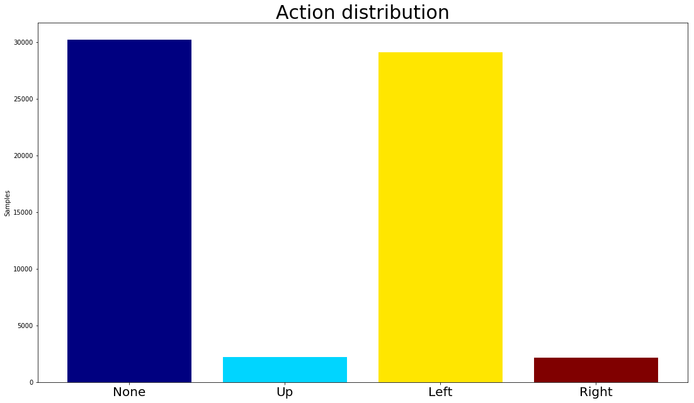
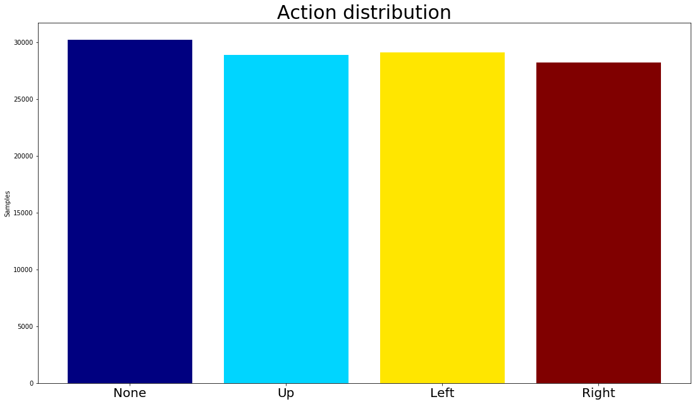
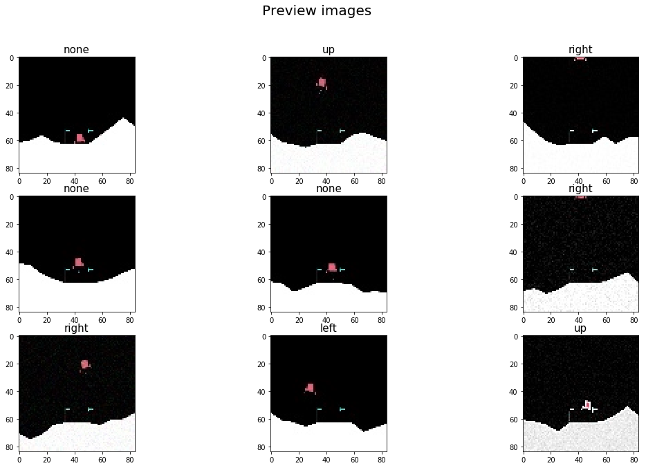
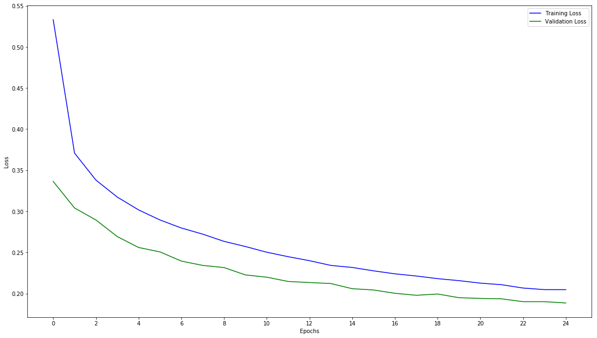
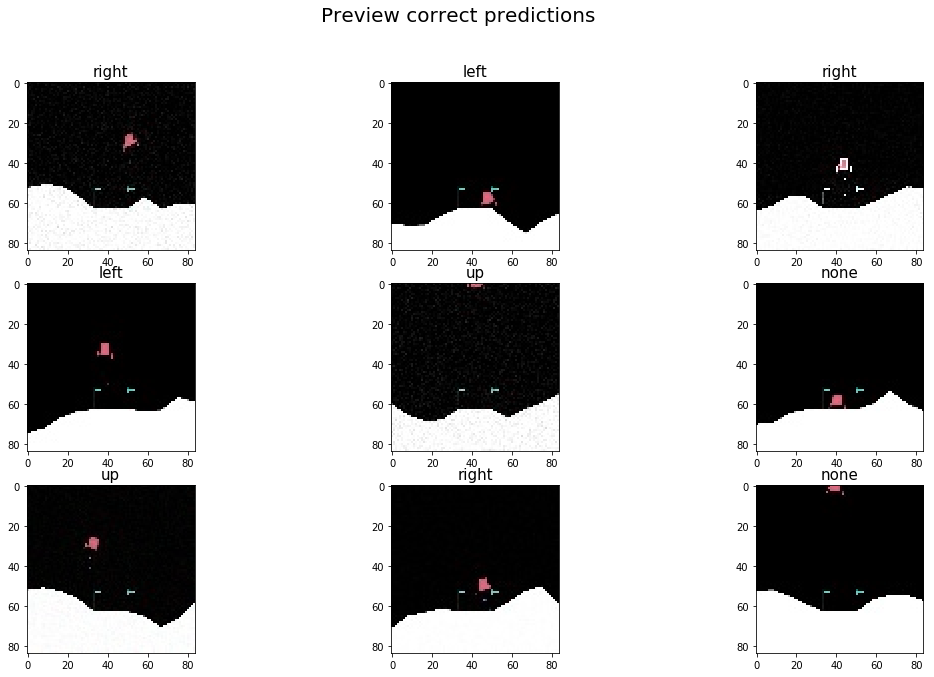
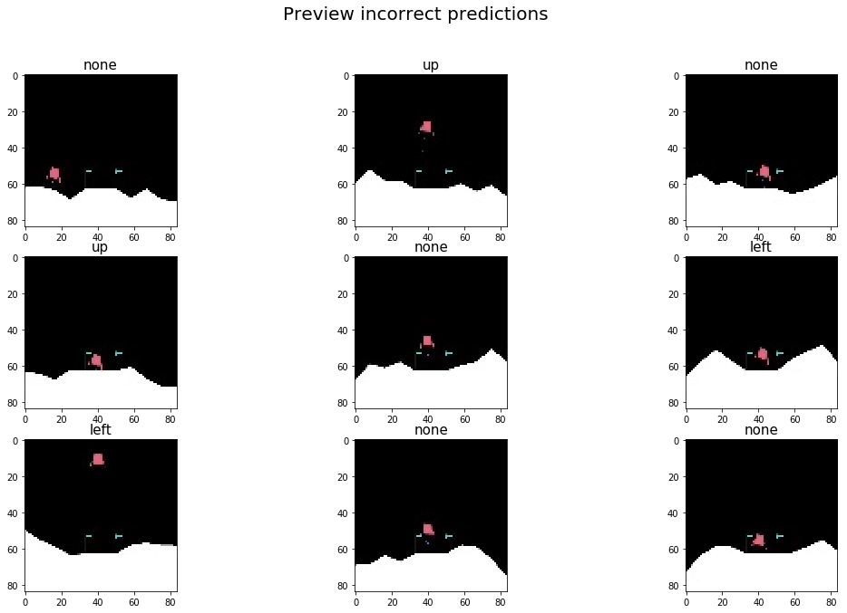
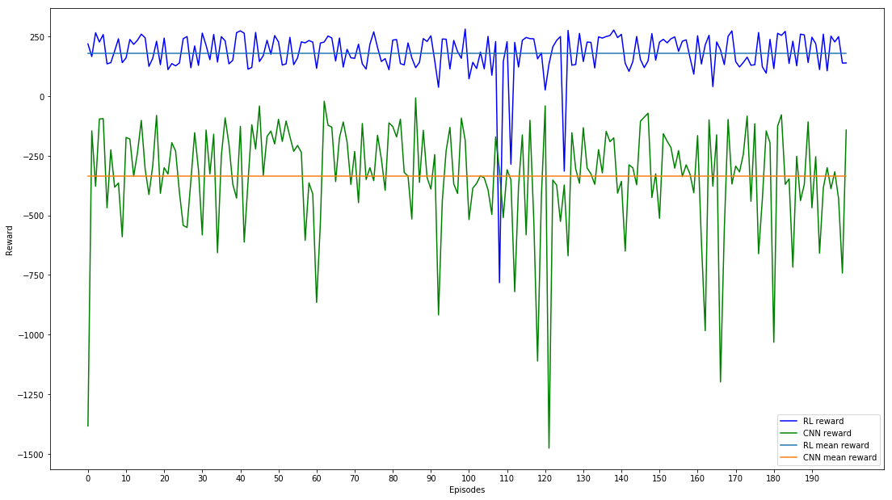

# The idea of this project is to compare the implementation of a CNN architecture and a Reinforcement Learning architecture for a classification problem, more precisely, we are trying to teach the models to play the Lunar Landing videogame (Atari 1979).


```python
import numpy as np
import pandas as pd
import keras
import cv2
import os
import sys
import io
from imgaug import augmenters as iaa
import imgaug as ia
import skimage
from matplotlib import pyplot as plt
import tqdm
import random

from sklearn import metrics
from sklearn.model_selection import GridSearchCV
from sklearn.model_selection import cross_val_score
from sklearn.model_selection import train_test_split
from sklearn import preprocessing 
from sklearn.utils import shuffle

from keras.utils.np_utils import to_categorical
from keras.layers import Dense, Activation, Dropout, Conv2D, MaxPooling2D, Flatten
from keras.callbacks import ModelCheckpoint

import gym
from keras.models import Sequential
from keras.optimizers import Adam
from rl.agents.dqn import DQNAgent
from rl.policy import BoltzmannQPolicy
from rl.memory import SequentialMemory

import lunar_lander_ml_images_player as ll
```

    Using TensorFlow backend.
    

## First off we need to define a function for the preprocessing of our pictures, in our case, we will be only resizing the pictures and saving them on disk


```python
def prepare_images(path_read, path_write):
    """1) Convert to grayscale, 2) Shrink, 3) Prepare groups of 4 frames??
    """
    filenames = os.listdir(path_read)
    for filename in tqdm.tqdm(filenames):
        # image in color
        image = cv2.imread(os.path.join(path_read,filename), 1) # parameter in imread: #1 = color, #0 = gray, #-1 = unchanged (alpha)
        resized_image = cv2.resize(image, (84, 84))
        cv2.imwrite(os.path.join(path_write, filename), resized_image)
```


```python
prepare_images('LunarLanderFramesPart1/', 'transformed-frames')
```

    100%|████████████████████████████████████████████████████████████████████████████| 63671/63671 [14:40<00:00, 89.13it/s]
    

## Transformation is complete, now, we will get the action related to each picture:


```python
def get_actions(path_read, path_write):
    """Extract actions from file names (last digit before the extension)
        0 = None
        1 = Up
        2 = Left
        3 = Right
    """
    filenames = os.listdir(path_read)
    # extract action
    actions = [filename[-6] for filename in filenames]
    pd.DataFrame(actions, columns=['actions']).to_csv(path_write, index=False)
    return actions
```


```python
if not os.path.isfile('csv/actions.csv'):
    get_actions('LunarLanderFramesPart1/', 'csv/actions.csv')
```

## Once we extract our actions, we proceed to check the distribution of the classes


```python
actions = pd.read_csv('csv/actions.csv')
count = actions.groupby('actions')['actions'].count()

n = len(count)
colors = plt.cm.jet(np.linspace(0, 1, n))

fig = plt.figure()
fig.set_size_inches(18.5, 10.5)
plt.ylabel('Samples')
plt.bar(['None', "Up", "Left", "Right"], count, color=colors)
plt.xticks(fontsize =20)
plt.title("Action distribution", fontsize=30)
plt.show()
```





## Our classes are highly imbalanced, to fix this we will create new samples, these new samples will not be an exact copy of current frames (as implemented by the upsampling techniques), but instead will be an augmented version of them. First we calculate the imbalance ratio (i.e. if majority class has 10 samples, ratio= (10/samples from other classes)-1; then we use this ratio to define how many copies will be created from minority classes. 


```python
def calculate_imbalance(path_read):
    """ Calculate samples of class with max samples, then compute the ratio
    between this value and the difference of the rest of the classes. Returns a dictionary {'class': ratio difference}
    """
    imbalance = {}
    filenames = os.listdir(path_read)
    # extract action
    actions = [filename[-6] for filename in filenames]
    # get number of samples of majority class
    count = pd.DataFrame(actions, columns=['actions']).groupby('actions')['actions'].count()
    max_ = count.max()
    #for each action
    for index in count.index:
        # how many times to reach max_ samples?
        imbalance[index] =  (max_  // count[index]) - 1
    print(imbalance)
    return imbalance

def fix_class_imbalance(path_read, path_write):
    """Classes are very unbalanced, fix them by augmenting the under represented classes
    path_read: string, path to images
    unbalanced: list, numeric value corresponding to unbalanced classes [0 = None, 1 = Up, 2 = Left, 3 = Right]
    """
    images = os.listdir(path_read)
    # read an image to extract image dimensions
    im = cv2.imread(os.path.join(path_read,images[0]), 1)# parameter in imread: #1 = color, #0 = gray, #-1 = unchanged (alpha)
    width, height, channels = im.shape
    
    # which classes are imbalanced?
    print("Calculating imbalances ratio...")
    imbalance = calculate_imbalance(path_read)
    imbalanced_filenames = []
    for i, image in enumerate(images):
        # select those files from imbalanced classes (all classes expect majority class)
        if imbalance[image[-6]] != 0:
            imbalanced_filenames.append(image)
    
    # multiply list by deficit ratio (imbalance)
    filtered_by_ratio = []
    print("Multiplying filenames by ratio imbalance...")
    for key in imbalance:
        # select files from same class
        filtered = [file for file in imbalanced_filenames if key +'.jpeg' in file]
        # append files times deficit value
        filtered_by_ratio.append(filtered*imbalance[key])
    # list of lists to a single list
    filtered_and_sorted = [item for sublist in filtered_by_ratio for item in sublist]
    
    # define numpy array place holder
    np_images = np.zeros(shape=(len(filtered_and_sorted),width,height, channels), dtype=np.uint8)
    print(np_images.shape)

    # read imbalanced files and save then in np array placeholder
    print("Reading images to transform...")
    for i, image in enumerate(filtered_and_sorted):
        np_images[i] = cv2.imread(os.path.join(path_read, image), 1) # parameter in imread: #1 = color, #0 = gray, #-1 = unchanged (alpha)
        
    ia.seed(1)
    # define transformations
    seq = iaa.Sequential(
        [
            iaa.Sometimes(0.2,iaa.Sharpen(alpha=(0, 1.0), lightness=(0.75, 1.5))),
            iaa.AdditiveGaussianNoise(loc=0, scale=(0.0, 0.05*255), per_channel=0.5),
        ], random_order=True) # apply augmenters in random order
    
    print("Starting transformation...")
    images_aug = seq.augment_images(np_images)

    # save augmented images
    counter = 0
    print("Saving transformed files ...")
    for i, filename in enumerate(tqdm.tqdm(filtered_and_sorted)):
        if i > 0:
            # next file belongs to different class?
            if filtered_and_sorted[i-1][-6] != filename[-6]:
                counter = 0
        cv2.imwrite(path_write + str(counter).zfill(5) + '_' + filename[-6] + '.jpeg', images_aug[i])
        counter += 1
```


```python
if not os.path.isfile('csv/actions_balanced.csv'):
    fix_class_imbalance('transformed-frames/', 'transformed-frames/')
    
if not os.path.isfile('csv/actions_balanced.csv'):
        get_actions('transformed-frames/', 'csv/actions_balanced.csv')
        actions = pd.read_csv('csv/actions_balanced.csv')
        count = actions.groupby('actions')['actions'].count()

        n = len(count)
        colors = plt.cm.jet(np.linspace(0, 1, n))

        fig = plt.figure()
        fig.set_size_inches(18.5, 10.5)
        plt.bar(['None', "Up", "Left", "Right"], count, color=colors)
        plt.ylabel('Samples')
        plt.xticks(fontsize =20)
        plt.title("Action distribution", fontsize=30)
        plt.show()
```





## We now have a more even distribution. Images have been saved on disk. Now, it's time to split and prepare our data for training.


```python
def train_val_test(path_read_x, path_read_y):
    filenames = os.listdir(path_read_x)
    target = pd.read_csv(path_read_y)
    
    # here the X splits are filenames, y splits are actual class numbers
    X_train_val, X_test, y_train_val, y_test = train_test_split(filenames, target, random_state=0, test_size = 0.30, train_size = 0.7)
    X_train, X_val, y_train, y_val = train_test_split(X_train_val, y_train_val, random_state=0, test_size = 0.20, train_size = 0.8)
    
    # first image for placeholder
    image = cv2.imread(os.path.join(path_read_x,filenames[0]), 1)
    width, height, channel = image.shape
    
    # define placeholders
    X_train_np = np.zeros(shape = (len(X_train), width, height, channel ), dtype=np.uint8)
    X_val_np = np.zeros(shape = (len(X_val), width, height, channel ), dtype=np.uint8)
    X_test_np = np.zeros(shape = (len(X_test), width, height, channel), dtype=np.uint8)

    # fill up the placeholders
    for i, image in enumerate(tqdm.tqdm(X_train)):
        X_train_np[i] = cv2.imread(os.path.join(path_read_x,image), 1)
    
    for i, image in enumerate(tqdm.tqdm(X_val)):
        X_val_np[i] = cv2.imread(os.path.join(path_read_x,image), 1)
    
    for i, image in enumerate(tqdm.tqdm(X_test)):
        X_test_np[i] = cv2.imread(os.path.join(path_read_x,image), 1)


    # Convert class vectors to binary class matrices.
    num_classes = 4
    
    y_train_wide = keras.utils.to_categorical(y_train, num_classes)
    y_val_wide = keras.utils.to_categorical(y_val, num_classes)
    y_test_wide = keras.utils.to_categorical(y_test, num_classes)
    
    classes_num_label = dict()

    for idx, lbl in enumerate([0, 1, 2, 3]):
        classes_num_label[idx] = lbl
    
    return X_train_np, X_val_np, X_test_np, y_train_wide, y_val_wide, y_test_wide, y_train, y_val, y_test
```


```python
X_train, X_val, X_test, y_train_w, y_val_w, y_test_w, y_train, y_val, y_test = train_val_test('transformed-frames/', 'csv/actions_balanced.csv')
```

    100%|███████████████████████████████████████████████████████████████████████████| 65149/65149 [03:23<00:00, 319.97it/s]
    100%|████████████████████████████████████████████████████████████████████████████| 16288/16288 [04:06<00:00, 66.14it/s]
    100%|████████████████████████████████████████████████████████████████████████████| 34902/34902 [09:15<00:00, 62.83it/s]
    

## Split and preprocessing is finished, now let's preview some images from our training set


```python
def preview_images():
    fig = plt.figure()
    fig.set_size_inches(18.5, 10.5)
    fig.suptitle("Preview images", fontsize=20)
    
    nrow = 3
    ncol = 3
    action = ["none","up","left","right"]
    for i in range(1, 10):
        index = np.argwhere(y_train_w[i]==1)[0][0]
        ax = plt.subplot("33"+str(i))
        ax.set_title(action[index], fontsize=15)
        ax.imshow(X_train[i])
```


```python
preview_images()
```





## Now, the cool part of the process, loading and building the VGG16 network. As we want to keep what the network has already learnt, we will freeze the weights up until the 17th layer, from there on we will train a dense layer with the features produced by feeding of our images through the frozen weights of VGG16.


```python
def build_VGG16(neurons_lastlayer=256, activation='relu', dropout=0.5):
    """Loads the VGG16 network and modifies it so that a new dense layer on top is trainable
    """
    NUM_OF_CLASSES = 4
    
    width, height, channel = X_train[0].shape
    shape = (width, height, channel)
    # build the VGG16 network
    # network requires input shape to be a tuple of three numbers, channel numbers have to be three as well.
    vgg16_model = keras.applications.VGG16(weights='imagenet', include_top=False, input_shape = shape)
    display(vgg16_model.summary())
    vgg16_last_layer = vgg16_model.output

    # build a classifier model to put on top of the VGG16 model
    x1 = Flatten()(vgg16_last_layer)
    x2 = Dense(neurons_lastlayer, activation=activation)(x1)
    x3 = Dropout(dropout)(x2)
    final_layer = Dense(NUM_OF_CLASSES, activation = 'softmax')(x3)

    # Assemble the full model out of both parts
    full_model = keras.Model(vgg16_model.input, final_layer)

    # set the first 17 layers (up to the last conv block) to non-trainable (weights will not be updated)
    for layer in full_model.layers[:17]:
        layer.trainable = False

    # compile the model with a SGD/momentum optimizer
    # and a very slow learning rate.
    full_model.compile(loss='binary_crossentropy',
                  optimizer=keras.optimizers.SGD(lr=1e-4, momentum=0.9),
                  metrics=['accuracy'])

    full_model.summary()
    return full_model
    
```


```python
full_model = build_VGG16()
```

    _________________________________________________________________
    Layer (type)                 Output Shape              Param #   
    =================================================================
    input_12 (InputLayer)        (None, 84, 84, 3)         0         
    _________________________________________________________________
    block1_conv1 (Conv2D)        (None, 84, 84, 64)        1792      
    _________________________________________________________________
    block1_conv2 (Conv2D)        (None, 84, 84, 64)        36928     
    _________________________________________________________________
    block1_pool (MaxPooling2D)   (None, 42, 42, 64)        0         
    _________________________________________________________________
    block2_conv1 (Conv2D)        (None, 42, 42, 128)       73856     
    _________________________________________________________________
    block2_conv2 (Conv2D)        (None, 42, 42, 128)       147584    
    _________________________________________________________________
    block2_pool (MaxPooling2D)   (None, 21, 21, 128)       0         
    _________________________________________________________________
    block3_conv1 (Conv2D)        (None, 21, 21, 256)       295168    
    _________________________________________________________________
    block3_conv2 (Conv2D)        (None, 21, 21, 256)       590080    
    _________________________________________________________________
    block3_conv3 (Conv2D)        (None, 21, 21, 256)       590080    
    _________________________________________________________________
    block3_pool (MaxPooling2D)   (None, 10, 10, 256)       0         
    _________________________________________________________________
    block4_conv1 (Conv2D)        (None, 10, 10, 512)       1180160   
    _________________________________________________________________
    block4_conv2 (Conv2D)        (None, 10, 10, 512)       2359808   
    _________________________________________________________________
    block4_conv3 (Conv2D)        (None, 10, 10, 512)       2359808   
    _________________________________________________________________
    block4_pool (MaxPooling2D)   (None, 5, 5, 512)         0         
    _________________________________________________________________
    block5_conv1 (Conv2D)        (None, 5, 5, 512)         2359808   
    _________________________________________________________________
    block5_conv2 (Conv2D)        (None, 5, 5, 512)         2359808   
    _________________________________________________________________
    block5_conv3 (Conv2D)        (None, 5, 5, 512)         2359808   
    _________________________________________________________________
    block5_pool (MaxPooling2D)   (None, 2, 2, 512)         0         
    =================================================================
    Total params: 14,714,688
    Trainable params: 14,714,688
    Non-trainable params: 0
    _________________________________________________________________
    


    None


    _________________________________________________________________
    Layer (type)                 Output Shape              Param #   
    =================================================================
    input_12 (InputLayer)        (None, 84, 84, 3)         0         
    _________________________________________________________________
    block1_conv1 (Conv2D)        (None, 84, 84, 64)        1792      
    _________________________________________________________________
    block1_conv2 (Conv2D)        (None, 84, 84, 64)        36928     
    _________________________________________________________________
    block1_pool (MaxPooling2D)   (None, 42, 42, 64)        0         
    _________________________________________________________________
    block2_conv1 (Conv2D)        (None, 42, 42, 128)       73856     
    _________________________________________________________________
    block2_conv2 (Conv2D)        (None, 42, 42, 128)       147584    
    _________________________________________________________________
    block2_pool (MaxPooling2D)   (None, 21, 21, 128)       0         
    _________________________________________________________________
    block3_conv1 (Conv2D)        (None, 21, 21, 256)       295168    
    _________________________________________________________________
    block3_conv2 (Conv2D)        (None, 21, 21, 256)       590080    
    _________________________________________________________________
    block3_conv3 (Conv2D)        (None, 21, 21, 256)       590080    
    _________________________________________________________________
    block3_pool (MaxPooling2D)   (None, 10, 10, 256)       0         
    _________________________________________________________________
    block4_conv1 (Conv2D)        (None, 10, 10, 512)       1180160   
    _________________________________________________________________
    block4_conv2 (Conv2D)        (None, 10, 10, 512)       2359808   
    _________________________________________________________________
    block4_conv3 (Conv2D)        (None, 10, 10, 512)       2359808   
    _________________________________________________________________
    block4_pool (MaxPooling2D)   (None, 5, 5, 512)         0         
    _________________________________________________________________
    block5_conv1 (Conv2D)        (None, 5, 5, 512)         2359808   
    _________________________________________________________________
    block5_conv2 (Conv2D)        (None, 5, 5, 512)         2359808   
    _________________________________________________________________
    block5_conv3 (Conv2D)        (None, 5, 5, 512)         2359808   
    _________________________________________________________________
    block5_pool (MaxPooling2D)   (None, 2, 2, 512)         0         
    _________________________________________________________________
    flatten_4 (Flatten)          (None, 2048)              0         
    _________________________________________________________________
    dense_6 (Dense)              (None, 256)               524544    
    _________________________________________________________________
    dropout_4 (Dropout)          (None, 256)               0         
    _________________________________________________________________
    dense_7 (Dense)              (None, 4)                 1028      
    =================================================================
    Total params: 15,240,260
    Trainable params: 2,885,380
    Non-trainable params: 12,354,880
    _________________________________________________________________
    

## The model is loaded and ready to be trained. Now, we setup fitting scheme, we will use checkpoints to callback to the best set of parameters once training is done.


```python
batch_size = 128
epochs = 100

# Set up the callback to save the best model based on validaion data - notebook 2.2 needs to be run first.
best_weights_filepath = 'weights/best_weights.hdf5'
mcp = ModelCheckpoint(best_weights_filepath, monitor="val_loss", save_best_only=True, save_weights_only=False)

history = full_model.fit(X_train, y_train_w, batch_size=batch_size, epochs=epochs, 
                         verbose = 1, validation_data=(X_val, y_val_w), shuffle=True, callbacks=[mcp])

#reload best weights
full_model.load_weights(best_weights_filepath)
```

## Training is finished, let's look at the loss graphs for the training and validation sets.


```python
loss = history.history['loss']
val_loss = history.history['val_loss']

fig = plt.figure()
fig.set_size_inches(18.5, 10.5)
plt.xlabel('Epochs')
plt.ylabel('Loss')
plt.plot(loss, 'blue', label='Training Loss')
plt.plot(val_loss, 'green', label='Validation Loss')
plt.xticks(range(0,epochs)[0::2])
plt.legend()
plt.show()
```





## But, how well did our model do? Not so great, class 2 is too low on precision, we can see the miss classification in our confussion matrix, it could not learn to differentiate well between class 0 and class 2.


```python
# Make a set of predictions for the validation data
pred = np.argmax(full_model.predict(X_val),axis=1)

# Print performance details
print(metrics.classification_report(y_val, pred))

print("Confusion matrix")
print(metrics.confusion_matrix(y_val, pred))
```

                  precision    recall  f1-score   support
    
               0       0.90      0.63      0.74      4139
               1       0.97      0.93      0.95      4041
               2       0.67      0.94      0.78      4130
               3       0.97      0.92      0.95      3978
    
       micro avg       0.85      0.85      0.85     16288
       macro avg       0.88      0.85      0.85     16288
    weighted avg       0.88      0.85      0.85     16288
    
    Confusion matrix
    [[2595   27 1498   19]
     [  44 3741  198   58]
     [ 202   31 3876   21]
     [  41   39  221 3677]]
    

## Some examples of good and bad predictions:


```python
def preview_images(mode='correct'):
    fig = plt.figure()
    fig.set_size_inches(18.5, 10.5)
    nrow = 3
    ncol = 3
    action = ["none","up","left","right"]
    
    if mode == 'correct':
    
        correct_prediction = []
        index_correct = []
        i = 0
    
        while (len(correct_prediction)<10):
            if pred[i] == y_val.values[i][0]:
                # class
                correct_prediction.append(y_val.values[i][0])
                # index of class stored
                index_correct.append(i)
            i += 1
    
    if mode == 'incorrect':
    
        correct_prediction = []
        index_correct = []
        i = 0
    
        while (len(correct_prediction)<10):
            if pred[i] != y_val.values[i][0]:
                # class
                correct_prediction.append(y_val.values[i][0])
                # index of class stored
                index_correct.append(i)
            i += 1
        
    for i in range(1,10):
        index = correct_prediction[i]
        ax = plt.subplot("33"+str(i))
        ax.set_title(action[index], fontsize=15)
        ax.imshow(X_val[index_correct[i]])

    fig.suptitle("Preview "+ mode +" predictions", fontsize=20)
```


```python
preview_images('correct')
```





```python
preview_images('incorrect')
```





# Reinforcement Learning Section

## Instantiate the Lunar Lander environment, build the network and train it. At the end, test the agent with the learnt parameters.


```python
def load_rl_architecture():
    
    ENV_NAME = 'LunarLander-v2'
    
    # Get the environment and extract the number of actions.
    env = gym.make(ENV_NAME)
    np.random.seed(123)
    env.seed(123)
    nb_actions = env.action_space.n

    # Next, we build a very simple model.
    model = Sequential()
    model.add(Flatten(input_shape=(1,) + env.observation_space.shape))
    model.add(Dense(50))
    model.add(Activation('relu'))
    model.add(Dense(30))
    model.add(Activation('relu'))
    model.add(Dense(16))
    model.add(Activation('relu'))
    model.add(Dense(nb_actions))
    model.add(Activation('linear'))
    print(model.summary())

    # Finally, we configure and compile our agent. You can use every built-in Keras optimizer and
    # even the metrics!
    memory = SequentialMemory(limit=50000, window_length=1)
    policy = BoltzmannQPolicy()
    dqn = DQNAgent(model=model, nb_actions=nb_actions, memory=memory, nb_steps_warmup=10,
                   target_model_update=1e-2, policy=policy)
    dqn.compile(Adam(lr=1e-3), metrics=['mae'])
    return dqn, env
```


```python
dqn, env = load_rl_architecture()
ENV_NAME = 'LunarLander-v2'
# Okay, now it's time to learn something! We visualize the training here for show, but this
# slows down training quite a lot. You can always safely abort the training prematurely using
# Ctrl + C.
dqn.fit(env, nb_steps=100000, visualize=True, verbose=2)

# After training is done, we save the final weights.
dqn.save_weights('weights/dqn_{}_weights.h5f'.format(ENV_NAME), overwrite=True)

# Finally, evaluate our algorithm for 50 episodes.
dqn.test(env, nb_episodes=50, visualize=True)

```

    c:\users\ruben\docume~1\ucd\18-19_~2\comp47~1\ml_env\lib\site-packages\rl\memory.py:39: UserWarning: Not enough entries to sample without replacement. Consider increasing your warm-up phase to avoid oversampling!
      warnings.warn('Not enough entries to sample without replacement. Consider increasing your warm-up phase to avoid oversampling!')
    


    <keras.callbacks.History at 0x1cab5ad8588>


## It is seems to be doing ok, no negative rewards. Now, let's compare the performance of each model, that is, the CNN model and the RL model, and see which one performs better:


```python
def test_cnn_model(path_write):
    """Test CNN and RL model
    cnn_model: boolean, if true, CNN model is tested, else, RL is tested
    
    NOTE: some modifications on the code below have been implemented, as my CNN training required color 
    images because I implemented a transfer learning strategy (the VGG16 network requires an image 
    shape of (widh, height, channels =3))
    """
    path = "weights/best_weights.hdf5"
    
    # Load the Lunar Lander environment
    env = ll.LunarLander()

    # Load and initialise the contrll model
    ROWS = 84
    COLS = 84
    CHANNELS = 3 # this set from 1 to 3
    model = keras.models.load_model(path)

    total_rewards = []

    for i in range(0, 200):
        s = env.reset()

        # Run the game loop
        total_reward = 0
        steps = 0
        while True:

            # Access the rednered scrnen image
            raw_image = env.render(mode='rgb_array')
            # Prepare the image for presentation to the network
            processed_image = cv2.resize(raw_image, (ROWS, COLS), interpolation=cv2.INTER_CUBIC)
            # this now reads color images:
            processed_image = cv2.cvtColor(processed_image, 1)
            processed_image = np.array(processed_image, dtype=np.float)
            # changed the order of reshaping:
            processed_image = processed_image.reshape((1, ROWS, COLS, CHANNELS))
            processed_image = processed_image/255

            # Get the model to make a prediction
            # my model did not have predict_classes, I am using predict and extracting the action manually 
            a = model.predict(processed_image)
            a = np.argmax(a)

            # Step on the game
            s, r, done, info = env.step(a)
            env.render()
            total_reward += r
            if steps % 20 == 0 or done:
                print(["{:+0.2f}".format(x) for x in s])
                print("step {} total_reward {:+0.2f}".format(steps, total_reward))
                steps += 1
                if done: 
                    total_rewards.append(total_reward)
                    break

        print("total rewards", total_rewards)
        print("average total reward", np.mean(total_rewards))

    # Write total rewards to file
    pd.DataFrame(total_rewards, columns=['total_rewards']).to_csv(path_write, index=False)
```


```python
test_cnn_model('csv/total_rewards_cnn.csv')
```

    ['-0.00', '+0.95', '-0.04', '+0.15', '+0.00', '+0.01', '+0.00', '+0.00']
    step 0 total_reward +2.21
    ['+1.01', '+8.43', '+1.42', '+4.38', '-0.29', '-0.02', '+0.00', '+0.00']
    step 1 total_reward -1383.04
    total rewards [-1383.0444726947976]
    average total reward -1383.0444726947976
    ['-0.01', '+0.93', '-0.46', '-0.23', '+0.01', '+0.10', '+0.00', '+0.00']
    step 0 total_reward -1.21
    ['-0.35', '-0.01', '-0.79', '-0.49', '+0.17', '-3.80', '+0.00', '+0.00']
    step 1 total_reward -145.16
    total rewards [-1383.0444726947976, -145.16366348138553]
    average total reward -764.1040680880916
    ['+0.01', '+0.93', '+0.61', '-0.26', '-0.01', '-0.12', '+0.00', '+0.00']
    step 0 total_reward -0.58
    ['+1.00', '+0.79', '+2.29', '+0.55', '-0.62', '-0.16', '+0.00', '+0.00']
    step 1 total_reward -377.53
    total rewards [-1383.0444726947976, -145.16366348138553, -377.5259999149343]
    average total reward -635.2447120303725
    ['+0.00', '+0.95', '+0.06', '+0.21', '-0.00', '-0.01', '+0.00', '+0.00']
    step 0 total_reward +2.09
    ['+0.06', '-0.03', '+0.00', '-0.00', '-0.00', '-0.00', '+1.00', '+1.00']
    step 1 total_reward -95.64
    total rewards [-1383.0444726947976, -145.16366348138553, -377.5259999149343, -95.64336652943265]
    average total reward -500.3443756551375
    ['+0.00', '+0.95', '+0.13', '+0.32', '-0.00', '-0.03', '+0.00', '+0.00']
    step 0 total_reward +1.79
    ['+0.15', '-0.02', '-0.28', '-0.16', '-0.17', '+1.02', '+1.00', '+1.00']
    step 1 total_reward -94.11
    total rewards [-1383.0444726947976, -145.16366348138553, -377.5259999149343, -95.64336652943265, -94.10508990720191]
    average total reward -419.09651850555036
    ['+0.00', '+0.93', '+0.03', '-0.30', '-0.00', '-0.01', '+0.00', '+0.00']
    step 0 total_reward -2.13
    ['+1.00', '+1.59', '+1.98', '+1.13', '-0.39', '-0.03', '+0.00', '+0.00']
    step 1 total_reward -468.27
    total rewards [-1383.0444726947976, -145.16366348138553, -377.5259999149343, -95.64336652943265, -94.10508990720191, -468.27238667785053]
    average total reward -427.29249653426706
    ['+0.01', '+0.92', '+0.62', '-0.54', '-0.01', '-0.14', '+0.00', '+0.00']
    step 0 total_reward -1.49
    ['+1.00', '+0.21', '+1.59', '-0.44', '-0.17', '+0.03', '+0.00', '+0.00']
    step 1 total_reward -224.61
    total rewards [-1383.0444726947976, -145.16366348138553, -377.5259999149343, -95.64336652943265, -94.10508990720191, -468.27238667785053, -224.61374139752314]
    average total reward -398.33838865758935
    ['-0.02', '+0.93', '-0.79', '-0.27', '+0.02', '+0.18', '+0.00', '+0.00']
    step 0 total_reward -1.18
    ['-1.02', '+0.52', '-2.63', '+0.07', '+0.76', '+0.17', '+0.00', '+0.00']
    step 1 total_reward -381.80
    total rewards [-1383.0444726947976, -145.16366348138553, -377.5259999149343, -95.64336652943265, -94.10508990720191, -468.27238667785053, -224.61374139752314, -381.7989927702085]
    average total reward -396.2709641716668
    ['+0.01', '+0.94', '+0.74', '-0.15', '-0.02', '-0.17', '+0.00', '+0.00']
    step 0 total_reward -0.98
    ['+1.00', '+0.08', '+2.48', '-0.37', '-0.80', '-0.23', '+0.00', '+0.00']
    step 1 total_reward -364.02
    total rewards [-1383.0444726947976, -145.16366348138553, -377.5259999149343, -95.64336652943265, -94.10508990720191, -468.27238667785053, -224.61374139752314, -381.7989927702085, -364.0190928827014]
    average total reward -392.6874229173373
    ['-0.01', '+0.95', '-0.37', '+0.27', '+0.01', '+0.08', '+0.00', '+0.00']
    step 0 total_reward +0.75
    ['-1.02', '+2.47', '-2.35', '+1.82', '+0.49', '+0.03', '+0.00', '+0.00']
    step 1 total_reward -589.66
    total rewards [-1383.0444726947976, -145.16366348138553, -377.5259999149343, -95.64336652943265, -94.10508990720191, -468.27238667785053, -224.61374139752314, -381.7989927702085, -364.0190928827014, -589.6562216272889]
    average total reward -412.3843027883325
    ['-0.01', '+0.94', '-0.43', '-0.17', '+0.01', '+0.10', '+0.00', '+0.00']
    step 0 total_reward -1.06
    ['-0.36', '-0.11', '-1.23', '-0.43', '+0.49', '+0.00', '+1.00', '+0.00']
    step 1 total_reward -173.08
    total rewards [-1383.0444726947976, -145.16366348138553, -377.5259999149343, -95.64336652943265, -94.10508990720191, -468.27238667785053, -224.61374139752314, -381.7989927702085, -364.0190928827014, -589.6562216272889, -173.07809504847995]
    average total reward -390.6291929938004
    ['+0.01', '+0.94', '+0.35', '+0.04', '-0.01', '-0.08', '+0.00', '+0.00']
    step 0 total_reward -0.03
    ['+0.27', '-0.02', '+0.24', '-0.75', '-0.13', '+5.43', '+1.00', '+0.00']
    step 1 total_reward -179.63
    total rewards [-1383.0444726947976, -145.16366348138553, -377.5259999149343, -95.64336652943265, -94.10508990720191, -468.27238667785053, -224.61374139752314, -381.7989927702085, -364.0190928827014, -589.6562216272889, -173.07809504847995, -179.62829142972834]
    average total reward -373.0457845301277
    ['-0.01', '+0.93', '-0.51', '-0.25', '+0.01', '+0.11', '+0.00', '+0.00']
    step 0 total_reward -1.22
    ['-1.00', '-0.14', '-2.21', '+0.05', '+0.53', '+0.25', '+0.00', '+0.00']
    step 1 total_reward -335.38
    total rewards [-1383.0444726947976, -145.16366348138553, -377.5259999149343, -95.64336652943265, -94.10508990720191, -468.27238667785053, -224.61374139752314, -381.7989927702085, -364.0190928827014, -589.6562216272889, -173.07809504847995, -179.62829142972834, -335.381383756353]
    average total reward -370.14852293214506
    ['+0.01', '+0.95', '+0.63', '+0.25', '-0.01', '-0.14', '+0.00', '+0.00']
    step 0 total_reward -0.03
    ['+0.64', '-0.12', '+1.12', '-0.09', '-0.53', '+2.21', '+1.00', '+0.00']
    step 1 total_reward -235.78
    total rewards [-1383.0444726947976, -145.16366348138553, -377.5259999149343, -95.64336652943265, -94.10508990720191, -468.27238667785053, -224.61374139752314, -381.7989927702085, -364.0190928827014, -589.6562216272889, -173.07809504847995, -179.62829142972834, -335.381383756353, -235.78200773178108]
    average total reward -360.5509147035476
    ['+0.00', '+0.95', '+0.15', '+0.29', '-0.00', '-0.03', '+0.00', '+0.00']
    step 0 total_reward +1.69
    ['+0.17', '-0.02', '+0.42', '-0.43', '-0.11', '+3.23', '+1.00', '+1.00']
    step 1 total_reward -101.61
    total rewards [-1383.0444726947976, -145.16366348138553, -377.5259999149343, -95.64336652943265, -94.10508990720191, -468.27238667785053, -224.61374139752314, -381.7989927702085, -364.0190928827014, -589.6562216272889, -173.07809504847995, -179.62829142972834, -335.381383756353, -235.78200773178108, -101.61323189355878]
    average total reward -343.288402516215
    ['-0.01', '+0.95', '-0.68', '+0.20', '+0.02', '+0.15', '+0.00', '+0.00']
    step 0 total_reward -0.21
    ['-1.00', '+0.09', '-2.01', '-0.67', '+0.53', '+0.03', '+0.00', '+0.00']
    step 1 total_reward -304.94
    total rewards [-1383.0444726947976, -145.16366348138553, -377.5259999149343, -95.64336652943265, -94.10508990720191, -468.27238667785053, -224.61374139752314, -381.7989927702085, -364.0190928827014, -589.6562216272889, -173.07809504847995, -179.62829142972834, -335.381383756353, -235.78200773178108, -101.61323189355878, -304.94210886137114]
    average total reward -340.8917591627873
    ['-0.01', '+0.94', '-0.42', '-0.10', '+0.01', '+0.09', '+0.00', '+0.00']
    step 0 total_reward -0.81
    ['-1.02', '+0.53', '-2.47', '+0.24', '+0.72', '+0.11', '+0.00', '+0.00']
    step 1 total_reward -412.45
    total rewards [-1383.0444726947976, -145.16366348138553, -377.5259999149343, -95.64336652943265, -94.10508990720191, -468.27238667785053, -224.61374139752314, -381.7989927702085, -364.0190928827014, -589.6562216272889, -173.07809504847995, -179.62829142972834, -335.381383756353, -235.78200773178108, -101.61323189355878, -304.94210886137114, -412.45309798144507]
    average total reward -345.1012496815319
    ['+0.00', '+0.94', '+0.12', '+0.11', '-0.00', '-0.03', '+0.00', '+0.00']
    step 0 total_reward +1.59
    ['+1.01', '+1.07', '+1.09', '+0.12', '-0.16', '-0.02', '+0.00', '+0.00']
    step 1 total_reward -291.68
    total rewards [-1383.0444726947976, -145.16366348138553, -377.5259999149343, -95.64336652943265, -94.10508990720191, -468.27238667785053, -224.61374139752314, -381.7989927702085, -364.0190928827014, -589.6562216272889, -173.07809504847995, -179.62829142972834, -335.381383756353, -235.78200773178108, -101.61323189355878, -304.94210886137114, -412.45309798144507, -291.6816726897828]
    average total reward -342.1334954042125
    ['-0.00', '+0.93', '-0.15', '-0.28', '+0.00', '+0.03', '+0.00', '+0.00']
    step 0 total_reward -1.98
    ['-0.13', '-0.03', '-0.25', '-0.58', '+0.01', '-3.23', '+1.00', '+1.00']
    step 1 total_reward -80.36
    total rewards [-1383.0444726947976, -145.16366348138553, -377.5259999149343, -95.64336652943265, -94.10508990720191, -468.27238667785053, -224.61374139752314, -381.7989927702085, -364.0190928827014, -589.6562216272889, -173.07809504847995, -179.62829142972834, -335.381383756353, -235.78200773178108, -101.61323189355878, -304.94210886137114, -412.45309798144507, -291.6816726897828, -80.36467142554119]
    average total reward -328.35618887901927
    ['+0.01', '+0.92', '+0.49', '-0.59', '-0.01', '-0.11', '+0.00', '+0.00']
    step 0 total_reward -1.58
    ['+1.03', '+0.42', '+2.70', '+0.17', '-0.82', '-0.18', '+0.00', '+0.00']
    step 1 total_reward -407.43
    total rewards [-1383.0444726947976, -145.16366348138553, -377.5259999149343, -95.64336652943265, -94.10508990720191, -468.27238667785053, -224.61374139752314, -381.7989927702085, -364.0190928827014, -589.6562216272889, -173.07809504847995, -179.62829142972834, -335.381383756353, -235.78200773178108, -101.61323189355878, -304.94210886137114, -412.45309798144507, -291.6816726897828, -80.36467142554119, -407.429415051316]
    average total reward -332.30985018763414
    ['-0.00', '+0.95', '-0.18', '+0.30', '+0.00', '+0.04', '+0.00', '+0.00']
    step 0 total_reward +1.61
    ['-1.01', '+0.20', '-1.68', '+0.13', '+0.34', '+0.03', '+0.00', '+0.00']
    step 1 total_reward -299.71
    total rewards [-1383.0444726947976, -145.16366348138553, -377.5259999149343, -95.64336652943265, -94.10508990720191, -468.27238667785053, -224.61374139752314, -381.7989927702085, -364.0190928827014, -589.6562216272889, -173.07809504847995, -179.62829142972834, -335.381383756353, -235.78200773178108, -101.61323189355878, -304.94210886137114, -412.45309798144507, -291.6816726897828, -80.36467142554119, -407.429415051316, -299.70759852729367]
    average total reward -330.7573620133322
    ['+0.01', '+0.94', '+0.54', '-0.08', '-0.01', '-0.12', '+0.00', '+0.00']
    step 0 total_reward -0.75
    ['+1.02', '+0.18', '+1.95', '-0.38', '-0.61', '-0.12', '+0.00', '+0.00']
    step 1 total_reward -326.55
    total rewards [-1383.0444726947976, -145.16366348138553, -377.5259999149343, -95.64336652943265, -94.10508990720191, -468.27238667785053, -224.61374139752314, -381.7989927702085, -364.0190928827014, -589.6562216272889, -173.07809504847995, -179.62829142972834, -335.381383756353, -235.78200773178108, -101.61323189355878, -304.94210886137114, -412.45309798144507, -291.6816726897828, -80.36467142554119, -407.429415051316, -299.70759852729367, -326.5535700432572]
    average total reward -330.566280560147
    ['+0.01', '+0.94', '+0.50', '-0.14', '-0.01', '-0.11', '+0.00', '+0.00']
    step 0 total_reward -0.93
    ['+0.32', '+0.03', '-0.33', '-0.39', '-0.31', '+4.21', '+1.00', '+0.00']
    step 1 total_reward -194.90
    total rewards [-1383.0444726947976, -145.16366348138553, -377.5259999149343, -95.64336652943265, -94.10508990720191, -468.27238667785053, -224.61374139752314, -381.7989927702085, -364.0190928827014, -589.6562216272889, -173.07809504847995, -179.62829142972834, -335.381383756353, -235.78200773178108, -101.61323189355878, -304.94210886137114, -412.45309798144507, -291.6816726897828, -80.36467142554119, -407.429415051316, -299.70759852729367, -326.5535700432572, -194.89738023556842]
    average total reward -324.66763271994796
    ['-0.01', '+0.93', '-0.51', '-0.36', '+0.01', '+0.11', '+0.00', '+0.00']
    step 0 total_reward -1.42
    ['-1.01', '+0.15', '-1.45', '-0.25', '+0.19', '-0.00', '+0.00', '+0.00']
    step 1 total_reward -230.03
    total rewards [-1383.0444726947976, -145.16366348138553, -377.5259999149343, -95.64336652943265, -94.10508990720191, -468.27238667785053, -224.61374139752314, -381.7989927702085, -364.0190928827014, -589.6562216272889, -173.07809504847995, -179.62829142972834, -335.381383756353, -235.78200773178108, -101.61323189355878, -304.94210886137114, -412.45309798144507, -291.6816726897828, -80.36467142554119, -407.429415051316, -299.70759852729367, -326.5535700432572, -194.89738023556842, -230.0299658668639]
    average total reward -320.7243966010694
    ['+0.00', '+0.93', '+0.22', '-0.48', '-0.01', '-0.05', '+0.00', '+0.00']
    step 0 total_reward -1.83
    ['+1.01', '+1.98', '+0.69', '+1.58', '-0.14', '-0.10', '+0.00', '+0.00']
    step 1 total_reward -402.73
    total rewards [-1383.0444726947976, -145.16366348138553, -377.5259999149343, -95.64336652943265, -94.10508990720191, -468.27238667785053, -224.61374139752314, -381.7989927702085, -364.0190928827014, -589.6562216272889, -173.07809504847995, -179.62829142972834, -335.381383756353, -235.78200773178108, -101.61323189355878, -304.94210886137114, -412.45309798144507, -291.6816726897828, -80.36467142554119, -407.429415051316, -299.70759852729367, -326.5535700432572, -194.89738023556842, -230.0299658668639, -402.73405413281273]
    average total reward -324.0047829023391
    ['+0.01', '+0.93', '+0.47', '-0.53', '-0.01', '-0.10', '+0.00', '+0.00']
    step 0 total_reward -1.59
    ['-0.15', '-0.00', '-2.25', '-0.79', '+3.07', '+5.90', '+0.00', '+0.00']
    step 1 total_reward -541.85
    total rewards [-1383.0444726947976, -145.16366348138553, -377.5259999149343, -95.64336652943265, -94.10508990720191, -468.27238667785053, -224.61374139752314, -381.7989927702085, -364.0190928827014, -589.6562216272889, -173.07809504847995, -179.62829142972834, -335.381383756353, -235.78200773178108, -101.61323189355878, -304.94210886137114, -412.45309798144507, -291.6816726897828, -80.36467142554119, -407.429415051316, -299.70759852729367, -326.5535700432572, -194.89738023556842, -230.0299658668639, -402.73405413281273, -541.8541640946266]
    average total reward -332.38360525588865
    ['-0.01', '+0.95', '-0.52', '+0.41', '+0.01', '+0.12', '+0.00', '+0.00']
    step 0 total_reward -0.91
    ['-1.00', '+3.20', '-0.98', '+2.30', '-0.01', '+0.00', '+0.00', '+0.00']
    step 1 total_reward -550.61
    total rewards [-1383.0444726947976, -145.16366348138553, -377.5259999149343, -95.64336652943265, -94.10508990720191, -468.27238667785053, -224.61374139752314, -381.7989927702085, -364.0190928827014, -589.6562216272889, -173.07809504847995, -179.62829142972834, -335.381383756353, -235.78200773178108, -101.61323189355878, -304.94210886137114, -412.45309798144507, -291.6816726897828, -80.36467142554119, -407.429415051316, -299.70759852729367, -326.5535700432572, -194.89738023556842, -230.0299658668639, -402.73405413281273, -541.8541640946266, -550.6098706221226]
    average total reward -340.4660595287121
    ['-0.00', '+0.95', '-0.20', '+0.28', '+0.00', '+0.05', '+0.00', '+0.00']
    step 0 total_reward +1.47
    ['-1.01', '+0.40', '-2.04', '+0.44', '+0.48', '+0.04', '+0.00', '+0.00']
    step 1 total_reward -356.61
    total rewards [-1383.0444726947976, -145.16366348138553, -377.5259999149343, -95.64336652943265, -94.10508990720191, -468.27238667785053, -224.61374139752314, -381.7989927702085, -364.0190928827014, -589.6562216272889, -173.07809504847995, -179.62829142972834, -335.381383756353, -235.78200773178108, -101.61323189355878, -304.94210886137114, -412.45309798144507, -291.6816726897828, -80.36467142554119, -407.429415051316, -299.70759852729367, -326.5535700432572, -194.89738023556842, -230.0299658668639, -402.73405413281273, -541.8541640946266, -550.6098706221226, -356.60662083088647]
    average total reward -341.04250814664687
    ['-0.01', '+0.95', '-0.32', '+0.23', '+0.01', '+0.07', '+0.00', '+0.00']
    step 0 total_reward +0.87
    ['-0.30', '-0.01', '-0.35', '-0.63', '+0.17', '-4.79', '+0.00', '+1.00']
    step 1 total_reward -153.02
    total rewards [-1383.0444726947976, -145.16366348138553, -377.5259999149343, -95.64336652943265, -94.10508990720191, -468.27238667785053, -224.61374139752314, -381.7989927702085, -364.0190928827014, -589.6562216272889, -173.07809504847995, -179.62829142972834, -335.381383756353, -235.78200773178108, -101.61323189355878, -304.94210886137114, -412.45309798144507, -291.6816726897828, -80.36467142554119, -407.429415051316, -299.70759852729367, -326.5535700432572, -194.89738023556842, -230.0299658668639, -402.73405413281273, -541.8541640946266, -550.6098706221226, -356.60662083088647, -153.01781992604725]
    average total reward -334.55889820800553
    ['-0.02', '+0.95', '-0.77', '+0.44', '+0.02', '+0.17', '+0.00', '+0.00']
    step 0 total_reward -0.14
    ['-0.94', '+0.01', '-1.33', '-0.31', '+1.10', '+6.53', '+0.00', '+1.00']
    step 1 total_reward -308.18
    total rewards [-1383.0444726947976, -145.16366348138553, -377.5259999149343, -95.64336652943265, -94.10508990720191, -468.27238667785053, -224.61374139752314, -381.7989927702085, -364.0190928827014, -589.6562216272889, -173.07809504847995, -179.62829142972834, -335.381383756353, -235.78200773178108, -101.61323189355878, -304.94210886137114, -412.45309798144507, -291.6816726897828, -80.36467142554119, -407.429415051316, -299.70759852729367, -326.5535700432572, -194.89738023556842, -230.0299658668639, -402.73405413281273, -541.8541640946266, -550.6098706221226, -356.60662083088647, -153.01781992604725, -308.1773923441464]
    average total reward -333.67951467921023
    ['+0.01', '+0.95', '+0.54', '+0.43', '-0.01', '-0.12', '+0.00', '+0.00']
    step 0 total_reward +0.42
    ['+1.02', '+2.66', '+2.12', '+1.91', '-0.56', '-0.14', '+0.00', '+0.00']
    step 1 total_reward -581.73
    total rewards [-1383.0444726947976, -145.16366348138553, -377.5259999149343, -95.64336652943265, -94.10508990720191, -468.27238667785053, -224.61374139752314, -381.7989927702085, -364.0190928827014, -589.6562216272889, -173.07809504847995, -179.62829142972834, -335.381383756353, -235.78200773178108, -101.61323189355878, -304.94210886137114, -412.45309798144507, -291.6816726897828, -80.36467142554119, -407.429415051316, -299.70759852729367, -326.5535700432572, -194.89738023556842, -230.0299658668639, -402.73405413281273, -541.8541640946266, -550.6098706221226, -356.60662083088647, -153.01781992604725, -308.1773923441464, -581.7257226946006]
    average total reward -341.68100526035187
    ['+0.01', '+0.93', '+0.69', '-0.43', '-0.02', '-0.16', '+0.00', '+0.00']
    step 0 total_reward -1.38
    ['+0.40', '-0.06', '-0.31', '-0.13', '-0.42', '+1.59', '+1.00', '+0.00']
    step 1 total_reward -141.87
    total rewards [-1383.0444726947976, -145.16366348138553, -377.5259999149343, -95.64336652943265, -94.10508990720191, -468.27238667785053, -224.61374139752314, -381.7989927702085, -364.0190928827014, -589.6562216272889, -173.07809504847995, -179.62829142972834, -335.381383756353, -235.78200773178108, -101.61323189355878, -304.94210886137114, -412.45309798144507, -291.6816726897828, -80.36467142554119, -407.429415051316, -299.70759852729367, -326.5535700432572, -194.89738023556842, -230.0299658668639, -402.73405413281273, -541.8541640946266, -550.6098706221226, -356.60662083088647, -153.01781992604725, -308.1773923441464, -581.7257226946006, -141.86556122625834]
    average total reward -335.4367726342864
    ['-0.00', '+0.92', '-0.13', '-0.55', '+0.00', '+0.03', '+0.00', '+0.00']
    step 0 total_reward -1.81
    ['-0.19', '+0.00', '+1.24', '+0.11', '-1.94', '-1.15', '+1.00', '+0.00']
    step 1 total_reward -326.00
    total rewards [-1383.0444726947976, -145.16366348138553, -377.5259999149343, -95.64336652943265, -94.10508990720191, -468.27238667785053, -224.61374139752314, -381.7989927702085, -364.0190928827014, -589.6562216272889, -173.07809504847995, -179.62829142972834, -335.381383756353, -235.78200773178108, -101.61323189355878, -304.94210886137114, -412.45309798144507, -291.6816726897828, -80.36467142554119, -407.429415051316, -299.70759852729367, -326.5535700432572, -194.89738023556842, -230.0299658668639, -402.73405413281273, -541.8541640946266, -550.6098706221226, -356.60662083088647, -153.01781992604725, -308.1773923441464, -581.7257226946006, -141.86556122625834, -326.00317330050405]
    average total reward -335.15090598780813
    ['+0.00', '+0.94', '+0.01', '-0.12', '-0.00', '-0.00', '+0.00', '+0.00']
    step 0 total_reward -2.39
    ['+0.07', '-0.02', '+0.42', '-0.54', '-0.14', '+3.31', '+1.00', '+1.00']
    step 1 total_reward -159.52
    total rewards [-1383.0444726947976, -145.16366348138553, -377.5259999149343, -95.64336652943265, -94.10508990720191, -468.27238667785053, -224.61374139752314, -381.7989927702085, -364.0190928827014, -589.6562216272889, -173.07809504847995, -179.62829142972834, -335.381383756353, -235.78200773178108, -101.61323189355878, -304.94210886137114, -412.45309798144507, -291.6816726897828, -80.36467142554119, -407.429415051316, -299.70759852729367, -326.5535700432572, -194.89738023556842, -230.0299658668639, -402.73405413281273, -541.8541640946266, -550.6098706221226, -356.60662083088647, -153.01781992604725, -308.1773923441464, -581.7257226946006, -141.86556122625834, -326.00317330050405, -159.52099361814987]
    average total reward -329.98532032987697
    ['+0.00', '+0.93', '+0.02', '-0.31', '-0.00', '-0.00', '+0.00', '+0.00']
    step 0 total_reward -2.12
    ['-0.19', '-0.00', '+1.75', '+0.64', '-3.25', '-4.18', '+0.00', '+0.00']
    step 1 total_reward -656.42
    total rewards [-1383.0444726947976, -145.16366348138553, -377.5259999149343, -95.64336652943265, -94.10508990720191, -468.27238667785053, -224.61374139752314, -381.7989927702085, -364.0190928827014, -589.6562216272889, -173.07809504847995, -179.62829142972834, -335.381383756353, -235.78200773178108, -101.61323189355878, -304.94210886137114, -412.45309798144507, -291.6816726897828, -80.36467142554119, -407.429415051316, -299.70759852729367, -326.5535700432572, -194.89738023556842, -230.0299658668639, -402.73405413281273, -541.8541640946266, -550.6098706221226, -356.60662083088647, -153.01781992604725, -308.1773923441464, -581.7257226946006, -141.86556122625834, -326.00317330050405, -159.52099361814987, -656.4171785117853]
    average total reward -339.3119448493601
    ['+0.01', '+0.93', '+0.39', '-0.42', '-0.01', '-0.09', '+0.00', '+0.00']
    step 0 total_reward -1.62
    ['+1.00', '+1.17', '+0.55', '+0.87', '+0.14', '+0.07', '+0.00', '+0.00']
    step 1 total_reward -250.72
    total rewards [-1383.0444726947976, -145.16366348138553, -377.5259999149343, -95.64336652943265, -94.10508990720191, -468.27238667785053, -224.61374139752314, -381.7989927702085, -364.0190928827014, -589.6562216272889, -173.07809504847995, -179.62829142972834, -335.381383756353, -235.78200773178108, -101.61323189355878, -304.94210886137114, -412.45309798144507, -291.6816726897828, -80.36467142554119, -407.429415051316, -299.70759852729367, -326.5535700432572, -194.89738023556842, -230.0299658668639, -402.73405413281273, -541.8541640946266, -550.6098706221226, -356.60662083088647, -153.01781992604725, -308.1773923441464, -581.7257226946006, -141.86556122625834, -326.00317330050405, -159.52099361814987, -656.4171785117853, -250.72072660041118]
    average total reward -336.8510776757782
    ['+0.02', '+0.94', '+0.79', '+0.04', '-0.02', '-0.18', '+0.00', '+0.00']
    step 0 total_reward -0.68
    ['+0.62', '+0.11', '+0.54', '-0.16', '-0.25', '+2.91', '+1.00', '+0.00']
    step 1 total_reward -90.85
    total rewards [-1383.0444726947976, -145.16366348138553, -377.5259999149343, -95.64336652943265, -94.10508990720191, -468.27238667785053, -224.61374139752314, -381.7989927702085, -364.0190928827014, -589.6562216272889, -173.07809504847995, -179.62829142972834, -335.381383756353, -235.78200773178108, -101.61323189355878, -304.94210886137114, -412.45309798144507, -291.6816726897828, -80.36467142554119, -407.429415051316, -299.70759852729367, -326.5535700432572, -194.89738023556842, -230.0299658668639, -402.73405413281273, -541.8541640946266, -550.6098706221226, -356.60662083088647, -153.01781992604725, -308.1773923441464, -581.7257226946006, -141.86556122625834, -326.00317330050405, -159.52099361814987, -656.4171785117853, -250.72072660041118, -90.84751778918587]
    average total reward -330.20233281397833
    ['+0.01', '+0.93', '+0.67', '-0.50', '-0.02', '-0.15', '+0.00', '+0.00']
    step 0 total_reward -1.44
    ['+0.63', '-0.15', '+1.36', '-0.53', '-0.28', '+3.41', '+1.00', '+1.00']
    step 1 total_reward -201.59
    total rewards [-1383.0444726947976, -145.16366348138553, -377.5259999149343, -95.64336652943265, -94.10508990720191, -468.27238667785053, -224.61374139752314, -381.7989927702085, -364.0190928827014, -589.6562216272889, -173.07809504847995, -179.62829142972834, -335.381383756353, -235.78200773178108, -101.61323189355878, -304.94210886137114, -412.45309798144507, -291.6816726897828, -80.36467142554119, -407.429415051316, -299.70759852729367, -326.5535700432572, -194.89738023556842, -230.0299658668639, -402.73405413281273, -541.8541640946266, -550.6098706221226, -356.60662083088647, -153.01781992604725, -308.1773923441464, -581.7257226946006, -141.86556122625834, -326.00317330050405, -159.52099361814987, -656.4171785117853, -250.72072660041118, -90.84751778918587, -201.58558769644648]
    average total reward -326.81768162667487
    ['-0.02', '+0.92', '-0.77', '-0.56', '+0.02', '+0.17', '+0.00', '+0.00']
    step 0 total_reward -1.43
    ['-1.02', '+0.39', '-2.58', '-0.08', '+0.75', '+0.16', '+0.00', '+0.00']
    step 1 total_reward -368.93
    total rewards [-1383.0444726947976, -145.16366348138553, -377.5259999149343, -95.64336652943265, -94.10508990720191, -468.27238667785053, -224.61374139752314, -381.7989927702085, -364.0190928827014, -589.6562216272889, -173.07809504847995, -179.62829142972834, -335.381383756353, -235.78200773178108, -101.61323189355878, -304.94210886137114, -412.45309798144507, -291.6816726897828, -80.36467142554119, -407.429415051316, -299.70759852729367, -326.5535700432572, -194.89738023556842, -230.0299658668639, -402.73405413281273, -541.8541640946266, -550.6098706221226, -356.60662083088647, -153.01781992604725, -308.1773923441464, -581.7257226946006, -141.86556122625834, -326.00317330050405, -159.52099361814987, -656.4171785117853, -250.72072660041118, -90.84751778918587, -201.58558769644648, -368.93088231479646]
    average total reward -327.89750728534466
    ['+0.00', '+0.93', '+0.16', '-0.20', '-0.00', '-0.04', '+0.00', '+0.00']
    step 0 total_reward -1.82
    ['+1.01', '+0.45', '+2.25', '+0.86', '-0.68', '-0.17', '+0.00', '+0.00']
    step 1 total_reward -427.40
    total rewards [-1383.0444726947976, -145.16366348138553, -377.5259999149343, -95.64336652943265, -94.10508990720191, -468.27238667785053, -224.61374139752314, -381.7989927702085, -364.0190928827014, -589.6562216272889, -173.07809504847995, -179.62829142972834, -335.381383756353, -235.78200773178108, -101.61323189355878, -304.94210886137114, -412.45309798144507, -291.6816726897828, -80.36467142554119, -407.429415051316, -299.70759852729367, -326.5535700432572, -194.89738023556842, -230.0299658668639, -402.73405413281273, -541.8541640946266, -550.6098706221226, -356.60662083088647, -153.01781992604725, -308.1773923441464, -581.7257226946006, -141.86556122625834, -326.00317330050405, -159.52099361814987, -656.4171785117853, -250.72072660041118, -90.84751778918587, -201.58558769644648, -368.93088231479646, -427.39586177156315]
    average total reward -330.3849661475002
    ['+0.01', '+0.92', '+0.40', '-0.57', '-0.01', '-0.09', '+0.00', '+0.00']
    step 0 total_reward -1.65
    ['+0.41', '-0.09', '+0.91', '-0.03', '-0.36', '+1.85', '+1.00', '+1.00']
    step 1 total_reward -126.70
    total rewards [-1383.0444726947976, -145.16366348138553, -377.5259999149343, -95.64336652943265, -94.10508990720191, -468.27238667785053, -224.61374139752314, -381.7989927702085, -364.0190928827014, -589.6562216272889, -173.07809504847995, -179.62829142972834, -335.381383756353, -235.78200773178108, -101.61323189355878, -304.94210886137114, -412.45309798144507, -291.6816726897828, -80.36467142554119, -407.429415051316, -299.70759852729367, -326.5535700432572, -194.89738023556842, -230.0299658668639, -402.73405413281273, -541.8541640946266, -550.6098706221226, -356.60662083088647, -153.01781992604725, -308.1773923441464, -581.7257226946006, -141.86556122625834, -326.00317330050405, -159.52099361814987, -656.4171785117853, -250.72072660041118, -90.84751778918587, -201.58558769644648, -368.93088231479646, -427.39586177156315, -126.6983051141546]
    average total reward -325.41699880522344
    ['+0.01', '+0.95', '+0.35', '+0.34', '-0.01', '-0.08', '+0.00', '+0.00']
    step 0 total_reward +0.97
    ['+1.01', '+2.62', '+2.32', '+1.89', '-0.56', '-0.07', '+0.00', '+0.00']
    step 1 total_reward -611.86
    total rewards [-1383.0444726947976, -145.16366348138553, -377.5259999149343, -95.64336652943265, -94.10508990720191, -468.27238667785053, -224.61374139752314, -381.7989927702085, -364.0190928827014, -589.6562216272889, -173.07809504847995, -179.62829142972834, -335.381383756353, -235.78200773178108, -101.61323189355878, -304.94210886137114, -412.45309798144507, -291.6816726897828, -80.36467142554119, -407.429415051316, -299.70759852729367, -326.5535700432572, -194.89738023556842, -230.0299658668639, -402.73405413281273, -541.8541640946266, -550.6098706221226, -356.60662083088647, -153.01781992604725, -308.1773923441464, -581.7257226946006, -141.86556122625834, -326.00317330050405, -159.52099361814987, -656.4171785117853, -250.72072660041118, -90.84751778918587, -201.58558769644648, -368.93088231479646, -427.39586177156315, -126.6983051141546, -611.8558814908279]
    average total reward -332.23697220249977
    ['+0.01', '+0.93', '+0.75', '-0.26', '-0.02', '-0.17', '+0.00', '+0.00']
    step 0 total_reward -1.16
    ['+1.02', '+0.54', '+2.39', '+0.12', '-0.69', '-0.20', '+0.00', '+0.00']
    step 1 total_reward -360.96
    total rewards [-1383.0444726947976, -145.16366348138553, -377.5259999149343, -95.64336652943265, -94.10508990720191, -468.27238667785053, -224.61374139752314, -381.7989927702085, -364.0190928827014, -589.6562216272889, -173.07809504847995, -179.62829142972834, -335.381383756353, -235.78200773178108, -101.61323189355878, -304.94210886137114, -412.45309798144507, -291.6816726897828, -80.36467142554119, -407.429415051316, -299.70759852729367, -326.5535700432572, -194.89738023556842, -230.0299658668639, -402.73405413281273, -541.8541640946266, -550.6098706221226, -356.60662083088647, -153.01781992604725, -308.1773923441464, -581.7257226946006, -141.86556122625834, -326.00317330050405, -159.52099361814987, -656.4171785117853, -250.72072660041118, -90.84751778918587, -201.58558769644648, -368.93088231479646, -427.39586177156315, -126.6983051141546, -611.8558814908279, -360.95994757675567]
    average total reward -332.9049483739941
    ['-0.00', '+0.95', '-0.02', '+0.27', '+0.00', '+0.00', '+0.00', '+0.00']
    step 0 total_reward +2.14
    ['-0.01', '-0.03', '-0.00', '+0.00', '+0.00', '+0.00', '+1.00', '+1.00']
    step 1 total_reward -119.62
    total rewards [-1383.0444726947976, -145.16366348138553, -377.5259999149343, -95.64336652943265, -94.10508990720191, -468.27238667785053, -224.61374139752314, -381.7989927702085, -364.0190928827014, -589.6562216272889, -173.07809504847995, -179.62829142972834, -335.381383756353, -235.78200773178108, -101.61323189355878, -304.94210886137114, -412.45309798144507, -291.6816726897828, -80.36467142554119, -407.429415051316, -299.70759852729367, -326.5535700432572, -194.89738023556842, -230.0299658668639, -402.73405413281273, -541.8541640946266, -550.6098706221226, -356.60662083088647, -153.01781992604725, -308.1773923441464, -581.7257226946006, -141.86556122625834, -326.00317330050405, -159.52099361814987, -656.4171785117853, -250.72072660041118, -90.84751778918587, -201.58558769644648, -368.93088231479646, -427.39586177156315, -126.6983051141546, -611.8558814908279, -360.95994757675567, -119.61917555408162]
    average total reward -328.0575444462688
    ['-0.01', '+0.93', '-0.39', '-0.38', '+0.01', '+0.09', '+0.00', '+0.00']
    step 0 total_reward -1.59
    ['-1.01', '-0.02', '-1.43', '-0.10', '+0.16', '+0.40', '+1.00', '+0.00']
    step 1 total_reward -221.29
    total rewards [-1383.0444726947976, -145.16366348138553, -377.5259999149343, -95.64336652943265, -94.10508990720191, -468.27238667785053, -224.61374139752314, -381.7989927702085, -364.0190928827014, -589.6562216272889, -173.07809504847995, -179.62829142972834, -335.381383756353, -235.78200773178108, -101.61323189355878, -304.94210886137114, -412.45309798144507, -291.6816726897828, -80.36467142554119, -407.429415051316, -299.70759852729367, -326.5535700432572, -194.89738023556842, -230.0299658668639, -402.73405413281273, -541.8541640946266, -550.6098706221226, -356.60662083088647, -153.01781992604725, -308.1773923441464, -581.7257226946006, -141.86556122625834, -326.00317330050405, -159.52099361814987, -656.4171785117853, -250.72072660041118, -90.84751778918587, -201.58558769644648, -368.93088231479646, -427.39586177156315, -126.6983051141546, -611.8558814908279, -360.95994757675567, -119.61917555408162, -221.2946591982929]
    average total reward -325.6850358852027
    ['-0.01', '+0.93', '-0.31', '-0.40', '+0.01', '+0.07', '+0.00', '+0.00']
    step 0 total_reward -1.72
    ['-0.26', '+0.02', '-0.11', '-0.42', '-0.21', '-3.18', '+0.00', '+1.00']
    step 1 total_reward -41.16
    total rewards [-1383.0444726947976, -145.16366348138553, -377.5259999149343, -95.64336652943265, -94.10508990720191, -468.27238667785053, -224.61374139752314, -381.7989927702085, -364.0190928827014, -589.6562216272889, -173.07809504847995, -179.62829142972834, -335.381383756353, -235.78200773178108, -101.61323189355878, -304.94210886137114, -412.45309798144507, -291.6816726897828, -80.36467142554119, -407.429415051316, -299.70759852729367, -326.5535700432572, -194.89738023556842, -230.0299658668639, -402.73405413281273, -541.8541640946266, -550.6098706221226, -356.60662083088647, -153.01781992604725, -308.1773923441464, -581.7257226946006, -141.86556122625834, -326.00317330050405, -159.52099361814987, -656.4171785117853, -250.72072660041118, -90.84751778918587, -201.58558769644648, -368.93088231479646, -427.39586177156315, -126.6983051141546, -611.8558814908279, -360.95994757675567, -119.61917555408162, -221.2946591982929, -41.164164117808184]
    average total reward -319.49979954243327
    ['-0.01', '+0.93', '-0.71', '-0.48', '+0.02', '+0.16', '+0.00', '+0.00']
    step 0 total_reward -1.41
    ['-1.02', '+0.09', '-2.23', '-0.46', '+0.72', '+0.20', '+0.00', '+0.00']
    step 1 total_reward -332.26
    total rewards [-1383.0444726947976, -145.16366348138553, -377.5259999149343, -95.64336652943265, -94.10508990720191, -468.27238667785053, -224.61374139752314, -381.7989927702085, -364.0190928827014, -589.6562216272889, -173.07809504847995, -179.62829142972834, -335.381383756353, -235.78200773178108, -101.61323189355878, -304.94210886137114, -412.45309798144507, -291.6816726897828, -80.36467142554119, -407.429415051316, -299.70759852729367, -326.5535700432572, -194.89738023556842, -230.0299658668639, -402.73405413281273, -541.8541640946266, -550.6098706221226, -356.60662083088647, -153.01781992604725, -308.1773923441464, -581.7257226946006, -141.86556122625834, -326.00317330050405, -159.52099361814987, -656.4171785117853, -250.72072660041118, -90.84751778918587, -201.58558769644648, -368.93088231479646, -427.39586177156315, -126.6983051141546, -611.8558814908279, -360.95994757675567, -119.61917555408162, -221.2946591982929, -41.164164117808184, -332.2559150033759]
    average total reward -319.77120625436817
    ['-0.01', '+0.94', '-0.40', '+0.11', '+0.01', '+0.09', '+0.00', '+0.00']
    step 0 total_reward +0.19
    ['-0.36', '-0.09', '-0.92', '-0.93', '+0.40', '+3.28', '+1.00', '+1.00']
    step 1 total_reward -168.73
    total rewards [-1383.0444726947976, -145.16366348138553, -377.5259999149343, -95.64336652943265, -94.10508990720191, -468.27238667785053, -224.61374139752314, -381.7989927702085, -364.0190928827014, -589.6562216272889, -173.07809504847995, -179.62829142972834, -335.381383756353, -235.78200773178108, -101.61323189355878, -304.94210886137114, -412.45309798144507, -291.6816726897828, -80.36467142554119, -407.429415051316, -299.70759852729367, -326.5535700432572, -194.89738023556842, -230.0299658668639, -402.73405413281273, -541.8541640946266, -550.6098706221226, -356.60662083088647, -153.01781992604725, -308.1773923441464, -581.7257226946006, -141.86556122625834, -326.00317330050405, -159.52099361814987, -656.4171785117853, -250.72072660041118, -90.84751778918587, -201.58558769644648, -368.93088231479646, -427.39586177156315, -126.6983051141546, -611.8558814908279, -360.95994757675567, -119.61917555408162, -221.2946591982929, -41.164164117808184, -332.2559150033759, -168.73457861794503]
    average total reward -316.62460984527604
    ['-0.00', '+0.95', '-0.21', '+0.33', '+0.00', '+0.05', '+0.00', '+0.00']
    step 0 total_reward +1.48
    ['-0.19', '-0.02', '-0.30', '-0.89', '+0.14', '-5.04', '+1.00', '+1.00']
    step 1 total_reward -146.32
    total rewards [-1383.0444726947976, -145.16366348138553, -377.5259999149343, -95.64336652943265, -94.10508990720191, -468.27238667785053, -224.61374139752314, -381.7989927702085, -364.0190928827014, -589.6562216272889, -173.07809504847995, -179.62829142972834, -335.381383756353, -235.78200773178108, -101.61323189355878, -304.94210886137114, -412.45309798144507, -291.6816726897828, -80.36467142554119, -407.429415051316, -299.70759852729367, -326.5535700432572, -194.89738023556842, -230.0299658668639, -402.73405413281273, -541.8541640946266, -550.6098706221226, -356.60662083088647, -153.01781992604725, -308.1773923441464, -581.7257226946006, -141.86556122625834, -326.00317330050405, -159.52099361814987, -656.4171785117853, -250.72072660041118, -90.84751778918587, -201.58558769644648, -368.93088231479646, -427.39586177156315, -126.6983051141546, -611.8558814908279, -360.95994757675567, -119.61917555408162, -221.2946591982929, -41.164164117808184, -332.2559150033759, -168.73457861794503, -146.32415901027113]
    average total reward -313.14909044048005
    ['+0.01', '+0.93', '+0.74', '-0.31', '-0.02', '-0.17', '+0.00', '+0.00']
    step 0 total_reward -1.24
    ['+0.58', '+0.09', '+1.41', '-0.74', '-0.52', '+2.10', '+1.00', '+0.00']
    step 1 total_reward -200.28
    total rewards [-1383.0444726947976, -145.16366348138553, -377.5259999149343, -95.64336652943265, -94.10508990720191, -468.27238667785053, -224.61374139752314, -381.7989927702085, -364.0190928827014, -589.6562216272889, -173.07809504847995, -179.62829142972834, -335.381383756353, -235.78200773178108, -101.61323189355878, -304.94210886137114, -412.45309798144507, -291.6816726897828, -80.36467142554119, -407.429415051316, -299.70759852729367, -326.5535700432572, -194.89738023556842, -230.0299658668639, -402.73405413281273, -541.8541640946266, -550.6098706221226, -356.60662083088647, -153.01781992604725, -308.1773923441464, -581.7257226946006, -141.86556122625834, -326.00317330050405, -159.52099361814987, -656.4171785117853, -250.72072660041118, -90.84751778918587, -201.58558769644648, -368.93088231479646, -427.39586177156315, -126.6983051141546, -611.8558814908279, -360.95994757675567, -119.61917555408162, -221.2946591982929, -41.164164117808184, -332.2559150033759, -168.73457861794503, -146.32415901027113, -200.28183396036783]
    average total reward -310.89174531087775
    ['+0.00', '+0.95', '+0.11', '+0.29', '-0.00', '-0.02', '+0.00', '+0.00']
    step 0 total_reward +1.87
    ['+0.12', '-0.03', '+0.18', '-0.69', '-0.02', '+3.77', '+1.00', '+1.00']
    step 1 total_reward -96.82
    total rewards [-1383.0444726947976, -145.16366348138553, -377.5259999149343, -95.64336652943265, -94.10508990720191, -468.27238667785053, -224.61374139752314, -381.7989927702085, -364.0190928827014, -589.6562216272889, -173.07809504847995, -179.62829142972834, -335.381383756353, -235.78200773178108, -101.61323189355878, -304.94210886137114, -412.45309798144507, -291.6816726897828, -80.36467142554119, -407.429415051316, -299.70759852729367, -326.5535700432572, -194.89738023556842, -230.0299658668639, -402.73405413281273, -541.8541640946266, -550.6098706221226, -356.60662083088647, -153.01781992604725, -308.1773923441464, -581.7257226946006, -141.86556122625834, -326.00317330050405, -159.52099361814987, -656.4171785117853, -250.72072660041118, -90.84751778918587, -201.58558769644648, -368.93088231479646, -427.39586177156315, -126.6983051141546, -611.8558814908279, -360.95994757675567, -119.61917555408162, -221.2946591982929, -41.164164117808184, -332.2559150033759, -168.73457861794503, -146.32415901027113, -200.28183396036783, -96.81601212362497]
    average total reward -306.6941819150493
    ['-0.02', '+0.93', '-0.80', '-0.41', '+0.02', '+0.18', '+0.00', '+0.00']
    step 0 total_reward -1.34
    ['-0.50', '-0.06', '-1.17', '-0.69', '+0.33', '-4.70', '+0.00', '+1.00']
    step 1 total_reward -189.86
    total rewards [-1383.0444726947976, -145.16366348138553, -377.5259999149343, -95.64336652943265, -94.10508990720191, -468.27238667785053, -224.61374139752314, -381.7989927702085, -364.0190928827014, -589.6562216272889, -173.07809504847995, -179.62829142972834, -335.381383756353, -235.78200773178108, -101.61323189355878, -304.94210886137114, -412.45309798144507, -291.6816726897828, -80.36467142554119, -407.429415051316, -299.70759852729367, -326.5535700432572, -194.89738023556842, -230.0299658668639, -402.73405413281273, -541.8541640946266, -550.6098706221226, -356.60662083088647, -153.01781992604725, -308.1773923441464, -581.7257226946006, -141.86556122625834, -326.00317330050405, -159.52099361814987, -656.4171785117853, -250.72072660041118, -90.84751778918587, -201.58558769644648, -368.93088231479646, -427.39586177156315, -126.6983051141546, -611.8558814908279, -360.95994757675567, -119.61917555408162, -221.2946591982929, -41.164164117808184, -332.2559150033759, -168.73457861794503, -146.32415901027113, -200.28183396036783, -96.81601212362497, -189.8647689805395]
    average total reward -304.4474624355395
    ['+0.00', '+0.94', '+0.06', '-0.10', '-0.00', '-0.01', '+0.00', '+0.00']
    step 0 total_reward -2.03
    ['+0.06', '-0.03', '+0.00', '-0.00', '-0.00', '+0.00', '+1.00', '+1.00']
    step 1 total_reward -104.16
    total rewards [-1383.0444726947976, -145.16366348138553, -377.5259999149343, -95.64336652943265, -94.10508990720191, -468.27238667785053, -224.61374139752314, -381.7989927702085, -364.0190928827014, -589.6562216272889, -173.07809504847995, -179.62829142972834, -335.381383756353, -235.78200773178108, -101.61323189355878, -304.94210886137114, -412.45309798144507, -291.6816726897828, -80.36467142554119, -407.429415051316, -299.70759852729367, -326.5535700432572, -194.89738023556842, -230.0299658668639, -402.73405413281273, -541.8541640946266, -550.6098706221226, -356.60662083088647, -153.01781992604725, -308.1773923441464, -581.7257226946006, -141.86556122625834, -326.00317330050405, -159.52099361814987, -656.4171785117853, -250.72072660041118, -90.84751778918587, -201.58558769644648, -368.93088231479646, -427.39586177156315, -126.6983051141546, -611.8558814908279, -360.95994757675567, -119.61917555408162, -221.2946591982929, -41.164164117808184, -332.2559150033759, -168.73457861794503, -146.32415901027113, -200.28183396036783, -96.81601212362497, -189.8647689805395, -104.15778719826022]
    average total reward -300.66841195936445
    ['-0.01', '+0.94', '-0.39', '+0.03', '+0.01', '+0.09', '+0.00', '+0.00']
    step 0 total_reward -0.14
    ['-0.31', '-0.06', '-0.85', '-0.15', '+0.26', '-0.00', '+1.00', '+1.00']
    step 1 total_reward -169.61
    total rewards [-1383.0444726947976, -145.16366348138553, -377.5259999149343, -95.64336652943265, -94.10508990720191, -468.27238667785053, -224.61374139752314, -381.7989927702085, -364.0190928827014, -589.6562216272889, -173.07809504847995, -179.62829142972834, -335.381383756353, -235.78200773178108, -101.61323189355878, -304.94210886137114, -412.45309798144507, -291.6816726897828, -80.36467142554119, -407.429415051316, -299.70759852729367, -326.5535700432572, -194.89738023556842, -230.0299658668639, -402.73405413281273, -541.8541640946266, -550.6098706221226, -356.60662083088647, -153.01781992604725, -308.1773923441464, -581.7257226946006, -141.86556122625834, -326.00317330050405, -159.52099361814987, -656.4171785117853, -250.72072660041118, -90.84751778918587, -201.58558769644648, -368.93088231479646, -427.39586177156315, -126.6983051141546, -611.8558814908279, -360.95994757675567, -119.61917555408162, -221.2946591982929, -41.164164117808184, -332.2559150033759, -168.73457861794503, -146.32415901027113, -200.28183396036783, -96.81601212362497, -189.8647689805395, -104.15778719826022, -169.61423510200862]
    average total reward -298.24148275830225
    ['+0.01', '+0.93', '+0.72', '-0.45', '-0.02', '-0.16', '+0.00', '+0.00']
    step 0 total_reward -1.39
    ['+0.95', '-0.02', '+1.97', '-0.12', '-0.01', '-0.67', '+0.00', '+0.00']
    step 1 total_reward -231.15
    total rewards [-1383.0444726947976, -145.16366348138553, -377.5259999149343, -95.64336652943265, -94.10508990720191, -468.27238667785053, -224.61374139752314, -381.7989927702085, -364.0190928827014, -589.6562216272889, -173.07809504847995, -179.62829142972834, -335.381383756353, -235.78200773178108, -101.61323189355878, -304.94210886137114, -412.45309798144507, -291.6816726897828, -80.36467142554119, -407.429415051316, -299.70759852729367, -326.5535700432572, -194.89738023556842, -230.0299658668639, -402.73405413281273, -541.8541640946266, -550.6098706221226, -356.60662083088647, -153.01781992604725, -308.1773923441464, -581.7257226946006, -141.86556122625834, -326.00317330050405, -159.52099361814987, -656.4171785117853, -250.72072660041118, -90.84751778918587, -201.58558769644648, -368.93088231479646, -427.39586177156315, -126.6983051141546, -611.8558814908279, -360.95994757675567, -119.61917555408162, -221.2946591982929, -41.164164117808184, -332.2559150033759, -168.73457861794503, -146.32415901027113, -200.28183396036783, -96.81601212362497, -189.8647689805395, -104.15778719826022, -169.61423510200862, -231.15448963106385]
    average total reward -297.02171924689793
    ['+0.01', '+0.95', '+0.59', '+0.26', '-0.01', '-0.13', '+0.00', '+0.00']
    step 0 total_reward +0.09
    ['+0.69', '-0.11', '+0.76', '-0.13', '-0.61', '+2.09', '+1.00', '+0.00']
    step 1 total_reward -206.61
    total rewards [-1383.0444726947976, -145.16366348138553, -377.5259999149343, -95.64336652943265, -94.10508990720191, -468.27238667785053, -224.61374139752314, -381.7989927702085, -364.0190928827014, -589.6562216272889, -173.07809504847995, -179.62829142972834, -335.381383756353, -235.78200773178108, -101.61323189355878, -304.94210886137114, -412.45309798144507, -291.6816726897828, -80.36467142554119, -407.429415051316, -299.70759852729367, -326.5535700432572, -194.89738023556842, -230.0299658668639, -402.73405413281273, -541.8541640946266, -550.6098706221226, -356.60662083088647, -153.01781992604725, -308.1773923441464, -581.7257226946006, -141.86556122625834, -326.00317330050405, -159.52099361814987, -656.4171785117853, -250.72072660041118, -90.84751778918587, -201.58558769644648, -368.93088231479646, -427.39586177156315, -126.6983051141546, -611.8558814908279, -360.95994757675567, -119.61917555408162, -221.2946591982929, -41.164164117808184, -332.2559150033759, -168.73457861794503, -146.32415901027113, -200.28183396036783, -96.81601212362497, -189.8647689805395, -104.15778719826022, -169.61423510200862, -231.15448963106385, -206.61256750825066]
    average total reward -295.40727010870785
    ['-0.01', '+0.95', '-0.73', '+0.14', '+0.02', '+0.16', '+0.00', '+0.00']
    step 0 total_reward -0.42
    ['-0.67', '+0.04', '-1.09', '+0.10', '+0.66', '-0.09', '+0.00', '+1.00']
    step 1 total_reward -235.35
    total rewards [-1383.0444726947976, -145.16366348138553, -377.5259999149343, -95.64336652943265, -94.10508990720191, -468.27238667785053, -224.61374139752314, -381.7989927702085, -364.0190928827014, -589.6562216272889, -173.07809504847995, -179.62829142972834, -335.381383756353, -235.78200773178108, -101.61323189355878, -304.94210886137114, -412.45309798144507, -291.6816726897828, -80.36467142554119, -407.429415051316, -299.70759852729367, -326.5535700432572, -194.89738023556842, -230.0299658668639, -402.73405413281273, -541.8541640946266, -550.6098706221226, -356.60662083088647, -153.01781992604725, -308.1773923441464, -581.7257226946006, -141.86556122625834, -326.00317330050405, -159.52099361814987, -656.4171785117853, -250.72072660041118, -90.84751778918587, -201.58558769644648, -368.93088231479646, -427.39586177156315, -126.6983051141546, -611.8558814908279, -360.95994757675567, -119.61917555408162, -221.2946591982929, -41.164164117808184, -332.2559150033759, -168.73457861794503, -146.32415901027113, -200.28183396036783, -96.81601212362497, -189.8647689805395, -104.15778719826022, -169.61423510200862, -231.15448963106385, -206.61256750825066, -235.34517150234666]
    average total reward -294.3535490805261
    ['-0.01', '+0.94', '-0.57', '+0.07', '+0.01', '+0.13', '+0.00', '+0.00']
    step 0 total_reward -0.30
    ['+0.29', '+0.05', '+1.20', '+0.40', '-2.67', '-0.00', '+0.00', '+0.00']
    step 1 total_reward -604.85
    total rewards [-1383.0444726947976, -145.16366348138553, -377.5259999149343, -95.64336652943265, -94.10508990720191, -468.27238667785053, -224.61374139752314, -381.7989927702085, -364.0190928827014, -589.6562216272889, -173.07809504847995, -179.62829142972834, -335.381383756353, -235.78200773178108, -101.61323189355878, -304.94210886137114, -412.45309798144507, -291.6816726897828, -80.36467142554119, -407.429415051316, -299.70759852729367, -326.5535700432572, -194.89738023556842, -230.0299658668639, -402.73405413281273, -541.8541640946266, -550.6098706221226, -356.60662083088647, -153.01781992604725, -308.1773923441464, -581.7257226946006, -141.86556122625834, -326.00317330050405, -159.52099361814987, -656.4171785117853, -250.72072660041118, -90.84751778918587, -201.58558769644648, -368.93088231479646, -427.39586177156315, -126.6983051141546, -611.8558814908279, -360.95994757675567, -119.61917555408162, -221.2946591982929, -41.164164117808184, -332.2559150033759, -168.73457861794503, -146.32415901027113, -200.28183396036783, -96.81601212362497, -189.8647689805395, -104.15778719826022, -169.61423510200862, -231.15448963106385, -206.61256750825066, -235.34517150234666, -604.8517143018169]
    average total reward -299.70696572227246
    ['-0.02', '+0.94', '-0.79', '-0.13', '+0.02', '+0.18', '+0.00', '+0.00']
    step 0 total_reward -0.97
    ['-1.01', '+0.07', '-2.43', '-0.49', '+0.83', '+0.26', '+0.00', '+0.00']
    step 1 total_reward -363.45
    total rewards [-1383.0444726947976, -145.16366348138553, -377.5259999149343, -95.64336652943265, -94.10508990720191, -468.27238667785053, -224.61374139752314, -381.7989927702085, -364.0190928827014, -589.6562216272889, -173.07809504847995, -179.62829142972834, -335.381383756353, -235.78200773178108, -101.61323189355878, -304.94210886137114, -412.45309798144507, -291.6816726897828, -80.36467142554119, -407.429415051316, -299.70759852729367, -326.5535700432572, -194.89738023556842, -230.0299658668639, -402.73405413281273, -541.8541640946266, -550.6098706221226, -356.60662083088647, -153.01781992604725, -308.1773923441464, -581.7257226946006, -141.86556122625834, -326.00317330050405, -159.52099361814987, -656.4171785117853, -250.72072660041118, -90.84751778918587, -201.58558769644648, -368.93088231479646, -427.39586177156315, -126.6983051141546, -611.8558814908279, -360.95994757675567, -119.61917555408162, -221.2946591982929, -41.164164117808184, -332.2559150033759, -168.73457861794503, -146.32415901027113, -200.28183396036783, -96.81601212362497, -189.8647689805395, -104.15778719826022, -169.61423510200862, -231.15448963106385, -206.61256750825066, -235.34517150234666, -604.8517143018169, -363.4475320462295]
    average total reward -300.78731430403445
    ['-0.01', '+0.94', '-0.34', '-0.19', '+0.01', '+0.08', '+0.00', '+0.00']
    step 0 total_reward -1.23
    ['-1.01', '+1.04', '-2.02', '+1.11', '+0.45', '+0.05', '+0.00', '+0.00']
    step 1 total_reward -410.16
    total rewards [-1383.0444726947976, -145.16366348138553, -377.5259999149343, -95.64336652943265, -94.10508990720191, -468.27238667785053, -224.61374139752314, -381.7989927702085, -364.0190928827014, -589.6562216272889, -173.07809504847995, -179.62829142972834, -335.381383756353, -235.78200773178108, -101.61323189355878, -304.94210886137114, -412.45309798144507, -291.6816726897828, -80.36467142554119, -407.429415051316, -299.70759852729367, -326.5535700432572, -194.89738023556842, -230.0299658668639, -402.73405413281273, -541.8541640946266, -550.6098706221226, -356.60662083088647, -153.01781992604725, -308.1773923441464, -581.7257226946006, -141.86556122625834, -326.00317330050405, -159.52099361814987, -656.4171785117853, -250.72072660041118, -90.84751778918587, -201.58558769644648, -368.93088231479646, -427.39586177156315, -126.6983051141546, -611.8558814908279, -360.95994757675567, -119.61917555408162, -221.2946591982929, -41.164164117808184, -332.2559150033759, -168.73457861794503, -146.32415901027113, -200.28183396036783, -96.81601212362497, -189.8647689805395, -104.15778719826022, -169.61423510200862, -231.15448963106385, -206.61256750825066, -235.34517150234666, -604.8517143018169, -363.4475320462295, -410.1577538155926]
    average total reward -302.61015496256044
    ['-0.01', '+0.94', '-0.27', '-0.14', '+0.01', '+0.06', '+0.00', '+0.00']
    step 0 total_reward -1.15
    ['+1.03', '+3.30', '+3.67', '+1.87', '-0.67', '-0.07', '+0.00', '+0.00']
    step 1 total_reward -865.15
    total rewards [-1383.0444726947976, -145.16366348138553, -377.5259999149343, -95.64336652943265, -94.10508990720191, -468.27238667785053, -224.61374139752314, -381.7989927702085, -364.0190928827014, -589.6562216272889, -173.07809504847995, -179.62829142972834, -335.381383756353, -235.78200773178108, -101.61323189355878, -304.94210886137114, -412.45309798144507, -291.6816726897828, -80.36467142554119, -407.429415051316, -299.70759852729367, -326.5535700432572, -194.89738023556842, -230.0299658668639, -402.73405413281273, -541.8541640946266, -550.6098706221226, -356.60662083088647, -153.01781992604725, -308.1773923441464, -581.7257226946006, -141.86556122625834, -326.00317330050405, -159.52099361814987, -656.4171785117853, -250.72072660041118, -90.84751778918587, -201.58558769644648, -368.93088231479646, -427.39586177156315, -126.6983051141546, -611.8558814908279, -360.95994757675567, -119.61917555408162, -221.2946591982929, -41.164164117808184, -332.2559150033759, -168.73457861794503, -146.32415901027113, -200.28183396036783, -96.81601212362497, -189.8647689805395, -104.15778719826022, -169.61423510200862, -231.15448963106385, -206.61256750825066, -235.34517150234666, -604.8517143018169, -363.4475320462295, -410.1577538155926, -865.1504296724886]
    average total reward -311.8321266791167
    ['-0.02', '+0.95', '-0.77', '+0.43', '+0.02', '+0.17', '+0.00', '+0.00']
    step 0 total_reward -0.13
    ['-1.02', '+2.25', '-2.35', '+1.73', '+0.63', '+0.19', '+0.00', '+0.00']
    step 1 total_reward -529.77
    total rewards [-1383.0444726947976, -145.16366348138553, -377.5259999149343, -95.64336652943265, -94.10508990720191, -468.27238667785053, -224.61374139752314, -381.7989927702085, -364.0190928827014, -589.6562216272889, -173.07809504847995, -179.62829142972834, -335.381383756353, -235.78200773178108, -101.61323189355878, -304.94210886137114, -412.45309798144507, -291.6816726897828, -80.36467142554119, -407.429415051316, -299.70759852729367, -326.5535700432572, -194.89738023556842, -230.0299658668639, -402.73405413281273, -541.8541640946266, -550.6098706221226, -356.60662083088647, -153.01781992604725, -308.1773923441464, -581.7257226946006, -141.86556122625834, -326.00317330050405, -159.52099361814987, -656.4171785117853, -250.72072660041118, -90.84751778918587, -201.58558769644648, -368.93088231479646, -427.39586177156315, -126.6983051141546, -611.8558814908279, -360.95994757675567, -119.61917555408162, -221.2946591982929, -41.164164117808184, -332.2559150033759, -168.73457861794503, -146.32415901027113, -200.28183396036783, -96.81601212362497, -189.8647689805395, -104.15778719826022, -169.61423510200862, -231.15448963106385, -206.61256750825066, -235.34517150234666, -604.8517143018169, -363.4475320462295, -410.1577538155926, -865.1504296724886, -529.7692539334912]
    average total reward -315.3472416348324
    ['+0.00', '+0.95', '+0.09', '+0.28', '-0.00', '-0.02', '+0.00', '+0.00']
    step 0 total_reward +1.95
    ['+0.14', '-0.03', '+0.18', '-0.15', '+0.00', '-0.79', '+1.00', '+1.00']
    step 1 total_reward -20.99
    total rewards [-1383.0444726947976, -145.16366348138553, -377.5259999149343, -95.64336652943265, -94.10508990720191, -468.27238667785053, -224.61374139752314, -381.7989927702085, -364.0190928827014, -589.6562216272889, -173.07809504847995, -179.62829142972834, -335.381383756353, -235.78200773178108, -101.61323189355878, -304.94210886137114, -412.45309798144507, -291.6816726897828, -80.36467142554119, -407.429415051316, -299.70759852729367, -326.5535700432572, -194.89738023556842, -230.0299658668639, -402.73405413281273, -541.8541640946266, -550.6098706221226, -356.60662083088647, -153.01781992604725, -308.1773923441464, -581.7257226946006, -141.86556122625834, -326.00317330050405, -159.52099361814987, -656.4171785117853, -250.72072660041118, -90.84751778918587, -201.58558769644648, -368.93088231479646, -427.39586177156315, -126.6983051141546, -611.8558814908279, -360.95994757675567, -119.61917555408162, -221.2946591982929, -41.164164117808184, -332.2559150033759, -168.73457861794503, -146.32415901027113, -200.28183396036783, -96.81601212362497, -189.8647689805395, -104.15778719826022, -169.61423510200862, -231.15448963106385, -206.61256750825066, -235.34517150234666, -604.8517143018169, -363.4475320462295, -410.1577538155926, -865.1504296724886, -529.7692539334912, -20.987764158564218]
    average total reward -310.67486897647893
    ['+0.00', '+0.95', '+0.00', '+0.22', '-0.00', '-0.00', '+0.00', '+0.00']
    step 0 total_reward +2.24
    ['+0.00', '-0.03', '+0.00', '-0.00', '+0.00', '-0.00', '+1.00', '+1.00']
    step 1 total_reward -121.70
    total rewards [-1383.0444726947976, -145.16366348138553, -377.5259999149343, -95.64336652943265, -94.10508990720191, -468.27238667785053, -224.61374139752314, -381.7989927702085, -364.0190928827014, -589.6562216272889, -173.07809504847995, -179.62829142972834, -335.381383756353, -235.78200773178108, -101.61323189355878, -304.94210886137114, -412.45309798144507, -291.6816726897828, -80.36467142554119, -407.429415051316, -299.70759852729367, -326.5535700432572, -194.89738023556842, -230.0299658668639, -402.73405413281273, -541.8541640946266, -550.6098706221226, -356.60662083088647, -153.01781992604725, -308.1773923441464, -581.7257226946006, -141.86556122625834, -326.00317330050405, -159.52099361814987, -656.4171785117853, -250.72072660041118, -90.84751778918587, -201.58558769644648, -368.93088231479646, -427.39586177156315, -126.6983051141546, -611.8558814908279, -360.95994757675567, -119.61917555408162, -221.2946591982929, -41.164164117808184, -332.2559150033759, -168.73457861794503, -146.32415901027113, -200.28183396036783, -96.81601212362497, -189.8647689805395, -104.15778719826022, -169.61423510200862, -231.15448963106385, -206.61256750825066, -235.34517150234666, -604.8517143018169, -363.4475320462295, -410.1577538155926, -865.1504296724886, -529.7692539334912, -20.987764158564218, -121.70072188209068]
    average total reward -307.722147928129
    ['+0.01', '+0.96', '+0.33', '+0.48', '-0.01', '-0.07', '+0.00', '+0.00']
    step 0 total_reward +1.06
    ['+0.46', '+0.01', '+1.13', '-0.35', '-0.30', '-1.05', '+1.00', '+1.00']
    step 1 total_reward -130.14
    total rewards [-1383.0444726947976, -145.16366348138553, -377.5259999149343, -95.64336652943265, -94.10508990720191, -468.27238667785053, -224.61374139752314, -381.7989927702085, -364.0190928827014, -589.6562216272889, -173.07809504847995, -179.62829142972834, -335.381383756353, -235.78200773178108, -101.61323189355878, -304.94210886137114, -412.45309798144507, -291.6816726897828, -80.36467142554119, -407.429415051316, -299.70759852729367, -326.5535700432572, -194.89738023556842, -230.0299658668639, -402.73405413281273, -541.8541640946266, -550.6098706221226, -356.60662083088647, -153.01781992604725, -308.1773923441464, -581.7257226946006, -141.86556122625834, -326.00317330050405, -159.52099361814987, -656.4171785117853, -250.72072660041118, -90.84751778918587, -201.58558769644648, -368.93088231479646, -427.39586177156315, -126.6983051141546, -611.8558814908279, -360.95994757675567, -119.61917555408162, -221.2946591982929, -41.164164117808184, -332.2559150033759, -168.73457861794503, -146.32415901027113, -200.28183396036783, -96.81601212362497, -189.8647689805395, -104.15778719826022, -169.61423510200862, -231.15448963106385, -206.61256750825066, -235.34517150234666, -604.8517143018169, -363.4475320462295, -410.1577538155926, -865.1504296724886, -529.7692539334912, -20.987764158564218, -121.70072188209068, -130.13888030683387]
    average total reward -304.99009765703215
    ['-0.01', '+0.94', '-0.40', '+0.01', '+0.01', '+0.09', '+0.00', '+0.00']
    step 0 total_reward -0.26
    ['-1.02', '+0.15', '-2.18', '+0.01', '+0.59', '+0.15', '+0.00', '+0.00']
    step 1 total_reward -358.04
    total rewards [-1383.0444726947976, -145.16366348138553, -377.5259999149343, -95.64336652943265, -94.10508990720191, -468.27238667785053, -224.61374139752314, -381.7989927702085, -364.0190928827014, -589.6562216272889, -173.07809504847995, -179.62829142972834, -335.381383756353, -235.78200773178108, -101.61323189355878, -304.94210886137114, -412.45309798144507, -291.6816726897828, -80.36467142554119, -407.429415051316, -299.70759852729367, -326.5535700432572, -194.89738023556842, -230.0299658668639, -402.73405413281273, -541.8541640946266, -550.6098706221226, -356.60662083088647, -153.01781992604725, -308.1773923441464, -581.7257226946006, -141.86556122625834, -326.00317330050405, -159.52099361814987, -656.4171785117853, -250.72072660041118, -90.84751778918587, -201.58558769644648, -368.93088231479646, -427.39586177156315, -126.6983051141546, -611.8558814908279, -360.95994757675567, -119.61917555408162, -221.2946591982929, -41.164164117808184, -332.2559150033759, -168.73457861794503, -146.32415901027113, -200.28183396036783, -96.81601212362497, -189.8647689805395, -104.15778719826022, -169.61423510200862, -231.15448963106385, -206.61256750825066, -235.34517150234666, -604.8517143018169, -363.4475320462295, -410.1577538155926, -865.1504296724886, -529.7692539334912, -20.987764158564218, -121.70072188209068, -130.13888030683387, -358.04370640872054]
    average total reward -305.7939402138759
    ['-0.01', '+0.94', '-0.56', '-0.18', '+0.01', '+0.13', '+0.00', '+0.00']
    step 0 total_reward -1.03
    ['-0.73', '-0.13', '-1.49', '-0.17', '+0.08', '+0.37', '+1.00', '+0.00']
    step 1 total_reward -174.11
    total rewards [-1383.0444726947976, -145.16366348138553, -377.5259999149343, -95.64336652943265, -94.10508990720191, -468.27238667785053, -224.61374139752314, -381.7989927702085, -364.0190928827014, -589.6562216272889, -173.07809504847995, -179.62829142972834, -335.381383756353, -235.78200773178108, -101.61323189355878, -304.94210886137114, -412.45309798144507, -291.6816726897828, -80.36467142554119, -407.429415051316, -299.70759852729367, -326.5535700432572, -194.89738023556842, -230.0299658668639, -402.73405413281273, -541.8541640946266, -550.6098706221226, -356.60662083088647, -153.01781992604725, -308.1773923441464, -581.7257226946006, -141.86556122625834, -326.00317330050405, -159.52099361814987, -656.4171785117853, -250.72072660041118, -90.84751778918587, -201.58558769644648, -368.93088231479646, -427.39586177156315, -126.6983051141546, -611.8558814908279, -360.95994757675567, -119.61917555408162, -221.2946591982929, -41.164164117808184, -332.2559150033759, -168.73457861794503, -146.32415901027113, -200.28183396036783, -96.81601212362497, -189.8647689805395, -104.15778719826022, -169.61423510200862, -231.15448963106385, -206.61256750825066, -235.34517150234666, -604.8517143018169, -363.4475320462295, -410.1577538155926, -865.1504296724886, -529.7692539334912, -20.987764158564218, -121.70072188209068, -130.13888030683387, -358.04370640872054, -174.11080534650733]
    average total reward -303.82852029048234
    ['+0.01', '+0.95', '+0.28', '+0.21', '-0.01', '-0.06', '+0.00', '+0.00']
    step 0 total_reward +1.02
    ['+0.26', '+0.02', '-0.17', '-0.32', '-0.01', '+3.13', '+0.00', '+0.00']
    step 1 total_reward -108.12
    total rewards [-1383.0444726947976, -145.16366348138553, -377.5259999149343, -95.64336652943265, -94.10508990720191, -468.27238667785053, -224.61374139752314, -381.7989927702085, -364.0190928827014, -589.6562216272889, -173.07809504847995, -179.62829142972834, -335.381383756353, -235.78200773178108, -101.61323189355878, -304.94210886137114, -412.45309798144507, -291.6816726897828, -80.36467142554119, -407.429415051316, -299.70759852729367, -326.5535700432572, -194.89738023556842, -230.0299658668639, -402.73405413281273, -541.8541640946266, -550.6098706221226, -356.60662083088647, -153.01781992604725, -308.1773923441464, -581.7257226946006, -141.86556122625834, -326.00317330050405, -159.52099361814987, -656.4171785117853, -250.72072660041118, -90.84751778918587, -201.58558769644648, -368.93088231479646, -427.39586177156315, -126.6983051141546, -611.8558814908279, -360.95994757675567, -119.61917555408162, -221.2946591982929, -41.164164117808184, -332.2559150033759, -168.73457861794503, -146.32415901027113, -200.28183396036783, -96.81601212362497, -189.8647689805395, -104.15778719826022, -169.61423510200862, -231.15448963106385, -206.61256750825066, -235.34517150234666, -604.8517143018169, -363.4475320462295, -410.1577538155926, -865.1504296724886, -529.7692539334912, -20.987764158564218, -121.70072188209068, -130.13888030683387, -358.04370640872054, -174.11080534650733, -108.11570065987365]
    average total reward -300.9503905900322
    ['-0.01', '+0.93', '-0.71', '-0.28', '+0.02', '+0.16', '+0.00', '+0.00']
    step 0 total_reward -1.20
    ['-0.48', '-0.08', '-0.96', '-0.54', '+0.30', '-4.53', '+0.00', '+1.00']
    step 1 total_reward -191.71
    total rewards [-1383.0444726947976, -145.16366348138553, -377.5259999149343, -95.64336652943265, -94.10508990720191, -468.27238667785053, -224.61374139752314, -381.7989927702085, -364.0190928827014, -589.6562216272889, -173.07809504847995, -179.62829142972834, -335.381383756353, -235.78200773178108, -101.61323189355878, -304.94210886137114, -412.45309798144507, -291.6816726897828, -80.36467142554119, -407.429415051316, -299.70759852729367, -326.5535700432572, -194.89738023556842, -230.0299658668639, -402.73405413281273, -541.8541640946266, -550.6098706221226, -356.60662083088647, -153.01781992604725, -308.1773923441464, -581.7257226946006, -141.86556122625834, -326.00317330050405, -159.52099361814987, -656.4171785117853, -250.72072660041118, -90.84751778918587, -201.58558769644648, -368.93088231479646, -427.39586177156315, -126.6983051141546, -611.8558814908279, -360.95994757675567, -119.61917555408162, -221.2946591982929, -41.164164117808184, -332.2559150033759, -168.73457861794503, -146.32415901027113, -200.28183396036783, -96.81601212362497, -189.8647689805395, -104.15778719826022, -169.61423510200862, -231.15448963106385, -206.61256750825066, -235.34517150234666, -604.8517143018169, -363.4475320462295, -410.1577538155926, -865.1504296724886, -529.7692539334912, -20.987764158564218, -121.70072188209068, -130.13888030683387, -358.04370640872054, -174.11080534650733, -108.11570065987365, -191.70696046938988]
    average total reward -299.36715247234173
    ['-0.01', '+0.93', '-0.29', '-0.42', '+0.01', '+0.06', '+0.00', '+0.00']
    step 0 total_reward -1.76
    ['-1.02', '+0.36', '-2.24', '+0.77', '+0.47', '+0.03', '+0.00', '+0.00']
    step 1 total_reward -370.06
    total rewards [-1383.0444726947976, -145.16366348138553, -377.5259999149343, -95.64336652943265, -94.10508990720191, -468.27238667785053, -224.61374139752314, -381.7989927702085, -364.0190928827014, -589.6562216272889, -173.07809504847995, -179.62829142972834, -335.381383756353, -235.78200773178108, -101.61323189355878, -304.94210886137114, -412.45309798144507, -291.6816726897828, -80.36467142554119, -407.429415051316, -299.70759852729367, -326.5535700432572, -194.89738023556842, -230.0299658668639, -402.73405413281273, -541.8541640946266, -550.6098706221226, -356.60662083088647, -153.01781992604725, -308.1773923441464, -581.7257226946006, -141.86556122625834, -326.00317330050405, -159.52099361814987, -656.4171785117853, -250.72072660041118, -90.84751778918587, -201.58558769644648, -368.93088231479646, -427.39586177156315, -126.6983051141546, -611.8558814908279, -360.95994757675567, -119.61917555408162, -221.2946591982929, -41.164164117808184, -332.2559150033759, -168.73457861794503, -146.32415901027113, -200.28183396036783, -96.81601212362497, -189.8647689805395, -104.15778719826022, -169.61423510200862, -231.15448963106385, -206.61256750825066, -235.34517150234666, -604.8517143018169, -363.4475320462295, -410.1577538155926, -865.1504296724886, -529.7692539334912, -20.987764158564218, -121.70072188209068, -130.13888030683387, -358.04370640872054, -174.11080534650733, -108.11570065987365, -191.70696046938988, -370.056082459524]
    average total reward -300.37699432930145
    ['-0.01', '+0.93', '-0.55', '-0.26', '+0.01', '+0.12', '+0.00', '+0.00']
    step 0 total_reward -1.21
    ['-0.87', '-0.14', '-1.50', '-0.31', '+0.18', '-2.85', '+1.00', '+1.00']
    step 1 total_reward -231.70
    total rewards [-1383.0444726947976, -145.16366348138553, -377.5259999149343, -95.64336652943265, -94.10508990720191, -468.27238667785053, -224.61374139752314, -381.7989927702085, -364.0190928827014, -589.6562216272889, -173.07809504847995, -179.62829142972834, -335.381383756353, -235.78200773178108, -101.61323189355878, -304.94210886137114, -412.45309798144507, -291.6816726897828, -80.36467142554119, -407.429415051316, -299.70759852729367, -326.5535700432572, -194.89738023556842, -230.0299658668639, -402.73405413281273, -541.8541640946266, -550.6098706221226, -356.60662083088647, -153.01781992604725, -308.1773923441464, -581.7257226946006, -141.86556122625834, -326.00317330050405, -159.52099361814987, -656.4171785117853, -250.72072660041118, -90.84751778918587, -201.58558769644648, -368.93088231479646, -427.39586177156315, -126.6983051141546, -611.8558814908279, -360.95994757675567, -119.61917555408162, -221.2946591982929, -41.164164117808184, -332.2559150033759, -168.73457861794503, -146.32415901027113, -200.28183396036783, -96.81601212362497, -189.8647689805395, -104.15778719826022, -169.61423510200862, -231.15448963106385, -206.61256750825066, -235.34517150234666, -604.8517143018169, -363.4475320462295, -410.1577538155926, -865.1504296724886, -529.7692539334912, -20.987764158564218, -121.70072188209068, -130.13888030683387, -358.04370640872054, -174.11080534650733, -108.11570065987365, -191.70696046938988, -370.056082459524, -231.69659982319024]
    average total reward -299.4096648292154
    ['+0.00', '+0.95', '+0.14', '+0.15', '-0.00', '-0.03', '+0.00', '+0.00']
    step 0 total_reward +1.57
    ['+1.02', '+1.22', '+1.99', '+0.83', '-0.60', '-0.10', '+0.00', '+0.00']
    step 1 total_reward -446.60
    total rewards [-1383.0444726947976, -145.16366348138553, -377.5259999149343, -95.64336652943265, -94.10508990720191, -468.27238667785053, -224.61374139752314, -381.7989927702085, -364.0190928827014, -589.6562216272889, -173.07809504847995, -179.62829142972834, -335.381383756353, -235.78200773178108, -101.61323189355878, -304.94210886137114, -412.45309798144507, -291.6816726897828, -80.36467142554119, -407.429415051316, -299.70759852729367, -326.5535700432572, -194.89738023556842, -230.0299658668639, -402.73405413281273, -541.8541640946266, -550.6098706221226, -356.60662083088647, -153.01781992604725, -308.1773923441464, -581.7257226946006, -141.86556122625834, -326.00317330050405, -159.52099361814987, -656.4171785117853, -250.72072660041118, -90.84751778918587, -201.58558769644648, -368.93088231479646, -427.39586177156315, -126.6983051141546, -611.8558814908279, -360.95994757675567, -119.61917555408162, -221.2946591982929, -41.164164117808184, -332.2559150033759, -168.73457861794503, -146.32415901027113, -200.28183396036783, -96.81601212362497, -189.8647689805395, -104.15778719826022, -169.61423510200862, -231.15448963106385, -206.61256750825066, -235.34517150234666, -604.8517143018169, -363.4475320462295, -410.1577538155926, -865.1504296724886, -529.7692539334912, -20.987764158564218, -121.70072188209068, -130.13888030683387, -358.04370640872054, -174.11080534650733, -108.11570065987365, -191.70696046938988, -370.056082459524, -231.69659982319024, -446.60274757299766]
    average total reward -301.45401320065685
    ['-0.00', '+0.95', '-0.13', '+0.30', '+0.00', '+0.03', '+0.00', '+0.00']
    step 0 total_reward +1.77
    ['-0.13', '-0.03', '-0.04', '-0.00', '+0.00', '+0.00', '+1.00', '+0.00']
    step 1 total_reward -114.57
    total rewards [-1383.0444726947976, -145.16366348138553, -377.5259999149343, -95.64336652943265, -94.10508990720191, -468.27238667785053, -224.61374139752314, -381.7989927702085, -364.0190928827014, -589.6562216272889, -173.07809504847995, -179.62829142972834, -335.381383756353, -235.78200773178108, -101.61323189355878, -304.94210886137114, -412.45309798144507, -291.6816726897828, -80.36467142554119, -407.429415051316, -299.70759852729367, -326.5535700432572, -194.89738023556842, -230.0299658668639, -402.73405413281273, -541.8541640946266, -550.6098706221226, -356.60662083088647, -153.01781992604725, -308.1773923441464, -581.7257226946006, -141.86556122625834, -326.00317330050405, -159.52099361814987, -656.4171785117853, -250.72072660041118, -90.84751778918587, -201.58558769644648, -368.93088231479646, -427.39586177156315, -126.6983051141546, -611.8558814908279, -360.95994757675567, -119.61917555408162, -221.2946591982929, -41.164164117808184, -332.2559150033759, -168.73457861794503, -146.32415901027113, -200.28183396036783, -96.81601212362497, -189.8647689805395, -104.15778719826022, -169.61423510200862, -231.15448963106385, -206.61256750825066, -235.34517150234666, -604.8517143018169, -363.4475320462295, -410.1577538155926, -865.1504296724886, -529.7692539334912, -20.987764158564218, -121.70072188209068, -130.13888030683387, -358.04370640872054, -174.11080534650733, -108.11570065987365, -191.70696046938988, -370.056082459524, -231.69659982319024, -446.60274757299766, -114.5734678788237]
    average total reward -298.89400573049477
    ['-0.01', '+0.93', '-0.56', '-0.32', '+0.01', '+0.12', '+0.00', '+0.00']
    step 0 total_reward -1.31
    ['-1.00', '+0.04', '-2.27', '-0.10', '+0.66', '+0.21', '+0.00', '+0.00']
    step 1 total_reward -349.40
    total rewards [-1383.0444726947976, -145.16366348138553, -377.5259999149343, -95.64336652943265, -94.10508990720191, -468.27238667785053, -224.61374139752314, -381.7989927702085, -364.0190928827014, -589.6562216272889, -173.07809504847995, -179.62829142972834, -335.381383756353, -235.78200773178108, -101.61323189355878, -304.94210886137114, -412.45309798144507, -291.6816726897828, -80.36467142554119, -407.429415051316, -299.70759852729367, -326.5535700432572, -194.89738023556842, -230.0299658668639, -402.73405413281273, -541.8541640946266, -550.6098706221226, -356.60662083088647, -153.01781992604725, -308.1773923441464, -581.7257226946006, -141.86556122625834, -326.00317330050405, -159.52099361814987, -656.4171785117853, -250.72072660041118, -90.84751778918587, -201.58558769644648, -368.93088231479646, -427.39586177156315, -126.6983051141546, -611.8558814908279, -360.95994757675567, -119.61917555408162, -221.2946591982929, -41.164164117808184, -332.2559150033759, -168.73457861794503, -146.32415901027113, -200.28183396036783, -96.81601212362497, -189.8647689805395, -104.15778719826022, -169.61423510200862, -231.15448963106385, -206.61256750825066, -235.34517150234666, -604.8517143018169, -363.4475320462295, -410.1577538155926, -865.1504296724886, -529.7692539334912, -20.987764158564218, -121.70072188209068, -130.13888030683387, -358.04370640872054, -174.11080534650733, -108.11570065987365, -191.70696046938988, -370.056082459524, -231.69659982319024, -446.60274757299766, -114.5734678788237, -349.4045054613392]
    average total reward -299.57658005118185
    ['-0.01', '+0.93', '-0.40', '-0.25', '+0.01', '+0.09', '+0.00', '+0.00']
    step 0 total_reward -1.34
    ['-1.01', '+0.22', '-1.89', '+0.47', '+0.23', '-0.05', '+0.00', '+0.00']
    step 1 total_reward -299.73
    total rewards [-1383.0444726947976, -145.16366348138553, -377.5259999149343, -95.64336652943265, -94.10508990720191, -468.27238667785053, -224.61374139752314, -381.7989927702085, -364.0190928827014, -589.6562216272889, -173.07809504847995, -179.62829142972834, -335.381383756353, -235.78200773178108, -101.61323189355878, -304.94210886137114, -412.45309798144507, -291.6816726897828, -80.36467142554119, -407.429415051316, -299.70759852729367, -326.5535700432572, -194.89738023556842, -230.0299658668639, -402.73405413281273, -541.8541640946266, -550.6098706221226, -356.60662083088647, -153.01781992604725, -308.1773923441464, -581.7257226946006, -141.86556122625834, -326.00317330050405, -159.52099361814987, -656.4171785117853, -250.72072660041118, -90.84751778918587, -201.58558769644648, -368.93088231479646, -427.39586177156315, -126.6983051141546, -611.8558814908279, -360.95994757675567, -119.61917555408162, -221.2946591982929, -41.164164117808184, -332.2559150033759, -168.73457861794503, -146.32415901027113, -200.28183396036783, -96.81601212362497, -189.8647689805395, -104.15778719826022, -169.61423510200862, -231.15448963106385, -206.61256750825066, -235.34517150234666, -604.8517143018169, -363.4475320462295, -410.1577538155926, -865.1504296724886, -529.7692539334912, -20.987764158564218, -121.70072188209068, -130.13888030683387, -358.04370640872054, -174.11080534650733, -108.11570065987365, -191.70696046938988, -370.056082459524, -231.69659982319024, -446.60274757299766, -114.5734678788237, -349.4045054613392, -299.73023628469696]
    average total reward -299.578628800962
    ['-0.01', '+0.94', '-0.71', '-0.17', '+0.02', '+0.16', '+0.00', '+0.00']
    step 0 total_reward -1.01
    ['-1.01', '+0.45', '-2.39', '+0.09', '+0.61', '+0.14', '+0.00', '+0.00']
    step 1 total_reward -354.35
    total rewards [-1383.0444726947976, -145.16366348138553, -377.5259999149343, -95.64336652943265, -94.10508990720191, -468.27238667785053, -224.61374139752314, -381.7989927702085, -364.0190928827014, -589.6562216272889, -173.07809504847995, -179.62829142972834, -335.381383756353, -235.78200773178108, -101.61323189355878, -304.94210886137114, -412.45309798144507, -291.6816726897828, -80.36467142554119, -407.429415051316, -299.70759852729367, -326.5535700432572, -194.89738023556842, -230.0299658668639, -402.73405413281273, -541.8541640946266, -550.6098706221226, -356.60662083088647, -153.01781992604725, -308.1773923441464, -581.7257226946006, -141.86556122625834, -326.00317330050405, -159.52099361814987, -656.4171785117853, -250.72072660041118, -90.84751778918587, -201.58558769644648, -368.93088231479646, -427.39586177156315, -126.6983051141546, -611.8558814908279, -360.95994757675567, -119.61917555408162, -221.2946591982929, -41.164164117808184, -332.2559150033759, -168.73457861794503, -146.32415901027113, -200.28183396036783, -96.81601212362497, -189.8647689805395, -104.15778719826022, -169.61423510200862, -231.15448963106385, -206.61256750825066, -235.34517150234666, -604.8517143018169, -363.4475320462295, -410.1577538155926, -865.1504296724886, -529.7692539334912, -20.987764158564218, -121.70072188209068, -130.13888030683387, -358.04370640872054, -174.11080534650733, -108.11570065987365, -191.70696046938988, -370.056082459524, -231.69659982319024, -446.60274757299766, -114.5734678788237, -349.4045054613392, -299.73023628469696, -354.34740041432383]
    average total reward -300.2992705327168
    ['-0.00', '+0.94', '-0.10', '-0.03', '+0.00', '+0.02', '+0.00', '+0.00']
    step 0 total_reward -0.58
    ['-0.07', '-0.03', '-0.00', '+0.00', '+0.00', '+0.00', '+1.00', '+1.00']
    step 1 total_reward -163.52
    total rewards [-1383.0444726947976, -145.16366348138553, -377.5259999149343, -95.64336652943265, -94.10508990720191, -468.27238667785053, -224.61374139752314, -381.7989927702085, -364.0190928827014, -589.6562216272889, -173.07809504847995, -179.62829142972834, -335.381383756353, -235.78200773178108, -101.61323189355878, -304.94210886137114, -412.45309798144507, -291.6816726897828, -80.36467142554119, -407.429415051316, -299.70759852729367, -326.5535700432572, -194.89738023556842, -230.0299658668639, -402.73405413281273, -541.8541640946266, -550.6098706221226, -356.60662083088647, -153.01781992604725, -308.1773923441464, -581.7257226946006, -141.86556122625834, -326.00317330050405, -159.52099361814987, -656.4171785117853, -250.72072660041118, -90.84751778918587, -201.58558769644648, -368.93088231479646, -427.39586177156315, -126.6983051141546, -611.8558814908279, -360.95994757675567, -119.61917555408162, -221.2946591982929, -41.164164117808184, -332.2559150033759, -168.73457861794503, -146.32415901027113, -200.28183396036783, -96.81601212362497, -189.8647689805395, -104.15778719826022, -169.61423510200862, -231.15448963106385, -206.61256750825066, -235.34517150234666, -604.8517143018169, -363.4475320462295, -410.1577538155926, -865.1504296724886, -529.7692539334912, -20.987764158564218, -121.70072188209068, -130.13888030683387, -358.04370640872054, -174.11080534650733, -108.11570065987365, -191.70696046938988, -370.056082459524, -231.69659982319024, -446.60274757299766, -114.5734678788237, -349.4045054613392, -299.73023628469696, -354.34740041432383, -163.5245186323383]
    average total reward -298.5229750534911
    ['+0.01', '+0.94', '+0.40', '-0.12', '-0.01', '-0.09', '+0.00', '+0.00']
    step 0 total_reward -0.86
    ['+1.00', '+0.57', '+1.40', '+0.10', '-0.23', '-0.02', '+0.00', '+0.00']
    step 1 total_reward -262.48
    total rewards [-1383.0444726947976, -145.16366348138553, -377.5259999149343, -95.64336652943265, -94.10508990720191, -468.27238667785053, -224.61374139752314, -381.7989927702085, -364.0190928827014, -589.6562216272889, -173.07809504847995, -179.62829142972834, -335.381383756353, -235.78200773178108, -101.61323189355878, -304.94210886137114, -412.45309798144507, -291.6816726897828, -80.36467142554119, -407.429415051316, -299.70759852729367, -326.5535700432572, -194.89738023556842, -230.0299658668639, -402.73405413281273, -541.8541640946266, -550.6098706221226, -356.60662083088647, -153.01781992604725, -308.1773923441464, -581.7257226946006, -141.86556122625834, -326.00317330050405, -159.52099361814987, -656.4171785117853, -250.72072660041118, -90.84751778918587, -201.58558769644648, -368.93088231479646, -427.39586177156315, -126.6983051141546, -611.8558814908279, -360.95994757675567, -119.61917555408162, -221.2946591982929, -41.164164117808184, -332.2559150033759, -168.73457861794503, -146.32415901027113, -200.28183396036783, -96.81601212362497, -189.8647689805395, -104.15778719826022, -169.61423510200862, -231.15448963106385, -206.61256750825066, -235.34517150234666, -604.8517143018169, -363.4475320462295, -410.1577538155926, -865.1504296724886, -529.7692539334912, -20.987764158564218, -121.70072188209068, -130.13888030683387, -358.04370640872054, -174.11080534650733, -108.11570065987365, -191.70696046938988, -370.056082459524, -231.69659982319024, -446.60274757299766, -114.5734678788237, -349.4045054613392, -299.73023628469696, -354.34740041432383, -163.5245186323383, -262.47982584204465]
    average total reward -298.0608833969341
    ['-0.01', '+0.93', '-0.73', '-0.22', '+0.02', '+0.16', '+0.00', '+0.00']
    step 0 total_reward -1.11
    ['-1.02', '+0.34', '-2.67', '-0.23', '+0.86', '+0.19', '+0.00', '+0.00']
    step 1 total_reward -394.93
    total rewards [-1383.0444726947976, -145.16366348138553, -377.5259999149343, -95.64336652943265, -94.10508990720191, -468.27238667785053, -224.61374139752314, -381.7989927702085, -364.0190928827014, -589.6562216272889, -173.07809504847995, -179.62829142972834, -335.381383756353, -235.78200773178108, -101.61323189355878, -304.94210886137114, -412.45309798144507, -291.6816726897828, -80.36467142554119, -407.429415051316, -299.70759852729367, -326.5535700432572, -194.89738023556842, -230.0299658668639, -402.73405413281273, -541.8541640946266, -550.6098706221226, -356.60662083088647, -153.01781992604725, -308.1773923441464, -581.7257226946006, -141.86556122625834, -326.00317330050405, -159.52099361814987, -656.4171785117853, -250.72072660041118, -90.84751778918587, -201.58558769644648, -368.93088231479646, -427.39586177156315, -126.6983051141546, -611.8558814908279, -360.95994757675567, -119.61917555408162, -221.2946591982929, -41.164164117808184, -332.2559150033759, -168.73457861794503, -146.32415901027113, -200.28183396036783, -96.81601212362497, -189.8647689805395, -104.15778719826022, -169.61423510200862, -231.15448963106385, -206.61256750825066, -235.34517150234666, -604.8517143018169, -363.4475320462295, -410.1577538155926, -865.1504296724886, -529.7692539334912, -20.987764158564218, -121.70072188209068, -130.13888030683387, -358.04370640872054, -174.11080534650733, -108.11570065987365, -191.70696046938988, -370.056082459524, -231.69659982319024, -446.60274757299766, -114.5734678788237, -349.4045054613392, -299.73023628469696, -354.34740041432383, -163.5245186323383, -262.47982584204465, -394.9267963497943]
    average total reward -299.28703419380577
    ['-0.00', '+0.94', '-0.20', '-0.01', '+0.00', '+0.04', '+0.00', '+0.00']
    step 0 total_reward -0.19
    ['-0.16', '-0.03', '-0.05', '+0.00', '-0.02', '-0.01', '+1.00', '+1.00']
    step 1 total_reward -111.78
    total rewards [-1383.0444726947976, -145.16366348138553, -377.5259999149343, -95.64336652943265, -94.10508990720191, -468.27238667785053, -224.61374139752314, -381.7989927702085, -364.0190928827014, -589.6562216272889, -173.07809504847995, -179.62829142972834, -335.381383756353, -235.78200773178108, -101.61323189355878, -304.94210886137114, -412.45309798144507, -291.6816726897828, -80.36467142554119, -407.429415051316, -299.70759852729367, -326.5535700432572, -194.89738023556842, -230.0299658668639, -402.73405413281273, -541.8541640946266, -550.6098706221226, -356.60662083088647, -153.01781992604725, -308.1773923441464, -581.7257226946006, -141.86556122625834, -326.00317330050405, -159.52099361814987, -656.4171785117853, -250.72072660041118, -90.84751778918587, -201.58558769644648, -368.93088231479646, -427.39586177156315, -126.6983051141546, -611.8558814908279, -360.95994757675567, -119.61917555408162, -221.2946591982929, -41.164164117808184, -332.2559150033759, -168.73457861794503, -146.32415901027113, -200.28183396036783, -96.81601212362497, -189.8647689805395, -104.15778719826022, -169.61423510200862, -231.15448963106385, -206.61256750825066, -235.34517150234666, -604.8517143018169, -363.4475320462295, -410.1577538155926, -865.1504296724886, -529.7692539334912, -20.987764158564218, -121.70072188209068, -130.13888030683387, -358.04370640872054, -174.11080534650733, -108.11570065987365, -191.70696046938988, -370.056082459524, -231.69659982319024, -446.60274757299766, -114.5734678788237, -349.4045054613392, -299.73023628469696, -354.34740041432383, -163.5245186323383, -262.47982584204465, -394.9267963497943, -111.78078114831854]
    average total reward -296.9432060307372
    ['-0.01', '+0.93', '-0.43', '-0.22', '+0.01', '+0.10', '+0.00', '+0.00']
    step 0 total_reward -1.20
    ['-0.42', '-0.02', '-0.61', '-0.13', '+0.18', '-2.51', '+0.00', '+1.00']
    step 1 total_reward -127.55
    total rewards [-1383.0444726947976, -145.16366348138553, -377.5259999149343, -95.64336652943265, -94.10508990720191, -468.27238667785053, -224.61374139752314, -381.7989927702085, -364.0190928827014, -589.6562216272889, -173.07809504847995, -179.62829142972834, -335.381383756353, -235.78200773178108, -101.61323189355878, -304.94210886137114, -412.45309798144507, -291.6816726897828, -80.36467142554119, -407.429415051316, -299.70759852729367, -326.5535700432572, -194.89738023556842, -230.0299658668639, -402.73405413281273, -541.8541640946266, -550.6098706221226, -356.60662083088647, -153.01781992604725, -308.1773923441464, -581.7257226946006, -141.86556122625834, -326.00317330050405, -159.52099361814987, -656.4171785117853, -250.72072660041118, -90.84751778918587, -201.58558769644648, -368.93088231479646, -427.39586177156315, -126.6983051141546, -611.8558814908279, -360.95994757675567, -119.61917555408162, -221.2946591982929, -41.164164117808184, -332.2559150033759, -168.73457861794503, -146.32415901027113, -200.28183396036783, -96.81601212362497, -189.8647689805395, -104.15778719826022, -169.61423510200862, -231.15448963106385, -206.61256750825066, -235.34517150234666, -604.8517143018169, -363.4475320462295, -410.1577538155926, -865.1504296724886, -529.7692539334912, -20.987764158564218, -121.70072188209068, -130.13888030683387, -358.04370640872054, -174.11080534650733, -108.11570065987365, -191.70696046938988, -370.056082459524, -231.69659982319024, -446.60274757299766, -114.5734678788237, -349.4045054613392, -299.73023628469696, -354.34740041432383, -163.5245186323383, -262.47982584204465, -394.9267963497943, -111.78078114831854, -127.54526560866674]
    average total reward -294.85187343293387
    ['+0.01', '+0.95', '+0.45', '+0.21', '-0.01', '-0.10', '+0.00', '+0.00']
    step 0 total_reward +0.37
    ['+0.40', '+0.00', '+0.91', '-0.85', '-0.36', '+3.45', '+1.00', '+0.00']
    step 1 total_reward -170.85
    total rewards [-1383.0444726947976, -145.16366348138553, -377.5259999149343, -95.64336652943265, -94.10508990720191, -468.27238667785053, -224.61374139752314, -381.7989927702085, -364.0190928827014, -589.6562216272889, -173.07809504847995, -179.62829142972834, -335.381383756353, -235.78200773178108, -101.61323189355878, -304.94210886137114, -412.45309798144507, -291.6816726897828, -80.36467142554119, -407.429415051316, -299.70759852729367, -326.5535700432572, -194.89738023556842, -230.0299658668639, -402.73405413281273, -541.8541640946266, -550.6098706221226, -356.60662083088647, -153.01781992604725, -308.1773923441464, -581.7257226946006, -141.86556122625834, -326.00317330050405, -159.52099361814987, -656.4171785117853, -250.72072660041118, -90.84751778918587, -201.58558769644648, -368.93088231479646, -427.39586177156315, -126.6983051141546, -611.8558814908279, -360.95994757675567, -119.61917555408162, -221.2946591982929, -41.164164117808184, -332.2559150033759, -168.73457861794503, -146.32415901027113, -200.28183396036783, -96.81601212362497, -189.8647689805395, -104.15778719826022, -169.61423510200862, -231.15448963106385, -206.61256750825066, -235.34517150234666, -604.8517143018169, -363.4475320462295, -410.1577538155926, -865.1504296724886, -529.7692539334912, -20.987764158564218, -121.70072188209068, -130.13888030683387, -358.04370640872054, -174.11080534650733, -108.11570065987365, -191.70696046938988, -370.056082459524, -231.69659982319024, -446.60274757299766, -114.5734678788237, -349.4045054613392, -299.73023628469696, -354.34740041432383, -163.5245186323383, -262.47982584204465, -394.9267963497943, -111.78078114831854, -127.54526560866674, -170.85346156120323]
    average total reward -293.33969767840057
    ['-0.00', '+0.95', '-0.08', '+0.14', '+0.00', '+0.02', '+0.00', '+0.00']
    step 0 total_reward +1.98
    ['-0.07', '-0.03', '-0.07', '-0.68', '+0.04', '-3.77', '+1.00', '+1.00']
    step 1 total_reward -96.32
    total rewards [-1383.0444726947976, -145.16366348138553, -377.5259999149343, -95.64336652943265, -94.10508990720191, -468.27238667785053, -224.61374139752314, -381.7989927702085, -364.0190928827014, -589.6562216272889, -173.07809504847995, -179.62829142972834, -335.381383756353, -235.78200773178108, -101.61323189355878, -304.94210886137114, -412.45309798144507, -291.6816726897828, -80.36467142554119, -407.429415051316, -299.70759852729367, -326.5535700432572, -194.89738023556842, -230.0299658668639, -402.73405413281273, -541.8541640946266, -550.6098706221226, -356.60662083088647, -153.01781992604725, -308.1773923441464, -581.7257226946006, -141.86556122625834, -326.00317330050405, -159.52099361814987, -656.4171785117853, -250.72072660041118, -90.84751778918587, -201.58558769644648, -368.93088231479646, -427.39586177156315, -126.6983051141546, -611.8558814908279, -360.95994757675567, -119.61917555408162, -221.2946591982929, -41.164164117808184, -332.2559150033759, -168.73457861794503, -146.32415901027113, -200.28183396036783, -96.81601212362497, -189.8647689805395, -104.15778719826022, -169.61423510200862, -231.15448963106385, -206.61256750825066, -235.34517150234666, -604.8517143018169, -363.4475320462295, -410.1577538155926, -865.1504296724886, -529.7692539334912, -20.987764158564218, -121.70072188209068, -130.13888030683387, -358.04370640872054, -174.11080534650733, -108.11570065987365, -191.70696046938988, -370.056082459524, -231.69659982319024, -446.60274757299766, -114.5734678788237, -349.4045054613392, -299.73023628469696, -354.34740041432383, -163.5245186323383, -262.47982584204465, -394.9267963497943, -111.78078114831854, -127.54526560866674, -170.85346156120323, -96.31906474877385]
    average total reward -290.9659551129834
    ['+0.01', '+0.93', '+0.56', '-0.23', '-0.01', '-0.13', '+0.00', '+0.00']
    step 0 total_reward -1.14
    ['+1.00', '+0.18', '+1.68', '-0.70', '-0.78', '-0.24', '+0.00', '+0.00']
    step 1 total_reward -319.98
    total rewards [-1383.0444726947976, -145.16366348138553, -377.5259999149343, -95.64336652943265, -94.10508990720191, -468.27238667785053, -224.61374139752314, -381.7989927702085, -364.0190928827014, -589.6562216272889, -173.07809504847995, -179.62829142972834, -335.381383756353, -235.78200773178108, -101.61323189355878, -304.94210886137114, -412.45309798144507, -291.6816726897828, -80.36467142554119, -407.429415051316, -299.70759852729367, -326.5535700432572, -194.89738023556842, -230.0299658668639, -402.73405413281273, -541.8541640946266, -550.6098706221226, -356.60662083088647, -153.01781992604725, -308.1773923441464, -581.7257226946006, -141.86556122625834, -326.00317330050405, -159.52099361814987, -656.4171785117853, -250.72072660041118, -90.84751778918587, -201.58558769644648, -368.93088231479646, -427.39586177156315, -126.6983051141546, -611.8558814908279, -360.95994757675567, -119.61917555408162, -221.2946591982929, -41.164164117808184, -332.2559150033759, -168.73457861794503, -146.32415901027113, -200.28183396036783, -96.81601212362497, -189.8647689805395, -104.15778719826022, -169.61423510200862, -231.15448963106385, -206.61256750825066, -235.34517150234666, -604.8517143018169, -363.4475320462295, -410.1577538155926, -865.1504296724886, -529.7692539334912, -20.987764158564218, -121.70072188209068, -130.13888030683387, -358.04370640872054, -174.11080534650733, -108.11570065987365, -191.70696046938988, -370.056082459524, -231.69659982319024, -446.60274757299766, -114.5734678788237, -349.4045054613392, -299.73023628469696, -354.34740041432383, -163.5245186323383, -262.47982584204465, -394.9267963497943, -111.78078114831854, -127.54526560866674, -170.85346156120323, -96.31906474877385, -319.9803198384028]
    average total reward -291.31136421685744
    ['+0.01', '+0.93', '+0.67', '-0.53', '-0.02', '-0.15', '+0.00', '+0.00']
    step 0 total_reward -1.46
    ['+1.01', '+0.29', '+2.31', '+0.09', '-0.64', '-0.21', '+0.00', '+0.00']
    step 1 total_reward -334.98
    total rewards [-1383.0444726947976, -145.16366348138553, -377.5259999149343, -95.64336652943265, -94.10508990720191, -468.27238667785053, -224.61374139752314, -381.7989927702085, -364.0190928827014, -589.6562216272889, -173.07809504847995, -179.62829142972834, -335.381383756353, -235.78200773178108, -101.61323189355878, -304.94210886137114, -412.45309798144507, -291.6816726897828, -80.36467142554119, -407.429415051316, -299.70759852729367, -326.5535700432572, -194.89738023556842, -230.0299658668639, -402.73405413281273, -541.8541640946266, -550.6098706221226, -356.60662083088647, -153.01781992604725, -308.1773923441464, -581.7257226946006, -141.86556122625834, -326.00317330050405, -159.52099361814987, -656.4171785117853, -250.72072660041118, -90.84751778918587, -201.58558769644648, -368.93088231479646, -427.39586177156315, -126.6983051141546, -611.8558814908279, -360.95994757675567, -119.61917555408162, -221.2946591982929, -41.164164117808184, -332.2559150033759, -168.73457861794503, -146.32415901027113, -200.28183396036783, -96.81601212362497, -189.8647689805395, -104.15778719826022, -169.61423510200862, -231.15448963106385, -206.61256750825066, -235.34517150234666, -604.8517143018169, -363.4475320462295, -410.1577538155926, -865.1504296724886, -529.7692539334912, -20.987764158564218, -121.70072188209068, -130.13888030683387, -358.04370640872054, -174.11080534650733, -108.11570065987365, -191.70696046938988, -370.056082459524, -231.69659982319024, -446.60274757299766, -114.5734678788237, -349.4045054613392, -299.73023628469696, -354.34740041432383, -163.5245186323383, -262.47982584204465, -394.9267963497943, -111.78078114831854, -127.54526560866674, -170.85346156120323, -96.31906474877385, -319.9803198384028, -334.9793749091564]
    average total reward -291.8251055191198
    ['-0.01', '+0.94', '-0.65', '-0.20', '+0.01', '+0.15', '+0.00', '+0.00']
    step 0 total_reward -1.06
    ['-1.01', '+0.14', '-2.24', '-0.71', '+2.35', '+0.94', '+0.00', '+0.00']
    step 1 total_reward -515.20
    total rewards [-1383.0444726947976, -145.16366348138553, -377.5259999149343, -95.64336652943265, -94.10508990720191, -468.27238667785053, -224.61374139752314, -381.7989927702085, -364.0190928827014, -589.6562216272889, -173.07809504847995, -179.62829142972834, -335.381383756353, -235.78200773178108, -101.61323189355878, -304.94210886137114, -412.45309798144507, -291.6816726897828, -80.36467142554119, -407.429415051316, -299.70759852729367, -326.5535700432572, -194.89738023556842, -230.0299658668639, -402.73405413281273, -541.8541640946266, -550.6098706221226, -356.60662083088647, -153.01781992604725, -308.1773923441464, -581.7257226946006, -141.86556122625834, -326.00317330050405, -159.52099361814987, -656.4171785117853, -250.72072660041118, -90.84751778918587, -201.58558769644648, -368.93088231479646, -427.39586177156315, -126.6983051141546, -611.8558814908279, -360.95994757675567, -119.61917555408162, -221.2946591982929, -41.164164117808184, -332.2559150033759, -168.73457861794503, -146.32415901027113, -200.28183396036783, -96.81601212362497, -189.8647689805395, -104.15778719826022, -169.61423510200862, -231.15448963106385, -206.61256750825066, -235.34517150234666, -604.8517143018169, -363.4475320462295, -410.1577538155926, -865.1504296724886, -529.7692539334912, -20.987764158564218, -121.70072188209068, -130.13888030683387, -358.04370640872054, -174.11080534650733, -108.11570065987365, -191.70696046938988, -370.056082459524, -231.69659982319024, -446.60274757299766, -114.5734678788237, -349.4045054613392, -299.73023628469696, -354.34740041432383, -163.5245186323383, -262.47982584204465, -394.9267963497943, -111.78078114831854, -127.54526560866674, -170.85346156120323, -96.31906474877385, -319.9803198384028, -334.9793749091564, -515.2038288623535]
    average total reward -294.4225325347388
    ['-0.00', '+0.93', '-0.03', '-0.46', '+0.00', '+0.01', '+0.00', '+0.00']
    step 0 total_reward -1.90
    ['-0.04', '-0.03', '-0.10', '-0.00', '+0.00', '+0.00', '+1.00', '+1.00']
    step 1 total_reward -7.31
    total rewards [-1383.0444726947976, -145.16366348138553, -377.5259999149343, -95.64336652943265, -94.10508990720191, -468.27238667785053, -224.61374139752314, -381.7989927702085, -364.0190928827014, -589.6562216272889, -173.07809504847995, -179.62829142972834, -335.381383756353, -235.78200773178108, -101.61323189355878, -304.94210886137114, -412.45309798144507, -291.6816726897828, -80.36467142554119, -407.429415051316, -299.70759852729367, -326.5535700432572, -194.89738023556842, -230.0299658668639, -402.73405413281273, -541.8541640946266, -550.6098706221226, -356.60662083088647, -153.01781992604725, -308.1773923441464, -581.7257226946006, -141.86556122625834, -326.00317330050405, -159.52099361814987, -656.4171785117853, -250.72072660041118, -90.84751778918587, -201.58558769644648, -368.93088231479646, -427.39586177156315, -126.6983051141546, -611.8558814908279, -360.95994757675567, -119.61917555408162, -221.2946591982929, -41.164164117808184, -332.2559150033759, -168.73457861794503, -146.32415901027113, -200.28183396036783, -96.81601212362497, -189.8647689805395, -104.15778719826022, -169.61423510200862, -231.15448963106385, -206.61256750825066, -235.34517150234666, -604.8517143018169, -363.4475320462295, -410.1577538155926, -865.1504296724886, -529.7692539334912, -20.987764158564218, -121.70072188209068, -130.13888030683387, -358.04370640872054, -174.11080534650733, -108.11570065987365, -191.70696046938988, -370.056082459524, -231.69659982319024, -446.60274757299766, -114.5734678788237, -349.4045054613392, -299.73023628469696, -354.34740041432383, -163.5245186323383, -262.47982584204465, -394.9267963497943, -111.78078114831854, -127.54526560866674, -170.85346156120323, -96.31906474877385, -319.9803198384028, -334.9793749091564, -515.2038288623535, -7.31449666328659]
    average total reward -291.12244016840026
    ['+0.00', '+0.94', '+0.21', '+0.05', '-0.00', '-0.05', '+0.00', '+0.00']
    step 0 total_reward +0.44
    ['+1.01', '+1.28', '+1.21', '+0.99', '-0.23', '-0.04', '+0.00', '+0.00']
    step 1 total_reward -361.63
    total rewards [-1383.0444726947976, -145.16366348138553, -377.5259999149343, -95.64336652943265, -94.10508990720191, -468.27238667785053, -224.61374139752314, -381.7989927702085, -364.0190928827014, -589.6562216272889, -173.07809504847995, -179.62829142972834, -335.381383756353, -235.78200773178108, -101.61323189355878, -304.94210886137114, -412.45309798144507, -291.6816726897828, -80.36467142554119, -407.429415051316, -299.70759852729367, -326.5535700432572, -194.89738023556842, -230.0299658668639, -402.73405413281273, -541.8541640946266, -550.6098706221226, -356.60662083088647, -153.01781992604725, -308.1773923441464, -581.7257226946006, -141.86556122625834, -326.00317330050405, -159.52099361814987, -656.4171785117853, -250.72072660041118, -90.84751778918587, -201.58558769644648, -368.93088231479646, -427.39586177156315, -126.6983051141546, -611.8558814908279, -360.95994757675567, -119.61917555408162, -221.2946591982929, -41.164164117808184, -332.2559150033759, -168.73457861794503, -146.32415901027113, -200.28183396036783, -96.81601212362497, -189.8647689805395, -104.15778719826022, -169.61423510200862, -231.15448963106385, -206.61256750825066, -235.34517150234666, -604.8517143018169, -363.4475320462295, -410.1577538155926, -865.1504296724886, -529.7692539334912, -20.987764158564218, -121.70072188209068, -130.13888030683387, -358.04370640872054, -174.11080534650733, -108.11570065987365, -191.70696046938988, -370.056082459524, -231.69659982319024, -446.60274757299766, -114.5734678788237, -349.4045054613392, -299.73023628469696, -354.34740041432383, -163.5245186323383, -262.47982584204465, -394.9267963497943, -111.78078114831854, -127.54526560866674, -170.85346156120323, -96.31906474877385, -319.9803198384028, -334.9793749091564, -515.2038288623535, -7.31449666328659, -361.62936608155087]
    average total reward -291.9236552355951
    ['+0.00', '+0.93', '+0.21', '-0.39', '-0.00', '-0.05', '+0.00', '+0.00']
    step 0 total_reward -1.87
    ['+0.15', '-0.03', '+0.12', '-0.94', '-0.01', '+5.57', '+1.00', '+1.00']
    step 1 total_reward -143.06
    total rewards [-1383.0444726947976, -145.16366348138553, -377.5259999149343, -95.64336652943265, -94.10508990720191, -468.27238667785053, -224.61374139752314, -381.7989927702085, -364.0190928827014, -589.6562216272889, -173.07809504847995, -179.62829142972834, -335.381383756353, -235.78200773178108, -101.61323189355878, -304.94210886137114, -412.45309798144507, -291.6816726897828, -80.36467142554119, -407.429415051316, -299.70759852729367, -326.5535700432572, -194.89738023556842, -230.0299658668639, -402.73405413281273, -541.8541640946266, -550.6098706221226, -356.60662083088647, -153.01781992604725, -308.1773923441464, -581.7257226946006, -141.86556122625834, -326.00317330050405, -159.52099361814987, -656.4171785117853, -250.72072660041118, -90.84751778918587, -201.58558769644648, -368.93088231479646, -427.39586177156315, -126.6983051141546, -611.8558814908279, -360.95994757675567, -119.61917555408162, -221.2946591982929, -41.164164117808184, -332.2559150033759, -168.73457861794503, -146.32415901027113, -200.28183396036783, -96.81601212362497, -189.8647689805395, -104.15778719826022, -169.61423510200862, -231.15448963106385, -206.61256750825066, -235.34517150234666, -604.8517143018169, -363.4475320462295, -410.1577538155926, -865.1504296724886, -529.7692539334912, -20.987764158564218, -121.70072188209068, -130.13888030683387, -358.04370640872054, -174.11080534650733, -108.11570065987365, -191.70696046938988, -370.056082459524, -231.69659982319024, -446.60274757299766, -114.5734678788237, -349.4045054613392, -299.73023628469696, -354.34740041432383, -163.5245186323383, -262.47982584204465, -394.9267963497943, -111.78078114831854, -127.54526560866674, -170.85346156120323, -96.31906474877385, -319.9803198384028, -334.9793749091564, -515.2038288623535, -7.31449666328659, -361.62936608155087, -143.0594428213106]
    average total reward -290.2510236354346
    ['+0.01', '+0.95', '+0.54', '+0.19', '-0.01', '-0.12', '+0.00', '+0.00']
    step 0 total_reward +0.06
    ['+1.02', '+0.48', '+2.24', '+0.15', '-0.45', '+0.01', '+0.00', '+0.00']
    step 1 total_reward -340.91
    total rewards [-1383.0444726947976, -145.16366348138553, -377.5259999149343, -95.64336652943265, -94.10508990720191, -468.27238667785053, -224.61374139752314, -381.7989927702085, -364.0190928827014, -589.6562216272889, -173.07809504847995, -179.62829142972834, -335.381383756353, -235.78200773178108, -101.61323189355878, -304.94210886137114, -412.45309798144507, -291.6816726897828, -80.36467142554119, -407.429415051316, -299.70759852729367, -326.5535700432572, -194.89738023556842, -230.0299658668639, -402.73405413281273, -541.8541640946266, -550.6098706221226, -356.60662083088647, -153.01781992604725, -308.1773923441464, -581.7257226946006, -141.86556122625834, -326.00317330050405, -159.52099361814987, -656.4171785117853, -250.72072660041118, -90.84751778918587, -201.58558769644648, -368.93088231479646, -427.39586177156315, -126.6983051141546, -611.8558814908279, -360.95994757675567, -119.61917555408162, -221.2946591982929, -41.164164117808184, -332.2559150033759, -168.73457861794503, -146.32415901027113, -200.28183396036783, -96.81601212362497, -189.8647689805395, -104.15778719826022, -169.61423510200862, -231.15448963106385, -206.61256750825066, -235.34517150234666, -604.8517143018169, -363.4475320462295, -410.1577538155926, -865.1504296724886, -529.7692539334912, -20.987764158564218, -121.70072188209068, -130.13888030683387, -358.04370640872054, -174.11080534650733, -108.11570065987365, -191.70696046938988, -370.056082459524, -231.69659982319024, -446.60274757299766, -114.5734678788237, -349.4045054613392, -299.73023628469696, -354.34740041432383, -163.5245186323383, -262.47982584204465, -394.9267963497943, -111.78078114831854, -127.54526560866674, -170.85346156120323, -96.31906474877385, -319.9803198384028, -334.9793749091564, -515.2038288623535, -7.31449666328659, -361.62936608155087, -143.0594428213106, -340.9090232132841]
    average total reward -290.8138902974107
    ['+0.02', '+0.94', '+0.79', '-0.07', '-0.02', '-0.18', '+0.00', '+0.00']
    step 0 total_reward -0.86
    ['+1.01', '+0.60', '+2.59', '+0.18', '-0.80', '-0.26', '+0.00', '+0.00']
    step 1 total_reward -389.42
    total rewards [-1383.0444726947976, -145.16366348138553, -377.5259999149343, -95.64336652943265, -94.10508990720191, -468.27238667785053, -224.61374139752314, -381.7989927702085, -364.0190928827014, -589.6562216272889, -173.07809504847995, -179.62829142972834, -335.381383756353, -235.78200773178108, -101.61323189355878, -304.94210886137114, -412.45309798144507, -291.6816726897828, -80.36467142554119, -407.429415051316, -299.70759852729367, -326.5535700432572, -194.89738023556842, -230.0299658668639, -402.73405413281273, -541.8541640946266, -550.6098706221226, -356.60662083088647, -153.01781992604725, -308.1773923441464, -581.7257226946006, -141.86556122625834, -326.00317330050405, -159.52099361814987, -656.4171785117853, -250.72072660041118, -90.84751778918587, -201.58558769644648, -368.93088231479646, -427.39586177156315, -126.6983051141546, -611.8558814908279, -360.95994757675567, -119.61917555408162, -221.2946591982929, -41.164164117808184, -332.2559150033759, -168.73457861794503, -146.32415901027113, -200.28183396036783, -96.81601212362497, -189.8647689805395, -104.15778719826022, -169.61423510200862, -231.15448963106385, -206.61256750825066, -235.34517150234666, -604.8517143018169, -363.4475320462295, -410.1577538155926, -865.1504296724886, -529.7692539334912, -20.987764158564218, -121.70072188209068, -130.13888030683387, -358.04370640872054, -174.11080534650733, -108.11570065987365, -191.70696046938988, -370.056082459524, -231.69659982319024, -446.60274757299766, -114.5734678788237, -349.4045054613392, -299.73023628469696, -354.34740041432383, -163.5245186323383, -262.47982584204465, -394.9267963497943, -111.78078114831854, -127.54526560866674, -170.85346156120323, -96.31906474877385, -319.9803198384028, -334.9793749091564, -515.2038288623535, -7.31449666328659, -361.62936608155087, -143.0594428213106, -340.9090232132841, -389.41604022934916]
    average total reward -291.8974304065529
    ['-0.01', '+0.95', '-0.58', '+0.38', '+0.01', '+0.13', '+0.00', '+0.00']
    step 0 total_reward +0.27
    ['-0.94', '-0.00', '-1.84', '-0.48', '+0.26', '+0.82', '+1.00', '+0.00']
    step 1 total_reward -244.70
    total rewards [-1383.0444726947976, -145.16366348138553, -377.5259999149343, -95.64336652943265, -94.10508990720191, -468.27238667785053, -224.61374139752314, -381.7989927702085, -364.0190928827014, -589.6562216272889, -173.07809504847995, -179.62829142972834, -335.381383756353, -235.78200773178108, -101.61323189355878, -304.94210886137114, -412.45309798144507, -291.6816726897828, -80.36467142554119, -407.429415051316, -299.70759852729367, -326.5535700432572, -194.89738023556842, -230.0299658668639, -402.73405413281273, -541.8541640946266, -550.6098706221226, -356.60662083088647, -153.01781992604725, -308.1773923441464, -581.7257226946006, -141.86556122625834, -326.00317330050405, -159.52099361814987, -656.4171785117853, -250.72072660041118, -90.84751778918587, -201.58558769644648, -368.93088231479646, -427.39586177156315, -126.6983051141546, -611.8558814908279, -360.95994757675567, -119.61917555408162, -221.2946591982929, -41.164164117808184, -332.2559150033759, -168.73457861794503, -146.32415901027113, -200.28183396036783, -96.81601212362497, -189.8647689805395, -104.15778719826022, -169.61423510200862, -231.15448963106385, -206.61256750825066, -235.34517150234666, -604.8517143018169, -363.4475320462295, -410.1577538155926, -865.1504296724886, -529.7692539334912, -20.987764158564218, -121.70072188209068, -130.13888030683387, -358.04370640872054, -174.11080534650733, -108.11570065987365, -191.70696046938988, -370.056082459524, -231.69659982319024, -446.60274757299766, -114.5734678788237, -349.4045054613392, -299.73023628469696, -354.34740041432383, -163.5245186323383, -262.47982584204465, -394.9267963497943, -111.78078114831854, -127.54526560866674, -170.85346156120323, -96.31906474877385, -319.9803198384028, -334.9793749091564, -515.2038288623535, -7.31449666328659, -361.62936608155087, -143.0594428213106, -340.9090232132841, -389.41604022934916, -244.70060674503134]
    average total reward -291.3844214537103
    ['-0.00', '+0.95', '-0.11', '+0.37', '+0.00', '+0.02', '+0.00', '+0.00']
    step 0 total_reward +1.79
    ['-1.00', '+5.41', '-1.09', '+3.29', '+0.14', '+0.01', '+0.00', '+0.00']
    step 1 total_reward -917.41
    total rewards [-1383.0444726947976, -145.16366348138553, -377.5259999149343, -95.64336652943265, -94.10508990720191, -468.27238667785053, -224.61374139752314, -381.7989927702085, -364.0190928827014, -589.6562216272889, -173.07809504847995, -179.62829142972834, -335.381383756353, -235.78200773178108, -101.61323189355878, -304.94210886137114, -412.45309798144507, -291.6816726897828, -80.36467142554119, -407.429415051316, -299.70759852729367, -326.5535700432572, -194.89738023556842, -230.0299658668639, -402.73405413281273, -541.8541640946266, -550.6098706221226, -356.60662083088647, -153.01781992604725, -308.1773923441464, -581.7257226946006, -141.86556122625834, -326.00317330050405, -159.52099361814987, -656.4171785117853, -250.72072660041118, -90.84751778918587, -201.58558769644648, -368.93088231479646, -427.39586177156315, -126.6983051141546, -611.8558814908279, -360.95994757675567, -119.61917555408162, -221.2946591982929, -41.164164117808184, -332.2559150033759, -168.73457861794503, -146.32415901027113, -200.28183396036783, -96.81601212362497, -189.8647689805395, -104.15778719826022, -169.61423510200862, -231.15448963106385, -206.61256750825066, -235.34517150234666, -604.8517143018169, -363.4475320462295, -410.1577538155926, -865.1504296724886, -529.7692539334912, -20.987764158564218, -121.70072188209068, -130.13888030683387, -358.04370640872054, -174.11080534650733, -108.11570065987365, -191.70696046938988, -370.056082459524, -231.69659982319024, -446.60274757299766, -114.5734678788237, -349.4045054613392, -299.73023628469696, -354.34740041432383, -163.5245186323383, -262.47982584204465, -394.9267963497943, -111.78078114831854, -127.54526560866674, -170.85346156120323, -96.31906474877385, -319.9803198384028, -334.9793749091564, -515.2038288623535, -7.31449666328659, -361.62936608155087, -143.0594428213106, -340.9090232132841, -389.41604022934916, -244.70060674503134, -917.411530325929]
    average total reward -298.11589574265884
    ['-0.02', '+0.95', '-0.79', '+0.39', '+0.02', '+0.18', '+0.00', '+0.00']
    step 0 total_reward -0.22
    ['-1.00', '+1.49', '-2.49', '+0.77', '+0.76', '+0.18', '+0.00', '+0.00']
    step 1 total_reward -437.48
    total rewards [-1383.0444726947976, -145.16366348138553, -377.5259999149343, -95.64336652943265, -94.10508990720191, -468.27238667785053, -224.61374139752314, -381.7989927702085, -364.0190928827014, -589.6562216272889, -173.07809504847995, -179.62829142972834, -335.381383756353, -235.78200773178108, -101.61323189355878, -304.94210886137114, -412.45309798144507, -291.6816726897828, -80.36467142554119, -407.429415051316, -299.70759852729367, -326.5535700432572, -194.89738023556842, -230.0299658668639, -402.73405413281273, -541.8541640946266, -550.6098706221226, -356.60662083088647, -153.01781992604725, -308.1773923441464, -581.7257226946006, -141.86556122625834, -326.00317330050405, -159.52099361814987, -656.4171785117853, -250.72072660041118, -90.84751778918587, -201.58558769644648, -368.93088231479646, -427.39586177156315, -126.6983051141546, -611.8558814908279, -360.95994757675567, -119.61917555408162, -221.2946591982929, -41.164164117808184, -332.2559150033759, -168.73457861794503, -146.32415901027113, -200.28183396036783, -96.81601212362497, -189.8647689805395, -104.15778719826022, -169.61423510200862, -231.15448963106385, -206.61256750825066, -235.34517150234666, -604.8517143018169, -363.4475320462295, -410.1577538155926, -865.1504296724886, -529.7692539334912, -20.987764158564218, -121.70072188209068, -130.13888030683387, -358.04370640872054, -174.11080534650733, -108.11570065987365, -191.70696046938988, -370.056082459524, -231.69659982319024, -446.60274757299766, -114.5734678788237, -349.4045054613392, -299.73023628469696, -354.34740041432383, -163.5245186323383, -262.47982584204465, -394.9267963497943, -111.78078114831854, -127.54526560866674, -170.85346156120323, -96.31906474877385, -319.9803198384028, -334.9793749091564, -515.2038288623535, -7.31449666328659, -361.62936608155087, -143.0594428213106, -340.9090232132841, -389.41604022934916, -244.70060674503134, -917.411530325929, -437.48448055544503]
    average total reward -299.5985402619438
    ['-0.01', '+0.94', '-0.75', '-0.15', '+0.02', '+0.17', '+0.00', '+0.00']
    step 0 total_reward -0.99
    ['-0.64', '-0.11', '-1.61', '-0.61', '+0.44', '-3.19', '+0.00', '+1.00']
    step 1 total_reward -228.93
    total rewards [-1383.0444726947976, -145.16366348138553, -377.5259999149343, -95.64336652943265, -94.10508990720191, -468.27238667785053, -224.61374139752314, -381.7989927702085, -364.0190928827014, -589.6562216272889, -173.07809504847995, -179.62829142972834, -335.381383756353, -235.78200773178108, -101.61323189355878, -304.94210886137114, -412.45309798144507, -291.6816726897828, -80.36467142554119, -407.429415051316, -299.70759852729367, -326.5535700432572, -194.89738023556842, -230.0299658668639, -402.73405413281273, -541.8541640946266, -550.6098706221226, -356.60662083088647, -153.01781992604725, -308.1773923441464, -581.7257226946006, -141.86556122625834, -326.00317330050405, -159.52099361814987, -656.4171785117853, -250.72072660041118, -90.84751778918587, -201.58558769644648, -368.93088231479646, -427.39586177156315, -126.6983051141546, -611.8558814908279, -360.95994757675567, -119.61917555408162, -221.2946591982929, -41.164164117808184, -332.2559150033759, -168.73457861794503, -146.32415901027113, -200.28183396036783, -96.81601212362497, -189.8647689805395, -104.15778719826022, -169.61423510200862, -231.15448963106385, -206.61256750825066, -235.34517150234666, -604.8517143018169, -363.4475320462295, -410.1577538155926, -865.1504296724886, -529.7692539334912, -20.987764158564218, -121.70072188209068, -130.13888030683387, -358.04370640872054, -174.11080534650733, -108.11570065987365, -191.70696046938988, -370.056082459524, -231.69659982319024, -446.60274757299766, -114.5734678788237, -349.4045054613392, -299.73023628469696, -354.34740041432383, -163.5245186323383, -262.47982584204465, -394.9267963497943, -111.78078114831854, -127.54526560866674, -170.85346156120323, -96.31906474877385, -319.9803198384028, -334.9793749091564, -515.2038288623535, -7.31449666328659, -361.62936608155087, -143.0594428213106, -340.9090232132841, -389.41604022934916, -244.70060674503134, -917.411530325929, -437.48448055544503, -228.9260497394517]
    average total reward -298.8546193090755
    ['+0.01', '+0.93', '+0.31', '-0.52', '-0.01', '-0.07', '+0.00', '+0.00']
    step 0 total_reward -1.73
    ['+0.25', '-0.02', '+0.23', '-0.65', '+0.03', '+4.80', '+0.00', '+1.00']
    step 1 total_reward -130.70
    total rewards [-1383.0444726947976, -145.16366348138553, -377.5259999149343, -95.64336652943265, -94.10508990720191, -468.27238667785053, -224.61374139752314, -381.7989927702085, -364.0190928827014, -589.6562216272889, -173.07809504847995, -179.62829142972834, -335.381383756353, -235.78200773178108, -101.61323189355878, -304.94210886137114, -412.45309798144507, -291.6816726897828, -80.36467142554119, -407.429415051316, -299.70759852729367, -326.5535700432572, -194.89738023556842, -230.0299658668639, -402.73405413281273, -541.8541640946266, -550.6098706221226, -356.60662083088647, -153.01781992604725, -308.1773923441464, -581.7257226946006, -141.86556122625834, -326.00317330050405, -159.52099361814987, -656.4171785117853, -250.72072660041118, -90.84751778918587, -201.58558769644648, -368.93088231479646, -427.39586177156315, -126.6983051141546, -611.8558814908279, -360.95994757675567, -119.61917555408162, -221.2946591982929, -41.164164117808184, -332.2559150033759, -168.73457861794503, -146.32415901027113, -200.28183396036783, -96.81601212362497, -189.8647689805395, -104.15778719826022, -169.61423510200862, -231.15448963106385, -206.61256750825066, -235.34517150234666, -604.8517143018169, -363.4475320462295, -410.1577538155926, -865.1504296724886, -529.7692539334912, -20.987764158564218, -121.70072188209068, -130.13888030683387, -358.04370640872054, -174.11080534650733, -108.11570065987365, -191.70696046938988, -370.056082459524, -231.69659982319024, -446.60274757299766, -114.5734678788237, -349.4045054613392, -299.73023628469696, -354.34740041432383, -163.5245186323383, -262.47982584204465, -394.9267963497943, -111.78078114831854, -127.54526560866674, -170.85346156120323, -96.31906474877385, -319.9803198384028, -334.9793749091564, -515.2038288623535, -7.31449666328659, -361.62936608155087, -143.0594428213106, -340.9090232132841, -389.41604022934916, -244.70060674503134, -917.411530325929, -437.48448055544503, -228.9260497394517, -130.70387197593283]
    average total reward -297.10304902435524
    ['+0.00', '+0.94', '+0.22', '-0.02', '-0.01', '-0.05', '+0.00', '+0.00']
    step 0 total_reward -0.24
    ['+1.01', '+1.13', '+1.38', '+1.11', '-0.27', '-0.05', '+0.00', '+0.00']
    step 1 total_reward -367.90
    total rewards [-1383.0444726947976, -145.16366348138553, -377.5259999149343, -95.64336652943265, -94.10508990720191, -468.27238667785053, -224.61374139752314, -381.7989927702085, -364.0190928827014, -589.6562216272889, -173.07809504847995, -179.62829142972834, -335.381383756353, -235.78200773178108, -101.61323189355878, -304.94210886137114, -412.45309798144507, -291.6816726897828, -80.36467142554119, -407.429415051316, -299.70759852729367, -326.5535700432572, -194.89738023556842, -230.0299658668639, -402.73405413281273, -541.8541640946266, -550.6098706221226, -356.60662083088647, -153.01781992604725, -308.1773923441464, -581.7257226946006, -141.86556122625834, -326.00317330050405, -159.52099361814987, -656.4171785117853, -250.72072660041118, -90.84751778918587, -201.58558769644648, -368.93088231479646, -427.39586177156315, -126.6983051141546, -611.8558814908279, -360.95994757675567, -119.61917555408162, -221.2946591982929, -41.164164117808184, -332.2559150033759, -168.73457861794503, -146.32415901027113, -200.28183396036783, -96.81601212362497, -189.8647689805395, -104.15778719826022, -169.61423510200862, -231.15448963106385, -206.61256750825066, -235.34517150234666, -604.8517143018169, -363.4475320462295, -410.1577538155926, -865.1504296724886, -529.7692539334912, -20.987764158564218, -121.70072188209068, -130.13888030683387, -358.04370640872054, -174.11080534650733, -108.11570065987365, -191.70696046938988, -370.056082459524, -231.69659982319024, -446.60274757299766, -114.5734678788237, -349.4045054613392, -299.73023628469696, -354.34740041432383, -163.5245186323383, -262.47982584204465, -394.9267963497943, -111.78078114831854, -127.54526560866674, -170.85346156120323, -96.31906474877385, -319.9803198384028, -334.9793749091564, -515.2038288623535, -7.31449666328659, -361.62936608155087, -143.0594428213106, -340.9090232132841, -389.41604022934916, -244.70060674503134, -917.411530325929, -437.48448055544503, -228.9260497394517, -130.70387197593283, -367.9034056029018]
    average total reward -297.8329496076392
    ['-0.02', '+0.94', '-0.79', '+0.06', '+0.02', '+0.18', '+0.00', '+0.00']
    step 0 total_reward -0.64
    ['-0.87', '+0.05', '-1.56', '+0.29', '+2.22', '+4.44', '+0.00', '+0.00']
    step 1 total_reward -407.98
    total rewards [-1383.0444726947976, -145.16366348138553, -377.5259999149343, -95.64336652943265, -94.10508990720191, -468.27238667785053, -224.61374139752314, -381.7989927702085, -364.0190928827014, -589.6562216272889, -173.07809504847995, -179.62829142972834, -335.381383756353, -235.78200773178108, -101.61323189355878, -304.94210886137114, -412.45309798144507, -291.6816726897828, -80.36467142554119, -407.429415051316, -299.70759852729367, -326.5535700432572, -194.89738023556842, -230.0299658668639, -402.73405413281273, -541.8541640946266, -550.6098706221226, -356.60662083088647, -153.01781992604725, -308.1773923441464, -581.7257226946006, -141.86556122625834, -326.00317330050405, -159.52099361814987, -656.4171785117853, -250.72072660041118, -90.84751778918587, -201.58558769644648, -368.93088231479646, -427.39586177156315, -126.6983051141546, -611.8558814908279, -360.95994757675567, -119.61917555408162, -221.2946591982929, -41.164164117808184, -332.2559150033759, -168.73457861794503, -146.32415901027113, -200.28183396036783, -96.81601212362497, -189.8647689805395, -104.15778719826022, -169.61423510200862, -231.15448963106385, -206.61256750825066, -235.34517150234666, -604.8517143018169, -363.4475320462295, -410.1577538155926, -865.1504296724886, -529.7692539334912, -20.987764158564218, -121.70072188209068, -130.13888030683387, -358.04370640872054, -174.11080534650733, -108.11570065987365, -191.70696046938988, -370.056082459524, -231.69659982319024, -446.60274757299766, -114.5734678788237, -349.4045054613392, -299.73023628469696, -354.34740041432383, -163.5245186323383, -262.47982584204465, -394.9267963497943, -111.78078114831854, -127.54526560866674, -170.85346156120323, -96.31906474877385, -319.9803198384028, -334.9793749091564, -515.2038288623535, -7.31449666328659, -361.62936608155087, -143.0594428213106, -340.9090232132841, -389.41604022934916, -244.70060674503134, -917.411530325929, -437.48448055544503, -228.9260497394517, -130.70387197593283, -367.9034056029018, -407.9789663595871]
    average total reward -298.95688855408764
    ['+0.00', '+0.95', '+0.03', '+0.33', '-0.00', '-0.01', '+0.00', '+0.00']
    step 0 total_reward +2.03
    ['+0.03', '-0.03', '-0.02', '-0.83', '-0.00', '+4.40', '+1.00', '+1.00']
    step 1 total_reward -91.94
    total rewards [-1383.0444726947976, -145.16366348138553, -377.5259999149343, -95.64336652943265, -94.10508990720191, -468.27238667785053, -224.61374139752314, -381.7989927702085, -364.0190928827014, -589.6562216272889, -173.07809504847995, -179.62829142972834, -335.381383756353, -235.78200773178108, -101.61323189355878, -304.94210886137114, -412.45309798144507, -291.6816726897828, -80.36467142554119, -407.429415051316, -299.70759852729367, -326.5535700432572, -194.89738023556842, -230.0299658668639, -402.73405413281273, -541.8541640946266, -550.6098706221226, -356.60662083088647, -153.01781992604725, -308.1773923441464, -581.7257226946006, -141.86556122625834, -326.00317330050405, -159.52099361814987, -656.4171785117853, -250.72072660041118, -90.84751778918587, -201.58558769644648, -368.93088231479646, -427.39586177156315, -126.6983051141546, -611.8558814908279, -360.95994757675567, -119.61917555408162, -221.2946591982929, -41.164164117808184, -332.2559150033759, -168.73457861794503, -146.32415901027113, -200.28183396036783, -96.81601212362497, -189.8647689805395, -104.15778719826022, -169.61423510200862, -231.15448963106385, -206.61256750825066, -235.34517150234666, -604.8517143018169, -363.4475320462295, -410.1577538155926, -865.1504296724886, -529.7692539334912, -20.987764158564218, -121.70072188209068, -130.13888030683387, -358.04370640872054, -174.11080534650733, -108.11570065987365, -191.70696046938988, -370.056082459524, -231.69659982319024, -446.60274757299766, -114.5734678788237, -349.4045054613392, -299.73023628469696, -354.34740041432383, -163.5245186323383, -262.47982584204465, -394.9267963497943, -111.78078114831854, -127.54526560866674, -170.85346156120323, -96.31906474877385, -319.9803198384028, -334.9793749091564, -515.2038288623535, -7.31449666328659, -361.62936608155087, -143.0594428213106, -340.9090232132841, -389.41604022934916, -244.70060674503134, -917.411530325929, -437.48448055544503, -228.9260497394517, -130.70387197593283, -367.9034056029018, -407.9789663595871, -91.94203052314303]
    average total reward -296.86582938205794
    ['-0.00', '+0.95', '-0.08', '+0.24', '+0.00', '+0.02', '+0.00', '+0.00']
    step 0 total_reward +2.03
    ['-0.70', '-0.03', '-0.43', '-0.35', '+0.43', '-1.16', '+0.00', '+1.00']
    step 1 total_reward -185.06
    total rewards [-1383.0444726947976, -145.16366348138553, -377.5259999149343, -95.64336652943265, -94.10508990720191, -468.27238667785053, -224.61374139752314, -381.7989927702085, -364.0190928827014, -589.6562216272889, -173.07809504847995, -179.62829142972834, -335.381383756353, -235.78200773178108, -101.61323189355878, -304.94210886137114, -412.45309798144507, -291.6816726897828, -80.36467142554119, -407.429415051316, -299.70759852729367, -326.5535700432572, -194.89738023556842, -230.0299658668639, -402.73405413281273, -541.8541640946266, -550.6098706221226, -356.60662083088647, -153.01781992604725, -308.1773923441464, -581.7257226946006, -141.86556122625834, -326.00317330050405, -159.52099361814987, -656.4171785117853, -250.72072660041118, -90.84751778918587, -201.58558769644648, -368.93088231479646, -427.39586177156315, -126.6983051141546, -611.8558814908279, -360.95994757675567, -119.61917555408162, -221.2946591982929, -41.164164117808184, -332.2559150033759, -168.73457861794503, -146.32415901027113, -200.28183396036783, -96.81601212362497, -189.8647689805395, -104.15778719826022, -169.61423510200862, -231.15448963106385, -206.61256750825066, -235.34517150234666, -604.8517143018169, -363.4475320462295, -410.1577538155926, -865.1504296724886, -529.7692539334912, -20.987764158564218, -121.70072188209068, -130.13888030683387, -358.04370640872054, -174.11080534650733, -108.11570065987365, -191.70696046938988, -370.056082459524, -231.69659982319024, -446.60274757299766, -114.5734678788237, -349.4045054613392, -299.73023628469696, -354.34740041432383, -163.5245186323383, -262.47982584204465, -394.9267963497943, -111.78078114831854, -127.54526560866674, -170.85346156120323, -96.31906474877385, -319.9803198384028, -334.9793749091564, -515.2038288623535, -7.31449666328659, -361.62936608155087, -143.0594428213106, -340.9090232132841, -389.41604022934916, -244.70060674503134, -917.411530325929, -437.48448055544503, -228.9260497394517, -130.70387197593283, -367.9034056029018, -407.9789663595871, -91.94203052314303, -185.0574080838758]
    average total reward -295.7477451690761
    ['-0.00', '+0.95', '-0.04', '+0.16', '+0.00', '+0.01', '+0.00', '+0.00']
    step 0 total_reward +2.22
    ['-1.01', '+1.84', '-1.67', '+1.43', '+0.50', '+0.14', '+0.00', '+0.00']
    step 1 total_reward -517.53
    total rewards [-1383.0444726947976, -145.16366348138553, -377.5259999149343, -95.64336652943265, -94.10508990720191, -468.27238667785053, -224.61374139752314, -381.7989927702085, -364.0190928827014, -589.6562216272889, -173.07809504847995, -179.62829142972834, -335.381383756353, -235.78200773178108, -101.61323189355878, -304.94210886137114, -412.45309798144507, -291.6816726897828, -80.36467142554119, -407.429415051316, -299.70759852729367, -326.5535700432572, -194.89738023556842, -230.0299658668639, -402.73405413281273, -541.8541640946266, -550.6098706221226, -356.60662083088647, -153.01781992604725, -308.1773923441464, -581.7257226946006, -141.86556122625834, -326.00317330050405, -159.52099361814987, -656.4171785117853, -250.72072660041118, -90.84751778918587, -201.58558769644648, -368.93088231479646, -427.39586177156315, -126.6983051141546, -611.8558814908279, -360.95994757675567, -119.61917555408162, -221.2946591982929, -41.164164117808184, -332.2559150033759, -168.73457861794503, -146.32415901027113, -200.28183396036783, -96.81601212362497, -189.8647689805395, -104.15778719826022, -169.61423510200862, -231.15448963106385, -206.61256750825066, -235.34517150234666, -604.8517143018169, -363.4475320462295, -410.1577538155926, -865.1504296724886, -529.7692539334912, -20.987764158564218, -121.70072188209068, -130.13888030683387, -358.04370640872054, -174.11080534650733, -108.11570065987365, -191.70696046938988, -370.056082459524, -231.69659982319024, -446.60274757299766, -114.5734678788237, -349.4045054613392, -299.73023628469696, -354.34740041432383, -163.5245186323383, -262.47982584204465, -394.9267963497943, -111.78078114831854, -127.54526560866674, -170.85346156120323, -96.31906474877385, -319.9803198384028, -334.9793749091564, -515.2038288623535, -7.31449666328659, -361.62936608155087, -143.0594428213106, -340.9090232132841, -389.41604022934916, -244.70060674503134, -917.411530325929, -437.48448055544503, -228.9260497394517, -130.70387197593283, -367.9034056029018, -407.9789663595871, -91.94203052314303, -185.0574080838758, -517.5285883974246]
    average total reward -297.94359510203003
    ['+0.01', '+0.93', '+0.69', '-0.24', '-0.02', '-0.16', '+0.00', '+0.00']
    step 0 total_reward -1.14
    ['+1.02', '+0.58', '+2.49', '+0.17', '-0.75', '-0.22', '+0.00', '+0.00']
    step 1 total_reward -385.83
    total rewards [-1383.0444726947976, -145.16366348138553, -377.5259999149343, -95.64336652943265, -94.10508990720191, -468.27238667785053, -224.61374139752314, -381.7989927702085, -364.0190928827014, -589.6562216272889, -173.07809504847995, -179.62829142972834, -335.381383756353, -235.78200773178108, -101.61323189355878, -304.94210886137114, -412.45309798144507, -291.6816726897828, -80.36467142554119, -407.429415051316, -299.70759852729367, -326.5535700432572, -194.89738023556842, -230.0299658668639, -402.73405413281273, -541.8541640946266, -550.6098706221226, -356.60662083088647, -153.01781992604725, -308.1773923441464, -581.7257226946006, -141.86556122625834, -326.00317330050405, -159.52099361814987, -656.4171785117853, -250.72072660041118, -90.84751778918587, -201.58558769644648, -368.93088231479646, -427.39586177156315, -126.6983051141546, -611.8558814908279, -360.95994757675567, -119.61917555408162, -221.2946591982929, -41.164164117808184, -332.2559150033759, -168.73457861794503, -146.32415901027113, -200.28183396036783, -96.81601212362497, -189.8647689805395, -104.15778719826022, -169.61423510200862, -231.15448963106385, -206.61256750825066, -235.34517150234666, -604.8517143018169, -363.4475320462295, -410.1577538155926, -865.1504296724886, -529.7692539334912, -20.987764158564218, -121.70072188209068, -130.13888030683387, -358.04370640872054, -174.11080534650733, -108.11570065987365, -191.70696046938988, -370.056082459524, -231.69659982319024, -446.60274757299766, -114.5734678788237, -349.4045054613392, -299.73023628469696, -354.34740041432383, -163.5245186323383, -262.47982584204465, -394.9267963497943, -111.78078114831854, -127.54526560866674, -170.85346156120323, -96.31906474877385, -319.9803198384028, -334.9793749091564, -515.2038288623535, -7.31449666328659, -361.62936608155087, -143.0594428213106, -340.9090232132841, -389.41604022934916, -244.70060674503134, -917.411530325929, -437.48448055544503, -228.9260497394517, -130.70387197593283, -367.9034056029018, -407.9789663595871, -91.94203052314303, -185.0574080838758, -517.5285883974246, -385.8319697332901]
    average total reward -298.8052458337091
    ['-0.01', '+0.92', '-0.28', '-0.58', '+0.01', '+0.06', '+0.00', '+0.00']
    step 0 total_reward -1.72
    ['-1.02', '+1.01', '-1.95', '+1.18', '+0.26', '-0.04', '+0.00', '+0.00']
    step 1 total_reward -365.63
    total rewards [-1383.0444726947976, -145.16366348138553, -377.5259999149343, -95.64336652943265, -94.10508990720191, -468.27238667785053, -224.61374139752314, -381.7989927702085, -364.0190928827014, -589.6562216272889, -173.07809504847995, -179.62829142972834, -335.381383756353, -235.78200773178108, -101.61323189355878, -304.94210886137114, -412.45309798144507, -291.6816726897828, -80.36467142554119, -407.429415051316, -299.70759852729367, -326.5535700432572, -194.89738023556842, -230.0299658668639, -402.73405413281273, -541.8541640946266, -550.6098706221226, -356.60662083088647, -153.01781992604725, -308.1773923441464, -581.7257226946006, -141.86556122625834, -326.00317330050405, -159.52099361814987, -656.4171785117853, -250.72072660041118, -90.84751778918587, -201.58558769644648, -368.93088231479646, -427.39586177156315, -126.6983051141546, -611.8558814908279, -360.95994757675567, -119.61917555408162, -221.2946591982929, -41.164164117808184, -332.2559150033759, -168.73457861794503, -146.32415901027113, -200.28183396036783, -96.81601212362497, -189.8647689805395, -104.15778719826022, -169.61423510200862, -231.15448963106385, -206.61256750825066, -235.34517150234666, -604.8517143018169, -363.4475320462295, -410.1577538155926, -865.1504296724886, -529.7692539334912, -20.987764158564218, -121.70072188209068, -130.13888030683387, -358.04370640872054, -174.11080534650733, -108.11570065987365, -191.70696046938988, -370.056082459524, -231.69659982319024, -446.60274757299766, -114.5734678788237, -349.4045054613392, -299.73023628469696, -354.34740041432383, -163.5245186323383, -262.47982584204465, -394.9267963497943, -111.78078114831854, -127.54526560866674, -170.85346156120323, -96.31906474877385, -319.9803198384028, -334.9793749091564, -515.2038288623535, -7.31449666328659, -361.62936608155087, -143.0594428213106, -340.9090232132841, -389.41604022934916, -244.70060674503134, -917.411530325929, -437.48448055544503, -228.9260497394517, -130.70387197593283, -367.9034056029018, -407.9789663595871, -91.94203052314303, -185.0574080838758, -517.5285883974246, -385.8319697332901, -365.6261673633464]
    average total reward -299.4539926446764
    ['-0.02', '+0.93', '-0.79', '-0.25', '+0.02', '+0.18', '+0.00', '+0.00']
    step 0 total_reward -1.15
    ['-1.02', '+0.55', '-2.29', '+0.17', '+0.55', '+0.13', '+0.00', '+0.00']
    step 1 total_reward -333.55
    total rewards [-1383.0444726947976, -145.16366348138553, -377.5259999149343, -95.64336652943265, -94.10508990720191, -468.27238667785053, -224.61374139752314, -381.7989927702085, -364.0190928827014, -589.6562216272889, -173.07809504847995, -179.62829142972834, -335.381383756353, -235.78200773178108, -101.61323189355878, -304.94210886137114, -412.45309798144507, -291.6816726897828, -80.36467142554119, -407.429415051316, -299.70759852729367, -326.5535700432572, -194.89738023556842, -230.0299658668639, -402.73405413281273, -541.8541640946266, -550.6098706221226, -356.60662083088647, -153.01781992604725, -308.1773923441464, -581.7257226946006, -141.86556122625834, -326.00317330050405, -159.52099361814987, -656.4171785117853, -250.72072660041118, -90.84751778918587, -201.58558769644648, -368.93088231479646, -427.39586177156315, -126.6983051141546, -611.8558814908279, -360.95994757675567, -119.61917555408162, -221.2946591982929, -41.164164117808184, -332.2559150033759, -168.73457861794503, -146.32415901027113, -200.28183396036783, -96.81601212362497, -189.8647689805395, -104.15778719826022, -169.61423510200862, -231.15448963106385, -206.61256750825066, -235.34517150234666, -604.8517143018169, -363.4475320462295, -410.1577538155926, -865.1504296724886, -529.7692539334912, -20.987764158564218, -121.70072188209068, -130.13888030683387, -358.04370640872054, -174.11080534650733, -108.11570065987365, -191.70696046938988, -370.056082459524, -231.69659982319024, -446.60274757299766, -114.5734678788237, -349.4045054613392, -299.73023628469696, -354.34740041432383, -163.5245186323383, -262.47982584204465, -394.9267963497943, -111.78078114831854, -127.54526560866674, -170.85346156120323, -96.31906474877385, -319.9803198384028, -334.9793749091564, -515.2038288623535, -7.31449666328659, -361.62936608155087, -143.0594428213106, -340.9090232132841, -389.41604022934916, -244.70060674503134, -917.411530325929, -437.48448055544503, -228.9260497394517, -130.70387197593283, -367.9034056029018, -407.9789663595871, -91.94203052314303, -185.0574080838758, -517.5285883974246, -385.8319697332901, -365.6261673633464, -333.5541931698883]
    average total reward -299.7818791881881
    ['+0.01', '+0.93', '+0.47', '-0.50', '-0.01', '-0.11', '+0.00', '+0.00']
    step 0 total_reward -1.58
    ['+1.02', '+0.69', '+2.01', '+0.69', '-0.46', '-0.13', '+0.00', '+0.00']
    step 1 total_reward -342.55
    total rewards [-1383.0444726947976, -145.16366348138553, -377.5259999149343, -95.64336652943265, -94.10508990720191, -468.27238667785053, -224.61374139752314, -381.7989927702085, -364.0190928827014, -589.6562216272889, -173.07809504847995, -179.62829142972834, -335.381383756353, -235.78200773178108, -101.61323189355878, -304.94210886137114, -412.45309798144507, -291.6816726897828, -80.36467142554119, -407.429415051316, -299.70759852729367, -326.5535700432572, -194.89738023556842, -230.0299658668639, -402.73405413281273, -541.8541640946266, -550.6098706221226, -356.60662083088647, -153.01781992604725, -308.1773923441464, -581.7257226946006, -141.86556122625834, -326.00317330050405, -159.52099361814987, -656.4171785117853, -250.72072660041118, -90.84751778918587, -201.58558769644648, -368.93088231479646, -427.39586177156315, -126.6983051141546, -611.8558814908279, -360.95994757675567, -119.61917555408162, -221.2946591982929, -41.164164117808184, -332.2559150033759, -168.73457861794503, -146.32415901027113, -200.28183396036783, -96.81601212362497, -189.8647689805395, -104.15778719826022, -169.61423510200862, -231.15448963106385, -206.61256750825066, -235.34517150234666, -604.8517143018169, -363.4475320462295, -410.1577538155926, -865.1504296724886, -529.7692539334912, -20.987764158564218, -121.70072188209068, -130.13888030683387, -358.04370640872054, -174.11080534650733, -108.11570065987365, -191.70696046938988, -370.056082459524, -231.69659982319024, -446.60274757299766, -114.5734678788237, -349.4045054613392, -299.73023628469696, -354.34740041432383, -163.5245186323383, -262.47982584204465, -394.9267963497943, -111.78078114831854, -127.54526560866674, -170.85346156120323, -96.31906474877385, -319.9803198384028, -334.9793749091564, -515.2038288623535, -7.31449666328659, -361.62936608155087, -143.0594428213106, -340.9090232132841, -389.41604022934916, -244.70060674503134, -917.411530325929, -437.48448055544503, -228.9260497394517, -130.70387197593283, -367.9034056029018, -407.9789663595871, -91.94203052314303, -185.0574080838758, -517.5285883974246, -385.8319697332901, -365.6261673633464, -333.5541931698883, -342.5523265899762]
    average total reward -300.1892167824908
    ['+0.02', '+0.93', '+0.79', '-0.37', '-0.02', '-0.18', '+0.00', '+0.00']
    step 0 total_reward -1.30
    ['+1.01', '+0.35', '+2.59', '-0.27', '-0.97', '-0.27', '+0.00', '+0.00']
    step 1 total_reward -392.60
    total rewards [-1383.0444726947976, -145.16366348138553, -377.5259999149343, -95.64336652943265, -94.10508990720191, -468.27238667785053, -224.61374139752314, -381.7989927702085, -364.0190928827014, -589.6562216272889, -173.07809504847995, -179.62829142972834, -335.381383756353, -235.78200773178108, -101.61323189355878, -304.94210886137114, -412.45309798144507, -291.6816726897828, -80.36467142554119, -407.429415051316, -299.70759852729367, -326.5535700432572, -194.89738023556842, -230.0299658668639, -402.73405413281273, -541.8541640946266, -550.6098706221226, -356.60662083088647, -153.01781992604725, -308.1773923441464, -581.7257226946006, -141.86556122625834, -326.00317330050405, -159.52099361814987, -656.4171785117853, -250.72072660041118, -90.84751778918587, -201.58558769644648, -368.93088231479646, -427.39586177156315, -126.6983051141546, -611.8558814908279, -360.95994757675567, -119.61917555408162, -221.2946591982929, -41.164164117808184, -332.2559150033759, -168.73457861794503, -146.32415901027113, -200.28183396036783, -96.81601212362497, -189.8647689805395, -104.15778719826022, -169.61423510200862, -231.15448963106385, -206.61256750825066, -235.34517150234666, -604.8517143018169, -363.4475320462295, -410.1577538155926, -865.1504296724886, -529.7692539334912, -20.987764158564218, -121.70072188209068, -130.13888030683387, -358.04370640872054, -174.11080534650733, -108.11570065987365, -191.70696046938988, -370.056082459524, -231.69659982319024, -446.60274757299766, -114.5734678788237, -349.4045054613392, -299.73023628469696, -354.34740041432383, -163.5245186323383, -262.47982584204465, -394.9267963497943, -111.78078114831854, -127.54526560866674, -170.85346156120323, -96.31906474877385, -319.9803198384028, -334.9793749091564, -515.2038288623535, -7.31449666328659, -361.62936608155087, -143.0594428213106, -340.9090232132841, -389.41604022934916, -244.70060674503134, -917.411530325929, -437.48448055544503, -228.9260497394517, -130.70387197593283, -367.9034056029018, -407.9789663595871, -91.94203052314303, -185.0574080838758, -517.5285883974246, -385.8319697332901, -365.6261673633464, -333.5541931698883, -342.5523265899762, -392.5984890656287]
    average total reward -301.06100237006757
    ['-0.01', '+0.95', '-0.53', '+0.30', '+0.01', '+0.12', '+0.00', '+0.00']
    step 0 total_reward +0.31
    ['-1.00', '+2.22', '-1.98', '+1.76', '+0.25', '-0.07', '+0.00', '+0.00']
    step 1 total_reward -496.25
    total rewards [-1383.0444726947976, -145.16366348138553, -377.5259999149343, -95.64336652943265, -94.10508990720191, -468.27238667785053, -224.61374139752314, -381.7989927702085, -364.0190928827014, -589.6562216272889, -173.07809504847995, -179.62829142972834, -335.381383756353, -235.78200773178108, -101.61323189355878, -304.94210886137114, -412.45309798144507, -291.6816726897828, -80.36467142554119, -407.429415051316, -299.70759852729367, -326.5535700432572, -194.89738023556842, -230.0299658668639, -402.73405413281273, -541.8541640946266, -550.6098706221226, -356.60662083088647, -153.01781992604725, -308.1773923441464, -581.7257226946006, -141.86556122625834, -326.00317330050405, -159.52099361814987, -656.4171785117853, -250.72072660041118, -90.84751778918587, -201.58558769644648, -368.93088231479646, -427.39586177156315, -126.6983051141546, -611.8558814908279, -360.95994757675567, -119.61917555408162, -221.2946591982929, -41.164164117808184, -332.2559150033759, -168.73457861794503, -146.32415901027113, -200.28183396036783, -96.81601212362497, -189.8647689805395, -104.15778719826022, -169.61423510200862, -231.15448963106385, -206.61256750825066, -235.34517150234666, -604.8517143018169, -363.4475320462295, -410.1577538155926, -865.1504296724886, -529.7692539334912, -20.987764158564218, -121.70072188209068, -130.13888030683387, -358.04370640872054, -174.11080534650733, -108.11570065987365, -191.70696046938988, -370.056082459524, -231.69659982319024, -446.60274757299766, -114.5734678788237, -349.4045054613392, -299.73023628469696, -354.34740041432383, -163.5245186323383, -262.47982584204465, -394.9267963497943, -111.78078114831854, -127.54526560866674, -170.85346156120323, -96.31906474877385, -319.9803198384028, -334.9793749091564, -515.2038288623535, -7.31449666328659, -361.62936608155087, -143.0594428213106, -340.9090232132841, -389.41604022934916, -244.70060674503134, -917.411530325929, -437.48448055544503, -228.9260497394517, -130.70387197593283, -367.9034056029018, -407.9789663595871, -91.94203052314303, -185.0574080838758, -517.5285883974246, -385.8319697332901, -365.6261673633464, -333.5541931698883, -342.5523265899762, -392.5984890656287, -496.2477722290581]
    average total reward -302.8851777893105
    ['+0.00', '+0.94', '+0.04', '-0.01', '-0.00', '-0.01', '+0.00', '+0.00']
    step 0 total_reward -0.08
    ['+0.03', '-0.03', '+0.00', '+0.00', '-0.00', '-0.00', '+1.00', '+1.00']
    step 1 total_reward -170.67
    total rewards [-1383.0444726947976, -145.16366348138553, -377.5259999149343, -95.64336652943265, -94.10508990720191, -468.27238667785053, -224.61374139752314, -381.7989927702085, -364.0190928827014, -589.6562216272889, -173.07809504847995, -179.62829142972834, -335.381383756353, -235.78200773178108, -101.61323189355878, -304.94210886137114, -412.45309798144507, -291.6816726897828, -80.36467142554119, -407.429415051316, -299.70759852729367, -326.5535700432572, -194.89738023556842, -230.0299658668639, -402.73405413281273, -541.8541640946266, -550.6098706221226, -356.60662083088647, -153.01781992604725, -308.1773923441464, -581.7257226946006, -141.86556122625834, -326.00317330050405, -159.52099361814987, -656.4171785117853, -250.72072660041118, -90.84751778918587, -201.58558769644648, -368.93088231479646, -427.39586177156315, -126.6983051141546, -611.8558814908279, -360.95994757675567, -119.61917555408162, -221.2946591982929, -41.164164117808184, -332.2559150033759, -168.73457861794503, -146.32415901027113, -200.28183396036783, -96.81601212362497, -189.8647689805395, -104.15778719826022, -169.61423510200862, -231.15448963106385, -206.61256750825066, -235.34517150234666, -604.8517143018169, -363.4475320462295, -410.1577538155926, -865.1504296724886, -529.7692539334912, -20.987764158564218, -121.70072188209068, -130.13888030683387, -358.04370640872054, -174.11080534650733, -108.11570065987365, -191.70696046938988, -370.056082459524, -231.69659982319024, -446.60274757299766, -114.5734678788237, -349.4045054613392, -299.73023628469696, -354.34740041432383, -163.5245186323383, -262.47982584204465, -394.9267963497943, -111.78078114831854, -127.54526560866674, -170.85346156120323, -96.31906474877385, -319.9803198384028, -334.9793749091564, -515.2038288623535, -7.31449666328659, -361.62936608155087, -143.0594428213106, -340.9090232132841, -389.41604022934916, -244.70060674503134, -917.411530325929, -437.48448055544503, -228.9260497394517, -130.70387197593283, -367.9034056029018, -407.9789663595871, -91.94203052314303, -185.0574080838758, -517.5285883974246, -385.8319697332901, -365.6261673633464, -333.5541931698883, -342.5523265899762, -392.5984890656287, -496.2477722290581, -170.66787281259423]
    average total reward -301.6609434839705
    ['-0.01', '+0.93', '-0.64', '-0.50', '+0.01', '+0.14', '+0.00', '+0.00']
    step 0 total_reward -0.54
    ['-1.01', '+0.64', '-2.12', '+0.48', '+0.33', '-0.04', '+0.00', '+0.00']
    step 1 total_reward -310.33
    total rewards [-1383.0444726947976, -145.16366348138553, -377.5259999149343, -95.64336652943265, -94.10508990720191, -468.27238667785053, -224.61374139752314, -381.7989927702085, -364.0190928827014, -589.6562216272889, -173.07809504847995, -179.62829142972834, -335.381383756353, -235.78200773178108, -101.61323189355878, -304.94210886137114, -412.45309798144507, -291.6816726897828, -80.36467142554119, -407.429415051316, -299.70759852729367, -326.5535700432572, -194.89738023556842, -230.0299658668639, -402.73405413281273, -541.8541640946266, -550.6098706221226, -356.60662083088647, -153.01781992604725, -308.1773923441464, -581.7257226946006, -141.86556122625834, -326.00317330050405, -159.52099361814987, -656.4171785117853, -250.72072660041118, -90.84751778918587, -201.58558769644648, -368.93088231479646, -427.39586177156315, -126.6983051141546, -611.8558814908279, -360.95994757675567, -119.61917555408162, -221.2946591982929, -41.164164117808184, -332.2559150033759, -168.73457861794503, -146.32415901027113, -200.28183396036783, -96.81601212362497, -189.8647689805395, -104.15778719826022, -169.61423510200862, -231.15448963106385, -206.61256750825066, -235.34517150234666, -604.8517143018169, -363.4475320462295, -410.1577538155926, -865.1504296724886, -529.7692539334912, -20.987764158564218, -121.70072188209068, -130.13888030683387, -358.04370640872054, -174.11080534650733, -108.11570065987365, -191.70696046938988, -370.056082459524, -231.69659982319024, -446.60274757299766, -114.5734678788237, -349.4045054613392, -299.73023628469696, -354.34740041432383, -163.5245186323383, -262.47982584204465, -394.9267963497943, -111.78078114831854, -127.54526560866674, -170.85346156120323, -96.31906474877385, -319.9803198384028, -334.9793749091564, -515.2038288623535, -7.31449666328659, -361.62936608155087, -143.0594428213106, -340.9090232132841, -389.41604022934916, -244.70060674503134, -917.411530325929, -437.48448055544503, -228.9260497394517, -130.70387197593283, -367.9034056029018, -407.9789663595871, -91.94203052314303, -185.0574080838758, -517.5285883974246, -385.8319697332901, -365.6261673633464, -333.5541931698883, -342.5523265899762, -392.5984890656287, -496.2477722290581, -170.66787281259423, -310.3271838399676]
    average total reward -301.74045027622736
    ['-0.01', '+0.95', '-0.53', '+0.22', '+0.01', '+0.12', '+0.00', '+0.00']
    step 0 total_reward +0.17
    ['-0.17', '-0.00', '+1.02', '+0.16', '-3.16', '-1.04', '+0.00', '+0.00']
    step 1 total_reward -509.40
    total rewards [-1383.0444726947976, -145.16366348138553, -377.5259999149343, -95.64336652943265, -94.10508990720191, -468.27238667785053, -224.61374139752314, -381.7989927702085, -364.0190928827014, -589.6562216272889, -173.07809504847995, -179.62829142972834, -335.381383756353, -235.78200773178108, -101.61323189355878, -304.94210886137114, -412.45309798144507, -291.6816726897828, -80.36467142554119, -407.429415051316, -299.70759852729367, -326.5535700432572, -194.89738023556842, -230.0299658668639, -402.73405413281273, -541.8541640946266, -550.6098706221226, -356.60662083088647, -153.01781992604725, -308.1773923441464, -581.7257226946006, -141.86556122625834, -326.00317330050405, -159.52099361814987, -656.4171785117853, -250.72072660041118, -90.84751778918587, -201.58558769644648, -368.93088231479646, -427.39586177156315, -126.6983051141546, -611.8558814908279, -360.95994757675567, -119.61917555408162, -221.2946591982929, -41.164164117808184, -332.2559150033759, -168.73457861794503, -146.32415901027113, -200.28183396036783, -96.81601212362497, -189.8647689805395, -104.15778719826022, -169.61423510200862, -231.15448963106385, -206.61256750825066, -235.34517150234666, -604.8517143018169, -363.4475320462295, -410.1577538155926, -865.1504296724886, -529.7692539334912, -20.987764158564218, -121.70072188209068, -130.13888030683387, -358.04370640872054, -174.11080534650733, -108.11570065987365, -191.70696046938988, -370.056082459524, -231.69659982319024, -446.60274757299766, -114.5734678788237, -349.4045054613392, -299.73023628469696, -354.34740041432383, -163.5245186323383, -262.47982584204465, -394.9267963497943, -111.78078114831854, -127.54526560866674, -170.85346156120323, -96.31906474877385, -319.9803198384028, -334.9793749091564, -515.2038288623535, -7.31449666328659, -361.62936608155087, -143.0594428213106, -340.9090232132841, -389.41604022934916, -244.70060674503134, -917.411530325929, -437.48448055544503, -228.9260497394517, -130.70387197593283, -367.9034056029018, -407.9789663595871, -91.94203052314303, -185.0574080838758, -517.5285883974246, -385.8319697332901, -365.6261673633464, -333.5541931698883, -342.5523265899762, -392.5984890656287, -496.2477722290581, -170.66787281259423, -310.3271838399676, -509.404049112305]
    average total reward -303.62830117473715
    ['+0.01', '+0.94', '+0.29', '-0.08', '-0.01', '-0.06', '+0.00', '+0.00']
    step 0 total_reward -0.78
    ['+0.81', '+0.06', '+0.08', '+0.08', '-1.42', '-0.43', '+1.00', '+0.00']
    step 1 total_reward -308.43
    total rewards [-1383.0444726947976, -145.16366348138553, -377.5259999149343, -95.64336652943265, -94.10508990720191, -468.27238667785053, -224.61374139752314, -381.7989927702085, -364.0190928827014, -589.6562216272889, -173.07809504847995, -179.62829142972834, -335.381383756353, -235.78200773178108, -101.61323189355878, -304.94210886137114, -412.45309798144507, -291.6816726897828, -80.36467142554119, -407.429415051316, -299.70759852729367, -326.5535700432572, -194.89738023556842, -230.0299658668639, -402.73405413281273, -541.8541640946266, -550.6098706221226, -356.60662083088647, -153.01781992604725, -308.1773923441464, -581.7257226946006, -141.86556122625834, -326.00317330050405, -159.52099361814987, -656.4171785117853, -250.72072660041118, -90.84751778918587, -201.58558769644648, -368.93088231479646, -427.39586177156315, -126.6983051141546, -611.8558814908279, -360.95994757675567, -119.61917555408162, -221.2946591982929, -41.164164117808184, -332.2559150033759, -168.73457861794503, -146.32415901027113, -200.28183396036783, -96.81601212362497, -189.8647689805395, -104.15778719826022, -169.61423510200862, -231.15448963106385, -206.61256750825066, -235.34517150234666, -604.8517143018169, -363.4475320462295, -410.1577538155926, -865.1504296724886, -529.7692539334912, -20.987764158564218, -121.70072188209068, -130.13888030683387, -358.04370640872054, -174.11080534650733, -108.11570065987365, -191.70696046938988, -370.056082459524, -231.69659982319024, -446.60274757299766, -114.5734678788237, -349.4045054613392, -299.73023628469696, -354.34740041432383, -163.5245186323383, -262.47982584204465, -394.9267963497943, -111.78078114831854, -127.54526560866674, -170.85346156120323, -96.31906474877385, -319.9803198384028, -334.9793749091564, -515.2038288623535, -7.31449666328659, -361.62936608155087, -143.0594428213106, -340.9090232132841, -389.41604022934916, -244.70060674503134, -917.411530325929, -437.48448055544503, -228.9260497394517, -130.70387197593283, -367.9034056029018, -407.9789663595871, -91.94203052314303, -185.0574080838758, -517.5285883974246, -385.8319697332901, -365.6261673633464, -333.5541931698883, -342.5523265899762, -392.5984890656287, -496.2477722290581, -170.66787281259423, -310.3271838399676, -509.404049112305, -308.42523005205544]
    average total reward -303.67151675020847
    ['-0.01', '+0.93', '-0.32', '-0.49', '+0.01', '+0.07', '+0.00', '+0.00']
    step 0 total_reward -1.73
    ['-1.01', '+0.43', '-2.08', '+0.36', '+0.61', '+0.17', '+0.00', '+0.00']
    step 1 total_reward -350.86
    total rewards [-1383.0444726947976, -145.16366348138553, -377.5259999149343, -95.64336652943265, -94.10508990720191, -468.27238667785053, -224.61374139752314, -381.7989927702085, -364.0190928827014, -589.6562216272889, -173.07809504847995, -179.62829142972834, -335.381383756353, -235.78200773178108, -101.61323189355878, -304.94210886137114, -412.45309798144507, -291.6816726897828, -80.36467142554119, -407.429415051316, -299.70759852729367, -326.5535700432572, -194.89738023556842, -230.0299658668639, -402.73405413281273, -541.8541640946266, -550.6098706221226, -356.60662083088647, -153.01781992604725, -308.1773923441464, -581.7257226946006, -141.86556122625834, -326.00317330050405, -159.52099361814987, -656.4171785117853, -250.72072660041118, -90.84751778918587, -201.58558769644648, -368.93088231479646, -427.39586177156315, -126.6983051141546, -611.8558814908279, -360.95994757675567, -119.61917555408162, -221.2946591982929, -41.164164117808184, -332.2559150033759, -168.73457861794503, -146.32415901027113, -200.28183396036783, -96.81601212362497, -189.8647689805395, -104.15778719826022, -169.61423510200862, -231.15448963106385, -206.61256750825066, -235.34517150234666, -604.8517143018169, -363.4475320462295, -410.1577538155926, -865.1504296724886, -529.7692539334912, -20.987764158564218, -121.70072188209068, -130.13888030683387, -358.04370640872054, -174.11080534650733, -108.11570065987365, -191.70696046938988, -370.056082459524, -231.69659982319024, -446.60274757299766, -114.5734678788237, -349.4045054613392, -299.73023628469696, -354.34740041432383, -163.5245186323383, -262.47982584204465, -394.9267963497943, -111.78078114831854, -127.54526560866674, -170.85346156120323, -96.31906474877385, -319.9803198384028, -334.9793749091564, -515.2038288623535, -7.31449666328659, -361.62936608155087, -143.0594428213106, -340.9090232132841, -389.41604022934916, -244.70060674503134, -917.411530325929, -437.48448055544503, -228.9260497394517, -130.70387197593283, -367.9034056029018, -407.9789663595871, -91.94203052314303, -185.0574080838758, -517.5285883974246, -385.8319697332901, -365.6261673633464, -333.5541931698883, -342.5523265899762, -392.5984890656287, -496.2477722290581, -170.66787281259423, -310.3271838399676, -509.404049112305, -308.42523005205544, -350.8613154416785]
    average total reward -304.09285423852526
    ['+0.00', '+0.95', '+0.15', '+0.46', '-0.00', '-0.02', '+0.00', '+0.00']
    step 0 total_reward -2.81
    ['+1.02', '+4.13', '+2.27', '+2.64', '-0.59', '-0.15', '+0.00', '+0.00']
    step 1 total_reward -820.25
    total rewards [-1383.0444726947976, -145.16366348138553, -377.5259999149343, -95.64336652943265, -94.10508990720191, -468.27238667785053, -224.61374139752314, -381.7989927702085, -364.0190928827014, -589.6562216272889, -173.07809504847995, -179.62829142972834, -335.381383756353, -235.78200773178108, -101.61323189355878, -304.94210886137114, -412.45309798144507, -291.6816726897828, -80.36467142554119, -407.429415051316, -299.70759852729367, -326.5535700432572, -194.89738023556842, -230.0299658668639, -402.73405413281273, -541.8541640946266, -550.6098706221226, -356.60662083088647, -153.01781992604725, -308.1773923441464, -581.7257226946006, -141.86556122625834, -326.00317330050405, -159.52099361814987, -656.4171785117853, -250.72072660041118, -90.84751778918587, -201.58558769644648, -368.93088231479646, -427.39586177156315, -126.6983051141546, -611.8558814908279, -360.95994757675567, -119.61917555408162, -221.2946591982929, -41.164164117808184, -332.2559150033759, -168.73457861794503, -146.32415901027113, -200.28183396036783, -96.81601212362497, -189.8647689805395, -104.15778719826022, -169.61423510200862, -231.15448963106385, -206.61256750825066, -235.34517150234666, -604.8517143018169, -363.4475320462295, -410.1577538155926, -865.1504296724886, -529.7692539334912, -20.987764158564218, -121.70072188209068, -130.13888030683387, -358.04370640872054, -174.11080534650733, -108.11570065987365, -191.70696046938988, -370.056082459524, -231.69659982319024, -446.60274757299766, -114.5734678788237, -349.4045054613392, -299.73023628469696, -354.34740041432383, -163.5245186323383, -262.47982584204465, -394.9267963497943, -111.78078114831854, -127.54526560866674, -170.85346156120323, -96.31906474877385, -319.9803198384028, -334.9793749091564, -515.2038288623535, -7.31449666328659, -361.62936608155087, -143.0594428213106, -340.9090232132841, -389.41604022934916, -244.70060674503134, -917.411530325929, -437.48448055544503, -228.9260497394517, -130.70387197593283, -367.9034056029018, -407.9789663595871, -91.94203052314303, -185.0574080838758, -517.5285883974246, -385.8319697332901, -365.6261673633464, -333.5541931698883, -342.5523265899762, -392.5984890656287, -496.2477722290581, -170.66787281259423, -310.3271838399676, -509.404049112305, -308.42523005205544, -350.8613154416785, -820.2518347021684]
    average total reward -308.6606328266991
    ['+0.01', '+0.94', '+0.52', '-0.08', '-0.01', '-0.12', '+0.00', '+0.00']
    step 0 total_reward -0.74
    ['+1.01', '+0.53', '+2.32', '+0.04', '-0.70', '-0.12', '+0.00', '+0.00']
    step 1 total_reward -379.00
    total rewards [-1383.0444726947976, -145.16366348138553, -377.5259999149343, -95.64336652943265, -94.10508990720191, -468.27238667785053, -224.61374139752314, -381.7989927702085, -364.0190928827014, -589.6562216272889, -173.07809504847995, -179.62829142972834, -335.381383756353, -235.78200773178108, -101.61323189355878, -304.94210886137114, -412.45309798144507, -291.6816726897828, -80.36467142554119, -407.429415051316, -299.70759852729367, -326.5535700432572, -194.89738023556842, -230.0299658668639, -402.73405413281273, -541.8541640946266, -550.6098706221226, -356.60662083088647, -153.01781992604725, -308.1773923441464, -581.7257226946006, -141.86556122625834, -326.00317330050405, -159.52099361814987, -656.4171785117853, -250.72072660041118, -90.84751778918587, -201.58558769644648, -368.93088231479646, -427.39586177156315, -126.6983051141546, -611.8558814908279, -360.95994757675567, -119.61917555408162, -221.2946591982929, -41.164164117808184, -332.2559150033759, -168.73457861794503, -146.32415901027113, -200.28183396036783, -96.81601212362497, -189.8647689805395, -104.15778719826022, -169.61423510200862, -231.15448963106385, -206.61256750825066, -235.34517150234666, -604.8517143018169, -363.4475320462295, -410.1577538155926, -865.1504296724886, -529.7692539334912, -20.987764158564218, -121.70072188209068, -130.13888030683387, -358.04370640872054, -174.11080534650733, -108.11570065987365, -191.70696046938988, -370.056082459524, -231.69659982319024, -446.60274757299766, -114.5734678788237, -349.4045054613392, -299.73023628469696, -354.34740041432383, -163.5245186323383, -262.47982584204465, -394.9267963497943, -111.78078114831854, -127.54526560866674, -170.85346156120323, -96.31906474877385, -319.9803198384028, -334.9793749091564, -515.2038288623535, -7.31449666328659, -361.62936608155087, -143.0594428213106, -340.9090232132841, -389.41604022934916, -244.70060674503134, -917.411530325929, -437.48448055544503, -228.9260497394517, -130.70387197593283, -367.9034056029018, -407.9789663595871, -91.94203052314303, -185.0574080838758, -517.5285883974246, -385.8319697332901, -365.6261673633464, -333.5541931698883, -342.5523265899762, -392.5984890656287, -496.2477722290581, -170.66787281259423, -310.3271838399676, -509.404049112305, -308.42523005205544, -350.8613154416785, -820.2518347021684, -378.9994362395468]
    average total reward -309.2776398741802
    ['-0.00', '+0.95', '-0.12', '+0.33', '+0.00', '+0.03', '+0.00', '+0.00']
    step 0 total_reward +1.81
    ['-0.63', '+0.03', '-0.56', '-0.36', '+0.09', '+3.48', '+1.00', '+0.00']
    step 1 total_reward -162.40
    total rewards [-1383.0444726947976, -145.16366348138553, -377.5259999149343, -95.64336652943265, -94.10508990720191, -468.27238667785053, -224.61374139752314, -381.7989927702085, -364.0190928827014, -589.6562216272889, -173.07809504847995, -179.62829142972834, -335.381383756353, -235.78200773178108, -101.61323189355878, -304.94210886137114, -412.45309798144507, -291.6816726897828, -80.36467142554119, -407.429415051316, -299.70759852729367, -326.5535700432572, -194.89738023556842, -230.0299658668639, -402.73405413281273, -541.8541640946266, -550.6098706221226, -356.60662083088647, -153.01781992604725, -308.1773923441464, -581.7257226946006, -141.86556122625834, -326.00317330050405, -159.52099361814987, -656.4171785117853, -250.72072660041118, -90.84751778918587, -201.58558769644648, -368.93088231479646, -427.39586177156315, -126.6983051141546, -611.8558814908279, -360.95994757675567, -119.61917555408162, -221.2946591982929, -41.164164117808184, -332.2559150033759, -168.73457861794503, -146.32415901027113, -200.28183396036783, -96.81601212362497, -189.8647689805395, -104.15778719826022, -169.61423510200862, -231.15448963106385, -206.61256750825066, -235.34517150234666, -604.8517143018169, -363.4475320462295, -410.1577538155926, -865.1504296724886, -529.7692539334912, -20.987764158564218, -121.70072188209068, -130.13888030683387, -358.04370640872054, -174.11080534650733, -108.11570065987365, -191.70696046938988, -370.056082459524, -231.69659982319024, -446.60274757299766, -114.5734678788237, -349.4045054613392, -299.73023628469696, -354.34740041432383, -163.5245186323383, -262.47982584204465, -394.9267963497943, -111.78078114831854, -127.54526560866674, -170.85346156120323, -96.31906474877385, -319.9803198384028, -334.9793749091564, -515.2038288623535, -7.31449666328659, -361.62936608155087, -143.0594428213106, -340.9090232132841, -389.41604022934916, -244.70060674503134, -917.411530325929, -437.48448055544503, -228.9260497394517, -130.70387197593283, -367.9034056029018, -407.9789663595871, -91.94203052314303, -185.0574080838758, -517.5285883974246, -385.8319697332901, -365.6261673633464, -333.5541931698883, -342.5523265899762, -392.5984890656287, -496.2477722290581, -170.66787281259423, -310.3271838399676, -509.404049112305, -308.42523005205544, -350.8613154416785, -820.2518347021684, -378.9994362395468, -162.40243400432158]
    average total reward -308.00046417096405
    ['-0.01', '+0.95', '-0.49', '+0.35', '+0.01', '+0.11', '+0.00', '+0.00']
    step 0 total_reward +0.51
    ['-1.01', '+2.33', '-2.38', '+1.75', '+0.71', '+0.22', '+0.00', '+0.00']
    step 1 total_reward -581.32
    total rewards [-1383.0444726947976, -145.16366348138553, -377.5259999149343, -95.64336652943265, -94.10508990720191, -468.27238667785053, -224.61374139752314, -381.7989927702085, -364.0190928827014, -589.6562216272889, -173.07809504847995, -179.62829142972834, -335.381383756353, -235.78200773178108, -101.61323189355878, -304.94210886137114, -412.45309798144507, -291.6816726897828, -80.36467142554119, -407.429415051316, -299.70759852729367, -326.5535700432572, -194.89738023556842, -230.0299658668639, -402.73405413281273, -541.8541640946266, -550.6098706221226, -356.60662083088647, -153.01781992604725, -308.1773923441464, -581.7257226946006, -141.86556122625834, -326.00317330050405, -159.52099361814987, -656.4171785117853, -250.72072660041118, -90.84751778918587, -201.58558769644648, -368.93088231479646, -427.39586177156315, -126.6983051141546, -611.8558814908279, -360.95994757675567, -119.61917555408162, -221.2946591982929, -41.164164117808184, -332.2559150033759, -168.73457861794503, -146.32415901027113, -200.28183396036783, -96.81601212362497, -189.8647689805395, -104.15778719826022, -169.61423510200862, -231.15448963106385, -206.61256750825066, -235.34517150234666, -604.8517143018169, -363.4475320462295, -410.1577538155926, -865.1504296724886, -529.7692539334912, -20.987764158564218, -121.70072188209068, -130.13888030683387, -358.04370640872054, -174.11080534650733, -108.11570065987365, -191.70696046938988, -370.056082459524, -231.69659982319024, -446.60274757299766, -114.5734678788237, -349.4045054613392, -299.73023628469696, -354.34740041432383, -163.5245186323383, -262.47982584204465, -394.9267963497943, -111.78078114831854, -127.54526560866674, -170.85346156120323, -96.31906474877385, -319.9803198384028, -334.9793749091564, -515.2038288623535, -7.31449666328659, -361.62936608155087, -143.0594428213106, -340.9090232132841, -389.41604022934916, -244.70060674503134, -917.411530325929, -437.48448055544503, -228.9260497394517, -130.70387197593283, -367.9034056029018, -407.9789663595871, -91.94203052314303, -185.0574080838758, -517.5285883974246, -385.8319697332901, -365.6261673633464, -333.5541931698883, -342.5523265899762, -392.5984890656287, -496.2477722290581, -170.66787281259423, -310.3271838399676, -509.404049112305, -308.42523005205544, -350.8613154416785, -820.2518347021684, -378.9994362395468, -162.40243400432158, -581.3197331914757]
    average total reward -310.3566647659685
    ['-0.00', '+0.95', '-0.19', '+0.25', '+0.00', '+0.04', '+0.00', '+0.00']
    step 0 total_reward +1.51
    ['-0.19', '-0.02', '-0.07', '-0.47', '-0.01', '-3.78', '+1.00', '+1.00']
    step 1 total_reward -100.90
    total rewards [-1383.0444726947976, -145.16366348138553, -377.5259999149343, -95.64336652943265, -94.10508990720191, -468.27238667785053, -224.61374139752314, -381.7989927702085, -364.0190928827014, -589.6562216272889, -173.07809504847995, -179.62829142972834, -335.381383756353, -235.78200773178108, -101.61323189355878, -304.94210886137114, -412.45309798144507, -291.6816726897828, -80.36467142554119, -407.429415051316, -299.70759852729367, -326.5535700432572, -194.89738023556842, -230.0299658668639, -402.73405413281273, -541.8541640946266, -550.6098706221226, -356.60662083088647, -153.01781992604725, -308.1773923441464, -581.7257226946006, -141.86556122625834, -326.00317330050405, -159.52099361814987, -656.4171785117853, -250.72072660041118, -90.84751778918587, -201.58558769644648, -368.93088231479646, -427.39586177156315, -126.6983051141546, -611.8558814908279, -360.95994757675567, -119.61917555408162, -221.2946591982929, -41.164164117808184, -332.2559150033759, -168.73457861794503, -146.32415901027113, -200.28183396036783, -96.81601212362497, -189.8647689805395, -104.15778719826022, -169.61423510200862, -231.15448963106385, -206.61256750825066, -235.34517150234666, -604.8517143018169, -363.4475320462295, -410.1577538155926, -865.1504296724886, -529.7692539334912, -20.987764158564218, -121.70072188209068, -130.13888030683387, -358.04370640872054, -174.11080534650733, -108.11570065987365, -191.70696046938988, -370.056082459524, -231.69659982319024, -446.60274757299766, -114.5734678788237, -349.4045054613392, -299.73023628469696, -354.34740041432383, -163.5245186323383, -262.47982584204465, -394.9267963497943, -111.78078114831854, -127.54526560866674, -170.85346156120323, -96.31906474877385, -319.9803198384028, -334.9793749091564, -515.2038288623535, -7.31449666328659, -361.62936608155087, -143.0594428213106, -340.9090232132841, -389.41604022934916, -244.70060674503134, -917.411530325929, -437.48448055544503, -228.9260497394517, -130.70387197593283, -367.9034056029018, -407.9789663595871, -91.94203052314303, -185.0574080838758, -517.5285883974246, -385.8319697332901, -365.6261673633464, -333.5541931698883, -342.5523265899762, -392.5984890656287, -496.2477722290581, -170.66787281259423, -310.3271838399676, -509.404049112305, -308.42523005205544, -350.8613154416785, -820.2518347021684, -378.9994362395468, -162.40243400432158, -581.3197331914757, -100.89692246438068]
    average total reward -308.5664105582626
    ['-0.01', '+0.96', '-0.57', '+0.48', '+0.01', '+0.13', '+0.00', '+0.00']
    step 0 total_reward +0.37
    ['-1.02', '+1.92', '-2.50', '+1.21', '+0.80', '+0.23', '+0.00', '+0.00']
    step 1 total_reward -516.90
    total rewards [-1383.0444726947976, -145.16366348138553, -377.5259999149343, -95.64336652943265, -94.10508990720191, -468.27238667785053, -224.61374139752314, -381.7989927702085, -364.0190928827014, -589.6562216272889, -173.07809504847995, -179.62829142972834, -335.381383756353, -235.78200773178108, -101.61323189355878, -304.94210886137114, -412.45309798144507, -291.6816726897828, -80.36467142554119, -407.429415051316, -299.70759852729367, -326.5535700432572, -194.89738023556842, -230.0299658668639, -402.73405413281273, -541.8541640946266, -550.6098706221226, -356.60662083088647, -153.01781992604725, -308.1773923441464, -581.7257226946006, -141.86556122625834, -326.00317330050405, -159.52099361814987, -656.4171785117853, -250.72072660041118, -90.84751778918587, -201.58558769644648, -368.93088231479646, -427.39586177156315, -126.6983051141546, -611.8558814908279, -360.95994757675567, -119.61917555408162, -221.2946591982929, -41.164164117808184, -332.2559150033759, -168.73457861794503, -146.32415901027113, -200.28183396036783, -96.81601212362497, -189.8647689805395, -104.15778719826022, -169.61423510200862, -231.15448963106385, -206.61256750825066, -235.34517150234666, -604.8517143018169, -363.4475320462295, -410.1577538155926, -865.1504296724886, -529.7692539334912, -20.987764158564218, -121.70072188209068, -130.13888030683387, -358.04370640872054, -174.11080534650733, -108.11570065987365, -191.70696046938988, -370.056082459524, -231.69659982319024, -446.60274757299766, -114.5734678788237, -349.4045054613392, -299.73023628469696, -354.34740041432383, -163.5245186323383, -262.47982584204465, -394.9267963497943, -111.78078114831854, -127.54526560866674, -170.85346156120323, -96.31906474877385, -319.9803198384028, -334.9793749091564, -515.2038288623535, -7.31449666328659, -361.62936608155087, -143.0594428213106, -340.9090232132841, -389.41604022934916, -244.70060674503134, -917.411530325929, -437.48448055544503, -228.9260497394517, -130.70387197593283, -367.9034056029018, -407.9789663595871, -91.94203052314303, -185.0574080838758, -517.5285883974246, -385.8319697332901, -365.6261673633464, -333.5541931698883, -342.5523265899762, -392.5984890656287, -496.2477722290581, -170.66787281259423, -310.3271838399676, -509.404049112305, -308.42523005205544, -350.8613154416785, -820.2518347021684, -378.9994362395468, -162.40243400432158, -581.3197331914757, -100.89692246438068, -516.9005756588535]
    average total reward -310.33195433030147
    ['+0.00', '+0.95', '+0.05', '+0.30', '-0.00', '-0.03', '+0.00', '+0.00']
    step 0 total_reward -1.81
    ['+1.00', '+6.26', '+2.01', '+3.62', '-0.44', '-0.09', '+0.00', '+0.00']
    step 1 total_reward -1110.89
    total rewards [-1383.0444726947976, -145.16366348138553, -377.5259999149343, -95.64336652943265, -94.10508990720191, -468.27238667785053, -224.61374139752314, -381.7989927702085, -364.0190928827014, -589.6562216272889, -173.07809504847995, -179.62829142972834, -335.381383756353, -235.78200773178108, -101.61323189355878, -304.94210886137114, -412.45309798144507, -291.6816726897828, -80.36467142554119, -407.429415051316, -299.70759852729367, -326.5535700432572, -194.89738023556842, -230.0299658668639, -402.73405413281273, -541.8541640946266, -550.6098706221226, -356.60662083088647, -153.01781992604725, -308.1773923441464, -581.7257226946006, -141.86556122625834, -326.00317330050405, -159.52099361814987, -656.4171785117853, -250.72072660041118, -90.84751778918587, -201.58558769644648, -368.93088231479646, -427.39586177156315, -126.6983051141546, -611.8558814908279, -360.95994757675567, -119.61917555408162, -221.2946591982929, -41.164164117808184, -332.2559150033759, -168.73457861794503, -146.32415901027113, -200.28183396036783, -96.81601212362497, -189.8647689805395, -104.15778719826022, -169.61423510200862, -231.15448963106385, -206.61256750825066, -235.34517150234666, -604.8517143018169, -363.4475320462295, -410.1577538155926, -865.1504296724886, -529.7692539334912, -20.987764158564218, -121.70072188209068, -130.13888030683387, -358.04370640872054, -174.11080534650733, -108.11570065987365, -191.70696046938988, -370.056082459524, -231.69659982319024, -446.60274757299766, -114.5734678788237, -349.4045054613392, -299.73023628469696, -354.34740041432383, -163.5245186323383, -262.47982584204465, -394.9267963497943, -111.78078114831854, -127.54526560866674, -170.85346156120323, -96.31906474877385, -319.9803198384028, -334.9793749091564, -515.2038288623535, -7.31449666328659, -361.62936608155087, -143.0594428213106, -340.9090232132841, -389.41604022934916, -244.70060674503134, -917.411530325929, -437.48448055544503, -228.9260497394517, -130.70387197593283, -367.9034056029018, -407.9789663595871, -91.94203052314303, -185.0574080838758, -517.5285883974246, -385.8319697332901, -365.6261673633464, -333.5541931698883, -342.5523265899762, -392.5984890656287, -496.2477722290581, -170.66787281259423, -310.3271838399676, -509.404049112305, -308.42523005205544, -350.8613154416785, -820.2518347021684, -378.9994362395468, -162.40243400432158, -581.3197331914757, -100.89692246438068, -516.9005756588535, -1110.8868192508849]
    average total reward -317.0593061363568
    ['+0.00', '+0.94', '+0.02', '-0.12', '-0.00', '-0.00', '+0.00', '+0.00']
    step 0 total_reward -2.37
    ['-1.00', '+0.77', '-2.16', '+0.60', '+0.34', '-0.04', '+0.00', '+0.00']
    step 1 total_reward -421.58
    total rewards [-1383.0444726947976, -145.16366348138553, -377.5259999149343, -95.64336652943265, -94.10508990720191, -468.27238667785053, -224.61374139752314, -381.7989927702085, -364.0190928827014, -589.6562216272889, -173.07809504847995, -179.62829142972834, -335.381383756353, -235.78200773178108, -101.61323189355878, -304.94210886137114, -412.45309798144507, -291.6816726897828, -80.36467142554119, -407.429415051316, -299.70759852729367, -326.5535700432572, -194.89738023556842, -230.0299658668639, -402.73405413281273, -541.8541640946266, -550.6098706221226, -356.60662083088647, -153.01781992604725, -308.1773923441464, -581.7257226946006, -141.86556122625834, -326.00317330050405, -159.52099361814987, -656.4171785117853, -250.72072660041118, -90.84751778918587, -201.58558769644648, -368.93088231479646, -427.39586177156315, -126.6983051141546, -611.8558814908279, -360.95994757675567, -119.61917555408162, -221.2946591982929, -41.164164117808184, -332.2559150033759, -168.73457861794503, -146.32415901027113, -200.28183396036783, -96.81601212362497, -189.8647689805395, -104.15778719826022, -169.61423510200862, -231.15448963106385, -206.61256750825066, -235.34517150234666, -604.8517143018169, -363.4475320462295, -410.1577538155926, -865.1504296724886, -529.7692539334912, -20.987764158564218, -121.70072188209068, -130.13888030683387, -358.04370640872054, -174.11080534650733, -108.11570065987365, -191.70696046938988, -370.056082459524, -231.69659982319024, -446.60274757299766, -114.5734678788237, -349.4045054613392, -299.73023628469696, -354.34740041432383, -163.5245186323383, -262.47982584204465, -394.9267963497943, -111.78078114831854, -127.54526560866674, -170.85346156120323, -96.31906474877385, -319.9803198384028, -334.9793749091564, -515.2038288623535, -7.31449666328659, -361.62936608155087, -143.0594428213106, -340.9090232132841, -389.41604022934916, -244.70060674503134, -917.411530325929, -437.48448055544503, -228.9260497394517, -130.70387197593283, -367.9034056029018, -407.9789663595871, -91.94203052314303, -185.0574080838758, -517.5285883974246, -385.8319697332901, -365.6261673633464, -333.5541931698883, -342.5523265899762, -392.5984890656287, -496.2477722290581, -170.66787281259423, -310.3271838399676, -509.404049112305, -308.42523005205544, -350.8613154416785, -820.2518347021684, -378.9994362395468, -162.40243400432158, -581.3197331914757, -100.89692246438068, -516.9005756588535, -1110.8868192508849, -421.5847589068615]
    average total reward -317.930351576111
    ['-0.01', '+0.93', '-0.56', '-0.51', '+0.01', '+0.13', '+0.00', '+0.00']
    step 0 total_reward -1.51
    ['-0.30', '+0.02', '+0.21', '-0.08', '-0.49', '+0.07', '+1.00', '+0.00']
    step 1 total_reward -40.73
    total rewards [-1383.0444726947976, -145.16366348138553, -377.5259999149343, -95.64336652943265, -94.10508990720191, -468.27238667785053, -224.61374139752314, -381.7989927702085, -364.0190928827014, -589.6562216272889, -173.07809504847995, -179.62829142972834, -335.381383756353, -235.78200773178108, -101.61323189355878, -304.94210886137114, -412.45309798144507, -291.6816726897828, -80.36467142554119, -407.429415051316, -299.70759852729367, -326.5535700432572, -194.89738023556842, -230.0299658668639, -402.73405413281273, -541.8541640946266, -550.6098706221226, -356.60662083088647, -153.01781992604725, -308.1773923441464, -581.7257226946006, -141.86556122625834, -326.00317330050405, -159.52099361814987, -656.4171785117853, -250.72072660041118, -90.84751778918587, -201.58558769644648, -368.93088231479646, -427.39586177156315, -126.6983051141546, -611.8558814908279, -360.95994757675567, -119.61917555408162, -221.2946591982929, -41.164164117808184, -332.2559150033759, -168.73457861794503, -146.32415901027113, -200.28183396036783, -96.81601212362497, -189.8647689805395, -104.15778719826022, -169.61423510200862, -231.15448963106385, -206.61256750825066, -235.34517150234666, -604.8517143018169, -363.4475320462295, -410.1577538155926, -865.1504296724886, -529.7692539334912, -20.987764158564218, -121.70072188209068, -130.13888030683387, -358.04370640872054, -174.11080534650733, -108.11570065987365, -191.70696046938988, -370.056082459524, -231.69659982319024, -446.60274757299766, -114.5734678788237, -349.4045054613392, -299.73023628469696, -354.34740041432383, -163.5245186323383, -262.47982584204465, -394.9267963497943, -111.78078114831854, -127.54526560866674, -170.85346156120323, -96.31906474877385, -319.9803198384028, -334.9793749091564, -515.2038288623535, -7.31449666328659, -361.62936608155087, -143.0594428213106, -340.9090232132841, -389.41604022934916, -244.70060674503134, -917.411530325929, -437.48448055544503, -228.9260497394517, -130.70387197593283, -367.9034056029018, -407.9789663595871, -91.94203052314303, -185.0574080838758, -517.5285883974246, -385.8319697332901, -365.6261673633464, -333.5541931698883, -342.5523265899762, -392.5984890656287, -496.2477722290581, -170.66787281259423, -310.3271838399676, -509.404049112305, -308.42523005205544, -350.8613154416785, -820.2518347021684, -378.9994362395468, -162.40243400432158, -581.3197331914757, -100.89692246438068, -516.9005756588535, -1110.8868192508849, -421.5847589068615, -40.7310909917927]
    average total reward -315.6394485960753
    ['+0.00', '+0.95', '+0.17', '+0.39', '-0.00', '-0.04', '+0.00', '+0.00']
    step 0 total_reward +1.60
    ['+1.01', '+9.19', '+1.52', '+4.74', '-0.36', '-0.02', '+0.00', '+0.00']
    step 1 total_reward -1476.24
    total rewards [-1383.0444726947976, -145.16366348138553, -377.5259999149343, -95.64336652943265, -94.10508990720191, -468.27238667785053, -224.61374139752314, -381.7989927702085, -364.0190928827014, -589.6562216272889, -173.07809504847995, -179.62829142972834, -335.381383756353, -235.78200773178108, -101.61323189355878, -304.94210886137114, -412.45309798144507, -291.6816726897828, -80.36467142554119, -407.429415051316, -299.70759852729367, -326.5535700432572, -194.89738023556842, -230.0299658668639, -402.73405413281273, -541.8541640946266, -550.6098706221226, -356.60662083088647, -153.01781992604725, -308.1773923441464, -581.7257226946006, -141.86556122625834, -326.00317330050405, -159.52099361814987, -656.4171785117853, -250.72072660041118, -90.84751778918587, -201.58558769644648, -368.93088231479646, -427.39586177156315, -126.6983051141546, -611.8558814908279, -360.95994757675567, -119.61917555408162, -221.2946591982929, -41.164164117808184, -332.2559150033759, -168.73457861794503, -146.32415901027113, -200.28183396036783, -96.81601212362497, -189.8647689805395, -104.15778719826022, -169.61423510200862, -231.15448963106385, -206.61256750825066, -235.34517150234666, -604.8517143018169, -363.4475320462295, -410.1577538155926, -865.1504296724886, -529.7692539334912, -20.987764158564218, -121.70072188209068, -130.13888030683387, -358.04370640872054, -174.11080534650733, -108.11570065987365, -191.70696046938988, -370.056082459524, -231.69659982319024, -446.60274757299766, -114.5734678788237, -349.4045054613392, -299.73023628469696, -354.34740041432383, -163.5245186323383, -262.47982584204465, -394.9267963497943, -111.78078114831854, -127.54526560866674, -170.85346156120323, -96.31906474877385, -319.9803198384028, -334.9793749091564, -515.2038288623535, -7.31449666328659, -361.62936608155087, -143.0594428213106, -340.9090232132841, -389.41604022934916, -244.70060674503134, -917.411530325929, -437.48448055544503, -228.9260497394517, -130.70387197593283, -367.9034056029018, -407.9789663595871, -91.94203052314303, -185.0574080838758, -517.5285883974246, -385.8319697332901, -365.6261673633464, -333.5541931698883, -342.5523265899762, -392.5984890656287, -496.2477722290581, -170.66787281259423, -310.3271838399676, -509.404049112305, -308.42523005205544, -350.8613154416785, -820.2518347021684, -378.9994362395468, -162.40243400432158, -581.3197331914757, -100.89692246438068, -516.9005756588535, -1110.8868192508849, -421.5847589068615, -40.7310909917927, -1476.2387907068432]
    average total reward -325.1525579576389
    ['+0.00', '+0.93', '+0.23', '-0.50', '-0.01', '-0.05', '+0.00', '+0.00']
    step 0 total_reward -1.82
    ['+1.00', '+0.43', '+1.93', '-0.30', '-0.76', '-0.11', '+0.00', '+0.00']
    step 1 total_reward -351.71
    total rewards [-1383.0444726947976, -145.16366348138553, -377.5259999149343, -95.64336652943265, -94.10508990720191, -468.27238667785053, -224.61374139752314, -381.7989927702085, -364.0190928827014, -589.6562216272889, -173.07809504847995, -179.62829142972834, -335.381383756353, -235.78200773178108, -101.61323189355878, -304.94210886137114, -412.45309798144507, -291.6816726897828, -80.36467142554119, -407.429415051316, -299.70759852729367, -326.5535700432572, -194.89738023556842, -230.0299658668639, -402.73405413281273, -541.8541640946266, -550.6098706221226, -356.60662083088647, -153.01781992604725, -308.1773923441464, -581.7257226946006, -141.86556122625834, -326.00317330050405, -159.52099361814987, -656.4171785117853, -250.72072660041118, -90.84751778918587, -201.58558769644648, -368.93088231479646, -427.39586177156315, -126.6983051141546, -611.8558814908279, -360.95994757675567, -119.61917555408162, -221.2946591982929, -41.164164117808184, -332.2559150033759, -168.73457861794503, -146.32415901027113, -200.28183396036783, -96.81601212362497, -189.8647689805395, -104.15778719826022, -169.61423510200862, -231.15448963106385, -206.61256750825066, -235.34517150234666, -604.8517143018169, -363.4475320462295, -410.1577538155926, -865.1504296724886, -529.7692539334912, -20.987764158564218, -121.70072188209068, -130.13888030683387, -358.04370640872054, -174.11080534650733, -108.11570065987365, -191.70696046938988, -370.056082459524, -231.69659982319024, -446.60274757299766, -114.5734678788237, -349.4045054613392, -299.73023628469696, -354.34740041432383, -163.5245186323383, -262.47982584204465, -394.9267963497943, -111.78078114831854, -127.54526560866674, -170.85346156120323, -96.31906474877385, -319.9803198384028, -334.9793749091564, -515.2038288623535, -7.31449666328659, -361.62936608155087, -143.0594428213106, -340.9090232132841, -389.41604022934916, -244.70060674503134, -917.411530325929, -437.48448055544503, -228.9260497394517, -130.70387197593283, -367.9034056029018, -407.9789663595871, -91.94203052314303, -185.0574080838758, -517.5285883974246, -385.8319697332901, -365.6261673633464, -333.5541931698883, -342.5523265899762, -392.5984890656287, -496.2477722290581, -170.66787281259423, -310.3271838399676, -509.404049112305, -308.42523005205544, -350.8613154416785, -820.2518347021684, -378.9994362395468, -162.40243400432158, -581.3197331914757, -100.89692246438068, -516.9005756588535, -1110.8868192508849, -421.5847589068615, -40.7310909917927, -1476.2387907068432, -351.70739737707385]
    average total reward -325.368450961049
    ['+0.01', '+0.92', '+0.69', '-0.54', '-0.02', '-0.15', '+0.00', '+0.00']
    step 0 total_reward -1.45
    ['+1.01', '+0.26', '+2.44', '-0.35', '-0.89', '-0.23', '+0.00', '+0.00']
    step 1 total_reward -372.81
    total rewards [-1383.0444726947976, -145.16366348138553, -377.5259999149343, -95.64336652943265, -94.10508990720191, -468.27238667785053, -224.61374139752314, -381.7989927702085, -364.0190928827014, -589.6562216272889, -173.07809504847995, -179.62829142972834, -335.381383756353, -235.78200773178108, -101.61323189355878, -304.94210886137114, -412.45309798144507, -291.6816726897828, -80.36467142554119, -407.429415051316, -299.70759852729367, -326.5535700432572, -194.89738023556842, -230.0299658668639, -402.73405413281273, -541.8541640946266, -550.6098706221226, -356.60662083088647, -153.01781992604725, -308.1773923441464, -581.7257226946006, -141.86556122625834, -326.00317330050405, -159.52099361814987, -656.4171785117853, -250.72072660041118, -90.84751778918587, -201.58558769644648, -368.93088231479646, -427.39586177156315, -126.6983051141546, -611.8558814908279, -360.95994757675567, -119.61917555408162, -221.2946591982929, -41.164164117808184, -332.2559150033759, -168.73457861794503, -146.32415901027113, -200.28183396036783, -96.81601212362497, -189.8647689805395, -104.15778719826022, -169.61423510200862, -231.15448963106385, -206.61256750825066, -235.34517150234666, -604.8517143018169, -363.4475320462295, -410.1577538155926, -865.1504296724886, -529.7692539334912, -20.987764158564218, -121.70072188209068, -130.13888030683387, -358.04370640872054, -174.11080534650733, -108.11570065987365, -191.70696046938988, -370.056082459524, -231.69659982319024, -446.60274757299766, -114.5734678788237, -349.4045054613392, -299.73023628469696, -354.34740041432383, -163.5245186323383, -262.47982584204465, -394.9267963497943, -111.78078114831854, -127.54526560866674, -170.85346156120323, -96.31906474877385, -319.9803198384028, -334.9793749091564, -515.2038288623535, -7.31449666328659, -361.62936608155087, -143.0594428213106, -340.9090232132841, -389.41604022934916, -244.70060674503134, -917.411530325929, -437.48448055544503, -228.9260497394517, -130.70387197593283, -367.9034056029018, -407.9789663595871, -91.94203052314303, -185.0574080838758, -517.5285883974246, -385.8319697332901, -365.6261673633464, -333.5541931698883, -342.5523265899762, -392.5984890656287, -496.2477722290581, -170.66787281259423, -310.3271838399676, -509.404049112305, -308.42523005205544, -350.8613154416785, -820.2518347021684, -378.9994362395468, -162.40243400432158, -581.3197331914757, -100.89692246438068, -516.9005756588535, -1110.8868192508849, -421.5847589068615, -40.7310909917927, -1476.2387907068432, -351.70739737707385, -372.8090090207729]
    average total reward -325.7510361066919
    ['+0.02', '+0.95', '+0.79', '+0.42', '-0.02', '-0.18', '+0.00', '+0.00']
    step 0 total_reward -0.20
    ['+1.02', '+2.23', '+2.37', '+1.70', '-0.59', '-0.14', '+0.00', '+0.00']
    step 1 total_reward -525.11
    total rewards [-1383.0444726947976, -145.16366348138553, -377.5259999149343, -95.64336652943265, -94.10508990720191, -468.27238667785053, -224.61374139752314, -381.7989927702085, -364.0190928827014, -589.6562216272889, -173.07809504847995, -179.62829142972834, -335.381383756353, -235.78200773178108, -101.61323189355878, -304.94210886137114, -412.45309798144507, -291.6816726897828, -80.36467142554119, -407.429415051316, -299.70759852729367, -326.5535700432572, -194.89738023556842, -230.0299658668639, -402.73405413281273, -541.8541640946266, -550.6098706221226, -356.60662083088647, -153.01781992604725, -308.1773923441464, -581.7257226946006, -141.86556122625834, -326.00317330050405, -159.52099361814987, -656.4171785117853, -250.72072660041118, -90.84751778918587, -201.58558769644648, -368.93088231479646, -427.39586177156315, -126.6983051141546, -611.8558814908279, -360.95994757675567, -119.61917555408162, -221.2946591982929, -41.164164117808184, -332.2559150033759, -168.73457861794503, -146.32415901027113, -200.28183396036783, -96.81601212362497, -189.8647689805395, -104.15778719826022, -169.61423510200862, -231.15448963106385, -206.61256750825066, -235.34517150234666, -604.8517143018169, -363.4475320462295, -410.1577538155926, -865.1504296724886, -529.7692539334912, -20.987764158564218, -121.70072188209068, -130.13888030683387, -358.04370640872054, -174.11080534650733, -108.11570065987365, -191.70696046938988, -370.056082459524, -231.69659982319024, -446.60274757299766, -114.5734678788237, -349.4045054613392, -299.73023628469696, -354.34740041432383, -163.5245186323383, -262.47982584204465, -394.9267963497943, -111.78078114831854, -127.54526560866674, -170.85346156120323, -96.31906474877385, -319.9803198384028, -334.9793749091564, -515.2038288623535, -7.31449666328659, -361.62936608155087, -143.0594428213106, -340.9090232132841, -389.41604022934916, -244.70060674503134, -917.411530325929, -437.48448055544503, -228.9260497394517, -130.70387197593283, -367.9034056029018, -407.9789663595871, -91.94203052314303, -185.0574080838758, -517.5285883974246, -385.8319697332901, -365.6261673633464, -333.5541931698883, -342.5523265899762, -392.5984890656287, -496.2477722290581, -170.66787281259423, -310.3271838399676, -509.404049112305, -308.42523005205544, -350.8613154416785, -820.2518347021684, -378.9994362395468, -162.40243400432158, -581.3197331914757, -100.89692246438068, -516.9005756588535, -1110.8868192508849, -421.5847589068615, -40.7310909917927, -1476.2387907068432, -351.70739737707385, -372.8090090207729, -525.11109979605]
    average total reward -327.34591661620675
    ['+0.01', '+0.95', '+0.70', '+0.27', '-0.02', '-0.16', '+0.00', '+0.00']
    step 0 total_reward -0.16
    ['+1.02', '+0.48', '+2.51', '-0.10', '-0.75', '-0.15', '+0.00', '+0.00']
    step 1 total_reward -372.46
    total rewards [-1383.0444726947976, -145.16366348138553, -377.5259999149343, -95.64336652943265, -94.10508990720191, -468.27238667785053, -224.61374139752314, -381.7989927702085, -364.0190928827014, -589.6562216272889, -173.07809504847995, -179.62829142972834, -335.381383756353, -235.78200773178108, -101.61323189355878, -304.94210886137114, -412.45309798144507, -291.6816726897828, -80.36467142554119, -407.429415051316, -299.70759852729367, -326.5535700432572, -194.89738023556842, -230.0299658668639, -402.73405413281273, -541.8541640946266, -550.6098706221226, -356.60662083088647, -153.01781992604725, -308.1773923441464, -581.7257226946006, -141.86556122625834, -326.00317330050405, -159.52099361814987, -656.4171785117853, -250.72072660041118, -90.84751778918587, -201.58558769644648, -368.93088231479646, -427.39586177156315, -126.6983051141546, -611.8558814908279, -360.95994757675567, -119.61917555408162, -221.2946591982929, -41.164164117808184, -332.2559150033759, -168.73457861794503, -146.32415901027113, -200.28183396036783, -96.81601212362497, -189.8647689805395, -104.15778719826022, -169.61423510200862, -231.15448963106385, -206.61256750825066, -235.34517150234666, -604.8517143018169, -363.4475320462295, -410.1577538155926, -865.1504296724886, -529.7692539334912, -20.987764158564218, -121.70072188209068, -130.13888030683387, -358.04370640872054, -174.11080534650733, -108.11570065987365, -191.70696046938988, -370.056082459524, -231.69659982319024, -446.60274757299766, -114.5734678788237, -349.4045054613392, -299.73023628469696, -354.34740041432383, -163.5245186323383, -262.47982584204465, -394.9267963497943, -111.78078114831854, -127.54526560866674, -170.85346156120323, -96.31906474877385, -319.9803198384028, -334.9793749091564, -515.2038288623535, -7.31449666328659, -361.62936608155087, -143.0594428213106, -340.9090232132841, -389.41604022934916, -244.70060674503134, -917.411530325929, -437.48448055544503, -228.9260497394517, -130.70387197593283, -367.9034056029018, -407.9789663595871, -91.94203052314303, -185.0574080838758, -517.5285883974246, -385.8319697332901, -365.6261673633464, -333.5541931698883, -342.5523265899762, -392.5984890656287, -496.2477722290581, -170.66787281259423, -310.3271838399676, -509.404049112305, -308.42523005205544, -350.8613154416785, -820.2518347021684, -378.9994362395468, -162.40243400432158, -581.3197331914757, -100.89692246438068, -516.9005756588535, -1110.8868192508849, -421.5847589068615, -40.7310909917927, -1476.2387907068432, -351.70739737707385, -372.8090090207729, -525.11109979605, -372.46262818125325]
    average total reward -327.7039857556119
    ['-0.01', '+0.95', '-0.37', '+0.16', '+0.01', '+0.08', '+0.00', '+0.00']
    step 0 total_reward +0.48
    ['-1.01', '+3.05', '-2.03', '+2.30', '+0.54', '+0.18', '+0.00', '+0.00']
    step 1 total_reward -669.54
    total rewards [-1383.0444726947976, -145.16366348138553, -377.5259999149343, -95.64336652943265, -94.10508990720191, -468.27238667785053, -224.61374139752314, -381.7989927702085, -364.0190928827014, -589.6562216272889, -173.07809504847995, -179.62829142972834, -335.381383756353, -235.78200773178108, -101.61323189355878, -304.94210886137114, -412.45309798144507, -291.6816726897828, -80.36467142554119, -407.429415051316, -299.70759852729367, -326.5535700432572, -194.89738023556842, -230.0299658668639, -402.73405413281273, -541.8541640946266, -550.6098706221226, -356.60662083088647, -153.01781992604725, -308.1773923441464, -581.7257226946006, -141.86556122625834, -326.00317330050405, -159.52099361814987, -656.4171785117853, -250.72072660041118, -90.84751778918587, -201.58558769644648, -368.93088231479646, -427.39586177156315, -126.6983051141546, -611.8558814908279, -360.95994757675567, -119.61917555408162, -221.2946591982929, -41.164164117808184, -332.2559150033759, -168.73457861794503, -146.32415901027113, -200.28183396036783, -96.81601212362497, -189.8647689805395, -104.15778719826022, -169.61423510200862, -231.15448963106385, -206.61256750825066, -235.34517150234666, -604.8517143018169, -363.4475320462295, -410.1577538155926, -865.1504296724886, -529.7692539334912, -20.987764158564218, -121.70072188209068, -130.13888030683387, -358.04370640872054, -174.11080534650733, -108.11570065987365, -191.70696046938988, -370.056082459524, -231.69659982319024, -446.60274757299766, -114.5734678788237, -349.4045054613392, -299.73023628469696, -354.34740041432383, -163.5245186323383, -262.47982584204465, -394.9267963497943, -111.78078114831854, -127.54526560866674, -170.85346156120323, -96.31906474877385, -319.9803198384028, -334.9793749091564, -515.2038288623535, -7.31449666328659, -361.62936608155087, -143.0594428213106, -340.9090232132841, -389.41604022934916, -244.70060674503134, -917.411530325929, -437.48448055544503, -228.9260497394517, -130.70387197593283, -367.9034056029018, -407.9789663595871, -91.94203052314303, -185.0574080838758, -517.5285883974246, -385.8319697332901, -365.6261673633464, -333.5541931698883, -342.5523265899762, -392.5984890656287, -496.2477722290581, -170.66787281259423, -310.3271838399676, -509.404049112305, -308.42523005205544, -350.8613154416785, -820.2518347021684, -378.9994362395468, -162.40243400432158, -581.3197331914757, -100.89692246438068, -516.9005756588535, -1110.8868192508849, -421.5847589068615, -40.7310909917927, -1476.2387907068432, -351.70739737707385, -372.8090090207729, -525.11109979605, -372.46262818125325, -669.5384111240618]
    average total reward -330.39559540418236
    ['-0.01', '+0.94', '-0.35', '-0.18', '+0.01', '+0.08', '+0.00', '+0.00']
    step 0 total_reward -1.17
    ['-0.24', '-0.04', '-0.79', '-0.61', '+0.38', '+4.58', '+1.00', '+1.00']
    step 1 total_reward -153.05
    total rewards [-1383.0444726947976, -145.16366348138553, -377.5259999149343, -95.64336652943265, -94.10508990720191, -468.27238667785053, -224.61374139752314, -381.7989927702085, -364.0190928827014, -589.6562216272889, -173.07809504847995, -179.62829142972834, -335.381383756353, -235.78200773178108, -101.61323189355878, -304.94210886137114, -412.45309798144507, -291.6816726897828, -80.36467142554119, -407.429415051316, -299.70759852729367, -326.5535700432572, -194.89738023556842, -230.0299658668639, -402.73405413281273, -541.8541640946266, -550.6098706221226, -356.60662083088647, -153.01781992604725, -308.1773923441464, -581.7257226946006, -141.86556122625834, -326.00317330050405, -159.52099361814987, -656.4171785117853, -250.72072660041118, -90.84751778918587, -201.58558769644648, -368.93088231479646, -427.39586177156315, -126.6983051141546, -611.8558814908279, -360.95994757675567, -119.61917555408162, -221.2946591982929, -41.164164117808184, -332.2559150033759, -168.73457861794503, -146.32415901027113, -200.28183396036783, -96.81601212362497, -189.8647689805395, -104.15778719826022, -169.61423510200862, -231.15448963106385, -206.61256750825066, -235.34517150234666, -604.8517143018169, -363.4475320462295, -410.1577538155926, -865.1504296724886, -529.7692539334912, -20.987764158564218, -121.70072188209068, -130.13888030683387, -358.04370640872054, -174.11080534650733, -108.11570065987365, -191.70696046938988, -370.056082459524, -231.69659982319024, -446.60274757299766, -114.5734678788237, -349.4045054613392, -299.73023628469696, -354.34740041432383, -163.5245186323383, -262.47982584204465, -394.9267963497943, -111.78078114831854, -127.54526560866674, -170.85346156120323, -96.31906474877385, -319.9803198384028, -334.9793749091564, -515.2038288623535, -7.31449666328659, -361.62936608155087, -143.0594428213106, -340.9090232132841, -389.41604022934916, -244.70060674503134, -917.411530325929, -437.48448055544503, -228.9260497394517, -130.70387197593283, -367.9034056029018, -407.9789663595871, -91.94203052314303, -185.0574080838758, -517.5285883974246, -385.8319697332901, -365.6261673633464, -333.5541931698883, -342.5523265899762, -392.5984890656287, -496.2477722290581, -170.66787281259423, -310.3271838399676, -509.404049112305, -308.42523005205544, -350.8613154416785, -820.2518347021684, -378.9994362395468, -162.40243400432158, -581.3197331914757, -100.89692246438068, -516.9005756588535, -1110.8868192508849, -421.5847589068615, -40.7310909917927, -1476.2387907068432, -351.70739737707385, -372.8090090207729, -525.11109979605, -372.46262818125325, -669.5384111240618, -153.05044803124576]
    average total reward -329.0100864403313
    ['-0.01', '+0.93', '-0.58', '-0.50', '+0.01', '+0.13', '+0.00', '+0.00']
    step 0 total_reward -1.49
    ['-1.00', '-0.22', '-2.11', '-0.29', '+0.47', '+0.07', '+0.00', '+0.00']
    step 1 total_reward -304.41
    total rewards [-1383.0444726947976, -145.16366348138553, -377.5259999149343, -95.64336652943265, -94.10508990720191, -468.27238667785053, -224.61374139752314, -381.7989927702085, -364.0190928827014, -589.6562216272889, -173.07809504847995, -179.62829142972834, -335.381383756353, -235.78200773178108, -101.61323189355878, -304.94210886137114, -412.45309798144507, -291.6816726897828, -80.36467142554119, -407.429415051316, -299.70759852729367, -326.5535700432572, -194.89738023556842, -230.0299658668639, -402.73405413281273, -541.8541640946266, -550.6098706221226, -356.60662083088647, -153.01781992604725, -308.1773923441464, -581.7257226946006, -141.86556122625834, -326.00317330050405, -159.52099361814987, -656.4171785117853, -250.72072660041118, -90.84751778918587, -201.58558769644648, -368.93088231479646, -427.39586177156315, -126.6983051141546, -611.8558814908279, -360.95994757675567, -119.61917555408162, -221.2946591982929, -41.164164117808184, -332.2559150033759, -168.73457861794503, -146.32415901027113, -200.28183396036783, -96.81601212362497, -189.8647689805395, -104.15778719826022, -169.61423510200862, -231.15448963106385, -206.61256750825066, -235.34517150234666, -604.8517143018169, -363.4475320462295, -410.1577538155926, -865.1504296724886, -529.7692539334912, -20.987764158564218, -121.70072188209068, -130.13888030683387, -358.04370640872054, -174.11080534650733, -108.11570065987365, -191.70696046938988, -370.056082459524, -231.69659982319024, -446.60274757299766, -114.5734678788237, -349.4045054613392, -299.73023628469696, -354.34740041432383, -163.5245186323383, -262.47982584204465, -394.9267963497943, -111.78078114831854, -127.54526560866674, -170.85346156120323, -96.31906474877385, -319.9803198384028, -334.9793749091564, -515.2038288623535, -7.31449666328659, -361.62936608155087, -143.0594428213106, -340.9090232132841, -389.41604022934916, -244.70060674503134, -917.411530325929, -437.48448055544503, -228.9260497394517, -130.70387197593283, -367.9034056029018, -407.9789663595871, -91.94203052314303, -185.0574080838758, -517.5285883974246, -385.8319697332901, -365.6261673633464, -333.5541931698883, -342.5523265899762, -392.5984890656287, -496.2477722290581, -170.66787281259423, -310.3271838399676, -509.404049112305, -308.42523005205544, -350.8613154416785, -820.2518347021684, -378.9994362395468, -162.40243400432158, -581.3197331914757, -100.89692246438068, -516.9005756588535, -1110.8868192508849, -421.5847589068615, -40.7310909917927, -1476.2387907068432, -351.70739737707385, -372.8090090207729, -525.11109979605, -372.46262818125325, -669.5384111240618, -153.05044803124576, -304.4108292796717]
    average total reward -328.8193945243572
    ['-0.01', '+0.93', '-0.53', '-0.46', '+0.01', '+0.12', '+0.00', '+0.00']
    step 0 total_reward -1.51
    ['-1.00', '+0.25', '-2.30', '-0.24', '+0.80', '+0.17', '+0.00', '+0.00']
    step 1 total_reward -365.02
    total rewards [-1383.0444726947976, -145.16366348138553, -377.5259999149343, -95.64336652943265, -94.10508990720191, -468.27238667785053, -224.61374139752314, -381.7989927702085, -364.0190928827014, -589.6562216272889, -173.07809504847995, -179.62829142972834, -335.381383756353, -235.78200773178108, -101.61323189355878, -304.94210886137114, -412.45309798144507, -291.6816726897828, -80.36467142554119, -407.429415051316, -299.70759852729367, -326.5535700432572, -194.89738023556842, -230.0299658668639, -402.73405413281273, -541.8541640946266, -550.6098706221226, -356.60662083088647, -153.01781992604725, -308.1773923441464, -581.7257226946006, -141.86556122625834, -326.00317330050405, -159.52099361814987, -656.4171785117853, -250.72072660041118, -90.84751778918587, -201.58558769644648, -368.93088231479646, -427.39586177156315, -126.6983051141546, -611.8558814908279, -360.95994757675567, -119.61917555408162, -221.2946591982929, -41.164164117808184, -332.2559150033759, -168.73457861794503, -146.32415901027113, -200.28183396036783, -96.81601212362497, -189.8647689805395, -104.15778719826022, -169.61423510200862, -231.15448963106385, -206.61256750825066, -235.34517150234666, -604.8517143018169, -363.4475320462295, -410.1577538155926, -865.1504296724886, -529.7692539334912, -20.987764158564218, -121.70072188209068, -130.13888030683387, -358.04370640872054, -174.11080534650733, -108.11570065987365, -191.70696046938988, -370.056082459524, -231.69659982319024, -446.60274757299766, -114.5734678788237, -349.4045054613392, -299.73023628469696, -354.34740041432383, -163.5245186323383, -262.47982584204465, -394.9267963497943, -111.78078114831854, -127.54526560866674, -170.85346156120323, -96.31906474877385, -319.9803198384028, -334.9793749091564, -515.2038288623535, -7.31449666328659, -361.62936608155087, -143.0594428213106, -340.9090232132841, -389.41604022934916, -244.70060674503134, -917.411530325929, -437.48448055544503, -228.9260497394517, -130.70387197593283, -367.9034056029018, -407.9789663595871, -91.94203052314303, -185.0574080838758, -517.5285883974246, -385.8319697332901, -365.6261673633464, -333.5541931698883, -342.5523265899762, -392.5984890656287, -496.2477722290581, -170.66787281259423, -310.3271838399676, -509.404049112305, -308.42523005205544, -350.8613154416785, -820.2518347021684, -378.9994362395468, -162.40243400432158, -581.3197331914757, -100.89692246438068, -516.9005756588535, -1110.8868192508849, -421.5847589068615, -40.7310909917927, -1476.2387907068432, -351.70739737707385, -372.8090090207729, -525.11109979605, -372.46262818125325, -669.5384111240618, -153.05044803124576, -304.4108292796717, -365.02086202698194]
    average total reward -329.09786735130047
    ['+0.01', '+0.95', '+0.33', '+0.42', '-0.01', '-0.07', '+0.00', '+0.00']
    step 0 total_reward +1.06
    ['+0.29', '+0.04', '-0.40', '-0.28', '-0.15', '+2.69', '+1.00', '+0.00']
    step 1 total_reward -131.88
    total rewards [-1383.0444726947976, -145.16366348138553, -377.5259999149343, -95.64336652943265, -94.10508990720191, -468.27238667785053, -224.61374139752314, -381.7989927702085, -364.0190928827014, -589.6562216272889, -173.07809504847995, -179.62829142972834, -335.381383756353, -235.78200773178108, -101.61323189355878, -304.94210886137114, -412.45309798144507, -291.6816726897828, -80.36467142554119, -407.429415051316, -299.70759852729367, -326.5535700432572, -194.89738023556842, -230.0299658668639, -402.73405413281273, -541.8541640946266, -550.6098706221226, -356.60662083088647, -153.01781992604725, -308.1773923441464, -581.7257226946006, -141.86556122625834, -326.00317330050405, -159.52099361814987, -656.4171785117853, -250.72072660041118, -90.84751778918587, -201.58558769644648, -368.93088231479646, -427.39586177156315, -126.6983051141546, -611.8558814908279, -360.95994757675567, -119.61917555408162, -221.2946591982929, -41.164164117808184, -332.2559150033759, -168.73457861794503, -146.32415901027113, -200.28183396036783, -96.81601212362497, -189.8647689805395, -104.15778719826022, -169.61423510200862, -231.15448963106385, -206.61256750825066, -235.34517150234666, -604.8517143018169, -363.4475320462295, -410.1577538155926, -865.1504296724886, -529.7692539334912, -20.987764158564218, -121.70072188209068, -130.13888030683387, -358.04370640872054, -174.11080534650733, -108.11570065987365, -191.70696046938988, -370.056082459524, -231.69659982319024, -446.60274757299766, -114.5734678788237, -349.4045054613392, -299.73023628469696, -354.34740041432383, -163.5245186323383, -262.47982584204465, -394.9267963497943, -111.78078114831854, -127.54526560866674, -170.85346156120323, -96.31906474877385, -319.9803198384028, -334.9793749091564, -515.2038288623535, -7.31449666328659, -361.62936608155087, -143.0594428213106, -340.9090232132841, -389.41604022934916, -244.70060674503134, -917.411530325929, -437.48448055544503, -228.9260497394517, -130.70387197593283, -367.9034056029018, -407.9789663595871, -91.94203052314303, -185.0574080838758, -517.5285883974246, -385.8319697332901, -365.6261673633464, -333.5541931698883, -342.5523265899762, -392.5984890656287, -496.2477722290581, -170.66787281259423, -310.3271838399676, -509.404049112305, -308.42523005205544, -350.8613154416785, -820.2518347021684, -378.9994362395468, -162.40243400432158, -581.3197331914757, -100.89692246438068, -516.9005756588535, -1110.8868192508849, -421.5847589068615, -40.7310909917927, -1476.2387907068432, -351.70739737707385, -372.8090090207729, -525.11109979605, -372.46262818125325, -669.5384111240618, -153.05044803124576, -304.4108292796717, -365.02086202698194, -131.88322374999626]
    average total reward -327.592412056634
    ['-0.01', '+0.94', '-0.53', '-0.12', '+0.01', '+0.12', '+0.00', '+0.00']
    step 0 total_reward -0.85
    ['-1.02', '+0.33', '-1.87', '-0.00', '+0.40', '+0.04', '+0.00', '+0.00']
    step 1 total_reward -300.69
    total rewards [-1383.0444726947976, -145.16366348138553, -377.5259999149343, -95.64336652943265, -94.10508990720191, -468.27238667785053, -224.61374139752314, -381.7989927702085, -364.0190928827014, -589.6562216272889, -173.07809504847995, -179.62829142972834, -335.381383756353, -235.78200773178108, -101.61323189355878, -304.94210886137114, -412.45309798144507, -291.6816726897828, -80.36467142554119, -407.429415051316, -299.70759852729367, -326.5535700432572, -194.89738023556842, -230.0299658668639, -402.73405413281273, -541.8541640946266, -550.6098706221226, -356.60662083088647, -153.01781992604725, -308.1773923441464, -581.7257226946006, -141.86556122625834, -326.00317330050405, -159.52099361814987, -656.4171785117853, -250.72072660041118, -90.84751778918587, -201.58558769644648, -368.93088231479646, -427.39586177156315, -126.6983051141546, -611.8558814908279, -360.95994757675567, -119.61917555408162, -221.2946591982929, -41.164164117808184, -332.2559150033759, -168.73457861794503, -146.32415901027113, -200.28183396036783, -96.81601212362497, -189.8647689805395, -104.15778719826022, -169.61423510200862, -231.15448963106385, -206.61256750825066, -235.34517150234666, -604.8517143018169, -363.4475320462295, -410.1577538155926, -865.1504296724886, -529.7692539334912, -20.987764158564218, -121.70072188209068, -130.13888030683387, -358.04370640872054, -174.11080534650733, -108.11570065987365, -191.70696046938988, -370.056082459524, -231.69659982319024, -446.60274757299766, -114.5734678788237, -349.4045054613392, -299.73023628469696, -354.34740041432383, -163.5245186323383, -262.47982584204465, -394.9267963497943, -111.78078114831854, -127.54526560866674, -170.85346156120323, -96.31906474877385, -319.9803198384028, -334.9793749091564, -515.2038288623535, -7.31449666328659, -361.62936608155087, -143.0594428213106, -340.9090232132841, -389.41604022934916, -244.70060674503134, -917.411530325929, -437.48448055544503, -228.9260497394517, -130.70387197593283, -367.9034056029018, -407.9789663595871, -91.94203052314303, -185.0574080838758, -517.5285883974246, -385.8319697332901, -365.6261673633464, -333.5541931698883, -342.5523265899762, -392.5984890656287, -496.2477722290581, -170.66787281259423, -310.3271838399676, -509.404049112305, -308.42523005205544, -350.8613154416785, -820.2518347021684, -378.9994362395468, -162.40243400432158, -581.3197331914757, -100.89692246438068, -516.9005756588535, -1110.8868192508849, -421.5847589068615, -40.7310909917927, -1476.2387907068432, -351.70739737707385, -372.8090090207729, -525.11109979605, -372.46262818125325, -669.5384111240618, -153.05044803124576, -304.4108292796717, -365.02086202698194, -131.88322374999626, -300.6852904123175]
    average total reward -327.38857022599524
    ['+0.01', '+0.94', '+0.75', '+0.03', '-0.02', '-0.17', '+0.00', '+0.00']
    step 0 total_reward -0.64
    ['+0.74', '+0.02', '-0.16', '-0.06', '-2.89', '-0.02', '+0.00', '+0.00']
    step 1 total_reward -325.70
    total rewards [-1383.0444726947976, -145.16366348138553, -377.5259999149343, -95.64336652943265, -94.10508990720191, -468.27238667785053, -224.61374139752314, -381.7989927702085, -364.0190928827014, -589.6562216272889, -173.07809504847995, -179.62829142972834, -335.381383756353, -235.78200773178108, -101.61323189355878, -304.94210886137114, -412.45309798144507, -291.6816726897828, -80.36467142554119, -407.429415051316, -299.70759852729367, -326.5535700432572, -194.89738023556842, -230.0299658668639, -402.73405413281273, -541.8541640946266, -550.6098706221226, -356.60662083088647, -153.01781992604725, -308.1773923441464, -581.7257226946006, -141.86556122625834, -326.00317330050405, -159.52099361814987, -656.4171785117853, -250.72072660041118, -90.84751778918587, -201.58558769644648, -368.93088231479646, -427.39586177156315, -126.6983051141546, -611.8558814908279, -360.95994757675567, -119.61917555408162, -221.2946591982929, -41.164164117808184, -332.2559150033759, -168.73457861794503, -146.32415901027113, -200.28183396036783, -96.81601212362497, -189.8647689805395, -104.15778719826022, -169.61423510200862, -231.15448963106385, -206.61256750825066, -235.34517150234666, -604.8517143018169, -363.4475320462295, -410.1577538155926, -865.1504296724886, -529.7692539334912, -20.987764158564218, -121.70072188209068, -130.13888030683387, -358.04370640872054, -174.11080534650733, -108.11570065987365, -191.70696046938988, -370.056082459524, -231.69659982319024, -446.60274757299766, -114.5734678788237, -349.4045054613392, -299.73023628469696, -354.34740041432383, -163.5245186323383, -262.47982584204465, -394.9267963497943, -111.78078114831854, -127.54526560866674, -170.85346156120323, -96.31906474877385, -319.9803198384028, -334.9793749091564, -515.2038288623535, -7.31449666328659, -361.62936608155087, -143.0594428213106, -340.9090232132841, -389.41604022934916, -244.70060674503134, -917.411530325929, -437.48448055544503, -228.9260497394517, -130.70387197593283, -367.9034056029018, -407.9789663595871, -91.94203052314303, -185.0574080838758, -517.5285883974246, -385.8319697332901, -365.6261673633464, -333.5541931698883, -342.5523265899762, -392.5984890656287, -496.2477722290581, -170.66787281259423, -310.3271838399676, -509.404049112305, -308.42523005205544, -350.8613154416785, -820.2518347021684, -378.9994362395468, -162.40243400432158, -581.3197331914757, -100.89692246438068, -516.9005756588535, -1110.8868192508849, -421.5847589068615, -40.7310909917927, -1476.2387907068432, -351.70739737707385, -372.8090090207729, -525.11109979605, -372.46262818125325, -669.5384111240618, -153.05044803124576, -304.4108292796717, -365.02086202698194, -131.88322374999626, -300.6852904123175, -325.7006961616087]
    average total reward -327.3758794435563
    ['+0.01', '+0.94', '+0.61', '+0.12', '-0.01', '-0.14', '+0.00', '+0.00']
    step 0 total_reward -0.24
    ['+1.01', '+0.50', '+2.42', '+0.09', '-0.62', '-0.10', '+0.00', '+0.00']
    step 1 total_reward -369.52
    total rewards [-1383.0444726947976, -145.16366348138553, -377.5259999149343, -95.64336652943265, -94.10508990720191, -468.27238667785053, -224.61374139752314, -381.7989927702085, -364.0190928827014, -589.6562216272889, -173.07809504847995, -179.62829142972834, -335.381383756353, -235.78200773178108, -101.61323189355878, -304.94210886137114, -412.45309798144507, -291.6816726897828, -80.36467142554119, -407.429415051316, -299.70759852729367, -326.5535700432572, -194.89738023556842, -230.0299658668639, -402.73405413281273, -541.8541640946266, -550.6098706221226, -356.60662083088647, -153.01781992604725, -308.1773923441464, -581.7257226946006, -141.86556122625834, -326.00317330050405, -159.52099361814987, -656.4171785117853, -250.72072660041118, -90.84751778918587, -201.58558769644648, -368.93088231479646, -427.39586177156315, -126.6983051141546, -611.8558814908279, -360.95994757675567, -119.61917555408162, -221.2946591982929, -41.164164117808184, -332.2559150033759, -168.73457861794503, -146.32415901027113, -200.28183396036783, -96.81601212362497, -189.8647689805395, -104.15778719826022, -169.61423510200862, -231.15448963106385, -206.61256750825066, -235.34517150234666, -604.8517143018169, -363.4475320462295, -410.1577538155926, -865.1504296724886, -529.7692539334912, -20.987764158564218, -121.70072188209068, -130.13888030683387, -358.04370640872054, -174.11080534650733, -108.11570065987365, -191.70696046938988, -370.056082459524, -231.69659982319024, -446.60274757299766, -114.5734678788237, -349.4045054613392, -299.73023628469696, -354.34740041432383, -163.5245186323383, -262.47982584204465, -394.9267963497943, -111.78078114831854, -127.54526560866674, -170.85346156120323, -96.31906474877385, -319.9803198384028, -334.9793749091564, -515.2038288623535, -7.31449666328659, -361.62936608155087, -143.0594428213106, -340.9090232132841, -389.41604022934916, -244.70060674503134, -917.411530325929, -437.48448055544503, -228.9260497394517, -130.70387197593283, -367.9034056029018, -407.9789663595871, -91.94203052314303, -185.0574080838758, -517.5285883974246, -385.8319697332901, -365.6261673633464, -333.5541931698883, -342.5523265899762, -392.5984890656287, -496.2477722290581, -170.66787281259423, -310.3271838399676, -509.404049112305, -308.42523005205544, -350.8613154416785, -820.2518347021684, -378.9994362395468, -162.40243400432158, -581.3197331914757, -100.89692246438068, -516.9005756588535, -1110.8868192508849, -421.5847589068615, -40.7310909917927, -1476.2387907068432, -351.70739737707385, -372.8090090207729, -525.11109979605, -372.46262818125325, -669.5384111240618, -153.05044803124576, -304.4108292796717, -365.02086202698194, -131.88322374999626, -300.6852904123175, -325.7006961616087, -369.5165106620832]
    average total reward -327.6903617660826
    ['-0.01', '+0.95', '-0.48', '+0.46', '+0.01', '+0.11', '+0.00', '+0.00']
    step 0 total_reward +0.63
    ['-0.65', '-0.04', '-1.52', '-0.56', '+0.45', '-2.83', '+0.00', '+1.00']
    step 1 total_reward -223.87
    total rewards [-1383.0444726947976, -145.16366348138553, -377.5259999149343, -95.64336652943265, -94.10508990720191, -468.27238667785053, -224.61374139752314, -381.7989927702085, -364.0190928827014, -589.6562216272889, -173.07809504847995, -179.62829142972834, -335.381383756353, -235.78200773178108, -101.61323189355878, -304.94210886137114, -412.45309798144507, -291.6816726897828, -80.36467142554119, -407.429415051316, -299.70759852729367, -326.5535700432572, -194.89738023556842, -230.0299658668639, -402.73405413281273, -541.8541640946266, -550.6098706221226, -356.60662083088647, -153.01781992604725, -308.1773923441464, -581.7257226946006, -141.86556122625834, -326.00317330050405, -159.52099361814987, -656.4171785117853, -250.72072660041118, -90.84751778918587, -201.58558769644648, -368.93088231479646, -427.39586177156315, -126.6983051141546, -611.8558814908279, -360.95994757675567, -119.61917555408162, -221.2946591982929, -41.164164117808184, -332.2559150033759, -168.73457861794503, -146.32415901027113, -200.28183396036783, -96.81601212362497, -189.8647689805395, -104.15778719826022, -169.61423510200862, -231.15448963106385, -206.61256750825066, -235.34517150234666, -604.8517143018169, -363.4475320462295, -410.1577538155926, -865.1504296724886, -529.7692539334912, -20.987764158564218, -121.70072188209068, -130.13888030683387, -358.04370640872054, -174.11080534650733, -108.11570065987365, -191.70696046938988, -370.056082459524, -231.69659982319024, -446.60274757299766, -114.5734678788237, -349.4045054613392, -299.73023628469696, -354.34740041432383, -163.5245186323383, -262.47982584204465, -394.9267963497943, -111.78078114831854, -127.54526560866674, -170.85346156120323, -96.31906474877385, -319.9803198384028, -334.9793749091564, -515.2038288623535, -7.31449666328659, -361.62936608155087, -143.0594428213106, -340.9090232132841, -389.41604022934916, -244.70060674503134, -917.411530325929, -437.48448055544503, -228.9260497394517, -130.70387197593283, -367.9034056029018, -407.9789663595871, -91.94203052314303, -185.0574080838758, -517.5285883974246, -385.8319697332901, -365.6261673633464, -333.5541931698883, -342.5523265899762, -392.5984890656287, -496.2477722290581, -170.66787281259423, -310.3271838399676, -509.404049112305, -308.42523005205544, -350.8613154416785, -820.2518347021684, -378.9994362395468, -162.40243400432158, -581.3197331914757, -100.89692246438068, -516.9005756588535, -1110.8868192508849, -421.5847589068615, -40.7310909917927, -1476.2387907068432, -351.70739737707385, -372.8090090207729, -525.11109979605, -372.46262818125325, -669.5384111240618, -153.05044803124576, -304.4108292796717, -365.02086202698194, -131.88322374999626, -300.6852904123175, -325.7006961616087, -369.5165106620832, -223.86984133995261]
    average total reward -326.92132087403724
    ['+0.01', '+0.93', '+0.47', '-0.29', '-0.01', '-0.10', '+0.00', '+0.00']
    step 0 total_reward -1.35
    ['+1.01', '+0.05', '+1.78', '-0.78', '-0.63', '-0.08', '+0.00', '+0.00']
    step 1 total_reward -321.79
    total rewards [-1383.0444726947976, -145.16366348138553, -377.5259999149343, -95.64336652943265, -94.10508990720191, -468.27238667785053, -224.61374139752314, -381.7989927702085, -364.0190928827014, -589.6562216272889, -173.07809504847995, -179.62829142972834, -335.381383756353, -235.78200773178108, -101.61323189355878, -304.94210886137114, -412.45309798144507, -291.6816726897828, -80.36467142554119, -407.429415051316, -299.70759852729367, -326.5535700432572, -194.89738023556842, -230.0299658668639, -402.73405413281273, -541.8541640946266, -550.6098706221226, -356.60662083088647, -153.01781992604725, -308.1773923441464, -581.7257226946006, -141.86556122625834, -326.00317330050405, -159.52099361814987, -656.4171785117853, -250.72072660041118, -90.84751778918587, -201.58558769644648, -368.93088231479646, -427.39586177156315, -126.6983051141546, -611.8558814908279, -360.95994757675567, -119.61917555408162, -221.2946591982929, -41.164164117808184, -332.2559150033759, -168.73457861794503, -146.32415901027113, -200.28183396036783, -96.81601212362497, -189.8647689805395, -104.15778719826022, -169.61423510200862, -231.15448963106385, -206.61256750825066, -235.34517150234666, -604.8517143018169, -363.4475320462295, -410.1577538155926, -865.1504296724886, -529.7692539334912, -20.987764158564218, -121.70072188209068, -130.13888030683387, -358.04370640872054, -174.11080534650733, -108.11570065987365, -191.70696046938988, -370.056082459524, -231.69659982319024, -446.60274757299766, -114.5734678788237, -349.4045054613392, -299.73023628469696, -354.34740041432383, -163.5245186323383, -262.47982584204465, -394.9267963497943, -111.78078114831854, -127.54526560866674, -170.85346156120323, -96.31906474877385, -319.9803198384028, -334.9793749091564, -515.2038288623535, -7.31449666328659, -361.62936608155087, -143.0594428213106, -340.9090232132841, -389.41604022934916, -244.70060674503134, -917.411530325929, -437.48448055544503, -228.9260497394517, -130.70387197593283, -367.9034056029018, -407.9789663595871, -91.94203052314303, -185.0574080838758, -517.5285883974246, -385.8319697332901, -365.6261673633464, -333.5541931698883, -342.5523265899762, -392.5984890656287, -496.2477722290581, -170.66787281259423, -310.3271838399676, -509.404049112305, -308.42523005205544, -350.8613154416785, -820.2518347021684, -378.9994362395468, -162.40243400432158, -581.3197331914757, -100.89692246438068, -516.9005756588535, -1110.8868192508849, -421.5847589068615, -40.7310909917927, -1476.2387907068432, -351.70739737707385, -372.8090090207729, -525.11109979605, -372.46262818125325, -669.5384111240618, -153.05044803124576, -304.4108292796717, -365.02086202698194, -131.88322374999626, -300.6852904123175, -325.7006961616087, -369.5165106620832, -223.86984133995261, -321.7910246605595]
    average total reward -326.88359810776166
    ['-0.02', '+0.94', '-0.77', '-0.10', '+0.02', '+0.17', '+0.00', '+0.00']
    step 0 total_reward -0.91
    ['-0.61', '+0.05', '-1.04', '-0.43', '+0.20', '-4.32', '+0.00', '+1.00']
    step 1 total_reward -147.57
    total rewards [-1383.0444726947976, -145.16366348138553, -377.5259999149343, -95.64336652943265, -94.10508990720191, -468.27238667785053, -224.61374139752314, -381.7989927702085, -364.0190928827014, -589.6562216272889, -173.07809504847995, -179.62829142972834, -335.381383756353, -235.78200773178108, -101.61323189355878, -304.94210886137114, -412.45309798144507, -291.6816726897828, -80.36467142554119, -407.429415051316, -299.70759852729367, -326.5535700432572, -194.89738023556842, -230.0299658668639, -402.73405413281273, -541.8541640946266, -550.6098706221226, -356.60662083088647, -153.01781992604725, -308.1773923441464, -581.7257226946006, -141.86556122625834, -326.00317330050405, -159.52099361814987, -656.4171785117853, -250.72072660041118, -90.84751778918587, -201.58558769644648, -368.93088231479646, -427.39586177156315, -126.6983051141546, -611.8558814908279, -360.95994757675567, -119.61917555408162, -221.2946591982929, -41.164164117808184, -332.2559150033759, -168.73457861794503, -146.32415901027113, -200.28183396036783, -96.81601212362497, -189.8647689805395, -104.15778719826022, -169.61423510200862, -231.15448963106385, -206.61256750825066, -235.34517150234666, -604.8517143018169, -363.4475320462295, -410.1577538155926, -865.1504296724886, -529.7692539334912, -20.987764158564218, -121.70072188209068, -130.13888030683387, -358.04370640872054, -174.11080534650733, -108.11570065987365, -191.70696046938988, -370.056082459524, -231.69659982319024, -446.60274757299766, -114.5734678788237, -349.4045054613392, -299.73023628469696, -354.34740041432383, -163.5245186323383, -262.47982584204465, -394.9267963497943, -111.78078114831854, -127.54526560866674, -170.85346156120323, -96.31906474877385, -319.9803198384028, -334.9793749091564, -515.2038288623535, -7.31449666328659, -361.62936608155087, -143.0594428213106, -340.9090232132841, -389.41604022934916, -244.70060674503134, -917.411530325929, -437.48448055544503, -228.9260497394517, -130.70387197593283, -367.9034056029018, -407.9789663595871, -91.94203052314303, -185.0574080838758, -517.5285883974246, -385.8319697332901, -365.6261673633464, -333.5541931698883, -342.5523265899762, -392.5984890656287, -496.2477722290581, -170.66787281259423, -310.3271838399676, -509.404049112305, -308.42523005205544, -350.8613154416785, -820.2518347021684, -378.9994362395468, -162.40243400432158, -581.3197331914757, -100.89692246438068, -516.9005756588535, -1110.8868192508849, -421.5847589068615, -40.7310909917927, -1476.2387907068432, -351.70739737707385, -372.8090090207729, -525.11109979605, -372.46262818125325, -669.5384111240618, -153.05044803124576, -304.4108292796717, -365.02086202698194, -131.88322374999626, -300.6852904123175, -325.7006961616087, -369.5165106620832, -223.86984133995261, -321.7910246605595, -147.56758118449193]
    average total reward -325.57472207182536
    ['-0.00', '+0.94', '-0.16', '+0.02', '+0.00', '+0.04', '+0.00', '+0.00']
    step 0 total_reward +0.37
    ['-0.70', '+0.03', '-0.32', '-0.35', '+0.00', '-3.47', '+0.00', '+1.00']
    step 1 total_reward -190.68
    total rewards [-1383.0444726947976, -145.16366348138553, -377.5259999149343, -95.64336652943265, -94.10508990720191, -468.27238667785053, -224.61374139752314, -381.7989927702085, -364.0190928827014, -589.6562216272889, -173.07809504847995, -179.62829142972834, -335.381383756353, -235.78200773178108, -101.61323189355878, -304.94210886137114, -412.45309798144507, -291.6816726897828, -80.36467142554119, -407.429415051316, -299.70759852729367, -326.5535700432572, -194.89738023556842, -230.0299658668639, -402.73405413281273, -541.8541640946266, -550.6098706221226, -356.60662083088647, -153.01781992604725, -308.1773923441464, -581.7257226946006, -141.86556122625834, -326.00317330050405, -159.52099361814987, -656.4171785117853, -250.72072660041118, -90.84751778918587, -201.58558769644648, -368.93088231479646, -427.39586177156315, -126.6983051141546, -611.8558814908279, -360.95994757675567, -119.61917555408162, -221.2946591982929, -41.164164117808184, -332.2559150033759, -168.73457861794503, -146.32415901027113, -200.28183396036783, -96.81601212362497, -189.8647689805395, -104.15778719826022, -169.61423510200862, -231.15448963106385, -206.61256750825066, -235.34517150234666, -604.8517143018169, -363.4475320462295, -410.1577538155926, -865.1504296724886, -529.7692539334912, -20.987764158564218, -121.70072188209068, -130.13888030683387, -358.04370640872054, -174.11080534650733, -108.11570065987365, -191.70696046938988, -370.056082459524, -231.69659982319024, -446.60274757299766, -114.5734678788237, -349.4045054613392, -299.73023628469696, -354.34740041432383, -163.5245186323383, -262.47982584204465, -394.9267963497943, -111.78078114831854, -127.54526560866674, -170.85346156120323, -96.31906474877385, -319.9803198384028, -334.9793749091564, -515.2038288623535, -7.31449666328659, -361.62936608155087, -143.0594428213106, -340.9090232132841, -389.41604022934916, -244.70060674503134, -917.411530325929, -437.48448055544503, -228.9260497394517, -130.70387197593283, -367.9034056029018, -407.9789663595871, -91.94203052314303, -185.0574080838758, -517.5285883974246, -385.8319697332901, -365.6261673633464, -333.5541931698883, -342.5523265899762, -392.5984890656287, -496.2477722290581, -170.66787281259423, -310.3271838399676, -509.404049112305, -308.42523005205544, -350.8613154416785, -820.2518347021684, -378.9994362395468, -162.40243400432158, -581.3197331914757, -100.89692246438068, -516.9005756588535, -1110.8868192508849, -421.5847589068615, -40.7310909917927, -1476.2387907068432, -351.70739737707385, -372.8090090207729, -525.11109979605, -372.46262818125325, -669.5384111240618, -153.05044803124576, -304.4108292796717, -365.02086202698194, -131.88322374999626, -300.6852904123175, -325.7006961616087, -369.5165106620832, -223.86984133995261, -321.7910246605595, -147.56758118449193, -190.6758977990695]
    average total reward -324.5971943597039
    ['+0.01', '+0.94', '+0.41', '+0.02', '-0.01', '-0.09', '+0.00', '+0.00']
    step 0 total_reward -0.23
    ['+0.33', '-0.06', '+0.87', '-0.14', '-0.24', '+0.00', '+1.00', '+1.00']
    step 1 total_reward -174.69
    total rewards [-1383.0444726947976, -145.16366348138553, -377.5259999149343, -95.64336652943265, -94.10508990720191, -468.27238667785053, -224.61374139752314, -381.7989927702085, -364.0190928827014, -589.6562216272889, -173.07809504847995, -179.62829142972834, -335.381383756353, -235.78200773178108, -101.61323189355878, -304.94210886137114, -412.45309798144507, -291.6816726897828, -80.36467142554119, -407.429415051316, -299.70759852729367, -326.5535700432572, -194.89738023556842, -230.0299658668639, -402.73405413281273, -541.8541640946266, -550.6098706221226, -356.60662083088647, -153.01781992604725, -308.1773923441464, -581.7257226946006, -141.86556122625834, -326.00317330050405, -159.52099361814987, -656.4171785117853, -250.72072660041118, -90.84751778918587, -201.58558769644648, -368.93088231479646, -427.39586177156315, -126.6983051141546, -611.8558814908279, -360.95994757675567, -119.61917555408162, -221.2946591982929, -41.164164117808184, -332.2559150033759, -168.73457861794503, -146.32415901027113, -200.28183396036783, -96.81601212362497, -189.8647689805395, -104.15778719826022, -169.61423510200862, -231.15448963106385, -206.61256750825066, -235.34517150234666, -604.8517143018169, -363.4475320462295, -410.1577538155926, -865.1504296724886, -529.7692539334912, -20.987764158564218, -121.70072188209068, -130.13888030683387, -358.04370640872054, -174.11080534650733, -108.11570065987365, -191.70696046938988, -370.056082459524, -231.69659982319024, -446.60274757299766, -114.5734678788237, -349.4045054613392, -299.73023628469696, -354.34740041432383, -163.5245186323383, -262.47982584204465, -394.9267963497943, -111.78078114831854, -127.54526560866674, -170.85346156120323, -96.31906474877385, -319.9803198384028, -334.9793749091564, -515.2038288623535, -7.31449666328659, -361.62936608155087, -143.0594428213106, -340.9090232132841, -389.41604022934916, -244.70060674503134, -917.411530325929, -437.48448055544503, -228.9260497394517, -130.70387197593283, -367.9034056029018, -407.9789663595871, -91.94203052314303, -185.0574080838758, -517.5285883974246, -385.8319697332901, -365.6261673633464, -333.5541931698883, -342.5523265899762, -392.5984890656287, -496.2477722290581, -170.66787281259423, -310.3271838399676, -509.404049112305, -308.42523005205544, -350.8613154416785, -820.2518347021684, -378.9994362395468, -162.40243400432158, -581.3197331914757, -100.89692246438068, -516.9005756588535, -1110.8868192508849, -421.5847589068615, -40.7310909917927, -1476.2387907068432, -351.70739737707385, -372.8090090207729, -525.11109979605, -372.46262818125325, -669.5384111240618, -153.05044803124576, -304.4108292796717, -365.02086202698194, -131.88322374999626, -300.6852904123175, -325.7006961616087, -369.5165106620832, -223.86984133995261, -321.7910246605595, -147.56758118449193, -190.6758977990695, -174.68545427463266]
    average total reward -323.51869263247323
    ['+0.00', '+0.93', '+0.01', '-0.49', '-0.00', '-0.00', '+0.00', '+0.00']
    step 0 total_reward -1.84
    ['-1.02', '+1.02', '-2.18', '+0.57', '+0.45', '+0.03', '+0.00', '+0.00']
    step 1 total_reward -406.58
    total rewards [-1383.0444726947976, -145.16366348138553, -377.5259999149343, -95.64336652943265, -94.10508990720191, -468.27238667785053, -224.61374139752314, -381.7989927702085, -364.0190928827014, -589.6562216272889, -173.07809504847995, -179.62829142972834, -335.381383756353, -235.78200773178108, -101.61323189355878, -304.94210886137114, -412.45309798144507, -291.6816726897828, -80.36467142554119, -407.429415051316, -299.70759852729367, -326.5535700432572, -194.89738023556842, -230.0299658668639, -402.73405413281273, -541.8541640946266, -550.6098706221226, -356.60662083088647, -153.01781992604725, -308.1773923441464, -581.7257226946006, -141.86556122625834, -326.00317330050405, -159.52099361814987, -656.4171785117853, -250.72072660041118, -90.84751778918587, -201.58558769644648, -368.93088231479646, -427.39586177156315, -126.6983051141546, -611.8558814908279, -360.95994757675567, -119.61917555408162, -221.2946591982929, -41.164164117808184, -332.2559150033759, -168.73457861794503, -146.32415901027113, -200.28183396036783, -96.81601212362497, -189.8647689805395, -104.15778719826022, -169.61423510200862, -231.15448963106385, -206.61256750825066, -235.34517150234666, -604.8517143018169, -363.4475320462295, -410.1577538155926, -865.1504296724886, -529.7692539334912, -20.987764158564218, -121.70072188209068, -130.13888030683387, -358.04370640872054, -174.11080534650733, -108.11570065987365, -191.70696046938988, -370.056082459524, -231.69659982319024, -446.60274757299766, -114.5734678788237, -349.4045054613392, -299.73023628469696, -354.34740041432383, -163.5245186323383, -262.47982584204465, -394.9267963497943, -111.78078114831854, -127.54526560866674, -170.85346156120323, -96.31906474877385, -319.9803198384028, -334.9793749091564, -515.2038288623535, -7.31449666328659, -361.62936608155087, -143.0594428213106, -340.9090232132841, -389.41604022934916, -244.70060674503134, -917.411530325929, -437.48448055544503, -228.9260497394517, -130.70387197593283, -367.9034056029018, -407.9789663595871, -91.94203052314303, -185.0574080838758, -517.5285883974246, -385.8319697332901, -365.6261673633464, -333.5541931698883, -342.5523265899762, -392.5984890656287, -496.2477722290581, -170.66787281259423, -310.3271838399676, -509.404049112305, -308.42523005205544, -350.8613154416785, -820.2518347021684, -378.9994362395468, -162.40243400432158, -581.3197331914757, -100.89692246438068, -516.9005756588535, -1110.8868192508849, -421.5847589068615, -40.7310909917927, -1476.2387907068432, -351.70739737707385, -372.8090090207729, -525.11109979605, -372.46262818125325, -669.5384111240618, -153.05044803124576, -304.4108292796717, -365.02086202698194, -131.88322374999626, -300.6852904123175, -325.7006961616087, -369.5165106620832, -223.86984133995261, -321.7910246605595, -147.56758118449193, -190.6758977990695, -174.68545427463266, -406.5823076162977]
    average total reward -324.11200416807196
    ['-0.01', '+0.95', '-0.70', '+0.25', '+0.02', '+0.16', '+0.00', '+0.00']
    step 0 total_reward -0.17
    ['-1.01', '+0.29', '-2.43', '-0.31', '+0.73', '+0.14', '+0.00', '+0.00']
    step 1 total_reward -356.85
    total rewards [-1383.0444726947976, -145.16366348138553, -377.5259999149343, -95.64336652943265, -94.10508990720191, -468.27238667785053, -224.61374139752314, -381.7989927702085, -364.0190928827014, -589.6562216272889, -173.07809504847995, -179.62829142972834, -335.381383756353, -235.78200773178108, -101.61323189355878, -304.94210886137114, -412.45309798144507, -291.6816726897828, -80.36467142554119, -407.429415051316, -299.70759852729367, -326.5535700432572, -194.89738023556842, -230.0299658668639, -402.73405413281273, -541.8541640946266, -550.6098706221226, -356.60662083088647, -153.01781992604725, -308.1773923441464, -581.7257226946006, -141.86556122625834, -326.00317330050405, -159.52099361814987, -656.4171785117853, -250.72072660041118, -90.84751778918587, -201.58558769644648, -368.93088231479646, -427.39586177156315, -126.6983051141546, -611.8558814908279, -360.95994757675567, -119.61917555408162, -221.2946591982929, -41.164164117808184, -332.2559150033759, -168.73457861794503, -146.32415901027113, -200.28183396036783, -96.81601212362497, -189.8647689805395, -104.15778719826022, -169.61423510200862, -231.15448963106385, -206.61256750825066, -235.34517150234666, -604.8517143018169, -363.4475320462295, -410.1577538155926, -865.1504296724886, -529.7692539334912, -20.987764158564218, -121.70072188209068, -130.13888030683387, -358.04370640872054, -174.11080534650733, -108.11570065987365, -191.70696046938988, -370.056082459524, -231.69659982319024, -446.60274757299766, -114.5734678788237, -349.4045054613392, -299.73023628469696, -354.34740041432383, -163.5245186323383, -262.47982584204465, -394.9267963497943, -111.78078114831854, -127.54526560866674, -170.85346156120323, -96.31906474877385, -319.9803198384028, -334.9793749091564, -515.2038288623535, -7.31449666328659, -361.62936608155087, -143.0594428213106, -340.9090232132841, -389.41604022934916, -244.70060674503134, -917.411530325929, -437.48448055544503, -228.9260497394517, -130.70387197593283, -367.9034056029018, -407.9789663595871, -91.94203052314303, -185.0574080838758, -517.5285883974246, -385.8319697332901, -365.6261673633464, -333.5541931698883, -342.5523265899762, -392.5984890656287, -496.2477722290581, -170.66787281259423, -310.3271838399676, -509.404049112305, -308.42523005205544, -350.8613154416785, -820.2518347021684, -378.9994362395468, -162.40243400432158, -581.3197331914757, -100.89692246438068, -516.9005756588535, -1110.8868192508849, -421.5847589068615, -40.7310909917927, -1476.2387907068432, -351.70739737707385, -372.8090090207729, -525.11109979605, -372.46262818125325, -669.5384111240618, -153.05044803124576, -304.4108292796717, -365.02086202698194, -131.88322374999626, -300.6852904123175, -325.7006961616087, -369.5165106620832, -223.86984133995261, -321.7910246605595, -147.56758118449193, -190.6758977990695, -174.68545427463266, -406.5823076162977, -356.85176342938155]
    average total reward -324.34420104226564
    ['+0.00', '+0.94', '+0.05', '-0.15', '-0.00', '-0.01', '+0.00', '+0.00']
    step 0 total_reward -2.24
    ['+1.02', '+0.18', '+3.26', '-1.31', '-1.81', '-0.48', '+0.00', '+0.00']
    step 1 total_reward -649.80
    total rewards [-1383.0444726947976, -145.16366348138553, -377.5259999149343, -95.64336652943265, -94.10508990720191, -468.27238667785053, -224.61374139752314, -381.7989927702085, -364.0190928827014, -589.6562216272889, -173.07809504847995, -179.62829142972834, -335.381383756353, -235.78200773178108, -101.61323189355878, -304.94210886137114, -412.45309798144507, -291.6816726897828, -80.36467142554119, -407.429415051316, -299.70759852729367, -326.5535700432572, -194.89738023556842, -230.0299658668639, -402.73405413281273, -541.8541640946266, -550.6098706221226, -356.60662083088647, -153.01781992604725, -308.1773923441464, -581.7257226946006, -141.86556122625834, -326.00317330050405, -159.52099361814987, -656.4171785117853, -250.72072660041118, -90.84751778918587, -201.58558769644648, -368.93088231479646, -427.39586177156315, -126.6983051141546, -611.8558814908279, -360.95994757675567, -119.61917555408162, -221.2946591982929, -41.164164117808184, -332.2559150033759, -168.73457861794503, -146.32415901027113, -200.28183396036783, -96.81601212362497, -189.8647689805395, -104.15778719826022, -169.61423510200862, -231.15448963106385, -206.61256750825066, -235.34517150234666, -604.8517143018169, -363.4475320462295, -410.1577538155926, -865.1504296724886, -529.7692539334912, -20.987764158564218, -121.70072188209068, -130.13888030683387, -358.04370640872054, -174.11080534650733, -108.11570065987365, -191.70696046938988, -370.056082459524, -231.69659982319024, -446.60274757299766, -114.5734678788237, -349.4045054613392, -299.73023628469696, -354.34740041432383, -163.5245186323383, -262.47982584204465, -394.9267963497943, -111.78078114831854, -127.54526560866674, -170.85346156120323, -96.31906474877385, -319.9803198384028, -334.9793749091564, -515.2038288623535, -7.31449666328659, -361.62936608155087, -143.0594428213106, -340.9090232132841, -389.41604022934916, -244.70060674503134, -917.411530325929, -437.48448055544503, -228.9260497394517, -130.70387197593283, -367.9034056029018, -407.9789663595871, -91.94203052314303, -185.0574080838758, -517.5285883974246, -385.8319697332901, -365.6261673633464, -333.5541931698883, -342.5523265899762, -392.5984890656287, -496.2477722290581, -170.66787281259423, -310.3271838399676, -509.404049112305, -308.42523005205544, -350.8613154416785, -820.2518347021684, -378.9994362395468, -162.40243400432158, -581.3197331914757, -100.89692246438068, -516.9005756588535, -1110.8868192508849, -421.5847589068615, -40.7310909917927, -1476.2387907068432, -351.70739737707385, -372.8090090207729, -525.11109979605, -372.46262818125325, -669.5384111240618, -153.05044803124576, -304.4108292796717, -365.02086202698194, -131.88322374999626, -300.6852904123175, -325.7006961616087, -369.5165106620832, -223.86984133995261, -321.7910246605595, -147.56758118449193, -190.6758977990695, -174.68545427463266, -406.5823076162977, -356.85176342938155, -649.8018949681738]
    average total reward -326.6361566332932
    ['+0.01', '+0.93', '+0.61', '-0.39', '-0.01', '-0.14', '+0.00', '+0.00']
    step 0 total_reward -1.38
    ['+1.01', '+0.20', '+1.87', '-0.33', '-0.50', '-0.09', '+0.00', '+0.00']
    step 1 total_reward -288.02
    total rewards [-1383.0444726947976, -145.16366348138553, -377.5259999149343, -95.64336652943265, -94.10508990720191, -468.27238667785053, -224.61374139752314, -381.7989927702085, -364.0190928827014, -589.6562216272889, -173.07809504847995, -179.62829142972834, -335.381383756353, -235.78200773178108, -101.61323189355878, -304.94210886137114, -412.45309798144507, -291.6816726897828, -80.36467142554119, -407.429415051316, -299.70759852729367, -326.5535700432572, -194.89738023556842, -230.0299658668639, -402.73405413281273, -541.8541640946266, -550.6098706221226, -356.60662083088647, -153.01781992604725, -308.1773923441464, -581.7257226946006, -141.86556122625834, -326.00317330050405, -159.52099361814987, -656.4171785117853, -250.72072660041118, -90.84751778918587, -201.58558769644648, -368.93088231479646, -427.39586177156315, -126.6983051141546, -611.8558814908279, -360.95994757675567, -119.61917555408162, -221.2946591982929, -41.164164117808184, -332.2559150033759, -168.73457861794503, -146.32415901027113, -200.28183396036783, -96.81601212362497, -189.8647689805395, -104.15778719826022, -169.61423510200862, -231.15448963106385, -206.61256750825066, -235.34517150234666, -604.8517143018169, -363.4475320462295, -410.1577538155926, -865.1504296724886, -529.7692539334912, -20.987764158564218, -121.70072188209068, -130.13888030683387, -358.04370640872054, -174.11080534650733, -108.11570065987365, -191.70696046938988, -370.056082459524, -231.69659982319024, -446.60274757299766, -114.5734678788237, -349.4045054613392, -299.73023628469696, -354.34740041432383, -163.5245186323383, -262.47982584204465, -394.9267963497943, -111.78078114831854, -127.54526560866674, -170.85346156120323, -96.31906474877385, -319.9803198384028, -334.9793749091564, -515.2038288623535, -7.31449666328659, -361.62936608155087, -143.0594428213106, -340.9090232132841, -389.41604022934916, -244.70060674503134, -917.411530325929, -437.48448055544503, -228.9260497394517, -130.70387197593283, -367.9034056029018, -407.9789663595871, -91.94203052314303, -185.0574080838758, -517.5285883974246, -385.8319697332901, -365.6261673633464, -333.5541931698883, -342.5523265899762, -392.5984890656287, -496.2477722290581, -170.66787281259423, -310.3271838399676, -509.404049112305, -308.42523005205544, -350.8613154416785, -820.2518347021684, -378.9994362395468, -162.40243400432158, -581.3197331914757, -100.89692246438068, -516.9005756588535, -1110.8868192508849, -421.5847589068615, -40.7310909917927, -1476.2387907068432, -351.70739737707385, -372.8090090207729, -525.11109979605, -372.46262818125325, -669.5384111240618, -153.05044803124576, -304.4108292796717, -365.02086202698194, -131.88322374999626, -300.6852904123175, -325.7006961616087, -369.5165106620832, -223.86984133995261, -321.7910246605595, -147.56758118449193, -190.6758977990695, -174.68545427463266, -406.5823076162977, -356.85176342938155, -649.8018949681738, -288.01543644964374]
    average total reward -326.3660816669739
    ['+0.01', '+0.93', '+0.50', '-0.48', '-0.01', '-0.11', '+0.00', '+0.00']
    step 0 total_reward -1.55
    ['+1.00', '+0.18', '+2.00', '+0.22', '-0.41', '-0.08', '+0.00', '+0.00']
    step 1 total_reward -300.36
    total rewards [-1383.0444726947976, -145.16366348138553, -377.5259999149343, -95.64336652943265, -94.10508990720191, -468.27238667785053, -224.61374139752314, -381.7989927702085, -364.0190928827014, -589.6562216272889, -173.07809504847995, -179.62829142972834, -335.381383756353, -235.78200773178108, -101.61323189355878, -304.94210886137114, -412.45309798144507, -291.6816726897828, -80.36467142554119, -407.429415051316, -299.70759852729367, -326.5535700432572, -194.89738023556842, -230.0299658668639, -402.73405413281273, -541.8541640946266, -550.6098706221226, -356.60662083088647, -153.01781992604725, -308.1773923441464, -581.7257226946006, -141.86556122625834, -326.00317330050405, -159.52099361814987, -656.4171785117853, -250.72072660041118, -90.84751778918587, -201.58558769644648, -368.93088231479646, -427.39586177156315, -126.6983051141546, -611.8558814908279, -360.95994757675567, -119.61917555408162, -221.2946591982929, -41.164164117808184, -332.2559150033759, -168.73457861794503, -146.32415901027113, -200.28183396036783, -96.81601212362497, -189.8647689805395, -104.15778719826022, -169.61423510200862, -231.15448963106385, -206.61256750825066, -235.34517150234666, -604.8517143018169, -363.4475320462295, -410.1577538155926, -865.1504296724886, -529.7692539334912, -20.987764158564218, -121.70072188209068, -130.13888030683387, -358.04370640872054, -174.11080534650733, -108.11570065987365, -191.70696046938988, -370.056082459524, -231.69659982319024, -446.60274757299766, -114.5734678788237, -349.4045054613392, -299.73023628469696, -354.34740041432383, -163.5245186323383, -262.47982584204465, -394.9267963497943, -111.78078114831854, -127.54526560866674, -170.85346156120323, -96.31906474877385, -319.9803198384028, -334.9793749091564, -515.2038288623535, -7.31449666328659, -361.62936608155087, -143.0594428213106, -340.9090232132841, -389.41604022934916, -244.70060674503134, -917.411530325929, -437.48448055544503, -228.9260497394517, -130.70387197593283, -367.9034056029018, -407.9789663595871, -91.94203052314303, -185.0574080838758, -517.5285883974246, -385.8319697332901, -365.6261673633464, -333.5541931698883, -342.5523265899762, -392.5984890656287, -496.2477722290581, -170.66787281259423, -310.3271838399676, -509.404049112305, -308.42523005205544, -350.8613154416785, -820.2518347021684, -378.9994362395468, -162.40243400432158, -581.3197331914757, -100.89692246438068, -516.9005756588535, -1110.8868192508849, -421.5847589068615, -40.7310909917927, -1476.2387907068432, -351.70739737707385, -372.8090090207729, -525.11109979605, -372.46262818125325, -669.5384111240618, -153.05044803124576, -304.4108292796717, -365.02086202698194, -131.88322374999626, -300.6852904123175, -325.7006961616087, -369.5165106620832, -223.86984133995261, -321.7910246605595, -147.56758118449193, -190.6758977990695, -174.68545427463266, -406.5823076162977, -356.85176342938155, -649.8018949681738, -288.01543644964374, -300.35805402487694]
    average total reward -326.18547036390385
    ['-0.01', '+0.94', '-0.69', '-0.03', '+0.02', '+0.16', '+0.00', '+0.00']
    step 0 total_reward -0.71
    ['-1.01', '+0.45', '-2.49', '-0.07', '+0.67', '+0.06', '+0.00', '+0.00']
    step 1 total_reward -371.63
    total rewards [-1383.0444726947976, -145.16366348138553, -377.5259999149343, -95.64336652943265, -94.10508990720191, -468.27238667785053, -224.61374139752314, -381.7989927702085, -364.0190928827014, -589.6562216272889, -173.07809504847995, -179.62829142972834, -335.381383756353, -235.78200773178108, -101.61323189355878, -304.94210886137114, -412.45309798144507, -291.6816726897828, -80.36467142554119, -407.429415051316, -299.70759852729367, -326.5535700432572, -194.89738023556842, -230.0299658668639, -402.73405413281273, -541.8541640946266, -550.6098706221226, -356.60662083088647, -153.01781992604725, -308.1773923441464, -581.7257226946006, -141.86556122625834, -326.00317330050405, -159.52099361814987, -656.4171785117853, -250.72072660041118, -90.84751778918587, -201.58558769644648, -368.93088231479646, -427.39586177156315, -126.6983051141546, -611.8558814908279, -360.95994757675567, -119.61917555408162, -221.2946591982929, -41.164164117808184, -332.2559150033759, -168.73457861794503, -146.32415901027113, -200.28183396036783, -96.81601212362497, -189.8647689805395, -104.15778719826022, -169.61423510200862, -231.15448963106385, -206.61256750825066, -235.34517150234666, -604.8517143018169, -363.4475320462295, -410.1577538155926, -865.1504296724886, -529.7692539334912, -20.987764158564218, -121.70072188209068, -130.13888030683387, -358.04370640872054, -174.11080534650733, -108.11570065987365, -191.70696046938988, -370.056082459524, -231.69659982319024, -446.60274757299766, -114.5734678788237, -349.4045054613392, -299.73023628469696, -354.34740041432383, -163.5245186323383, -262.47982584204465, -394.9267963497943, -111.78078114831854, -127.54526560866674, -170.85346156120323, -96.31906474877385, -319.9803198384028, -334.9793749091564, -515.2038288623535, -7.31449666328659, -361.62936608155087, -143.0594428213106, -340.9090232132841, -389.41604022934916, -244.70060674503134, -917.411530325929, -437.48448055544503, -228.9260497394517, -130.70387197593283, -367.9034056029018, -407.9789663595871, -91.94203052314303, -185.0574080838758, -517.5285883974246, -385.8319697332901, -365.6261673633464, -333.5541931698883, -342.5523265899762, -392.5984890656287, -496.2477722290581, -170.66787281259423, -310.3271838399676, -509.404049112305, -308.42523005205544, -350.8613154416785, -820.2518347021684, -378.9994362395468, -162.40243400432158, -581.3197331914757, -100.89692246438068, -516.9005756588535, -1110.8868192508849, -421.5847589068615, -40.7310909917927, -1476.2387907068432, -351.70739737707385, -372.8090090207729, -525.11109979605, -372.46262818125325, -669.5384111240618, -153.05044803124576, -304.4108292796717, -365.02086202698194, -131.88322374999626, -300.6852904123175, -325.7006961616087, -369.5165106620832, -223.86984133995261, -321.7910246605595, -147.56758118449193, -190.6758977990695, -174.68545427463266, -406.5823076162977, -356.85176342938155, -649.8018949681738, -288.01543644964374, -300.35805402487694, -371.63385035919555]
    average total reward -326.4989074673196
    ['-0.00', '+0.93', '-0.13', '-0.53', '+0.00', '+0.03', '+0.00', '+0.00']
    step 0 total_reward -1.83
    ['-0.08', '-0.03', '-0.08', '-0.78', '+0.02', '-4.52', '+1.00', '+1.00']
    step 1 total_reward -104.84
    total rewards [-1383.0444726947976, -145.16366348138553, -377.5259999149343, -95.64336652943265, -94.10508990720191, -468.27238667785053, -224.61374139752314, -381.7989927702085, -364.0190928827014, -589.6562216272889, -173.07809504847995, -179.62829142972834, -335.381383756353, -235.78200773178108, -101.61323189355878, -304.94210886137114, -412.45309798144507, -291.6816726897828, -80.36467142554119, -407.429415051316, -299.70759852729367, -326.5535700432572, -194.89738023556842, -230.0299658668639, -402.73405413281273, -541.8541640946266, -550.6098706221226, -356.60662083088647, -153.01781992604725, -308.1773923441464, -581.7257226946006, -141.86556122625834, -326.00317330050405, -159.52099361814987, -656.4171785117853, -250.72072660041118, -90.84751778918587, -201.58558769644648, -368.93088231479646, -427.39586177156315, -126.6983051141546, -611.8558814908279, -360.95994757675567, -119.61917555408162, -221.2946591982929, -41.164164117808184, -332.2559150033759, -168.73457861794503, -146.32415901027113, -200.28183396036783, -96.81601212362497, -189.8647689805395, -104.15778719826022, -169.61423510200862, -231.15448963106385, -206.61256750825066, -235.34517150234666, -604.8517143018169, -363.4475320462295, -410.1577538155926, -865.1504296724886, -529.7692539334912, -20.987764158564218, -121.70072188209068, -130.13888030683387, -358.04370640872054, -174.11080534650733, -108.11570065987365, -191.70696046938988, -370.056082459524, -231.69659982319024, -446.60274757299766, -114.5734678788237, -349.4045054613392, -299.73023628469696, -354.34740041432383, -163.5245186323383, -262.47982584204465, -394.9267963497943, -111.78078114831854, -127.54526560866674, -170.85346156120323, -96.31906474877385, -319.9803198384028, -334.9793749091564, -515.2038288623535, -7.31449666328659, -361.62936608155087, -143.0594428213106, -340.9090232132841, -389.41604022934916, -244.70060674503134, -917.411530325929, -437.48448055544503, -228.9260497394517, -130.70387197593283, -367.9034056029018, -407.9789663595871, -91.94203052314303, -185.0574080838758, -517.5285883974246, -385.8319697332901, -365.6261673633464, -333.5541931698883, -342.5523265899762, -392.5984890656287, -496.2477722290581, -170.66787281259423, -310.3271838399676, -509.404049112305, -308.42523005205544, -350.8613154416785, -820.2518347021684, -378.9994362395468, -162.40243400432158, -581.3197331914757, -100.89692246438068, -516.9005756588535, -1110.8868192508849, -421.5847589068615, -40.7310909917927, -1476.2387907068432, -351.70739737707385, -372.8090090207729, -525.11109979605, -372.46262818125325, -669.5384111240618, -153.05044803124576, -304.4108292796717, -365.02086202698194, -131.88322374999626, -300.6852904123175, -325.7006961616087, -369.5165106620832, -223.86984133995261, -321.7910246605595, -147.56758118449193, -190.6758977990695, -174.68545427463266, -406.5823076162977, -356.85176342938155, -649.8018949681738, -288.01543644964374, -300.35805402487694, -371.63385035919555, -104.84017483011571]
    average total reward -324.9806969698045
    ['+0.01', '+0.93', '+0.32', '-0.49', '-0.01', '-0.07', '+0.00', '+0.00']
    step 0 total_reward -1.73
    ['+0.20', '-0.00', '-0.15', '-0.34', '-0.00', '+3.23', '+1.00', '+0.00']
    step 1 total_reward -87.89
    total rewards [-1383.0444726947976, -145.16366348138553, -377.5259999149343, -95.64336652943265, -94.10508990720191, -468.27238667785053, -224.61374139752314, -381.7989927702085, -364.0190928827014, -589.6562216272889, -173.07809504847995, -179.62829142972834, -335.381383756353, -235.78200773178108, -101.61323189355878, -304.94210886137114, -412.45309798144507, -291.6816726897828, -80.36467142554119, -407.429415051316, -299.70759852729367, -326.5535700432572, -194.89738023556842, -230.0299658668639, -402.73405413281273, -541.8541640946266, -550.6098706221226, -356.60662083088647, -153.01781992604725, -308.1773923441464, -581.7257226946006, -141.86556122625834, -326.00317330050405, -159.52099361814987, -656.4171785117853, -250.72072660041118, -90.84751778918587, -201.58558769644648, -368.93088231479646, -427.39586177156315, -126.6983051141546, -611.8558814908279, -360.95994757675567, -119.61917555408162, -221.2946591982929, -41.164164117808184, -332.2559150033759, -168.73457861794503, -146.32415901027113, -200.28183396036783, -96.81601212362497, -189.8647689805395, -104.15778719826022, -169.61423510200862, -231.15448963106385, -206.61256750825066, -235.34517150234666, -604.8517143018169, -363.4475320462295, -410.1577538155926, -865.1504296724886, -529.7692539334912, -20.987764158564218, -121.70072188209068, -130.13888030683387, -358.04370640872054, -174.11080534650733, -108.11570065987365, -191.70696046938988, -370.056082459524, -231.69659982319024, -446.60274757299766, -114.5734678788237, -349.4045054613392, -299.73023628469696, -354.34740041432383, -163.5245186323383, -262.47982584204465, -394.9267963497943, -111.78078114831854, -127.54526560866674, -170.85346156120323, -96.31906474877385, -319.9803198384028, -334.9793749091564, -515.2038288623535, -7.31449666328659, -361.62936608155087, -143.0594428213106, -340.9090232132841, -389.41604022934916, -244.70060674503134, -917.411530325929, -437.48448055544503, -228.9260497394517, -130.70387197593283, -367.9034056029018, -407.9789663595871, -91.94203052314303, -185.0574080838758, -517.5285883974246, -385.8319697332901, -365.6261673633464, -333.5541931698883, -342.5523265899762, -392.5984890656287, -496.2477722290581, -170.66787281259423, -310.3271838399676, -509.404049112305, -308.42523005205544, -350.8613154416785, -820.2518347021684, -378.9994362395468, -162.40243400432158, -581.3197331914757, -100.89692246438068, -516.9005756588535, -1110.8868192508849, -421.5847589068615, -40.7310909917927, -1476.2387907068432, -351.70739737707385, -372.8090090207729, -525.11109979605, -372.46262818125325, -669.5384111240618, -153.05044803124576, -304.4108292796717, -365.02086202698194, -131.88322374999626, -300.6852904123175, -325.7006961616087, -369.5165106620832, -223.86984133995261, -321.7910246605595, -147.56758118449193, -190.6758977990695, -174.68545427463266, -406.5823076162977, -356.85176342938155, -649.8018949681738, -288.01543644964374, -300.35805402487694, -371.63385035919555, -104.84017483011571, -87.88620619465733]
    average total reward -323.36780927745656
    ['+0.01', '+0.92', '+0.37', '-0.58', '-0.01', '-0.08', '+0.00', '+0.00']
    step 0 total_reward -1.67
    ['+0.35', '-0.02', '+0.82', '-0.33', '+0.02', '+2.15', '+1.00', '+1.00']
    step 1 total_reward -71.50
    total rewards [-1383.0444726947976, -145.16366348138553, -377.5259999149343, -95.64336652943265, -94.10508990720191, -468.27238667785053, -224.61374139752314, -381.7989927702085, -364.0190928827014, -589.6562216272889, -173.07809504847995, -179.62829142972834, -335.381383756353, -235.78200773178108, -101.61323189355878, -304.94210886137114, -412.45309798144507, -291.6816726897828, -80.36467142554119, -407.429415051316, -299.70759852729367, -326.5535700432572, -194.89738023556842, -230.0299658668639, -402.73405413281273, -541.8541640946266, -550.6098706221226, -356.60662083088647, -153.01781992604725, -308.1773923441464, -581.7257226946006, -141.86556122625834, -326.00317330050405, -159.52099361814987, -656.4171785117853, -250.72072660041118, -90.84751778918587, -201.58558769644648, -368.93088231479646, -427.39586177156315, -126.6983051141546, -611.8558814908279, -360.95994757675567, -119.61917555408162, -221.2946591982929, -41.164164117808184, -332.2559150033759, -168.73457861794503, -146.32415901027113, -200.28183396036783, -96.81601212362497, -189.8647689805395, -104.15778719826022, -169.61423510200862, -231.15448963106385, -206.61256750825066, -235.34517150234666, -604.8517143018169, -363.4475320462295, -410.1577538155926, -865.1504296724886, -529.7692539334912, -20.987764158564218, -121.70072188209068, -130.13888030683387, -358.04370640872054, -174.11080534650733, -108.11570065987365, -191.70696046938988, -370.056082459524, -231.69659982319024, -446.60274757299766, -114.5734678788237, -349.4045054613392, -299.73023628469696, -354.34740041432383, -163.5245186323383, -262.47982584204465, -394.9267963497943, -111.78078114831854, -127.54526560866674, -170.85346156120323, -96.31906474877385, -319.9803198384028, -334.9793749091564, -515.2038288623535, -7.31449666328659, -361.62936608155087, -143.0594428213106, -340.9090232132841, -389.41604022934916, -244.70060674503134, -917.411530325929, -437.48448055544503, -228.9260497394517, -130.70387197593283, -367.9034056029018, -407.9789663595871, -91.94203052314303, -185.0574080838758, -517.5285883974246, -385.8319697332901, -365.6261673633464, -333.5541931698883, -342.5523265899762, -392.5984890656287, -496.2477722290581, -170.66787281259423, -310.3271838399676, -509.404049112305, -308.42523005205544, -350.8613154416785, -820.2518347021684, -378.9994362395468, -162.40243400432158, -581.3197331914757, -100.89692246438068, -516.9005756588535, -1110.8868192508849, -421.5847589068615, -40.7310909917927, -1476.2387907068432, -351.70739737707385, -372.8090090207729, -525.11109979605, -372.46262818125325, -669.5384111240618, -153.05044803124576, -304.4108292796717, -365.02086202698194, -131.88322374999626, -300.6852904123175, -325.7006961616087, -369.5165106620832, -223.86984133995261, -321.7910246605595, -147.56758118449193, -190.6758977990695, -174.68545427463266, -406.5823076162977, -356.85176342938155, -649.8018949681738, -288.01543644964374, -300.35805402487694, -371.63385035919555, -104.84017483011571, -87.88620619465733, -71.50041303504088]
    average total reward -321.6660025460889
    ['-0.01', '+0.94', '-0.48', '-0.15', '+0.01', '+0.11', '+0.00', '+0.00']
    step 0 total_reward -0.97
    ['-1.02', '+0.59', '-2.49', '+0.25', '+0.85', '+0.24', '+0.00', '+0.00']
    step 1 total_reward -424.89
    total rewards [-1383.0444726947976, -145.16366348138553, -377.5259999149343, -95.64336652943265, -94.10508990720191, -468.27238667785053, -224.61374139752314, -381.7989927702085, -364.0190928827014, -589.6562216272889, -173.07809504847995, -179.62829142972834, -335.381383756353, -235.78200773178108, -101.61323189355878, -304.94210886137114, -412.45309798144507, -291.6816726897828, -80.36467142554119, -407.429415051316, -299.70759852729367, -326.5535700432572, -194.89738023556842, -230.0299658668639, -402.73405413281273, -541.8541640946266, -550.6098706221226, -356.60662083088647, -153.01781992604725, -308.1773923441464, -581.7257226946006, -141.86556122625834, -326.00317330050405, -159.52099361814987, -656.4171785117853, -250.72072660041118, -90.84751778918587, -201.58558769644648, -368.93088231479646, -427.39586177156315, -126.6983051141546, -611.8558814908279, -360.95994757675567, -119.61917555408162, -221.2946591982929, -41.164164117808184, -332.2559150033759, -168.73457861794503, -146.32415901027113, -200.28183396036783, -96.81601212362497, -189.8647689805395, -104.15778719826022, -169.61423510200862, -231.15448963106385, -206.61256750825066, -235.34517150234666, -604.8517143018169, -363.4475320462295, -410.1577538155926, -865.1504296724886, -529.7692539334912, -20.987764158564218, -121.70072188209068, -130.13888030683387, -358.04370640872054, -174.11080534650733, -108.11570065987365, -191.70696046938988, -370.056082459524, -231.69659982319024, -446.60274757299766, -114.5734678788237, -349.4045054613392, -299.73023628469696, -354.34740041432383, -163.5245186323383, -262.47982584204465, -394.9267963497943, -111.78078114831854, -127.54526560866674, -170.85346156120323, -96.31906474877385, -319.9803198384028, -334.9793749091564, -515.2038288623535, -7.31449666328659, -361.62936608155087, -143.0594428213106, -340.9090232132841, -389.41604022934916, -244.70060674503134, -917.411530325929, -437.48448055544503, -228.9260497394517, -130.70387197593283, -367.9034056029018, -407.9789663595871, -91.94203052314303, -185.0574080838758, -517.5285883974246, -385.8319697332901, -365.6261673633464, -333.5541931698883, -342.5523265899762, -392.5984890656287, -496.2477722290581, -170.66787281259423, -310.3271838399676, -509.404049112305, -308.42523005205544, -350.8613154416785, -820.2518347021684, -378.9994362395468, -162.40243400432158, -581.3197331914757, -100.89692246438068, -516.9005756588535, -1110.8868192508849, -421.5847589068615, -40.7310909917927, -1476.2387907068432, -351.70739737707385, -372.8090090207729, -525.11109979605, -372.46262818125325, -669.5384111240618, -153.05044803124576, -304.4108292796717, -365.02086202698194, -131.88322374999626, -300.6852904123175, -325.7006961616087, -369.5165106620832, -223.86984133995261, -321.7910246605595, -147.56758118449193, -190.6758977990695, -174.68545427463266, -406.5823076162977, -356.85176342938155, -649.8018949681738, -288.01543644964374, -300.35805402487694, -371.63385035919555, -104.84017483011571, -87.88620619465733, -71.50041303504088, -424.88584003988643]
    average total reward -322.3587531332956
    ['+0.01', '+0.95', '+0.62', '+0.28', '-0.01', '-0.14', '+0.00', '+0.00']
    step 0 total_reward +0.05
    ['+1.01', '+0.26', '+2.11', '-0.45', '-0.65', '-0.12', '+0.00', '+0.00']
    step 1 total_reward -325.51
    total rewards [-1383.0444726947976, -145.16366348138553, -377.5259999149343, -95.64336652943265, -94.10508990720191, -468.27238667785053, -224.61374139752314, -381.7989927702085, -364.0190928827014, -589.6562216272889, -173.07809504847995, -179.62829142972834, -335.381383756353, -235.78200773178108, -101.61323189355878, -304.94210886137114, -412.45309798144507, -291.6816726897828, -80.36467142554119, -407.429415051316, -299.70759852729367, -326.5535700432572, -194.89738023556842, -230.0299658668639, -402.73405413281273, -541.8541640946266, -550.6098706221226, -356.60662083088647, -153.01781992604725, -308.1773923441464, -581.7257226946006, -141.86556122625834, -326.00317330050405, -159.52099361814987, -656.4171785117853, -250.72072660041118, -90.84751778918587, -201.58558769644648, -368.93088231479646, -427.39586177156315, -126.6983051141546, -611.8558814908279, -360.95994757675567, -119.61917555408162, -221.2946591982929, -41.164164117808184, -332.2559150033759, -168.73457861794503, -146.32415901027113, -200.28183396036783, -96.81601212362497, -189.8647689805395, -104.15778719826022, -169.61423510200862, -231.15448963106385, -206.61256750825066, -235.34517150234666, -604.8517143018169, -363.4475320462295, -410.1577538155926, -865.1504296724886, -529.7692539334912, -20.987764158564218, -121.70072188209068, -130.13888030683387, -358.04370640872054, -174.11080534650733, -108.11570065987365, -191.70696046938988, -370.056082459524, -231.69659982319024, -446.60274757299766, -114.5734678788237, -349.4045054613392, -299.73023628469696, -354.34740041432383, -163.5245186323383, -262.47982584204465, -394.9267963497943, -111.78078114831854, -127.54526560866674, -170.85346156120323, -96.31906474877385, -319.9803198384028, -334.9793749091564, -515.2038288623535, -7.31449666328659, -361.62936608155087, -143.0594428213106, -340.9090232132841, -389.41604022934916, -244.70060674503134, -917.411530325929, -437.48448055544503, -228.9260497394517, -130.70387197593283, -367.9034056029018, -407.9789663595871, -91.94203052314303, -185.0574080838758, -517.5285883974246, -385.8319697332901, -365.6261673633464, -333.5541931698883, -342.5523265899762, -392.5984890656287, -496.2477722290581, -170.66787281259423, -310.3271838399676, -509.404049112305, -308.42523005205544, -350.8613154416785, -820.2518347021684, -378.9994362395468, -162.40243400432158, -581.3197331914757, -100.89692246438068, -516.9005756588535, -1110.8868192508849, -421.5847589068615, -40.7310909917927, -1476.2387907068432, -351.70739737707385, -372.8090090207729, -525.11109979605, -372.46262818125325, -669.5384111240618, -153.05044803124576, -304.4108292796717, -365.02086202698194, -131.88322374999626, -300.6852904123175, -325.7006961616087, -369.5165106620832, -223.86984133995261, -321.7910246605595, -147.56758118449193, -190.6758977990695, -174.68545427463266, -406.5823076162977, -356.85176342938155, -649.8018949681738, -288.01543644964374, -300.35805402487694, -371.63385035919555, -104.84017483011571, -87.88620619465733, -71.50041303504088, -424.88584003988643, -325.506215806662]
    average total reward -322.37973621778474
    ['-0.01', '+0.96', '-0.72', '+0.47', '+0.02', '+0.16', '+0.00', '+0.00']
    step 0 total_reward -0.02
    ['-1.02', '+2.15', '-2.35', '+1.57', '+0.59', '+0.10', '+0.00', '+0.00']
    step 1 total_reward -512.22
    total rewards [-1383.0444726947976, -145.16366348138553, -377.5259999149343, -95.64336652943265, -94.10508990720191, -468.27238667785053, -224.61374139752314, -381.7989927702085, -364.0190928827014, -589.6562216272889, -173.07809504847995, -179.62829142972834, -335.381383756353, -235.78200773178108, -101.61323189355878, -304.94210886137114, -412.45309798144507, -291.6816726897828, -80.36467142554119, -407.429415051316, -299.70759852729367, -326.5535700432572, -194.89738023556842, -230.0299658668639, -402.73405413281273, -541.8541640946266, -550.6098706221226, -356.60662083088647, -153.01781992604725, -308.1773923441464, -581.7257226946006, -141.86556122625834, -326.00317330050405, -159.52099361814987, -656.4171785117853, -250.72072660041118, -90.84751778918587, -201.58558769644648, -368.93088231479646, -427.39586177156315, -126.6983051141546, -611.8558814908279, -360.95994757675567, -119.61917555408162, -221.2946591982929, -41.164164117808184, -332.2559150033759, -168.73457861794503, -146.32415901027113, -200.28183396036783, -96.81601212362497, -189.8647689805395, -104.15778719826022, -169.61423510200862, -231.15448963106385, -206.61256750825066, -235.34517150234666, -604.8517143018169, -363.4475320462295, -410.1577538155926, -865.1504296724886, -529.7692539334912, -20.987764158564218, -121.70072188209068, -130.13888030683387, -358.04370640872054, -174.11080534650733, -108.11570065987365, -191.70696046938988, -370.056082459524, -231.69659982319024, -446.60274757299766, -114.5734678788237, -349.4045054613392, -299.73023628469696, -354.34740041432383, -163.5245186323383, -262.47982584204465, -394.9267963497943, -111.78078114831854, -127.54526560866674, -170.85346156120323, -96.31906474877385, -319.9803198384028, -334.9793749091564, -515.2038288623535, -7.31449666328659, -361.62936608155087, -143.0594428213106, -340.9090232132841, -389.41604022934916, -244.70060674503134, -917.411530325929, -437.48448055544503, -228.9260497394517, -130.70387197593283, -367.9034056029018, -407.9789663595871, -91.94203052314303, -185.0574080838758, -517.5285883974246, -385.8319697332901, -365.6261673633464, -333.5541931698883, -342.5523265899762, -392.5984890656287, -496.2477722290581, -170.66787281259423, -310.3271838399676, -509.404049112305, -308.42523005205544, -350.8613154416785, -820.2518347021684, -378.9994362395468, -162.40243400432158, -581.3197331914757, -100.89692246438068, -516.9005756588535, -1110.8868192508849, -421.5847589068615, -40.7310909917927, -1476.2387907068432, -351.70739737707385, -372.8090090207729, -525.11109979605, -372.46262818125325, -669.5384111240618, -153.05044803124576, -304.4108292796717, -365.02086202698194, -131.88322374999626, -300.6852904123175, -325.7006961616087, -369.5165106620832, -223.86984133995261, -321.7910246605595, -147.56758118449193, -190.6758977990695, -174.68545427463266, -406.5823076162977, -356.85176342938155, -649.8018949681738, -288.01543644964374, -300.35805402487694, -371.63385035919555, -104.84017483011571, -87.88620619465733, -71.50041303504088, -424.88584003988643, -325.506215806662, -512.2162579106182]
    average total reward -323.63693172568424
    ['+0.01', '+0.95', '+0.32', '+0.45', '-0.01', '-0.07', '+0.00', '+0.00']
    step 0 total_reward +1.10
    ['+0.30', '+0.02', '-0.27', '-0.41', '-0.09', '+4.28', '+1.00', '+0.00']
    step 1 total_reward -157.35
    total rewards [-1383.0444726947976, -145.16366348138553, -377.5259999149343, -95.64336652943265, -94.10508990720191, -468.27238667785053, -224.61374139752314, -381.7989927702085, -364.0190928827014, -589.6562216272889, -173.07809504847995, -179.62829142972834, -335.381383756353, -235.78200773178108, -101.61323189355878, -304.94210886137114, -412.45309798144507, -291.6816726897828, -80.36467142554119, -407.429415051316, -299.70759852729367, -326.5535700432572, -194.89738023556842, -230.0299658668639, -402.73405413281273, -541.8541640946266, -550.6098706221226, -356.60662083088647, -153.01781992604725, -308.1773923441464, -581.7257226946006, -141.86556122625834, -326.00317330050405, -159.52099361814987, -656.4171785117853, -250.72072660041118, -90.84751778918587, -201.58558769644648, -368.93088231479646, -427.39586177156315, -126.6983051141546, -611.8558814908279, -360.95994757675567, -119.61917555408162, -221.2946591982929, -41.164164117808184, -332.2559150033759, -168.73457861794503, -146.32415901027113, -200.28183396036783, -96.81601212362497, -189.8647689805395, -104.15778719826022, -169.61423510200862, -231.15448963106385, -206.61256750825066, -235.34517150234666, -604.8517143018169, -363.4475320462295, -410.1577538155926, -865.1504296724886, -529.7692539334912, -20.987764158564218, -121.70072188209068, -130.13888030683387, -358.04370640872054, -174.11080534650733, -108.11570065987365, -191.70696046938988, -370.056082459524, -231.69659982319024, -446.60274757299766, -114.5734678788237, -349.4045054613392, -299.73023628469696, -354.34740041432383, -163.5245186323383, -262.47982584204465, -394.9267963497943, -111.78078114831854, -127.54526560866674, -170.85346156120323, -96.31906474877385, -319.9803198384028, -334.9793749091564, -515.2038288623535, -7.31449666328659, -361.62936608155087, -143.0594428213106, -340.9090232132841, -389.41604022934916, -244.70060674503134, -917.411530325929, -437.48448055544503, -228.9260497394517, -130.70387197593283, -367.9034056029018, -407.9789663595871, -91.94203052314303, -185.0574080838758, -517.5285883974246, -385.8319697332901, -365.6261673633464, -333.5541931698883, -342.5523265899762, -392.5984890656287, -496.2477722290581, -170.66787281259423, -310.3271838399676, -509.404049112305, -308.42523005205544, -350.8613154416785, -820.2518347021684, -378.9994362395468, -162.40243400432158, -581.3197331914757, -100.89692246438068, -516.9005756588535, -1110.8868192508849, -421.5847589068615, -40.7310909917927, -1476.2387907068432, -351.70739737707385, -372.8090090207729, -525.11109979605, -372.46262818125325, -669.5384111240618, -153.05044803124576, -304.4108292796717, -365.02086202698194, -131.88322374999626, -300.6852904123175, -325.7006961616087, -369.5165106620832, -223.86984133995261, -321.7910246605595, -147.56758118449193, -190.6758977990695, -174.68545427463266, -406.5823076162977, -356.85176342938155, -649.8018949681738, -288.01543644964374, -300.35805402487694, -371.63385035919555, -104.84017483011571, -87.88620619465733, -71.50041303504088, -424.88584003988643, -325.506215806662, -512.2162579106182, -157.34824059289315]
    average total reward -322.542927178758
    ['+0.01', '+0.95', '+0.44', '+0.18', '-0.01', '-0.10', '+0.00', '+0.00']
    step 0 total_reward +0.34
    ['+0.61', '-0.02', '+1.21', '-0.20', '-0.20', '+2.76', '+1.00', '+0.00']
    step 1 total_reward -188.81
    total rewards [-1383.0444726947976, -145.16366348138553, -377.5259999149343, -95.64336652943265, -94.10508990720191, -468.27238667785053, -224.61374139752314, -381.7989927702085, -364.0190928827014, -589.6562216272889, -173.07809504847995, -179.62829142972834, -335.381383756353, -235.78200773178108, -101.61323189355878, -304.94210886137114, -412.45309798144507, -291.6816726897828, -80.36467142554119, -407.429415051316, -299.70759852729367, -326.5535700432572, -194.89738023556842, -230.0299658668639, -402.73405413281273, -541.8541640946266, -550.6098706221226, -356.60662083088647, -153.01781992604725, -308.1773923441464, -581.7257226946006, -141.86556122625834, -326.00317330050405, -159.52099361814987, -656.4171785117853, -250.72072660041118, -90.84751778918587, -201.58558769644648, -368.93088231479646, -427.39586177156315, -126.6983051141546, -611.8558814908279, -360.95994757675567, -119.61917555408162, -221.2946591982929, -41.164164117808184, -332.2559150033759, -168.73457861794503, -146.32415901027113, -200.28183396036783, -96.81601212362497, -189.8647689805395, -104.15778719826022, -169.61423510200862, -231.15448963106385, -206.61256750825066, -235.34517150234666, -604.8517143018169, -363.4475320462295, -410.1577538155926, -865.1504296724886, -529.7692539334912, -20.987764158564218, -121.70072188209068, -130.13888030683387, -358.04370640872054, -174.11080534650733, -108.11570065987365, -191.70696046938988, -370.056082459524, -231.69659982319024, -446.60274757299766, -114.5734678788237, -349.4045054613392, -299.73023628469696, -354.34740041432383, -163.5245186323383, -262.47982584204465, -394.9267963497943, -111.78078114831854, -127.54526560866674, -170.85346156120323, -96.31906474877385, -319.9803198384028, -334.9793749091564, -515.2038288623535, -7.31449666328659, -361.62936608155087, -143.0594428213106, -340.9090232132841, -389.41604022934916, -244.70060674503134, -917.411530325929, -437.48448055544503, -228.9260497394517, -130.70387197593283, -367.9034056029018, -407.9789663595871, -91.94203052314303, -185.0574080838758, -517.5285883974246, -385.8319697332901, -365.6261673633464, -333.5541931698883, -342.5523265899762, -392.5984890656287, -496.2477722290581, -170.66787281259423, -310.3271838399676, -509.404049112305, -308.42523005205544, -350.8613154416785, -820.2518347021684, -378.9994362395468, -162.40243400432158, -581.3197331914757, -100.89692246438068, -516.9005756588535, -1110.8868192508849, -421.5847589068615, -40.7310909917927, -1476.2387907068432, -351.70739737707385, -372.8090090207729, -525.11109979605, -372.46262818125325, -669.5384111240618, -153.05044803124576, -304.4108292796717, -365.02086202698194, -131.88322374999626, -300.6852904123175, -325.7006961616087, -369.5165106620832, -223.86984133995261, -321.7910246605595, -147.56758118449193, -190.6758977990695, -174.68545427463266, -406.5823076162977, -356.85176342938155, -649.8018949681738, -288.01543644964374, -300.35805402487694, -371.63385035919555, -104.84017483011571, -87.88620619465733, -71.50041303504088, -424.88584003988643, -325.506215806662, -512.2162579106182, -157.34824059289315, -188.80908320757254]
    average total reward -321.66884976718165
    ['-0.01', '+0.95', '-0.64', '+0.20', '+0.01', '+0.14', '+0.00', '+0.00']
    step 0 total_reward -0.13
    ['-0.60', '+0.13', '-0.82', '+0.14', '+0.59', '+0.12', '+0.00', '+1.00']
    step 1 total_reward -215.36
    total rewards [-1383.0444726947976, -145.16366348138553, -377.5259999149343, -95.64336652943265, -94.10508990720191, -468.27238667785053, -224.61374139752314, -381.7989927702085, -364.0190928827014, -589.6562216272889, -173.07809504847995, -179.62829142972834, -335.381383756353, -235.78200773178108, -101.61323189355878, -304.94210886137114, -412.45309798144507, -291.6816726897828, -80.36467142554119, -407.429415051316, -299.70759852729367, -326.5535700432572, -194.89738023556842, -230.0299658668639, -402.73405413281273, -541.8541640946266, -550.6098706221226, -356.60662083088647, -153.01781992604725, -308.1773923441464, -581.7257226946006, -141.86556122625834, -326.00317330050405, -159.52099361814987, -656.4171785117853, -250.72072660041118, -90.84751778918587, -201.58558769644648, -368.93088231479646, -427.39586177156315, -126.6983051141546, -611.8558814908279, -360.95994757675567, -119.61917555408162, -221.2946591982929, -41.164164117808184, -332.2559150033759, -168.73457861794503, -146.32415901027113, -200.28183396036783, -96.81601212362497, -189.8647689805395, -104.15778719826022, -169.61423510200862, -231.15448963106385, -206.61256750825066, -235.34517150234666, -604.8517143018169, -363.4475320462295, -410.1577538155926, -865.1504296724886, -529.7692539334912, -20.987764158564218, -121.70072188209068, -130.13888030683387, -358.04370640872054, -174.11080534650733, -108.11570065987365, -191.70696046938988, -370.056082459524, -231.69659982319024, -446.60274757299766, -114.5734678788237, -349.4045054613392, -299.73023628469696, -354.34740041432383, -163.5245186323383, -262.47982584204465, -394.9267963497943, -111.78078114831854, -127.54526560866674, -170.85346156120323, -96.31906474877385, -319.9803198384028, -334.9793749091564, -515.2038288623535, -7.31449666328659, -361.62936608155087, -143.0594428213106, -340.9090232132841, -389.41604022934916, -244.70060674503134, -917.411530325929, -437.48448055544503, -228.9260497394517, -130.70387197593283, -367.9034056029018, -407.9789663595871, -91.94203052314303, -185.0574080838758, -517.5285883974246, -385.8319697332901, -365.6261673633464, -333.5541931698883, -342.5523265899762, -392.5984890656287, -496.2477722290581, -170.66787281259423, -310.3271838399676, -509.404049112305, -308.42523005205544, -350.8613154416785, -820.2518347021684, -378.9994362395468, -162.40243400432158, -581.3197331914757, -100.89692246438068, -516.9005756588535, -1110.8868192508849, -421.5847589068615, -40.7310909917927, -1476.2387907068432, -351.70739737707385, -372.8090090207729, -525.11109979605, -372.46262818125325, -669.5384111240618, -153.05044803124576, -304.4108292796717, -365.02086202698194, -131.88322374999626, -300.6852904123175, -325.7006961616087, -369.5165106620832, -223.86984133995261, -321.7910246605595, -147.56758118449193, -190.6758977990695, -174.68545427463266, -406.5823076162977, -356.85176342938155, -649.8018949681738, -288.01543644964374, -300.35805402487694, -371.63385035919555, -104.84017483011571, -87.88620619465733, -71.50041303504088, -424.88584003988643, -325.506215806662, -512.2162579106182, -157.34824059289315, -188.80908320757254, -215.35803964675267]
    average total reward -320.97851983133467
    ['-0.00', '+0.95', '-0.17', '+0.35', '+0.00', '+0.04', '+0.00', '+0.00']
    step 0 total_reward +1.64
    ['-0.82', '+0.07', '-0.10', '+0.03', '+1.78', '+0.90', '+0.00', '+0.00']
    step 1 total_reward -301.80
    total rewards [-1383.0444726947976, -145.16366348138553, -377.5259999149343, -95.64336652943265, -94.10508990720191, -468.27238667785053, -224.61374139752314, -381.7989927702085, -364.0190928827014, -589.6562216272889, -173.07809504847995, -179.62829142972834, -335.381383756353, -235.78200773178108, -101.61323189355878, -304.94210886137114, -412.45309798144507, -291.6816726897828, -80.36467142554119, -407.429415051316, -299.70759852729367, -326.5535700432572, -194.89738023556842, -230.0299658668639, -402.73405413281273, -541.8541640946266, -550.6098706221226, -356.60662083088647, -153.01781992604725, -308.1773923441464, -581.7257226946006, -141.86556122625834, -326.00317330050405, -159.52099361814987, -656.4171785117853, -250.72072660041118, -90.84751778918587, -201.58558769644648, -368.93088231479646, -427.39586177156315, -126.6983051141546, -611.8558814908279, -360.95994757675567, -119.61917555408162, -221.2946591982929, -41.164164117808184, -332.2559150033759, -168.73457861794503, -146.32415901027113, -200.28183396036783, -96.81601212362497, -189.8647689805395, -104.15778719826022, -169.61423510200862, -231.15448963106385, -206.61256750825066, -235.34517150234666, -604.8517143018169, -363.4475320462295, -410.1577538155926, -865.1504296724886, -529.7692539334912, -20.987764158564218, -121.70072188209068, -130.13888030683387, -358.04370640872054, -174.11080534650733, -108.11570065987365, -191.70696046938988, -370.056082459524, -231.69659982319024, -446.60274757299766, -114.5734678788237, -349.4045054613392, -299.73023628469696, -354.34740041432383, -163.5245186323383, -262.47982584204465, -394.9267963497943, -111.78078114831854, -127.54526560866674, -170.85346156120323, -96.31906474877385, -319.9803198384028, -334.9793749091564, -515.2038288623535, -7.31449666328659, -361.62936608155087, -143.0594428213106, -340.9090232132841, -389.41604022934916, -244.70060674503134, -917.411530325929, -437.48448055544503, -228.9260497394517, -130.70387197593283, -367.9034056029018, -407.9789663595871, -91.94203052314303, -185.0574080838758, -517.5285883974246, -385.8319697332901, -365.6261673633464, -333.5541931698883, -342.5523265899762, -392.5984890656287, -496.2477722290581, -170.66787281259423, -310.3271838399676, -509.404049112305, -308.42523005205544, -350.8613154416785, -820.2518347021684, -378.9994362395468, -162.40243400432158, -581.3197331914757, -100.89692246438068, -516.9005756588535, -1110.8868192508849, -421.5847589068615, -40.7310909917927, -1476.2387907068432, -351.70739737707385, -372.8090090207729, -525.11109979605, -372.46262818125325, -669.5384111240618, -153.05044803124576, -304.4108292796717, -365.02086202698194, -131.88322374999626, -300.6852904123175, -325.7006961616087, -369.5165106620832, -223.86984133995261, -321.7910246605595, -147.56758118449193, -190.6758977990695, -174.68545427463266, -406.5823076162977, -356.85176342938155, -649.8018949681738, -288.01543644964374, -300.35805402487694, -371.63385035919555, -104.84017483011571, -87.88620619465733, -71.50041303504088, -424.88584003988643, -325.506215806662, -512.2162579106182, -157.34824059289315, -188.80908320757254, -215.35803964675267, -301.8012212466258]
    average total reward -320.8547953243365
    ['-0.02', '+0.95', '-0.80', '+0.18', '+0.02', '+0.18', '+0.00', '+0.00']
    step 0 total_reward -0.47
    ['-0.90', '-0.16', '-1.64', '-0.22', '+0.37', '-2.97', '+0.00', '+1.00']
    step 1 total_reward -228.19
    total rewards [-1383.0444726947976, -145.16366348138553, -377.5259999149343, -95.64336652943265, -94.10508990720191, -468.27238667785053, -224.61374139752314, -381.7989927702085, -364.0190928827014, -589.6562216272889, -173.07809504847995, -179.62829142972834, -335.381383756353, -235.78200773178108, -101.61323189355878, -304.94210886137114, -412.45309798144507, -291.6816726897828, -80.36467142554119, -407.429415051316, -299.70759852729367, -326.5535700432572, -194.89738023556842, -230.0299658668639, -402.73405413281273, -541.8541640946266, -550.6098706221226, -356.60662083088647, -153.01781992604725, -308.1773923441464, -581.7257226946006, -141.86556122625834, -326.00317330050405, -159.52099361814987, -656.4171785117853, -250.72072660041118, -90.84751778918587, -201.58558769644648, -368.93088231479646, -427.39586177156315, -126.6983051141546, -611.8558814908279, -360.95994757675567, -119.61917555408162, -221.2946591982929, -41.164164117808184, -332.2559150033759, -168.73457861794503, -146.32415901027113, -200.28183396036783, -96.81601212362497, -189.8647689805395, -104.15778719826022, -169.61423510200862, -231.15448963106385, -206.61256750825066, -235.34517150234666, -604.8517143018169, -363.4475320462295, -410.1577538155926, -865.1504296724886, -529.7692539334912, -20.987764158564218, -121.70072188209068, -130.13888030683387, -358.04370640872054, -174.11080534650733, -108.11570065987365, -191.70696046938988, -370.056082459524, -231.69659982319024, -446.60274757299766, -114.5734678788237, -349.4045054613392, -299.73023628469696, -354.34740041432383, -163.5245186323383, -262.47982584204465, -394.9267963497943, -111.78078114831854, -127.54526560866674, -170.85346156120323, -96.31906474877385, -319.9803198384028, -334.9793749091564, -515.2038288623535, -7.31449666328659, -361.62936608155087, -143.0594428213106, -340.9090232132841, -389.41604022934916, -244.70060674503134, -917.411530325929, -437.48448055544503, -228.9260497394517, -130.70387197593283, -367.9034056029018, -407.9789663595871, -91.94203052314303, -185.0574080838758, -517.5285883974246, -385.8319697332901, -365.6261673633464, -333.5541931698883, -342.5523265899762, -392.5984890656287, -496.2477722290581, -170.66787281259423, -310.3271838399676, -509.404049112305, -308.42523005205544, -350.8613154416785, -820.2518347021684, -378.9994362395468, -162.40243400432158, -581.3197331914757, -100.89692246438068, -516.9005756588535, -1110.8868192508849, -421.5847589068615, -40.7310909917927, -1476.2387907068432, -351.70739737707385, -372.8090090207729, -525.11109979605, -372.46262818125325, -669.5384111240618, -153.05044803124576, -304.4108292796717, -365.02086202698194, -131.88322374999626, -300.6852904123175, -325.7006961616087, -369.5165106620832, -223.86984133995261, -321.7910246605595, -147.56758118449193, -190.6758977990695, -174.68545427463266, -406.5823076162977, -356.85176342938155, -649.8018949681738, -288.01543644964374, -300.35805402487694, -371.63385035919555, -104.84017483011571, -87.88620619465733, -71.50041303504088, -424.88584003988643, -325.506215806662, -512.2162579106182, -157.34824059289315, -188.80908320757254, -215.35803964675267, -301.8012212466258, -228.18869576708119]
    average total reward -320.2607818656362
    ['+0.01', '+0.93', '+0.50', '-0.42', '-0.01', '-0.11', '+0.00', '+0.00']
    step 0 total_reward -1.50
    ['+1.01', '+0.23', '+1.84', '-0.67', '-0.86', '-0.21', '+0.00', '+0.00']
    step 1 total_reward -337.16
    total rewards [-1383.0444726947976, -145.16366348138553, -377.5259999149343, -95.64336652943265, -94.10508990720191, -468.27238667785053, -224.61374139752314, -381.7989927702085, -364.0190928827014, -589.6562216272889, -173.07809504847995, -179.62829142972834, -335.381383756353, -235.78200773178108, -101.61323189355878, -304.94210886137114, -412.45309798144507, -291.6816726897828, -80.36467142554119, -407.429415051316, -299.70759852729367, -326.5535700432572, -194.89738023556842, -230.0299658668639, -402.73405413281273, -541.8541640946266, -550.6098706221226, -356.60662083088647, -153.01781992604725, -308.1773923441464, -581.7257226946006, -141.86556122625834, -326.00317330050405, -159.52099361814987, -656.4171785117853, -250.72072660041118, -90.84751778918587, -201.58558769644648, -368.93088231479646, -427.39586177156315, -126.6983051141546, -611.8558814908279, -360.95994757675567, -119.61917555408162, -221.2946591982929, -41.164164117808184, -332.2559150033759, -168.73457861794503, -146.32415901027113, -200.28183396036783, -96.81601212362497, -189.8647689805395, -104.15778719826022, -169.61423510200862, -231.15448963106385, -206.61256750825066, -235.34517150234666, -604.8517143018169, -363.4475320462295, -410.1577538155926, -865.1504296724886, -529.7692539334912, -20.987764158564218, -121.70072188209068, -130.13888030683387, -358.04370640872054, -174.11080534650733, -108.11570065987365, -191.70696046938988, -370.056082459524, -231.69659982319024, -446.60274757299766, -114.5734678788237, -349.4045054613392, -299.73023628469696, -354.34740041432383, -163.5245186323383, -262.47982584204465, -394.9267963497943, -111.78078114831854, -127.54526560866674, -170.85346156120323, -96.31906474877385, -319.9803198384028, -334.9793749091564, -515.2038288623535, -7.31449666328659, -361.62936608155087, -143.0594428213106, -340.9090232132841, -389.41604022934916, -244.70060674503134, -917.411530325929, -437.48448055544503, -228.9260497394517, -130.70387197593283, -367.9034056029018, -407.9789663595871, -91.94203052314303, -185.0574080838758, -517.5285883974246, -385.8319697332901, -365.6261673633464, -333.5541931698883, -342.5523265899762, -392.5984890656287, -496.2477722290581, -170.66787281259423, -310.3271838399676, -509.404049112305, -308.42523005205544, -350.8613154416785, -820.2518347021684, -378.9994362395468, -162.40243400432158, -581.3197331914757, -100.89692246438068, -516.9005756588535, -1110.8868192508849, -421.5847589068615, -40.7310909917927, -1476.2387907068432, -351.70739737707385, -372.8090090207729, -525.11109979605, -372.46262818125325, -669.5384111240618, -153.05044803124576, -304.4108292796717, -365.02086202698194, -131.88322374999626, -300.6852904123175, -325.7006961616087, -369.5165106620832, -223.86984133995261, -321.7910246605595, -147.56758118449193, -190.6758977990695, -174.68545427463266, -406.5823076162977, -356.85176342938155, -649.8018949681738, -288.01543644964374, -300.35805402487694, -371.63385035919555, -104.84017483011571, -87.88620619465733, -71.50041303504088, -424.88584003988643, -325.506215806662, -512.2162579106182, -157.34824059289315, -188.80908320757254, -215.35803964675267, -301.8012212466258, -228.18869576708119, -337.15784235160925]
    average total reward -320.3684064547188
    ['-0.01', '+0.94', '-0.67', '-0.17', '+0.02', '+0.15', '+0.00', '+0.00']
    step 0 total_reward -1.01
    ['-0.56', '+0.04', '+0.06', '-0.11', '-2.17', '+0.81', '+1.00', '+0.00']
    step 1 total_reward -287.77
    total rewards [-1383.0444726947976, -145.16366348138553, -377.5259999149343, -95.64336652943265, -94.10508990720191, -468.27238667785053, -224.61374139752314, -381.7989927702085, -364.0190928827014, -589.6562216272889, -173.07809504847995, -179.62829142972834, -335.381383756353, -235.78200773178108, -101.61323189355878, -304.94210886137114, -412.45309798144507, -291.6816726897828, -80.36467142554119, -407.429415051316, -299.70759852729367, -326.5535700432572, -194.89738023556842, -230.0299658668639, -402.73405413281273, -541.8541640946266, -550.6098706221226, -356.60662083088647, -153.01781992604725, -308.1773923441464, -581.7257226946006, -141.86556122625834, -326.00317330050405, -159.52099361814987, -656.4171785117853, -250.72072660041118, -90.84751778918587, -201.58558769644648, -368.93088231479646, -427.39586177156315, -126.6983051141546, -611.8558814908279, -360.95994757675567, -119.61917555408162, -221.2946591982929, -41.164164117808184, -332.2559150033759, -168.73457861794503, -146.32415901027113, -200.28183396036783, -96.81601212362497, -189.8647689805395, -104.15778719826022, -169.61423510200862, -231.15448963106385, -206.61256750825066, -235.34517150234666, -604.8517143018169, -363.4475320462295, -410.1577538155926, -865.1504296724886, -529.7692539334912, -20.987764158564218, -121.70072188209068, -130.13888030683387, -358.04370640872054, -174.11080534650733, -108.11570065987365, -191.70696046938988, -370.056082459524, -231.69659982319024, -446.60274757299766, -114.5734678788237, -349.4045054613392, -299.73023628469696, -354.34740041432383, -163.5245186323383, -262.47982584204465, -394.9267963497943, -111.78078114831854, -127.54526560866674, -170.85346156120323, -96.31906474877385, -319.9803198384028, -334.9793749091564, -515.2038288623535, -7.31449666328659, -361.62936608155087, -143.0594428213106, -340.9090232132841, -389.41604022934916, -244.70060674503134, -917.411530325929, -437.48448055544503, -228.9260497394517, -130.70387197593283, -367.9034056029018, -407.9789663595871, -91.94203052314303, -185.0574080838758, -517.5285883974246, -385.8319697332901, -365.6261673633464, -333.5541931698883, -342.5523265899762, -392.5984890656287, -496.2477722290581, -170.66787281259423, -310.3271838399676, -509.404049112305, -308.42523005205544, -350.8613154416785, -820.2518347021684, -378.9994362395468, -162.40243400432158, -581.3197331914757, -100.89692246438068, -516.9005756588535, -1110.8868192508849, -421.5847589068615, -40.7310909917927, -1476.2387907068432, -351.70739737707385, -372.8090090207729, -525.11109979605, -372.46262818125325, -669.5384111240618, -153.05044803124576, -304.4108292796717, -365.02086202698194, -131.88322374999626, -300.6852904123175, -325.7006961616087, -369.5165106620832, -223.86984133995261, -321.7910246605595, -147.56758118449193, -190.6758977990695, -174.68545427463266, -406.5823076162977, -356.85176342938155, -649.8018949681738, -288.01543644964374, -300.35805402487694, -371.63385035919555, -104.84017483011571, -87.88620619465733, -71.50041303504088, -424.88584003988643, -325.506215806662, -512.2162579106182, -157.34824059289315, -188.80908320757254, -215.35803964675267, -301.8012212466258, -228.18869576708119, -337.15784235160925, -287.7661842806293]
    average total reward -320.16206327640185
    ['-0.01', '+0.95', '-0.53', '+0.39', '+0.01', '+0.12', '+0.00', '+0.00']
    step 0 total_reward +0.43
    ['-1.02', '+0.41', '-2.18', '-0.04', '+0.49', '+0.02', '+0.00', '+0.00']
    step 1 total_reward -326.44
    total rewards [-1383.0444726947976, -145.16366348138553, -377.5259999149343, -95.64336652943265, -94.10508990720191, -468.27238667785053, -224.61374139752314, -381.7989927702085, -364.0190928827014, -589.6562216272889, -173.07809504847995, -179.62829142972834, -335.381383756353, -235.78200773178108, -101.61323189355878, -304.94210886137114, -412.45309798144507, -291.6816726897828, -80.36467142554119, -407.429415051316, -299.70759852729367, -326.5535700432572, -194.89738023556842, -230.0299658668639, -402.73405413281273, -541.8541640946266, -550.6098706221226, -356.60662083088647, -153.01781992604725, -308.1773923441464, -581.7257226946006, -141.86556122625834, -326.00317330050405, -159.52099361814987, -656.4171785117853, -250.72072660041118, -90.84751778918587, -201.58558769644648, -368.93088231479646, -427.39586177156315, -126.6983051141546, -611.8558814908279, -360.95994757675567, -119.61917555408162, -221.2946591982929, -41.164164117808184, -332.2559150033759, -168.73457861794503, -146.32415901027113, -200.28183396036783, -96.81601212362497, -189.8647689805395, -104.15778719826022, -169.61423510200862, -231.15448963106385, -206.61256750825066, -235.34517150234666, -604.8517143018169, -363.4475320462295, -410.1577538155926, -865.1504296724886, -529.7692539334912, -20.987764158564218, -121.70072188209068, -130.13888030683387, -358.04370640872054, -174.11080534650733, -108.11570065987365, -191.70696046938988, -370.056082459524, -231.69659982319024, -446.60274757299766, -114.5734678788237, -349.4045054613392, -299.73023628469696, -354.34740041432383, -163.5245186323383, -262.47982584204465, -394.9267963497943, -111.78078114831854, -127.54526560866674, -170.85346156120323, -96.31906474877385, -319.9803198384028, -334.9793749091564, -515.2038288623535, -7.31449666328659, -361.62936608155087, -143.0594428213106, -340.9090232132841, -389.41604022934916, -244.70060674503134, -917.411530325929, -437.48448055544503, -228.9260497394517, -130.70387197593283, -367.9034056029018, -407.9789663595871, -91.94203052314303, -185.0574080838758, -517.5285883974246, -385.8319697332901, -365.6261673633464, -333.5541931698883, -342.5523265899762, -392.5984890656287, -496.2477722290581, -170.66787281259423, -310.3271838399676, -509.404049112305, -308.42523005205544, -350.8613154416785, -820.2518347021684, -378.9994362395468, -162.40243400432158, -581.3197331914757, -100.89692246438068, -516.9005756588535, -1110.8868192508849, -421.5847589068615, -40.7310909917927, -1476.2387907068432, -351.70739737707385, -372.8090090207729, -525.11109979605, -372.46262818125325, -669.5384111240618, -153.05044803124576, -304.4108292796717, -365.02086202698194, -131.88322374999626, -300.6852904123175, -325.7006961616087, -369.5165106620832, -223.86984133995261, -321.7910246605595, -147.56758118449193, -190.6758977990695, -174.68545427463266, -406.5823076162977, -356.85176342938155, -649.8018949681738, -288.01543644964374, -300.35805402487694, -371.63385035919555, -104.84017483011571, -87.88620619465733, -71.50041303504088, -424.88584003988643, -325.506215806662, -512.2162579106182, -157.34824059289315, -188.80908320757254, -215.35803964675267, -301.8012212466258, -228.18869576708119, -337.15784235160925, -287.7661842806293, -326.43924202544673]
    average total reward -320.20154238803104
    ['+0.01', '+0.94', '+0.35', '-0.04', '-0.01', '-0.08', '+0.00', '+0.00']
    step 0 total_reward -0.48
    ['+1.01', '+0.23', '+2.40', '+0.17', '-0.76', '-0.16', '+0.00', '+0.00']
    step 1 total_reward -404.74
    total rewards [-1383.0444726947976, -145.16366348138553, -377.5259999149343, -95.64336652943265, -94.10508990720191, -468.27238667785053, -224.61374139752314, -381.7989927702085, -364.0190928827014, -589.6562216272889, -173.07809504847995, -179.62829142972834, -335.381383756353, -235.78200773178108, -101.61323189355878, -304.94210886137114, -412.45309798144507, -291.6816726897828, -80.36467142554119, -407.429415051316, -299.70759852729367, -326.5535700432572, -194.89738023556842, -230.0299658668639, -402.73405413281273, -541.8541640946266, -550.6098706221226, -356.60662083088647, -153.01781992604725, -308.1773923441464, -581.7257226946006, -141.86556122625834, -326.00317330050405, -159.52099361814987, -656.4171785117853, -250.72072660041118, -90.84751778918587, -201.58558769644648, -368.93088231479646, -427.39586177156315, -126.6983051141546, -611.8558814908279, -360.95994757675567, -119.61917555408162, -221.2946591982929, -41.164164117808184, -332.2559150033759, -168.73457861794503, -146.32415901027113, -200.28183396036783, -96.81601212362497, -189.8647689805395, -104.15778719826022, -169.61423510200862, -231.15448963106385, -206.61256750825066, -235.34517150234666, -604.8517143018169, -363.4475320462295, -410.1577538155926, -865.1504296724886, -529.7692539334912, -20.987764158564218, -121.70072188209068, -130.13888030683387, -358.04370640872054, -174.11080534650733, -108.11570065987365, -191.70696046938988, -370.056082459524, -231.69659982319024, -446.60274757299766, -114.5734678788237, -349.4045054613392, -299.73023628469696, -354.34740041432383, -163.5245186323383, -262.47982584204465, -394.9267963497943, -111.78078114831854, -127.54526560866674, -170.85346156120323, -96.31906474877385, -319.9803198384028, -334.9793749091564, -515.2038288623535, -7.31449666328659, -361.62936608155087, -143.0594428213106, -340.9090232132841, -389.41604022934916, -244.70060674503134, -917.411530325929, -437.48448055544503, -228.9260497394517, -130.70387197593283, -367.9034056029018, -407.9789663595871, -91.94203052314303, -185.0574080838758, -517.5285883974246, -385.8319697332901, -365.6261673633464, -333.5541931698883, -342.5523265899762, -392.5984890656287, -496.2477722290581, -170.66787281259423, -310.3271838399676, -509.404049112305, -308.42523005205544, -350.8613154416785, -820.2518347021684, -378.9994362395468, -162.40243400432158, -581.3197331914757, -100.89692246438068, -516.9005756588535, -1110.8868192508849, -421.5847589068615, -40.7310909917927, -1476.2387907068432, -351.70739737707385, -372.8090090207729, -525.11109979605, -372.46262818125325, -669.5384111240618, -153.05044803124576, -304.4108292796717, -365.02086202698194, -131.88322374999626, -300.6852904123175, -325.7006961616087, -369.5165106620832, -223.86984133995261, -321.7910246605595, -147.56758118449193, -190.6758977990695, -174.68545427463266, -406.5823076162977, -356.85176342938155, -649.8018949681738, -288.01543644964374, -300.35805402487694, -371.63385035919555, -104.84017483011571, -87.88620619465733, -71.50041303504088, -424.88584003988643, -325.506215806662, -512.2162579106182, -157.34824059289315, -188.80908320757254, -215.35803964675267, -301.8012212466258, -228.18869576708119, -337.15784235160925, -287.7661842806293, -326.43924202544673, -404.7444609906803]
    average total reward -320.7299356292976
    ['+0.01', '+0.96', '+0.53', '+0.48', '-0.01', '-0.12', '+0.00', '+0.00']
    step 0 total_reward +0.50
    ['+0.52', '+0.10', '+0.72', '-0.18', '-0.37', '+2.92', '+1.00', '+0.00']
    step 1 total_reward -165.08
    total rewards [-1383.0444726947976, -145.16366348138553, -377.5259999149343, -95.64336652943265, -94.10508990720191, -468.27238667785053, -224.61374139752314, -381.7989927702085, -364.0190928827014, -589.6562216272889, -173.07809504847995, -179.62829142972834, -335.381383756353, -235.78200773178108, -101.61323189355878, -304.94210886137114, -412.45309798144507, -291.6816726897828, -80.36467142554119, -407.429415051316, -299.70759852729367, -326.5535700432572, -194.89738023556842, -230.0299658668639, -402.73405413281273, -541.8541640946266, -550.6098706221226, -356.60662083088647, -153.01781992604725, -308.1773923441464, -581.7257226946006, -141.86556122625834, -326.00317330050405, -159.52099361814987, -656.4171785117853, -250.72072660041118, -90.84751778918587, -201.58558769644648, -368.93088231479646, -427.39586177156315, -126.6983051141546, -611.8558814908279, -360.95994757675567, -119.61917555408162, -221.2946591982929, -41.164164117808184, -332.2559150033759, -168.73457861794503, -146.32415901027113, -200.28183396036783, -96.81601212362497, -189.8647689805395, -104.15778719826022, -169.61423510200862, -231.15448963106385, -206.61256750825066, -235.34517150234666, -604.8517143018169, -363.4475320462295, -410.1577538155926, -865.1504296724886, -529.7692539334912, -20.987764158564218, -121.70072188209068, -130.13888030683387, -358.04370640872054, -174.11080534650733, -108.11570065987365, -191.70696046938988, -370.056082459524, -231.69659982319024, -446.60274757299766, -114.5734678788237, -349.4045054613392, -299.73023628469696, -354.34740041432383, -163.5245186323383, -262.47982584204465, -394.9267963497943, -111.78078114831854, -127.54526560866674, -170.85346156120323, -96.31906474877385, -319.9803198384028, -334.9793749091564, -515.2038288623535, -7.31449666328659, -361.62936608155087, -143.0594428213106, -340.9090232132841, -389.41604022934916, -244.70060674503134, -917.411530325929, -437.48448055544503, -228.9260497394517, -130.70387197593283, -367.9034056029018, -407.9789663595871, -91.94203052314303, -185.0574080838758, -517.5285883974246, -385.8319697332901, -365.6261673633464, -333.5541931698883, -342.5523265899762, -392.5984890656287, -496.2477722290581, -170.66787281259423, -310.3271838399676, -509.404049112305, -308.42523005205544, -350.8613154416785, -820.2518347021684, -378.9994362395468, -162.40243400432158, -581.3197331914757, -100.89692246438068, -516.9005756588535, -1110.8868192508849, -421.5847589068615, -40.7310909917927, -1476.2387907068432, -351.70739737707385, -372.8090090207729, -525.11109979605, -372.46262818125325, -669.5384111240618, -153.05044803124576, -304.4108292796717, -365.02086202698194, -131.88322374999626, -300.6852904123175, -325.7006961616087, -369.5165106620832, -223.86984133995261, -321.7910246605595, -147.56758118449193, -190.6758977990695, -174.68545427463266, -406.5823076162977, -356.85176342938155, -649.8018949681738, -288.01543644964374, -300.35805402487694, -371.63385035919555, -104.84017483011571, -87.88620619465733, -71.50041303504088, -424.88584003988643, -325.506215806662, -512.2162579106182, -157.34824059289315, -188.80908320757254, -215.35803964675267, -301.8012212466258, -228.18869576708119, -337.15784235160925, -287.7661842806293, -326.43924202544673, -404.7444609906803, -165.0838762494069]
    average total reward -319.76318991886353
    ['-0.01', '+0.96', '-0.36', '+0.47', '+0.01', '+0.08', '+0.00', '+0.00']
    step 0 total_reward +0.97
    ['-1.01', '+3.19', '-1.63', '+2.55', '+0.06', '-0.10', '+0.00', '+0.00']
    step 1 total_reward -611.78
    total rewards [-1383.0444726947976, -145.16366348138553, -377.5259999149343, -95.64336652943265, -94.10508990720191, -468.27238667785053, -224.61374139752314, -381.7989927702085, -364.0190928827014, -589.6562216272889, -173.07809504847995, -179.62829142972834, -335.381383756353, -235.78200773178108, -101.61323189355878, -304.94210886137114, -412.45309798144507, -291.6816726897828, -80.36467142554119, -407.429415051316, -299.70759852729367, -326.5535700432572, -194.89738023556842, -230.0299658668639, -402.73405413281273, -541.8541640946266, -550.6098706221226, -356.60662083088647, -153.01781992604725, -308.1773923441464, -581.7257226946006, -141.86556122625834, -326.00317330050405, -159.52099361814987, -656.4171785117853, -250.72072660041118, -90.84751778918587, -201.58558769644648, -368.93088231479646, -427.39586177156315, -126.6983051141546, -611.8558814908279, -360.95994757675567, -119.61917555408162, -221.2946591982929, -41.164164117808184, -332.2559150033759, -168.73457861794503, -146.32415901027113, -200.28183396036783, -96.81601212362497, -189.8647689805395, -104.15778719826022, -169.61423510200862, -231.15448963106385, -206.61256750825066, -235.34517150234666, -604.8517143018169, -363.4475320462295, -410.1577538155926, -865.1504296724886, -529.7692539334912, -20.987764158564218, -121.70072188209068, -130.13888030683387, -358.04370640872054, -174.11080534650733, -108.11570065987365, -191.70696046938988, -370.056082459524, -231.69659982319024, -446.60274757299766, -114.5734678788237, -349.4045054613392, -299.73023628469696, -354.34740041432383, -163.5245186323383, -262.47982584204465, -394.9267963497943, -111.78078114831854, -127.54526560866674, -170.85346156120323, -96.31906474877385, -319.9803198384028, -334.9793749091564, -515.2038288623535, -7.31449666328659, -361.62936608155087, -143.0594428213106, -340.9090232132841, -389.41604022934916, -244.70060674503134, -917.411530325929, -437.48448055544503, -228.9260497394517, -130.70387197593283, -367.9034056029018, -407.9789663595871, -91.94203052314303, -185.0574080838758, -517.5285883974246, -385.8319697332901, -365.6261673633464, -333.5541931698883, -342.5523265899762, -392.5984890656287, -496.2477722290581, -170.66787281259423, -310.3271838399676, -509.404049112305, -308.42523005205544, -350.8613154416785, -820.2518347021684, -378.9994362395468, -162.40243400432158, -581.3197331914757, -100.89692246438068, -516.9005756588535, -1110.8868192508849, -421.5847589068615, -40.7310909917927, -1476.2387907068432, -351.70739737707385, -372.8090090207729, -525.11109979605, -372.46262818125325, -669.5384111240618, -153.05044803124576, -304.4108292796717, -365.02086202698194, -131.88322374999626, -300.6852904123175, -325.7006961616087, -369.5165106620832, -223.86984133995261, -321.7910246605595, -147.56758118449193, -190.6758977990695, -174.68545427463266, -406.5823076162977, -356.85176342938155, -649.8018949681738, -288.01543644964374, -300.35805402487694, -371.63385035919555, -104.84017483011571, -87.88620619465733, -71.50041303504088, -424.88584003988643, -325.506215806662, -512.2162579106182, -157.34824059289315, -188.80908320757254, -215.35803964675267, -301.8012212466258, -228.18869576708119, -337.15784235160925, -287.7661842806293, -326.43924202544673, -404.7444609906803, -165.0838762494069, -611.7785061642232]
    average total reward -321.5657535993904
    ['-0.00', '+0.94', '-0.02', '-0.13', '+0.00', '+0.01', '+0.00', '+0.00']
    step 0 total_reward -2.34
    ['-1.02', '+4.47', '-3.02', '+2.75', '+0.55', '+0.06', '+0.00', '+0.00']
    step 1 total_reward -983.48
    total rewards [-1383.0444726947976, -145.16366348138553, -377.5259999149343, -95.64336652943265, -94.10508990720191, -468.27238667785053, -224.61374139752314, -381.7989927702085, -364.0190928827014, -589.6562216272889, -173.07809504847995, -179.62829142972834, -335.381383756353, -235.78200773178108, -101.61323189355878, -304.94210886137114, -412.45309798144507, -291.6816726897828, -80.36467142554119, -407.429415051316, -299.70759852729367, -326.5535700432572, -194.89738023556842, -230.0299658668639, -402.73405413281273, -541.8541640946266, -550.6098706221226, -356.60662083088647, -153.01781992604725, -308.1773923441464, -581.7257226946006, -141.86556122625834, -326.00317330050405, -159.52099361814987, -656.4171785117853, -250.72072660041118, -90.84751778918587, -201.58558769644648, -368.93088231479646, -427.39586177156315, -126.6983051141546, -611.8558814908279, -360.95994757675567, -119.61917555408162, -221.2946591982929, -41.164164117808184, -332.2559150033759, -168.73457861794503, -146.32415901027113, -200.28183396036783, -96.81601212362497, -189.8647689805395, -104.15778719826022, -169.61423510200862, -231.15448963106385, -206.61256750825066, -235.34517150234666, -604.8517143018169, -363.4475320462295, -410.1577538155926, -865.1504296724886, -529.7692539334912, -20.987764158564218, -121.70072188209068, -130.13888030683387, -358.04370640872054, -174.11080534650733, -108.11570065987365, -191.70696046938988, -370.056082459524, -231.69659982319024, -446.60274757299766, -114.5734678788237, -349.4045054613392, -299.73023628469696, -354.34740041432383, -163.5245186323383, -262.47982584204465, -394.9267963497943, -111.78078114831854, -127.54526560866674, -170.85346156120323, -96.31906474877385, -319.9803198384028, -334.9793749091564, -515.2038288623535, -7.31449666328659, -361.62936608155087, -143.0594428213106, -340.9090232132841, -389.41604022934916, -244.70060674503134, -917.411530325929, -437.48448055544503, -228.9260497394517, -130.70387197593283, -367.9034056029018, -407.9789663595871, -91.94203052314303, -185.0574080838758, -517.5285883974246, -385.8319697332901, -365.6261673633464, -333.5541931698883, -342.5523265899762, -392.5984890656287, -496.2477722290581, -170.66787281259423, -310.3271838399676, -509.404049112305, -308.42523005205544, -350.8613154416785, -820.2518347021684, -378.9994362395468, -162.40243400432158, -581.3197331914757, -100.89692246438068, -516.9005756588535, -1110.8868192508849, -421.5847589068615, -40.7310909917927, -1476.2387907068432, -351.70739737707385, -372.8090090207729, -525.11109979605, -372.46262818125325, -669.5384111240618, -153.05044803124576, -304.4108292796717, -365.02086202698194, -131.88322374999626, -300.6852904123175, -325.7006961616087, -369.5165106620832, -223.86984133995261, -321.7910246605595, -147.56758118449193, -190.6758977990695, -174.68545427463266, -406.5823076162977, -356.85176342938155, -649.8018949681738, -288.01543644964374, -300.35805402487694, -371.63385035919555, -104.84017483011571, -87.88620619465733, -71.50041303504088, -424.88584003988643, -325.506215806662, -512.2162579106182, -157.34824059289315, -188.80908320757254, -215.35803964675267, -301.8012212466258, -228.18869576708119, -337.15784235160925, -287.7661842806293, -326.43924202544673, -404.7444609906803, -165.0838762494069, -611.7785061642232, -983.4831605850031]
    average total reward -325.6265965870322
    ['+0.00', '+0.93', '+0.12', '-0.38', '-0.00', '-0.03', '+0.00', '+0.00']
    step 0 total_reward -1.99
    ['+0.08', '-0.03', '+0.00', '+0.00', '+0.00', '-0.00', '+1.00', '+1.00']
    step 1 total_reward -98.99
    total rewards [-1383.0444726947976, -145.16366348138553, -377.5259999149343, -95.64336652943265, -94.10508990720191, -468.27238667785053, -224.61374139752314, -381.7989927702085, -364.0190928827014, -589.6562216272889, -173.07809504847995, -179.62829142972834, -335.381383756353, -235.78200773178108, -101.61323189355878, -304.94210886137114, -412.45309798144507, -291.6816726897828, -80.36467142554119, -407.429415051316, -299.70759852729367, -326.5535700432572, -194.89738023556842, -230.0299658668639, -402.73405413281273, -541.8541640946266, -550.6098706221226, -356.60662083088647, -153.01781992604725, -308.1773923441464, -581.7257226946006, -141.86556122625834, -326.00317330050405, -159.52099361814987, -656.4171785117853, -250.72072660041118, -90.84751778918587, -201.58558769644648, -368.93088231479646, -427.39586177156315, -126.6983051141546, -611.8558814908279, -360.95994757675567, -119.61917555408162, -221.2946591982929, -41.164164117808184, -332.2559150033759, -168.73457861794503, -146.32415901027113, -200.28183396036783, -96.81601212362497, -189.8647689805395, -104.15778719826022, -169.61423510200862, -231.15448963106385, -206.61256750825066, -235.34517150234666, -604.8517143018169, -363.4475320462295, -410.1577538155926, -865.1504296724886, -529.7692539334912, -20.987764158564218, -121.70072188209068, -130.13888030683387, -358.04370640872054, -174.11080534650733, -108.11570065987365, -191.70696046938988, -370.056082459524, -231.69659982319024, -446.60274757299766, -114.5734678788237, -349.4045054613392, -299.73023628469696, -354.34740041432383, -163.5245186323383, -262.47982584204465, -394.9267963497943, -111.78078114831854, -127.54526560866674, -170.85346156120323, -96.31906474877385, -319.9803198384028, -334.9793749091564, -515.2038288623535, -7.31449666328659, -361.62936608155087, -143.0594428213106, -340.9090232132841, -389.41604022934916, -244.70060674503134, -917.411530325929, -437.48448055544503, -228.9260497394517, -130.70387197593283, -367.9034056029018, -407.9789663595871, -91.94203052314303, -185.0574080838758, -517.5285883974246, -385.8319697332901, -365.6261673633464, -333.5541931698883, -342.5523265899762, -392.5984890656287, -496.2477722290581, -170.66787281259423, -310.3271838399676, -509.404049112305, -308.42523005205544, -350.8613154416785, -820.2518347021684, -378.9994362395468, -162.40243400432158, -581.3197331914757, -100.89692246438068, -516.9005756588535, -1110.8868192508849, -421.5847589068615, -40.7310909917927, -1476.2387907068432, -351.70739737707385, -372.8090090207729, -525.11109979605, -372.46262818125325, -669.5384111240618, -153.05044803124576, -304.4108292796717, -365.02086202698194, -131.88322374999626, -300.6852904123175, -325.7006961616087, -369.5165106620832, -223.86984133995261, -321.7910246605595, -147.56758118449193, -190.6758977990695, -174.68545427463266, -406.5823076162977, -356.85176342938155, -649.8018949681738, -288.01543644964374, -300.35805402487694, -371.63385035919555, -104.84017483011571, -87.88620619465733, -71.50041303504088, -424.88584003988643, -325.506215806662, -512.2162579106182, -157.34824059289315, -188.80908320757254, -215.35803964675267, -301.8012212466258, -228.18869576708119, -337.15784235160925, -287.7661842806293, -326.43924202544673, -404.7444609906803, -165.0838762494069, -611.7785061642232, -983.4831605850031, -98.98520020811169]
    average total reward -324.2446368530144
    ['-0.01', '+0.94', '-0.54', '+0.13', '+0.01', '+0.12', '+0.00', '+0.00']
    step 0 total_reward -0.07
    ['-1.01', '+0.53', '-2.36', '+0.20', '+0.65', '+0.17', '+0.00', '+0.00']
    step 1 total_reward -377.33
    total rewards [-1383.0444726947976, -145.16366348138553, -377.5259999149343, -95.64336652943265, -94.10508990720191, -468.27238667785053, -224.61374139752314, -381.7989927702085, -364.0190928827014, -589.6562216272889, -173.07809504847995, -179.62829142972834, -335.381383756353, -235.78200773178108, -101.61323189355878, -304.94210886137114, -412.45309798144507, -291.6816726897828, -80.36467142554119, -407.429415051316, -299.70759852729367, -326.5535700432572, -194.89738023556842, -230.0299658668639, -402.73405413281273, -541.8541640946266, -550.6098706221226, -356.60662083088647, -153.01781992604725, -308.1773923441464, -581.7257226946006, -141.86556122625834, -326.00317330050405, -159.52099361814987, -656.4171785117853, -250.72072660041118, -90.84751778918587, -201.58558769644648, -368.93088231479646, -427.39586177156315, -126.6983051141546, -611.8558814908279, -360.95994757675567, -119.61917555408162, -221.2946591982929, -41.164164117808184, -332.2559150033759, -168.73457861794503, -146.32415901027113, -200.28183396036783, -96.81601212362497, -189.8647689805395, -104.15778719826022, -169.61423510200862, -231.15448963106385, -206.61256750825066, -235.34517150234666, -604.8517143018169, -363.4475320462295, -410.1577538155926, -865.1504296724886, -529.7692539334912, -20.987764158564218, -121.70072188209068, -130.13888030683387, -358.04370640872054, -174.11080534650733, -108.11570065987365, -191.70696046938988, -370.056082459524, -231.69659982319024, -446.60274757299766, -114.5734678788237, -349.4045054613392, -299.73023628469696, -354.34740041432383, -163.5245186323383, -262.47982584204465, -394.9267963497943, -111.78078114831854, -127.54526560866674, -170.85346156120323, -96.31906474877385, -319.9803198384028, -334.9793749091564, -515.2038288623535, -7.31449666328659, -361.62936608155087, -143.0594428213106, -340.9090232132841, -389.41604022934916, -244.70060674503134, -917.411530325929, -437.48448055544503, -228.9260497394517, -130.70387197593283, -367.9034056029018, -407.9789663595871, -91.94203052314303, -185.0574080838758, -517.5285883974246, -385.8319697332901, -365.6261673633464, -333.5541931698883, -342.5523265899762, -392.5984890656287, -496.2477722290581, -170.66787281259423, -310.3271838399676, -509.404049112305, -308.42523005205544, -350.8613154416785, -820.2518347021684, -378.9994362395468, -162.40243400432158, -581.3197331914757, -100.89692246438068, -516.9005756588535, -1110.8868192508849, -421.5847589068615, -40.7310909917927, -1476.2387907068432, -351.70739737707385, -372.8090090207729, -525.11109979605, -372.46262818125325, -669.5384111240618, -153.05044803124576, -304.4108292796717, -365.02086202698194, -131.88322374999626, -300.6852904123175, -325.7006961616087, -369.5165106620832, -223.86984133995261, -321.7910246605595, -147.56758118449193, -190.6758977990695, -174.68545427463266, -406.5823076162977, -356.85176342938155, -649.8018949681738, -288.01543644964374, -300.35805402487694, -371.63385035919555, -104.84017483011571, -87.88620619465733, -71.50041303504088, -424.88584003988643, -325.506215806662, -512.2162579106182, -157.34824059289315, -188.80908320757254, -215.35803964675267, -301.8012212466258, -228.18869576708119, -337.15784235160925, -287.7661842806293, -326.43924202544673, -404.7444609906803, -165.0838762494069, -611.7785061642232, -983.4831605850031, -98.98520020811169, -377.3328297689966]
    average total reward -324.5663834767476
    ['-0.01', '+0.94', '-0.26', '-0.19', '+0.01', '+0.06', '+0.00', '+0.00']
    step 0 total_reward -1.41
    ['-0.17', '-0.02', '+0.29', '-0.70', '-0.01', '-5.49', '+1.00', '+1.00']
    step 1 total_reward -161.98
    total rewards [-1383.0444726947976, -145.16366348138553, -377.5259999149343, -95.64336652943265, -94.10508990720191, -468.27238667785053, -224.61374139752314, -381.7989927702085, -364.0190928827014, -589.6562216272889, -173.07809504847995, -179.62829142972834, -335.381383756353, -235.78200773178108, -101.61323189355878, -304.94210886137114, -412.45309798144507, -291.6816726897828, -80.36467142554119, -407.429415051316, -299.70759852729367, -326.5535700432572, -194.89738023556842, -230.0299658668639, -402.73405413281273, -541.8541640946266, -550.6098706221226, -356.60662083088647, -153.01781992604725, -308.1773923441464, -581.7257226946006, -141.86556122625834, -326.00317330050405, -159.52099361814987, -656.4171785117853, -250.72072660041118, -90.84751778918587, -201.58558769644648, -368.93088231479646, -427.39586177156315, -126.6983051141546, -611.8558814908279, -360.95994757675567, -119.61917555408162, -221.2946591982929, -41.164164117808184, -332.2559150033759, -168.73457861794503, -146.32415901027113, -200.28183396036783, -96.81601212362497, -189.8647689805395, -104.15778719826022, -169.61423510200862, -231.15448963106385, -206.61256750825066, -235.34517150234666, -604.8517143018169, -363.4475320462295, -410.1577538155926, -865.1504296724886, -529.7692539334912, -20.987764158564218, -121.70072188209068, -130.13888030683387, -358.04370640872054, -174.11080534650733, -108.11570065987365, -191.70696046938988, -370.056082459524, -231.69659982319024, -446.60274757299766, -114.5734678788237, -349.4045054613392, -299.73023628469696, -354.34740041432383, -163.5245186323383, -262.47982584204465, -394.9267963497943, -111.78078114831854, -127.54526560866674, -170.85346156120323, -96.31906474877385, -319.9803198384028, -334.9793749091564, -515.2038288623535, -7.31449666328659, -361.62936608155087, -143.0594428213106, -340.9090232132841, -389.41604022934916, -244.70060674503134, -917.411530325929, -437.48448055544503, -228.9260497394517, -130.70387197593283, -367.9034056029018, -407.9789663595871, -91.94203052314303, -185.0574080838758, -517.5285883974246, -385.8319697332901, -365.6261673633464, -333.5541931698883, -342.5523265899762, -392.5984890656287, -496.2477722290581, -170.66787281259423, -310.3271838399676, -509.404049112305, -308.42523005205544, -350.8613154416785, -820.2518347021684, -378.9994362395468, -162.40243400432158, -581.3197331914757, -100.89692246438068, -516.9005756588535, -1110.8868192508849, -421.5847589068615, -40.7310909917927, -1476.2387907068432, -351.70739737707385, -372.8090090207729, -525.11109979605, -372.46262818125325, -669.5384111240618, -153.05044803124576, -304.4108292796717, -365.02086202698194, -131.88322374999626, -300.6852904123175, -325.7006961616087, -369.5165106620832, -223.86984133995261, -321.7910246605595, -147.56758118449193, -190.6758977990695, -174.68545427463266, -406.5823076162977, -356.85176342938155, -649.8018949681738, -288.01543644964374, -300.35805402487694, -371.63385035919555, -104.84017483011571, -87.88620619465733, -71.50041303504088, -424.88584003988643, -325.506215806662, -512.2162579106182, -157.34824059289315, -188.80908320757254, -215.35803964675267, -301.8012212466258, -228.18869576708119, -337.15784235160925, -287.7661842806293, -326.43924202544673, -404.7444609906803, -165.0838762494069, -611.7785061642232, -983.4831605850031, -98.98520020811169, -377.3328297689966, -161.97929391849084]
    average total reward -323.58694317820397
    ['-0.00', '+0.95', '-0.06', '+0.43', '+0.00', '+0.01', '+0.00', '+0.00']
    step 0 total_reward +1.83
    ['-1.00', '+6.60', '-2.58', '+3.61', '+0.85', '+0.22', '+0.00', '+0.00']
    step 1 total_reward -1198.59
    total rewards [-1383.0444726947976, -145.16366348138553, -377.5259999149343, -95.64336652943265, -94.10508990720191, -468.27238667785053, -224.61374139752314, -381.7989927702085, -364.0190928827014, -589.6562216272889, -173.07809504847995, -179.62829142972834, -335.381383756353, -235.78200773178108, -101.61323189355878, -304.94210886137114, -412.45309798144507, -291.6816726897828, -80.36467142554119, -407.429415051316, -299.70759852729367, -326.5535700432572, -194.89738023556842, -230.0299658668639, -402.73405413281273, -541.8541640946266, -550.6098706221226, -356.60662083088647, -153.01781992604725, -308.1773923441464, -581.7257226946006, -141.86556122625834, -326.00317330050405, -159.52099361814987, -656.4171785117853, -250.72072660041118, -90.84751778918587, -201.58558769644648, -368.93088231479646, -427.39586177156315, -126.6983051141546, -611.8558814908279, -360.95994757675567, -119.61917555408162, -221.2946591982929, -41.164164117808184, -332.2559150033759, -168.73457861794503, -146.32415901027113, -200.28183396036783, -96.81601212362497, -189.8647689805395, -104.15778719826022, -169.61423510200862, -231.15448963106385, -206.61256750825066, -235.34517150234666, -604.8517143018169, -363.4475320462295, -410.1577538155926, -865.1504296724886, -529.7692539334912, -20.987764158564218, -121.70072188209068, -130.13888030683387, -358.04370640872054, -174.11080534650733, -108.11570065987365, -191.70696046938988, -370.056082459524, -231.69659982319024, -446.60274757299766, -114.5734678788237, -349.4045054613392, -299.73023628469696, -354.34740041432383, -163.5245186323383, -262.47982584204465, -394.9267963497943, -111.78078114831854, -127.54526560866674, -170.85346156120323, -96.31906474877385, -319.9803198384028, -334.9793749091564, -515.2038288623535, -7.31449666328659, -361.62936608155087, -143.0594428213106, -340.9090232132841, -389.41604022934916, -244.70060674503134, -917.411530325929, -437.48448055544503, -228.9260497394517, -130.70387197593283, -367.9034056029018, -407.9789663595871, -91.94203052314303, -185.0574080838758, -517.5285883974246, -385.8319697332901, -365.6261673633464, -333.5541931698883, -342.5523265899762, -392.5984890656287, -496.2477722290581, -170.66787281259423, -310.3271838399676, -509.404049112305, -308.42523005205544, -350.8613154416785, -820.2518347021684, -378.9994362395468, -162.40243400432158, -581.3197331914757, -100.89692246438068, -516.9005756588535, -1110.8868192508849, -421.5847589068615, -40.7310909917927, -1476.2387907068432, -351.70739737707385, -372.8090090207729, -525.11109979605, -372.46262818125325, -669.5384111240618, -153.05044803124576, -304.4108292796717, -365.02086202698194, -131.88322374999626, -300.6852904123175, -325.7006961616087, -369.5165106620832, -223.86984133995261, -321.7910246605595, -147.56758118449193, -190.6758977990695, -174.68545427463266, -406.5823076162977, -356.85176342938155, -649.8018949681738, -288.01543644964374, -300.35805402487694, -371.63385035919555, -104.84017483011571, -87.88620619465733, -71.50041303504088, -424.88584003988643, -325.506215806662, -512.2162579106182, -157.34824059289315, -188.80908320757254, -215.35803964675267, -301.8012212466258, -228.18869576708119, -337.15784235160925, -287.7661842806293, -326.43924202544673, -404.7444609906803, -165.0838762494069, -611.7785061642232, -983.4831605850031, -98.98520020811169, -377.3328297689966, -161.97929391849084, -1198.5887532810414]
    average total reward -328.8264749752269
    ['+0.01', '+0.95', '+0.60', '+0.34', '-0.01', '-0.15', '+0.00', '+0.00']
    step 0 total_reward -1.92
    ['+1.00', '+2.08', '+2.60', '+1.37', '-0.83', '-0.20', '+0.00', '+0.00']
    step 1 total_reward -561.50
    total rewards [-1383.0444726947976, -145.16366348138553, -377.5259999149343, -95.64336652943265, -94.10508990720191, -468.27238667785053, -224.61374139752314, -381.7989927702085, -364.0190928827014, -589.6562216272889, -173.07809504847995, -179.62829142972834, -335.381383756353, -235.78200773178108, -101.61323189355878, -304.94210886137114, -412.45309798144507, -291.6816726897828, -80.36467142554119, -407.429415051316, -299.70759852729367, -326.5535700432572, -194.89738023556842, -230.0299658668639, -402.73405413281273, -541.8541640946266, -550.6098706221226, -356.60662083088647, -153.01781992604725, -308.1773923441464, -581.7257226946006, -141.86556122625834, -326.00317330050405, -159.52099361814987, -656.4171785117853, -250.72072660041118, -90.84751778918587, -201.58558769644648, -368.93088231479646, -427.39586177156315, -126.6983051141546, -611.8558814908279, -360.95994757675567, -119.61917555408162, -221.2946591982929, -41.164164117808184, -332.2559150033759, -168.73457861794503, -146.32415901027113, -200.28183396036783, -96.81601212362497, -189.8647689805395, -104.15778719826022, -169.61423510200862, -231.15448963106385, -206.61256750825066, -235.34517150234666, -604.8517143018169, -363.4475320462295, -410.1577538155926, -865.1504296724886, -529.7692539334912, -20.987764158564218, -121.70072188209068, -130.13888030683387, -358.04370640872054, -174.11080534650733, -108.11570065987365, -191.70696046938988, -370.056082459524, -231.69659982319024, -446.60274757299766, -114.5734678788237, -349.4045054613392, -299.73023628469696, -354.34740041432383, -163.5245186323383, -262.47982584204465, -394.9267963497943, -111.78078114831854, -127.54526560866674, -170.85346156120323, -96.31906474877385, -319.9803198384028, -334.9793749091564, -515.2038288623535, -7.31449666328659, -361.62936608155087, -143.0594428213106, -340.9090232132841, -389.41604022934916, -244.70060674503134, -917.411530325929, -437.48448055544503, -228.9260497394517, -130.70387197593283, -367.9034056029018, -407.9789663595871, -91.94203052314303, -185.0574080838758, -517.5285883974246, -385.8319697332901, -365.6261673633464, -333.5541931698883, -342.5523265899762, -392.5984890656287, -496.2477722290581, -170.66787281259423, -310.3271838399676, -509.404049112305, -308.42523005205544, -350.8613154416785, -820.2518347021684, -378.9994362395468, -162.40243400432158, -581.3197331914757, -100.89692246438068, -516.9005756588535, -1110.8868192508849, -421.5847589068615, -40.7310909917927, -1476.2387907068432, -351.70739737707385, -372.8090090207729, -525.11109979605, -372.46262818125325, -669.5384111240618, -153.05044803124576, -304.4108292796717, -365.02086202698194, -131.88322374999626, -300.6852904123175, -325.7006961616087, -369.5165106620832, -223.86984133995261, -321.7910246605595, -147.56758118449193, -190.6758977990695, -174.68545427463266, -406.5823076162977, -356.85176342938155, -649.8018949681738, -288.01543644964374, -300.35805402487694, -371.63385035919555, -104.84017483011571, -87.88620619465733, -71.50041303504088, -424.88584003988643, -325.506215806662, -512.2162579106182, -157.34824059289315, -188.80908320757254, -215.35803964675267, -301.8012212466258, -228.18869576708119, -337.15784235160925, -287.7661842806293, -326.43924202544673, -404.7444609906803, -165.0838762494069, -611.7785061642232, -983.4831605850031, -98.98520020811169, -377.3328297689966, -161.97929391849084, -1198.5887532810414, -561.4967355801614]
    average total reward -330.2114170026372
    ['-0.00', '+0.95', '-0.19', '+0.43', '+0.00', '+0.04', '+0.00', '+0.00']
    step 0 total_reward +1.51
    ['-0.21', '-0.00', '+0.21', '-0.45', '-0.06', '-3.76', '+1.00', '+1.00']
    step 1 total_reward -97.60
    total rewards [-1383.0444726947976, -145.16366348138553, -377.5259999149343, -95.64336652943265, -94.10508990720191, -468.27238667785053, -224.61374139752314, -381.7989927702085, -364.0190928827014, -589.6562216272889, -173.07809504847995, -179.62829142972834, -335.381383756353, -235.78200773178108, -101.61323189355878, -304.94210886137114, -412.45309798144507, -291.6816726897828, -80.36467142554119, -407.429415051316, -299.70759852729367, -326.5535700432572, -194.89738023556842, -230.0299658668639, -402.73405413281273, -541.8541640946266, -550.6098706221226, -356.60662083088647, -153.01781992604725, -308.1773923441464, -581.7257226946006, -141.86556122625834, -326.00317330050405, -159.52099361814987, -656.4171785117853, -250.72072660041118, -90.84751778918587, -201.58558769644648, -368.93088231479646, -427.39586177156315, -126.6983051141546, -611.8558814908279, -360.95994757675567, -119.61917555408162, -221.2946591982929, -41.164164117808184, -332.2559150033759, -168.73457861794503, -146.32415901027113, -200.28183396036783, -96.81601212362497, -189.8647689805395, -104.15778719826022, -169.61423510200862, -231.15448963106385, -206.61256750825066, -235.34517150234666, -604.8517143018169, -363.4475320462295, -410.1577538155926, -865.1504296724886, -529.7692539334912, -20.987764158564218, -121.70072188209068, -130.13888030683387, -358.04370640872054, -174.11080534650733, -108.11570065987365, -191.70696046938988, -370.056082459524, -231.69659982319024, -446.60274757299766, -114.5734678788237, -349.4045054613392, -299.73023628469696, -354.34740041432383, -163.5245186323383, -262.47982584204465, -394.9267963497943, -111.78078114831854, -127.54526560866674, -170.85346156120323, -96.31906474877385, -319.9803198384028, -334.9793749091564, -515.2038288623535, -7.31449666328659, -361.62936608155087, -143.0594428213106, -340.9090232132841, -389.41604022934916, -244.70060674503134, -917.411530325929, -437.48448055544503, -228.9260497394517, -130.70387197593283, -367.9034056029018, -407.9789663595871, -91.94203052314303, -185.0574080838758, -517.5285883974246, -385.8319697332901, -365.6261673633464, -333.5541931698883, -342.5523265899762, -392.5984890656287, -496.2477722290581, -170.66787281259423, -310.3271838399676, -509.404049112305, -308.42523005205544, -350.8613154416785, -820.2518347021684, -378.9994362395468, -162.40243400432158, -581.3197331914757, -100.89692246438068, -516.9005756588535, -1110.8868192508849, -421.5847589068615, -40.7310909917927, -1476.2387907068432, -351.70739737707385, -372.8090090207729, -525.11109979605, -372.46262818125325, -669.5384111240618, -153.05044803124576, -304.4108292796717, -365.02086202698194, -131.88322374999626, -300.6852904123175, -325.7006961616087, -369.5165106620832, -223.86984133995261, -321.7910246605595, -147.56758118449193, -190.6758977990695, -174.68545427463266, -406.5823076162977, -356.85176342938155, -649.8018949681738, -288.01543644964374, -300.35805402487694, -371.63385035919555, -104.84017483011571, -87.88620619465733, -71.50041303504088, -424.88584003988643, -325.506215806662, -512.2162579106182, -157.34824059289315, -188.80908320757254, -215.35803964675267, -301.8012212466258, -228.18869576708119, -337.15784235160925, -287.7661842806293, -326.43924202544673, -404.7444609906803, -165.0838762494069, -611.7785061642232, -983.4831605850031, -98.98520020811169, -377.3328297689966, -161.97929391849084, -1198.5887532810414, -561.4967355801614, -97.5985947868793]
    average total reward -328.8350097705913
    ['+0.01', '+0.93', '+0.63', '-0.34', '-0.01', '-0.14', '+0.00', '+0.00']
    step 0 total_reward -1.31
    ['+1.01', '+0.44', '+2.37', '+0.13', '-0.72', '-0.22', '+0.00', '+0.00']
    step 1 total_reward -368.29
    total rewards [-1383.0444726947976, -145.16366348138553, -377.5259999149343, -95.64336652943265, -94.10508990720191, -468.27238667785053, -224.61374139752314, -381.7989927702085, -364.0190928827014, -589.6562216272889, -173.07809504847995, -179.62829142972834, -335.381383756353, -235.78200773178108, -101.61323189355878, -304.94210886137114, -412.45309798144507, -291.6816726897828, -80.36467142554119, -407.429415051316, -299.70759852729367, -326.5535700432572, -194.89738023556842, -230.0299658668639, -402.73405413281273, -541.8541640946266, -550.6098706221226, -356.60662083088647, -153.01781992604725, -308.1773923441464, -581.7257226946006, -141.86556122625834, -326.00317330050405, -159.52099361814987, -656.4171785117853, -250.72072660041118, -90.84751778918587, -201.58558769644648, -368.93088231479646, -427.39586177156315, -126.6983051141546, -611.8558814908279, -360.95994757675567, -119.61917555408162, -221.2946591982929, -41.164164117808184, -332.2559150033759, -168.73457861794503, -146.32415901027113, -200.28183396036783, -96.81601212362497, -189.8647689805395, -104.15778719826022, -169.61423510200862, -231.15448963106385, -206.61256750825066, -235.34517150234666, -604.8517143018169, -363.4475320462295, -410.1577538155926, -865.1504296724886, -529.7692539334912, -20.987764158564218, -121.70072188209068, -130.13888030683387, -358.04370640872054, -174.11080534650733, -108.11570065987365, -191.70696046938988, -370.056082459524, -231.69659982319024, -446.60274757299766, -114.5734678788237, -349.4045054613392, -299.73023628469696, -354.34740041432383, -163.5245186323383, -262.47982584204465, -394.9267963497943, -111.78078114831854, -127.54526560866674, -170.85346156120323, -96.31906474877385, -319.9803198384028, -334.9793749091564, -515.2038288623535, -7.31449666328659, -361.62936608155087, -143.0594428213106, -340.9090232132841, -389.41604022934916, -244.70060674503134, -917.411530325929, -437.48448055544503, -228.9260497394517, -130.70387197593283, -367.9034056029018, -407.9789663595871, -91.94203052314303, -185.0574080838758, -517.5285883974246, -385.8319697332901, -365.6261673633464, -333.5541931698883, -342.5523265899762, -392.5984890656287, -496.2477722290581, -170.66787281259423, -310.3271838399676, -509.404049112305, -308.42523005205544, -350.8613154416785, -820.2518347021684, -378.9994362395468, -162.40243400432158, -581.3197331914757, -100.89692246438068, -516.9005756588535, -1110.8868192508849, -421.5847589068615, -40.7310909917927, -1476.2387907068432, -351.70739737707385, -372.8090090207729, -525.11109979605, -372.46262818125325, -669.5384111240618, -153.05044803124576, -304.4108292796717, -365.02086202698194, -131.88322374999626, -300.6852904123175, -325.7006961616087, -369.5165106620832, -223.86984133995261, -321.7910246605595, -147.56758118449193, -190.6758977990695, -174.68545427463266, -406.5823076162977, -356.85176342938155, -649.8018949681738, -288.01543644964374, -300.35805402487694, -371.63385035919555, -104.84017483011571, -87.88620619465733, -71.50041303504088, -424.88584003988643, -325.506215806662, -512.2162579106182, -157.34824059289315, -188.80908320757254, -215.35803964675267, -301.8012212466258, -228.18869576708119, -337.15784235160925, -287.7661842806293, -326.43924202544673, -404.7444609906803, -165.0838762494069, -611.7785061642232, -983.4831605850031, -98.98520020811169, -377.3328297689966, -161.97929391849084, -1198.5887532810414, -561.4967355801614, -97.5985947868793, -368.28985934017464]
    average total reward -329.0670971210006
    ['+0.01', '+0.95', '+0.43', '+0.18', '-0.01', '-0.10', '+0.00', '+0.00']
    step 0 total_reward +0.36
    ['+1.01', '+0.51', '+1.55', '-0.49', '-0.48', '-0.06', '+0.00', '+0.00']
    step 1 total_reward -293.17
    total rewards [-1383.0444726947976, -145.16366348138553, -377.5259999149343, -95.64336652943265, -94.10508990720191, -468.27238667785053, -224.61374139752314, -381.7989927702085, -364.0190928827014, -589.6562216272889, -173.07809504847995, -179.62829142972834, -335.381383756353, -235.78200773178108, -101.61323189355878, -304.94210886137114, -412.45309798144507, -291.6816726897828, -80.36467142554119, -407.429415051316, -299.70759852729367, -326.5535700432572, -194.89738023556842, -230.0299658668639, -402.73405413281273, -541.8541640946266, -550.6098706221226, -356.60662083088647, -153.01781992604725, -308.1773923441464, -581.7257226946006, -141.86556122625834, -326.00317330050405, -159.52099361814987, -656.4171785117853, -250.72072660041118, -90.84751778918587, -201.58558769644648, -368.93088231479646, -427.39586177156315, -126.6983051141546, -611.8558814908279, -360.95994757675567, -119.61917555408162, -221.2946591982929, -41.164164117808184, -332.2559150033759, -168.73457861794503, -146.32415901027113, -200.28183396036783, -96.81601212362497, -189.8647689805395, -104.15778719826022, -169.61423510200862, -231.15448963106385, -206.61256750825066, -235.34517150234666, -604.8517143018169, -363.4475320462295, -410.1577538155926, -865.1504296724886, -529.7692539334912, -20.987764158564218, -121.70072188209068, -130.13888030683387, -358.04370640872054, -174.11080534650733, -108.11570065987365, -191.70696046938988, -370.056082459524, -231.69659982319024, -446.60274757299766, -114.5734678788237, -349.4045054613392, -299.73023628469696, -354.34740041432383, -163.5245186323383, -262.47982584204465, -394.9267963497943, -111.78078114831854, -127.54526560866674, -170.85346156120323, -96.31906474877385, -319.9803198384028, -334.9793749091564, -515.2038288623535, -7.31449666328659, -361.62936608155087, -143.0594428213106, -340.9090232132841, -389.41604022934916, -244.70060674503134, -917.411530325929, -437.48448055544503, -228.9260497394517, -130.70387197593283, -367.9034056029018, -407.9789663595871, -91.94203052314303, -185.0574080838758, -517.5285883974246, -385.8319697332901, -365.6261673633464, -333.5541931698883, -342.5523265899762, -392.5984890656287, -496.2477722290581, -170.66787281259423, -310.3271838399676, -509.404049112305, -308.42523005205544, -350.8613154416785, -820.2518347021684, -378.9994362395468, -162.40243400432158, -581.3197331914757, -100.89692246438068, -516.9005756588535, -1110.8868192508849, -421.5847589068615, -40.7310909917927, -1476.2387907068432, -351.70739737707385, -372.8090090207729, -525.11109979605, -372.46262818125325, -669.5384111240618, -153.05044803124576, -304.4108292796717, -365.02086202698194, -131.88322374999626, -300.6852904123175, -325.7006961616087, -369.5165106620832, -223.86984133995261, -321.7910246605595, -147.56758118449193, -190.6758977990695, -174.68545427463266, -406.5823076162977, -356.85176342938155, -649.8018949681738, -288.01543644964374, -300.35805402487694, -371.63385035919555, -104.84017483011571, -87.88620619465733, -71.50041303504088, -424.88584003988643, -325.506215806662, -512.2162579106182, -157.34824059289315, -188.80908320757254, -215.35803964675267, -301.8012212466258, -228.18869576708119, -337.15784235160925, -287.7661842806293, -326.43924202544673, -404.7444609906803, -165.0838762494069, -611.7785061642232, -983.4831605850031, -98.98520020811169, -377.3328297689966, -161.97929391849084, -1198.5887532810414, -561.4967355801614, -97.5985947868793, -368.28985934017464, -293.1736272289299]
    average total reward -328.85719378829845
    ['+0.00', '+0.93', '+0.24', '-0.42', '-0.01', '-0.05', '+0.00', '+0.00']
    step 0 total_reward -1.83
    ['+1.00', '+1.17', '+1.29', '+1.15', '-0.03', '+0.04', '+0.00', '+0.00']
    step 1 total_reward -317.46
    total rewards [-1383.0444726947976, -145.16366348138553, -377.5259999149343, -95.64336652943265, -94.10508990720191, -468.27238667785053, -224.61374139752314, -381.7989927702085, -364.0190928827014, -589.6562216272889, -173.07809504847995, -179.62829142972834, -335.381383756353, -235.78200773178108, -101.61323189355878, -304.94210886137114, -412.45309798144507, -291.6816726897828, -80.36467142554119, -407.429415051316, -299.70759852729367, -326.5535700432572, -194.89738023556842, -230.0299658668639, -402.73405413281273, -541.8541640946266, -550.6098706221226, -356.60662083088647, -153.01781992604725, -308.1773923441464, -581.7257226946006, -141.86556122625834, -326.00317330050405, -159.52099361814987, -656.4171785117853, -250.72072660041118, -90.84751778918587, -201.58558769644648, -368.93088231479646, -427.39586177156315, -126.6983051141546, -611.8558814908279, -360.95994757675567, -119.61917555408162, -221.2946591982929, -41.164164117808184, -332.2559150033759, -168.73457861794503, -146.32415901027113, -200.28183396036783, -96.81601212362497, -189.8647689805395, -104.15778719826022, -169.61423510200862, -231.15448963106385, -206.61256750825066, -235.34517150234666, -604.8517143018169, -363.4475320462295, -410.1577538155926, -865.1504296724886, -529.7692539334912, -20.987764158564218, -121.70072188209068, -130.13888030683387, -358.04370640872054, -174.11080534650733, -108.11570065987365, -191.70696046938988, -370.056082459524, -231.69659982319024, -446.60274757299766, -114.5734678788237, -349.4045054613392, -299.73023628469696, -354.34740041432383, -163.5245186323383, -262.47982584204465, -394.9267963497943, -111.78078114831854, -127.54526560866674, -170.85346156120323, -96.31906474877385, -319.9803198384028, -334.9793749091564, -515.2038288623535, -7.31449666328659, -361.62936608155087, -143.0594428213106, -340.9090232132841, -389.41604022934916, -244.70060674503134, -917.411530325929, -437.48448055544503, -228.9260497394517, -130.70387197593283, -367.9034056029018, -407.9789663595871, -91.94203052314303, -185.0574080838758, -517.5285883974246, -385.8319697332901, -365.6261673633464, -333.5541931698883, -342.5523265899762, -392.5984890656287, -496.2477722290581, -170.66787281259423, -310.3271838399676, -509.404049112305, -308.42523005205544, -350.8613154416785, -820.2518347021684, -378.9994362395468, -162.40243400432158, -581.3197331914757, -100.89692246438068, -516.9005756588535, -1110.8868192508849, -421.5847589068615, -40.7310909917927, -1476.2387907068432, -351.70739737707385, -372.8090090207729, -525.11109979605, -372.46262818125325, -669.5384111240618, -153.05044803124576, -304.4108292796717, -365.02086202698194, -131.88322374999626, -300.6852904123175, -325.7006961616087, -369.5165106620832, -223.86984133995261, -321.7910246605595, -147.56758118449193, -190.6758977990695, -174.68545427463266, -406.5823076162977, -356.85176342938155, -649.8018949681738, -288.01543644964374, -300.35805402487694, -371.63385035919555, -104.84017483011571, -87.88620619465733, -71.50041303504088, -424.88584003988643, -325.506215806662, -512.2162579106182, -157.34824059289315, -188.80908320757254, -215.35803964675267, -301.8012212466258, -228.18869576708119, -337.15784235160925, -287.7661842806293, -326.43924202544673, -404.7444609906803, -165.0838762494069, -611.7785061642232, -983.4831605850031, -98.98520020811169, -377.3328297689966, -161.97929391849084, -1198.5887532810414, -561.4967355801614, -97.5985947868793, -368.28985934017464, -293.1736272289299, -317.4598608441262]
    average total reward -328.7909302246695
    ['+0.01', '+0.95', '+0.57', '+0.19', '-0.01', '-0.13', '+0.00', '+0.00']
    step 0 total_reward +0.01
    ['+0.60', '-0.06', '+0.40', '-0.12', '-0.61', '+2.50', '+1.00', '+0.00']
    step 1 total_reward -243.17
    total rewards [-1383.0444726947976, -145.16366348138553, -377.5259999149343, -95.64336652943265, -94.10508990720191, -468.27238667785053, -224.61374139752314, -381.7989927702085, -364.0190928827014, -589.6562216272889, -173.07809504847995, -179.62829142972834, -335.381383756353, -235.78200773178108, -101.61323189355878, -304.94210886137114, -412.45309798144507, -291.6816726897828, -80.36467142554119, -407.429415051316, -299.70759852729367, -326.5535700432572, -194.89738023556842, -230.0299658668639, -402.73405413281273, -541.8541640946266, -550.6098706221226, -356.60662083088647, -153.01781992604725, -308.1773923441464, -581.7257226946006, -141.86556122625834, -326.00317330050405, -159.52099361814987, -656.4171785117853, -250.72072660041118, -90.84751778918587, -201.58558769644648, -368.93088231479646, -427.39586177156315, -126.6983051141546, -611.8558814908279, -360.95994757675567, -119.61917555408162, -221.2946591982929, -41.164164117808184, -332.2559150033759, -168.73457861794503, -146.32415901027113, -200.28183396036783, -96.81601212362497, -189.8647689805395, -104.15778719826022, -169.61423510200862, -231.15448963106385, -206.61256750825066, -235.34517150234666, -604.8517143018169, -363.4475320462295, -410.1577538155926, -865.1504296724886, -529.7692539334912, -20.987764158564218, -121.70072188209068, -130.13888030683387, -358.04370640872054, -174.11080534650733, -108.11570065987365, -191.70696046938988, -370.056082459524, -231.69659982319024, -446.60274757299766, -114.5734678788237, -349.4045054613392, -299.73023628469696, -354.34740041432383, -163.5245186323383, -262.47982584204465, -394.9267963497943, -111.78078114831854, -127.54526560866674, -170.85346156120323, -96.31906474877385, -319.9803198384028, -334.9793749091564, -515.2038288623535, -7.31449666328659, -361.62936608155087, -143.0594428213106, -340.9090232132841, -389.41604022934916, -244.70060674503134, -917.411530325929, -437.48448055544503, -228.9260497394517, -130.70387197593283, -367.9034056029018, -407.9789663595871, -91.94203052314303, -185.0574080838758, -517.5285883974246, -385.8319697332901, -365.6261673633464, -333.5541931698883, -342.5523265899762, -392.5984890656287, -496.2477722290581, -170.66787281259423, -310.3271838399676, -509.404049112305, -308.42523005205544, -350.8613154416785, -820.2518347021684, -378.9994362395468, -162.40243400432158, -581.3197331914757, -100.89692246438068, -516.9005756588535, -1110.8868192508849, -421.5847589068615, -40.7310909917927, -1476.2387907068432, -351.70739737707385, -372.8090090207729, -525.11109979605, -372.46262818125325, -669.5384111240618, -153.05044803124576, -304.4108292796717, -365.02086202698194, -131.88322374999626, -300.6852904123175, -325.7006961616087, -369.5165106620832, -223.86984133995261, -321.7910246605595, -147.56758118449193, -190.6758977990695, -174.68545427463266, -406.5823076162977, -356.85176342938155, -649.8018949681738, -288.01543644964374, -300.35805402487694, -371.63385035919555, -104.84017483011571, -87.88620619465733, -71.50041303504088, -424.88584003988643, -325.506215806662, -512.2162579106182, -157.34824059289315, -188.80908320757254, -215.35803964675267, -301.8012212466258, -228.18869576708119, -337.15784235160925, -287.7661842806293, -326.43924202544673, -404.7444609906803, -165.0838762494069, -611.7785061642232, -983.4831605850031, -98.98520020811169, -377.3328297689966, -161.97929391849084, -1198.5887532810414, -561.4967355801614, -97.5985947868793, -368.28985934017464, -293.1736272289299, -317.4598608441262, -243.17472419314245]
    average total reward -328.29603886032544
    ['+0.00', '+0.93', '+0.01', '-0.51', '-0.00', '-0.00', '+0.00', '+0.00']
    step 0 total_reward -1.81
    ['+0.00', '-0.03', '+0.00', '+0.00', '-0.00', '-0.00', '+1.00', '+1.00']
    step 1 total_reward -83.44
    total rewards [-1383.0444726947976, -145.16366348138553, -377.5259999149343, -95.64336652943265, -94.10508990720191, -468.27238667785053, -224.61374139752314, -381.7989927702085, -364.0190928827014, -589.6562216272889, -173.07809504847995, -179.62829142972834, -335.381383756353, -235.78200773178108, -101.61323189355878, -304.94210886137114, -412.45309798144507, -291.6816726897828, -80.36467142554119, -407.429415051316, -299.70759852729367, -326.5535700432572, -194.89738023556842, -230.0299658668639, -402.73405413281273, -541.8541640946266, -550.6098706221226, -356.60662083088647, -153.01781992604725, -308.1773923441464, -581.7257226946006, -141.86556122625834, -326.00317330050405, -159.52099361814987, -656.4171785117853, -250.72072660041118, -90.84751778918587, -201.58558769644648, -368.93088231479646, -427.39586177156315, -126.6983051141546, -611.8558814908279, -360.95994757675567, -119.61917555408162, -221.2946591982929, -41.164164117808184, -332.2559150033759, -168.73457861794503, -146.32415901027113, -200.28183396036783, -96.81601212362497, -189.8647689805395, -104.15778719826022, -169.61423510200862, -231.15448963106385, -206.61256750825066, -235.34517150234666, -604.8517143018169, -363.4475320462295, -410.1577538155926, -865.1504296724886, -529.7692539334912, -20.987764158564218, -121.70072188209068, -130.13888030683387, -358.04370640872054, -174.11080534650733, -108.11570065987365, -191.70696046938988, -370.056082459524, -231.69659982319024, -446.60274757299766, -114.5734678788237, -349.4045054613392, -299.73023628469696, -354.34740041432383, -163.5245186323383, -262.47982584204465, -394.9267963497943, -111.78078114831854, -127.54526560866674, -170.85346156120323, -96.31906474877385, -319.9803198384028, -334.9793749091564, -515.2038288623535, -7.31449666328659, -361.62936608155087, -143.0594428213106, -340.9090232132841, -389.41604022934916, -244.70060674503134, -917.411530325929, -437.48448055544503, -228.9260497394517, -130.70387197593283, -367.9034056029018, -407.9789663595871, -91.94203052314303, -185.0574080838758, -517.5285883974246, -385.8319697332901, -365.6261673633464, -333.5541931698883, -342.5523265899762, -392.5984890656287, -496.2477722290581, -170.66787281259423, -310.3271838399676, -509.404049112305, -308.42523005205544, -350.8613154416785, -820.2518347021684, -378.9994362395468, -162.40243400432158, -581.3197331914757, -100.89692246438068, -516.9005756588535, -1110.8868192508849, -421.5847589068615, -40.7310909917927, -1476.2387907068432, -351.70739737707385, -372.8090090207729, -525.11109979605, -372.46262818125325, -669.5384111240618, -153.05044803124576, -304.4108292796717, -365.02086202698194, -131.88322374999626, -300.6852904123175, -325.7006961616087, -369.5165106620832, -223.86984133995261, -321.7910246605595, -147.56758118449193, -190.6758977990695, -174.68545427463266, -406.5823076162977, -356.85176342938155, -649.8018949681738, -288.01543644964374, -300.35805402487694, -371.63385035919555, -104.84017483011571, -87.88620619465733, -71.50041303504088, -424.88584003988643, -325.506215806662, -512.2162579106182, -157.34824059289315, -188.80908320757254, -215.35803964675267, -301.8012212466258, -228.18869576708119, -337.15784235160925, -287.7661842806293, -326.43924202544673, -404.7444609906803, -165.0838762494069, -611.7785061642232, -983.4831605850031, -98.98520020811169, -377.3328297689966, -161.97929391849084, -1198.5887532810414, -561.4967355801614, -97.5985947868793, -368.28985934017464, -293.1736272289299, -317.4598608441262, -243.17472419314245, -83.4391621380304]
    average total reward -326.88881543088695
    ['+0.00', '+0.94', '+0.22', '-0.10', '-0.01', '-0.05', '+0.00', '+0.00']
    step 0 total_reward -1.02
    ['+1.01', '+1.41', '+1.85', '+1.10', '-0.45', '-0.07', '+0.00', '+0.00']
    step 1 total_reward -440.95
    total rewards [-1383.0444726947976, -145.16366348138553, -377.5259999149343, -95.64336652943265, -94.10508990720191, -468.27238667785053, -224.61374139752314, -381.7989927702085, -364.0190928827014, -589.6562216272889, -173.07809504847995, -179.62829142972834, -335.381383756353, -235.78200773178108, -101.61323189355878, -304.94210886137114, -412.45309798144507, -291.6816726897828, -80.36467142554119, -407.429415051316, -299.70759852729367, -326.5535700432572, -194.89738023556842, -230.0299658668639, -402.73405413281273, -541.8541640946266, -550.6098706221226, -356.60662083088647, -153.01781992604725, -308.1773923441464, -581.7257226946006, -141.86556122625834, -326.00317330050405, -159.52099361814987, -656.4171785117853, -250.72072660041118, -90.84751778918587, -201.58558769644648, -368.93088231479646, -427.39586177156315, -126.6983051141546, -611.8558814908279, -360.95994757675567, -119.61917555408162, -221.2946591982929, -41.164164117808184, -332.2559150033759, -168.73457861794503, -146.32415901027113, -200.28183396036783, -96.81601212362497, -189.8647689805395, -104.15778719826022, -169.61423510200862, -231.15448963106385, -206.61256750825066, -235.34517150234666, -604.8517143018169, -363.4475320462295, -410.1577538155926, -865.1504296724886, -529.7692539334912, -20.987764158564218, -121.70072188209068, -130.13888030683387, -358.04370640872054, -174.11080534650733, -108.11570065987365, -191.70696046938988, -370.056082459524, -231.69659982319024, -446.60274757299766, -114.5734678788237, -349.4045054613392, -299.73023628469696, -354.34740041432383, -163.5245186323383, -262.47982584204465, -394.9267963497943, -111.78078114831854, -127.54526560866674, -170.85346156120323, -96.31906474877385, -319.9803198384028, -334.9793749091564, -515.2038288623535, -7.31449666328659, -361.62936608155087, -143.0594428213106, -340.9090232132841, -389.41604022934916, -244.70060674503134, -917.411530325929, -437.48448055544503, -228.9260497394517, -130.70387197593283, -367.9034056029018, -407.9789663595871, -91.94203052314303, -185.0574080838758, -517.5285883974246, -385.8319697332901, -365.6261673633464, -333.5541931698883, -342.5523265899762, -392.5984890656287, -496.2477722290581, -170.66787281259423, -310.3271838399676, -509.404049112305, -308.42523005205544, -350.8613154416785, -820.2518347021684, -378.9994362395468, -162.40243400432158, -581.3197331914757, -100.89692246438068, -516.9005756588535, -1110.8868192508849, -421.5847589068615, -40.7310909917927, -1476.2387907068432, -351.70739737707385, -372.8090090207729, -525.11109979605, -372.46262818125325, -669.5384111240618, -153.05044803124576, -304.4108292796717, -365.02086202698194, -131.88322374999626, -300.6852904123175, -325.7006961616087, -369.5165106620832, -223.86984133995261, -321.7910246605595, -147.56758118449193, -190.6758977990695, -174.68545427463266, -406.5823076162977, -356.85176342938155, -649.8018949681738, -288.01543644964374, -300.35805402487694, -371.63385035919555, -104.84017483011571, -87.88620619465733, -71.50041303504088, -424.88584003988643, -325.506215806662, -512.2162579106182, -157.34824059289315, -188.80908320757254, -215.35803964675267, -301.8012212466258, -228.18869576708119, -337.15784235160925, -287.7661842806293, -326.43924202544673, -404.7444609906803, -165.0838762494069, -611.7785061642232, -983.4831605850031, -98.98520020811169, -377.3328297689966, -161.97929391849084, -1198.5887532810414, -561.4967355801614, -97.5985947868793, -368.28985934017464, -293.1736272289299, -317.4598608441262, -243.17472419314245, -83.4391621380304, -440.9523294024624]
    average total reward -327.54060693929597
    ['-0.00', '+0.94', '-0.03', '+0.04', '+0.00', '+0.01', '+0.00', '+0.00']
    step 0 total_reward +2.03
    ['-0.04', '-0.03', '-0.00', '+0.00', '+0.00', '+0.00', '+1.00', '+1.00']
    step 1 total_reward -115.42
    total rewards [-1383.0444726947976, -145.16366348138553, -377.5259999149343, -95.64336652943265, -94.10508990720191, -468.27238667785053, -224.61374139752314, -381.7989927702085, -364.0190928827014, -589.6562216272889, -173.07809504847995, -179.62829142972834, -335.381383756353, -235.78200773178108, -101.61323189355878, -304.94210886137114, -412.45309798144507, -291.6816726897828, -80.36467142554119, -407.429415051316, -299.70759852729367, -326.5535700432572, -194.89738023556842, -230.0299658668639, -402.73405413281273, -541.8541640946266, -550.6098706221226, -356.60662083088647, -153.01781992604725, -308.1773923441464, -581.7257226946006, -141.86556122625834, -326.00317330050405, -159.52099361814987, -656.4171785117853, -250.72072660041118, -90.84751778918587, -201.58558769644648, -368.93088231479646, -427.39586177156315, -126.6983051141546, -611.8558814908279, -360.95994757675567, -119.61917555408162, -221.2946591982929, -41.164164117808184, -332.2559150033759, -168.73457861794503, -146.32415901027113, -200.28183396036783, -96.81601212362497, -189.8647689805395, -104.15778719826022, -169.61423510200862, -231.15448963106385, -206.61256750825066, -235.34517150234666, -604.8517143018169, -363.4475320462295, -410.1577538155926, -865.1504296724886, -529.7692539334912, -20.987764158564218, -121.70072188209068, -130.13888030683387, -358.04370640872054, -174.11080534650733, -108.11570065987365, -191.70696046938988, -370.056082459524, -231.69659982319024, -446.60274757299766, -114.5734678788237, -349.4045054613392, -299.73023628469696, -354.34740041432383, -163.5245186323383, -262.47982584204465, -394.9267963497943, -111.78078114831854, -127.54526560866674, -170.85346156120323, -96.31906474877385, -319.9803198384028, -334.9793749091564, -515.2038288623535, -7.31449666328659, -361.62936608155087, -143.0594428213106, -340.9090232132841, -389.41604022934916, -244.70060674503134, -917.411530325929, -437.48448055544503, -228.9260497394517, -130.70387197593283, -367.9034056029018, -407.9789663595871, -91.94203052314303, -185.0574080838758, -517.5285883974246, -385.8319697332901, -365.6261673633464, -333.5541931698883, -342.5523265899762, -392.5984890656287, -496.2477722290581, -170.66787281259423, -310.3271838399676, -509.404049112305, -308.42523005205544, -350.8613154416785, -820.2518347021684, -378.9994362395468, -162.40243400432158, -581.3197331914757, -100.89692246438068, -516.9005756588535, -1110.8868192508849, -421.5847589068615, -40.7310909917927, -1476.2387907068432, -351.70739737707385, -372.8090090207729, -525.11109979605, -372.46262818125325, -669.5384111240618, -153.05044803124576, -304.4108292796717, -365.02086202698194, -131.88322374999626, -300.6852904123175, -325.7006961616087, -369.5165106620832, -223.86984133995261, -321.7910246605595, -147.56758118449193, -190.6758977990695, -174.68545427463266, -406.5823076162977, -356.85176342938155, -649.8018949681738, -288.01543644964374, -300.35805402487694, -371.63385035919555, -104.84017483011571, -87.88620619465733, -71.50041303504088, -424.88584003988643, -325.506215806662, -512.2162579106182, -157.34824059289315, -188.80908320757254, -215.35803964675267, -301.8012212466258, -228.18869576708119, -337.15784235160925, -287.7661842806293, -326.43924202544673, -404.7444609906803, -165.0838762494069, -611.7785061642232, -983.4831605850031, -98.98520020811169, -377.3328297689966, -161.97929391849084, -1198.5887532810414, -561.4967355801614, -97.5985947868793, -368.28985934017464, -293.1736272289299, -317.4598608441262, -243.17472419314245, -83.4391621380304, -440.9523294024624, -115.41548552760409]
    average total reward -326.3353505676386
    ['-0.01', '+0.95', '-0.41', '+0.45', '+0.01', '+0.09', '+0.00', '+0.00']
    step 0 total_reward +0.84
    ['-1.01', '+3.51', '-1.62', '+2.57', '+0.24', '+0.05', '+0.00', '+0.00']
    step 1 total_reward -660.82
    total rewards [-1383.0444726947976, -145.16366348138553, -377.5259999149343, -95.64336652943265, -94.10508990720191, -468.27238667785053, -224.61374139752314, -381.7989927702085, -364.0190928827014, -589.6562216272889, -173.07809504847995, -179.62829142972834, -335.381383756353, -235.78200773178108, -101.61323189355878, -304.94210886137114, -412.45309798144507, -291.6816726897828, -80.36467142554119, -407.429415051316, -299.70759852729367, -326.5535700432572, -194.89738023556842, -230.0299658668639, -402.73405413281273, -541.8541640946266, -550.6098706221226, -356.60662083088647, -153.01781992604725, -308.1773923441464, -581.7257226946006, -141.86556122625834, -326.00317330050405, -159.52099361814987, -656.4171785117853, -250.72072660041118, -90.84751778918587, -201.58558769644648, -368.93088231479646, -427.39586177156315, -126.6983051141546, -611.8558814908279, -360.95994757675567, -119.61917555408162, -221.2946591982929, -41.164164117808184, -332.2559150033759, -168.73457861794503, -146.32415901027113, -200.28183396036783, -96.81601212362497, -189.8647689805395, -104.15778719826022, -169.61423510200862, -231.15448963106385, -206.61256750825066, -235.34517150234666, -604.8517143018169, -363.4475320462295, -410.1577538155926, -865.1504296724886, -529.7692539334912, -20.987764158564218, -121.70072188209068, -130.13888030683387, -358.04370640872054, -174.11080534650733, -108.11570065987365, -191.70696046938988, -370.056082459524, -231.69659982319024, -446.60274757299766, -114.5734678788237, -349.4045054613392, -299.73023628469696, -354.34740041432383, -163.5245186323383, -262.47982584204465, -394.9267963497943, -111.78078114831854, -127.54526560866674, -170.85346156120323, -96.31906474877385, -319.9803198384028, -334.9793749091564, -515.2038288623535, -7.31449666328659, -361.62936608155087, -143.0594428213106, -340.9090232132841, -389.41604022934916, -244.70060674503134, -917.411530325929, -437.48448055544503, -228.9260497394517, -130.70387197593283, -367.9034056029018, -407.9789663595871, -91.94203052314303, -185.0574080838758, -517.5285883974246, -385.8319697332901, -365.6261673633464, -333.5541931698883, -342.5523265899762, -392.5984890656287, -496.2477722290581, -170.66787281259423, -310.3271838399676, -509.404049112305, -308.42523005205544, -350.8613154416785, -820.2518347021684, -378.9994362395468, -162.40243400432158, -581.3197331914757, -100.89692246438068, -516.9005756588535, -1110.8868192508849, -421.5847589068615, -40.7310909917927, -1476.2387907068432, -351.70739737707385, -372.8090090207729, -525.11109979605, -372.46262818125325, -669.5384111240618, -153.05044803124576, -304.4108292796717, -365.02086202698194, -131.88322374999626, -300.6852904123175, -325.7006961616087, -369.5165106620832, -223.86984133995261, -321.7910246605595, -147.56758118449193, -190.6758977990695, -174.68545427463266, -406.5823076162977, -356.85176342938155, -649.8018949681738, -288.01543644964374, -300.35805402487694, -371.63385035919555, -104.84017483011571, -87.88620619465733, -71.50041303504088, -424.88584003988643, -325.506215806662, -512.2162579106182, -157.34824059289315, -188.80908320757254, -215.35803964675267, -301.8012212466258, -228.18869576708119, -337.15784235160925, -287.7661842806293, -326.43924202544673, -404.7444609906803, -165.0838762494069, -611.7785061642232, -983.4831605850031, -98.98520020811169, -377.3328297689966, -161.97929391849084, -1198.5887532810414, -561.4967355801614, -97.5985947868793, -368.28985934017464, -293.1736272289299, -317.4598608441262, -243.17472419314245, -83.4391621380304, -440.9523294024624, -115.41548552760409, -660.8238998546357]
    average total reward -328.2251163828194
    ['-0.01', '+0.95', '-0.75', '+0.30', '+0.02', '+0.17', '+0.00', '+0.00']
    step 0 total_reward -0.22
    ['-1.02', '+0.19', '-2.25', '-0.15', '+1.91', '+2.84', '+0.00', '+0.00']
    step 1 total_reward -429.62
    total rewards [-1383.0444726947976, -145.16366348138553, -377.5259999149343, -95.64336652943265, -94.10508990720191, -468.27238667785053, -224.61374139752314, -381.7989927702085, -364.0190928827014, -589.6562216272889, -173.07809504847995, -179.62829142972834, -335.381383756353, -235.78200773178108, -101.61323189355878, -304.94210886137114, -412.45309798144507, -291.6816726897828, -80.36467142554119, -407.429415051316, -299.70759852729367, -326.5535700432572, -194.89738023556842, -230.0299658668639, -402.73405413281273, -541.8541640946266, -550.6098706221226, -356.60662083088647, -153.01781992604725, -308.1773923441464, -581.7257226946006, -141.86556122625834, -326.00317330050405, -159.52099361814987, -656.4171785117853, -250.72072660041118, -90.84751778918587, -201.58558769644648, -368.93088231479646, -427.39586177156315, -126.6983051141546, -611.8558814908279, -360.95994757675567, -119.61917555408162, -221.2946591982929, -41.164164117808184, -332.2559150033759, -168.73457861794503, -146.32415901027113, -200.28183396036783, -96.81601212362497, -189.8647689805395, -104.15778719826022, -169.61423510200862, -231.15448963106385, -206.61256750825066, -235.34517150234666, -604.8517143018169, -363.4475320462295, -410.1577538155926, -865.1504296724886, -529.7692539334912, -20.987764158564218, -121.70072188209068, -130.13888030683387, -358.04370640872054, -174.11080534650733, -108.11570065987365, -191.70696046938988, -370.056082459524, -231.69659982319024, -446.60274757299766, -114.5734678788237, -349.4045054613392, -299.73023628469696, -354.34740041432383, -163.5245186323383, -262.47982584204465, -394.9267963497943, -111.78078114831854, -127.54526560866674, -170.85346156120323, -96.31906474877385, -319.9803198384028, -334.9793749091564, -515.2038288623535, -7.31449666328659, -361.62936608155087, -143.0594428213106, -340.9090232132841, -389.41604022934916, -244.70060674503134, -917.411530325929, -437.48448055544503, -228.9260497394517, -130.70387197593283, -367.9034056029018, -407.9789663595871, -91.94203052314303, -185.0574080838758, -517.5285883974246, -385.8319697332901, -365.6261673633464, -333.5541931698883, -342.5523265899762, -392.5984890656287, -496.2477722290581, -170.66787281259423, -310.3271838399676, -509.404049112305, -308.42523005205544, -350.8613154416785, -820.2518347021684, -378.9994362395468, -162.40243400432158, -581.3197331914757, -100.89692246438068, -516.9005756588535, -1110.8868192508849, -421.5847589068615, -40.7310909917927, -1476.2387907068432, -351.70739737707385, -372.8090090207729, -525.11109979605, -372.46262818125325, -669.5384111240618, -153.05044803124576, -304.4108292796717, -365.02086202698194, -131.88322374999626, -300.6852904123175, -325.7006961616087, -369.5165106620832, -223.86984133995261, -321.7910246605595, -147.56758118449193, -190.6758977990695, -174.68545427463266, -406.5823076162977, -356.85176342938155, -649.8018949681738, -288.01543644964374, -300.35805402487694, -371.63385035919555, -104.84017483011571, -87.88620619465733, -71.50041303504088, -424.88584003988643, -325.506215806662, -512.2162579106182, -157.34824059289315, -188.80908320757254, -215.35803964675267, -301.8012212466258, -228.18869576708119, -337.15784235160925, -287.7661842806293, -326.43924202544673, -404.7444609906803, -165.0838762494069, -611.7785061642232, -983.4831605850031, -98.98520020811169, -377.3328297689966, -161.97929391849084, -1198.5887532810414, -561.4967355801614, -97.5985947868793, -368.28985934017464, -293.1736272289299, -317.4598608441262, -243.17472419314245, -83.4391621380304, -440.9523294024624, -115.41548552760409, -660.8238998546357, -429.62269439764435]
    average total reward -328.79476569750943
    ['-0.01', '+0.93', '-0.56', '-0.50', '+0.01', '+0.13', '+0.00', '+0.00']
    step 0 total_reward -1.51
    ['-0.33', '+0.01', '-0.40', '-0.51', '+0.13', '-4.96', '+0.00', '+1.00']
    step 1 total_reward -145.64
    total rewards [-1383.0444726947976, -145.16366348138553, -377.5259999149343, -95.64336652943265, -94.10508990720191, -468.27238667785053, -224.61374139752314, -381.7989927702085, -364.0190928827014, -589.6562216272889, -173.07809504847995, -179.62829142972834, -335.381383756353, -235.78200773178108, -101.61323189355878, -304.94210886137114, -412.45309798144507, -291.6816726897828, -80.36467142554119, -407.429415051316, -299.70759852729367, -326.5535700432572, -194.89738023556842, -230.0299658668639, -402.73405413281273, -541.8541640946266, -550.6098706221226, -356.60662083088647, -153.01781992604725, -308.1773923441464, -581.7257226946006, -141.86556122625834, -326.00317330050405, -159.52099361814987, -656.4171785117853, -250.72072660041118, -90.84751778918587, -201.58558769644648, -368.93088231479646, -427.39586177156315, -126.6983051141546, -611.8558814908279, -360.95994757675567, -119.61917555408162, -221.2946591982929, -41.164164117808184, -332.2559150033759, -168.73457861794503, -146.32415901027113, -200.28183396036783, -96.81601212362497, -189.8647689805395, -104.15778719826022, -169.61423510200862, -231.15448963106385, -206.61256750825066, -235.34517150234666, -604.8517143018169, -363.4475320462295, -410.1577538155926, -865.1504296724886, -529.7692539334912, -20.987764158564218, -121.70072188209068, -130.13888030683387, -358.04370640872054, -174.11080534650733, -108.11570065987365, -191.70696046938988, -370.056082459524, -231.69659982319024, -446.60274757299766, -114.5734678788237, -349.4045054613392, -299.73023628469696, -354.34740041432383, -163.5245186323383, -262.47982584204465, -394.9267963497943, -111.78078114831854, -127.54526560866674, -170.85346156120323, -96.31906474877385, -319.9803198384028, -334.9793749091564, -515.2038288623535, -7.31449666328659, -361.62936608155087, -143.0594428213106, -340.9090232132841, -389.41604022934916, -244.70060674503134, -917.411530325929, -437.48448055544503, -228.9260497394517, -130.70387197593283, -367.9034056029018, -407.9789663595871, -91.94203052314303, -185.0574080838758, -517.5285883974246, -385.8319697332901, -365.6261673633464, -333.5541931698883, -342.5523265899762, -392.5984890656287, -496.2477722290581, -170.66787281259423, -310.3271838399676, -509.404049112305, -308.42523005205544, -350.8613154416785, -820.2518347021684, -378.9994362395468, -162.40243400432158, -581.3197331914757, -100.89692246438068, -516.9005756588535, -1110.8868192508849, -421.5847589068615, -40.7310909917927, -1476.2387907068432, -351.70739737707385, -372.8090090207729, -525.11109979605, -372.46262818125325, -669.5384111240618, -153.05044803124576, -304.4108292796717, -365.02086202698194, -131.88322374999626, -300.6852904123175, -325.7006961616087, -369.5165106620832, -223.86984133995261, -321.7910246605595, -147.56758118449193, -190.6758977990695, -174.68545427463266, -406.5823076162977, -356.85176342938155, -649.8018949681738, -288.01543644964374, -300.35805402487694, -371.63385035919555, -104.84017483011571, -87.88620619465733, -71.50041303504088, -424.88584003988643, -325.506215806662, -512.2162579106182, -157.34824059289315, -188.80908320757254, -215.35803964675267, -301.8012212466258, -228.18869576708119, -337.15784235160925, -287.7661842806293, -326.43924202544673, -404.7444609906803, -165.0838762494069, -611.7785061642232, -983.4831605850031, -98.98520020811169, -377.3328297689966, -161.97929391849084, -1198.5887532810414, -561.4967355801614, -97.5985947868793, -368.28985934017464, -293.1736272289299, -317.4598608441262, -243.17472419314245, -83.4391621380304, -440.9523294024624, -115.41548552760409, -660.8238998546357, -429.62269439764435, -145.63740731735652]
    average total reward -327.7715402316985
    ['+0.01', '+0.94', '+0.50', '+0.04', '-0.01', '-0.11', '+0.00', '+0.00']
    step 0 total_reward -0.29
    ['+0.51', '-0.09', '+0.60', '-0.43', '-0.21', '+4.42', '+1.00', '+0.00']
    step 1 total_reward -195.59
    total rewards [-1383.0444726947976, -145.16366348138553, -377.5259999149343, -95.64336652943265, -94.10508990720191, -468.27238667785053, -224.61374139752314, -381.7989927702085, -364.0190928827014, -589.6562216272889, -173.07809504847995, -179.62829142972834, -335.381383756353, -235.78200773178108, -101.61323189355878, -304.94210886137114, -412.45309798144507, -291.6816726897828, -80.36467142554119, -407.429415051316, -299.70759852729367, -326.5535700432572, -194.89738023556842, -230.0299658668639, -402.73405413281273, -541.8541640946266, -550.6098706221226, -356.60662083088647, -153.01781992604725, -308.1773923441464, -581.7257226946006, -141.86556122625834, -326.00317330050405, -159.52099361814987, -656.4171785117853, -250.72072660041118, -90.84751778918587, -201.58558769644648, -368.93088231479646, -427.39586177156315, -126.6983051141546, -611.8558814908279, -360.95994757675567, -119.61917555408162, -221.2946591982929, -41.164164117808184, -332.2559150033759, -168.73457861794503, -146.32415901027113, -200.28183396036783, -96.81601212362497, -189.8647689805395, -104.15778719826022, -169.61423510200862, -231.15448963106385, -206.61256750825066, -235.34517150234666, -604.8517143018169, -363.4475320462295, -410.1577538155926, -865.1504296724886, -529.7692539334912, -20.987764158564218, -121.70072188209068, -130.13888030683387, -358.04370640872054, -174.11080534650733, -108.11570065987365, -191.70696046938988, -370.056082459524, -231.69659982319024, -446.60274757299766, -114.5734678788237, -349.4045054613392, -299.73023628469696, -354.34740041432383, -163.5245186323383, -262.47982584204465, -394.9267963497943, -111.78078114831854, -127.54526560866674, -170.85346156120323, -96.31906474877385, -319.9803198384028, -334.9793749091564, -515.2038288623535, -7.31449666328659, -361.62936608155087, -143.0594428213106, -340.9090232132841, -389.41604022934916, -244.70060674503134, -917.411530325929, -437.48448055544503, -228.9260497394517, -130.70387197593283, -367.9034056029018, -407.9789663595871, -91.94203052314303, -185.0574080838758, -517.5285883974246, -385.8319697332901, -365.6261673633464, -333.5541931698883, -342.5523265899762, -392.5984890656287, -496.2477722290581, -170.66787281259423, -310.3271838399676, -509.404049112305, -308.42523005205544, -350.8613154416785, -820.2518347021684, -378.9994362395468, -162.40243400432158, -581.3197331914757, -100.89692246438068, -516.9005756588535, -1110.8868192508849, -421.5847589068615, -40.7310909917927, -1476.2387907068432, -351.70739737707385, -372.8090090207729, -525.11109979605, -372.46262818125325, -669.5384111240618, -153.05044803124576, -304.4108292796717, -365.02086202698194, -131.88322374999626, -300.6852904123175, -325.7006961616087, -369.5165106620832, -223.86984133995261, -321.7910246605595, -147.56758118449193, -190.6758977990695, -174.68545427463266, -406.5823076162977, -356.85176342938155, -649.8018949681738, -288.01543644964374, -300.35805402487694, -371.63385035919555, -104.84017483011571, -87.88620619465733, -71.50041303504088, -424.88584003988643, -325.506215806662, -512.2162579106182, -157.34824059289315, -188.80908320757254, -215.35803964675267, -301.8012212466258, -228.18869576708119, -337.15784235160925, -287.7661842806293, -326.43924202544673, -404.7444609906803, -165.0838762494069, -611.7785061642232, -983.4831605850031, -98.98520020811169, -377.3328297689966, -161.97929391849084, -1198.5887532810414, -561.4967355801614, -97.5985947868793, -368.28985934017464, -293.1736272289299, -317.4598608441262, -243.17472419314245, -83.4391621380304, -440.9523294024624, -115.41548552760409, -660.8238998546357, -429.62269439764435, -145.63740731735652, -195.58683594019686]
    average total reward -327.0371807634124
    ['-0.00', '+0.95', '-0.02', '+0.40', '+0.00', '+0.00', '+0.00', '+0.00']
    step 0 total_reward +1.94
    ['-1.00', '+6.05', '-1.92', '+3.46', '+0.15', '-0.15', '+0.00', '+0.00']
    step 1 total_reward -1031.97
    total rewards [-1383.0444726947976, -145.16366348138553, -377.5259999149343, -95.64336652943265, -94.10508990720191, -468.27238667785053, -224.61374139752314, -381.7989927702085, -364.0190928827014, -589.6562216272889, -173.07809504847995, -179.62829142972834, -335.381383756353, -235.78200773178108, -101.61323189355878, -304.94210886137114, -412.45309798144507, -291.6816726897828, -80.36467142554119, -407.429415051316, -299.70759852729367, -326.5535700432572, -194.89738023556842, -230.0299658668639, -402.73405413281273, -541.8541640946266, -550.6098706221226, -356.60662083088647, -153.01781992604725, -308.1773923441464, -581.7257226946006, -141.86556122625834, -326.00317330050405, -159.52099361814987, -656.4171785117853, -250.72072660041118, -90.84751778918587, -201.58558769644648, -368.93088231479646, -427.39586177156315, -126.6983051141546, -611.8558814908279, -360.95994757675567, -119.61917555408162, -221.2946591982929, -41.164164117808184, -332.2559150033759, -168.73457861794503, -146.32415901027113, -200.28183396036783, -96.81601212362497, -189.8647689805395, -104.15778719826022, -169.61423510200862, -231.15448963106385, -206.61256750825066, -235.34517150234666, -604.8517143018169, -363.4475320462295, -410.1577538155926, -865.1504296724886, -529.7692539334912, -20.987764158564218, -121.70072188209068, -130.13888030683387, -358.04370640872054, -174.11080534650733, -108.11570065987365, -191.70696046938988, -370.056082459524, -231.69659982319024, -446.60274757299766, -114.5734678788237, -349.4045054613392, -299.73023628469696, -354.34740041432383, -163.5245186323383, -262.47982584204465, -394.9267963497943, -111.78078114831854, -127.54526560866674, -170.85346156120323, -96.31906474877385, -319.9803198384028, -334.9793749091564, -515.2038288623535, -7.31449666328659, -361.62936608155087, -143.0594428213106, -340.9090232132841, -389.41604022934916, -244.70060674503134, -917.411530325929, -437.48448055544503, -228.9260497394517, -130.70387197593283, -367.9034056029018, -407.9789663595871, -91.94203052314303, -185.0574080838758, -517.5285883974246, -385.8319697332901, -365.6261673633464, -333.5541931698883, -342.5523265899762, -392.5984890656287, -496.2477722290581, -170.66787281259423, -310.3271838399676, -509.404049112305, -308.42523005205544, -350.8613154416785, -820.2518347021684, -378.9994362395468, -162.40243400432158, -581.3197331914757, -100.89692246438068, -516.9005756588535, -1110.8868192508849, -421.5847589068615, -40.7310909917927, -1476.2387907068432, -351.70739737707385, -372.8090090207729, -525.11109979605, -372.46262818125325, -669.5384111240618, -153.05044803124576, -304.4108292796717, -365.02086202698194, -131.88322374999626, -300.6852904123175, -325.7006961616087, -369.5165106620832, -223.86984133995261, -321.7910246605595, -147.56758118449193, -190.6758977990695, -174.68545427463266, -406.5823076162977, -356.85176342938155, -649.8018949681738, -288.01543644964374, -300.35805402487694, -371.63385035919555, -104.84017483011571, -87.88620619465733, -71.50041303504088, -424.88584003988643, -325.506215806662, -512.2162579106182, -157.34824059289315, -188.80908320757254, -215.35803964675267, -301.8012212466258, -228.18869576708119, -337.15784235160925, -287.7661842806293, -326.43924202544673, -404.7444609906803, -165.0838762494069, -611.7785061642232, -983.4831605850031, -98.98520020811169, -377.3328297689966, -161.97929391849084, -1198.5887532810414, -561.4967355801614, -97.5985947868793, -368.28985934017464, -293.1736272289299, -317.4598608441262, -243.17472419314245, -83.4391621380304, -440.9523294024624, -115.41548552760409, -660.8238998546357, -429.62269439764435, -145.63740731735652, -195.58683594019686, -1031.973777859445]
    average total reward -330.9318580954347
    ['-0.00', '+0.93', '-0.08', '-0.29', '+0.00', '+0.02', '+0.00', '+0.00']
    step 0 total_reward -2.11
    ['-0.22', '-0.03', '-0.59', '-0.13', '-0.03', '+0.71', '+1.00', '+0.00']
    step 1 total_reward -125.69
    total rewards [-1383.0444726947976, -145.16366348138553, -377.5259999149343, -95.64336652943265, -94.10508990720191, -468.27238667785053, -224.61374139752314, -381.7989927702085, -364.0190928827014, -589.6562216272889, -173.07809504847995, -179.62829142972834, -335.381383756353, -235.78200773178108, -101.61323189355878, -304.94210886137114, -412.45309798144507, -291.6816726897828, -80.36467142554119, -407.429415051316, -299.70759852729367, -326.5535700432572, -194.89738023556842, -230.0299658668639, -402.73405413281273, -541.8541640946266, -550.6098706221226, -356.60662083088647, -153.01781992604725, -308.1773923441464, -581.7257226946006, -141.86556122625834, -326.00317330050405, -159.52099361814987, -656.4171785117853, -250.72072660041118, -90.84751778918587, -201.58558769644648, -368.93088231479646, -427.39586177156315, -126.6983051141546, -611.8558814908279, -360.95994757675567, -119.61917555408162, -221.2946591982929, -41.164164117808184, -332.2559150033759, -168.73457861794503, -146.32415901027113, -200.28183396036783, -96.81601212362497, -189.8647689805395, -104.15778719826022, -169.61423510200862, -231.15448963106385, -206.61256750825066, -235.34517150234666, -604.8517143018169, -363.4475320462295, -410.1577538155926, -865.1504296724886, -529.7692539334912, -20.987764158564218, -121.70072188209068, -130.13888030683387, -358.04370640872054, -174.11080534650733, -108.11570065987365, -191.70696046938988, -370.056082459524, -231.69659982319024, -446.60274757299766, -114.5734678788237, -349.4045054613392, -299.73023628469696, -354.34740041432383, -163.5245186323383, -262.47982584204465, -394.9267963497943, -111.78078114831854, -127.54526560866674, -170.85346156120323, -96.31906474877385, -319.9803198384028, -334.9793749091564, -515.2038288623535, -7.31449666328659, -361.62936608155087, -143.0594428213106, -340.9090232132841, -389.41604022934916, -244.70060674503134, -917.411530325929, -437.48448055544503, -228.9260497394517, -130.70387197593283, -367.9034056029018, -407.9789663595871, -91.94203052314303, -185.0574080838758, -517.5285883974246, -385.8319697332901, -365.6261673633464, -333.5541931698883, -342.5523265899762, -392.5984890656287, -496.2477722290581, -170.66787281259423, -310.3271838399676, -509.404049112305, -308.42523005205544, -350.8613154416785, -820.2518347021684, -378.9994362395468, -162.40243400432158, -581.3197331914757, -100.89692246438068, -516.9005756588535, -1110.8868192508849, -421.5847589068615, -40.7310909917927, -1476.2387907068432, -351.70739737707385, -372.8090090207729, -525.11109979605, -372.46262818125325, -669.5384111240618, -153.05044803124576, -304.4108292796717, -365.02086202698194, -131.88322374999626, -300.6852904123175, -325.7006961616087, -369.5165106620832, -223.86984133995261, -321.7910246605595, -147.56758118449193, -190.6758977990695, -174.68545427463266, -406.5823076162977, -356.85176342938155, -649.8018949681738, -288.01543644964374, -300.35805402487694, -371.63385035919555, -104.84017483011571, -87.88620619465733, -71.50041303504088, -424.88584003988643, -325.506215806662, -512.2162579106182, -157.34824059289315, -188.80908320757254, -215.35803964675267, -301.8012212466258, -228.18869576708119, -337.15784235160925, -287.7661842806293, -326.43924202544673, -404.7444609906803, -165.0838762494069, -611.7785061642232, -983.4831605850031, -98.98520020811169, -377.3328297689966, -161.97929391849084, -1198.5887532810414, -561.4967355801614, -97.5985947868793, -368.28985934017464, -293.1736272289299, -317.4598608441262, -243.17472419314245, -83.4391621380304, -440.9523294024624, -115.41548552760409, -660.8238998546357, -429.62269439764435, -145.63740731735652, -195.58683594019686, -1031.973777859445, -125.68842727263458]
    average total reward -329.8041469370676
    ['-0.00', '+0.94', '-0.00', '+0.13', '+0.00', '+0.00', '+0.00', '+0.00']
    step 0 total_reward +2.38
    ['+0.01', '-0.03', '+0.16', '-0.02', '+0.00', '-0.74', '+1.00', '+1.00']
    step 1 total_reward -78.16
    total rewards [-1383.0444726947976, -145.16366348138553, -377.5259999149343, -95.64336652943265, -94.10508990720191, -468.27238667785053, -224.61374139752314, -381.7989927702085, -364.0190928827014, -589.6562216272889, -173.07809504847995, -179.62829142972834, -335.381383756353, -235.78200773178108, -101.61323189355878, -304.94210886137114, -412.45309798144507, -291.6816726897828, -80.36467142554119, -407.429415051316, -299.70759852729367, -326.5535700432572, -194.89738023556842, -230.0299658668639, -402.73405413281273, -541.8541640946266, -550.6098706221226, -356.60662083088647, -153.01781992604725, -308.1773923441464, -581.7257226946006, -141.86556122625834, -326.00317330050405, -159.52099361814987, -656.4171785117853, -250.72072660041118, -90.84751778918587, -201.58558769644648, -368.93088231479646, -427.39586177156315, -126.6983051141546, -611.8558814908279, -360.95994757675567, -119.61917555408162, -221.2946591982929, -41.164164117808184, -332.2559150033759, -168.73457861794503, -146.32415901027113, -200.28183396036783, -96.81601212362497, -189.8647689805395, -104.15778719826022, -169.61423510200862, -231.15448963106385, -206.61256750825066, -235.34517150234666, -604.8517143018169, -363.4475320462295, -410.1577538155926, -865.1504296724886, -529.7692539334912, -20.987764158564218, -121.70072188209068, -130.13888030683387, -358.04370640872054, -174.11080534650733, -108.11570065987365, -191.70696046938988, -370.056082459524, -231.69659982319024, -446.60274757299766, -114.5734678788237, -349.4045054613392, -299.73023628469696, -354.34740041432383, -163.5245186323383, -262.47982584204465, -394.9267963497943, -111.78078114831854, -127.54526560866674, -170.85346156120323, -96.31906474877385, -319.9803198384028, -334.9793749091564, -515.2038288623535, -7.31449666328659, -361.62936608155087, -143.0594428213106, -340.9090232132841, -389.41604022934916, -244.70060674503134, -917.411530325929, -437.48448055544503, -228.9260497394517, -130.70387197593283, -367.9034056029018, -407.9789663595871, -91.94203052314303, -185.0574080838758, -517.5285883974246, -385.8319697332901, -365.6261673633464, -333.5541931698883, -342.5523265899762, -392.5984890656287, -496.2477722290581, -170.66787281259423, -310.3271838399676, -509.404049112305, -308.42523005205544, -350.8613154416785, -820.2518347021684, -378.9994362395468, -162.40243400432158, -581.3197331914757, -100.89692246438068, -516.9005756588535, -1110.8868192508849, -421.5847589068615, -40.7310909917927, -1476.2387907068432, -351.70739737707385, -372.8090090207729, -525.11109979605, -372.46262818125325, -669.5384111240618, -153.05044803124576, -304.4108292796717, -365.02086202698194, -131.88322374999626, -300.6852904123175, -325.7006961616087, -369.5165106620832, -223.86984133995261, -321.7910246605595, -147.56758118449193, -190.6758977990695, -174.68545427463266, -406.5823076162977, -356.85176342938155, -649.8018949681738, -288.01543644964374, -300.35805402487694, -371.63385035919555, -104.84017483011571, -87.88620619465733, -71.50041303504088, -424.88584003988643, -325.506215806662, -512.2162579106182, -157.34824059289315, -188.80908320757254, -215.35803964675267, -301.8012212466258, -228.18869576708119, -337.15784235160925, -287.7661842806293, -326.43924202544673, -404.7444609906803, -165.0838762494069, -611.7785061642232, -983.4831605850031, -98.98520020811169, -377.3328297689966, -161.97929391849084, -1198.5887532810414, -561.4967355801614, -97.5985947868793, -368.28985934017464, -293.1736272289299, -317.4598608441262, -243.17472419314245, -83.4391621380304, -440.9523294024624, -115.41548552760409, -660.8238998546357, -429.62269439764435, -145.63740731735652, -195.58683594019686, -1031.973777859445, -125.68842727263458, -78.16049315323933]
    average total reward -328.42904500382264
    ['+0.00', '+0.93', '+0.23', '-0.31', '-0.01', '-0.05', '+0.00', '+0.00']
    step 0 total_reward -1.80
    ['+1.00', '+0.36', '+2.02', '-0.00', '-0.70', '-0.14', '+0.00', '+0.00']
    step 1 total_reward -369.55
    total rewards [-1383.0444726947976, -145.16366348138553, -377.5259999149343, -95.64336652943265, -94.10508990720191, -468.27238667785053, -224.61374139752314, -381.7989927702085, -364.0190928827014, -589.6562216272889, -173.07809504847995, -179.62829142972834, -335.381383756353, -235.78200773178108, -101.61323189355878, -304.94210886137114, -412.45309798144507, -291.6816726897828, -80.36467142554119, -407.429415051316, -299.70759852729367, -326.5535700432572, -194.89738023556842, -230.0299658668639, -402.73405413281273, -541.8541640946266, -550.6098706221226, -356.60662083088647, -153.01781992604725, -308.1773923441464, -581.7257226946006, -141.86556122625834, -326.00317330050405, -159.52099361814987, -656.4171785117853, -250.72072660041118, -90.84751778918587, -201.58558769644648, -368.93088231479646, -427.39586177156315, -126.6983051141546, -611.8558814908279, -360.95994757675567, -119.61917555408162, -221.2946591982929, -41.164164117808184, -332.2559150033759, -168.73457861794503, -146.32415901027113, -200.28183396036783, -96.81601212362497, -189.8647689805395, -104.15778719826022, -169.61423510200862, -231.15448963106385, -206.61256750825066, -235.34517150234666, -604.8517143018169, -363.4475320462295, -410.1577538155926, -865.1504296724886, -529.7692539334912, -20.987764158564218, -121.70072188209068, -130.13888030683387, -358.04370640872054, -174.11080534650733, -108.11570065987365, -191.70696046938988, -370.056082459524, -231.69659982319024, -446.60274757299766, -114.5734678788237, -349.4045054613392, -299.73023628469696, -354.34740041432383, -163.5245186323383, -262.47982584204465, -394.9267963497943, -111.78078114831854, -127.54526560866674, -170.85346156120323, -96.31906474877385, -319.9803198384028, -334.9793749091564, -515.2038288623535, -7.31449666328659, -361.62936608155087, -143.0594428213106, -340.9090232132841, -389.41604022934916, -244.70060674503134, -917.411530325929, -437.48448055544503, -228.9260497394517, -130.70387197593283, -367.9034056029018, -407.9789663595871, -91.94203052314303, -185.0574080838758, -517.5285883974246, -385.8319697332901, -365.6261673633464, -333.5541931698883, -342.5523265899762, -392.5984890656287, -496.2477722290581, -170.66787281259423, -310.3271838399676, -509.404049112305, -308.42523005205544, -350.8613154416785, -820.2518347021684, -378.9994362395468, -162.40243400432158, -581.3197331914757, -100.89692246438068, -516.9005756588535, -1110.8868192508849, -421.5847589068615, -40.7310909917927, -1476.2387907068432, -351.70739737707385, -372.8090090207729, -525.11109979605, -372.46262818125325, -669.5384111240618, -153.05044803124576, -304.4108292796717, -365.02086202698194, -131.88322374999626, -300.6852904123175, -325.7006961616087, -369.5165106620832, -223.86984133995261, -321.7910246605595, -147.56758118449193, -190.6758977990695, -174.68545427463266, -406.5823076162977, -356.85176342938155, -649.8018949681738, -288.01543644964374, -300.35805402487694, -371.63385035919555, -104.84017483011571, -87.88620619465733, -71.50041303504088, -424.88584003988643, -325.506215806662, -512.2162579106182, -157.34824059289315, -188.80908320757254, -215.35803964675267, -301.8012212466258, -228.18869576708119, -337.15784235160925, -287.7661842806293, -326.43924202544673, -404.7444609906803, -165.0838762494069, -611.7785061642232, -983.4831605850031, -98.98520020811169, -377.3328297689966, -161.97929391849084, -1198.5887532810414, -561.4967355801614, -97.5985947868793, -368.28985934017464, -293.1736272289299, -317.4598608441262, -243.17472419314245, -83.4391621380304, -440.9523294024624, -115.41548552760409, -660.8238998546357, -429.62269439764435, -145.63740731735652, -195.58683594019686, -1031.973777859445, -125.68842727263458, -78.16049315323933, -369.5505891188858]
    average total reward -328.652531656622
    ['-0.01', '+0.95', '-0.70', '+0.19', '+0.02', '+0.16', '+0.00', '+0.00']
    step 0 total_reward -0.27
    ['-0.87', '+0.05', '-0.98', '+0.52', '+1.66', '+2.13', '+0.00', '+0.00']
    step 1 total_reward -346.87
    total rewards [-1383.0444726947976, -145.16366348138553, -377.5259999149343, -95.64336652943265, -94.10508990720191, -468.27238667785053, -224.61374139752314, -381.7989927702085, -364.0190928827014, -589.6562216272889, -173.07809504847995, -179.62829142972834, -335.381383756353, -235.78200773178108, -101.61323189355878, -304.94210886137114, -412.45309798144507, -291.6816726897828, -80.36467142554119, -407.429415051316, -299.70759852729367, -326.5535700432572, -194.89738023556842, -230.0299658668639, -402.73405413281273, -541.8541640946266, -550.6098706221226, -356.60662083088647, -153.01781992604725, -308.1773923441464, -581.7257226946006, -141.86556122625834, -326.00317330050405, -159.52099361814987, -656.4171785117853, -250.72072660041118, -90.84751778918587, -201.58558769644648, -368.93088231479646, -427.39586177156315, -126.6983051141546, -611.8558814908279, -360.95994757675567, -119.61917555408162, -221.2946591982929, -41.164164117808184, -332.2559150033759, -168.73457861794503, -146.32415901027113, -200.28183396036783, -96.81601212362497, -189.8647689805395, -104.15778719826022, -169.61423510200862, -231.15448963106385, -206.61256750825066, -235.34517150234666, -604.8517143018169, -363.4475320462295, -410.1577538155926, -865.1504296724886, -529.7692539334912, -20.987764158564218, -121.70072188209068, -130.13888030683387, -358.04370640872054, -174.11080534650733, -108.11570065987365, -191.70696046938988, -370.056082459524, -231.69659982319024, -446.60274757299766, -114.5734678788237, -349.4045054613392, -299.73023628469696, -354.34740041432383, -163.5245186323383, -262.47982584204465, -394.9267963497943, -111.78078114831854, -127.54526560866674, -170.85346156120323, -96.31906474877385, -319.9803198384028, -334.9793749091564, -515.2038288623535, -7.31449666328659, -361.62936608155087, -143.0594428213106, -340.9090232132841, -389.41604022934916, -244.70060674503134, -917.411530325929, -437.48448055544503, -228.9260497394517, -130.70387197593283, -367.9034056029018, -407.9789663595871, -91.94203052314303, -185.0574080838758, -517.5285883974246, -385.8319697332901, -365.6261673633464, -333.5541931698883, -342.5523265899762, -392.5984890656287, -496.2477722290581, -170.66787281259423, -310.3271838399676, -509.404049112305, -308.42523005205544, -350.8613154416785, -820.2518347021684, -378.9994362395468, -162.40243400432158, -581.3197331914757, -100.89692246438068, -516.9005756588535, -1110.8868192508849, -421.5847589068615, -40.7310909917927, -1476.2387907068432, -351.70739737707385, -372.8090090207729, -525.11109979605, -372.46262818125325, -669.5384111240618, -153.05044803124576, -304.4108292796717, -365.02086202698194, -131.88322374999626, -300.6852904123175, -325.7006961616087, -369.5165106620832, -223.86984133995261, -321.7910246605595, -147.56758118449193, -190.6758977990695, -174.68545427463266, -406.5823076162977, -356.85176342938155, -649.8018949681738, -288.01543644964374, -300.35805402487694, -371.63385035919555, -104.84017483011571, -87.88620619465733, -71.50041303504088, -424.88584003988643, -325.506215806662, -512.2162579106182, -157.34824059289315, -188.80908320757254, -215.35803964675267, -301.8012212466258, -228.18869576708119, -337.15784235160925, -287.7661842806293, -326.43924202544673, -404.7444609906803, -165.0838762494069, -611.7785061642232, -983.4831605850031, -98.98520020811169, -377.3328297689966, -161.97929391849084, -1198.5887532810414, -561.4967355801614, -97.5985947868793, -368.28985934017464, -293.1736272289299, -317.4598608441262, -243.17472419314245, -83.4391621380304, -440.9523294024624, -115.41548552760409, -660.8238998546357, -429.62269439764435, -145.63740731735652, -195.58683594019686, -1031.973777859445, -125.68842727263458, -78.16049315323933, -369.5505891188858, -346.870713483216]
    average total reward -328.7510083151441
    ['+0.00', '+0.93', '+0.03', '-0.32', '-0.00', '-0.01', '+0.00', '+0.00']
    step 0 total_reward -2.10
    ['-1.01', '+2.05', '-3.43', '+1.09', '+1.09', '+0.22', '+0.00', '+0.00']
    step 1 total_reward -717.17
    total rewards [-1383.0444726947976, -145.16366348138553, -377.5259999149343, -95.64336652943265, -94.10508990720191, -468.27238667785053, -224.61374139752314, -381.7989927702085, -364.0190928827014, -589.6562216272889, -173.07809504847995, -179.62829142972834, -335.381383756353, -235.78200773178108, -101.61323189355878, -304.94210886137114, -412.45309798144507, -291.6816726897828, -80.36467142554119, -407.429415051316, -299.70759852729367, -326.5535700432572, -194.89738023556842, -230.0299658668639, -402.73405413281273, -541.8541640946266, -550.6098706221226, -356.60662083088647, -153.01781992604725, -308.1773923441464, -581.7257226946006, -141.86556122625834, -326.00317330050405, -159.52099361814987, -656.4171785117853, -250.72072660041118, -90.84751778918587, -201.58558769644648, -368.93088231479646, -427.39586177156315, -126.6983051141546, -611.8558814908279, -360.95994757675567, -119.61917555408162, -221.2946591982929, -41.164164117808184, -332.2559150033759, -168.73457861794503, -146.32415901027113, -200.28183396036783, -96.81601212362497, -189.8647689805395, -104.15778719826022, -169.61423510200862, -231.15448963106385, -206.61256750825066, -235.34517150234666, -604.8517143018169, -363.4475320462295, -410.1577538155926, -865.1504296724886, -529.7692539334912, -20.987764158564218, -121.70072188209068, -130.13888030683387, -358.04370640872054, -174.11080534650733, -108.11570065987365, -191.70696046938988, -370.056082459524, -231.69659982319024, -446.60274757299766, -114.5734678788237, -349.4045054613392, -299.73023628469696, -354.34740041432383, -163.5245186323383, -262.47982584204465, -394.9267963497943, -111.78078114831854, -127.54526560866674, -170.85346156120323, -96.31906474877385, -319.9803198384028, -334.9793749091564, -515.2038288623535, -7.31449666328659, -361.62936608155087, -143.0594428213106, -340.9090232132841, -389.41604022934916, -244.70060674503134, -917.411530325929, -437.48448055544503, -228.9260497394517, -130.70387197593283, -367.9034056029018, -407.9789663595871, -91.94203052314303, -185.0574080838758, -517.5285883974246, -385.8319697332901, -365.6261673633464, -333.5541931698883, -342.5523265899762, -392.5984890656287, -496.2477722290581, -170.66787281259423, -310.3271838399676, -509.404049112305, -308.42523005205544, -350.8613154416785, -820.2518347021684, -378.9994362395468, -162.40243400432158, -581.3197331914757, -100.89692246438068, -516.9005756588535, -1110.8868192508849, -421.5847589068615, -40.7310909917927, -1476.2387907068432, -351.70739737707385, -372.8090090207729, -525.11109979605, -372.46262818125325, -669.5384111240618, -153.05044803124576, -304.4108292796717, -365.02086202698194, -131.88322374999626, -300.6852904123175, -325.7006961616087, -369.5165106620832, -223.86984133995261, -321.7910246605595, -147.56758118449193, -190.6758977990695, -174.68545427463266, -406.5823076162977, -356.85176342938155, -649.8018949681738, -288.01543644964374, -300.35805402487694, -371.63385035919555, -104.84017483011571, -87.88620619465733, -71.50041303504088, -424.88584003988643, -325.506215806662, -512.2162579106182, -157.34824059289315, -188.80908320757254, -215.35803964675267, -301.8012212466258, -228.18869576708119, -337.15784235160925, -287.7661842806293, -326.43924202544673, -404.7444609906803, -165.0838762494069, -611.7785061642232, -983.4831605850031, -98.98520020811169, -377.3328297689966, -161.97929391849084, -1198.5887532810414, -561.4967355801614, -97.5985947868793, -368.28985934017464, -293.1736272289299, -317.4598608441262, -243.17472419314245, -83.4391621380304, -440.9523294024624, -115.41548552760409, -660.8238998546357, -429.62269439764435, -145.63740731735652, -195.58683594019686, -1031.973777859445, -125.68842727263458, -78.16049315323933, -369.5505891188858, -346.870713483216, -717.1711272231429]
    average total reward -330.8392885243269
    ['+0.01', '+0.94', '+0.34', '-0.17', '-0.01', '-0.08', '+0.00', '+0.00']
    step 0 total_reward -1.17
    ['+1.00', '+0.50', '+1.27', '+0.13', '-0.25', '-0.07', '+0.00', '+0.00']
    step 1 total_reward -252.00
    total rewards [-1383.0444726947976, -145.16366348138553, -377.5259999149343, -95.64336652943265, -94.10508990720191, -468.27238667785053, -224.61374139752314, -381.7989927702085, -364.0190928827014, -589.6562216272889, -173.07809504847995, -179.62829142972834, -335.381383756353, -235.78200773178108, -101.61323189355878, -304.94210886137114, -412.45309798144507, -291.6816726897828, -80.36467142554119, -407.429415051316, -299.70759852729367, -326.5535700432572, -194.89738023556842, -230.0299658668639, -402.73405413281273, -541.8541640946266, -550.6098706221226, -356.60662083088647, -153.01781992604725, -308.1773923441464, -581.7257226946006, -141.86556122625834, -326.00317330050405, -159.52099361814987, -656.4171785117853, -250.72072660041118, -90.84751778918587, -201.58558769644648, -368.93088231479646, -427.39586177156315, -126.6983051141546, -611.8558814908279, -360.95994757675567, -119.61917555408162, -221.2946591982929, -41.164164117808184, -332.2559150033759, -168.73457861794503, -146.32415901027113, -200.28183396036783, -96.81601212362497, -189.8647689805395, -104.15778719826022, -169.61423510200862, -231.15448963106385, -206.61256750825066, -235.34517150234666, -604.8517143018169, -363.4475320462295, -410.1577538155926, -865.1504296724886, -529.7692539334912, -20.987764158564218, -121.70072188209068, -130.13888030683387, -358.04370640872054, -174.11080534650733, -108.11570065987365, -191.70696046938988, -370.056082459524, -231.69659982319024, -446.60274757299766, -114.5734678788237, -349.4045054613392, -299.73023628469696, -354.34740041432383, -163.5245186323383, -262.47982584204465, -394.9267963497943, -111.78078114831854, -127.54526560866674, -170.85346156120323, -96.31906474877385, -319.9803198384028, -334.9793749091564, -515.2038288623535, -7.31449666328659, -361.62936608155087, -143.0594428213106, -340.9090232132841, -389.41604022934916, -244.70060674503134, -917.411530325929, -437.48448055544503, -228.9260497394517, -130.70387197593283, -367.9034056029018, -407.9789663595871, -91.94203052314303, -185.0574080838758, -517.5285883974246, -385.8319697332901, -365.6261673633464, -333.5541931698883, -342.5523265899762, -392.5984890656287, -496.2477722290581, -170.66787281259423, -310.3271838399676, -509.404049112305, -308.42523005205544, -350.8613154416785, -820.2518347021684, -378.9994362395468, -162.40243400432158, -581.3197331914757, -100.89692246438068, -516.9005756588535, -1110.8868192508849, -421.5847589068615, -40.7310909917927, -1476.2387907068432, -351.70739737707385, -372.8090090207729, -525.11109979605, -372.46262818125325, -669.5384111240618, -153.05044803124576, -304.4108292796717, -365.02086202698194, -131.88322374999626, -300.6852904123175, -325.7006961616087, -369.5165106620832, -223.86984133995261, -321.7910246605595, -147.56758118449193, -190.6758977990695, -174.68545427463266, -406.5823076162977, -356.85176342938155, -649.8018949681738, -288.01543644964374, -300.35805402487694, -371.63385035919555, -104.84017483011571, -87.88620619465733, -71.50041303504088, -424.88584003988643, -325.506215806662, -512.2162579106182, -157.34824059289315, -188.80908320757254, -215.35803964675267, -301.8012212466258, -228.18869576708119, -337.15784235160925, -287.7661842806293, -326.43924202544673, -404.7444609906803, -165.0838762494069, -611.7785061642232, -983.4831605850031, -98.98520020811169, -377.3328297689966, -161.97929391849084, -1198.5887532810414, -561.4967355801614, -97.5985947868793, -368.28985934017464, -293.1736272289299, -317.4598608441262, -243.17472419314245, -83.4391621380304, -440.9523294024624, -115.41548552760409, -660.8238998546357, -429.62269439764435, -145.63740731735652, -195.58683594019686, -1031.973777859445, -125.68842727263458, -78.16049315323933, -369.5505891188858, -346.870713483216, -717.1711272231429, -251.9977721568414]
    average total reward -330.417676137335
    ['-0.01', '+0.94', '-0.26', '+0.13', '+0.01', '+0.06', '+0.00', '+0.00']
    step 0 total_reward +0.76
    ['-1.00', '+0.96', '-2.18', '+0.92', '+0.65', '+0.14', '+0.00', '+0.00']
    step 1 total_reward -437.69
    total rewards [-1383.0444726947976, -145.16366348138553, -377.5259999149343, -95.64336652943265, -94.10508990720191, -468.27238667785053, -224.61374139752314, -381.7989927702085, -364.0190928827014, -589.6562216272889, -173.07809504847995, -179.62829142972834, -335.381383756353, -235.78200773178108, -101.61323189355878, -304.94210886137114, -412.45309798144507, -291.6816726897828, -80.36467142554119, -407.429415051316, -299.70759852729367, -326.5535700432572, -194.89738023556842, -230.0299658668639, -402.73405413281273, -541.8541640946266, -550.6098706221226, -356.60662083088647, -153.01781992604725, -308.1773923441464, -581.7257226946006, -141.86556122625834, -326.00317330050405, -159.52099361814987, -656.4171785117853, -250.72072660041118, -90.84751778918587, -201.58558769644648, -368.93088231479646, -427.39586177156315, -126.6983051141546, -611.8558814908279, -360.95994757675567, -119.61917555408162, -221.2946591982929, -41.164164117808184, -332.2559150033759, -168.73457861794503, -146.32415901027113, -200.28183396036783, -96.81601212362497, -189.8647689805395, -104.15778719826022, -169.61423510200862, -231.15448963106385, -206.61256750825066, -235.34517150234666, -604.8517143018169, -363.4475320462295, -410.1577538155926, -865.1504296724886, -529.7692539334912, -20.987764158564218, -121.70072188209068, -130.13888030683387, -358.04370640872054, -174.11080534650733, -108.11570065987365, -191.70696046938988, -370.056082459524, -231.69659982319024, -446.60274757299766, -114.5734678788237, -349.4045054613392, -299.73023628469696, -354.34740041432383, -163.5245186323383, -262.47982584204465, -394.9267963497943, -111.78078114831854, -127.54526560866674, -170.85346156120323, -96.31906474877385, -319.9803198384028, -334.9793749091564, -515.2038288623535, -7.31449666328659, -361.62936608155087, -143.0594428213106, -340.9090232132841, -389.41604022934916, -244.70060674503134, -917.411530325929, -437.48448055544503, -228.9260497394517, -130.70387197593283, -367.9034056029018, -407.9789663595871, -91.94203052314303, -185.0574080838758, -517.5285883974246, -385.8319697332901, -365.6261673633464, -333.5541931698883, -342.5523265899762, -392.5984890656287, -496.2477722290581, -170.66787281259423, -310.3271838399676, -509.404049112305, -308.42523005205544, -350.8613154416785, -820.2518347021684, -378.9994362395468, -162.40243400432158, -581.3197331914757, -100.89692246438068, -516.9005756588535, -1110.8868192508849, -421.5847589068615, -40.7310909917927, -1476.2387907068432, -351.70739737707385, -372.8090090207729, -525.11109979605, -372.46262818125325, -669.5384111240618, -153.05044803124576, -304.4108292796717, -365.02086202698194, -131.88322374999626, -300.6852904123175, -325.7006961616087, -369.5165106620832, -223.86984133995261, -321.7910246605595, -147.56758118449193, -190.6758977990695, -174.68545427463266, -406.5823076162977, -356.85176342938155, -649.8018949681738, -288.01543644964374, -300.35805402487694, -371.63385035919555, -104.84017483011571, -87.88620619465733, -71.50041303504088, -424.88584003988643, -325.506215806662, -512.2162579106182, -157.34824059289315, -188.80908320757254, -215.35803964675267, -301.8012212466258, -228.18869576708119, -337.15784235160925, -287.7661842806293, -326.43924202544673, -404.7444609906803, -165.0838762494069, -611.7785061642232, -983.4831605850031, -98.98520020811169, -377.3328297689966, -161.97929391849084, -1198.5887532810414, -561.4967355801614, -97.5985947868793, -368.28985934017464, -293.1736272289299, -317.4598608441262, -243.17472419314245, -83.4391621380304, -440.9523294024624, -115.41548552760409, -660.8238998546357, -429.62269439764435, -145.63740731735652, -195.58683594019686, -1031.973777859445, -125.68842727263458, -78.16049315323933, -369.5505891188858, -346.870713483216, -717.1711272231429, -251.9977721568414, -437.6878981901981]
    average total reward -330.9882624248502
    ['+0.02', '+0.94', '+0.80', '-0.15', '-0.02', '-0.18', '+0.00', '+0.00']
    step 0 total_reward -1.01
    ['+1.01', '+0.55', '+2.55', '+0.02', '-0.67', '-0.08', '+0.00', '+0.00']
    step 1 total_reward -370.16
    total rewards [-1383.0444726947976, -145.16366348138553, -377.5259999149343, -95.64336652943265, -94.10508990720191, -468.27238667785053, -224.61374139752314, -381.7989927702085, -364.0190928827014, -589.6562216272889, -173.07809504847995, -179.62829142972834, -335.381383756353, -235.78200773178108, -101.61323189355878, -304.94210886137114, -412.45309798144507, -291.6816726897828, -80.36467142554119, -407.429415051316, -299.70759852729367, -326.5535700432572, -194.89738023556842, -230.0299658668639, -402.73405413281273, -541.8541640946266, -550.6098706221226, -356.60662083088647, -153.01781992604725, -308.1773923441464, -581.7257226946006, -141.86556122625834, -326.00317330050405, -159.52099361814987, -656.4171785117853, -250.72072660041118, -90.84751778918587, -201.58558769644648, -368.93088231479646, -427.39586177156315, -126.6983051141546, -611.8558814908279, -360.95994757675567, -119.61917555408162, -221.2946591982929, -41.164164117808184, -332.2559150033759, -168.73457861794503, -146.32415901027113, -200.28183396036783, -96.81601212362497, -189.8647689805395, -104.15778719826022, -169.61423510200862, -231.15448963106385, -206.61256750825066, -235.34517150234666, -604.8517143018169, -363.4475320462295, -410.1577538155926, -865.1504296724886, -529.7692539334912, -20.987764158564218, -121.70072188209068, -130.13888030683387, -358.04370640872054, -174.11080534650733, -108.11570065987365, -191.70696046938988, -370.056082459524, -231.69659982319024, -446.60274757299766, -114.5734678788237, -349.4045054613392, -299.73023628469696, -354.34740041432383, -163.5245186323383, -262.47982584204465, -394.9267963497943, -111.78078114831854, -127.54526560866674, -170.85346156120323, -96.31906474877385, -319.9803198384028, -334.9793749091564, -515.2038288623535, -7.31449666328659, -361.62936608155087, -143.0594428213106, -340.9090232132841, -389.41604022934916, -244.70060674503134, -917.411530325929, -437.48448055544503, -228.9260497394517, -130.70387197593283, -367.9034056029018, -407.9789663595871, -91.94203052314303, -185.0574080838758, -517.5285883974246, -385.8319697332901, -365.6261673633464, -333.5541931698883, -342.5523265899762, -392.5984890656287, -496.2477722290581, -170.66787281259423, -310.3271838399676, -509.404049112305, -308.42523005205544, -350.8613154416785, -820.2518347021684, -378.9994362395468, -162.40243400432158, -581.3197331914757, -100.89692246438068, -516.9005756588535, -1110.8868192508849, -421.5847589068615, -40.7310909917927, -1476.2387907068432, -351.70739737707385, -372.8090090207729, -525.11109979605, -372.46262818125325, -669.5384111240618, -153.05044803124576, -304.4108292796717, -365.02086202698194, -131.88322374999626, -300.6852904123175, -325.7006961616087, -369.5165106620832, -223.86984133995261, -321.7910246605595, -147.56758118449193, -190.6758977990695, -174.68545427463266, -406.5823076162977, -356.85176342938155, -649.8018949681738, -288.01543644964374, -300.35805402487694, -371.63385035919555, -104.84017483011571, -87.88620619465733, -71.50041303504088, -424.88584003988643, -325.506215806662, -512.2162579106182, -157.34824059289315, -188.80908320757254, -215.35803964675267, -301.8012212466258, -228.18869576708119, -337.15784235160925, -287.7661842806293, -326.43924202544673, -404.7444609906803, -165.0838762494069, -611.7785061642232, -983.4831605850031, -98.98520020811169, -377.3328297689966, -161.97929391849084, -1198.5887532810414, -561.4967355801614, -97.5985947868793, -368.28985934017464, -293.1736272289299, -317.4598608441262, -243.17472419314245, -83.4391621380304, -440.9523294024624, -115.41548552760409, -660.8238998546357, -429.62269439764435, -145.63740731735652, -195.58683594019686, -1031.973777859445, -125.68842727263458, -78.16049315323933, -369.5505891188858, -346.870713483216, -717.1711272231429, -251.9977721568414, -437.6878981901981, -370.1598182320878]
    average total reward -331.1955193338832
    ['+0.00', '+0.93', '+0.21', '-0.36', '-0.00', '-0.05', '+0.00', '+0.00']
    step 0 total_reward -1.88
    ['+0.14', '-0.03', '+0.20', '-0.00', '+0.00', '+0.00', '+1.00', '+1.00']
    step 1 total_reward -107.63
    total rewards [-1383.0444726947976, -145.16366348138553, -377.5259999149343, -95.64336652943265, -94.10508990720191, -468.27238667785053, -224.61374139752314, -381.7989927702085, -364.0190928827014, -589.6562216272889, -173.07809504847995, -179.62829142972834, -335.381383756353, -235.78200773178108, -101.61323189355878, -304.94210886137114, -412.45309798144507, -291.6816726897828, -80.36467142554119, -407.429415051316, -299.70759852729367, -326.5535700432572, -194.89738023556842, -230.0299658668639, -402.73405413281273, -541.8541640946266, -550.6098706221226, -356.60662083088647, -153.01781992604725, -308.1773923441464, -581.7257226946006, -141.86556122625834, -326.00317330050405, -159.52099361814987, -656.4171785117853, -250.72072660041118, -90.84751778918587, -201.58558769644648, -368.93088231479646, -427.39586177156315, -126.6983051141546, -611.8558814908279, -360.95994757675567, -119.61917555408162, -221.2946591982929, -41.164164117808184, -332.2559150033759, -168.73457861794503, -146.32415901027113, -200.28183396036783, -96.81601212362497, -189.8647689805395, -104.15778719826022, -169.61423510200862, -231.15448963106385, -206.61256750825066, -235.34517150234666, -604.8517143018169, -363.4475320462295, -410.1577538155926, -865.1504296724886, -529.7692539334912, -20.987764158564218, -121.70072188209068, -130.13888030683387, -358.04370640872054, -174.11080534650733, -108.11570065987365, -191.70696046938988, -370.056082459524, -231.69659982319024, -446.60274757299766, -114.5734678788237, -349.4045054613392, -299.73023628469696, -354.34740041432383, -163.5245186323383, -262.47982584204465, -394.9267963497943, -111.78078114831854, -127.54526560866674, -170.85346156120323, -96.31906474877385, -319.9803198384028, -334.9793749091564, -515.2038288623535, -7.31449666328659, -361.62936608155087, -143.0594428213106, -340.9090232132841, -389.41604022934916, -244.70060674503134, -917.411530325929, -437.48448055544503, -228.9260497394517, -130.70387197593283, -367.9034056029018, -407.9789663595871, -91.94203052314303, -185.0574080838758, -517.5285883974246, -385.8319697332901, -365.6261673633464, -333.5541931698883, -342.5523265899762, -392.5984890656287, -496.2477722290581, -170.66787281259423, -310.3271838399676, -509.404049112305, -308.42523005205544, -350.8613154416785, -820.2518347021684, -378.9994362395468, -162.40243400432158, -581.3197331914757, -100.89692246438068, -516.9005756588535, -1110.8868192508849, -421.5847589068615, -40.7310909917927, -1476.2387907068432, -351.70739737707385, -372.8090090207729, -525.11109979605, -372.46262818125325, -669.5384111240618, -153.05044803124576, -304.4108292796717, -365.02086202698194, -131.88322374999626, -300.6852904123175, -325.7006961616087, -369.5165106620832, -223.86984133995261, -321.7910246605595, -147.56758118449193, -190.6758977990695, -174.68545427463266, -406.5823076162977, -356.85176342938155, -649.8018949681738, -288.01543644964374, -300.35805402487694, -371.63385035919555, -104.84017483011571, -87.88620619465733, -71.50041303504088, -424.88584003988643, -325.506215806662, -512.2162579106182, -157.34824059289315, -188.80908320757254, -215.35803964675267, -301.8012212466258, -228.18869576708119, -337.15784235160925, -287.7661842806293, -326.43924202544673, -404.7444609906803, -165.0838762494069, -611.7785061642232, -983.4831605850031, -98.98520020811169, -377.3328297689966, -161.97929391849084, -1198.5887532810414, -561.4967355801614, -97.5985947868793, -368.28985934017464, -293.1736272289299, -317.4598608441262, -243.17472419314245, -83.4391621380304, -440.9523294024624, -115.41548552760409, -660.8238998546357, -429.62269439764435, -145.63740731735652, -195.58683594019686, -1031.973777859445, -125.68842727263458, -78.16049315323933, -369.5505891188858, -346.870713483216, -717.1711272231429, -251.9977721568414, -437.6878981901981, -370.1598182320878, -107.62672547452975]
    average total reward -330.0188414714656
    ['-0.01', '+0.95', '-0.43', '+0.42', '+0.01', '+0.10', '+0.00', '+0.00']
    step 0 total_reward +0.74
    ['-1.01', '+1.78', '-2.14', '+1.11', '+0.63', '+0.18', '+0.00', '+0.00']
    step 1 total_reward -468.29
    total rewards [-1383.0444726947976, -145.16366348138553, -377.5259999149343, -95.64336652943265, -94.10508990720191, -468.27238667785053, -224.61374139752314, -381.7989927702085, -364.0190928827014, -589.6562216272889, -173.07809504847995, -179.62829142972834, -335.381383756353, -235.78200773178108, -101.61323189355878, -304.94210886137114, -412.45309798144507, -291.6816726897828, -80.36467142554119, -407.429415051316, -299.70759852729367, -326.5535700432572, -194.89738023556842, -230.0299658668639, -402.73405413281273, -541.8541640946266, -550.6098706221226, -356.60662083088647, -153.01781992604725, -308.1773923441464, -581.7257226946006, -141.86556122625834, -326.00317330050405, -159.52099361814987, -656.4171785117853, -250.72072660041118, -90.84751778918587, -201.58558769644648, -368.93088231479646, -427.39586177156315, -126.6983051141546, -611.8558814908279, -360.95994757675567, -119.61917555408162, -221.2946591982929, -41.164164117808184, -332.2559150033759, -168.73457861794503, -146.32415901027113, -200.28183396036783, -96.81601212362497, -189.8647689805395, -104.15778719826022, -169.61423510200862, -231.15448963106385, -206.61256750825066, -235.34517150234666, -604.8517143018169, -363.4475320462295, -410.1577538155926, -865.1504296724886, -529.7692539334912, -20.987764158564218, -121.70072188209068, -130.13888030683387, -358.04370640872054, -174.11080534650733, -108.11570065987365, -191.70696046938988, -370.056082459524, -231.69659982319024, -446.60274757299766, -114.5734678788237, -349.4045054613392, -299.73023628469696, -354.34740041432383, -163.5245186323383, -262.47982584204465, -394.9267963497943, -111.78078114831854, -127.54526560866674, -170.85346156120323, -96.31906474877385, -319.9803198384028, -334.9793749091564, -515.2038288623535, -7.31449666328659, -361.62936608155087, -143.0594428213106, -340.9090232132841, -389.41604022934916, -244.70060674503134, -917.411530325929, -437.48448055544503, -228.9260497394517, -130.70387197593283, -367.9034056029018, -407.9789663595871, -91.94203052314303, -185.0574080838758, -517.5285883974246, -385.8319697332901, -365.6261673633464, -333.5541931698883, -342.5523265899762, -392.5984890656287, -496.2477722290581, -170.66787281259423, -310.3271838399676, -509.404049112305, -308.42523005205544, -350.8613154416785, -820.2518347021684, -378.9994362395468, -162.40243400432158, -581.3197331914757, -100.89692246438068, -516.9005756588535, -1110.8868192508849, -421.5847589068615, -40.7310909917927, -1476.2387907068432, -351.70739737707385, -372.8090090207729, -525.11109979605, -372.46262818125325, -669.5384111240618, -153.05044803124576, -304.4108292796717, -365.02086202698194, -131.88322374999626, -300.6852904123175, -325.7006961616087, -369.5165106620832, -223.86984133995261, -321.7910246605595, -147.56758118449193, -190.6758977990695, -174.68545427463266, -406.5823076162977, -356.85176342938155, -649.8018949681738, -288.01543644964374, -300.35805402487694, -371.63385035919555, -104.84017483011571, -87.88620619465733, -71.50041303504088, -424.88584003988643, -325.506215806662, -512.2162579106182, -157.34824059289315, -188.80908320757254, -215.35803964675267, -301.8012212466258, -228.18869576708119, -337.15784235160925, -287.7661842806293, -326.43924202544673, -404.7444609906803, -165.0838762494069, -611.7785061642232, -983.4831605850031, -98.98520020811169, -377.3328297689966, -161.97929391849084, -1198.5887532810414, -561.4967355801614, -97.5985947868793, -368.28985934017464, -293.1736272289299, -317.4598608441262, -243.17472419314245, -83.4391621380304, -440.9523294024624, -115.41548552760409, -660.8238998546357, -429.62269439764435, -145.63740731735652, -195.58683594019686, -1031.973777859445, -125.68842727263458, -78.16049315323933, -369.5505891188858, -346.870713483216, -717.1711272231429, -251.9977721568414, -437.6878981901981, -370.1598182320878, -107.62672547452975, -468.2876916001792]
    average total reward -330.74276215276774
    ['+0.01', '+0.95', '+0.60', '+0.23', '-0.01', '-0.13', '+0.00', '+0.00']
    step 0 total_reward +0.01
    ['+0.71', '+0.01', '+0.51', '-0.59', '-0.97', '-6.39', '+1.00', '+0.00']
    step 1 total_reward -253.54
    total rewards [-1383.0444726947976, -145.16366348138553, -377.5259999149343, -95.64336652943265, -94.10508990720191, -468.27238667785053, -224.61374139752314, -381.7989927702085, -364.0190928827014, -589.6562216272889, -173.07809504847995, -179.62829142972834, -335.381383756353, -235.78200773178108, -101.61323189355878, -304.94210886137114, -412.45309798144507, -291.6816726897828, -80.36467142554119, -407.429415051316, -299.70759852729367, -326.5535700432572, -194.89738023556842, -230.0299658668639, -402.73405413281273, -541.8541640946266, -550.6098706221226, -356.60662083088647, -153.01781992604725, -308.1773923441464, -581.7257226946006, -141.86556122625834, -326.00317330050405, -159.52099361814987, -656.4171785117853, -250.72072660041118, -90.84751778918587, -201.58558769644648, -368.93088231479646, -427.39586177156315, -126.6983051141546, -611.8558814908279, -360.95994757675567, -119.61917555408162, -221.2946591982929, -41.164164117808184, -332.2559150033759, -168.73457861794503, -146.32415901027113, -200.28183396036783, -96.81601212362497, -189.8647689805395, -104.15778719826022, -169.61423510200862, -231.15448963106385, -206.61256750825066, -235.34517150234666, -604.8517143018169, -363.4475320462295, -410.1577538155926, -865.1504296724886, -529.7692539334912, -20.987764158564218, -121.70072188209068, -130.13888030683387, -358.04370640872054, -174.11080534650733, -108.11570065987365, -191.70696046938988, -370.056082459524, -231.69659982319024, -446.60274757299766, -114.5734678788237, -349.4045054613392, -299.73023628469696, -354.34740041432383, -163.5245186323383, -262.47982584204465, -394.9267963497943, -111.78078114831854, -127.54526560866674, -170.85346156120323, -96.31906474877385, -319.9803198384028, -334.9793749091564, -515.2038288623535, -7.31449666328659, -361.62936608155087, -143.0594428213106, -340.9090232132841, -389.41604022934916, -244.70060674503134, -917.411530325929, -437.48448055544503, -228.9260497394517, -130.70387197593283, -367.9034056029018, -407.9789663595871, -91.94203052314303, -185.0574080838758, -517.5285883974246, -385.8319697332901, -365.6261673633464, -333.5541931698883, -342.5523265899762, -392.5984890656287, -496.2477722290581, -170.66787281259423, -310.3271838399676, -509.404049112305, -308.42523005205544, -350.8613154416785, -820.2518347021684, -378.9994362395468, -162.40243400432158, -581.3197331914757, -100.89692246438068, -516.9005756588535, -1110.8868192508849, -421.5847589068615, -40.7310909917927, -1476.2387907068432, -351.70739737707385, -372.8090090207729, -525.11109979605, -372.46262818125325, -669.5384111240618, -153.05044803124576, -304.4108292796717, -365.02086202698194, -131.88322374999626, -300.6852904123175, -325.7006961616087, -369.5165106620832, -223.86984133995261, -321.7910246605595, -147.56758118449193, -190.6758977990695, -174.68545427463266, -406.5823076162977, -356.85176342938155, -649.8018949681738, -288.01543644964374, -300.35805402487694, -371.63385035919555, -104.84017483011571, -87.88620619465733, -71.50041303504088, -424.88584003988643, -325.506215806662, -512.2162579106182, -157.34824059289315, -188.80908320757254, -215.35803964675267, -301.8012212466258, -228.18869576708119, -337.15784235160925, -287.7661842806293, -326.43924202544673, -404.7444609906803, -165.0838762494069, -611.7785061642232, -983.4831605850031, -98.98520020811169, -377.3328297689966, -161.97929391849084, -1198.5887532810414, -561.4967355801614, -97.5985947868793, -368.28985934017464, -293.1736272289299, -317.4598608441262, -243.17472419314245, -83.4391621380304, -440.9523294024624, -115.41548552760409, -660.8238998546357, -429.62269439764435, -145.63740731735652, -195.58683594019686, -1031.973777859445, -125.68842727263458, -78.16049315323933, -369.5505891188858, -346.870713483216, -717.1711272231429, -251.9977721568414, -437.6878981901981, -370.1598182320878, -107.62672547452975, -468.2876916001792, -253.54362245376524]
    average total reward -330.3406833001687
    ['+0.01', '+0.95', '+0.36', '+0.22', '-0.01', '-0.09', '+0.00', '+0.00']
    step 0 total_reward -0.99
    ['+1.01', '+3.05', '+2.05', '+2.29', '-0.44', '-0.08', '+0.00', '+0.00']
    step 1 total_reward -658.64
    total rewards [-1383.0444726947976, -145.16366348138553, -377.5259999149343, -95.64336652943265, -94.10508990720191, -468.27238667785053, -224.61374139752314, -381.7989927702085, -364.0190928827014, -589.6562216272889, -173.07809504847995, -179.62829142972834, -335.381383756353, -235.78200773178108, -101.61323189355878, -304.94210886137114, -412.45309798144507, -291.6816726897828, -80.36467142554119, -407.429415051316, -299.70759852729367, -326.5535700432572, -194.89738023556842, -230.0299658668639, -402.73405413281273, -541.8541640946266, -550.6098706221226, -356.60662083088647, -153.01781992604725, -308.1773923441464, -581.7257226946006, -141.86556122625834, -326.00317330050405, -159.52099361814987, -656.4171785117853, -250.72072660041118, -90.84751778918587, -201.58558769644648, -368.93088231479646, -427.39586177156315, -126.6983051141546, -611.8558814908279, -360.95994757675567, -119.61917555408162, -221.2946591982929, -41.164164117808184, -332.2559150033759, -168.73457861794503, -146.32415901027113, -200.28183396036783, -96.81601212362497, -189.8647689805395, -104.15778719826022, -169.61423510200862, -231.15448963106385, -206.61256750825066, -235.34517150234666, -604.8517143018169, -363.4475320462295, -410.1577538155926, -865.1504296724886, -529.7692539334912, -20.987764158564218, -121.70072188209068, -130.13888030683387, -358.04370640872054, -174.11080534650733, -108.11570065987365, -191.70696046938988, -370.056082459524, -231.69659982319024, -446.60274757299766, -114.5734678788237, -349.4045054613392, -299.73023628469696, -354.34740041432383, -163.5245186323383, -262.47982584204465, -394.9267963497943, -111.78078114831854, -127.54526560866674, -170.85346156120323, -96.31906474877385, -319.9803198384028, -334.9793749091564, -515.2038288623535, -7.31449666328659, -361.62936608155087, -143.0594428213106, -340.9090232132841, -389.41604022934916, -244.70060674503134, -917.411530325929, -437.48448055544503, -228.9260497394517, -130.70387197593283, -367.9034056029018, -407.9789663595871, -91.94203052314303, -185.0574080838758, -517.5285883974246, -385.8319697332901, -365.6261673633464, -333.5541931698883, -342.5523265899762, -392.5984890656287, -496.2477722290581, -170.66787281259423, -310.3271838399676, -509.404049112305, -308.42523005205544, -350.8613154416785, -820.2518347021684, -378.9994362395468, -162.40243400432158, -581.3197331914757, -100.89692246438068, -516.9005756588535, -1110.8868192508849, -421.5847589068615, -40.7310909917927, -1476.2387907068432, -351.70739737707385, -372.8090090207729, -525.11109979605, -372.46262818125325, -669.5384111240618, -153.05044803124576, -304.4108292796717, -365.02086202698194, -131.88322374999626, -300.6852904123175, -325.7006961616087, -369.5165106620832, -223.86984133995261, -321.7910246605595, -147.56758118449193, -190.6758977990695, -174.68545427463266, -406.5823076162977, -356.85176342938155, -649.8018949681738, -288.01543644964374, -300.35805402487694, -371.63385035919555, -104.84017483011571, -87.88620619465733, -71.50041303504088, -424.88584003988643, -325.506215806662, -512.2162579106182, -157.34824059289315, -188.80908320757254, -215.35803964675267, -301.8012212466258, -228.18869576708119, -337.15784235160925, -287.7661842806293, -326.43924202544673, -404.7444609906803, -165.0838762494069, -611.7785061642232, -983.4831605850031, -98.98520020811169, -377.3328297689966, -161.97929391849084, -1198.5887532810414, -561.4967355801614, -97.5985947868793, -368.28985934017464, -293.1736272289299, -317.4598608441262, -243.17472419314245, -83.4391621380304, -440.9523294024624, -115.41548552760409, -660.8238998546357, -429.62269439764435, -145.63740731735652, -195.58683594019686, -1031.973777859445, -125.68842727263458, -78.16049315323933, -369.5505891188858, -346.870713483216, -717.1711272231429, -251.9977721568414, -437.6878981901981, -370.1598182320878, -107.62672547452975, -468.2876916001792, -253.54362245376524, -658.6432187289485]
    average total reward -332.0417327065354
    ['+0.01', '+0.94', '+0.70', '-0.03', '-0.02', '-0.16', '+0.00', '+0.00']
    step 0 total_reward -0.71
    ['+1.02', '+0.14', '+2.39', '-0.61', '-0.95', '-0.28', '+0.00', '+0.00']
    step 1 total_reward -384.01
    total rewards [-1383.0444726947976, -145.16366348138553, -377.5259999149343, -95.64336652943265, -94.10508990720191, -468.27238667785053, -224.61374139752314, -381.7989927702085, -364.0190928827014, -589.6562216272889, -173.07809504847995, -179.62829142972834, -335.381383756353, -235.78200773178108, -101.61323189355878, -304.94210886137114, -412.45309798144507, -291.6816726897828, -80.36467142554119, -407.429415051316, -299.70759852729367, -326.5535700432572, -194.89738023556842, -230.0299658668639, -402.73405413281273, -541.8541640946266, -550.6098706221226, -356.60662083088647, -153.01781992604725, -308.1773923441464, -581.7257226946006, -141.86556122625834, -326.00317330050405, -159.52099361814987, -656.4171785117853, -250.72072660041118, -90.84751778918587, -201.58558769644648, -368.93088231479646, -427.39586177156315, -126.6983051141546, -611.8558814908279, -360.95994757675567, -119.61917555408162, -221.2946591982929, -41.164164117808184, -332.2559150033759, -168.73457861794503, -146.32415901027113, -200.28183396036783, -96.81601212362497, -189.8647689805395, -104.15778719826022, -169.61423510200862, -231.15448963106385, -206.61256750825066, -235.34517150234666, -604.8517143018169, -363.4475320462295, -410.1577538155926, -865.1504296724886, -529.7692539334912, -20.987764158564218, -121.70072188209068, -130.13888030683387, -358.04370640872054, -174.11080534650733, -108.11570065987365, -191.70696046938988, -370.056082459524, -231.69659982319024, -446.60274757299766, -114.5734678788237, -349.4045054613392, -299.73023628469696, -354.34740041432383, -163.5245186323383, -262.47982584204465, -394.9267963497943, -111.78078114831854, -127.54526560866674, -170.85346156120323, -96.31906474877385, -319.9803198384028, -334.9793749091564, -515.2038288623535, -7.31449666328659, -361.62936608155087, -143.0594428213106, -340.9090232132841, -389.41604022934916, -244.70060674503134, -917.411530325929, -437.48448055544503, -228.9260497394517, -130.70387197593283, -367.9034056029018, -407.9789663595871, -91.94203052314303, -185.0574080838758, -517.5285883974246, -385.8319697332901, -365.6261673633464, -333.5541931698883, -342.5523265899762, -392.5984890656287, -496.2477722290581, -170.66787281259423, -310.3271838399676, -509.404049112305, -308.42523005205544, -350.8613154416785, -820.2518347021684, -378.9994362395468, -162.40243400432158, -581.3197331914757, -100.89692246438068, -516.9005756588535, -1110.8868192508849, -421.5847589068615, -40.7310909917927, -1476.2387907068432, -351.70739737707385, -372.8090090207729, -525.11109979605, -372.46262818125325, -669.5384111240618, -153.05044803124576, -304.4108292796717, -365.02086202698194, -131.88322374999626, -300.6852904123175, -325.7006961616087, -369.5165106620832, -223.86984133995261, -321.7910246605595, -147.56758118449193, -190.6758977990695, -174.68545427463266, -406.5823076162977, -356.85176342938155, -649.8018949681738, -288.01543644964374, -300.35805402487694, -371.63385035919555, -104.84017483011571, -87.88620619465733, -71.50041303504088, -424.88584003988643, -325.506215806662, -512.2162579106182, -157.34824059289315, -188.80908320757254, -215.35803964675267, -301.8012212466258, -228.18869576708119, -337.15784235160925, -287.7661842806293, -326.43924202544673, -404.7444609906803, -165.0838762494069, -611.7785061642232, -983.4831605850031, -98.98520020811169, -377.3328297689966, -161.97929391849084, -1198.5887532810414, -561.4967355801614, -97.5985947868793, -368.28985934017464, -293.1736272289299, -317.4598608441262, -243.17472419314245, -83.4391621380304, -440.9523294024624, -115.41548552760409, -660.8238998546357, -429.62269439764435, -145.63740731735652, -195.58683594019686, -1031.973777859445, -125.68842727263458, -78.16049315323933, -369.5505891188858, -346.870713483216, -717.1711272231429, -251.9977721568414, -437.6878981901981, -370.1598182320878, -107.62672547452975, -468.2876916001792, -253.54362245376524, -658.6432187289485, -384.00762925313825]
    average total reward -332.309598152652
    ['+0.01', '+0.93', '+0.53', '-0.45', '-0.01', '-0.12', '+0.00', '+0.00']
    step 0 total_reward -1.50
    ['+1.01', '+0.16', '+2.01', '+0.29', '-0.41', '-0.08', '+0.00', '+0.00']
    step 1 total_reward -299.78
    total rewards [-1383.0444726947976, -145.16366348138553, -377.5259999149343, -95.64336652943265, -94.10508990720191, -468.27238667785053, -224.61374139752314, -381.7989927702085, -364.0190928827014, -589.6562216272889, -173.07809504847995, -179.62829142972834, -335.381383756353, -235.78200773178108, -101.61323189355878, -304.94210886137114, -412.45309798144507, -291.6816726897828, -80.36467142554119, -407.429415051316, -299.70759852729367, -326.5535700432572, -194.89738023556842, -230.0299658668639, -402.73405413281273, -541.8541640946266, -550.6098706221226, -356.60662083088647, -153.01781992604725, -308.1773923441464, -581.7257226946006, -141.86556122625834, -326.00317330050405, -159.52099361814987, -656.4171785117853, -250.72072660041118, -90.84751778918587, -201.58558769644648, -368.93088231479646, -427.39586177156315, -126.6983051141546, -611.8558814908279, -360.95994757675567, -119.61917555408162, -221.2946591982929, -41.164164117808184, -332.2559150033759, -168.73457861794503, -146.32415901027113, -200.28183396036783, -96.81601212362497, -189.8647689805395, -104.15778719826022, -169.61423510200862, -231.15448963106385, -206.61256750825066, -235.34517150234666, -604.8517143018169, -363.4475320462295, -410.1577538155926, -865.1504296724886, -529.7692539334912, -20.987764158564218, -121.70072188209068, -130.13888030683387, -358.04370640872054, -174.11080534650733, -108.11570065987365, -191.70696046938988, -370.056082459524, -231.69659982319024, -446.60274757299766, -114.5734678788237, -349.4045054613392, -299.73023628469696, -354.34740041432383, -163.5245186323383, -262.47982584204465, -394.9267963497943, -111.78078114831854, -127.54526560866674, -170.85346156120323, -96.31906474877385, -319.9803198384028, -334.9793749091564, -515.2038288623535, -7.31449666328659, -361.62936608155087, -143.0594428213106, -340.9090232132841, -389.41604022934916, -244.70060674503134, -917.411530325929, -437.48448055544503, -228.9260497394517, -130.70387197593283, -367.9034056029018, -407.9789663595871, -91.94203052314303, -185.0574080838758, -517.5285883974246, -385.8319697332901, -365.6261673633464, -333.5541931698883, -342.5523265899762, -392.5984890656287, -496.2477722290581, -170.66787281259423, -310.3271838399676, -509.404049112305, -308.42523005205544, -350.8613154416785, -820.2518347021684, -378.9994362395468, -162.40243400432158, -581.3197331914757, -100.89692246438068, -516.9005756588535, -1110.8868192508849, -421.5847589068615, -40.7310909917927, -1476.2387907068432, -351.70739737707385, -372.8090090207729, -525.11109979605, -372.46262818125325, -669.5384111240618, -153.05044803124576, -304.4108292796717, -365.02086202698194, -131.88322374999626, -300.6852904123175, -325.7006961616087, -369.5165106620832, -223.86984133995261, -321.7910246605595, -147.56758118449193, -190.6758977990695, -174.68545427463266, -406.5823076162977, -356.85176342938155, -649.8018949681738, -288.01543644964374, -300.35805402487694, -371.63385035919555, -104.84017483011571, -87.88620619465733, -71.50041303504088, -424.88584003988643, -325.506215806662, -512.2162579106182, -157.34824059289315, -188.80908320757254, -215.35803964675267, -301.8012212466258, -228.18869576708119, -337.15784235160925, -287.7661842806293, -326.43924202544673, -404.7444609906803, -165.0838762494069, -611.7785061642232, -983.4831605850031, -98.98520020811169, -377.3328297689966, -161.97929391849084, -1198.5887532810414, -561.4967355801614, -97.5985947868793, -368.28985934017464, -293.1736272289299, -317.4598608441262, -243.17472419314245, -83.4391621380304, -440.9523294024624, -115.41548552760409, -660.8238998546357, -429.62269439764435, -145.63740731735652, -195.58683594019686, -1031.973777859445, -125.68842727263458, -78.16049315323933, -369.5505891188858, -346.870713483216, -717.1711272231429, -251.9977721568414, -437.6878981901981, -370.1598182320878, -107.62672547452975, -468.2876916001792, -253.54362245376524, -658.6432187289485, -384.00762925313825, -299.78432914267887]
    average total reward -332.1428019013187
    ['-0.01', '+0.94', '-0.58', '+0.10', '+0.01', '+0.13', '+0.00', '+0.00']
    step 0 total_reward -0.24
    ['-1.02', '+0.58', '-2.49', '+0.26', '+0.64', '+0.13', '+0.00', '+0.00']
    step 1 total_reward -388.15
    total rewards [-1383.0444726947976, -145.16366348138553, -377.5259999149343, -95.64336652943265, -94.10508990720191, -468.27238667785053, -224.61374139752314, -381.7989927702085, -364.0190928827014, -589.6562216272889, -173.07809504847995, -179.62829142972834, -335.381383756353, -235.78200773178108, -101.61323189355878, -304.94210886137114, -412.45309798144507, -291.6816726897828, -80.36467142554119, -407.429415051316, -299.70759852729367, -326.5535700432572, -194.89738023556842, -230.0299658668639, -402.73405413281273, -541.8541640946266, -550.6098706221226, -356.60662083088647, -153.01781992604725, -308.1773923441464, -581.7257226946006, -141.86556122625834, -326.00317330050405, -159.52099361814987, -656.4171785117853, -250.72072660041118, -90.84751778918587, -201.58558769644648, -368.93088231479646, -427.39586177156315, -126.6983051141546, -611.8558814908279, -360.95994757675567, -119.61917555408162, -221.2946591982929, -41.164164117808184, -332.2559150033759, -168.73457861794503, -146.32415901027113, -200.28183396036783, -96.81601212362497, -189.8647689805395, -104.15778719826022, -169.61423510200862, -231.15448963106385, -206.61256750825066, -235.34517150234666, -604.8517143018169, -363.4475320462295, -410.1577538155926, -865.1504296724886, -529.7692539334912, -20.987764158564218, -121.70072188209068, -130.13888030683387, -358.04370640872054, -174.11080534650733, -108.11570065987365, -191.70696046938988, -370.056082459524, -231.69659982319024, -446.60274757299766, -114.5734678788237, -349.4045054613392, -299.73023628469696, -354.34740041432383, -163.5245186323383, -262.47982584204465, -394.9267963497943, -111.78078114831854, -127.54526560866674, -170.85346156120323, -96.31906474877385, -319.9803198384028, -334.9793749091564, -515.2038288623535, -7.31449666328659, -361.62936608155087, -143.0594428213106, -340.9090232132841, -389.41604022934916, -244.70060674503134, -917.411530325929, -437.48448055544503, -228.9260497394517, -130.70387197593283, -367.9034056029018, -407.9789663595871, -91.94203052314303, -185.0574080838758, -517.5285883974246, -385.8319697332901, -365.6261673633464, -333.5541931698883, -342.5523265899762, -392.5984890656287, -496.2477722290581, -170.66787281259423, -310.3271838399676, -509.404049112305, -308.42523005205544, -350.8613154416785, -820.2518347021684, -378.9994362395468, -162.40243400432158, -581.3197331914757, -100.89692246438068, -516.9005756588535, -1110.8868192508849, -421.5847589068615, -40.7310909917927, -1476.2387907068432, -351.70739737707385, -372.8090090207729, -525.11109979605, -372.46262818125325, -669.5384111240618, -153.05044803124576, -304.4108292796717, -365.02086202698194, -131.88322374999626, -300.6852904123175, -325.7006961616087, -369.5165106620832, -223.86984133995261, -321.7910246605595, -147.56758118449193, -190.6758977990695, -174.68545427463266, -406.5823076162977, -356.85176342938155, -649.8018949681738, -288.01543644964374, -300.35805402487694, -371.63385035919555, -104.84017483011571, -87.88620619465733, -71.50041303504088, -424.88584003988643, -325.506215806662, -512.2162579106182, -157.34824059289315, -188.80908320757254, -215.35803964675267, -301.8012212466258, -228.18869576708119, -337.15784235160925, -287.7661842806293, -326.43924202544673, -404.7444609906803, -165.0838762494069, -611.7785061642232, -983.4831605850031, -98.98520020811169, -377.3328297689966, -161.97929391849084, -1198.5887532810414, -561.4967355801614, -97.5985947868793, -368.28985934017464, -293.1736272289299, -317.4598608441262, -243.17472419314245, -83.4391621380304, -440.9523294024624, -115.41548552760409, -660.8238998546357, -429.62269439764435, -145.63740731735652, -195.58683594019686, -1031.973777859445, -125.68842727263458, -78.16049315323933, -369.5505891188858, -346.870713483216, -717.1711272231429, -251.9977721568414, -437.6878981901981, -370.1598182320878, -107.62672547452975, -468.2876916001792, -253.54362245376524, -658.6432187289485, -384.00762925313825, -299.78432914267887, -388.14789759861554]
    average total reward -332.42854218548865
    ['+0.01', '+0.95', '+0.30', '+0.28', '-0.01', '-0.07', '+0.00', '+0.00']
    step 0 total_reward +1.04
    ['+1.01', '-0.09', '+1.75', '-0.44', '-0.55', '-0.10', '+0.00', '+0.00']
    step 1 total_reward -316.92
    total rewards [-1383.0444726947976, -145.16366348138553, -377.5259999149343, -95.64336652943265, -94.10508990720191, -468.27238667785053, -224.61374139752314, -381.7989927702085, -364.0190928827014, -589.6562216272889, -173.07809504847995, -179.62829142972834, -335.381383756353, -235.78200773178108, -101.61323189355878, -304.94210886137114, -412.45309798144507, -291.6816726897828, -80.36467142554119, -407.429415051316, -299.70759852729367, -326.5535700432572, -194.89738023556842, -230.0299658668639, -402.73405413281273, -541.8541640946266, -550.6098706221226, -356.60662083088647, -153.01781992604725, -308.1773923441464, -581.7257226946006, -141.86556122625834, -326.00317330050405, -159.52099361814987, -656.4171785117853, -250.72072660041118, -90.84751778918587, -201.58558769644648, -368.93088231479646, -427.39586177156315, -126.6983051141546, -611.8558814908279, -360.95994757675567, -119.61917555408162, -221.2946591982929, -41.164164117808184, -332.2559150033759, -168.73457861794503, -146.32415901027113, -200.28183396036783, -96.81601212362497, -189.8647689805395, -104.15778719826022, -169.61423510200862, -231.15448963106385, -206.61256750825066, -235.34517150234666, -604.8517143018169, -363.4475320462295, -410.1577538155926, -865.1504296724886, -529.7692539334912, -20.987764158564218, -121.70072188209068, -130.13888030683387, -358.04370640872054, -174.11080534650733, -108.11570065987365, -191.70696046938988, -370.056082459524, -231.69659982319024, -446.60274757299766, -114.5734678788237, -349.4045054613392, -299.73023628469696, -354.34740041432383, -163.5245186323383, -262.47982584204465, -394.9267963497943, -111.78078114831854, -127.54526560866674, -170.85346156120323, -96.31906474877385, -319.9803198384028, -334.9793749091564, -515.2038288623535, -7.31449666328659, -361.62936608155087, -143.0594428213106, -340.9090232132841, -389.41604022934916, -244.70060674503134, -917.411530325929, -437.48448055544503, -228.9260497394517, -130.70387197593283, -367.9034056029018, -407.9789663595871, -91.94203052314303, -185.0574080838758, -517.5285883974246, -385.8319697332901, -365.6261673633464, -333.5541931698883, -342.5523265899762, -392.5984890656287, -496.2477722290581, -170.66787281259423, -310.3271838399676, -509.404049112305, -308.42523005205544, -350.8613154416785, -820.2518347021684, -378.9994362395468, -162.40243400432158, -581.3197331914757, -100.89692246438068, -516.9005756588535, -1110.8868192508849, -421.5847589068615, -40.7310909917927, -1476.2387907068432, -351.70739737707385, -372.8090090207729, -525.11109979605, -372.46262818125325, -669.5384111240618, -153.05044803124576, -304.4108292796717, -365.02086202698194, -131.88322374999626, -300.6852904123175, -325.7006961616087, -369.5165106620832, -223.86984133995261, -321.7910246605595, -147.56758118449193, -190.6758977990695, -174.68545427463266, -406.5823076162977, -356.85176342938155, -649.8018949681738, -288.01543644964374, -300.35805402487694, -371.63385035919555, -104.84017483011571, -87.88620619465733, -71.50041303504088, -424.88584003988643, -325.506215806662, -512.2162579106182, -157.34824059289315, -188.80908320757254, -215.35803964675267, -301.8012212466258, -228.18869576708119, -337.15784235160925, -287.7661842806293, -326.43924202544673, -404.7444609906803, -165.0838762494069, -611.7785061642232, -983.4831605850031, -98.98520020811169, -377.3328297689966, -161.97929391849084, -1198.5887532810414, -561.4967355801614, -97.5985947868793, -368.28985934017464, -293.1736272289299, -317.4598608441262, -243.17472419314245, -83.4391621380304, -440.9523294024624, -115.41548552760409, -660.8238998546357, -429.62269439764435, -145.63740731735652, -195.58683594019686, -1031.973777859445, -125.68842727263458, -78.16049315323933, -369.5505891188858, -346.870713483216, -717.1711272231429, -251.9977721568414, -437.6878981901981, -370.1598182320878, -107.62672547452975, -468.2876916001792, -253.54362245376524, -658.6432187289485, -384.00762925313825, -299.78432914267887, -388.14789759861554, -316.92126549110253]
    average total reward -332.34982504490796
    ['+0.01', '+0.94', '+0.26', '+0.13', '-0.01', '-0.06', '+0.00', '+0.00']
    step 0 total_reward +0.74
    ['+1.01', '+0.33', '+2.51', '+0.02', '-0.82', '-0.14', '+0.00', '+0.00']
    step 1 total_reward -430.10
    total rewards [-1383.0444726947976, -145.16366348138553, -377.5259999149343, -95.64336652943265, -94.10508990720191, -468.27238667785053, -224.61374139752314, -381.7989927702085, -364.0190928827014, -589.6562216272889, -173.07809504847995, -179.62829142972834, -335.381383756353, -235.78200773178108, -101.61323189355878, -304.94210886137114, -412.45309798144507, -291.6816726897828, -80.36467142554119, -407.429415051316, -299.70759852729367, -326.5535700432572, -194.89738023556842, -230.0299658668639, -402.73405413281273, -541.8541640946266, -550.6098706221226, -356.60662083088647, -153.01781992604725, -308.1773923441464, -581.7257226946006, -141.86556122625834, -326.00317330050405, -159.52099361814987, -656.4171785117853, -250.72072660041118, -90.84751778918587, -201.58558769644648, -368.93088231479646, -427.39586177156315, -126.6983051141546, -611.8558814908279, -360.95994757675567, -119.61917555408162, -221.2946591982929, -41.164164117808184, -332.2559150033759, -168.73457861794503, -146.32415901027113, -200.28183396036783, -96.81601212362497, -189.8647689805395, -104.15778719826022, -169.61423510200862, -231.15448963106385, -206.61256750825066, -235.34517150234666, -604.8517143018169, -363.4475320462295, -410.1577538155926, -865.1504296724886, -529.7692539334912, -20.987764158564218, -121.70072188209068, -130.13888030683387, -358.04370640872054, -174.11080534650733, -108.11570065987365, -191.70696046938988, -370.056082459524, -231.69659982319024, -446.60274757299766, -114.5734678788237, -349.4045054613392, -299.73023628469696, -354.34740041432383, -163.5245186323383, -262.47982584204465, -394.9267963497943, -111.78078114831854, -127.54526560866674, -170.85346156120323, -96.31906474877385, -319.9803198384028, -334.9793749091564, -515.2038288623535, -7.31449666328659, -361.62936608155087, -143.0594428213106, -340.9090232132841, -389.41604022934916, -244.70060674503134, -917.411530325929, -437.48448055544503, -228.9260497394517, -130.70387197593283, -367.9034056029018, -407.9789663595871, -91.94203052314303, -185.0574080838758, -517.5285883974246, -385.8319697332901, -365.6261673633464, -333.5541931698883, -342.5523265899762, -392.5984890656287, -496.2477722290581, -170.66787281259423, -310.3271838399676, -509.404049112305, -308.42523005205544, -350.8613154416785, -820.2518347021684, -378.9994362395468, -162.40243400432158, -581.3197331914757, -100.89692246438068, -516.9005756588535, -1110.8868192508849, -421.5847589068615, -40.7310909917927, -1476.2387907068432, -351.70739737707385, -372.8090090207729, -525.11109979605, -372.46262818125325, -669.5384111240618, -153.05044803124576, -304.4108292796717, -365.02086202698194, -131.88322374999626, -300.6852904123175, -325.7006961616087, -369.5165106620832, -223.86984133995261, -321.7910246605595, -147.56758118449193, -190.6758977990695, -174.68545427463266, -406.5823076162977, -356.85176342938155, -649.8018949681738, -288.01543644964374, -300.35805402487694, -371.63385035919555, -104.84017483011571, -87.88620619465733, -71.50041303504088, -424.88584003988643, -325.506215806662, -512.2162579106182, -157.34824059289315, -188.80908320757254, -215.35803964675267, -301.8012212466258, -228.18869576708119, -337.15784235160925, -287.7661842806293, -326.43924202544673, -404.7444609906803, -165.0838762494069, -611.7785061642232, -983.4831605850031, -98.98520020811169, -377.3328297689966, -161.97929391849084, -1198.5887532810414, -561.4967355801614, -97.5985947868793, -368.28985934017464, -293.1736272289299, -317.4598608441262, -243.17472419314245, -83.4391621380304, -440.9523294024624, -115.41548552760409, -660.8238998546357, -429.62269439764435, -145.63740731735652, -195.58683594019686, -1031.973777859445, -125.68842727263458, -78.16049315323933, -369.5505891188858, -346.870713483216, -717.1711272231429, -251.9977721568414, -437.6878981901981, -370.1598182320878, -107.62672547452975, -468.2876916001792, -253.54362245376524, -658.6432187289485, -384.00762925313825, -299.78432914267887, -388.14789759861554, -316.92126549110253, -430.10086350181655]
    average total reward -332.84351715832673
    ['+0.01', '+0.95', '+0.27', '+0.25', '-0.01', '-0.06', '+0.00', '+0.00']
    step 0 total_reward +1.14
    ['+1.00', '+3.70', '+1.73', '+2.69', '-0.39', '-0.08', '+0.00', '+0.00']
    step 1 total_reward -741.93
    total rewards [-1383.0444726947976, -145.16366348138553, -377.5259999149343, -95.64336652943265, -94.10508990720191, -468.27238667785053, -224.61374139752314, -381.7989927702085, -364.0190928827014, -589.6562216272889, -173.07809504847995, -179.62829142972834, -335.381383756353, -235.78200773178108, -101.61323189355878, -304.94210886137114, -412.45309798144507, -291.6816726897828, -80.36467142554119, -407.429415051316, -299.70759852729367, -326.5535700432572, -194.89738023556842, -230.0299658668639, -402.73405413281273, -541.8541640946266, -550.6098706221226, -356.60662083088647, -153.01781992604725, -308.1773923441464, -581.7257226946006, -141.86556122625834, -326.00317330050405, -159.52099361814987, -656.4171785117853, -250.72072660041118, -90.84751778918587, -201.58558769644648, -368.93088231479646, -427.39586177156315, -126.6983051141546, -611.8558814908279, -360.95994757675567, -119.61917555408162, -221.2946591982929, -41.164164117808184, -332.2559150033759, -168.73457861794503, -146.32415901027113, -200.28183396036783, -96.81601212362497, -189.8647689805395, -104.15778719826022, -169.61423510200862, -231.15448963106385, -206.61256750825066, -235.34517150234666, -604.8517143018169, -363.4475320462295, -410.1577538155926, -865.1504296724886, -529.7692539334912, -20.987764158564218, -121.70072188209068, -130.13888030683387, -358.04370640872054, -174.11080534650733, -108.11570065987365, -191.70696046938988, -370.056082459524, -231.69659982319024, -446.60274757299766, -114.5734678788237, -349.4045054613392, -299.73023628469696, -354.34740041432383, -163.5245186323383, -262.47982584204465, -394.9267963497943, -111.78078114831854, -127.54526560866674, -170.85346156120323, -96.31906474877385, -319.9803198384028, -334.9793749091564, -515.2038288623535, -7.31449666328659, -361.62936608155087, -143.0594428213106, -340.9090232132841, -389.41604022934916, -244.70060674503134, -917.411530325929, -437.48448055544503, -228.9260497394517, -130.70387197593283, -367.9034056029018, -407.9789663595871, -91.94203052314303, -185.0574080838758, -517.5285883974246, -385.8319697332901, -365.6261673633464, -333.5541931698883, -342.5523265899762, -392.5984890656287, -496.2477722290581, -170.66787281259423, -310.3271838399676, -509.404049112305, -308.42523005205544, -350.8613154416785, -820.2518347021684, -378.9994362395468, -162.40243400432158, -581.3197331914757, -100.89692246438068, -516.9005756588535, -1110.8868192508849, -421.5847589068615, -40.7310909917927, -1476.2387907068432, -351.70739737707385, -372.8090090207729, -525.11109979605, -372.46262818125325, -669.5384111240618, -153.05044803124576, -304.4108292796717, -365.02086202698194, -131.88322374999626, -300.6852904123175, -325.7006961616087, -369.5165106620832, -223.86984133995261, -321.7910246605595, -147.56758118449193, -190.6758977990695, -174.68545427463266, -406.5823076162977, -356.85176342938155, -649.8018949681738, -288.01543644964374, -300.35805402487694, -371.63385035919555, -104.84017483011571, -87.88620619465733, -71.50041303504088, -424.88584003988643, -325.506215806662, -512.2162579106182, -157.34824059289315, -188.80908320757254, -215.35803964675267, -301.8012212466258, -228.18869576708119, -337.15784235160925, -287.7661842806293, -326.43924202544673, -404.7444609906803, -165.0838762494069, -611.7785061642232, -983.4831605850031, -98.98520020811169, -377.3328297689966, -161.97929391849084, -1198.5887532810414, -561.4967355801614, -97.5985947868793, -368.28985934017464, -293.1736272289299, -317.4598608441262, -243.17472419314245, -83.4391621380304, -440.9523294024624, -115.41548552760409, -660.8238998546357, -429.62269439764435, -145.63740731735652, -195.58683594019686, -1031.973777859445, -125.68842727263458, -78.16049315323933, -369.5505891188858, -346.870713483216, -717.1711272231429, -251.9977721568414, -437.6878981901981, -370.1598182320878, -107.62672547452975, -468.2876916001792, -253.54362245376524, -658.6432187289485, -384.00762925313825, -299.78432914267887, -388.14789759861554, -316.92126549110253, -430.10086350181655, -741.9316270176728]
    average total reward -334.8992363033485
    ['-0.01', '+0.93', '-0.40', '-0.42', '+0.01', '+0.09', '+0.00', '+0.00']
    step 0 total_reward -1.61
    ['-0.25', '-0.05', '-1.02', '-0.28', '+0.40', '+0.03', '+1.00', '+1.00']
    step 1 total_reward -141.82
    total rewards [-1383.0444726947976, -145.16366348138553, -377.5259999149343, -95.64336652943265, -94.10508990720191, -468.27238667785053, -224.61374139752314, -381.7989927702085, -364.0190928827014, -589.6562216272889, -173.07809504847995, -179.62829142972834, -335.381383756353, -235.78200773178108, -101.61323189355878, -304.94210886137114, -412.45309798144507, -291.6816726897828, -80.36467142554119, -407.429415051316, -299.70759852729367, -326.5535700432572, -194.89738023556842, -230.0299658668639, -402.73405413281273, -541.8541640946266, -550.6098706221226, -356.60662083088647, -153.01781992604725, -308.1773923441464, -581.7257226946006, -141.86556122625834, -326.00317330050405, -159.52099361814987, -656.4171785117853, -250.72072660041118, -90.84751778918587, -201.58558769644648, -368.93088231479646, -427.39586177156315, -126.6983051141546, -611.8558814908279, -360.95994757675567, -119.61917555408162, -221.2946591982929, -41.164164117808184, -332.2559150033759, -168.73457861794503, -146.32415901027113, -200.28183396036783, -96.81601212362497, -189.8647689805395, -104.15778719826022, -169.61423510200862, -231.15448963106385, -206.61256750825066, -235.34517150234666, -604.8517143018169, -363.4475320462295, -410.1577538155926, -865.1504296724886, -529.7692539334912, -20.987764158564218, -121.70072188209068, -130.13888030683387, -358.04370640872054, -174.11080534650733, -108.11570065987365, -191.70696046938988, -370.056082459524, -231.69659982319024, -446.60274757299766, -114.5734678788237, -349.4045054613392, -299.73023628469696, -354.34740041432383, -163.5245186323383, -262.47982584204465, -394.9267963497943, -111.78078114831854, -127.54526560866674, -170.85346156120323, -96.31906474877385, -319.9803198384028, -334.9793749091564, -515.2038288623535, -7.31449666328659, -361.62936608155087, -143.0594428213106, -340.9090232132841, -389.41604022934916, -244.70060674503134, -917.411530325929, -437.48448055544503, -228.9260497394517, -130.70387197593283, -367.9034056029018, -407.9789663595871, -91.94203052314303, -185.0574080838758, -517.5285883974246, -385.8319697332901, -365.6261673633464, -333.5541931698883, -342.5523265899762, -392.5984890656287, -496.2477722290581, -170.66787281259423, -310.3271838399676, -509.404049112305, -308.42523005205544, -350.8613154416785, -820.2518347021684, -378.9994362395468, -162.40243400432158, -581.3197331914757, -100.89692246438068, -516.9005756588535, -1110.8868192508849, -421.5847589068615, -40.7310909917927, -1476.2387907068432, -351.70739737707385, -372.8090090207729, -525.11109979605, -372.46262818125325, -669.5384111240618, -153.05044803124576, -304.4108292796717, -365.02086202698194, -131.88322374999626, -300.6852904123175, -325.7006961616087, -369.5165106620832, -223.86984133995261, -321.7910246605595, -147.56758118449193, -190.6758977990695, -174.68545427463266, -406.5823076162977, -356.85176342938155, -649.8018949681738, -288.01543644964374, -300.35805402487694, -371.63385035919555, -104.84017483011571, -87.88620619465733, -71.50041303504088, -424.88584003988643, -325.506215806662, -512.2162579106182, -157.34824059289315, -188.80908320757254, -215.35803964675267, -301.8012212466258, -228.18869576708119, -337.15784235160925, -287.7661842806293, -326.43924202544673, -404.7444609906803, -165.0838762494069, -611.7785061642232, -983.4831605850031, -98.98520020811169, -377.3328297689966, -161.97929391849084, -1198.5887532810414, -561.4967355801614, -97.5985947868793, -368.28985934017464, -293.1736272289299, -317.4598608441262, -243.17472419314245, -83.4391621380304, -440.9523294024624, -115.41548552760409, -660.8238998546357, -429.62269439764435, -145.63740731735652, -195.58683594019686, -1031.973777859445, -125.68842727263458, -78.16049315323933, -369.5505891188858, -346.870713483216, -717.1711272231429, -251.9977721568414, -437.6878981901981, -370.1598182320878, -107.62672547452975, -468.2876916001792, -253.54362245376524, -658.6432187289485, -384.00762925313825, -299.78432914267887, -388.14789759861554, -316.92126549110253, -430.10086350181655, -741.9316270176728, -141.81971848835093]
    average total reward -333.9338387142736
    

## Apparently, it did not do very well.. total average reward of  ~ -333. Now lest's test the RL model:


```python
def test_rl_model(path_write):
    
    dqn, env = load_rl_architecture()
    
    ENV_NAME = 'LunarLander-v2'
    # After training is done, we save the final weights.
    dqn.load_weights('weights/dqn_{}_weights.h5f'.format(ENV_NAME))

    # Redirect stdout to capture test results
    old_stdout = sys.stdout
    sys.stdout = mystdout = io.StringIO()

    # Evaluate our algorithm for a few episodes.
    dqn.test(env, nb_episodes=200, visualize=False)

    # Reset stdout
    sys.stdout = old_stdout

    results_text = mystdout.getvalue()

    # Print results text
    print("results")
    print(results_text)

    # Extact a rewards list from the results
    total_rewards = list()
    for idx, line in enumerate(results_text.split('\n')):
        if idx > 0 and len(line) > 1:
            reward = float(line.split(':')[2].split(',')[0].strip())
            total_rewards.append(reward)

    # Print rewards and average	
    print("total rewards", total_rewards)
    print("average total reward", np.mean(total_rewards))

    # Write total rewards to file
    pd.DataFrame(total_rewards, columns=['total_rewards']).to_csv(path_write, index=False)
```


```python
test_rl_model('csv/total_rewards_rl.csv')
```

    _________________________________________________________________
    Layer (type)                 Output Shape              Param #   
    =================================================================
    flatten_1 (Flatten)          (None, 8)                 0         
    _________________________________________________________________
    dense_1 (Dense)              (None, 50)                450       
    _________________________________________________________________
    activation_1 (Activation)    (None, 50)                0         
    _________________________________________________________________
    dense_2 (Dense)              (None, 30)                1530      
    _________________________________________________________________
    activation_2 (Activation)    (None, 30)                0         
    _________________________________________________________________
    dense_3 (Dense)              (None, 16)                496       
    _________________________________________________________________
    activation_3 (Activation)    (None, 16)                0         
    _________________________________________________________________
    dense_4 (Dense)              (None, 4)                 68        
    _________________________________________________________________
    activation_4 (Activation)    (None, 4)                 0         
    =================================================================
    Total params: 2,544
    Trainable params: 2,544
    Non-trainable params: 0
    _________________________________________________________________
    None
    results
    Testing for 200 episodes ...
    Episode 1: reward: 219.153, steps: 308
    Episode 2: reward: 166.510, steps: 1000
    Episode 3: reward: 266.119, steps: 251
    Episode 4: reward: 227.089, steps: 841
    Episode 5: reward: 258.633, steps: 338
    Episode 6: reward: 135.572, steps: 1000
    Episode 7: reward: 140.686, steps: 1000
    Episode 8: reward: 189.608, steps: 320
    Episode 9: reward: 240.697, steps: 260
    Episode 10: reward: 140.898, steps: 1000
    Episode 11: reward: 160.505, steps: 1000
    Episode 12: reward: 237.987, steps: 278
    Episode 13: reward: 217.463, steps: 265
    Episode 14: reward: 234.916, steps: 276
    Episode 15: reward: 260.152, steps: 305
    Episode 16: reward: 245.117, steps: 777
    Episode 17: reward: 124.891, steps: 1000
    Episode 18: reward: 159.092, steps: 1000
    Episode 19: reward: 230.486, steps: 253
    Episode 20: reward: 132.197, steps: 1000
    Episode 21: reward: 243.905, steps: 261
    Episode 22: reward: 111.498, steps: 1000
    Episode 23: reward: 136.719, steps: 1000
    Episode 24: reward: 127.297, steps: 1000
    Episode 25: reward: 139.298, steps: 1000
    Episode 26: reward: 241.274, steps: 365
    Episode 27: reward: 250.290, steps: 958
    Episode 28: reward: 119.206, steps: 1000
    Episode 29: reward: 210.798, steps: 961
    Episode 30: reward: 129.023, steps: 1000
    Episode 31: reward: 264.661, steps: 288
    Episode 32: reward: 213.194, steps: 629
    Episode 33: reward: 153.118, steps: 1000
    Episode 34: reward: 258.895, steps: 412
    Episode 35: reward: 143.290, steps: 1000
    Episode 36: reward: 249.713, steps: 330
    Episode 37: reward: 232.084, steps: 300
    Episode 38: reward: 135.741, steps: 1000
    Episode 39: reward: 150.570, steps: 1000
    Episode 40: reward: 266.216, steps: 227
    Episode 41: reward: 274.241, steps: 246
    Episode 42: reward: 264.066, steps: 291
    Episode 43: reward: 113.229, steps: 1000
    Episode 44: reward: 120.937, steps: 1000
    Episode 45: reward: 267.269, steps: 319
    Episode 46: reward: 145.203, steps: 1000
    Episode 47: reward: 170.078, steps: 1000
    Episode 48: reward: 234.344, steps: 319
    Episode 49: reward: 176.018, steps: 1000
    Episode 50: reward: 254.139, steps: 502
    Episode 51: reward: 227.608, steps: 967
    Episode 52: reward: 130.517, steps: 1000
    Episode 53: reward: 135.777, steps: 1000
    Episode 54: reward: 246.988, steps: 407
    Episode 55: reward: 132.186, steps: 1000
    Episode 56: reward: 160.685, steps: 934
    Episode 57: reward: 227.856, steps: 289
    Episode 58: reward: 223.777, steps: 511
    Episode 59: reward: 233.604, steps: 971
    Episode 60: reward: 226.882, steps: 826
    Episode 61: reward: 116.718, steps: 1000
    Episode 62: reward: 222.959, steps: 344
    Episode 63: reward: 227.326, steps: 983
    Episode 64: reward: 252.507, steps: 386
    Episode 65: reward: 243.967, steps: 384
    Episode 66: reward: 147.695, steps: 1000
    Episode 67: reward: 244.034, steps: 267
    Episode 68: reward: 122.065, steps: 1000
    Episode 69: reward: 196.548, steps: 328
    Episode 70: reward: 161.049, steps: 1000
    Episode 71: reward: 158.887, steps: 1000
    Episode 72: reward: 218.071, steps: 934
    Episode 73: reward: 135.514, steps: 1000
    Episode 74: reward: 114.051, steps: 1000
    Episode 75: reward: 218.515, steps: 521
    Episode 76: reward: 269.828, steps: 235
    Episode 77: reward: 204.227, steps: 242
    Episode 78: reward: 145.540, steps: 1000
    Episode 79: reward: 157.584, steps: 1000
    Episode 80: reward: 110.929, steps: 1000
    Episode 81: reward: 235.448, steps: 761
    Episode 82: reward: 237.522, steps: 354
    Episode 83: reward: 136.662, steps: 1000
    Episode 84: reward: 131.368, steps: 1000
    Episode 85: reward: 223.492, steps: 585
    Episode 86: reward: 160.442, steps: 1000
    Episode 87: reward: 119.872, steps: 1000
    Episode 88: reward: 141.527, steps: 1000
    Episode 89: reward: 241.581, steps: 324
    Episode 90: reward: 229.512, steps: 470
    Episode 91: reward: 253.432, steps: 224
    Episode 92: reward: 149.470, steps: 1000
    Episode 93: reward: 37.354, steps: 204
    Episode 94: reward: 239.786, steps: 237
    Episode 95: reward: 239.030, steps: 250
    Episode 96: reward: 114.412, steps: 1000
    Episode 97: reward: 233.919, steps: 254
    Episode 98: reward: 187.111, steps: 622
    Episode 99: reward: 159.019, steps: 1000
    Episode 100: reward: 281.608, steps: 200
    Episode 101: reward: 72.914, steps: 1000
    Episode 102: reward: 142.076, steps: 1000
    Episode 103: reward: 116.147, steps: 1000
    Episode 104: reward: 185.129, steps: 1000
    Episode 105: reward: 114.767, steps: 1000
    Episode 106: reward: 250.823, steps: 222
    Episode 107: reward: 87.921, steps: 1000
    Episode 108: reward: 229.138, steps: 428
    Episode 109: reward: -781.948, steps: 139
    Episode 110: reward: 145.395, steps: 1000
    Episode 111: reward: 228.732, steps: 574
    Episode 112: reward: -285.189, steps: 204
    Episode 113: reward: 225.795, steps: 242
    Episode 114: reward: 122.301, steps: 1000
    Episode 115: reward: 234.481, steps: 565
    Episode 116: reward: 246.373, steps: 265
    Episode 117: reward: 241.452, steps: 325
    Episode 118: reward: 240.737, steps: 811
    Episode 119: reward: 156.496, steps: 1000
    Episode 120: reward: 182.093, steps: 798
    Episode 121: reward: 25.875, steps: 242
    Episode 122: reward: 135.385, steps: 1000
    Episode 123: reward: 206.728, steps: 806
    Episode 124: reward: 234.043, steps: 245
    Episode 125: reward: 250.220, steps: 595
    Episode 126: reward: -314.442, steps: 199
    Episode 127: reward: 275.764, steps: 292
    Episode 128: reward: 129.923, steps: 1000
    Episode 129: reward: 133.088, steps: 1000
    Episode 130: reward: 263.366, steps: 242
    Episode 131: reward: 145.444, steps: 1000
    Episode 132: reward: 226.944, steps: 305
    Episode 133: reward: 225.669, steps: 295
    Episode 134: reward: 118.413, steps: 1000
    Episode 135: reward: 248.801, steps: 373
    Episode 136: reward: 243.705, steps: 387
    Episode 137: reward: 250.280, steps: 233
    Episode 138: reward: 254.550, steps: 285
    Episode 139: reward: 277.390, steps: 251
    Episode 140: reward: 245.928, steps: 225
    Episode 141: reward: 259.492, steps: 248
    Episode 142: reward: 137.637, steps: 1000
    Episode 143: reward: 104.280, steps: 1000
    Episode 144: reward: 145.054, steps: 1000
    Episode 145: reward: 250.493, steps: 250
    Episode 146: reward: 153.967, steps: 1000
    Episode 147: reward: 119.968, steps: 1000
    Episode 148: reward: 148.207, steps: 1000
    Episode 149: reward: 262.843, steps: 323
    Episode 150: reward: 151.437, steps: 1000
    Episode 151: reward: 226.903, steps: 264
    Episode 152: reward: 238.489, steps: 364
    Episode 153: reward: 223.956, steps: 707
    Episode 154: reward: 240.793, steps: 237
    Episode 155: reward: 248.620, steps: 228
    Episode 156: reward: 188.134, steps: 470
    Episode 157: reward: 230.604, steps: 814
    Episode 158: reward: 236.341, steps: 297
    Episode 159: reward: 162.004, steps: 1000
    Episode 160: reward: 92.426, steps: 1000
    Episode 161: reward: 253.616, steps: 259
    Episode 162: reward: 134.959, steps: 1000
    Episode 163: reward: 215.024, steps: 683
    Episode 164: reward: 255.428, steps: 384
    Episode 165: reward: 40.218, steps: 203
    Episode 166: reward: 227.657, steps: 577
    Episode 167: reward: 194.535, steps: 1000
    Episode 168: reward: 132.484, steps: 1000
    Episode 169: reward: 251.016, steps: 339
    Episode 170: reward: 273.779, steps: 884
    Episode 171: reward: 144.896, steps: 1000
    Episode 172: reward: 122.484, steps: 1000
    Episode 173: reward: 141.677, steps: 1000
    Episode 174: reward: 163.632, steps: 1000
    Episode 175: reward: 129.906, steps: 1000
    Episode 176: reward: 131.743, steps: 1000
    Episode 177: reward: 267.215, steps: 313
    Episode 178: reward: 122.999, steps: 1000
    Episode 179: reward: 96.889, steps: 1000
    Episode 180: reward: 238.469, steps: 713
    Episode 181: reward: 115.897, steps: 1000
    Episode 182: reward: 263.742, steps: 240
    Episode 183: reward: 255.043, steps: 234
    Episode 184: reward: 271.906, steps: 251
    Episode 185: reward: 137.377, steps: 1000
    Episode 186: reward: 230.658, steps: 222
    Episode 187: reward: 127.609, steps: 1000
    Episode 188: reward: 260.314, steps: 507
    Episode 189: reward: 257.128, steps: 945
    Episode 190: reward: 141.308, steps: 1000
    Episode 191: reward: 247.197, steps: 820
    Episode 192: reward: 220.402, steps: 405
    Episode 193: reward: 111.554, steps: 1000
    Episode 194: reward: 260.322, steps: 305
    Episode 195: reward: 106.480, steps: 1000
    Episode 196: reward: 252.016, steps: 643
    Episode 197: reward: 227.572, steps: 273
    Episode 198: reward: 249.692, steps: 251
    Episode 199: reward: 138.869, steps: 1000
    Episode 200: reward: 139.370, steps: 1000
    
    total rewards [219.153, 166.51, 266.119, 227.089, 258.633, 135.572, 140.686, 189.608, 240.697, 140.898, 160.505, 237.987, 217.463, 234.916, 260.152, 245.117, 124.891, 159.092, 230.486, 132.197, 243.905, 111.498, 136.719, 127.297, 139.298, 241.274, 250.29, 119.206, 210.798, 129.023, 264.661, 213.194, 153.118, 258.895, 143.29, 249.713, 232.084, 135.741, 150.57, 266.216, 274.241, 264.066, 113.229, 120.937, 267.269, 145.203, 170.078, 234.344, 176.018, 254.139, 227.608, 130.517, 135.777, 246.988, 132.186, 160.685, 227.856, 223.777, 233.604, 226.882, 116.718, 222.959, 227.326, 252.507, 243.967, 147.695, 244.034, 122.065, 196.548, 161.049, 158.887, 218.071, 135.514, 114.051, 218.515, 269.828, 204.227, 145.54, 157.584, 110.929, 235.448, 237.522, 136.662, 131.368, 223.492, 160.442, 119.872, 141.527, 241.581, 229.512, 253.432, 149.47, 37.354, 239.786, 239.03, 114.412, 233.919, 187.111, 159.019, 281.608, 72.914, 142.076, 116.147, 185.129, 114.767, 250.823, 87.921, 229.138, -781.948, 145.395, 228.732, -285.189, 225.795, 122.301, 234.481, 246.373, 241.452, 240.737, 156.496, 182.093, 25.875, 135.385, 206.728, 234.043, 250.22, -314.442, 275.764, 129.923, 133.088, 263.366, 145.444, 226.944, 225.669, 118.413, 248.801, 243.705, 250.28, 254.55, 277.39, 245.928, 259.492, 137.637, 104.28, 145.054, 250.493, 153.967, 119.968, 148.207, 262.843, 151.437, 226.903, 238.489, 223.956, 240.793, 248.62, 188.134, 230.604, 236.341, 162.004, 92.426, 253.616, 134.959, 215.024, 255.428, 40.218, 227.657, 194.535, 132.484, 251.016, 273.779, 144.896, 122.484, 141.677, 163.632, 129.906, 131.743, 267.215, 122.999, 96.889, 238.469, 115.897, 263.742, 255.043, 271.906, 137.377, 230.658, 127.609, 260.314, 257.128, 141.308, 247.197, 220.402, 111.554, 260.322, 106.48, 252.016, 227.572, 249.692, 138.869, 139.37]
    average total reward 181.28991499999995
    

## It did much better, ~181 total averaged reward, let's compare episode by episode.

## Finally let's compare the results!!


```python
def compare_results(path_read, path_write):
    
    rl_results = pd.read_csv(os.path.join(path_read,'total_rewards_rl.csv'))
    cnn_results = pd.read_csv(os.path.join(path_read,'total_rewards_cnn.csv'))
    
    mean_rl = [np.sum(rl_results)/len(rl_results)]*len(rl_results)
    mean_cnn = [np.sum(cnn_results)/len(cnn_results)]*len(cnn_results)
    
    fig = plt.figure()
    fig.set_size_inches(18.5, 10.5)
    plt.xlabel('Episodes')
    plt.ylabel('Reward')
    plt.plot(rl_results, 'blue', label='RL reward')
    plt.plot(cnn_results, 'green', label='CNN reward')
    plt.plot(mean_rl, label='RL mean reward')
    plt.plot(mean_cnn, label='CNN mean reward')
    plt.xticks(range(0,200)[0::10])
    plt.legend()
    plt.savefig(path_write, dpi=300)
    
```


```python
compare_results('csv/','results.png')
```





# Conclussions:

# Surprisingly enough, we can clearly see how the RL strategy out performs the CNN strategy by a huge margin. In retrospective it makes sense, as the CNN is learning the mapping function from static images, which could be an ok strategy if we had a distribution of images that could capture a sense of the whole space, we surely added more images to fix our class imbalance, however these images were more of the same frames. Another thing that captured my interest was the disk space each of the models required, RL = 33 kb, CNN = 70 Mb, very impresive, we can see here how different architectures/strategies work better for specific tasks. On top of this, the training for the CNN took around three hours to finish, and for the RL it took around 20 minutes.
